# PROCESO DUNIFICADODE DESARROLLODE SOFTWARE

IVARJACOBSONGRADYBOOCHJAMESRUMBAUGH

La guia completadel ProcesoUnificado escritapor sus creadoresBOOCHJACOBSONRUMBAUGH

# The Addison-Wesley Object Technology Series

Grady Booch, Ivar Jacobson, and James Rumbaugh, Series Editorsde cada libro [http:/www.awl.com/cseng/I-S-B-N/] (I-S-B-N- cs el numero de ISBN del libro en ingles, incluyendo los guiones).David Bcilin and Susan Suchman Simone, The CRC' Card BookISBN 0-201-89535-8

Grady Booch, Object Solutions: Managing the Object-OrientedProjectISBN 0-8053-0594-7

David Jordan. C- + Object Databases: Prograinming withthe ODMG StandardISBN 0-201-63488-0

Philippe Kruchten, The Rational Unified Process: An lntroductionISBN 0-20I-60459-0

Grady Booch, Object-Oriented Analysis and Design withApplicutions, Second EditionISBN 0-8053-5340-2

Wilf LaLonde, Discovering SmalltalkISBN 0-8053-2720-7

Grady Booch, James Rumbaugh, and lvar Jacobson,The Unified Modeling Language User Guide ISBN 0-201-57168-4

Lockheed Martin Advanced Concepts Center and RationalSoftwarc Corporation, Succeeding with the Booch and OMTMethods: A Practical Approach

Don Box, Essential COM

Thomas Mowbray and William Ruh, Inside CORBA:Distributed Object Standards and Applications

Don Box, Kcith Brown, Tim Ewald, and Chris Sclis, EffecriveCOM: 50 Ways to Improve Your (COM and MTS-based ApplicationsISBN 0-201-37968-6

ISBN 0-201-89550-1 Ira Pohl, Object-Oriented Programming Using C+-, Second EditionAlistair Cockburn, Surviving Object-Oriented Projecis:A Manager 's GuideISBN 0-201-49834-0

Rob Pooley and Perdita Stevens, Using UML: SofrwareEngineering with Objects and ComponentsISBN 0-201-36067-5

Dave Collins, Designing Ohject-Oriented User InterfacesISBN 0-8053-5350-X

Terry Quatrani, Visual Modeling with Rational Rose and UML

Bruce Powel Douglass, Doing Hard Tine:Designing andImplementing Embedded Systems with UMLISBN 0-201-49837-5

Brent E. Rector and Chris Sells, ATL InternalsISBN 0-201-69589-8

Bruce Powel Douglass, Real-Time UML: Developing EfficientOhjects for Embedded Systens

Doug Rosenberg with Kendall Scott, Use Case Driven ObjectModeling with UML: A Practical Approach

Walker Royce, Software Project Managenent: A Unified FrameworkDesmond F. D'Souza and Alan Cameron Wil1s, Ohjeets.Components, and Frameworks with UML: The Catalysis ApproachISBN 0-201-31012-0

Martin Fowler, Analysis Patterns: Reusable Ohject ModelsISBN 0-201-89542-0

William Ruh, Thomas Herron, and Paul Klinker, IOP Complete:MiddtewareInteroperabilityand Distributed OhjectStandardsMartin Fowler with Kendall Scott, UML DistilledApplying the Standard Object Modeling LanguageISBN 0-201-32563-2

James Rumbaugh. lvar Jacobson, and Grady Booch,The Unified Modeling Language Reference ManualISBN 0-201-30998-X

Petcr Heinckiens, Building Scalable Database Applications:Ohject-Oriented Design, Architectures, and ImplenentationsISBN 0-201-31013-9

Geri Schneider and Jason P. Winters, Applying Use Cases:A Practical GuideISBN 0-201-30981-5

Ivar Jacobson, Grady Booch, and Jamcs Rumbaugh,The Unified Software Development ProcessISBN 0-201-57169-2

Yen-Ping Shan and Ralph H. Earle, Enterprise Computingwith Objects: From Client/Server Environments to the InternetIvar Jacobson, Magnus Christerson, Patrik Jonsson, andGunnar Ovcrgaard, Object-Oriented Sofrware Engineering:A Use Case Driven Approach

David N. Smith, IBM Smalltalk: The Language

Ivar Jacobson, Maria Ericsson, and Agncta Jacobson,with Object Technology The Object Advantage: Business Process ReengineeringISBN 0-201-42289-1

Daniel Tkach, Waler Fang. and Andrew So, Visual ModelingTechnique: Ohject Technotogy Using Visual ProgrammingISBN 0-8053-2574-3

Danicl Tkach and Richard Puttick, Object Technology inApplication Development. Second EditionISBN 0-201-49833-2

lvar Jacobson, Martin Griss, and Patrik Jonsson.Sofrware Reuse: Architecture, Process und Organizationfor Business SuccessISBN 0-201-92476-5

Jos Wariner and Anneke Kleppe, The Object ConstraintLanguage: Precise Modeling with UMLISBN 0-201-37940-6

# EL PROCESO UNIFICADODEDESARROLLODE SOFTWARE

Ivar JACOBSONGrady BOOCHJames RUMBAUGHRATIONAL SOFTWARE CORPORATION

Traduccion:

Salvador SanchezUniversidad Pontificia de Salamanca en MadridMiguel Angel SiciliaUniversidad Pontificia de Salamanca en MadridCarlos CanalUniversidad de MalagaFrancisco Javier DuranUniversidad de Malaga

# Coordinacion de la traduccion y revision tecnica:

Luis Joyanes

Director del Departamento de Lenguajes y Sistemas InformaticosUniversidad Pontificia de Salamanca en Madrid

Ernesto Pimentel

Director del Departamento de Lenguajes y Sistemas InformaticosUniversidad de Malaga

# ADDISON WESLEY

Madrid · Mexico · Santafe de Bogota · Buenos Aires · Caracas · Lima · Montevideo · San JuanSan Jose · Santiago · Sao Paulo · White Plains

# 1. Jacobson, G. Booch, J. RumbaughEL PROCESO LNIFICADO DE DESARROLLO DE SOFTWARE

No esia permitida la reproduccion total o parcial de esta obrani su tratamiento o transimision por cualquier inedio o metodosin autorizacion escrita de la Editorial.

DERECHOS RESERVADOSO 2000 respecto a la primera edicion cn espaniol por:PEARSON EDUCACION, S. A.Nunez de Balboa, 12028006 Madrid

# ISBN: 84-7829-036-2

Dep0sito legal: M. 20.385-2000

ADDISON WESLEY es un sello editorial de PEARSON EDUCACION, S. A.Traducido de:THE UNIFIED SOFTWARE DEVELOPMENT PROCESSCopyright @ 1999 Addison Wesley Longman Inc.

ISBN: 0-201-57169-2

Edicion en espanot:Editor: Andrés OteroAsistente editorial: Ana Isabel GarciaDisenio de cubierta: DIGRAF, S. A.Composicion: COPIBOOK, S. L.Impreso por: Imprenta FARESO, S. A.IMPRESO EN ESPANA - PRINTED IN SPAIN

# Contenido

Prefacio XV

# Parte I:

# El Proceso Unificado de Desarrollo de Software

Capitulo 1:  El Proceso Unificado: dirigido por casos de uso,centrado en la arquitectura, iterativo e incremental.1.1.  El Proceso Unificado en pocas palabras 41.2.  El Proceso Unificado esta dirigido por casos de uso 51.3.  El Proceso Unificado esta centrado en la arquitectura  51.4.  El Proceso Unificado es iterativo e incremental 61.5. La vida del Proceso Unificado 81.5.1. El producto 91.5.2.  Fases dentro de un ciclo 101.6.  Un Proceso integrado 12

# Capitulo 2:   Las cuatro "p" en el desarrollo de software: Personas,Proyecto, Producto y Proceso.

2.1.  Las personas son decisivas 142.1.1.  Los procesos de desarrollo afectan a las personas 142.1.2.  Los papcles cambiaran 152.1.3.  Convirtiendo "recursos" en "trabajadores" 162.2.  Los proyectos construyen el producto 172.3. El producto es mas que codigo 182.3.1.  tQue es un sistema software? 182.3.2.Artefactos 18

2.3.3.  Un sistema posee una coleccion de modelos 192.3.4. &Que es un modelo? 202.3.5.  Cada modelo es una vista autocontenida del sistema 202.3.6. Dentro de un modelo 212.3.7.  Relaciones entre modelos 212.4.  El proceso dirige los proyectos 222.4.1. El proceso: una plantilla 222.4.2.  Las actividades relacionadas conforman flujos de trabajo 222.4.3. Procesos especializados 242.4.4. Meritos del proceso 252.5.  La herramientas son esenciales en el proceso 252.5.1.  Las herramientas influyen en el proceso . . . : 252.5.2.  El proceso dirige las herramientas 262.5.3.  El equilibrio entre el proceso y las herramientas 272.5.4.  El modelado visual soporta UML 272.5.5.  Las herramientas dan soporte al ciclo de vida completo 282.6.   Referencias . . 29

# Un proceso dirigido por casos de uso

3.1.  Desarrollo dirigido por casos de uso en pocas palabras . . : 333.2. Por que casos de uso? 353.2.1.  Para capturar los requisitos que aportan valor anadido 353.2.2.  Para dirigir el proceso 363.3.3.  Para idear la arquitectura y mas... 373.3. La captura de casos de uso . 383.3.1. El modelo de casos de uso representa los requisitos funcionales. 383.3.2. Los actores son el entorno del sistema 393.3.3.  Los casos de uso especifican el sistema 393.4. Analisis, diseno e implementacion para realizar los casos de uso . 403.4.1. Creacion del modelo de analisis a partir de los casos de uso 413.4.2. Cada clase debe cumplir todos sus roles de colaboracion 453.4.3. Creacion del modelo de disenio a partir del modelo de analisis  463.4.4.  Los subsistemas agrupan a las clases 493.4.5.  Creacion del modelo de implementacion a partir del modelo dediseno 503.5. Prueba de los casos de uso . 523.6. Resumen . 533.7.  Referencias 54

# Capitulo 4:    Un proceso centrado en la arquitectura 55

4.1. La Arquitectura en pocas palabras  564.2.  Por que es necesaria la arquitectura 584.2.1.  Comprension del sistema 584.2.2. Organizacion del desarrollo 594.2.3. Fomento de la reutilizacion 594.2.4.  Evolucion del sistema 604.3. Casos de uso y arquitectura 614.4.  Los pasos hacia una arquitectura 64

4.4.1. La linea base de la arquitectura es un sistema “"pequeno y flaco" 654.4.2. Utilizacion de patrones arquitectonicos 674.4.3.  Descripcion de la arquitectura . 694.4.4.  El arquitecto crea la arquitectura 714.5.  Por fin, una descripcion de la arquitectura . 724.5.1. La vista de la arquitectura del modelo de casos de uso 734.5.2. La vista de la arquitectura del modelo de disenio 744.5.3. La vista de la arquitectura del modelo de despliegue 764.5.4. La vista de la arquitectura del modelo de implementacion . 774.6.  Tres conceptos interesantes 784.6.1. &Que es una arquitectura? 784.6.2. &Como se obtiene? 784.6.3. :Como se describe? 784.7.  Referencias . 78

# Capitulo 5. Un proceso iterativo e incremental 81

5.1.  Iterativo e incremental en breve 825.1.1.  Desarrollo en pequenos pasos  835.1.2.  Lo que no es una iteracion 845.2.  Por que un desarrollo iterativo e incremental? . 855.2.1. Atenuacion de riesgos 855.2.2.  Obtencion de una arquitectura robusta 875.2.3. Gestion de requisitos cambiantes 875.2.4. Permitir cambios tacticos 885.2.5.  Conseguir una integracion continua 885.2.6.  Conseguir un aprendizaje temprano 905.3.  La aproximacion iterativa es dirigida por los riesgos 905.3.1.  Las iteraciones alivian los riesgos tecnicos  915.3.2.  La direccion es responsable de los riesgos no tecnicos 935.3.3. Tratamiento de los riesgos 935.4.  La iteracion generica 945.4.1.  Lo que es una iteraci6n 945.4.2. Planificacion de las iteraciones . . . 965.4.3. Secuenciaci6n de las iteraciones . . 965.5. El resultado de una iteracion es un incremento 975.6.  Las iteraciones sobre el ciclo de vida 985.7.  Los modelos evolucionan con las iteraciones 1005.8  Las iteraciones desafian a la organizacion 1015.9  Referencias 102

# Parte Il: Los flujos de trabajo fundamentales

# Capitulo 6: Captura de requisitos: de la vision a los requisitos 105

6.1.  Por que la captura de requisitos es complicada 1066.2.  El objeto del flujo de trabajo de los requisitos . 1076.3. Vision general de la captura de requisitos 1076.4.  El papel de los requisitos en el ciclo de vida del software . 1116.5.  La comprension del contexto del sistema mediante un modelo deldominio 1126.5.1. tQue es un modelo del dominio? 1126.5.2. Desarrollo de un modelo del dominio 1146.5.3. Uso del modelo del dominio 1156.6.  La comprension del contexto del sistema mediante un modelo del negocio. 1156.6.1. &Que es un modelo del negocio? 1156.6.2. Como desarrollar un modelo del negocio . 1186.6.3. Busqueda de casos de uso a partir de un modelo del negocio 1206.7.  Requisitos adicionales 1216.8. Resumen . 1236.9. Referencias 123

# Captura de requisitos como casos de uso

7.1. Introduccion 1257.2. Artefactos 1277.2.1. Artefacto: modelo de casos de uso 1277.2.2. Artefacto: actor 1287.2.3. Caso de uso 1297.2.4. Artefacto: descripcion de la arquitectura (vista del modelo decasos de uso) 1327.2.5. Artefacto: glosario 1337.2.6.  Artefacto: prototipo de interfaz de usuario 1337.3. Trabajadores 1337.3.1.  Trabajador: analista del sistema 1347.3.2.  Trabajador: especificador de casos de uso . . . 1357.3.3.  Disenador de interfaces de usuario 1357.3.4. Trabajador: arquitecto 1367.4.  Flujo de trabajo 1367.4.1. Actividad: encontrar actores y casos de uso 1387.4.2. Actividad: priorizar casos de uso 1467.4.3. Actividad: detallar un caso de uso 1477.4.4. Actividad: prototipar la interfaz de usuario 1527.4.5. Actividad: estructurar el modelo de casos de uso . 1587.5.  Resumen del flujo de trabajo de los requisitos 1627.6.  Referencias 163

# Analisis

8.1. Introduccion 1658.2.  El analisis en pocas palabras 1688.2.1.  Por que el analisis no es diseno ni implementacion 1688.2.2.  El objeto del analisis: resumen . 1698.2.3.  Ejemplos concretos de cuando hacer analisis 1708.3.  El papel del analisis en el ciclo de vida del software 1718.4. Artefactos 1728.4.1. Artefacto: modelo de analisis 1728.4.2. Artefacto: clase del analisis 1738.4.3. Artefacto: realizacion de caso de uso-analisis 177

8.4.4.  Artefacto: paquete del analisis 1818.4.5. Artefacto: descripcion de la arquitectura (vista del modelo deanalisis) .. 1838.5. Trabajadores 1848.5.1. Trabajador: arquitecto 1848.5.2. Trabajador: ingeniero de casos de uso 1858.5.3. Trabajador: ingeniero de componentes 1868.6. Flujo de trabajo 1878.6.1. Actividad: analisis de la arquitectura 1878.6.2. Actividad: analizar un caso de uso 1948.6.3. Actividad: analizar una clase 1978.6.4.  Actividad: analizar un paquete 2018.7.  Resumen del analisis 2038.8. Referencias 204

# Capitulo 9: Diseno 205

9.1. Introduccion 2059.2.  El papcl del diseno en el ciclo de vida del software 2079.3. Artefactos 2089.3.1. Artefacto: modelo de disenio 2089.3.2. Artefaclo: clase del diseno 2099.3.3. Artefacto: realizacion de caso de uso-diseho 2109.3.4. Artefacto: subsistema del diseno . 2139.3.5. Artefacto: interfaz 2159.3.6. Artefacto: descripcion de la arquitectura (vista del modelo dediseno) . 2169.3.7. Artefacto: modelo de despliegue . 2179.3.8. Artefacto: descripcion de la arquitectura (vista del modelo dedespliegue) 2189.4. Trabajadores 2189.4.1. Trabajador: arquitecto 2189.4.2.  Trabajador: ingeniero de casos de uso 2199.4.3. Trabajador: ingeniero de componentes 2209.5. Flujo de trabajo 2209.5.1. Actividad: diseno de la arquitectura 2219.5.2. Actividad: disenar un caso de uso . 2379.5.3. Actividad: disenar una clase 2439.5.4.  Actividad: disenar un subsistema 2509.6.  Resumen del diseno 2519.7.  Referencias 253

# Implementacion

10.1. Introduccion 25510.2.  El papel de la implementacion en el ciclo de vida del software 25610.3. Artefactos 25710.3.1. Artefacto: modelo de implementacion 25710.3.2. Artefacto: componente 257

10.3.3. Artefacto: subsistema de la implementacion . . 26010.3.4. Artefacto: interfaz 26210.3.5. Artefacto: descripcion de la arquitectura (vista del modelo deimplementaci6n) 26310.3.6. Artefacto: plan de integracion de construcciones 26410.4. Trabajadores . 26510.4.1. Trabajador: arquitecto 26510.4.2. Trabajador: ingeniero de componentes . . 26610.4.3. Trabajador: integrador de sistemas 26610.5. Flujo de trabajo 26710.5.1.  Actividad: implementacion de la arquitectura 26810.5.2. Actividad: integrar el sistema 27010.5.3. Actividad: implementar un subsistema 27210.5.4. Actividad: implementar una clase 27410.5.5.  Actividad: realizar prueba unidad 27610.6.  Resumcn de la implementacion . : 27910.7.  Referencias . 279

, Capitulo 11: : Prueba .

11.1. Introducci6n 28111.2.  El papel de la prueba en el ciclo de vida del software 28211.4.1.  Trabajador: diseniador de pruebas 28811.4.2.  Trabajador: ingeniero de componentes 28911.4.3.  Trabajador: ingeniero de pruebas de integracion 28911.4.4. 28911.3. Artefactos. 28311.3.1. Artefacto: modelo de pruebas 28311.3.2.  Artefacto: caso de prueba 28311.3.3. Artefacto: procedimiento de prueba 28611.3.4. Artefacto: componente de prueba 28711.3.5. Artefacto: plan de prueba 28811.3.6. Artefacto: defecto 28811.3.7. Artefacto: evaluacion de prueba 28811.4. Trabajadores 28811.5. Flujo de trabajo  Trabajador: ingeniero de pruebas del sistema. 29011.5.1. Actividad: planificar prueba 29111.5.2. Actividad: disenar prueba 29211.5.3.  Actividad: implementar prueba 29511.5.4.  Actividad: realizar pruebas de integraci6n 29611.5.5.  Actividad: realizar prueba de sistema 29711.5.6.  Actividad: evaluar prueba 29711.6.  Resumen de la prueba 29911.7. Referencias . 299

# Parte Ill: El Desarrollo iterativo e incremental

Capitulo 12: :  El flujo de trabajo de iteracion generico 30312.1.  La necesidad de equilibrio 30412.2.  Las fases son la primera division del trabajo 30512.2.1.  La fase de inicio establece la viabilidad 30512.2.2.  La fase de elaboracion se centra en la factibilidad 30612.2.3. La fase de construccion construye el sistema 30712.2.4.  La fase de transicion se mete dentro del entorno del usuario 30812.3. La iteraci6n generica 30812.3.1.  Los flujos de trabajo fundamentales se repiten en cadaiteracion 30812.3.2.  Los trabajadores participan en los flujos de trabajo 30912.4.  El planificar precede al hacer 31012.4.1. Planear las cuatro fases 31112.4.2.  Plan de iteraciones 31212.4.3.  Pensar a largo plazo 31312.4.4.  Planear los criterios de evaluacion 31312.5.  Los riesgos influyen en la planificacion del proyecto 31412.5.1. Administrar la lista de riesgos 31412.5.2.  Los riesgos influyen en el plan de iteracion 31512.5.3. Planificar la accion sobre los riesgos 31612.6.  Asignacion de prioridades a los casos de uso 31612.6.1. Riesgos especificos de un producto particular 31712.6.2. Riesgo de no conseguir la arquitectura correcta 31712.6.3.  Riesgo de no conseguir los requisitos correctos 31912.7.  Recursos necesitados 31912.7.1. Los proyectos difieren enormemente 32012.7.2.  Un proyecto tipico tiene este aspecto 32112.7.3.  Los proyectos mas grandes tienen mayores necesidades  32112.7.4.  Una nueva linea de productos requiere experiencia 32212.7.5. El pago del coste de los recursos utilizados  32312.8. Evaluar las iteraciones y las fases 32412.8.1. Criterios no alcanzados 32412.8.2. Los criterios mismos 32512.8.3. La siguiente iteracion 32512.8.4. Evolucion del conjunto de modelos 326

# Capitulo 13: La fase de inicio pone en marcha el proyecto 327

13.1.  La fase de inicio en pocas palabras 32713.2.  Al comienzo de la fase de inicio 32813.2.1. Antes de comenzar la fase de inicio 32813.2.2.  Planificacion de la fase de inicio 32913.2.3. Ampliacion de la descripci6n del sistema 33013.2.4. Establecimiento de los criterios de evaluacion 33013.3.  Flujo de trabajo arquetipico de una iteracion en la fase de inicio 33213.3.1. Introduccion a los cinco flujos de trabajo fundamentales . 33213.3.2. Ajuste del proyecto al entorno de desarrollo 33413.3.3.  Identificacion de los riesgos criticos 33413.4. Ejecucion de los flujos de trabajo fundamentales, de requisitosa pruebas 33413.4.1. Recopilacion de requisitos 335

13.4.2. Analisis 33713.4.3. Diseno 33813.4.4. Implementacion 33913.4.5. Pruebas 33913.5.  Realizacion del analisis inicial de negocio 34013.5.1. Esbozar la apuesta economica 34013.5.2.  Estimar la recuperacion de la inversion 34113.6.  Evaluacion de la iteracion o iteraciones de la fase de inicio 34113.7.  Planificacion de la fase de elaboracion 34213.8.  Productos de la fase de inicio 343

# Capitulo 14: La fase de elaboracion construye la linea basede la arquitectura . . 345

14.1.  La fase de elaboracion en pocas palabras 34514.2.  Al comienzo de la fase de elaboracion 34614.2.1.  Planificacion de la fase de elaboracion 34614.2.2.  Formacion del equipo 34714.2.3.  Modificacion del entorno de desarrollo 34714.2.4.  Establecimiento de criterios de evaluacion 34714.3.  Flujo de trabajo arquetipico de una iteracion en la fase deelaboracion 34814.3.1.  Recopilacion y rcfinamiento de la mayor parte de losrequisitos 34914.3.2.  Desarrollo de la linea base de la arquitectura 34914.3.3.  Iterando mientras el equipo es pequeno 35014.4.  Ejecucion de los flujos de trabajo fundamentales, de requisitosa pruebas 35014.4.1. Recopilar los requisitos  35114.4.2. Analisis 35314.4.3. Diseno 35714.4.4. Implementacion 36014.4.5. Pruebas 36114.5.  Desarrollo del analisis del negocio 36314.5.1.  Preparar la apuesta economica 36314.5.2.  Actualizar la recuperacion de la inversion 36314.6. Evaluacion de las iteraciones de la fase de elaboracion . . 36414.7.  Planificacion de la fase de construccion 36414.8. Productos clave 365

# Capitulo 15:   La construccion lleva a la capacidad operacion inicila 367

15.1.  La fase de construccion en pocas palabras 36715.2. Al comienzo de la fase de construccion . 36815.2.1. Asignacion de pcrsonal para la fase . 36815.2.2. Establecimiento de los criterios de evaluacion 36915.3.  Flujo de trabajo arquetipico de una iteracion en la fase de construccion 37015.4. Ejecucion de los flujos de trabajo fundamentales, de requisitosa pruebas . 37115.4.1. Requisitos 372

15.4.2. Analisis 37315.4.3. Diseho 37415.4.4. Implementacion 37515.4.5.  Pruebas 37715.5. Control del analisis de negocio 37815.6. Evaluacion de las iteraciones y de la fase de construccion 37815.7. Planificacion de la fasc de transicion . 37915.8. Productos clave 379

# Capitulo 16:  La transicion completa la version del producto . . . : 381

16.1.  La fase de transicion en pocas palabras 38216.2.  Al comienzo de la fase de transicion 38316.2.1.  Planificacion de la fase de transicion 38316.2.2.  Asignacion dc personal para la fase 38416.2.3.  Establecimiento de los criterios de evaluaci6n 38516.3.  Los flujos de trabajo fundamentales desempenan un papel pequenoen esta fase. . 38516.4.  Lo que se hace en la fase de transicion 38616.4.1. Preparacion de la version beta 38716.4.2. Instalacion de la version beta 38716.4.3. Rcaccion a los resultados de las pruebas 38816.4.4. Adaptacion del producto a entornos de usuario variados 38816.4.5. Finalizacion de los artefactos 39016.4.6. : Cuando acaba el proyecto? 39016.5. Finalizacion del analisis del negocio 39116.5.1. Control del progreso 39116.5.2. Revision del plan del negocio 39116.6.  Evaluacion de la fase de transicion 39116.6.1. Evaluacion de las iteraciones y de la fase 39216.6.2. Autopsia del proyecto 39216.7.  Planificacion de la proxima version o generacion . . 39316.8. Productos clave 393

# Capitulo 17: Como hacer que el Proceso Unificado funcione 395

17.1.  El Proceso Unificado ayuda a manejar la complejidad 39517.1.1.  Los objetivos del ciclo de vida 39617.1.2.  La arquitectura del ciclo de vida 39617.1.3. Capacidad operativa inicial 39717.1.4. Lanzamiento del producto 39717.2. Los temas importantes 39717.3. La direccion lidera la conversion al Proceso Unificado 39817.3.1. La necesidad de actuar 39917.3.2. La directriz de reingenieria 39917.3.3.  Implementacion de la transicion 40017.4. Especializacion del Proceso Unificado 40217.4.1. Adaptacion del proceso . 40217.4.2. Completando el marco de trabajo del proceso 40317.5.  Relacion con comunidades mas amplias 40317.6.  Obtenga los beneficios del Proceso Unificado 40417.7. Referencias . 405

# Apendice A:  Vision general del UML 407

A.1.  Introduccion 407A.1.1. Vocabulario 408A.1.2.  Mecanismos de extensibilidad 408A.2. Notacion grafica 409A.2.1. Cosas estructurales 409A.2.2. Elementos de comportamiento . 410A.2.3.  Elementos de agrupacion 411A.2.4. Elementos de anotacion 411A.2.5.  Relaciones de dependencia . 411A.2.6.  Relaciones de asociacion 411A.2.7.  Relaciones de generalizacion 412A.2.8.  Mecanismos de extensibilidad 412A.3. Glosario de terminos 412A.4.  Referencias 418B.1.  Introduccion 419B.2. Estereotipos 419B.3. Valores etiquetados 422B.4.  Notacion grafica 424B.5.  Referencias 424

# Apendice C:  Glosario general

C.1. Introduccion 425C.2. Términos

# Prefacio

ay gente que cree que las empresas profesionales deberian organizarse en torno a las habilidades de individuos altamente cualificados, que saben como hacer el trabajo y lohacen bien, y que raramente necesitan direccion sobre las politicas y procedimientos de laorganizacion para la que trabajan.

Esta creencia es una equivocacion en la mayoria de los casos, y una grave equivocacion en elcaso del desarrollo de sofftware. Por supuesto, los desarrolladores de software estan altamentecualificados, pero la profesion es aun joven. En consecuencia, los desarrolladores necesitandireccion organizativa, a la cual, en este libro, llamamos "proceso de desarrollo de software".Ademas, debido a que el proceso que ponemos en marcha en este libro representa la union demetodologias antes separadas, nos sentimos justificados al llamarlo “Proceso Unificado". Nos6lo reune el trabajo de tres autores, sino que incorpora numerosas aportaciones de otras per- sonas y empresas que han contribuido a UML, asi como un numero significativo de aportacio-la experiencia directa de cientos de organizaciones que han trabajado en sus oficinas con lasprimeras versiones del proceso.

musicos cuando comenzar y ayudarles a tocar juntos. El o ella no puede hacer mas porque ha Un director de una orquesta sinfonica durante un concierto hace poco mas que decir a losdirigido a la orquesta durante los ensayos y la preparacion de las partituras, y porque cada mu-del resto de los otros miembros de la orquesta. Lo que es mas importante para nuestros pro-positos, cada musico sigue un “"proceso" diseiado hace mucho tiempo por el compositor. Es lapartitura musical la que proporciona el grueso de "la politica y el procedimiento” que guian elconcierto. En contraste, los desarrolladores de software no trabajan de manera independiente:interaccionan unos con otros y con los usuarios. No tienen una partitura --mientras no tengan unproceso.

La necesidad de un proceso promete hacerse mas critica, especialmente en empresas u or-ganizaciones en las cuales los sistemas software son esenciales, tales como las financicras, las decontrol de trafico aereo, las de defensa y las de sistemas de telecomunicaciones. Con esto que-del software que la soporta. Estos sistemas software se hacen mas complejos, su tiempo de sa-lida al mercado necesita reducirse, y su desarrollo, por tanto, se hace mas dificil. Por razonesque una orquesta necesita la partitura de un compositor para dirigir cl concierto.

# Que es un proceso de desarrollo de software?

En la ingenieria del software el objetivo es construir un producto software o mejorar unocxistente. Un proccso efectivo proporciona normas para cl desarrollo eficiente de software de ca-lidad. Captura y presenta las mejores practicas que el estado actual de la tecnologia permite. Enconsecuencia, reduce el riesgo y hace el proyecto mas predecible. El efecto global es el fomentodc una vision y una cultura comunes.

Es necesario un proceso que sirva como guia para todos los participantes -—clientes, usuarios,desarrolladorcs y directores ejecutivos. No nos sirve ningun proceso antiguo; necesitamos unopuedan comprender su papel en el desarrollo en el que se encuentran implicados.

Un proceso de desarrollo de software deberia tambien ser capaz de evolucionar durante mu-chos anos. Durante esta evolucion deberia limitar su alcance, en un momento del tiempo dado,· Tecnologias. El proceso debe construirse sobre las tecnologias —lenguajes de programa-cion, sistemas operativos, computadores, estructuras de red, cntornos de desarrollo, etc.--disponibles en el momento en que sc va a emplear el proceso. Por ejemplo, hace veinteanos el modelado visual no era realmente de uso general. Era demasiado caro. En aquellosmas hechos a mano. Esa suposicion limitaba mucho el grado en el cual el creador delproceso podia establecer el modelado dentro del proceso.

· Herramientas. Los procesos y las herramientas deben desarrollarse en paralelo. Lasherramientas son esenciales en el proceso. Dicho de otra forma, un proceso ampliamenteutilizado puede soportar la inversion necesaria para crear las herramientas que lo soporten.· Personas. Un creador del proceso debe limitar el conjunto de habilidades necesarias paratrabajar en el proceso a las habilidades que los desarrolladores actuales poseen, o apuntarherramientas software tecnicas que antes requerian amplios conocimientos, como la com-probacion de la consistencia en los diagramas del modelo.

· Patrones de organizacion. Aunque los desarrolladores de software no pueden ser expertostan independientes como los musicos de una orquesta, estan muy lejos de los trabajado-res automatas en los cuales Frederick W. Taylor bas6 su “direccion cientifica" hacecien anos. El creador del proceso debe adaptar el proceso a las realidades del momento-hechos como las empresas virtuales; el trabajo a distancia a traves de lineas de alta ve-locidad; la mezcla (en empresas pequenas recién montadas) de socios de la empresa, em-pleados asalariados, trabajadores por obra, y subcontratas de outsourcing: y la prolongadaescasez de desarrolladores dc software.

Los ingenieros del proceso deben equilibrar estos cuatro conjuntos de circunstancias. Ade-mas, el equilibrio debe estar presente no solo ahora, sino también en el futuro. El creador delproceso debe disenar el proceso de forma que pueda evolucionar, de igual forma que el desa-rrollador de software intenta desarrollar un sistema que no solo funciona este anio, sino que evo-luciona con éxito en los anos venideros. Un proceso debe madurar durante varios anos antes dealcanzar el nivel de estabilidad y madurez que le permitira resistir a los rigores del desarrollo deproductos comerciales, manteniendo a la vez un nivel razonable de riesgo en su utilizacion. Eldesarrollo de un producto nuevo es bastante arriesgado en si mismo como para anadirle el ries-go de un proceso que este poco validado por la experiencia de su uso. En estas circunstancias, unproceso puede ser estable. Sin este equilibrio de tecnologias, herramientas, personas y organi-zacion, el uso del proceso seria bastante arriesgado.

# Objetivos de este libro

Este libro prcsenta el proceso de desarrollo que estuvo constantemente en nuestras cabezasmientras desarrollabamos el Lenguaje Unificado de Modelado. Aunque UML nos ofrece unmodo estandar de visualizar, especificar, construir, documentar y comunicar los artefactos de unsistema muy basado en el software, por supuesto somos conscientes de que un lenguaje comoéste debe utilizarse en el contexto de un proceso de software completo. UML es un medio, y noun fin. El objetivo final es una aplicacion software robusta, flexible y escalable. Es necesariotanto un proceso como un lenguaje para poder obtenerla, y el objetivo de este libro es mostrar laparte del proceso. Aunque proporcionamos un breve apendice sobre UML, no pretende ser com-pleto ni detallado. Para un tutorial detallado sobre UML, remitimos a El Lenguaje Unificado deModelado, traduccion de la Guia de Usuario del Lenguaje Unificado de Modelado [11]. Parauna referencia completa de UML remitimos al Lenguaje Unificado de Modelado Manual de Re-ferencia [12].

# Audiencia

Este libro esta destinado a cualquier persona implicada en el desarrollo de software. Se dirigeprincipalmente a miembros del equipo de desarrollo que se dedican a las siguientes actividadesdel ciclo de vida: requisitos, analisis, diseno, implementacion y pruebas —es decir, a trabajosque producen modelos UML. Asi, por ejemplo, este libro es uitil para analistas y usuarios finalesde aplicaciones (que disenan los sistemas que satisfacen esos requisitos), para programadores(que convierten esos disenos en codigo ejecutable), para ingenieros de prueba (que verifican yvalidan la estructura y comportamiento del sistema), para desarrolladores de componentes

Este libro presupone un conocimiento basico de conceptos de orientacion a objetos. Tambienes util, pero no se requiere, experiencia en desarrollo de software y en alguin lenguaje orientadoa objetos.

# Metodo del libro

Hemos dedicado la mayoria del espacio de este libro a aquellas actividades —-requisitos, anali-sis y disenio— sobre las cuales UML hace mayor hincapie. Es en esas areas de mayor énfasis enlas que el proceso desarrolla la arquitectura de sistemas software complejos. Sin embargo, tra-tamos el proceso completo, aunque con menos detalle. No en vano, es el programa ejecutable elque se ejecuta finalmente. Para legar hasta él, un proyecto depende de los esfuerzos de cadamiembro del equipo, asi como del soporte de los usuarios. Como se vera, el proceso descansa enuna tremenda variedad de actividades. Es necesario producir y hacer el seguimiento de muchosartefactos. Todas las actividades deben gestionarse.

El tratamiento completo del ciclo del ciclo de vida queda fuera de la intencion de cualquierlibro. Un libro que lo hiciese tendria que cubrir normas de disenio, plantillas para los artefactos,indicadores de calidad, gestion del proyecto, gestion de la configuracion, metricas y mas, mu-cho mas! Con el desarrollo del acceso interactivo, ese “mas" esta hoy disponible, y puede ac-tualizarse segun dicten los nuevos avances. Por esto, remitimos al lector al Proceso Unificado deRational, un producto software que puede utilizarse desde la Web, que orienta a los equipos dedesarrollo hacia practicas de desarrollo de software mas efectivas. (Consultar para mas infor-macion http://www.rational.com.) Al cubrir el ciclo de vida completo, el Proceso Unificado deRational extiende el Proceso Unificado mas alla de las areas descritas en este libro y ofrece flu-jos de trabajo adicionales que este libro no cubre o que menciona solo de pasada, como el mo.delado del negocio, la gestion del proyecto, y la gestion de la configuracion.

# Historia del Proceso Unificado

El Proceso Unificado esta equilibrado por ser el producto final de tres decadas de desarrollo yuso practico. Su desarrollo como producto sigue un camino (vease la Figura P.1) desde el Pro-ceso Objectory (primera publicaci6n en 1987) pasando por el Proceso Objectory de Rational(publicado en 1997) hasta el Proceso Unificado de Rational (publicado en 1998). Su desarrollo

ha recibido influencias de muchas fuentes. No pretendemos tratar de identificarlas todas (real-mente no sabemos cuales son todas), trabajo que dejamos a la investigacion de los arqueologosdel software. Sin embargo, describiremos la influencia sobre el producto de los metodos deEricsson y de Rational, asi como el de varias otras fuentes.

El Proceso Unificado posee raices profundas. En palabras de Peter F. Drucker, es una "innova-cion basada en el conocimiento". El nos informa de que “"hay un lapso de tiempo prolongado en-d  o p  rde ooi bau s   s ood o o ptos, procesos o servicios." [1]

Un motivo para este largo tiempo de aparici6n es que la innovacion basada en el conoci-miento se cimienta en la union de muchos tipos de conocimiento, y esto lleva su tiempo. Otrarazon es que las personas que tienen que hacer efectiva la nueva idea necesitan tiempo paradigerirla y comunicarla a los demas.

Como primer paso hacia el alumbramiento del desarrollo del Proceso Unificado, nos re-montaremos a 1967 para esbozar los logros de Ericsson [14], [15], [16]. Ericsson modelaba elsistema entero como un conjunto de bloques interconectados (en UML, se los conoce como"subsistemas" y se implementan mediante “componentes"). Despues, ensamblaba los bloques demas bajo nivel en subsistemas de mas alto nivel, para hacer el sistema mas manejable. Identifi-caban los bloques estudiando los casos de negocio —hoy conocidos como “casos de uso"-—, pre-viamente especificados. Para cada caso de uso, identificaban los bloques que debian cooperarpara realizarlo. Con el conocimiento de las responsabilidades de cada bloque, preparaban su es-pecificacion. Sus actividades de disenio producian un conjunto de diagramas de bloques estaticoscon sus interfaces, agrupados en subsistemas. Estos diagramas de bloques se corresponden di-rectamente con una version simplificada de los diagramas de clases o paquetes de UML —sim-plificados en que solo mostraban las asociaciones que se utilizaban para comunicaciones.

El primer producto del trabajo de las actividades de diseno era una descripcion de arquitec-tura software. Se basaba en la comprensi6n de los requisitos mas criticos, y describia breve-describian a los bloques y a sus interconexiones. Sobre las interconexiones se comunicaban se-nales, es decir, un tipo de mensaje. Todos los mensajes quedaban descritos, uno por uno, en unabiblioteca de mensajes. La descripcion de la arquitectura software y la biblioteca de mensajeseran los documentos fundamentales que guiaban el trabajo de desarrollo, pero también se utili-zaban para presentar el sistema a los clientes. En aquellos momentos (1968) los clientes noestaban acostumbrados a que les presentasen los productos software por medios similares a losdatos de proyectos de ingenieria.

Para cada caso de uso, los ingenieros preparaban bien un diagrama de secuencia o bien undiagrama de colaboracion (hoy desarrollados adicionalmente en UML). Estos diagramas mos-traban como los bloques se comunicaban dinamicamente para levar a cabo el caso de uso. Pre-paraban una especificacion en forma de grafo de estados (que incluia solo estados y transiciones)y un grafo de transicion de estados (una version simplificada de los diagramas de actividad deUML). Este metodo, el disenar a partir de bloques con interfaces bien definidos, fue la clave deld s - s   u   d s  scliente nuevo —-intercambiando un bloque por otro que proporcionase las mismos interfaces.

Por tanto, los bloques no eran solo subsistemas y componentes de codigo fuente; sc compi-laban en bloques ejecutables, se instalaban en la maquina destino uno por uno, y se comproba-ba que funcionaban con el resto de los bloques ejecutables. Es mas, debia ser posible instalarcada bloque ejecutable, nuevo o modificado, sobre la marcha en un sistema en ejecuci6n,mientras éste gestionaba llamadas de sistemas de telefonia en operacion durante el 1o0 porciento del tiempo. No se puede parar sistemas de cse tipo solo para hacer cambios. Seria comocambiar las ruedas a un coche que circula a loo kilometros por hora.

En esencia, el metodo quc utilizaban era el que hoy conocemos como desarrollo basado encomponentes. Ivar Jacobson fue el creador dc este metodo de desarrollo. El dirigio su evolucionhacia un proceso de desarrollo de software durante muchos anos cn el periodo anterior a Objectory.

# El Lenguaje de Descripcion y Especificacion

p d d ai  n   od s  oorganismo internacional para la estandarizacion en el area de las telccomunicaciones, del Len-guaje de Especificacion y Descripcion (Specification and Description Language, SDL) para elnificativamente por el metodo de Ericsson, especificaba un sistema como un conjunto de blo-ques interconectados que se comunicaban unos con otros uinicamente a traves de mensajes(llamados “"seniales" en el estandar). Cada bloque poseia un conjunto de “proccsos", que era elbr p ssn so osd u 'a ss s is  Ts orecida a como lo hacen las clases en terminos de orientacion a objetos. Las instancias de los pro-cesos interactuaban mediante mensajes. SDL proponia diagramas que cran especializaciones delo que hoy UML llama diagramas de clases, diagramas de actividad, diagramas de colaboraciony diagramas de secuencia.

Por tanto, SDL era un estandar de modelado de objetos especializado. Se actualiza periodicamente, y todavia lo utilizan mas de 10.000 desarrolladores y cuenta con el soporte de variosfabricantes de herramientas. Fue desarrollado iniciaimente hace veinte anos, y estaba muy pordelante de su tiempo. Sin embargo, se desarroll6 en un momento en el cual el modelado de ob-jetos no habia madurado. Probablemente. SDL sera sustituido por UML, que se estandarizo er1997.

# Objectory

En 1987 Ivar Jacobson dej6 Ericsson y fund6 Objectory AB en Estocolmo. Durante los si-guientcs ocho anos, él y sus colaboradores desarrollaron un proceso denominado Objectory("Objectory" es una abreviatura de "Object Factory", fabrica de objetos). Extendieron su uso enotras industrias ademas de las de telecomunicaciones, y en otros paises aparte de Suiza.

le habia dado un nombrc (que se present6 en la conferencia OOPSLA de 1987), se habia desa-rrollado una tecnica de representacion, y la idea se habia ampliado para abarcar una variedad deaplicaciones. Es decir, los casos de uso que dirigian el desarrollo se hicieron mas claros. Dichode otro modo, la arquitectura que conduce a los desarrolladores e informa a los usuarios co-menzo a destacar.

Los flujos de trabajo sucesivos se representaron en una serie de modelos: requisitos-casos deuso, analisis, disehio, implementacion y prueba. Un modelo es una perspectiva del sistema. Lasrelaciones entre los modelos de esta serie eran importantes para los desarrolladores como formade hacer el seguimiento de una caracteristica de un extremo a otro de la serie de modelos. De he.cho, la trazabilidad se convirtio en un prerrequisito del desarrollo dirigido por casos de uso. Losta el codigo fuente o bien, cuando surgian problemas, volver hacia atras.

El desarrollo del proceso Objectory continu6 en una serie de versiones, desde Objectory 1.0en 1988 a la primcra version interactiva, Objcctory 3.8, cn 1995 (puede consultarse una visiongeneral de Objectory en [2]).

ss u oo sa os e oil oo nd oidod pe an u sonu ima. Esta forma de describir un proceso —como un producto en forma de sistema—- proporcio-naba una manera mejor de desarrollar una nueva version de Objectory a partir de una anterior.Este modo de desarrollar Objectory hizo mas facil el ajustarlo para cubrir las necesidades es-pecificas de diferentes organizaciones de desarrollo. El hecho de que el propio proceso de de-

La experiencia en el desarrollo de Objectory también aporto ideas sobre como disenar losestos se recogieron en un libro en 1995 [3]

Rational Software Corporation compr6 Objectory AB a finales de 1995 y la tarea de unificar losprincipios basicos subyacentes en los procesos de desarrollo existentes adquirio una urgencia es-pecial. Rational habia desarrollado algunas practicas de desarrollo de software, la mayoria deellas complementarias a las contenidas en Objectory.

Por cjemplo, como recordaron James E. Archer Junior y Michael T. Devlin en 1986 [4], "En1981. Rational se dispuso a crear un entorno interactivo que mejoraria la productividad en el de-sarrollo dc grandcs sistemas software". A continuacion dijeron que en este esfuerzo, eranimportantes cl discno orientado a objetos, la abstraccion, la ocultacion de la informacion, la reu-tilizacion y el prototipado.

Muchos libros, articulos y documentos internos detallan los desarrollos de Rational desde1981. pero quiza las dos contribuciones mas importantes al proceso fueron los énfasis en laarquitectura y en el desarrollo iterativo. Por ejemplo, en 1990, Mike Devlin escribi6 un articu-lo introductorio sobre un proceso de desarrollo iterativo dirigido por la arquitectura. PhilippeKruchten, a cargo de la division de Practicas de Arquitectura en Rational, firmo articulos sobrela iteracion y la arquitectura.

Mencionaremos uno de ellos, un articulo sobre una representacion de la arquitectura con cua-tro vistas: la vista logica, la vista de procesos, la vista fisica, y la vista de desarrollo, mas una vis-ta adicional que ilustraba las primeras cuatro vistas mediante casos de uso o escenarios [6]. Laidea de tener un conjunto de vistas, en lugar de tratar de meter todo en un unico tipo de diagra-ma, nacio de la experiencia de Kruchten en varios proyectos grandes. Las vistas multiplespermitieron encontrar, tanto a los usuarios como a los desarrolladores, lo que necesitaban parasus diferentes objetivos con la vista adecuada.

Hay gente que percibe el desarrollo iterativo como algo caotico o anarquico. El metodo decuatro fases (comienzo, elaboraci6n, construccion y transicion) se disen6 para estructurar mejory controlar el proceso durante las iteraciones. La planificacion detallada de las fases y la orde-nacion de las iteraciones dentro de las fases fue un esfuerzo conjunto entre Walker Royce y RichReitman, junto con la participacion continua de Grady Booch y Philippe Kruchten.

Booch estaba presente desde los principios de Rational, y en 1996 en uno de sus libros men-· “Un estilo de desarrollo dirigido por la arquitectura es normalmente la mejor aproximacionpara la creacion de la mayoria de los proyectos complejos muy basados en el software."· “Para que un proyecto orientado a objetos tenga éxito, debe aplicarse un proceso iterativoe incremental." [7]

# El Proceso Objectory de Rational: 1995-1997

En el momento de la fusion, Objectory 3.8 habia demostrado que se puede crear y modelar unproceso de desarrollo software como si fuese un producto. Habia disenado la arquitectura original de un proceso de desarrollo software. Habia identificado un conjunto de modelos quedocumentaban el resultado del proyecto. Estaba correctamente desarrollado en areas como elte de los casos de uso, implementacion y pruebas—-no estaba tan bien desarrollado. Ademas,decia poco sobre gestion del proyecto, gestion de la configuracion, distribucion, y sobre laPor ello se le anadieron la experiencia y practicas de Rational para formar el ProcesoObjectory de Rational 4.1. Se anadieron, en concreto, las fases y la aproximacion iterativa con-trolada. Se hizo explicita la arquitectura en forma de una descripcion de la arquitectura —la"Biblia" de la organizacion de desarrollo de software.

Se desarroll6 una definicion precisa de la arquitectura, considerada como la parte mas sig-nificativa de la organizacion del sistema. Representaba la arquitectura como vistas arquitecto-nicas de los modelos. Se amplio el desarrollo iterativo, pasando de ser un concepto relativamente

En estos momentos, UML estaba en fase de desarrollo y se incorporo como cl lenguaje demodelado del Proceso Objectory de Rational (Rational Objectory Process, ROP). Los autores deeste libro colaboraron como creadores originales de UML. El equipo de desarrollo del proceso,liderado por Philippe Kruchten, corrigio algunas de las debilidades del ROP reforzando, porejemplo, la gestion del proyecto, basada en aportaciones de Royce [8].

# El Lenguaje Unificado de Modelado

Era evidente desde hace alguin tiempo la necesidad de un lenguaje de modelado visual y con-sistente, en el cual expresar los resultados de las bastante numerosas metodologias de orientaciona objetos existentes a principios de los noventa.

Durante este periodo, Grady Booch, por ejemplo, era el autor del método Booch [9], y JamesRumbaugh era el desarrollador principal de OMT (Object Modelling Technique) [10j creado enel Centro de Investigacion y Desarrollo de General Electric. Cuando este iltimo se incorporo aRational en Octubre de 1994, los dos comenzaron el trabajo de unificar sus metodos, en coor-dinacion con muchos de los clientes de Rational. Publicaron la version O.8 del Metodo Unificadoen Octubre de 1995, casi en el mismo momento de la incorporaci6n de Ivar Jacobson a Rational.

Los tres, trabajando juntos, publicaron la version 0.9 del Lenguaje Unificado de Modelado.cluian a IBM, HP y Microsoft, cada una de las cuales contribuy6 al estandar en evolucion. Ennoviembre de 1997, después de pasar por el proceso de estandarizacion, el Object Managemento       s   o odla Guia de Usuario [11] y al Manual de Referencia [12] para obtener informacion detallada.

El Proceso Objectory de Rational utilizo UML en todos sus modelos.

# El Proceso Unificado de Rational

Durante este periodo, Rational compro o se fusiono a otras empresas fabricantes de herra-mientas. Cada una de ellas aporto a la mezcla su experiencia en areas del proceso que ampliarons  os e xe  de 'o s· SQA Inc. habia desarrollado un proceso de prueba para acompanar a su producto de· Pure-Atria anadio su experiencia en gestion de configuracion a la de Rational.· Performance Awareness anadi6 las pruebas de rendimiento y las de carga.· Vigortech anadio su experiencia en ingenieria de datos.

basado en [3], que se utiliza para obtener los requisitos a partir de los procesos de negocio quecasos de uso (basado en el trabajo de Objectory AB).

A mediados de 1998 el Proceso Objectory de Rational se habia convertido en un procesohecho y derecho, capaz de soportar el ciclo de vida del desarrollo en su totalidad. Para ello, in-tegraba una amplia variedad de aportaciones, no solo de los tres autores de este libro, sino de lasmuchas fuentes sobre las cuales sobre las cuales se basaron Rational y UML. En junio, Rationalpublic6 una nueva version del producto, el Proceso Unificado de Rational 5.0 [13j. En ese mo-ese proceso propietario a traves de este libro.

El cambio de nombre refleja el hecho de que la unificacion ha tenido lugar en muchas di-mensiones: unificacion de tecnicas de desarrollo, a traves del Lenguaje Unificado de Modelado.y unificacion del trabajo de muchos metodologistas --no solo en Rational sino tambien en lasoficinas de los cientos de clientes que Hlevaban utilizando el proceso muchos anos.

# Agradecimientos

sp p esn so A  e ap on gp o p sa p s ap ood uncias personalmente a tantos como sea posible.

# Por aportaciones a este libro

Birgitte Lonvig preparo el ejemplo del sistema Interbank y lo desarroll6 en todos los modelos.Este es el ejemplo principal que utilizamos a lo largo del libro.

Patrik Jonsson extrajo material de la documentacion del Proceso Objectory de Rational y lodispuso en el orden de los capitulos propuestos. Tambien ayudo en la preparacion de los ejem-

Ware Myers participo en el desarrollo de este libro desde el esquema inicial en adelante. Con-

siAdemas, agradecemos principalmente las revisiones de Walker Royce, Philippe Kruchten,Dean Leffingwell, Martin Griss, Maria Ericsson y Bruce Katz. Tambicn fueron revisores PeteMcBreen, Glenn Jones, Johan Galle, N. Venu Gopal, David Rine, Mary Loomis, Marie Lenzi,Janet Gardner, y algunos revisores anonimos, a todos los cuales queremos dar las gracias.

Terry Quatrani de Rational mejoro el inglés de los Capitulos 1 al 5. Karen Tongish corrigioel libro entero. Nuestros agradecimientos para ambos.

Queremos dar las gracias en particular a Stefan Bylund que reviso a conciencia los borra-dores y sugirio mejoras detalladas, muchas de las cuales se han incorporado. Sus aportacioneshan aumentado considerablemente la calidad del libro.

# Durante los anos

Tambien queremos dar las gracias a bastantes personas que nos han ayudado a “mantener allas gracias a las siguientes personas: Stefan Ahlquist, Ali Ali, Gunilla Andersson, Kjell S.Andersson, Sten-Erik Bergner, Dave Bernstein, Kurt Bittner, Per Bjork, Hans Brandtberg,Mark Broms, Stefan Bylund, Ann Carlbrand, Ingemar Carlsson, Margaret Chan, MagnusChristerson, Geoff Clemm, Catherine Connor, Hakan Dahl, Stephane Desjardins, Mike Devlin,Hakan Dyrhage, Susanne Dyrhage, Staffan Ehnebom, Christian Ehrenborg, Maria Ericsson,Gunnar M. Eriksson, lain Gavin, Carlo Goti, Sam Guckenheimer, Bjorn Gullbrand, SunnyGupta, Marten Gustafsson, Bjorn Gustafsson, Lars Hallmarken, David Hanslip, Per Hedfors.Barbara Hedlund, Jorgen Hellberg, Joachim Herzog, Kelli Houston, Agneta Jacobson, StenJacobson, Paer Jansson, Hakan Jansson, Christer Johansson, Ingemar Johnsson, Patrik Jonsson,Dan Jonsson, Bruce Katz, Kurt Katzeff, Kevin Kelly, Anthony Kesterton, Per Kilgren, Ru-di Koster, Per Kroll, Ron Krubeck, Mikael Larsson, Bud Lawson, Dean Leffingwell, RolfLeidhammar, Hakan Lidstrom, Lars Lindroos, Fredrik Lindstrom, Chris Littlejohns, AndrewLyons, Jas Madhur, Bruce Malasky, Chris McClenaghan, Christian Meck, Sue Mickel, JormaMobrin, Christer Nilsson, Rune Nilsson, Anders Nordin, Jan-Erik Nordin, Roger Oberg, BennyOdenteg, Erik Ornulf, Gunnar Overgaard, Karin Palmkvist, Fabio Peruzzi, Janne Pettersson,Gary Pollice, Tonya Prince, Leslee Probasco, Terry Quatrani, Anders Rockstrom, WalkerRoyce, Goran Schefte, Jeff Schuster, John Smith, Kjell Sorme, Ian Spence, Bir-gitta Spiridon, Fredrik Stromberg, Goran Sundelof, Per Sundquist, Per-Olof Thysselius, MikeTudball, Karin Villers, Ctirad Vrana, Stefan Wallin, Roland Wester, Lars Wetterborg, BrianWhite, Lars Wiktorin, Charlotte Wranne, y Jan Wunsche.

Ademas, las siguientes personas han ofrecido al autor principal su apoyo personal duranteanos, por lo cual me siento muy agradecido: Dines Bjorner, Tore Bingefors, Dave Bulman, LarryConstantine, Goran Hemdal, Bo Hedfors, Tom Love, Nils Lennmarker, Lars-Olof Noren, DaveThomas, y Lars-Erik Thorelli.

# Por ultimo, queremos dar las gracias en particular

A Mike Devlin, presidente de Rational Software Corporation, por su confianza en el procesoObjectory como un producto que ayudara a todos los desarrolladores de software del mundo, ypor su apoyo constante en el uso de un proceso de software eficaz como guia para el desarrollode herramientas.

Y por iltimo, queremos dar las gracias a Philippe Kruchten, director del Proceso Unificadode Rational, y a todos los miembros del equipo del proceso Rational por haber integrado loS a  e o    s  sn  s   p svalores individuales. Ademas, no podriamos haber conseguido este objetivo sin contar con elte, el mejor proceso de software nunca visto en el mundo.

# El proceso se abre camino

A lo largo de este libro, y del resto de los libros, versiones interactivas y herramientas relacio-nados, el proceso de desarrollo de software se hace mayor. El Proceso Unificado tomo su ins-piracion de muchas fuentes, y ya esta ampliamente difundido. Proporciona un sustrato comun decomprension del proceso del cual pueden partir los desarrolladores, los directores y los usuarios.Todavia queda mucho trabajo por hacer. Los desarrolladores deben aprender maneras uni-ficadas de trabajar. Los clientes y los directivos deben apoyarlas. Para muchas empresas dedesarrollo, el adelanto es solo potencial. Usted puede hacerlo real.

Ivar JacobsonPalo Alto, CaliforniaDiciembre de 1998ivar@ rational.com

# Referencias

[1] Peter F. Drucker, “The Discipline of Innovation," Harvard Business Review, May-June,1985; reprinted Nov.-Dec. 1998, pp. 149-157.

[2]  Ivar Jacobson, Magnus Christerson, Patrik Jonsson, and Gunnar Overgaard, Object-Oriented Software Engineering: A Use-Case Driven Approach, Reading, MA: Addison-Wesley, 1992.

[3]  Ivar Jacobson, Maria Ericsson, and Agneta Jacobson, The Object Advantage: BusinessProcess Reengineering with Object Technology, Reading, MA: Addison-Wesley, 1995.[4] James E. Archer Jr. and Michael T. Devlin, “Rational's Experience Using Ada for VeryLarge Systems," Proceedings of the First International Conference on Ada ProgrammingLanguage Applications for the NASA Space Station, June, 1986.

[6]  Philippe B. Kruchten, “"The 4 + 1 View Model of Architecture", IEEE Software, November1995, Pp. 42-50.

[7] Grady Booch, Object Solutions: Managing the Object-Oriented Project, Reading, MA:Addison-Wesley, 1996.

[8] Walker Royce, Software Project Management: A Unified Framework, Reading, MA:Addison- Wesley, 1998.

[9] Grady Booch, Object-Oriented Analysis and Design with Applications, Redwood City, CA:Benjamin/Cummings, 1994.

[10] James Rumbaugh, Michael Blaha, William Premerlani, Frederick Eddy, and WilliamLorensen, Object-Oriented Modeling and Design, Englewood Cliffs, NJ: Prentice Hall,1991.

[1l] Grady Booch, James Rumbaugh, and Ivar Jacobson, The Unified Modeling LanguageUser Guide, Reading, MA: Addison-Wesley, 1998.

[12] James Rumbaugh, Ivar Jacobson, and Grady Booch, The Unified Modeling LanguageReference Manual, Reading, MA: Addison-Wesley, 1998.

[13] Philippe Kruchten, The Rational Unified Process: An Introduction, Reading, MA:Addison-Wesley, 1998.

[14] Ivar Jacobson, Concepts for Modeling Large Real Time Systems, Chapter 2, Dissertation,Department of Computer Systems, The Royal Institute of Technology, Stockholm, Sept.1985.

[15] Ivar Jacobson, “Object-Orientation as a Competitive Advantage", American Programmer,Oct. 1992.

s a s ,  e ]jects", Object Magazine, May 1996.

# El Proceso Unificadode Desarrollo de Software

El Capitulo 1 describe el Proceso Unificado de Desarrollo de Software brevemente,centrandose en su caracter dirigido por los casos de uso, centrado en la arquitectura, iterativo eincremental. El proceso utiliza el Lenguaje Unificado de Modelado (UML), un lenguaje que pro-duce dibujos comparables en sus objetivos a los esquemas que se utilizan desde hace muchotiempo en otras disciplinas tecnicas. El proceso pone en practica el basar gran parte del proyectode desarrollo en componentes reutilizables, es decir, en piezas de software con una interfaz biendefinida.

El Capitulo 2 introduce las cuatro “P": personas, proyecto, producto, y proceso, y describesus relaciones, que son esenciales para la comprension del resto del libro. Los conceptos clavenecesarios para comprender el proceso que cubre este libro son: artefacto, modelo, trabajadory flujo de trabajo.

El Capitulo 3 trata el concepto de desarrollo dirigido por casos de uso con mayor detalle. Loscasos de uso son un medio para determinar los requisitos correctos y utilizarlos para conducir elproceso de desarrollo.

El Capitulo 4 describe el papel de la arquitectura en el Proceso Unificado. La arquitectura es-tablece lo que se tiene que hacer; esquematiza los niveles significativos de la organizacion delsoftware y se centra en el armazon del sistema.

El Capitulo 5 enfatiza la importancia de adoptar una aproximacion iterativa e incremental enel desarrollo de software. En la practica, esto se traduce en atacar primero las partes del sistemapartes mas rutinarias en iteraciones sucesivas, cada una de las cuales lcva a un incremento delprogrcso hasta la version final.

En la Parte II profundizaremos mas. Dedicamos un capitulo a cada flujo de trabajo funda-mental: requisitos, analisis, diseno, implementacion y prueba. Estos flujos de trabajo se utili-zaran despues en la Parte II como actividades importantes en los diferentes tipos de iteraciondurante las cuatro fases en las que dividimos cl proceso.

En la Parte IHI describimos cn concreto como se lleva a cabo el trabajo en cada fase: en la deinicio para obtener un analisis del negocio, en la de elaboracion para crear la arquitectura y ha-cer un plan, en la de construccion para aumentar la arquitectura hasta conseguir un sistemaentorno del usuario. En esta parte, volvemos a utilizar los flujos de trabajo fundamentales y loscombinamos de un modo ajustado a cada fase de manera que seamos capaces de alcanzar losresultados deseados.

La intencion subyacente de una organizacion no es, sin embargo, tener un software bueno,sino administrar sus procesos de negocio, o sistemas empotrados, de forma que le permitaproducir rapidamente bienes y servicios de alta calidad con costes razonables, en respuesta a lasdemandas del mcrcado. El software es el arma estrategica con el cual las empresas o los go-biernos pueden conseguir enormes reducciones en costes y tiempos de produccion tanto parabicnes como para servicios. Es imposible reaccionar con rapidez frente al dinamismo del mer-cado sin unos buenos procesos de organizacion establecidos. En el entorno de una economiaglobal que opera veinticuatro horas al dia, siete dias a la semana, muchos de esos procesos nopueden funcionar sin el software. Un buen proceso de desarrollo de software es, por tanto, unelemcnto critico para el éxito de cualquier organizacion.

# El Proceso Unificado: dirigidopor casos de uso, centradoen la arquitectura, iterativoe incremental

a tendencia actual en el software lleva a la construccion de sistemas mas grandes y mascomplejos. Esto es debido en parte al hecho de que los computadores son mas potentesIcada ano, y los usuarios, por tanto, esperan mas de ellos. Esta tendencia tambien se ha vis-to afectada por el uso creciente de Internet para el intercambio de todo tipo de informacionp dn nsn  A sn 'so   mxn e o us xn p-software aun mas sofisticado crece a medida que vemos como pueden mejorarse los productosde una version a otra. Queremos un software que este mejor adaptado a nuestras necesidades,pero csto, a su vez, simplemente hace cl software mas complejo. En breve, querremos mas.

Tambien lo queremos mas rapido. El tiempo de salida al mercado es otro conductor im-portante.

Conseguirlo, sin embargo, es dificil. Nuestra demanda de software potente y complejo nos    o   ssoftware mediante los mismos metodos que llevan utilizandose desde hace 25 anos. Esto es unproblema. A menos que renovemos nuestros metodos, no podremos cumplir con el objetivo dedesarrollar el software complejo que se necesita actualmente.

El problema del software se reduce a la dificultad que afrontan los desarrolladores paracoordinar las multiples cadenas de trabajo de un gran proyecto de software. La comunidad dedesarrolladores necesita una forma coordinada de trabajar. Necesita un proceso que integre lasmultiples facetas del desarrollo. Necesita un metodo comun, un proceso que:

· Proporcione una guia para ordenar las actividades de un equipo.· Dirija las tareas de cada desarrollador por separado y del equipo como un todo.· Especifique los artefactos que deben desarrollarse.· Ofrezca criterios para el control y la medicion de los productos y actividades del proyecto.

La presencia de un proceso bien definido y bien gestionado es una diferencia esencial entreproyectos hiperproductivos y otros que fracasan. (Vease la Seccion 2.4.4 para mas motivos porlos cuales es necesario un proceso.) El Proceso Unificado de Desarrollo -el resultado de mass   e    -  suna vision general del Proceso Unificado completo. En posteriores capitulos, examinaremoscada elemento del proceso en detalle.

# 1.1.  El Proceso Unificado en pocas palabras

En primer lugar, el Proceso Unificado es un proceso de desarrollo de software. Un proceso dedesarrollo de software es el conjunto de actividades necesarias para transformar los requisitos deun usuario en un sistema software (vease la Figura 1.1). Sin embargo, el Proceso Unificado esgran variedad de sistemas software, para diferentes areas de aplicacion, diferentes tipos de or-ganizaciones, diferentes niveles de aptitud y diferentes tamanos de proyecto.

El Proceso Unificado esta basado en componentes, lo cual quiere decir que el sistema soft-ware en construccion esta formado por componentes software (Apendice A) interconectados atraves de interfaces (Apendice A) bien definidas.

El Proceso Unificado utiliza el Lenguaje Unificado de Modelado (Unified Modeling Lan-guage, UML) para preparar todos los esquemas de un sistema software. De hecho, UML es unaparte esencial del Proceso Unificado —sus desarrollos fueron paralelos.

No obstante, los verdaderos aspectos definitorios del Proceso Unificado se resumen en tresfrases clave -dirigido por casos de uso, centrado en la arquitectura, e iterativo e incremental.Esto es lo que hace unico al Proceso Unificado.

En las tres secciones siguientes describiremos esas tres frases clave. Despues, en el restodel capitulo, daremos una breve vision general del proceso: su ciclo de vida, fases, versiones.iteraciones, flujos de trabajo, y artefactos. Toda la motivacion de este capitulo es la de presentarlas ideas mas importantes y dar una “vista de pajaro" del proceso en su totalidad. Despues deeste capitulo, el lector deberia conocer, pero no necesariamente comprender en su totalidad, dequé trata el Proceso Unificado. El resto del libro cubrira los detalles. En el Capitulo 2 estable-cemos el contexto de las cuatro “p"’ del desarrollo de software: personas, proyecto, productoy proceso. Despues, dedicamos un capitulo a cada una de las tres ideas clave antes mencionadas.Todo esto constituira la primera parte del libro. Las Partes II y IlI —el grueso del librodescribiran los distintos flujos de trabajo del proceso en detalle.

# 1.2.  El Proceso Unificado esta dirigido por casos de uso

Un sistema software ve la luz para dar servicio a sus usuarios. Por tanto, para construir un sis-tema con éxito debemos conocer lo que sus futuros usuarios necesitan y desean.

El termino usuario no solo hace referencia a usuarios humanos sino a otros sistemas. En estesentido, el termino usuario representa alguien o algo (como otro sistema fuera del sistema enconsideracion) que interactua con el sistema que estamos desarrollando. Un ejemplo de inte-raccion seria una persona que utiliza un cajero automatico. El (o ella) inserta la tarjeta de plas-tico, responde a las preguntas que le hace la maquina en su pantalla, y recibe una suma dedinero. En respuesta a la tarjeta del usuario y a sus contestaciones, el sistema lleva a cabo unasecuencia de acciones (Apendice A) que proporcionan al usuario un resultado importante, eneste caso, la retirada del efectivo.

Una interaccion de este tipo es un caso de uso (Apendice A; vease tambien el Capitulo 3).Un caso de uso es un fragmento de funcionalidad del sistema que proporciona al usuario un re-sultado importante. Los casos de uso representan los requisitos funcionales. Todos los casos deuso juntos constituyen el modelo de casos de uso (Apendice B; vease tambien la Seccion 2.3),el cual describe la funcionalidad total del sistema. Puede decirse que una especificacion fun-cional contesta a la pregunta: :Que debe hacer el sistema?. La estrategia de los casos de uso pue-de describirse anadiendo tres palabras al final de esta pregunta: ..para cada usuario? Estas trespalabras albergan una implicacion importante. Nos fuerzan a pensar en terminos de importanciapara el usuario y no solo en terminos de funciones que seria bueno tener. Sin embargo, los casosde uso no son solo una herramienta para especificar los requisitos de un sistema. Tambienguian su diseno, implementacion, y prueba; esto es, guian el proceso de desarrollo. Basandoseen el modelo de casos de uso, los desarrolladores crean una serie de modelos de diseno e im-plementacion que levan a cabo los casos de uso. Los desarrolladores revisan cada uno de los su-cesivos modelos para que sean conformes al modelo de casos de uso. Los ingenieros de pruebaprueban la implementacion para garantizar que los componentes del modelo de implementacionimplementan correctamente los casos de uso. De este modo, los casos de uso no solo inician elproceso de desarrollo sino que le proporcionan un hilo conductor. Dirigido por casos de usoquiere decir que el proceso de desarrollo sigue un hilo —avanza a través de una serie de flujosde trabajo que parten de los casos de uso. Los casos de uso se especifican, se disenan, y los ca-deprueba.

Aunque es cierto que los casos de uso guian el proceso, no se desarrollan aisladamente. Sedesarrollan a la vez que la arquitectura del sistema. Es decir, los casos de uso guian la arqui-tectura del sistema y la arquitectura del sistema influye en la seleccion de los casos de uso. Porp  s  o p s s  s p   on sdesarrollo.

# 1.3.  El Proceso Unificado esta centrado en la arquitectura

truccion de edificios. El edificio se contempla desde varios puntos de vista: estructura, servicios,conduccion de la calefaccion, fontaneria, electricidad, etc. Esto permite a un constructor ver unaimagen completa antes de que comience la construccion. Analogamente, la arquitectura en unsistema software se describe mediante diferentes vistas del sistema en construccion.

ficativos del sistema. La arquitectura surge de las necesidades de la empresa, como las percibenlos usuarios y los inversores, y se refleja en los casos de uso. Sin embargo, también se ve in-fluida por muchos otros factores, como la plataforma en la que tiene que funcionar el softwarecomunicaciones en red), los bloques de construccion reutilizables de que se dispone (por ejem-plo, un marco de trabajo (Apendice C) para interfaces graficas de usuario), consideraciones deimplantacion, sistemas heredados, y requisitos no funcionales (por ejemplo, rendimiento, fia-bilidad). La arquitectura es una vista del diseno completo con las caracteristicas mas importan-tes resaltadas, dejando los detalles de lado. Debido a que lo que es significativo depende enB   a  xa   n s za ns e  adepende de las personas que se hayan responsabilizado de su creacion. No obstante, el procesocidad de adaptacion al cambio, y la reutilizacion.

&Como se relacionan los casos de uso y la arquitectura? Cada producto tiene tanto una fun-cion como una forma. Ninguna es suficiente por si misma. Estas dos fuerzas deben equilibrarsepara obtener un producto con éxito. En esta situacion, la funcion corresponde a los casos de usoy la forma a la arquitectura. Debe haber interaccion entre los casos de uso y la arquitectura. Esun problema del tipo "el huevo y la gallina". Por un lado, los casos de uso deben encajar en laarquitectura cuando se llevan a cabo. Por otro lado, la arquitectura debe permitir el desarrollo detodos los casos de uso requeridos, ahora y en el futuro. En realidad, tanto laarquitectura como los casos de uso deben evolucionar en paralelo.

Por tanto, los arquitectos moldean el sistema para darle una forma. Es esta forma, la arqui-tectura, la que debe diseniarse para permitir que el sistema evolucione, no solo en su desarrolloinicial, sino tambien a lo largo de las futuras generaciones. Para encontrar esa forma, los ar-quitectos deben trabajar sobre la comprension general de las funciones clave, es decir, sobre loscasos de uso claves del sistema. Estos casos de uso clave pueden suponer solamente entre el 5 yei uannsuoo snb soi 'soanois sop uos diad osn ap sosio sop sopoi p ouio rod ii pfunciones fundamentales del sistema. De manera resumida, podemos decir que el arquitecto:· Crea un esquema en borrador de la arquitectura, comenzando por la parte de la arquitecturaque no es especifica de los casos de uso (por ejemplo, la plataforma). Aunque esta parte de laarquitectura es independiente de los casos de uso, el arquitecto debe poseer una comprensiongeneral de los casos de uso antes de comenzar la creacion del esquema arquitectonico.

· A continuacion, el arquitecto trabaja con un subconjunto de los casos de uso especificados,con aquellos que representen las funciones clave del sistema en desarrollo. Cada caso deuso seleccionado se especifica en detalle y se realiza en términos de subsistemas (Apen-· A medida que los casos de uso se especifican y maduran, se descubre mas de la arquitec-tura. Esto, a su vez, lleva a la maduracion de mas casos de uso.

Este proceso continua hasta que se considere que la arquitectura es estable.

# El Proceso Unificado es iterativo e incremental

El desarrollo de un producto software comercial supone un gran esfuerzo que puede durar entrevarios meses hasta posiblemente un ano o mas. Es practico dividir el trabajo en partes masLas iteraciones hacen referencia a pasos en el flujo de trabajo, y los incrementos, al crecimien-to del producto. Para una efectividad maxima, las iteraciones deber estar controladas; esto es,

Los desarrolladores basan la seleccion de lo que se implementara en una iteracion en dos factores. En primer lugar, la iteracion trata un grupo de casos de uso que juntos amplian la utilidad delproducto desarrollado hasta ahora. En segundo lugar, la iteracion trata los riesgos mas importan-tes. Las iteraciones sucesivas se construyen sobre los artefactos de desarrollo tal como quedaronal final de la uiltima iteracion. Al ser miniproyectos, comienzan con los casos de uso y continuana traves del trabajo de desarrollo subsiguiente ——-analisis, diseno, implementacion y prueba---, quesupuesto, un incremento no necesariamente es aditivo. Especialmente en las primeras fases del ci-tallado o sofisticado. En fases posteriores, los incrementos son tipicamente aditivos.

En cada iteracion, los desarrolladores identifican y especifican los casos de uso relevantes,crean un diseno utilizando la arquitectura seleccionada como guia, implementan el disenio me-diante componentes, y verifican que los componentes satisfacen los casos de uso. Si una itera-iss      s s  n siteracion. Cuando una iteracion no cumple sus objetivos, los desarrolladores deben revisar sus

Para alcanzar el mayor grado de economia en el desarrollo, un equipo de proyecto intentaraseleccionar solo las iteraciones requeridas para lograr el objetivo del proyecto. Intentara se-cuenciar las iteraciones en un orden logico. Un proyecto con éxito se ejecutara de una formadirecta, solo con pequehias desviaciones del curso que los desarrolladores planificaron ini-cialmcnte. Por supuesto, en la medida en que se anadan iteraciones o se altere el orden de lasmismas por problemas inesperados, el proceso de desarrollo consumira mas esfuerzo y tiempo.

Son muchos los beneficios de un proceso iterativo controlado:

· La itcracion controlada reduce el coste del riesgo a los costes de un solo incremento. Si losdesarrolladores tienen que repetir la iteraci6n, la organizacion solo pierde el esfuerzo malempleado de la iteracion, no el valor del producto entero.

· La iteracion controlada reduce el riesgo de no sacar al mercado el producto en el calendarioprevisto. Mediante la identificacion de riesgos en fases tempranas del desarrollo, el tiem-po que se gasta en resolverlos se emplea al principio de la planificacion, cuando la gentecsta menos presionada por cumplir los plazos. En el metodo "tradicional', en el cual losproblemas complicados se revelan por primera vez cn la prueba del sistema, el tiempo ne-cesario para resolverlos normalmcnte es mayor que el tiempo que queda en la planifica-cion, y casi siempre obliga a retrasar la entrega.

· La iteracion controlada acelera cl ritmo del esfuerzo de desarrollo en su totalidad debido aque los desarrolladorcs trabajan de manera mas eficiente para obtener resultados claros a· La iteracion controlada reconoce una realidad que a menudo se ignora —que las necesidades del usuario y sus correspondientes requisitos no pueden definirse completamente alprincipio. Tipicamente, se refinan en iteraciones sucesivas. Esta forma de operar hace masfacil la adaptacion a los requisitos cambiantes.

Estos conceptos -—los de desarrollo dirigido por los casos de uso, centrado en la arquitec-tura, iterativo e incremental- - son de igual importancia. La arquitectura proporciona la es-tructura sobre la cual guiar las iteraciones, mientras que los casos de uso definen los objetivosy dirigen el trabajo de cada iteracion. La eliminacion de una de las tres ideas reduciria drasti-camente el valor del Proceso Unificado. Es como un taburete de tres patas. Sin una de ellas, eltaburete se cae.

Ahora que hemos presentado los tres conceptos clave, es el momento de echar un vistazo alproceso en su totalidad, su ciclo de vida, artefactos, flujos de trabajo, fases e iteraciones.

# 1.5. La vida del Proceso Unificado

El Proceso Unificado se repite a lo largo de una serie de ciclos que constituyen la vida de un sis-tema, como se muestra en la Figura 1.2. Cada ciclo concluye con una version del producto(Apendice C; vease también el Capitulo 5) para los clientes.

Cada ciclo consta de cuatro fases: inicio', elaboraci6n, construccion y transicion. Cada fase(Apendice C) se subdivide a su vez en iteraciones, como se ha dicho anteriormente. Vease la Fi-gura 1.3.

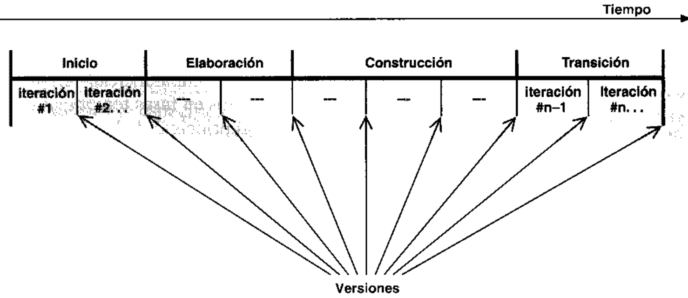

IN. del T. Tambien se suele utilizar e! termino "fase de comienzo".

# 1.5.1. El producto

Cada ciclo produce una nueva version del sistema, y cada version es un producto preparado parasu entrega. Consta de un cuerpo de codigo fuente incluido en componentes que puede compi-larse y ejecutarse, ademas de manuales y otros productos asociados. Sin embargo, el productoterminado no solo debe ajustarse a las necesidades de los usuarios, sino tambien a las de todoslos interesados, es decir, toda la gente que trabajara con el producto. El producto software de-beria ser algo mas que el codigo maquina que se ejecuta.

El producto terminado incluye los requisitos, casos de uso, especificaciones no funcionalesy casos de prueba. Incluye el modelo de la arquitectura y el modelo visual —artefactos mo-delados con el Lenguaje Unificado de Modelado. De hecho, incluye todos los elementos quehemos mencionado en este capitulo, debido a quc son esos elementos los que permiten a los in-teresados—(  clientes, usuarios, analistas, disenadores, programadores, ingenieros de prueba, ydirectores —especificar, disenar, implementar, probar y utilizar un sistema. Es mas, son esoselementos los que permiten a los usuarios utilizar y modificar el sistema de generacion engeneracion.

Aunque los componentes ejecutables sean los artefactos mas importantes desde la perspectivadel usuario, no son suficientes por si solos. Esto se debe a que el entorno cambia. Se mejoran lossistemas operativos, los sistemas de bases de datos y las maquinas que los soportan. A medidaque el objetivo del sistema se comprende mejor, los propios requisitos pueden cambiar. De hecho, el que los requisitos cambien es una de las constantes del desarrollo de sofiware. Al final.los desarrolladores deben afrontar un nuevo ciclo, y los directores deben financiarlo. Para llevara cabo el siguiente ciclo de manera eficiente, los desarrolladores necesitan todas las represen-taciones del producto software (Figura 1.4):

· Un modelo de casos de uso, con todos los casos de uso y su relacion con los usuarios.· Un modelo de analisis, con dos propositos: refinar los casos de uso con mas detalle y es-tablecer la asignacion inicial de funcionalidad del sistema a un conjunto de objctos queproporcionan cl comportamiento.· Un modelo de diseno que define: (a) la estructura cstatica del sistema en la forma de sub-sistemas, clases c interfaces y (b) los casos de uso reflejados como colaboraciones (Apen-dice A: vease tambien la Seccion 3. 1) entre los subsistemas, clases, c interfaces.· Un modelo de implementacion, que incluye componcntes (quc rcpresentan al codigofuente) y la correspondencia de las clases con los componentes.· Un modelo de despliegue ', que define los nodos fisicos (ordenadores) y la corresponden-cia de los componentes con csos nodos.· Un modelo de prueba, que describe los casos de prueba que verifican los casos dc uso.· Y, por supuesto, una representacion de la arquitectura.

El sisteima tambicn debe tener un modelo del dominio o modelo del negocio que describa elcontexto del negocio en el que se halla el sistema

Todos cstos modelos estan relacionados. Juntos, representan al sistema como un todo. Los2.3.7) hacia atras y hacia adelante, mediante enlaces hacia otros modelos. Por ejemplo, podemoshacer el seguimiento de un caso de uso (en el modelo de casos de uso) hasta una realizacion decaso de uso (en el modelo dc discno) y hasta un caso de prueba (en el modelo de prucba). La tra-Zabilidad facilita la comprension y el cambio.

# 1.5.2.  Fases dentro de un ciclo

Cada ciclo se desarrolla a lo largo del tiempo. Este tiempo, a su vez, se divide en cuatro fases.como se muestra en la Figura 1.5. A traves de una secuencia de modelos, los implicadosvisualizan lo que esta succdiendo en esas fases. Dentro de cada fase, los directores o los desa.rrolladores pueden descomponer adicionalmente el trabajo --en iteraciones con sus incrementosresultantes. Cada fase termina con un hito (Apendice C; vease tambien Capitulo 5). Cada hito sedetermina por la disponibilidad de un conjunto de artefactos; es decir, ciertos modelos o docu-mentos han sido desarrollados hasta alcanzar un cstado predefinido.

Los hitos tiencn muchos objetivos. El mas critico es que los directores deben tomar ciertasdecisiones cruciales antes de que el trabajo pueda continuar con la siguiente fase. Los hitostambien permiten a la direccion, y a los mismos desarrolladorcs, controlar el progreso del trabajosegun pasa por csos cuatro puntos clave. Al final, se obticne un conjunto de datos a partir del se-guimiento dcl tiempo y esfuerzo consumido en cada fasc. Estos datos son utiles en la estimaciondel tiempo y los recursos humanos para otros proyectos, en la asignacion de los recursos duranteel tiempo que dura el proyecto, y en el control del progrcso contrastado con las planificaciones.

La Figura I.5. muestra en la columna izquierda los flujos de trabajo -requisitos, analisis, di-senio, implementacion y prueba. Las curvas son una aproximacion (no deben considerarse muy li-teralmente) de hasta dondc sc llevan a cabo los flujos de trabajo en cada fase. Recuerdesc que cadafase sc divide normalmente en iteraciones o mini-proyectos. Una iteracion tipica pasa por los cin-co flujos de trabajo, como se muestra en la Figura 1.5 para una iteracion en la fase de elaboracion.

Durante la fase de inicio, se desarrolla una descripcion del producto final a partir de una bue.na idea y se presenta el analisis de negocio para el producto. Esencialmente, esta fase respondea las siguicntes preguntas:

· Cuales son las principales funciones del sistema para sus usuarios mas importantcs?

·:Como podria ser la arquitectura del sistema?

· :Cual es el plan de proyecto y cuanto costara desarrollar el producto?

La respuesta a la primera pregunta sc encuentra en un modelo de casos de uso simplificadoque contenga los casos de uso mas criticos. Cuando lo tengamos, la arquitectura cs provisional,y consiste tipicamente en un simple esbozo que muestra los subsistemas mas importantes. Enesta fase, se identifican y priorizan los riesgos mas importantes, se planifica cn detalle la fase deelaboracion, y se estima cl proyecto de manera aproximada.

Durante la fase de elaboracion, se especifican en detalle la mayoria de los casos de uso delproducto y se disena la arquitectura del sistema. La relacion entre la arquitectura del sistema yel propio sistema es primordial. Una manera simple de expresarlo es decir que la arquitcctura esanaloga al esqueleto cubierto por la piel pero con muy poco musculo (el software) entre los hue-sos y la piel solo lo necesario para permitir que el esqueleto haga movimientos basicos. El sis-tema es el cuerpo entero con esqueleto, piel, y musculos.

Por tanto, la arquitectura se expresa en forma de vistas de todos los modelos del sistema, loscuales juntos representan al sistema entero. Esto implica que hay vistas arquitectonicas del mo-delo de casos de uso, del modelo de analisis, del modelo de disenio, del modelo de implemen-tacion y modelo de despliegue. La vista del modelo de implementacion incluye componentespara probar que la arquitectura es ejecutable. Durante esta fase del desarrollo, se rcalizan los ca-sos de uso mas criticos que se identificaron en la fase de comienzo. El resultado de esta fase estina linea base de la arquitectura (Apendice C; vease tambien Seccion 4.4).

Al final de la fase de elaboracion, el director de proyecto esta en disposicion de planificar lasdamental es: son suficientemente estables los casos de uso, la arquitectura y el plan, y estan losriesgos suficientemente controlados como para que seamos capaces de comprometernos al de-sarrollo cntero mediante un contrato?

Durante la fase de construccion se crea el producto —se anaden los musculos (software ter-minado) al esqueleto (la arquitectura). En esta fase, la linea base de la arquitectura crece hastaconvertirse en el sistema completo. La descripcion evoluciona hasta convertirse en un produc-to prcparado para ser entregado a la comunidad de usuarios. El grueso de los recursos requeri-s  s e o  o       soestable, aunque los desarrolladores pueden descubrir formas mejores de estructurar el sistema,ya que los arquitectos recibiran sugerencias de cambios arquitectonicos de menor importancia.Al final de esta fase, el producto contiene todos los casos de uso que la direccion y el cliente hanacordado para el desarrollo de esta version. Sin embargo, puede que no esta completamente li-bre de defectos. Muchos de estos defectos se descubriran y solucionaran durante la fase de tran-sicion. La pregunta decisiva es: zcubre el producto las necesidades de algunos usuarios demanera suficiente como para hacer una primera entrega?

La fase de transicion cubre el periodo durante el cual el producto se convierte en versionbeta. En la version beta un numero reducido de usuarios con experiencia prueba el producto e in-forma de defectos y deficiencias. Los desarrolladores corrigen los problemas e incorporan al-gunas de las mejoras sugeridas en una version general dirigida a la totalidad de la comunidad deusuarios. La fase de transicion conlleva actividades como la fabricacion, formacion del cliente.el proporcionar una linea de ayuda y asistencia, y la correccion de los defectos que se encuentrentras la entrega. El equipo de mantenimiento suele dividir esos defectos en dos categorias: los quen    ndelta) y los que pueden corregirse en la siguiente version normal.

# 1.6. Un proceso integrado

El Proceso Unificado esta basado en componentes. Utiliza el nuevo estandar de modelado vi-sual, cl Lenguaje Unificado de Modelado (UML), y se sostiene sobre tres ideas basicas —casosde uso, arquitectura, y desarrollo iterativo e incremental. Para hacer que estas ideas funcionen,del ricgo, control de calidad, gestion de proyecto y control de la configuracion. El Proceso Uni-ficado ha establecido un marco de trabajo que integra todas esas diferentes facetas. Este marcode trabajo sirve tambien como paraguas bajo el cual los fabricantes de herramientas y los desa-rrolladores pueden construir herramientas que soporten la automatizacion del proceso entero, decada flujo de trabajo individualmente, de la construccion de los diferentes modelos, y de laintegracion del trabajo a lo largo del ciclo de vida y a traves de todos los modelos.

El proposito de este libro es describir el Proceso Unificado con un énfasis particular en las fa-cetas de ingenieria, en las tres ideas clave (casos de uso, arquitectura, y desarrollo iterativo e in-fases y los diferentes flujos de trabajo, pero no vamos a cubrir con gran detalle temas de gestionfiguracion, recogida de metricas y control de calidad, y solo trataremos brevemente la automa-tizacion del proceso.

# Las cuatro “p'' en el desarrollode software: Personas, ProyectoProducto y Proceso

1 resultado final de un proyecto software (Apendice C) es un producto que toma forma1 durante su desarrollo gracias a la intervencion de muchos tipos distintos de personas. Unproceso de desarrollo de software guia los esfuerzos de las personas implicadas en el pro-yecto, a modo de plantilla que explica los pasos necesarios para terminar el proyecto. Tipica-mente, cl proceso esta automatizado por medio de una herramienta o de un conjunto de ellasVease la Figura 2.1.

A lo largo de este libro utilizaremos los terminos personas, proyecto, producto, proceso(Apendice C) y herramientas, que definimos a continuacion:

· Personas. Los principales autores de un proyecto software son los arquitectos, desarro-lladores, ingenieros de prueba, y el personal de gestion que les da soporte, ademas de losusuarios, clientes, y otros interesados. Las personas son realmente seres humanos, a dife-rencia del termino abstracto trabajadores, que introduciremos mas adelante.

· Proyecto. Elemento organizativo a traves del cual se gestiona el desarrollo de software. Elresultado de un proyecto es una version de un producto.

· Producio. Artefactos que se crean durante la vida del proyecto, como los modelos (Apén-dice A), codigo fuente, ejecutables, y documentacion.

· Proceso. Un proceso de ingenieria de software es una definicion del conjunto completo deactividades necesarias para transformar los requisitos de usuario en un producto. Un pro.ceso es una plantilla para crear proyectos.

· Herramientas. Software que se utiliza para automatizar las actividades definidas en el pro.ceso.

# 2.1.  Las personas son decisivas

Hay personas implicadas en el desarrollo de un producto software durante todo su ciclo de vida.Financian el producto, lo planifican, lo desarrollan, lo gestionan, lo prueban, lo utilizan y sebenefician de él. Por tanto, el proceso que guia este desarrollo debe orientarse a las personas, esdecir, debe funcionar bien para las personas que lo utilizan.

# 2.1.1. Los procesos de desarrollo afectan a las personas

El modo en que se organiza y gestiona un proyecto software afecta profundamente a las perso-nas implicadas en él. Conceptos como la viabilidad, la gestion del riesgo, la organizacion de losequipos, la planificacion del proyecto y la facilidad de comprension del proyecto tienen unpapel importante:

· Viabilidad del proyecto. La mayoria de la gente no disfruta trabajando en proyectos que pa-recen imposibles -—nadie quiere hundirse con la nave. Como vimos en el Capitulo 1, unaaproximacion iterativa cn cl dcsarrollo permite juzgar pronto la viabilidad del proyecto.Los proyectos que no son viables pueden detenerse en una fase temprana, aliviando asf losproblemas de moral.ois  ou sos soi anb is ae e oo i nit o os ip uosi .lizados y reducidos, se sienten incomodos. La exploracion de los riesgos significativos enlas primeras fases atenua este problema.· Estructura de los equipos. La gente trabaja de manera mas eficaz en grupos pequenos decomo el analisis de un determinado riesgo, el desarrollo de un subsistema (Apendice A), 0el llevar a cabo una iteracion, proporciona esta oportunidad. Una buena arquitectura, coninterfaces bien definidas (Apendice A; vease tambien el Capitulo 9) entre subsistemas ycomponentes (Apendice A; vease tambien el Capitulo 10) hace posible una division del es-fuerzo de este tipo.

· Planificacion del proyecto. Cuando la gente cree que la planificacion de un proyecto no esrealista, la moral se hunde -—-la gente no quiere trabajar a sabiendas de que por mucho quelo intenten, nunca podran obtener los resultados deseados. Las tecnicas que se utilizan enlas fases de inicio y de elaboracion permiten a los desarrolladores tener una buenanocion de cual deberia ser el resultado del proyecto--- es decir, de lo que deberia hacer laversion del producto. Debido a que hay una sensacion adecuada de lo que deberia hacerel producto, puede crearse un plan de proyecto realista para el esfuerzo requerido, asi comouna definicion del tiempo necesario para lograr los objetivos, atenuando el problema del"'nunca acabaremos''.

quieren tener una comprension global. La descripci6n de la arquitectura proporciona unavision general para cualquiera que se encuentre implicado en el proyecto.

· Sensacion de cumplimiento. En un ciclo de vida iterativo, la gente recibe retroalimentacionfrecuentemente, lo cual a su vez, hace llegar a conclusiones. La retroalimentacion frecuentey las conclusiones obtenidas aceleran el ritmo de trabajo. Un ritmo de trabajo rapidocombinado con conclusiones frecuentes aumenta la sensacion de progreso de la gente.

# 2.1.2.  Los papeles cambiaran

Debido a que son las personas las que ejecutan las actividades clave del desarrollo de software,es necesario un proceso de desarrollo uniforme que este soportado por herramientas y un Len-guaje Unificado de Modelado (hoy disponible en UML) (Apéndice C), para hacer que las per-sonas sean mas eficaces. Ese proceso permitira a los desarrolladores construir un mejor softwareen terminos de tiempo de salida al mercado, calidad y costes. Les permite especificar losrequisitos que mejor se ajusten a las necesidades de los usuarios. Les permite elegir una ar-quitectura que permita construir los sistemas de forma economica y puntual. Un buen procesode software tiene otra ventaja: nos ayuda a construir sistemas mas complejos. Senialamos en elprimer capitulo que a medida que el mundo real se hace mas complejo, los clientes requeriransistemas software mas complejos. Los procesos de negocio y su correspondiente software ten-dran una vida mas larga. Debido a que los cambios en el mundo real seguiran sucediendodurante estos ciclos de vida, los sistemas software tendran que disenarse de un modo que les per-mita crecer durante largos periodos de tiempo.

Para comprender y dar soporte a esos procesos de negocio mas complejos y para imple-mentarlos en software, los desarrolladores deberan trabajar con muchos otros desarrolladores.Para trabajar eficazmente en equipos cada vez mas grandes, se necesita un proceso que sirvacomo guia. Esta guia tendra como resultado desarrolladores "que trabajan de manera mas inte-[ a n od b on e s sns ss   p s 'icliente. Un paso en esta direccion es el modelado de casos de uso, que centra el esfuerzo en loque el usuario necesita hacer. Otro paso es una arquitectura que permitira a los sistemas el con-tinuar su evolucion durante los anos venideros. Un tercer paso es la compra o reutilizacion detanto software como sea posible. Esto, a su vez, puede lograrse solo si hay un modo con-sistente de integrar componentes reutilizables con elementos de nuevo desarrollo.

En los anos venideros, la mayoria de los informaticos van a empezar a trabajar mas estre-proceso automatizado y a los componentes reutilizables. Las personas seran decisivas en el de-adecuadas es lo que nos lleva al éxito. El problema radica en hacerlas eficaces y permitir que sedediquen a lo que solo los seres humanos pueden hacer —ser creativos, encontrar nuevasoportunidades, utilizar la razon, comunicarse con los clientes y usuarios, y comprender rapida-mente un mundo cambiante.

# 2.1.3. Convirtiendo "recursos" en "trabajadores"

La gente llega a ocupar muchos puestos diferentes en una organizacion de desarrollo de softwa-re. Su preparacion para esos puestos requiere una formacion y un entrenamiento preciso, segui-o eun uoisiaredns epensape eun iod A siseue ja lod epeing uroeuaise esopepino un ap sopa id sd  n  b is a   o  as"latente" a un puesto concreto de "trabajador".

Hemos elegido la palabra trabajador (Apendice C) para denominar a los puestos a los cua-les se pueden asignar personas, y los cuales esas personas aceptan [4]. Un tipo de trabajador esun papel que un individuo puede desempenar en cl desarrollo de software, como puede ser unespecificador de casos de uso, un arquitecto, un ingeniero de componentes, o un ingeniero deprucbas de integracion. No utilizamos el termino rol (en lugar de trabajador) principalmente pordos motivos: tiene un significado preciso y diferente en UML, y el concepto de trabajador tienepapeles que cumple un trabajador. Un trabajador puede asumir roles en relacion con otros tra-puede participar en varios flujos de trabajo y puede asumir un rol diferente en cada uno de ellos.

Cada trabajador (un trabajador concreto) es responsable de un conjunto completo de activi-dades, como las actividades necesarias para el disenio de un subsistema. Para trabajar eficaz-mente, los trabajadores necesitan la informacion requerida para llevar a cabo sus actividades.Necesitan comprender cuales son sus roles en relacion con los de otros trabajadores. Al mismotiempo, si tienen que hacer su trabajo, las herramientas que emplean deben ser las adecuadas.Las herramientas no solo deben ayudar a los trabajadores a llevar a cabo sus propias actividades,sino que tambien deben aislarles de la informacion que no les sea relevante. Para lograr estos ob-jetivos, el Proceso Unificado describe formalmente los puestos -—es decir, los trabajadoresque las personas pueden asumir cn el proceso.

La Figura 2.2 ilustra como una persona puede ser varios trabajadores dentro de un proyecto.

Un trabajador también puede representar a un conjunto de personas que trabajan juntas. Por

Cada trabajador tiene un conjunto de responsabilidades y lleva a cabo un conjunto de acti-vidades en el desarrollo de software.

Al asignar los trabajadores a un proyecto, el jefe del proyecto debe identificar las aptitudes delas personas y casarlas con las aptitudes requeridas de los trabajadores. Esta no es una tareafacil, en especial si es la primera vez que se utiliza el Proceso Unificado. Se deben casar las ha-bilidades de los recursos (las personas reales) con las competencias especificadas por los dife-rentes trabajadores que el proyecto necesita. Las aptitudes requeridas por algunos trabajadoresla experiencia. Por ejemplo. las habilidades necesarias para ser un especificador de casos de uso

pueden obtenerse mediante formacion, pero las de un arquitecto se adquieren normalmente de laexperiencia.

Una persona puede ser muchos trabajadorcs durante la vida de un proyecto. Por ejemplo,Maria pucde comenzar como especificador de casos de uso. y despues pasar a ser ingeniero decomponentes.

Al asignar recursos, el jefe de proyecto deberia minimizar el trasiego de artefactos de un re-curso a otro de manera quc cl flujo del proceso sea tan continuo como se pueda. Por ejemplo. elingeniero de casos de uso del caso de uso Sacar Dinero (Apendice A; vease tambien el Capitu-lo 7) obtendra gran cantidad de conocimiento sobre las responsabilidades de la clase Cuenta(Apendice A), asi que Cl o ella seria una eleccion logica para ser el ingeniero de componentes dela clase Cuenta. La alternativa seria la de formar a una nueva persona para hacer el trabajo, locual es posible, pero seria menos eficiente por la perdida de informacion. por el riesgo de unamala comprension, etc.

# 2.2. Los proyectos construyen el producto

Un proyecto de desarrollo da como resultado una nueva version de un producto. El primer pro)yecto dentro del ciclo de vida (es decir, el primer ciclo de desarrollo, llamado a veces en inglés'green-field project", proyecto inicial o innovador en castellano) desarrolla y obtiene el sistema0 producto inicial. Vease [9l y [10] para una presentacion mas completa de la gestion deproyecto.

A traves de su ciclo de vida, un equipo de proyecto debe preocuparse del cambio, las itera-ciones, y el patron organizativo dentro del cual se conduce el proyecto:

· Una secuencia de cambio: Los proyectos de desarrollo de sistemas obtienen productoscomo resultados, pero el camino hasta obtenerlos es una serie de cainbios. Este hecho de lavida del proyecto debe tenerse en mente mientras los trabajadores progresan a traves de lasfases e iteraciones. Cada ciclo, cada fase y cada iteracion modifican el sistema de ser unacosa a otra distinta. El primer ciclo de desarrollo es un caso especial que convierte cl sis-tema de nada en algo. Cada ciclo lleva a una version, y mas alla de una secuencia de ciclosel cambio continua por generaciones.

· Una serie de iteraciones: Dcntro de cada fase de un ciclo, los trabajadorcs llevan a cabo lasactividades de la fase a traves de una serie dc iteraciones. Cada iteracion implementa unconjunto de casos de uso relacionados o atenua algunos riesgos. En una iteracion los de-sarrolladores progresan a traves de una serie de flujos de trabajo: requisitos. diseno, im-plemcntacion y prueba. Debido a que cada iteracion pasa por cada uno de csos flujos dctrabajo, podemos pensar en una iteracion como si fuese un miniproyecto.

· Un patron organizativo: Un proyccto implica a un equipo de personas asignadas para lo-grar un resultado dentro de las restriccioncs del negocio, es decir, tiempo, coste y calidad.tron dentro del cual las pcrsonas cn su papel dc trabajadores ejecutan un proyccto. Estepatron o plantilla indica los tipos dc trabajadores que el proyeclo neccsita y los artefactospor los cuales hay quc trabajar. El proceso tambien ofrece un monton de guias, heuristicasy practicas de documentacion que ayudan a hacer su trabajo a las personas asignadas.

# 2.3. El producto es mas que codigo

En cl contexto del Proceso Unificado, el producto quc se obtienc ecs un sisteima softwarc. El tér-mino produicto aqui hace refcrencia al sistema entero, y no solo al codigo que se cntrega

# 2.3.1. Que es un sistema software?

: Un sistema software es cl codigo maquina, los ejecutables? Lo cs, por supuesto, pero que esel codigo maquina? ;Es una descripcion! Una descripcion en forma binaria que pucde "ser

Un sistema software es el codigo fuente? Es decir. es una descripcion escrita por progra-madores que puede leer y comprendcr un compilador? Si, puede que csta sea la respuesta.

Podermos seguir de csta forma haciendonos preguntas similares sobre el diseno de un sistemasofiware cn terminos de subsistemas. clases, diagramas de interaccion (Apendice A), dia-gramas de estados (Apendice A), y otros artefactos. Son ellos el sistema? Si, son parte de él.&Que hay de los requisitos, pruebas, venta, produccion, instalacion y operacion? &Son cl siste-ma? Si. tambien son partc del sistcma.

Un sistema cs todos los artefactos que se necesitan para representarlo en una forma com-prensible por maquinas u hombres, para las maquinas, los trabajadores y los interesados. Lasmaquinas son las herramientas. compiladores, u ordenadores destinatarios. Entre los trabajado-res tenemos directores, arquitectos. desarrolladores, ingenieros de prucba, personal de marketing.administradores. y otros. Los interesados son los inversores, usuarios, comerciales, jefes de pro-yccto, directores de linea de producto, personal de produccion, agencias de regulacion, etc.

En este libro, utilizaremos el termino trabajador para cstas tres categorias a la vez, a menosque indiquemos explicitamentc otra cosa.

# 2.3.2.Artefactos

ducida, cambiada o utilizada por los trabajadores en el desarrollo del sistema. Algunos ejemplosdc artcfactos son los diagramas UML y su texto asociado, los bocetos de la interfaz dc usuarioy los prototipos (Apendice C; vease tambien los Capitulos 7 y 13), los componentes. los plancsde prueba (vease Capitulo 11) y los procedimientos de prueba (vease Capitulo 11).

Basicamente, hay dos tipos de artefactos: artefactos de ingenicria y artefactos de gestion. Estelibro se centra en los artefactos de ingenieria creados durante las distintas fases del proceso (requisitos, analisis, disefo, implementacion y prueba).

Sin embargo. el desarrollo de software también requiere artefactos de gestion. Varios de es-tos artefactos tienen un tiempo dc vida corto --solo duran lo que dure la vida del proyeclo. Acstc conjunto pertenecen arlefactos como el analisis del negocio, el plan de desarrollo (inclu-ycndo cl plan de versiones e iteraciones), un plan para la asignacion de personas concretas a tra-bajadores (es decir. al diferentcs puestos o responsabilidades cn cl proyecto), y el disenio de lasactividades de los trabajadores cn cl plan. Estos artefactos se describcn mediante texto o dia-mido por el cquipo de desarrollo con los inversores. Los artefactos de gestion tambien incluyenlas especificaciones del entorno dc desarrollo-— el software de automatizacion del proceso asicomo la plataforma hardware necesaria para los dcsarrolladores y necesaria como repositorio delos arlefactos de ingenieria.

# Un sistema posee una coleccion de modelos

El tipo de artefacto mas interesantc utilizado en el Proceso Unificado es el modelo. Cada tra-bajador necesita una perspectiva difercnte dcl sistema (véase la Figura 2.3). Cuando disenamoscl Proccso Unificado, identificamos todos los trabajadores y cada una de las perspcctivas que po-en unidades mas grandes, es decir, modelos, de modo que un trabajador pucde tomar una pers-pectiva concrcta del conjunto de modelos.

lizando distintos modelos para describir todas las perspectivas diferentes del sistema. La elec-

cion de los modelos para un sistema es una de las decisiones mas importantes del equipo dedesarrollo.

En el Capitulo 1 presentamos los modelos principales del Proceso Unificado (vease la Fi-gura 2.4).

El Proceso Unificado proporciona un conjunto de modelos cuidadosamente seleccionado conel cual comenzar. Este conjunto de modelos hace claro el sistema para todos los trabajadores, in-cluycndo a los clientcs, usuarios y jefes de proyecto. Fue clegido para satisfacer las necesidadesde informacion de esos trabajadores.

# 2.3.4.  Qué es un modelo?

Un modelo es una abstraccion del sistema, cspecificando el sistema modelado desde un cierto odfe rod 'sa eisa ap ound un lil uioonsqe ap pau opuaiap un ua A esia ap ounduna vista de especificacion o una vista de diseno del sistema.

Los modelos son abstracciones del sistema que construyen los arquitectos y desarrolladores.Por ejemplo, los trabajadores que modelan los requisitos funcionales piensan en el sistema conlos usuarios fuera de cl y con los casos de uso en su interior. No se preocupan de como es el sis-tema por dentro, solo se preocupan de lo que puede hacer para sus usurarios. Los trabajadoresque construyen el diseno piensan en los elementos estructurales como subsistemas y clases;piensan en terminos de como esos elementos funcionan en un contexto dado y como colaboranpara proporcionar los casos de uso. Comprenden como funcionan esos clementos abstractos, y

# 2.3.5.  Cada modelo es una vista autocontenida del sistema

Un modelo es una abstraccion semanticamente cerrada del sistema. Es una vista autocontenidaen el sentido de que un usuario de un modelo no necesita para interpretarlo mas informacion (deotros modelos).

La idea de ser autocontenido significa que los desarrolladores trataron de que hubiera unasola interpretacion de lo que ocurrira en el sistema cuando se dispare un evento descrito en elmodelo. Ademas dcl sistema, un modelo debe describir las interacciones entre el sistema y losque le rodean. Por tanto, aparte del sistema que se csta modelando, el modelo tambien deberiaincluir clementos que describan partes rclevantes de su entorno, es decir, actores (Apendice A;vease tambien el Capitulo 7).

La mayoria de los modelos de ingenieria se definen mediante un subconjunto de UML cui-dadosamente seleccionado. Por ejemplo, el modelo de casos de uso comprende a los casos deuso y los actores. Esto es basicamente lo que un lector necesita para comprenderlo. El modelo dediseno describe los subsistemas y las clases del sistema y como interactuan para llevar a cabo loscasos de uso. Tanto el modelo de casos de uso como el modelo de diseno describen dos inter-pretaciones, diferentes pero mutuamente consistentes, de lo que el sistema hara dado un conjuntode estimulos externos provinientes de los actores. Son diferentes debido a que estan pensadospara ser utilizados por diferentes trabajadores con diferentes tareas y objetivos. El modelo de ca-sos de uso es una vista externa del sistema, el modelo de diseno es una vista interna. El modelode casos de uso captura los usos del sistema, mientras que el modelo de disenio representa laconstruccion del sistema.

# 2.3.6.  Dentro de un modeio

Un modelo siempre identifica el sistema que esta modelando. Este elemento del sistema es portanto el contenedor de los demas elementos. El subsistema de mas alto nivel (Apendice B)representa al sistema en construccion. En el modelo de casos de uso, el sistema contiene casosde uso; en el modelo de diseno, contiene subsistemas, interfaces y clases. Tambien contiene co-laboraciones (Apendice A) que identifican a todos los subsistemas o clases participantes, y puede contener mas cosas, como diagramas de estado o diagramas de interaccion. En el modelo dediseno cada subsistema puede ser contenedor de construcciones similares. Esto implica que hayuna jerarquia de elementos en este modelo.

# 2.3.7.  Relaciones entre modelos

Un sistema contiene todas las relaciones (Apendice A) y restricciones entre elementos incluidosen diferentes modelos [1]. Por tanto un sistema no es solo la coleccion de sus modelos sino quecontiene tambien las relaciones entre ellos.

Por ejemplo, cada caso de uso en el modelo de casos de uso tiene una relacion con una co-laboracion en el modelo de analisis (y viceversa). Esa relacion se llama en UML dependencia des s i s h   '  1i   d)  s oun solo sentido.

Tambien hay, por ejemplo, trazas entre las colaboraciones del modelo de diseno y las colabo-raciones en el modelo de analisis, y entre los componentes en el modelo de implementacion y lossubsistemas en el modelo de diseno. Por tanto, podemos conectar elementos en un modelo a ele-mentos en otro mediante trazas.

El hecho de que los elementos en dos modelos esten conectados no cambia lo que hacen enlos modelos a los que pertenecen. Las relaciones de traza entre elementos en modelos distintos

no anaden informacion semantica para ayudar a comprender los propios modelos relacionados;simplemente los conectan. La posibilidad de crear trazas es muy importante en el desarrollo desoftware por razones como la comprensibilidad y la propagacion de los cambios.

# 2.4.  El proceso dirige los proyectos

La palabra proceso es un termino demasiado utilizado. Se utiliza cn muchos contextos diferen-tes, como cuando decimos proceso de negocio, proceso de desarrollo y proceso softwarc, conmuchos significados diferentes. En el contexto del Proceso Unificado, el termino se refiere a losprocesos "de negocio" claves en una empresa de desarrollo de software, es decir, en una orga-nizacion que desarolla y da soporte al software (sobre el diseno de una empresa de desarrollo desoftware, vease [2]). En estos negocios tambien existen otros procesos, como el proceso de so-porte, que interactua con los usuarios de los productos, y un proceso de venta, que comienza conun pedido y cntrega un producto. Sin embargo, en este libro nos centramos en el proceso de de-sarrollo [3].

# 2.4.1.  El proceso: una plantilla

puede reutilizarse para crear instancias de ella. Es comparable a una clase, que puede utilizarsepara crear objetos en el paradigma de la orientacion a objetos. Instancia del proceso es un si-nonimo de proyecto.

En este libro, un proceso de desarrollo de software es una definicion del conjunto completode actividades necesarias para convertir los requisitos de usuario en un conjunto consistente deartefactos que conforman un producto software, y para convertir los cambios sobre esos requi-sitos en un nuevo conjunto consistente de artefactos.

La palabra requisito se utiliza con un sentido general, refiriéndose a “necesidades". Al prin-cipio, estas necesidades no necesariamente se entienden en su totalidad. Para capturar estos re-quisitos, O necesidades, de una forma mas completa, tenemos que comprender con mayor am-plitud el negocio de los clientes y el entorno en que trabajan sus usuarios.

El resultado de valor anadido del proceso es un conjunto consistente de artefactos, una lineabase que conforma una aplicacion o una familia de ellas que forman un producto software.

Un proceso es una definicion de un conjunto de actividades, no su ejecucion.

Por ultimo, un proceso cubre no solamente el primer ciclo de desarrollo (la primera version)sino tambien los ciclos posteriores mas comunes. En versiones posteriores, una instancia del pro-ceso toma cambios incrementales en los requisitos y produce cambios incrementales en elconjunto de artefactos.

# 2.4.2.  Las actividades relacionadas conforman flujosde trabajo

p on n apop oqen ap son ap souei e sa osod un soosp anb u opotrabajo es un conjunto de actividades. 2Cual es el origen de esos flujos de trabajo? No losobtenemos mediante division del proceso en un numero de subprocesos mas pequenios que in-teractuan. No utilizamos diagramas de flujo tradicionales para describir como descomponemosel proceso en partes mas pequenas. Estas no son formas eficaces de disenar la estructura de flu-jos de trabajo.

En cambio, identificamos primero los distintos tipos de trabajadores que participan en el pro-ceso. Despues identificamos los artefactos que necesitamos crear durante el proceso para cadaA ae un ua rroeu epand ss snb oe sh ou oisndns rod uioopi eisg opeleqen op odncerrar de ojos. El Proceso Unificado se basa en una amplia experiencia para encontrar el con-junto factible de artefactos y trabajadores. Una vez que lo hemos identificado, podemos describircomo fluye el proceso a traves de los diferentes trabajadores, y como ellos crean, producen y uti-lizan los artefactos de los demas. En la Figura 2.6 mostramos un diagrama de actividad(Apendice A) que describe el flujo de trabajo en el modelado de casos de uso. Observense las"calles" (Apendice A) ——hay una para cada trabajador—, como fluye el trabajo de un trabajadora otro, y como los trabajadores de este flujo llevan a cabo las actividades (representadas por rue-das dentadas).

A partir de aqui podemos identificar facilmente las actividades que estos trabajadores debenrealizar cuando se activan. Estas actividades por trabajador son trabajos significativos para unap o n  za n p s d u o  e  s

En otras palabras, describimos cl proceso entero en partes llamadas flujos de trabajo (Apen-dice C). En terminos de UML, un flujo de trabajo es un estereotipo (Apendice A) de colabora-cion, en el cual los trabajadores y los artefactos son los participantes. Por tanto, los trabajadores( s   d  o  o    a scn otros flujos de trabajo. Usaremos para los flujos de trabajo la notacion de la Figura 2.7.

Un ejemplo de un flujo de trabajo es el flujo de trabajo de los requisitos. Incluye a los si-de interfaz de usuario. Y los siguientes artefactos: modelo de casos de uso, caso de uso, y otros.Otros ejemplos de trabajadores son: ingenieros de componentes e ingenieros de pruebas de in-tegracion. Otros ejemplos de artefacto son las realizaciones de caso de uso (Apendice B; véa-se también los Capitulos 8 y 9), clases, subsistemas e interfaces.

# 2.4.3.  Procesos especializados

Ningun proceso de desarrollo de software es de aplicabilidad universal! Los procesos varianporque tienen lugar en diferentes contextos, desarrollan diferentes tipos de sistemas, y se ajus-tan a diferentes tipos de restricciones del negocio (plazos, costes, calidad y fiabilidad). Porconsiguiente, un proceso de desarrollo de software del mundo real debe ser adaptable y confi-o   d   s     dEl Proceso Unificado se disen6 para poder ser adaptado (sobre el diseno del proceso, vease [6]). EsProceso Unificado en algun momento lo especializara para ajustarlo a su situacion (es decir, sutipo de aplicacion, su plataforma, etc.) (sobre la especializacion de un proceso, vease [8]).

0 de organizacion. Al mismo tiempo, es deseable que el proceso sea, al menos, completamenteconsistente dentro de una organizacion. Esta consistencia permitira el intercambio de compo-nentes, una transicion eficaz de personas y directivos entre proyectos, y el logro de conseguirque las metricas sean comparables.

Los factores principales que influyen en como se diferenciara el proceso son:

· Factores organizativos: La estructura organizativa, la cultura de la empresa, la organiza-cion y la gestion del proyecto, las aptitudes y habilidades disponibles, experiencias previasy sistemas software existentes.· Factores del dominio: El dominio de la aplicacion, procesos de negocio que se deben so-· Factores del ciclo de vida: El tiempo de salida al mercado, el tiempo de vida esperado delsoftware, la tecnologia y la experiencia de las personas en el desarrollo de software, y lasversiones planificadas y futuras.· Factores tecnicos: Lenguaje de programacion, herramientas de desarrollo, base de datos,cion.

Estas son las causas. &Que efecto tendran? Bien, puede decidir eliminar trabajadores y arte--u s osp p sao e nof sne as anb eed opon osd rp soduras. Tambien puede ocurrir que extienda el proceso con trabajadores o artefactos nuevos一proyecto. Tambien puede cambiar la forma en que piensa que un determinado artefacto deberiadescribirse; puede imponer una estructura diferente a su definicion. Nuestra experiencia esque la gente en los primeros proyectos utiliza mucho lo que sugiere el Proceso Unificado. A me-dida que transcurre el tiempo y ganan mas experiencia, desarrollan sus propias extensionessecundarias.

:Que tiene el diseno del Proceso Unificado que le permite ser especializado [6]? La respuestaque son, en efecto, objetos: casos de uso, colaboraciones y clases. Por supuesto, las clases aquino son software sino objetos de negocio, es decir, trabajadores y artefactos. Pueden especiali-zarse o intercambiarse con otros sin cambiar el diseno del proceso. En capitulos posteriorescuando describamos los flujos de trabajo, vercmos como utilizamos objetos para describirlos.Esos objetos son trabajadores y artefactos

# 2.4.4.  Meritos del proces0

ficios:

desarrollar el producto.· Los desarrolladores pueden comprender mejor lo que los otros estan haciendo —en mo-mentos al principio o al final del proyecto, en proyectos similares en la misma empresa, endiferentes ubicaciones geograficas, e incluso en proyectos de otras empresas.· Los supervisores y directores, incluso los que no entienden el codigo, pueden comprenderlo que los desarrolladores estan haciendo gracias a los esquemas de la arquitectura' · Los desarrolladorcs, los supervisores y los directores pueden cambiar de proyecto o de· La formacion puede estandarizarse dentro de la empresa, y puede obtenerse de companeros o de cursos breves.· El devenir del desarrollo del software es repetible, es decir, puede planificarse y estimarse

A pesar de estas ventajas de un proceso comun, hay quien insiste en que un proceso comunno resuelve los "problemas verdaderamente dificiles". A esto simplemente contestamos: “"porsupuesto que no". Es la gente la que realmente resuelve los problemas. Pero un buen procesoayuda a la gente a sobresalir como equipo. Comparemoslo con una organizacion de operacionesmilitares. La batalla siempre sc rcduce a personas que hacen cosas, pero el resultado tambien sedecide por la eficacia de la organizacion.

# 2.5. Las herramientas son esenciales en el proceso

Las herramientas soportan los procesos de desarrollo de software modernos. Hoy, es impensa-ble desarrollar software sin utilizar un proceso soportado por herramientas. El proceso y las he-rramientas vienen en el mismo paquete: las herramientas son esenciales en el proceso [5], [7]

# 2.5.1.  Las herramientas influyen en el proceso

El proceso se ve influido fuertemente por las herramientas. Las herramientas son buenas parade informacion y para guiarnos a lo largo de un camino de desarrollo concreto.

Con poco soporte por herramicntas, un proceso debe sostenerse sobre gran cantidad de tra-bajo manual y sera por tanto menos formal. En la practica, la mayoria del trabajo formal debetice la consistencia a lo largo del ciclo de vida, sera dificil mantener actualizados los modelos yla implementacion. El desarrollo iterativo e incremental sera mas dificil, acabara siendo incon-asi la consistencia. Esto 6ltimo podria disminuir la productividad del equipo de manera signi-ficativa. El equipo tendria que hacer manualmente todas las comprobaciones de consistencia.Esto es muy dificil, si no imposible. por lo que tendriamos muchas fisuras en los artefactos de-sarrollados. Y hacerlo de cse modo requeriria mas tiempo de desarrollo.

Las herramientas se desarrollan para automatizar actividades, de manera completa o parcial.da que introducimos soporle por herramientas, obtenemos un proceso diferente, mas formal.Podemos incluir nuevas actividades que seria poco practico realizar sin herramientas. Podemostrabajar de una manera imas precisa durante el ciclo de vida cntero: podemos utilizar un lenguajede modelado formal como UML para asegurar que cada modelo es consistente internamente ycn relacion con otros modelos. Podemos utilizar un modelo y a partir de él generar partes de otromodelo (por ejemplo, del diseno a la implementacion y vicevcrsa).

# 2.5.2.  El proceso dirige las herramientas

El proceso, tanto si se define explicita como implicitamente, especifica la funcionalidad de lasherramientas, es decir, los casos de uso de las herraimicntas. El hecho de que existe un procesoautomatizar tanto como sea posible del proceso.

casos de uso necesita cada usuario y que artcfactos necesita manejar. Un proceso automati-de los trabajadores. y proporciona una manera de comprobar la consistencia de todos los arte-factos.

Las herramientas que implementan un proceso automatizado deben ser ficiles de usr. Ha-cerlas muy manejables significa que los desarrolladores de hcrramientas deben considerar se-riamente la forma en que se Heva a cabo el desarrollo de software. Por ejemplo, tcomo afrontaraun trabajador una determinada tarea? &Como se dara cuenta de como le pucde ayudar la herra-mienta? Que tareas hara con frecuencia y por tanto, merecen la pena ser automatizadas? tQuetareas son poco frccuentes y quiza no merece la pena incluir en una herramienta? Como puedeoos nb suod seaen si ta odn ns adnoo anb ned nopefeqen un e rina nuq eél puede hacer, ocupandose la herramienta del resto?

Para responder a preguntas como éstas, la herramienta debc ser sencilla de comprender ymanejar para los trabajadores. Es mas, para que merezca la pena el tiempo que se tarda en aprcn-derla, debe proporcionar un incremento de productividad sustancial.

Hay razones cspeciales para el objetivo de la facilidad dc uso. Los trabajadores deben ser ca-paces de probar diferentes alternativas y deberian poder tantear los disenos candidatos para cadaalternativa con facilidad. Deberian ser capaces de elegir una aproximacion y probarla. Si resul-berian permitir a los trabajadores reutilizar tanto como sea posiblc; no deberian comenzar todode nuevo para cada alternativa probada. En resumen, es esencial que las herramientas seancapaces tanto de soportar Ia automatizacion de actividades repetitivas como de gestionar lainformacion representada por la serie de modelos y artcfactos, fomentando y soportando lasactividades creativas quc son cl nucleo fundamental del desarrollo.

# 2.5.3.  El equilibrio entre el proceso y las herramientas

Por tanto, dcsarrollar un proceso sin pensar como se automatizara es un mero ejercicio acadé-mico. Dcsarrollar herramientas sin saber que proceso (marco de trabajo) van a soportar puede

Por un lado, el proceso dirige el desarrollo de las herramientas. Por otro lado, las herramientasdirigen el desarrollo del proceso. El desarrollo del proceso y su soportc por hcrramicntas debctener lugar de imancra simultanca. En cada version del proceso debe haber tambien una versi6nde las herramientas. En cada version debe darse este equilibrio. Alcanzar casi el ideal de esteequilibrio nos llevara varias itcracioncs, y las sucesivas iteraciones deben guiarse por la retroal-limcntacion de los usuarios entre versiones.

mcro? En el caso de las herramientas, muchas de ellas en las ultimas decadas han llegado antesde tiempo. El proceso aun no estaba bien desarrollado. En consecuencia, las herramientas nofuncionaban tan bien como se csperaba cn los proccsos, bastante mal planificados, cn los cualeslos usuarios intcntaron aplicarlas. Muchos de nosotros habiamos perdido la fe en las herra-deben soportar un proceso bien pensado.

Queremos explicar este tema con la mayor claridad: el desarrollo con éxito de una automa-para todo el mundo. Si aun alberga una sombra de duda. preguntese si seria posible desarrollarun soporte informatico para los proccsos de negocio cn un banco sin conocer cuales son.

# 2.5.4.  El modelado visual soporta UML

Hasta aqui solo hemos dicho que las herramientas son importantes para llevar a cabo el propo.sito del proceso.

Vamos a examinar un ejemplo significativo de una herramienta en el contexto del soporte delProceso Unificado. Nuestro ejemplo es la herramienta de modelado para UML. UML es un len-guaje visual. Como tal, se le suponen caracteristicas comunes en muchos productos de dibujo.esas caracteristicas, UML definc reglas sintacticas quc cspecifican como combinar clementos dcllenguaje. Por tanto, la herramienta debe ser capaz de garantizar que se cumplen esas reglas. Estaposibilidad esta fuera del alcance de los productos de dibujo habituales, donde no se comprue-ban reglas.

Desafortunadamente, hacer cumplir reglas sintacticas de este tipo sin excepcion haria que lasera con frecuencia sintacticamente incorrecto, y la herramienta debe poder permitir incorecciones sintacticas en este modo. Por ejemplo, debe permitirse incluir mensajes en un diagramab  s       soperacion para la clase.

UML incluye un cierto numero de reglas semanticas que tambien requieren soporte. Estas he-S  no a o p   p o s o o o oaerrores comunes, o buscan faltas de complecion semanticas o sintacticas. En resumen, la herra-mienta de modelado debe incorporar mas que conocimicnto de UML; debe permitir que losdesarrolladores trabajen creativamente con UML.

g o p  u   u   ab  o suoportunidad de un soporte mejor es debida en parte a la definicion precisa de UML. Tambienpuede atribuirse al hecho de que UML es hoy un estandar industrial ampliamente utilizado. Enmodelado diferentes, el juego esta ahora cn cncontrar al que mejor soporte UML. Este nuevojuego es mejor para los usuarios y clientes del software.

UML es solo el lenguaje de modelado. No define un proceso que diga como utilizar UMLpara desarrollar sistemas software. La herramienta de modelado no tiene que obligar a utilizar un

# 2.5.5.  Las herramientas dan soporte al ciclode vida completo

· Gestion de requisitos: Se utiliza para almacenar, examinar, revisar, hacer el seguimientoy navegar por los diferentes requisitos de un proyecto software. Un requisito deberia tenerun estado asociado, y la herramienta dcberia permitir hacer el seguimiento de un requisitodesde otros artefactos del ciclo de vida, como un caso de uso o un caso de prueba (vease elCapitulo 11).

· Modelado visual: Se utiliza para automatizar el uso de UML, es decir, para modelar y en-samblar una aplicacion visualmente. Con esta herramienta conseguimos la integracion conentornos de programacion y aseguramos que el modelo y la implementacion siempre sonconsistentes.

· Herramientas de programacion: Proporciona una gama de herramientas, incluyendo edi-tores, compiladores, depuradores, detectores de errores y analizadores de rendimiento.· Aseguramiento de la calidad: Se utiliza para probar aplicaciones y componentes, es decir.para registrar y ejecutar casos de prueba que dirigen la prueba de un IGU y de las interfa-ces de un componente. En un ciclo de vida iterativo, la prueba de regresion es aun masesencial que en el desarrollo convencional. La automatizacion de los casos de prueba esla aplicacion cuando la estan utilizando 1o.o00 usuarios concurrentes? Queremos saber larespuesta a esta pregunta antes de entregarla al usuario numero 10.000.

Ademas de estas herramientas orientadas a la funcionalidad, hay otras herramientas que abar-can todo el ciclo de vida. Estas herramientas incluyen las de control de versiones, gestion de lacion de procesos.

# 2.6. Referencias

[1] OMG Unified Modeling Language Specification. Object Management Group, Framingham, MA, 1998. Internet: www.omg.org.[2] Ivar Jacobson, Martin Griss, and Patrik Jonsson, Software Reuse: Architecture, Processand Organization for Business Success, Reading, MA: Addison-Wesley, 1997.[3] Watts S. Humphrey, Managing the Software Process, Reading. MA: Addison-Wesley.1989.[4] Ivar Jacobson, Maria Ericsson, and Agneta Jacobson, The Object Advantage: BusinessProcess Reengineering with Object Technology, Reading, MA: Addison-Wesley, 1995.[5]  Ivar Jacobson and Sten Jacobson, “"Beyond methods and CASE: The software engineeringprocess with its integral support environment', Object Magazine, January 1995.[6] Ivar Jacobson and Sten Jacobson, "Designing a Software Engineering Process", Objec!Magazine, June 1995.September 1995.[8]  Ivar Jacobson and Sten Jacobson, "Building your own methodology by specializing amethodology framework", Object Magazine, November-December 1995.[9] Grady Booch, Object Solutions: Managing the Object-Oriented Project, Reading, MA:Addison-Wesley, 1996.[10] Walker Royce, Software Project Management: A Unified Framework, Reading, MA: Ad-dison-Wesley, 1998

# Un proceso dirigido por casosdeuso

11 objetivo del Proceso Unificado es guiar a los desarrolladores en la implementacion y1 distribucion eficiente de sistemas que se ajusten a las necesidades de los clientes. LaIeficiencia se mide en terminos de coste, calidad, y tiempo de desarrollo. El paso desde ladeterminacion de las necesidades del cliente hasta la implementacion no es trivial. En primerIugar, las necesidades del cliente no son faciles de discernir. Esto nos obliga a que tengamosalgun modo de capturar las necesidades del usuario de forma que puedan comunicarse facil-mente a todas las personas implicadas en el proyecto. Despues, debemos ser capaces de disenaruna implementacion funcional que se ajuste a esas necesidades. Por ultimo, debemos verificarque las necesidades del cliente se han cumplido mediante la prueba del sistema. Debido a estacomplejidad, el proceso se describe como una serie de flujos de trabajo que construyen elsistema gradualmente.

Como dijimos en el Capitulo 1, el Proceso Unificado esta dirigido por los casos de uso, cen-trado cn la arquitectura y es iterativo e incremental. En este capitulo examinaremos el aspectodirigido-por-casos-de-uso del Proceso Unificado, presentado por primera vez en [1] y explicadoen mas profundidad en [2j. Los aspectos de centrado en la arquitectura e iterativo e incrementalson el tema de los Capitulos 4 y 5, respectivamente. Gracias a la division de la explicacion, es-peramos comunicar la idea de desarrollo dirigido por casos de uso mas simple y claramente.o  s  o  d    s  odisenar subsistemas con una alta cohesion, a como desarrollar buenos componentes de implementacion (vease la Secci6n 10.3.2), y a como 1llevar a cabo otros tipos de pruebas. Estos temasno contribuyen a la explicacion de los casos de uso y a como estos dirigen el trabajo de desa-rrollo, por lo que posponemos su explicacion detallada hasta la Parte II.

La Figura 3.1 muestra la serie de flujos de trabajo y modelos del Proceso Unificado. Losdesarrolladores comienzan capturando los requisitos de cliente en la forma de casos de uso encl modelo de casos de uso. Despues analizan y disenan el sistema para cumplir los casos de uso,creando cn primer lugar un modelo de analisis, después uno de diseno y despues otro deimplementacion, el cual incluye todo el codigo, es decir, los componentes. Por iltimo, losdesarrolladores preparan un modelo de prueba que les permite verificar que el sistemaproporciona la funcionalidad descrita en los casos de uso. Todos los modelos se relacionan conlos otros mediante dependencias de traza. El modelo de implementacion es el mas formal,mientras que el modelo de casos de uso es el menos formal, en el sentido de poder ser inter-pretado por la maquina, es decir, las partes del modelo de implementacion pueden compilarsey enlazarse produciendo ejecutables, mientras que el modelo de casos de uso se describefundamentalmente mediante lenguaje natural.

Los casos de uso han sido adoptados casi universalmente para la captura de requisitos desistemas software en general, y de sistemas basados en componentes en particular [6], pero losde desarrollo en su totalidad. Los casos de uso son la entrada fundamental cuando se identifi-can y especifican clases, subsistemas e interfaces (Apendice A), cuando se identifican y espe-cifican casos de prueba, y cuando se planifican las iteraciones del desarrollo y la integracion delsistema (vease Capitulo 10). Para cada iteracion, nos guian a traves del conjunto completo deflujos de trabajo, desde la captura de requisitos, pasando por el analisis, diseno e implementa-cion, hasta la prueba, enlazando estos diferentes flujos de trabajo.

# 3.1.   Desarrollo dirigido por casos de uso en pocaspalabras

La captura de requisitos tiene dos objetivos: encontrar los verdaderos requisitos (vease Capitu-lo 6), y representarlos de un modo adecuado para los usuarios, clientes y desarrolladores. En-espcrado para los usuarios. Con *representarlos de un modo adecuado para los usuarios, clien-debe ser comprensible por usuarios y clientes. Este es uno de los retos principales del flujo desosinbau sol p ofege.n

Normalmente, un sistema tiene muchos tipos de usuarios. Cada tipo de usuario se representapor un actor. Los actores utilizan el sistema interactuando con los casos de uso. Un caso de usoes una secuencia de acciones que el sistema lleva a cabo para ofrecer algun resultado de valorSosno sol sopon A saoon soi sopi od oisndo gisa osn p soseo ap oppo i on un bedde uso de un sistema [3]. [4].

Durante el analisis y el diseno, el modelo de casos de uso se transforma en un modelo dediseno a traves de un modelo de analisis. En breve, tanto un modelo de analisis como unjunto de realizaciones de casos de uso (vease Capitulos 8 y 9) que describen como esa estruc-tura realiza los casos de uso. Los clasificadores son, en general, elementos “"parecidos a clases".Por ejemplo, tienen atributos y operaciones (Apendice A), se les puede describir con dia-gramas de estados (Apendice A), algunos de ellos pueden instanciarse, pueden ser partici-pantes en colaboraciones, etc. UML define muchos tipos de clasificadores. Subsistemas, clasese interfaces son ejemplos de clasificadores en esta estructura. Tambien son clasificadores losactores, casos de uso, componentes y nodos (Apéndice A; véase tambien la Seccion 9.3.7).mera aproximacion del modelo de diseno, aunque es un modelo con entidad propia. Los desa-rrolladores lo utilizan para comprender de manera mas precisa los casos de uso descritos en elflujo de trabajo de los requisitos, refinandolos en forma de colaboraciones entre clasificadoresconceptuales (diferentes de los clasificadores de disenio que seran objeto de implementacion).El modelo de analisis tambien se utiliza para crear un sistema robusto y flexible (incluyendouna arquitectura) que emplea la reutilizacion de componentes de manera considerable. Elmodelo de analisis es diferente del de disenio en que es un modelo conceptual, en lugar de serun esquema de la implementacion. El modelo de analisis puede ser transitorio y sobrevivir s6loal primer par de iteraciones. Sin embargo, en algunos casos, especialmente para sistemasgrandes y complejos, el modelo de analisis debe mantenerse durante toda la vida del sistema.Es estos casos, existe una relacion directa (mediante dependencias de traza) entre una realiza-cion de caso de uso en el modelo de analisis y la correspondiente realizacion de caso de uso enel modelo de diseno. Cada elemento del modelo de analisis es trazable a partir de elementos delmodelo de diseno que lo realizan. (El modelo de analisis, su proposito y su relacion con clmodelo de diseno se explican en profundidad en las Secciones 8.1 a 8.3).

El modelo de diseno posee las siguientes caracteristicas:

· El modelo de diseno es jerarquico, pero también contiene relaciones que atraviesan lajerarquia. Las relaciones son las habituales en UML: asociaciones, generalizaciones, ydependencias (Apendice A).

· Las realizaciones de los casos de uso son estereotipos de colaboraciones. Una colaboracion representa como los clasificadores participan y desempenan papeles cn hacer algoátil, como la realizacion de un caso de uso.

· El modelo de diseno es tambien un esquema de la implementacion. Existe una corres-pondencia directa entre subsistemas del modelo de diseno y componentes del modelo deimplemcntacion.

Los dcsarrolladores crean un modelo de analisis quc utiliza el modelo de casos de uso comoentrada [5]. Cada caso de uso en cl modelo de casos de uso se traducira en una realizacion decaso de uso en el modelo de analisis. La dualidad caso de uso/realizacion de caso de uso es labase de una trazabilidad directa entre los requisitos y el analisis. Tomando los casos de uso unoa uno, los desarrolladores pueden identificar las clases que participan en la realizacion de loscasos de uso. Por ejeinplo, el caso dc uso Sacar Dinero puede realizarse por parte de las clasesde analisis Retirada de Efectivo, Cuenta, Cajero. y otras que no necesitamos identificar paracsta explicacion. Los desarrolladores asignan responsabilidades (Apendice A) definidas en elcaso de uso a responsabilidades de las clases. En nuestro ejemplo, la clase Cuenta podria tenerobtenemos un conjunto de clases que juntas realizan los casos de uso y son verdaderamentcnecesarlas para los usuarios.

Despues, los desarrolladores disenan las clases y las realizaciones de casos de uso para ob-tener mejor partido de los productos y tecnologias (object request brokers', kits de construccionde IGU. y sistcmas de gestion de base de datos) que se utilizaran para implementar el sistema.Las clascs de diseno se agrupan en subsistemas, y pueden definirse interfaces entre ellos.Los desarrolladores tambien preparan el modelo de despliegue, donde definen la organizacionfisica del sistema en términos de nodos de computo. y verifican que los casos de uso puedenimplementarse como componentes que se ejecutan en esos nodos.

A continuacion, los desarrolladores implementan las clases disenadas mediante un conjun-to de ficheros (codigo fuente) cn el modelo de implementacion, a partir de los cuales se puedenproducir (compilar y enlazar) ejecutables, como DLL's, JavaBeans, y componentes ActiveX.Los casos de uso ayudan a los desarrolladores a dcterminar el orden de implementacion eintegracion de los componentes.

Por ultimo, durante el flujo de trabajo de prueba los ingenieros de prueba verifican quc elsistema implemcnta de verdad la funcionalidad descrita en los casos de uso y que satisface losrequisitos del sistema. El modelo de prucba se compone de casos de prueba (y otros elementosque cxplicaremos mas adelante en cl Capitulo 11). Un caso de prueba define una coleccion detener dircctamente de los casos de uso y por tanto tenemos una dependencia de traza entre clcaso de prueba y el caso de uso corrcspondiente. Esto significa que los ingenieros de prucbaverificaran quc el sistema pucde hacer lo que los usuarios quicren que haga, es decir, queejecuta los casos de uso. Cualquiera que haya probado softwarc en el pasado en rcalidad ha pro-bado casos de uso -- incluso si su trabajo no los describia en esos terminos en su momento [8].Lo novedoso y diferente del Proceso Unificado es que la prueba puede planificarse al principiodel ciclo de desarrollo. Tan pronto como se hayan capturado los casos de uso, cs posiblecspecificar los casos de prueba (pruebas de “caja negra") y determinar el orden en el cualrealizarlos, integrarlos y probarlos. Mas adelante, segun se vayan realizando los casos de uso enel diseho. pueden detallarse las pruebas de los casos de uso (pruebas de ^“caja blanca"). Cadaforma de ejecutar un caso de uso —es decir, cada camino a traves de una realizacion de un casode uso-- es un caso de prueba candidato.

s ei r  oo gse ou soy o a s  o on peplicidad hasta cste momento. En el Capitulo 5 veremos como estos pasos pucden desarrollarsede una forma mucho mas interesante mediante una aproximacion iterativa e incremental.Realmente, lo que hemos descrito hasta aqui cs una sola iteracion. Un proyecto de desarrollocompleto scra una serie de iteraciones, en la cual cada una de ellas (con la posible excepcion dela primera) consiste en una pasada a traves de los flujos de trabajo de requisitos, analisis.diseno, implementacion y prucba.

Vamos a cxaminar con mas detalle los beneficios de los casos de uso antes de estudiar losflujos de trabajo mas en profundidad.

# 3.2.   Por que casos de uso?

Existen varios motivos por los cuales los casos de uso son buenos, se han hecho populares y se· Proporcionan un medio sistematico e intuitivo de capturar requisitos funcionales(Apendice C; vease tambien los Capitulos 6 y 7) centrandose en el valor anadido para elusuarlo.

analisis, discno y prueba se llevan a cabo partiendo de los casos de uso. El diseno y laprueba pueden también planificarse y coordinarse en terminos de casos de uso. Estacaracteristica es aun mas evidente cuando la arquitectura se ha estabilizado en el proyec-to, despues del primer conjunto de iteraciones.

# 3.2.1.  Para capturar los requisitos que aportan valoranadido

Segun Karl Wieger, *la perspectiva que proporcionan los casos de uso refuerza el objetivoiltimo de la ingenieria del software: la creacion de productos que permitan a los clientesrealizar un trabajo util." [9]. Existen varias razones por las cuales esto es cierto.

En primer lugar, la idea de caso de uso permite la identificacion del software que cumplensis n uonodod anb suoiun sep uos osn ap soso sog 'onsn pp soanefqo so uoopara aniadir valor a sus usuarios. Tomando la perspectiva de cada tipo de usuario, podemoscapturar los casos de uso que necesitan para hacer su trabajo. Por otro lado, si comenzamospensando en un conjunto de buenas funciones del sistema sin pensar en los casos de uso queemplean los usuarios concretos, sera dificil decir si esas funciones son importantes o incluso sison buenas. A quién ayudan? :Que necesidades del negocio satisfacen? &Cuanto valor anadenal negocio?

Los mejores casos de uso son aquellos que anaden el mayor valor al negocio que implantael sistema. Un caso de uso que aporta un valor negativo o que permite hacer al usuario cosasque no deberia poder hacer no es un caso de uso. Podriamos llamarlo un “caso de abuso", yaque especifica formas de utilizar el sistema que deben prohibirse. Un ejemplo de un caso de usode este tipo seria permitir a un cliente de un banco transferir dinero de la cuenta de otro a lasuya. Los casos de uso que aportan poco o ningun valor se utilizaran con menos frecuencia; son"casos sin-uso" superfluos.

Como dijimos en el Capitulo 1, mucha gente ha llegado a la conclusion de que preguntarsea si mismos sobre que quieren que haga el sistema no les ayuda a obtener las respuestascorrectas. En su lugar, obtienen una lista de funciones del sistema, que a primera vista puedeparecer valiosa, pero cuando se examina mas en profundidad se ve que no necesariamente estarelacionada con las necesidades del usuario. Puede parecer que la estrategia de los casos de usoque reformula la pregunta anadiendo tres palabras al final —-que se quiere que haga el sistemapara cada usuario?— - es solo un poco diferente, pero obtiene un resultado muy distinto. Nosmantiene centrados en la comprension de como el sistema debe dar soporte a cada uno de sususuarios. Nos guia en la identificacion de las funciones que cada usuario necesita. Tambien nosayuda a abstenernos de sugerir funciones superfluas que ninguno de los usuarios necesita.

Ademas, los casos de uso son intuitivos. Los usuarios y los clientes no tienen que aprenderuna notacion compleja. En su lugar, se puede usar simple castellano (es decir, lenguaje natural)p isndod e A osn ap soso si p bo ei li s ay anb oi odun pp ahrd porcambios.

La captura de los casos de uso implica a los usuarios, a los clientes y a los desarrolladores.Los usuarios y los clientes son los expertos en los requisitos. El papel de Ios desarrolladores esel de facilitar las discusiones y ayudar a los usuarios y a los clientes a comunicar sus necesi-dades.

El modelo de casos de uso se utiliza para conseguir un acuerdo con los usuarios y clientessobre que deberia hacer el sistema para los usuarios. Podemos pensar en el modelo de casos deuso como en una especificacion completa de todas las formas posibles de utilizar el sistema (loscasos de uso). Esta especificacion puede utilizarse como parte del contrato con el cliente. Elmodelo de casos de uso nos ayuda a delimitar el sistema definiendo todo lo que debe hacer parasus usuarios. Una tecnica interesante para estructurar los casos de uso se encuentra en [12].y [l l] proporciona una buena introduccion general a los casos de uso.

# 3.2.2.  Para dirigir el proceso

Como hemos dicho, el que un proyecto de desarrollo este dirigido por los casos de uso significaque progresa a traves de una serie de flujos de trabajo que se inician a partir de los casos de uso.Los casos de uso ayudan a los desarrolladores a encontrar las clases. Las clases se recogen delas descripciones de los casos de uso a medida que las leen los desarrolladores, buscando cla-ses que sean adecuadas para la realizacion de los casos de uso?. Los casos de uso tambien nos

ayudan a desarrollar interfaces de usuario que hacen mas facil a los usuarios el desempeno desus tareas. Mas adelante, las realizaciones de los casos de uso se prueban para verificar que lasinstancias (Apendice A) de las clases pueden llevar a cabo los casos de uso [8].

Los casos de uso no solo inician un proceso de desarrollo sino que lo enlazan, como semuestra en la Figura 3.2.

Tambien tenemos que estar seguros de que capturamos los casos de uso correctos de formaque los usuarios obtengan los que realmente quieren. La mejor forma de conseguir esto es, porsuficicnte. Un sistema en ejecucion nos permite una validacion adicional de los casos de usocon las necesidades reales del usuario.

Los casos de uso ayudan a los jefes de proyecto a planificar, asignar y controlar muchas delas tareas que los desarrolladores realizan. Por cada caso de uso, un jefe de proyecto puedeidentificar unas cuantas tareas. Cada caso de uso a especificar es una tarea, cada caso de uso adisenar es una tarea, y cada caso de uso a probar es una tarea. El jefe de proyecto puede inclusoestimar el esfuerzo y el tiempo necesario para llevar a cabo esas tareas. Las tareas identificadasa partir de los casos de uso ayudan a los jefes a estimar el tamano del proyecto y los recursosnecesarios. Entonces esas tareas pueden asignarse a desarrolladores concretos que se hacen res-ponsables de ellas. Un jefe de proyecto podria hacer responsable de la especificacion de cincocasos de uso a una persona durante el flujo de requisitos, a otra responsable de disenar tres ca-sos de uso y a un tercero responsable de especificar los casos de prueba para dos casos de uso.

Los casos de uso son un importante mecanismo para dar soporte a la trazabilidad a traves detodos los modelos. Un caso de uso en el modelo de requisitos es trazable a su realizacion en elanalisis y en el diseno, a todas las clases participantes en su realizacion, a componentes (indi-rectamente), y finalmente, a los casos de prueba que lo verifican. Esta trazabilidad es un aspectoimportante de la gestion de un proyecto. Cuando se cambia un caso de uso, las realizaciones,clases, componentes y casos de prueba correspondientes tienen que comprobarse para seractualizadas. De igual forma, cuando un componente de fichero(codigo fuente) se modifica, lasclases, casos de uso y casos de prueba correspondientes que se ven afectados también debencomprobarse (véase [10]). La trazabilidad entre los casos de uso y el resto de los elementos delmodelo hace mas facil mantener la integridad del sistema y conservar actualizado al sistema ensu conjunto cuando tenemos requisitos cambiantes.

# 3.2.3.  Para idear la arquitectura y mas..

Los casos de uso nos ayudan a llevar a cabo el desarrollo iterativo. Cada iteracion, excepto qui-za la primera de todas en un proyecto, se dirige por los casos de uso a través de todos los flujosCada incremento del desarrollo es por tanto una realizacion funcional de un conjunto de casos deuso. En otras palabras, en cada iteracion se identifican e implementan unos cuantos casos de uso.

Los casos de uso también nos ayudan a idear la arquitectura. Mediante la seleccion del conllevarlo a cabo durante las primeras iteraciones, podemos implementar un sistema con unaarquitectura estable, que pueda utilizarse en muchos ciclos de desarrollo subsiguientes.Volveremos a este tema en el Capitulo 4.

Los casos de uso tambien se utilizan como punto de partida para escribir el manual de usua-rio. Ya que cada caso de uso describe una forma de utilizar el sistema, son el punto de partidaideal para explicar como puede el usuario interactuar con el sistema.

Mediante la estimacion de la frecuencia de uso de los diferentes caminos en los casos deuso, podemos estimar que caminos necesitan el mejor rendimiento. Esas estimaciones puedenutilizarse para dimensionar la capacidad de proceso del hardware subyacente o para optimizarel diseno de la base de datos para ciertos usos. Pueden utilizarse estimaciones parecidas paraconseguir una buena facilidad de uso, seleccionando los caminos mas importantes para cen-trarnos en ellos durante el disenio de la interfaz de usuario.

# 3.3.  La captura de casos de uso

Pasamos ahora a dar una vision general de como se desarrolla el trabajo a traves de todos lospor-casos-de-uso. En la siguiente seccion nos centramos en la captura de requisitos funcionalesen la forma de casos de uso, aunque tambien es necesario capturar otros tipos de requisitos.

Durante el flujo de trabajo de los requisitos identificamos las necesidades de usuarios yclientes como requisitos. Los requisitos funcionales se expresan como casos de uso en unanb sol e osn ap soseo sol e ,ueunfpe, as uaiq o sonisinbau seuuep sol A osn ap soseo ap olepouafectan, o bien se guardan en una lista aparte o se describen de alguna otra forma.

# 3.3.1.  El modelo de casos de uso representalos requisitos funcionales

El modelo de casos de uso ayuda al cliente, a los usuarios y a los desarrolladores a llegar a unacuerdo sobre como utilizar el sistema. La mayoria de los sistemas tienen muchos tipos de usua-rios. Cada tipo de usuario se representa mediante un actor. Los actores utilizan el sistema alinteractuar con los casos de uso. Todos los actores y casos de uso del sistema forman un mode-lo de casos de uso [2], [3]. Un diagrama de casos de uso (Apendice A; vease tambien la Sec-cion 7.4.1) describe parte del modelo de casos de uso y muestra un conjunto de casos de uso y(  ll asar) i  o  os d   o t o s

# Ejemplo Un modelo de casos de uso para un sistema de cajeroautomatico (CA)

para transferir dinero entre cuentas. Esto se representa por los tres casos de uso que se muestran en

# 3.3.2. Los actores son el entorno del sistema

No todos los actores represcntan a personas. Pueden ser actores otros sistcmas o hardwareexterno que interactuara con el sistema. Cada actor asume un conjunto coherente de papelescuando interactua con el sistema. Un usuario fisico puede actuar como uno o varios actores,desempenando los papeles de csos actores en su interaccion con el sistema. Varios usuariosconcretos pueden actuar coimo diferentes ocurrencias del mismo actor. Por cjemplo, puedehaber miles de personas que actuan como el aclor Cliente de Banco.

Los actores se comunican con el sistema mediante el envio y rccepcion de mensajes(Apendice A) hacia y desde el sistema seguin éste lleva a cabo los casos de uso. A medida quedefinimos lo que hacen los actores y lo que hacen los casos de uso, trazaremos una claraseparacion entre las responsabilidades de los actorcs y las del sistema. Esta separacion nosayuda a delimitar el alcance del sistema.

Podemos encontrar y especificar todos los actores examinando a los usuarios que utilizarancl sistema y a otros sistemas que deben intcractuar con él. Cada categoria de usuarios o siste-

# 3.3.3.  Los casos de uso especifican el sistema

Los casos de uso estan disenados para cumplir los deseos del usuario cuando utiliza el sistema.El modelo de casos de uso captura todos los requisitos funcionales del sistema. Definiremos uncaso de uso de manera precisa como sigue:

Un caso de uso especifica una secuencia de acciones, incluyendo variantes, que el sistena puede llevar (t cabo, y que producen un resultado observable de valor para un actor concreto.

Identificamos los casos de uso examinando como los usuarios necesitan utilizar el sistcmapara realizar su trabajo (para un modo de estructurar los casos de uso basado en objctivos.vease [10l). Cada uno de esos modos de utilizar el sistema que anaden valor al usuario es uncaso de uso candidato. Estos candidatos se ampliaran, se cambiaran, se dividiran en casos deuso mas pequenos, 0 se integraran en casos de uso mas completos. El modelo de casos de usocsta casi terminado cuando recoge todos los requisitos funcionales correctamente de un modoque puedan comprender los clientes, usuarios y desarrolladores. La secuencia de acciones rea-lizada por un caso dc uso durante su operacion (es decir, una instancia del caso de uso) es uncamino especifico a traves del caso de uso. Puedc haber muchos caminos, muchos de ellos muyparccidos —son variantes de la ejecucion de la secucncia de acciones especificada en el caso deuso. Para hacer que un modelo de casos de uso sea mas comprensible, podemos agrupardescripciones de caminos variantes parecidas en un solo caso de uso. Cuando decimos queidentificamos y describimos un caso de uso, realmente estamos diciendo que identificamos ydescribimos los diferentes caminos que es practico definir como un solo caso dc uso.

# El caso de uso sacar dinero

La secuencia de acciones para un camino a traves de este caso de uso es (de forma muy simplifi-cada):

El Cliente del Banco se identifica

El sistema deduce la cantidad de la cuenta y entrega el dinero.

Los casos de uso también se utilizan como *contenedores" de los requisitos no funciona-les (Apendice C; vease también el Capitulo 6), tales como los requisitos de rendimiento,disponibilidad, exactitud y seguridad que son especificos de un caso de uso. Por ejemplo, puedeasociarse al caso de uso Sacar Dinero el siguiente requisito: el ticmpo de respuesta para unCliente de Banco medido desde la selecci6n de la cantidad a sacar hasta la entrega de losrecibos debe ser menor de 30 segundos en el 95 por ciento de los casos.

Resumiendo, todos los requisitos funcionales quedan atados mediante casos de uso, ymodelo de casos de uso es un vehiculo para organizar los requisitos de un modo facil de muchos de los requisitos no funcionales pueden asociarsc a los casos de uso. De hecho, elgestionar. Clientes y usuarios pueden comprenderlo y utilizarlo para comunicar sus necesida-des de un modo consistente y no redundante. Los desarrolladores pueden dividir el trabajo decaptura de requisitos entre cllos, y despues utilizar los resultados (fundamentalmente los casosde uso) como entrada para el analisis, diseno. implementacion y prueba del sistema.

# 3.4. Analisis, diseno e implementacion para realizarlos casos de uso

Durante el analisis y el disenio, transformamos el modelo de casos de uso mediante un modelode analisis en un modelo de diseno, es decir, en una estructura de clasificadores y realizacionesa  ap eroe g nun op on ap soso so zi sa onfqo s 'on p sos oel sistema ofrezca un rendimiento adecuado y pucda evolucionar en cl futuro.

En esta seccion, veremos como pasar por un modelo de analisis para desarrollar un disenoque realice los casos de uso. En los Capitulos 4 y 5, examinaremos como la arquitectura y eldesarrollo iterativo e incremental nos ayudan a desarrollar un sistema economico que puedaincorporar nuevos requisitos.

# 3.4.1. Creacion del modelo de analisis a partir de loscasos de uso

El modelo de analisis crece incrementalmente a mcdida que se analizan mas y mas casos deuso. En cada iteracion, elegimos un conjunto de casos de uso y los reflejamos cn el modelo dcanalisis. Construimos el sistema como una estructura de clasificadores (clases de analisis) y re-laciones entre ellas. Tambien describimos las colaboraciones que Hlcvan a cabo los casos de uso,es decir, las realizaciones de los casos de uso. Despues, en la siguiente iteracion, tomamos otroconjunto de casos de uso para desarrollar, y los anadimos a la iteracion anterior. En lasSecciones 5.3 y 12.6, discutiremos como identificar y seleccionar los conjuntos mas "impor-tantes" de casos de uso para las primeras iteraciones con el objetivo de construir pronto unaarquitectura estable dentro del ciclo de vida del sistema.

Una forma practica de trabajar es identificar y describir cn primer lugar los casos de usopara una itcracion, despues leer la descripcion de cada caso de uso (ejemplificada en la Sec-uso. Lo hacemos para todos los casos de uso de una iteracion a modo de esfuerzo coordinado.Dependiendo de donde nos encontremos en el ciclo de vida y del tipo de iteracion que estemostratando, puede que haya ya una arquitectura establecida para guiarnos en la identificacion denuevos clasificadores y en la reutilizacion de los existentes (vease la Seccion 4.3). Cada clasi-ficador descmpena uno o varios roles en una realizacion de caso de uso. Cada papel de un cla-sificador cspecifica las responsabilidades, atributos y demas que el clasificador debe tener paraparticipar en la realizacion del caso de uso. Podemos pensar en esos roles como en “embriones"de clasificadores. De hecho, un rol en UML es un clasificador en si mismo. Por cjemplo,podemos pensar que un rol de una clase es una vista de la clase. Por tanto, incluye lo queincluya la clase, es decir, sus responsabilidades, atributos y demas —pero solo aquellos qucsean de interes para el rol en una realizacion de caso de uso. Otra forma de describir un rol deuna clase es verlo como lo que queda de la clase cuando se le pone un filtro, un filtro que blo-quea el resto de los roles de la clase que no tienen responsabilidades comunes. Este conccpto derol se describe brevemente en este capitulo, aunque por simplicidad no se desarrolla comple-tamente hasta la Parte I1 de este libro donde se explican todos los clasificadores en detalle.

# Ejemplo La realizacion de un caso de uso en el modelo de analisis

En la Figura 3.4 describimos como se lleva a cabo el caso de uso Sacar Dinero mediante una cola-boracion (es decir, una realizacion de caso de uso) con una dependencia de "traza" (una traza es un

estereotipo de dependencia que se indica mediante las comillas << y >>) entre ellos, y como cuatroclases participan y desempenan roles en la realizacion del caso de uso. Como puede verse en lafigura, la notacion para una realizacion de caso de uso o colaboracion es una elipse con una linea detrazo discontinuo.

Comenzamos normalmente examinando unos pocos casos de uso, creando sus realizaciones,c identificando los roles de los clasificadores. Despues hacemos lo mismo para mas casos dese como roles nuevos o modificados de clasificadores ya identificados, mientras que otros ro-les necesitaran nuevos clasificadores. Despues observamos de nuevo los primcros casos de uso,o o   oso  o  sos s     olisis estable. Al final, cada clasificador puede participar y desempenar papeles en varias realiza-ciones de caso de uso.

# Estereotipos de analisis

En el modelo de analisis, se utilizan tres estereotipos diferentes sobre las clases: "boundaryclass", "control class",y "entity class"3 (traducidos al castellano, clase de interfaz, clase de con-s s ss  sis  acir, los usuarios y los sistemas externos). Retirada de Efectivo es una clase de control que seaa ua anb 'pepe ap ase eun se eun (aaua eoes osn ap oso e 'odual ja ua) osn-d so sa e nb a   un e nb soo so d n s gsistente. Por tanto, cada uno de estos estereotipos de clase encapsula un tipo diferente decomportamiento (o funcionalidad, si se quiere). En consecuencia, los estereotipos nos ayudana construir un sistema robusto, algo a lo cual volveremos, para explicarlo en mas detalle, enel Capitulo 8. También nos ayudan a encontrar activos reutilizables, ya que las clases de en-tidad son normalmente genéricas para muchos casos de uso, y por tanto para muchas apli-caciones diferentes. La distincion de las clases de analisis en esos tres estereotipos sedifundida e esta incluida en UML [12]

# Una clase que participa en varias realizaciones de casode uso en el modelo de analisis

ap ewaisis un eied osn ap soseo ap ounluoo un sowaual g'e eneiy el ap epiainbzi aed el uasistema, en este caso, las clases de analisis que realizan los casos de uso. La estructyra del sistema

-ap A edioed osn ap oseo ap sauoioezean anb ua seopui ered sopeangwos salualajp opeznsempenia algun rol cada clase.

El diagrama de clases para el sistema CA (Figura 3.5) se obtuvo a partir del estudio de las des-cripciones de los tres casos de uso y de la posterior busqueda de formas de levar a cabo cada unode ellos. Podriamos haber hecho algo como lo siguiente:

Dinero implica a la clase Interfaz del Cajero y a la clase de entidad Cuenta. La ejecucion decada caso de uso comienza con un objeto (Apendice A) de la clase Interfaz del Cajero. Des-a osn ap ose jap aued jorew el eupooo anb jouoo ap oalgo un ua enuuoo oleqe la 'sandcuestion. La clase de este objeto es especifica de cada caso de uso. La clase Retirada de Efec-tivo participa por tanto en el caso de uso Sacar Dinero, etc. El objeto Retirada de Efectivo pideopis ja enuiwsip anb eluano oialgo pe apid aisa A 'oauip la anbaua anb eples aselo el e

uso Transferencia entre Cuentas que actualicen sus saldos.

incremente el saldo.

Hasta aqui hemos trabajado para obtener una estructura del sistema estable para la iteracioncn curso. Hemos identificado las responsabilidades de los clasificadores participantes. y hemoscncontrado relaciones entre los clasificadores. Sin embargo, no hemos identificado en detalle lainteraccion que debe tener lugar en el desarrollo de los casos de uso. Hemos encontrado laestructura, pero ahora es necesario sobreponer sobre esa estructura los diferentes patrones deinteraccion necesarios para la realizacion de cada caso de uso.

Como dijimos anteriormente, cada caso de uso se desarrolla como una realizacion decaso de uso. y cada realizacion de caso de uso tiene un conjunto de clasificadores partici-pantes, que desempenan diferentes roles. Comprender los patrones de interaccion significaque describimos como se lleva a cabo o se ejecuta (o se instancia) una realizacion de casode uso. Por ejemplo, que ocurre cuando un Cliente de Banco concreto saca dinero, cs decir,cuando él o ella cjccuta un caso de uso Sacar Dinero. Sabemos que las clases Interfaz delCajero, Rctirada de Efectivo, Salida y Cuenta participaran en la realizacion del caso de uso.También sabemos las responsabilidades que deberian cumplir. Sin embargo, aun no sabemoscomo ellas —o mas corrcctamente, como objetos de esas clases- interactuaran para llevara cabo la realizacion dcl caso de uso. Esto es lo siguiente que dcbemos averiguar. Utiliza.mos fundaimcntalmente diagramas de colaboracion (Apcndice A) para modelar las in-teracciones entre objetos en el analisis. (UML también proporciona diagramas de secuenciapara modelar interacciones, volveremos a hablar de ellos cuando tratemos el diseno cn laSecci6n 3.4.3.) Un diagrama de colaboracion recuerda a un diagrama de clases, pero con-tiene instancias y enlaces (Apendice A) en lugar de clascs y asociaciones. Muestra como in-tcractuan los objetos secuencialmente o cn paralelo, numerando los mensajes que se envianunos a otros.

# Ejemplo Uso de diagramas de colaboracion para describir unarealizacion de caso de uso en el modelo de analisis

En la Figura 3.6 utilizamos un diagrama de colaboracion para describir como una sociedad de obje-tos de analisis lleva a cabo la realizacion del caso de uso Sacar Dinero.

El diagrama muestra como el control pasa de un objeto a otro a medida que se leva acabo el caso de uso, y los mensajes que se envian entre los objetos. Un mensaje de un objetode su clase.

El nombre de un mensaje indica el motivo del objeto que realiza la llamada en su interaccion conel objeto invocado. Mas adelante, en el diseno, estos mensajes se refinaran en una o masSeccion 3.4.3).

Como complemento a un diagrama de colaboracion, los desarrolladores pueden usartambien texto para explicar como interactuan los objetos para levar a cabo el flujo de eventosdel caso de uso. Existen muchas otras formas de describir una realizacion, como el textoestructurado o cl pscudocodigo.

# Ejemplo Descripcion del flujo de sucesos de una realizacion de casode uso

Describimos ahora la realizacion del caso de uso Sacar Dinero en terminos de objetos y actores queinteractuan, como se muestra en la Figura 3.6.

Un Cliente de Banco decide sacar dinero y activa el objeto Interfaz del Cajero. El Cliente deBanco se identifica y especifica la cantidad a retirar y la cuenta de la cual hacerlo (1). Interfazdel Cajero verifica la identidad del Cliente de Banco y solicita al objeto Retirada de Efectivo quelleve a cabo la transaccion (2).

Si la identidad del Cliente de Banco es valida, se le solicita al objeto Retirada de Efectivota. El objeto Retirada de Efectivo lo confirma solicitando al objeto Cuenta que valide la peticiony, si la peticion es valida, que reste la cantidad (3).

Banco la cantidad solicitada (4). Entonces es cuando el Cliente de Banco recibe la cantidad dedinero solicitada (5).

Observese que este sencillo ejemplo solo muestra un camino a traves de la realizacion del casode uso, cuando todo sucede sin complicaciones. Podrian ocurrir complicaciones, por ejemplo, si elsaldo de la Cuenta es demasiado bajo para permitir la retirada de efectivo.

En este nomento, hcmos analizado cada caso de uso y por tanto hemos identificado todoslos roles de clase que participan en cada realizacion de caso de uso. Ahora pasamos a comoanalizar cada clase.

# 3.4.2.  Cada clase debe cumplir todos sus rolesde colaboracion

Las responsabilidades de una clase son sencillamente la recopilacion de todos los roles quecumple en todas las realizaciones de caso de uso. Juntandolas y eliminando repeticiones entrelos roles, obtenemos una especificacion de todas las responsabilidades y atributos de la clasc.

Los desarrolladores responsables de analizar y realizar los casos de uso son los responsablesde espccificar los rolcs de las clascs. Un desarrollador responsable de una clase agrupa todos losroles de la clase en un conjunto completo de responsabilidades para la clase, y despues losintegra en un conjunto consistente de responsabilidades.

Los desarrolladores responsables de analizar los casos de uso deben asegurarse de que lasclases realizan los casos de uso con la calidad adecuada. Si se cambia una clase, su desarrouso. Si se cambia un rol en una realizacion de caso de uso, el desarrollador del caso de usodebe comunicar el cambio al desarrollador de la clase. Por tanto, los roles ayudan a mantenerla integridad del analisis tanto a los desarrolladores de las clases, como a los de los casos deuso.

# 3.4.3.  Creacion del modelo de diseno a partir del modelode analisis

El modelo de diseio se crea tomando el modelo de analisis como entrada principal, pero seadapta al entorno de implementacion elegido, por ejemplo, a un object request broker, un kitpara reutilizar sistemas heredados (Apendice C) u otros marcos de trabajo desarrollados parael proyecto. Por tanto, micntras quc cl modelo de analisis sirve como una primera aproxima-cion del modelo de diseno, el modclo de diseio funciona como esquema para la implcmen-tacion.

De igual forma que cl modelo de analisis, el modelo de disenio tambien define clasificado-res (clases, subsistemas e interfaces), relaciones entre esos clasificadores, y colaboraciones quelevan a cabo los casos de uso (las realizaciones de casos de uso). Sin embargo, los elementosdefinidos en el modelo de diseno son las "contrapartidas de diseno" de los elementos, mas con-ceptuales, definidos en el modelo de analisis, en el sentido de quc los primeros (diseno) seadaptan al entorno de la implementacion mientras que los iltimos (analisis) no. Dicho deotra forma, el modelo de diseno es mas "fisico" por naturaleza, mientras que cl modelo deanalisis cs mas "conceptual'.

Puede hacerse la traza de una realizacion de caso de uso en el modelo de analisis a partir deuna realizacion de caso de uso cn el modelo de diseno.

# Ejemplo Realizaciones de casos de uso en los modelos de analisisy diseno

En la Figura 3.7 describimos como el caso de uso Sacar Dinero se lleva a cabo mediante una reali-Zacion de caso de uso tanto en el modelo de analisis como en el modelo de diserio.

Las realizaciones de caso de uso en los diferentes modelos sirven para cosas distintas. Recuerdese de la Seccion 3.4.1 (Figura 3.4) que las clases de analisis Interfaz del Cajero, Retirada de Efec-tivo, Cuenta, y Salida participan en la realizacion del caso de uso Sacar Dinero en el modelo desurgir clases de diseno mas refinadas que se adaptan al entorno de implementacion, como seejemplifica en la Figura 3.8.

Por ejemplo, la clase del analisis llamada Interfaz del Cajero se disena mediante cuatro clases deldiseno: Dispositivo de visualizacion, Teclado, Lector de Tarjetas, y Gestor de Cliente (ésta ultima es

Observese en la Figura 3.8 que la mayoria de las clases de diseno normalmente tienen una solal ap seotioadsa uos anb ouasip ap saselo sel eied jengey sa oise 'sisleue ap aselo eun e eziaplicacion, disenadas para dar soporte a una aplicacion o a un conjunto de ellas. Por tanto, laestructura del sistema definida por el modelo de analisis se conserva de forma natural durante eldiseno, aunque pueden ser necesarios algunos cambios (como por ejemplo, el Gestor de Cliente queparticipa en el diseno de las dos clases Interfaz del Cajero y Salida). Ademas, las clases activas(Gestor de Cliente, Gestor de Transacciones y Gestor de Cuentas) representan procesos que orga-nizan el trabajo de las otras clases (no activas) cuando el sistema es distribuido (volveremos a estetema en la Seccion 4.5.3).

Como consecuencia, la realizacion del caso de uso Sacar Dinero en el modelo de diseno debedescribir como se realiza el caso de uso en terminos de las clases de diseno correspondientes. LaFigura 3.9 muestra un diagrama de clases que es parte de la realizacion del caso de uso.

Es evidente que este diagrama de clases incluye mas detalles que el diagrama de clases delmodelo de analisis (Figura 3.5). Este detalle es necesario debido a la adaptacion del modelo dediseno al entorno de la implementacion.

De manera parecida a como lo haciamos en el analisis (Figura 3.6), debemos identificar la inte-raccion detallada entre los objetos de diseno que tiene lugar cuando se lleva a cabo el caso de usoen el modelo de diseno. Utilizamos principalmente diagramas de secuencia para modelar las inte-racciones entre objetos del diseno, como se muestra en la Figura 3.10.

El diagrama de secuencia muestra como el control —que comienza en la esquina superiorizquierda- pasa de un objeto a otro a medida que se ejecuta el caso de uso y a medida que seobjeto receptor y la realizacion de las operaciones de su clase.

Es un ejercicio interesante comparar este diagrama de secuencia con su "contrapartida de ana-lisis" —es decir, el diagrama de colaboracion— de la Figura 3.6. Como puede comprobarse, los dos

primeros mensajes del diagrama de colaboracion ("1: identificacion" y "2: solicitar retirada") se dise-Han mediante todos los mensajes en el diagrama de secuencia de la Figura 3.10. Esto nos propor-ciona una idea de la complejidad y de la cantidad de detalle que se incluye en el modelo de diseno encomparacion con la del modelo de analisis.

De igual forma que en los diagramas de colaboracion, los desarrolladores pueden también utilizartexto como complemento a los diagramas de secuencia —explicando como interactuan los objetos dediseno para llevar a cabo el flujo de eventos del caso de uso.

Como puede observarse en este ejemplo. el modelo de diseno contendra probablementemuchas clases. Por tanto, cs necesaria una forma de organizarlas. Esto se hace mcdiantesubsistemas, que tratamos en la siguiente seccion.

# 3.4.4.  Los subsistemas agrupan a las clases

Es imposible utilizar solo clases para realizar los casos de uso cn un sistema grande concientos o miles de clases: el sistema es demasiado grande para poder comprenderlo sin una -e un so eisisqns un ssisqns ue udin ss sseio set au oe su p uonoezaopamienlo semanticamcnte util de clases o de otros subsistemas. Un subsistema posce un con-junto de interfaccs que ofrece a sus usuarios. Estas interfaces definen el contexto del subsistema

Los subsistemas dc bajo nivel se denominan subsistemas de servicio (Apendice B: véasetambien el Capitulo 9) debido a que sus clases llevan a cabo un servicio (para una descripcionmas detallada del concepto de servicio. vease la Seccion 8.4.5.1). Los subsistemas de servicioconstituyen una unidad manejable de funcionalidad opcional (o potencialmente opcional).Solo es posible instalar un subsistema en un sistema del cliente si se hace en su totalidad. Lossubsistcmas de servicio tambien se utilizan para modelar grupos de clases que tienden acambiar juntas.

Los subsistemas pueden diseniarse descendentc o ascendentemente. Cuando se hace demanera ascendente, los desarrolladores proponen subsistemas basados en las clases que yaciones claramente definidas. Si en cambio los desarrolladores eligen un enfoque descendcnte.el arquitecto identifica los subsistemas de mas alto nivel y las interfaces antes de quc sehayan identificado las clases. Por tanto, se asigna a los desarrolladores el trabajo con de-terminados subsistcmas para identificar y disenar las clases dentro de sus subsistemasPrescntamos los subsistcmas en el Capitulo 1, y los explicaremos con mas profundidad en losCapitulos 4 y 9.

# Ejemplo

# Los subsistemas agrupan clases

Los desarrolladores agrupan las clases en los tres subsistemas que se muestran en la Figura 3.11.ubican en un subsistema, todas ias que tienen que ver con las cuentas en otro, y las clases especi-ficas de los casos de uso en un tercero. La ventaja de colocar todas las clases de interfaz grafica enun subsistema de Interfaz CA es que podemos reemplazar este subsistema por otro que ofrezca lamisma funcionalidad ai subsistema de Gestion de Transacciones. Un subsistema de Interfaz CAda para aceptar y entregar monedas en lugar de billetes.

Cada una de las clases especificas de los casos de uso en el subsistema de Gestion deTransacciones, como la clase Retirada de Efectivo, se colocan en un subsistema de servicio aparte.ol ou oad 'pepleai ua aselo eun ap se lauauo epod ooas ap saisisans soise ap oun epehemos reflejado en nuestro sencillo ejemplo.

La Figura 3.11 también muestra las interfaces entre los subsistemas. Un circulo representa unainterfaz. La linea continua de una clase a una interfaz significa que la clase proporciona la interfaz.

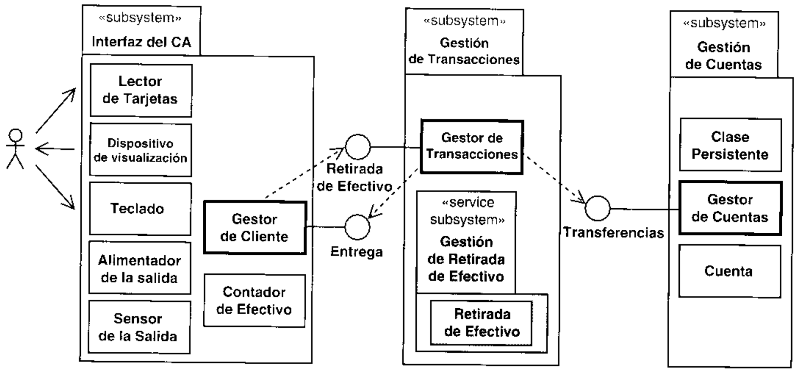

Una linea de trazo discontinuo de una clase a una interfaz significa que la clase usa la interfaz. Por-aldwa lebni ns ua :saooe sil uezn o ueuoiodoid anb saoeaui sel sowensow ou 'zalluas mos asociaciones normales.La interfaz Transferencias define operaciones para transferir dinero entre cuentas, retirar dinero,radas de efectivo de una cuenta. La interfaz Entrega define operaciones que otros subsistemas, como el de Gestion de Transacciones, pueden utilizar para entregar dinero al cliente del banco.

# 3.4.5. Creacion del modelo de implementacion a partirdel modelo de diseno

Durante el flujo de trabajo de implementacion desarrollamos todo lo necesario para obtener unsistema ejecutable: componentes ejecutables, componentes de fichero (codigo fuente, guioncsshell, etc), componentes de tabla (elementos de la base de datos), etc. Un componente es unaparte fisica y reemplazable del sistema que cumple y proporciona la realizacion de un conjun- to de interfaces. El modelo de implementacion esta formado por componentes, que incluyentodos los ejecutables (Apendice A: vease tambien cl Capitulo 10) tales como componentesActiveX y JavaBeans, asi como otros tipos de componentes.

# Ejemplo Componentes en el modelo de implementacion

En la Figura 3.12 se muestran los componentes que implementan las clases de diseno (como se definio en la Seccion 3.4.3).

Por ejemplo, el componente fichero salida.c contiene el codigo fuente de tres clases (y por tantolas implementa): Alimentador de la Salida, Gestor de Cliente, y Contador de Efectivo. Este compo-

nente fichero se compilara y enlazara junto con el componente fichero cliente.c para obtenercliente.exe, que es un ejecutable.

Un componente presupone un contexto de la arquitectura definido por sus interfaces. Tam-bién es reemplazable, es decir, los desarrolladores pueden intercambiar un componente con otro,quizas mejor, siempre que el nuevo proporcione y requiera las mismas interfaces. Normal-mente existe una forma directa de implementar un subsistema de servicio del modelo de disenomediante componentes que pueden asignarse a nodos del modelo de despliegue. Cada subsis-tema de servicio se implementara mediante un componente si siempre se asigna a un mismo tipode nodo en el modelo de despliegue. Si se asigna a mas de un nodo, podemos dividir el subsis.tema de servicio ——normalmente separando algunas clases— en tantas partes como tipos denodo. En cste caso, cada parte del subsistema de servicio se implementara como un componcnte.

# Ejemplo Un subsistema de servicio implementado mediantecomponentes

Supongamos que hemos elegido una solucion cliente/servidor (vease la Seccion 9.5.1.1) paranuestro ejemplo del Cajero Automatico. Podriamos distribuir tanto en el cliente como en el servidorparte del subsistema de servicio Gestion de Retirada de Efectivo (Figura 3.11) que contiene a la cla-se Retirada. El subsistema de servicio Gestion de Retirada de Efectivo podria implementarse me-diante dos componentes: "Retirada en el Cliente" y "Retirada en el Servidor".

Si los componentes se implementan en un lenguaje de programacion orientado a objetos, laimplementacion de las clases es tambien directa. Cada clase de diseno se corresponde con unaclase en la implementacion, por ejemplo, clases C++ o Java. Cada componente fichero puedeimplementar varias de esas clases, dependiendo de las convenciones del lenguaje deprogramacion.

Pero la implenentacion es mas que el desarrollo del codigo para crear un sistema ejecutable.Los desarrolladores responsables de implementar un componente son tambien responsables dehacer su prueba de unidad antes de enviarlo a las prucbas de integracion y del sistema.

# 3.5.  Prueba de los casos de uso

Durante Ia prueba, verificamos que el sistema implementa correctamente su especificacion.Desarrollamos un modelo dc prucba compucsto por casos de prueba y procedimientos deprueba (Apendice C; véase tambien el Capitulo 11) y despues ejecutamos los casos de pruebapara estar seguros de que el sistema funciona coino esperamos. Un caso de prueba es un con-junto de cntradas de prueba, condiciones de ejecucion, y resultados esperados, desarrolladospara un objetivo concreto. tal como probar un camino concreto a traves de un caso de uso. 0verificar quc se cumple un requisito especifico. Un procedimiento de prueba es una especifi-cacion de como llevar a cabo la preparacion. ejecucion, y cvaluaci6n de los resultados de uncaso de prueba particular. Los procedimicntos de prueba tambien pucden derivarse de los casosde uso. Los defectos hallados se analizan para localizar el problema. Despues estos problemasse priorizan y se corrigen por orden de importancia.

En la Seccion 3.3, comenzamos con la captura de los casos de uso, y despues en la Sec-cion 3.4 analizamos., disenamos. e implementamos un sistema que llevaba a cabo los casos deuso. Ahora, describiremos como probar que los casos de uso se han implementado correcta-mente. De alguna forma, esto no es nada nuevo. Los desarrolladores siempre han probado loscasos de uso, incluso antcs de que se acunara el termino caso de uso. La forma practica deprobar las funcioncs de un sistema es la prueba de que el sistcma puede utilizarse de manerasque tengan sentido para los usuarios. Sin embargo, por otro lado, esta es una tecnica nueva. Esnueva ya que identificamos los casos de prueba (como casos de uso durantc el flujo de trabajode los requisitos) antes de que tan siquiera comencemos a disenar el sistema, y después nosaseguramos de que nuestro diseno realmente implementa los casos de uso.

# Ejemplo Identificacion de un caso de prueba a partir de un casode uso

En la Figura 3.13 mostramos un caso de prueba, Sacar Dinero-Flujo Basico, que especifica como

Observese el nuevo estereotipo que presentamos aqui para los casos de prueba, un simbolo decaso de uso con una cruz dentro. Hacemos esto para poder dibujar los casos de prueba en losdiagramas (vease el Capitulo 11).

El caso de prueba especifica la entrada, los resultados esperados, y otras condiciones relevantespara verificar el flujo basico del caso de uso Sacar Dinero:

# Entradas:

· La cuenta 12-121-1211 del Cliente de Banco tiene un saldo de 350 dolares.+ El Cliente de Banco se identifica correctamente.· El Cliente de Banco solicita la retirada de 200 dolares de la cuenta 12-121-1211.● Hay suficiente dinero (por lo menos 200 dolares) en el Cajero Automatico.

# Resuftados:

· El saldo de la cuenta 12-121-1211 del Cliente de Banco disminuye a 150 dolares.· El Cliente de Banco recibe 200 dolares del Cajero Automatico.

# Condiciones:

No se permite a ningun otro caso de uso (instancias de) acceder a la cuenta 12-121-1211 durantela ejecucion del caso de prueba.

Observese que cste caso de prucba se basa en la descripcion del caso de uso Sacar Dineroque se dio en la Seccion 3.3.3. Mediante la identificacion temprana de los casos de uso, pode-mos comenzar pronto la planificacion de las actividades de prueba. y podemos proponer casosde prueba desde el comienzo. Estos casos de prueba podran detallarse mas durante el diseno,cuando sepamos mas sobre como el sistema llevara a cabo los casos de uso. Algunas herra-mientas generan los casos de prueba a partir del modelo de diseno --todo lo que hay que haceres introducir manualmente los datos necesarios para ejecutar las pruebas.

Las pruebas de los casos de uso pueden llevarse a cabo bien desde la perspectiva de un actorque considera el sistema como una caja negra, o bien desde una perspectiva de diseno, en lacual el caso de prueba se construye para verificar que las instancias de las clases participantesen la realizacion del caso de uso hacen lo que deberian hacer. Las prucbas de caja negra puedenidentificarse, especificarse y planificarse tan pronto como los requisitos sean algo estables.

También hay otro tipo de prucbas, como las del sistema, las de aceptacion, y las de ladocumentacion de usuario. Hablaremos mas sobre las pruebas cn el Capitulo 11.

# 3.6.  Resumen

Los casos de uso dirigen el proceso. Durante el flujo de trabajo de los requisitos, los desarro-lladores pueden representar los requisitos en la forma de casos de uso. Los jefes de proyectopueden despues planificar el proyecto en terminos de los casos de uso con los cuales trabajan losdesarrolladores. Durante el analisis y el diseno, los desarrolladores crean realizaciones de casosde uso en terminos de clases y subsistemas. Los componentes se incorporan en los incrementos,y cada uno de ellos realiza un conjunto de casos de uso. Por ultimo, los ingenieros de prueba ve-rifican que el sistema implementa los casos de uso correctos para los usuarios. En otras palabras,los casos de uso enlazan todas las actividades del desarrollo y dirigen el proceso de desarrollo—éste es quiza el beneficio mas importante de la aproximacion dirigida por los casos de uso.

Los casos de uso proporcionan muchos beneficios al proyecto. Sin embargo, no son todo.En el siguiente capitulo hablaremos sobre otro aspecto muy importante del Proceso Unificado-el estar centrado en la arquitectura.

# 3.7.  Referencias

[1] Ivar Jacobson, "Object-oricnted development in an industrial environment", Procee-dings of OOPSLA'87, Special issue 0f SIGPLAN Notices 22(12): 183-191, December1987.[2] Ivar Jacobson, Magnus Christerson, Patrik Jonsson, and Gunnar Overgaard, Object-Oriented Software Engineering: A Use-Case Driven Approach, Reading, MA: Addison-Wesley, 1992 (Revised fourth printing. 1993).[3] Ivar Jacobson, “"Basic use case modeling." ROAD I(2), July-August 1994.[4]  Ivar Jacobson, “"Basic Use Case Modeling (continued)", ROAD 1 (3), September-October1994.[51 Ivar Jacobson, "Use cases and objects", ROAD 1(4), November-December 1994.[6]  Ivar Jacobson and Magnus Christerson, "A growing consensus on use cases", Journal ofObjeci-Oriented Programming, March-April 1995.[7] Ivar Jacobson and Sten Jacobson, "Use-casc engineering: Unlocking the power'", ObjeclMagazine, October 1996.[8] Karl Wicger, "Use cases: Listening to the customer's voice", Sofiware Developinent,March 1997.[9] E. Ecklund, L. Delcambre, and M. Freiling, "Change cases: Use cases that identify futu-rc requirements", Proceedings, Conference on Object-Oriented Programming Systems,Languages, & Applications (OOPSLA'96), ACM, 1996. pp. 342-358.[10] Alistair Cockburn, "Structuring use cases with goals", Report on Analysis & Design(ROAD), 1997.[11] Geri Schneider and Jason Winters, Applying Use Cases: A Practical Approach, Reading,MA: Addison-Wesley, 1998.[12] OMG Unified Modeling Languagc Specification. Object Management Group, Framing-ham, MA, 1998. Internet: www.omg.org.

# Un proceso centradoen la arquitectura

1 n cl Capitulo 3, comenzamos con una simplificaci6n, diciendo que solo los casos de uso1 mostrarian el camino a traves de los requisitos, analisis, diseio, implementacion yprucbas para producir un sistema. No obstante, para desarrollar software hay que haceralgo mas que conducirse a ciegas a traves de los flujos de trabajo guiado exclusivamente por loscasos de uso.

Los casos de uso solamente no son suficientes. Se necesitan mas cosas para conseguir unsistema de trabajo. Esas “"cosas" son la arquitectura. Podemos pensar que la arquitectura de unsistema es la vision comun cn la que todos los empleados (desarrolladores y otros usuarios)deben estar de acuerdo, o como poco, deben aceptar. La arquitectura nos da una clara pers-pectiva del sistema completo, necesaria para controlar el desarrollo.

Necesitamos una arquitectura que describa los clementos del modelo que son mas importan-tes para nosotros. &Como podemos determinar que elementos son importantes? Su importanciareside en el hecho de que nos guian en nuestro trabajo con el sistema, tanto en este ciclo como aincluyen algunos de los subsistemas, dependencias, interfaces, colaboraciones, nodos y clasesactivas (Apendice A; vease también la Seccion 9.3.2). Describen los cimientos del sistema, queson necesarios como base para comprenderlo, desarrollarlo y producirlo economicamente.

Vamos a comparar un proyecto software con la construccion de un garaje de uso individualEn primer lugar, el constructor deberia considerar como quieren utilizar el garaje los usuarios.Un caso de uso podria scr ciertamente Guardar el Coche, es decir, conducir cl coche dentro delgaraje, y dejarlo alli para sacarlo mas tarde.

& Tendra el usuario algun otro uso en mente? Supongamos que quiere utilizarlo tambiencomo taller. Esto lleva al constructor a pensar en las necesidades de luz -—algunas ventanas yluz eléctrica-—. Muchas herramientas funcionan con electricidad, asi que el constructor debeplanear poner media docena de enchufes y el suficiente voltaje para soportarlos. De alguna for-ma, el constructor esta desarrollando una arquitectura simple. Puede hacerlo mentalmenteporque ya ha visto un garaje antes. Ha visto un banco de trabajo antes. El sabe que una perso-esta familiarizado con la arquitectura tipica de un pequeno garaje. Simplemente ha juntado lasas A sfeea un osia eq eounu nonnsuoo pe is x? osn ns bied sfee pe renoape ered saniedgs oxa     tn s  anecesita considerar no solamente la funcionalidad del garaje, sino su forma.

Construir una casa con 10 habitaciones, una catedral, un centro comercial o un rascacielos,son tareas diferentes. Hay muchas formas de construir grandes edificios como éstos. Para di-n n on p s so s p o  ai s soinformados del progreso de la arquitectura. Esto significa que tendran que registrar su trabajode forma que sea comprensible para los otros miembros del equipo. Tambien tendran quepresentarselo de forma comprensible a una persona no experta --ya sea el propietario, elusuario u otros interesados-. Por último, también deben informar de la arquitectura al cons-tructor y a los proveedores de materiales mediante los planos del edificio.

De forma similar, el desarrollo de muchos sistemas software —o de sistemas softwarecon el hardware correspondiente sobre el que se ejecuta-— requiere el pensar y registrar lasideas de forma compresible, no solo para los siguientes desarrolladores, sino para otro tipo deusuarios. Es mas, estas ideas, esta arquitectura, no brotan hechas y dercchas del monte de Zeus:los arquitectos las desarrollan iterando repetidas veces durante la fase de inicio y elaboracion.s    a ie   i  oo rdforma que sea una arquitectura base ejecutable (Apendice C). Como resultado, se cntra en lafase de construccion con unos fundamentos solidos para construir el resto del sistema.

# 4.1.  La arquitectura en pocas palabras

Necesitamos una arquitectura, bien. Pero, ique quiere decir exactamente “arquitectura desistemas software?? A medida que uno busca en la literatura sobre arquitectura software, nosviene a la cabeza la parabola del ciego y cl elefante. Un elefante es todo lo que el hombre ciego(la pata)-—. De forma similar, la idea de arquitectura, al menos reducida a una sencilla frasedefinitoria, es lo que se encuentra en la mente del autor en ese punto.

Vamos a comparar de nuevo la arquitectura software con la construccion de casas. Unedificio, por tanto, puede encontrar util el hacer una maqueta a escala del edificio, junto con losdibujos del edificio visto desde distintas perspectivas. Estos planos no son muy detallados porlo general, pero son comprensibles para el cliente.

No obstante, la construccion de edificios implica a otro tipo de trabajadores durante la fasede construccion, como carpinteros, albaniles, peones, soladores, fontaneros y electricistas.Todos ellos necesitan mas detalles y planos especializados del edificio, y todos estos planosdeben ser consistentes unos con otros. Las tuberias de ventilacion y las tuberias de agua, porejemplo, no deben estar situadas en el mismo espacio fisico. El papel del arquitecto es crear losaspectos mas significativos del diseno del edificio cn su conjunto. Asi que el arquitccto hace unconjunto de planos del edificio que describcn muchos de los bloques del cdificio, tales como lospilarcs en la excavacion. Un ingeniero de estructuras determina el tamano de las vigas quesoportan la estructura. Los pilares soportan las paredes, los suelos y el techo. Esta estructuracontiene sistemas para ascensores, agua, electricidad, aire acondicionado, sanitarios, ctc. Sinembargo, cstos planos de la arquitectura no son lo suficientemente detallados para que los cons-porcionan detalles sobre la eleccion dc materiales, subsistemas de ventilacion, y cosas asi. Elarquitecto tiene la responsabilidad global sobre el proyecto, pero estos otros tipos de disena-dores completan los detalles. En general, el arquitecto es un experto en integrar todos losaspcctos del cdificio, pero no es un experto en cada aspecto. Cuando todos los planos estanhechos, los planos dc la arquitectura cubren unicamente las partes principales del edificio. Losplanos son vistas de todos los otros planos, siendo consistentes con todos ellos.

Durante la construccion, distintos trabajadorcs utilizaran los planos de la arquitectura —-lasvistas de los planos detallados- para tener una buena vision global del edificio, pero se fiarande los planos de la construccion mas detallados para realizar su trabajo.

Como un cdificio, un sistema software es una unica entidad, pero al arquitecto del sofiware y a los desarrolladores les resulta util presentar el sistema desde diferentes perspectivas parasistema. Todas las vistas juntas representan la arquitectura.

La arquitectura software abarca decisiones importantes sobre:

· La organizacion del sistcma soflware.

· I os clementos estructurales quc compondran el sistema y sus interfaces. junto con suscomportamientos, tal y como se especifican en las colaboraciones entre estos elementos.· La composicion de los elementos estructurales y del comportamiento en subsistemasprogresivamcnte mas grandes.

· El estilo de la arquitectura (Apendice C) que guia esta organizacion: los elementos y susintcrfaces. sus colaboraciones y su composicion.

portamiento, sino tambien por el uso, la funcionalidad, el rendimiento, la flexibilidad, larcutilizacion, la facilidad de comprension, las restricciones y compromisos economicos ytecnologicos, y la estetica.

En la Scccion 4.4, discutiremos el concepto de arquitectura software en terminos mas con-cretos y se describira como representarla utilizando el Proceso Unificado. No obstante, aquiinsinuaremos una descripcion de la arquitectura (Apendice C). Ya hemos dicho que la arqui-tectura se representa mediante vistas del modelo: una vista del modelo de casos de uso, una vistadel modelo de analisis, una vista del modelo de diseno, etc. Este conjunto de vistas concuerda conlas 4+1 vistas discutidas en [31. Ya que una vista de un modelo es un extracto, o una parte de esemodelo, una vista del modelo de casos de uso, por ejemplo, se parece al propio modelo de casosde uso. Tiene actores y casos de uso, pero solamente aquellos que son arquitectonicamentesignificativos. De forma similar, la vista de la arquitectura del modelo de diseno se parece al mo-delo de diseno, pero contiene exclusivamente aquellos elementos del disenio que comprenden loscasos de uso importantes desde el punto de vista de la arquitectura (vease la Seccion 12.6.2).

No hay nada magico en la descripcion de la arquitectura. Es como un descripcion completan s so n s sie r so ss so  sspero mas pequeno. tComo de pequeno? No hay un tamano absoluto para la descripcion de la arquitectura, pero segun nuestra expcriencia una gran clase de sistemas suele estar entre 50 y 100ciones de arquitectura para sistemas de conjuntos de aplicaciones sera mayor (Apendice C).

# 4.2.  Por que es necesaria la arquitectura

Un sistema software grande y complejo requiere una arquitectura para que los desarrolladorespuedan progrcsar hasta tener una vision comun. Un sistema software es dificil de abarcarvisualmente porque no existe en un mundo de tres dimensiones. Es a menudo unico y sin pre-cedente en determinados aspectos. Suele utilizar tecnologia poco probada o una mezcla detecnologias nuevas. Tampoco es raro que el sistema Hleve a sus viltimos limites la tecnologiaexistcnte. Ademas, debe ser construido para acomodar gran cantidad de clases que sufrirancambios futuros. A medida que los sistemas se hacen mas complejos, "los problemas de dise-no van mas alla de los algoritmos y las estructuras de datos para su computacion: para disenary especificar una estructura del sistema global surgen nuevos tipos de problemas" [1].

Ademas, existe con frecuencia un sistema que ya realiza algunas de las funciones del sistemapropuesto. El saber identificar que hace este sistema, casi siempre con poca o ninguna docu-mentacion, y que codigo pueden reutilizar los desarrolladores, anade complejidad al desarrollo

Se necesita una arquitectura para:

· Comprender el sistema.· Organizar el desarrollo.· Fomentar la rcutilizacion.· Hacer evolucionar el sistema.

# 4.2.1.  Comprension del sistema

Para que una organizacion desarrolle un sistema, dicho sistema debe ser comprendido por todossa sis ss so si si b u    a e ua n sonreto importante por muchas razones:

· Abarcan un comportamiento complcjo

· Operan en entornos complejos.

· Son tecnologicamente complejos.

· A menudo combinan computacion distribuida, productos y plataformas comerciales(como sistemas operativos y sistemas gestores de bases de datos) y reutilizan compo-nentes y marcos de trabajo.

· Deben satisfacer demandas individuales y de la organizacion

· En algunos casos son tan grandes que la direccion tiene que dividir el trabajo de desarrolloen varios proyectos., que estan a menudo separados geograficamente, anadiendo dificul-tades a la hora de coordinarlos.

Por otra parte, estos factores cambian constantemente. Todo esto afiade dificultad potencialpara comprender la situacion.

ad  u  d)  e  on rspfallos en la compresion del sistema. Por consiguiente, el primer requisito que tiene lugar cn unadescripcion de la arquitectura es que se debe capacitar a los desarrolladores, directivos, clientes ys e  g o   soo  sp  s sot d oy deben utilizarse para describir la arquitectura. A medida que la gente se vaya familiarizando conUML, encontraran mas facil de comprender la arquitectura modelada en ese lenguaje.

# 4.2.2.  Organizacion del desarrollo

Cuanto mayor sea la organizacion del proyccto software, mayor sera la sobrecarga de comu-nicacion cntre los desarrolladores para intentar coordinar sus esfuerzos. Esta sobrecarga seincrementa cuando el proyecto esta geograficamente disperso. Dividiendo el sistema ensubsistemas, con las interfaces claramente definidas y con un responsable o un grupo deresponsables establecido para cada subsistema, el arquitecto puede reducir la carga de comu-nicacion entre los grupos de trabajo de los diferentes subsistemas, tanto si estan en el mismoedificio como si estan en diferentes continentes. Una "buena" arquitectura es la quc defineexplicitamente estas interfaces, haciendo que sea posible la reduccion en la comunicacion. Unainterfaz bien definida “comunica" eficientemente a los desarrolladores de ambas partes qucnecesitan saber sobre lo que los otros equipos estan haciendo.

Las interfaces estables permiten que el software de ambas partes progrese independiente-mente. Una arquitectura y unos patrones de diseno (Apendice C) adecuados nos ayudan aencontrar las interfaces correctas entre los subsistemas. Un ejemplo es el patron Boundary-Con-trol-Entity (vease la Seccion 4.3.1), que nos ayuda a distinguir el comportamiento especifico delos casos de uso. las clases de interfaz y las clases genericas.

# 4.2.3.  Fomento de la reutilizacion

Permitanos usar una analogia para explicar como la arquitectura es importante para la reutili-zacion. La industria de la fontaneria esta estandarizada desde hace tiempo. Los contratistas dee e  s p r   s p q asmension de componentes “crcativos". obtenidos de aqui y de alla, el fontanero los selecciona deun conjunto de componentes estandarizados que sicmpre se ajustaran.

Como el fontanero, los desarrolladores capaces de reutilizar conocen el dominio del proble-ma (Apendice C) y que componentes cspecifica como adecuados la arquitectura. Los desarro-y realizar el modelo de casos de uso. Cuando tienen disponibles componentes reutilizables, losusan. Como los elementos estandar de fontaneria, los componentes software reutilizables estandisenados y probados para encajar, y asi el tiempo de construccion y el coste son menores. Elresultado es predecible. Como en la industria de la fontaneria, donde la estandarizacion llevosiglos, en la estandarizacion del software se va avanzando con la experiencia —pero espcramos que

La industria del software todavia tiene que alcanzar el nivel de estandarizacion que muchosdominios hardware han conseguido, pero las bucnas arquitecturas y las interfaces bien definidasson pasos en esa direccion. Una buena arquitectura ofrcce a los desarrolladores un andamioreutilizables quc cl desarrollador pueda utilizar. Se obtienen subsistemas reutilzables disenando-los con cuidado para que puedan ser utilizados conjuntamente [2]. Un buen arquitecto ayuda a losdesarrolladores para que sepan donde buscar elementos reutilizables de manera poco costosa, ypara que puedan encontrar los componentes adecuados para scr rcutilizados. El UML acelerara elpara su reutilizacion.

# 4.2.4.  Evolucion del sistema

-isuo oueunn un ap euansis rinbieno snb ap sa somaas aeisa soapod snb of op oai Aeu isderable evolucionara. Evolucionara incluso aunque aun este cn desarrollo. Mas tarde, cuandoeste en uso, el entorno cambiante provocara futuras evoluciones. Hasta que esto ocurra, el sis-tema debe ser facil de modificar; esto quiere decir que los desarrolladores debcrian ser capacesde modificar partes del diseno e implementacion sin tener que preocuparse por los efectosinesperados quc puedan tener repercusion en el sistema. En la mayoria de los casos, deberian sercapaces de implementar nuevas funcionalidades (es decir, casos dc uso) en el sistema sin tenerque pensar en un impacto dramatico en el diseno e implementacion existentes. En otras palabras,el sistema dcbe ser en si mismo flexible a los cambios o tolerante a los cambios. Otra forma deenunciar este objetivo es afirmar que el sistema debe ser capaz de evolucionar sin problemas. Lasarquitecturas del sistema pobres, por el contrario, suelen degradarse con el paso del tiempo ynecesitan ser "parcheadas" hasta que al final no es posible actualizarlas con un coste razonable.

# Ejemplo El Sistema AxE de Ericsson - Sobre la importancia de laarquitectura

El sistema de conmutacion de telecomunicaciones de Ericsson se desarrollo inicialmente a principiode los setenta usando una primera version de nuestros principios de las arquitecturas. La descripcionde la arquitectura software es un artefacto importante que ha guiado el desarrollo completo del trabajohan incorporado al Proceso Unificado.

Uno de estos principios era el de la modularizacion de funciones. Las clases o los elementos dediseno equivalentes se agruparon en bloques funcionales, 0 subsistemas de servicio, que los clien-tes podian considerar como opcionales (incluso si se entregaban a todos los clientes). Un subsiste-a  o is g  s s  s  n  ssubsistema de servicio y raramente estos cambios afectaban a mas de un servicio.

dian soportar la misma interfaz. Cambiar un subsistema de servicio por otro podia hacerse sincambiar los clientes del subsistema de servicio (los cuales dependian solamente de las interfaces, nodel codigo del subsistema de servicio).

Un tercer principio era hacer corresponder los subsistemas de servicio en el diseno a uno o mas com-en diferentes nodos de computacion. Habia exactamente un componente por cada nodo de proceso enordenador central (servidor), entonces habria exactamente un componente para el subsistema. Si elprincipio simplifico la gestion de los cambios en el software en las diferentes instalaciones.

Todavia hay otro principio, que era el bajo acoplamiento entre los subsistemas de servicio. La unicacomunicacion entre los subsistemas de servicio eran las senales. Aunque las seniales eran asincronas

Dado que su comienzo y su consiguiente desarrollo fue guiado por una arquitectura biendisenada, el sistema AxE continua hoy en uso, con mas de un centenar de clientes y varios miles deinstalaciones. Se espera que continue funcionando durante decadas, con los cambios necesarios.

# 4.3.  Casos de uso y arquitectura

Ya hemos senalado que existe cierta interaccion entre los casos de uso y la arquitectura. En elCapitulo 3 mostramos por primera vez como desarrollar un sistema que proporciona los casosde uso correctos a sus usuarios. Si el sistema proporciona los casos de uso correctos —-casos deuso de alto rendimiento, calidad y facilidad de utilizacion— los usuarios pueden emplearlo parallevar a cabo sus objetivos. Pero, como podemos conseguirlo? La respuesta, como ya hemossugerido, es construir una arquitectura que nos permita implementar los casos de uso de unaforma economica, ahora y en el futuro.

Vamos a clarificar como succde esta interaccion, observando primero que influye en laarquitectura (vease la Figura 4.1) y despues que influye en los casos de uso.

Como ya hemos dicho, la arquitectura esta condicionada por los casos de uso que queremosque soporte el sistema; los casos de uso son directores de la arquitectura. Despues de todo,qucremos una arquitectura viable a la hora de implementar nuestros casos de uso. En lasprimeras iteraciones, elegimos unos pocos casos de uso, que pensamos que son los que nosficativos incluyen los que son mas necesarios para los clientes en la proxima version y quizapara versiones futuras.

Sin cmbargo, la arquitectura no solo se ve condicionada por los casos de uso arquitectoni-camente significativos, sino tambien por los siguientes factores:

· Sobre que productos software del sistema queremos desarrollar, como sistemas operativosO sistemas de gestion de bases de datos concretos.

· Que productos de middleware (capa de intermedia; Apendice C) queremos utilizar.Por ejemplo, tcnemos que seleccionar un object requcst broker (ORB), que es un meca-nismo para la conversion y envio de mensajes a objetos en entornos heterogéneos [6], 0un marco de trabajo indcpendiente de la plataforma, es decir, un subsistcma "prefabrica-do'", para construir interfaces graficas.

· Que sistemas heredados queremos utilizar en nuestro sistema. La utilizacion en nuestrapermite reutilizar gran parte de la funcionalidad existentc, pero tambien tenemos que ajus-· A que estandares y politicas corporativas debemos adaptarnos. Por ejemplo, podemoselegir cl Lenguaje de Definicion de Interfaccs (Interface Definition Language, IDL) [7]para especificar todas las interfaces de las clases, o el estandar TMN de telecomunica-ciones [8] para espccificar objetos en nuestro sistema.

· Requisitos no funcionales generales (no especificos de los casos de uso), como losrequisitos de disponibilidad, tiempo de recuperacion. o uso de memoria.

· Las necesidades de distribucion especifican como distribuir el sistema, quiza a traves de

Podemos pensar cn los elementos de la parte derecha dc la Figura 4.1 como en restriccionesy posibilidades que nos llevan a forjar la arquitectura de una forma determinada.

La arquitectura se desarrolla en iteraciones de la fase de elaboracion. La siguiente podria serde alto nivcl para la arquitectura, a modo de una arquitectura en capas (Apendice C). Despuesformamos la arquitectura en un par de construcciones (Apendicc C; vease tambien el Capitu-lo 10) dentro de la primera iteracion.

ce C), que son generales en cuanto al dominio, y que no son especificas del sistema quepensamos desarrollar (es decir, seleccionamos el software del sistema (capa de software del sis-tema; Apendice C; vease tambien la Seccion 9.5.1.2.2), el middleware, los sistemas heredados,los estandares y las politicas de uso). Decidimos que nodos contendra nuestro modelo dedesarrollo y como deben interactuar entre ellos. Tambien decidimos como manejar los requisi-tos generales no funcionales, asi como la disponibilidad de estos requisitos. Con la primera pa-sada es suficiente para tener una vision general del funcionamiento de la aplicacion.

En la segunda construccion, trabajamos con los aspectos de la arquitectura espccificos de laaplicacion (capa especifica de la aplicacion; Apendice C). Escogemos un conjunto de casos de usorelevantcs cn cuanto a la arquitcctura, capturamos los requisitos, los analizamos, los diseniamos.los implementamos y los probamos. El resultado seran nuevos subsistemas implementadoscomo componentes del desarrollo que soportan los casos de uso seleccionados. Pueden existirtambien algunos cambios en los componentes significativos de la arquitectura que implemcnta-mos en la primcra entrega (cuando no pensamos en terminos de casos de uso). Los componentesnuevos o cambiados se desarrollan para realizar los casos de uso, y de esta forma la arquitecturase adapta para ajustarse mejor a los casos de uso. Entonces elaboraremos otra construccion, y asisucesivamcnte hasta terrminar con las iteraciones. Si este final de las iteraciones tiene lugar en clfinal de la fase de elaboracion, habremos conseguido una arquitectura estable.

Cuando tencmos una arquitectura cstable, podemos implcmentar la funcionalidad comple-tamente realizando cl resto de casos de uso durante la fase de construccion. Los casos de usoimplementados durante la fasc de construccion se desarrollan utilizando como entradas losrequisitos de los clientes y de los usuarios (vease la Figura 4.2), pero los casos de uso estantambien inluenciados por la arquitectura elegida en la fase de elaboracion.

tenemos de la arquitectura existente para hacer mejor nuestro trabajo. Cuando calculamos elvalor y el coste de los casos de uso que se sugieren, lo hacemos a la luz de la arquitcctura quetenemos. Algunos casos de uso seran mas faciles dc implementar, mientras que otros seran masdificiles.

# Ejemplo Adaptacion de los casos de uso a la arquitecturaya existente

El cliente ha requerido una funcion que supervise el proceso de carga. Esto se especifico como uncaso de uso que midiera la carga, con un nivel de prioridad alto en el computador. La implementacionde ese caso de uso podria haber requerido algunos cambios en sistema operativo en tiempo real quese estaba utilizando. Entonces, el equipo de desarrollo sugirio que la funcionalidad requerida fuera im-de respuesta. El cliente obtuvo mayor fiabilidad en las medidas y el equipo de desarrollo evito tenerque cambiar partes criticas de la arquitectura subyacente.

Negociamos con el cliente y decidimos si los casos de uso podrian cambiarse para hacer laimplementacion mas sencilla, ajustando los casos de uso y el diseno resultante con la arqui-

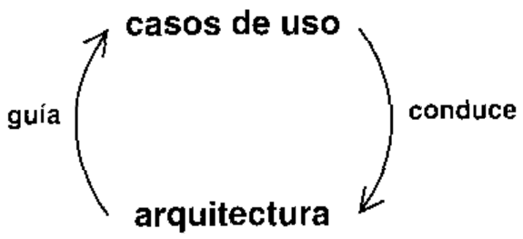

tectura que ya tenemos. Este ajuste significa que debemos considerar que ya tenemos lossubsistemas, interfaces, casos de uso, realizaciones de casos de uso, clases y demas. Ajustandolos casos de uso con la arquitectura, podemos crear nuevos casos de uso, subsistemas y clasescon poco esfuerzo, partiendo de las que ya existen.

Asi, por una partc, la arquitectura esta influenciada por aquellos casos de uso que queremosque el sistema soporte. Los casos de uso conducen la arquitectura. Por otra parte, utilizamosnuestro conocimiento de la arquitectura para hacer mejor el trabajo de captura de requisitos,para obtener casos de uso. La arquitectura guia los casos de uso (vease la Figura 4.3).

&Que cs primero, la arquitectura o los casos de uso? Tencmos otra vez el tipico problema del"huevo y la gallina'. La mejor forma de resolvcr estos problemas es mediante una iteracion.Primero, construimos una arquitectura tentativa basica a partir de una buena comprension delarea del dominio (Apendice C), pero sin considerar los casos de uso detallados. Entonces,dos nh nad eopudepe eaonnbn ei sotunde A osn ap soseo ap ed un soeoosaesos casos de uso. Despues, escogemos algunos casos de uso mas y construimos una arqui-tectura todavia mejor, y asi sucesivamente. Con cada iteracion, escogemos e implementamos uniteracion tambien implementamos adcmas las partes de la arquitectura especificas de la apli-Este es uno de los beneficios de los desarrollos conducidos por casos de uso. Volveremos sobreeste enfoque en el Capitulo 5.

Resumicndo, una buena arquitectura cs algo que nos permite obtener los casos de usocorrcctos, de manera economica, hoy y en el futuro.

# 4.4.  Los pasos hacia una arquitectura

La arquitectura se desarrolla mediante iteraciones, principalmente durante la fase de elaboracion. Cada iteracion se desarrolla como se esbozo en el Capitulo 3, comenzando con losrequisitos y siguiendo con el analisis, diseno, implementacion y pruebas, pero centrandonos enlos casos de uso relevantes desde el punto de vista de la arquitectura y en otros requisitos. Elresultado al final de la fase de elaboracion es una linea base de la arquitectura —un csqueleto

: Que casos de uso son relevantes arquitectonicamente hablando? Plantearemos esta cuestionen la Seccion 12.6. Por ahora, es suficiente con decir que los casos de uso arquitectonicamen-te relevantes son aquellos que nos ayudan a mitigar los riesgos mas importantes, aquellos queson los mas importantes para los usuarios del sistema, y aqucllos que nos ayudan a cubrir todaslas funcionalidades significativas, de forma que nada quede en penumbra. La implementacion.integracion y prueba de la linea base de la arquitectura proporciona seguridad al arquitecto y aotros trabajadores de su cquipo, por lo que comprender estos puntos es algo francamente ope.rativo. Esto es algo que no pucde obtenerse mediante un analisis y diseno ^sobre cl papel". Lalinea base de la arquitectura de operacion proporciona una demostracion que funciona para quelos trabajadores puedan proporcionar sus rctroalimentaciones.

# 4.4.1.  La linea base de la arquitectura es un sistema"'pequeno y flaco'

Al final de la fase de claboracion hemos desarrollado modelos del sistema que representan loscasos de uso mas importantes y sus realizaciones, desde la perspectiva de la arquitectura.Tambien hemos decidido, como ya se discuti6 en la Seccion 4.3, *"Casos de uso y arquitectura",con que estandares contamos, que softwarc del sistema y que middleware utilizar, que sistemasheredados reutilizar y que nccesidades de distribucion tenemos. Asi, tendremos una primeraversion de los modelos de casos dc uso, de analisis, de diseno y demas. Esta agregacion de mo-delos (vease la Figura 4.4) es la linea base de la arquitectura; es un sistema pequeno y flaco 2Tiene las versiones de todos los modelos que un sistema terminado contiene al final de la fasede construccion. Incluye el mismo esqueleto de subsistemas, componentes y nodos que un sis-tema definitivo, pero no existe toda la musculatura. No obstante, contiene comportamiento ycodigo ejecutable. El sistema flaco se desarrollara para convertirse en un sistema hecho ycambios son menores porquc al final de la fase de elaboracion hemos definido una arquitectu-ra estable: si no. la fase de elaboracion debe continuar hasta que alcance su objetivo.

En la Figura 4.4, la parte sombreada de cada modelo representa la version del mismo queesta desarrollada al final de la fase de claboracion, es decir, la version del modelo que es partcde la linea base de la arquitectura. El rectangulo completo (la parte sombreada y sin sombrear)represcnta la version del modelo como desarrollo al final de la fase de transicion, por tanto, lalinea base representa la version del cliente (el lector no deberia sacar ninguna conclusion deltamano de las areas sombreadas que se muestran en la Figura 4.4, que solo tienen finalidad ilus-trativa). Desde la linca base de la arquitectura hasta la version de la linea base del cliente,habra algunas otras que representen las versiones internas de los modelos (Apendice C).Podriamos haber mostrado esas nuevas versiones del modelo como incrementos partiendo de lalinea base de la arquitectura. Cada nucva version de un modelo puede desarrollarse a partir dela anterior version. Los diferentes modelos de la Figura 4.4, como es natural, no se desarrollanindependientemente los unos de los otros. Cada caso de uso del modelo de casos de usocorresponde, por cjemplo, a una realizacion de caso de uso cn los modelos de analisis y diseno.y a una prueba en el modelo de pruebas. Los procesos y la estructura de los nodos deben

uso o el modelo de despliegue deben modificarse, quizas cambiando la forma en que lasclases activas se asignan a los nodos para una mejor ejecucion. Tales cambios en el desarrolloO en el modelo de diseno pueden conducir a alteraciones en el modelo de casos de uso, si es quelos cambios lo requieren). Los elementos del modelo, en los diferentes modelos, estan, como sedijo en la Seccion 2.3.7, relacionados entre si a través de las dependencias de traza.

No obstante, la linea base de la arquitectura, esto es, la version interna del sistema al final dela fase de elaboracion, se representa por algo mas que los artefactos del modelo. Tambien seincluye la descripcion de la arquitectura. Esta descripcion se desarrolla habitualmente de formaconcurrente, a menudo incluso antes que las actividades que obtienen las versiones del mode-lo que son parte de la linea base de la arquitectura. El papel de la descripcion de la arquitectu-ra es guiar al equipo de desarrollo a traves del ciclo de vida del sistema -—no solo por lasiteraciones del ciclo actual, sino por todos los ciclos que vengan—. Este es el estandar a seguirpor todos los desarrolladores, ahora y en el futuro. Como la arquitectura deberia ser estable, elestandar deberia ser estable también.

La descripcion de la arquitectura puede adoptar diferentes formas. Puede ser un extracto (delas versiones) de los modelos que son parte de la linea base de la arquitectura, o puede ser unareescritura de los extractos de forma que sea mas facil leerlos. Volveremos a esto en la Sec-modelos que son parte de la linea base de la arquitectura. A medida que se desarrolla el siste-ma y los modelos se van haciendo mas voluminosos en las ultimas fases, la arquitectura seguiraincluyendo vistas de las nuevas versiones de los modelos. Asumiendo que la linea base de laarquitectura ha desarrollado una arquitectura estable —esto es, los elementos del modelorelevantes arquitectonicamente no cambian en las sucesivas iteraciones—, la descripcion de laarquitectura también sera estable, e incluira en todo momento vistas de los modelos del sistema.

Es fascinante observar que resulta posible desarrollar una arquitectura estable durante la fasede elaboracion del primer ciclo de vida, cuando solamente se ha invertido aproximadamente un30 por ciento de la primera version. Esta arquitectura constituira los pilares del sistema el res-to de su vida. Aunque los cambios en los pilares resultaran costosos, y en algunos casos muydificiles, es importante obtener una arquitectura estable pronto en el desarrollo del trabajo. Elp   'id  d 's ed  sis  d oe n p o algo nuevo. Por otro lado, la gente lleva desarrollando arquitecturas muchos anos. Se tieneexperiencia y conocimiento en el desarrollo de buenas arquitecturas. Hay muchas “soluciones'genéricas —-estructuras, colaboraciones y arquitecturas fisicas—— que han evolucionado a loEstas soluciones se llaman habitualmente patrones, como los patrones de arquitectura descritos largo de muchos anos y con las que todo arquitecto con experiencia deberia estar familiarizado.en [4] y los patrones de diseno descritos en [5]. Los patrones genericos son recursos con los quelos arquitectos pueden contar.

# 4.4.2.  Utilizacion de patrones de la arquitectura

Las ideas del arquitecto Christopher Alexander sobre como los “lenguajes de patrones"” seutilizan para sistcmatizar principios y practicas importantes en el diseno de cdificios y comu-nidades, han inspirado a muchos miembros de la comunidad de la orientacion a objetos adefinir, coleccionar y probar una gran variedad de patrones software [1o]. La “comunidad de pa-trones"” define un patron como "una solucion a un problema de diseno que aparece confrecuencia"'. Muchos dc los patrones de discno estan documentados en libros, que presentan lospatrones utilizando plantillas estandar. Estas plantillas asignan un nombre a un patron ypresentan un resumen de los problcmas y las fuerzas que lo hacen surgir, una solucion cn ter-minos de colaboracion de clases participantes e interaccion entre objetos de esas clases. Lasplantillas tambien proporcionan ejemplos de como se utiliza el patron en algunos lenguajes deprogramacion, junto con variantcs del patron, un resumen con las ventajas y las consecuenciasde la utilizacion de patrones, y referencias a estos. Segun Alexander, seria bueno que losingenieros de software aprcndiesen los nombres y el objetivo de muchos patrones estandar, yque los aplicasen para hacer disenos mejores y mas compresibles. Existen patrones de disenocomo Facade, Decorator, Proxy Observer, Strategy y Visitor ampliamente citados y utilizados

La comunidad de patrones tambien ha aplicado esta idea, con una plantilla de documentoocurrcn frecuentemente. Algunos de estos patrones incluyen Layers, Pipes and Filters, BrokerBlackboard, Horizontal-Vertical Metadata y MVC. Otros han desarrollado patrones para que seutiliccn durante el analisis ('patrones de analisis"), durante la implementacion ("idiomas"que hacen corresponder estructuras comunes de oricntacion a objetos con aspectos peculiaresde los lenguajes, como C ++ o Smaltalk), e incluso para estructuras de organizaci6n efectivasforma muy directa en lenguajes orientados a objctos. Algunos ejemplos pueden ser C++, Javay Smalltalk, mientras que los patrones de arquitectura se manejan mejor con sistemas 0subsistemas c interfaces, y los ejemplos no incluyen habitualmente codigo. Para ver un buenesquema de clasificacion vease [9].

Desde nuestra perspectiva dirigida por modelos, definiremos pauron como una plantilla decolaboracion, que es una colaboracion general que puede especializarse segun lo definido en laplantilla (Apendicc A). Por tanto. consideramos los patroncs de diseno como colaboracionesentre clases e instancias, con su comportamicnto explicado en los diagramas de colaboracion.Utilizarcmos plantillas de colaboracion ya que entendemos que las soluciones son bastantegenerales. Utilizaremos herencia, cxtension y otros mecanismos para cspecializar el patron(especificando los nombres de clases, numero de clases, etc., que aparecen en la plantilla). EnImuchos casos, cuando cspecializamos las plantillas de colaboracion, surgen colaboracionesconcretas que pueden trazarse dircctamente con los casos de uso. Vease [5] para un tratamientoextenso de los patrones de diseno.

Los patrones de las arquitecturas se utilizan de una forma parecida pero se centran en es-tructuras e interacciones de grano mas grueso, entre subsistemas e incluso entre sistemas.Existen muchos patrones de arquitectura, pero aqui solo trataremos brevemente algunos de losmas intcresantes.

Permite que los objetos hagan llamadas a otros objetos remotos a través de un gestor queredirigc la llamada al nodo y al proceso que guardan al objeto deseado. Esta redireccion se hacede manera transparente, lo cual quiere decir que el llamante no necesita saber si el objetolamado es remoto. El patron Broker suele utilizar el patron de diseno Proxy, que proporcionaun objeto sustituto local con la misma interfaz que el objeto remoto para hacer transparentes elestilo y los detalles de la comunicacion distribuida.

Hay otros patrones que nos ayudan a comprender el hardware de los sistemas que construimosy que nos ayudan a disenar nuestro sistema sobre él, como por ejemplo Client/Server, Three-Tier,como se deben asignar los componentcs a los nodos. En la Seccion 4.5, ilustrarcmos como sepudo aplicar el patron Client/Server al sistema CA dcscrito en el Capitulo 3. En nuestro ejemplo,la distribucion cliente/servidor tiene un nodo clicnte quc ejecuta el codigo de interfaces deusuario y parte de la logica de negocio (clases de control) en cada CA "fisico". El nodo servidormantienc las cuentas y las reglas de negocio que permiten verificar las transacciones.

El patron Layers es aplicable a muchos tipos de sistemas. Estc patron define como organi-zar cl modelo de diseno cn capas, lo cual quiere decir que los componentes de una capa solopucden hacer refcrencia a componentes en capas inmediatamente inferiores. Este patron esimportante porque simplifica la comprension y la organizacion del desarrollo de sistemasde ningun detalle o interfaz de las supcriores. Ademas, nos ayuda a identificar que puedereutilizarse, y proporciona una estructura quc nos ayuda a tomar decisiones sobre que partescomprar y que partes construir.

lo mas alto. Estos se construyen a partir de subsistemas en las capas mas bajas, como son losmarcos de trabajo y las bibliotecas de clases. Observemos la Figura 4.5. La capa general de apli-cacion contiene los subsistemas que no son especificos de una sola aplicacion, sino que pucden

ser reutilizados por muchas aplicaciones diferentes dentro del mismo dominio o negocio. La ar-quitectura de las dos capas inferiores puede establecerse sin considerar los casos de uso debido ad e br s sans si sp si p e e ou pp sp os ou

Una capa (Apendice C) es un conjunto de subsistemas que comparten el mismo grado degeneralidad y de volatilidad en las interfaces: las capas inferiores son de aplicacion general avarias aplicaciones y deben poseer interfaces mas estables, micntras que las capas mas altas sonmas dependientes de la aplicacion y pueden tener interfaces menos cstables. Debido a que lascapas inferiores cambian con menor frecuencia, los desarrolladores que trabajan en las capassupcriores pueden construir sobre capas inferiores estables. Subsistemas en diferentes ca-pas pucden reutilizar casos de uso, otros subsistemas de mas bajo nivel, clases, interfaces, co-laboraciones, y componentes de las capas inferiores. Podemos aplicar sobre un mismo sistemadecir, Client/Server, Three-Tier, o Peer-to-Peer) pueden combinarse con el patron Layers, locual nos ayuda a cstructurar el modelo de diseno. Los patrones que tratan estructuras en dife-rentes modelos son a menudo independientes unos de otros. Incluso los patrones que tratan elmismo modelo suelen poder combinarse bien mutuamente. Por ejemplo, el patron Broker secombina correctamcnte con el patron Layers, y ambos se utilizan en el modelo de diseno. Elpatron Broker se encarga de como tratar con la distribucion transparente de objetos, mientrasque el patron Layers nos indica como organizar el diseno entero. De hecho, el Patron Brokerpuede interprctarse como un subsistema en la capa intermedia?.

Observcsc que a veces un patron es predominante. Por ejemplo, en un sistema en capas, elpatron Layers define la arquitectura general y la descomposicion del trabajo (cada capa asignada a un grupo diferentc), mientras que se pueden utilizar Pipes y Filters dentro de una 0mas capas. En contraste, en un sistema basado en Pipes y Filters, mostrariamos la arquitecturageneral como un flujo cntre filtros, mientras que la division en capas podria utilizarse de formaexplicita para algunos filtros.

# 4.4.3.  Descripcion de la arquitectura

La linea base de la arquitectura desarrollada cn la fase de elaboracion sobrevive, como dijimosen la Seccion 4.4.1, cn forma de una descripcion de la arquitectura. Esta descripcion se obtienede versiones de los diferentes modelos que son resultado de la fase de elaboracion, como scnos, un conjunto de vistas —quiza con una reescritura cuidada para hacerlas mas legibles—— delos modelos que estan en la linea base de la arquitectura. Estas vistas incluyen los elementos ar-quitectonicamente significativos. Por supuesto, muchos de los clementos del modelo que sonparte de la linea base de la arquitectura aparcceran tambien en la descripcion de la arquitectu-ra. Sin embargo, no lo haran todos ellos, debido a que para obtener una linea base operativapuede ser necesario el desarrollo de algunos elemcntos del modelo que no sondo a que la linea base de la arquitectura no solo se usa para desarrollar una arquitectura, sinotambien para especificar los requisitos del sistema en un nivel que permita el desarrollo de unplan detallado, el modelo de casos de uso de esta linea base puede contener tambien mas casosde uso aparte de los interesantes desde el punto de vista de la arquitectura.

La descripcion de la arquitcctura debe mantenerse actualizada a lo largo de la vida delsistema para reflejar los cambios y las adiciones que son relevantes para la arquitectura. Estoscambios son normalmente secundarios y pueden incluir:

· La identificacion de nuevas clases abstractas e interfaces.· La adicion de nueva funcionalidad a los subsistemas existentes.· La actualizacion a nuevas versiones de los componentes reutilizables.· La reordenacion de la estructura de procesos.

no debc crecer. Solo se actualiza para ser relevante (vease la Figura 4.6).  Puede que tengamos que modificar la propia descripcion de la arquitectura, pero su tamano

Como dijimos anteriormente, la descripcion de la arquitectura presenta vistas de los mode-los. Esto incluyc casos de uso, subsistemas, interfaces, algunas clases y componcntes, nodos ycolaboraciones. La descripcion de Ia arquitcctura tambien incluye rcquisitos significativospara la arquitcctura que no estan descritos por medio de los casos de uso. Estos otros requisitosson no funcionales y se especifican como requisitos adicionales, como aquellos relativos a laseguridad, e importantes restricciones acerca de la distribucion y la concurrencia (Apendi-ce C: vease tambien la Seccion 9.3.2). La descripcion de la arquitectura deberia incluir tambienuna breve descripcion de la plataforma, los sistcmas heredados, y el software comercial que seutilizara, como por cjemplo la invocacion de metodos remotos de Java (Remote MethodInvocation, RMI) para la distribucion de objetos. Es mas, cs inportante describir los marcos detrabajo que implementan mecanismos (Apendice C; vease tambien 9.5.1.4) genericos, como elalmacenamiento y recuperacion de un objeto en una base de datos relacional. Estos mecanis-

mos pueden reutilizarse en varias realizaciones de caso de uso ya que se han disenado parallevar a cabo colaboraciones reutilizables. La descripcion de la arquitectura también deberiadocumentar todos los patrones de arquitectura que se han utilizado.

La descripcion de la arquitectura subraya los temas de diseno mas importantes y los exponepara ser considerados y para obtener la opinion de otros. Despues se deben tratar, analizar y

Aunque este detallada cn lo necesario, la descripcion de la arquitectura es aun una vista dealto nivel. Por un lado, no se pretende que cubra todo: no deberia inundar a los participantescon una cantidad desbordante de detalle. Es un mapa de carrcteras, no una especificacionpor lo que incluso puede quc 100 paginas no sean excesivas. La gente utilizara un documentogrande si contiene lo que necesitan en una forma que sea rapidamente comprensible. Despuésol ruo eqep onb el op uiodsap eun p bedsa as anb o sa osa opo plos desarrolladores necesitan para hacer sus trabajos.

Cuando leemos una descripcion de la arquitcctura, nos puede parecer que trata algunos delos subsistemas de manera supcrficial, mientras que especifica en detalle las interfaces y co-laboraciones de un punado de otros subsistemas. La razon para este tratamiento distinto es quelos subsistemas muy especificados son significativos para la arquitectura, y deberian mante-nerse bajo el control del arquitecto (vease las Secciones 12.4.2 y 14.4.3.1).

Puede ser util el tratar que no cs una arquitectura. La mayoria de las clases, con operacioncs,interfaces, y atributos que son privadas en los subsistemas o en los subsistemas de servicio(ocultas al resto del sistema), no son significativas para la arquitectura. Los subsistemas que sonvariantes de otros subsistemas no son importantes desde una perspectiva de la arquitectura. Laexperiencia indica que menos del 10 por ciento de las clases son relevantes para la arquitectu-ra. El 90 por ciento restante no es significativo porque no es visible al resto del sistema. Uncambio en una de ellas no afccta a nada esencial fuera del subsistema de servicio. Tampoco sonarquitectonicamente relevantes la mayoria de las realizaciones de casos de uso debido a que noimponcn ninguna restriccion adicional al sistema. Este es el motivo por el cual los arquitectospucdcn planificar una arquitectura particndo solo de una fraccion de los casos de uso y de otrosrequisitos. La mayoria de las realizaciones de caso de uso representan simple comportamientoanadido facil de implementar incluso a pesar de que constituyen la mayoria de las funcionesque el sistema ofrece. Y ésta es la clave: la mayoria de la funcionalidad del sistema es en rea-lidad facil de implementar una vez que hcmos establecido la arquitectura.

La descripcion de la arquitectura no incluye informacion que sea solo necesaria para validar 0)verificar la arquitectura. Por tanto no tiene casos o procedimientos de prueba, y no incluye una vis-i p uisa n  e i ap ss r t it nit ei  sa nd olos modelos, incluida una version del modelo de prueba. Por tanto, la linea base subyacente a ladescripcion de la arquitectura contiene pruebas realizadas --todas las lincas base las incluyen.

# 4.4.4.  El arquitecto crea la arquitectura

El arquitecto crea la arquitectura junto con otros desarrolladores. Trabajan para conseguir unsistema que tendra un alto rendimiento y una alta calidad, y sera completamente funcional.verificable, amigable para el usuario, fiable, de alta disponibilidad, preciso, extensible, tolerantea cambios, robusto, mantenible, portable, confiable, seguro, y economico. Ellos saben que hanellas —éste es el motivo por el que hay un arquitecto-. El arquitecto posee la responsabilidadtecnica mas importante en estos aspectos y selecciona entre patrones de arquitectura y entreproductos para establecer las dependencias entre subsistemas para cada uno de esos distintosintereses. Aqui la separacion de intereses significa la creacion de un diseno donde un cambio enun subsistema no retumba cn otros varios subsistemas.

El verdadero objetivo es cumplir con las necesidades de la aplicacion de la mejor formaposible con el estado actual de la tecnologia y con un coste que la aplicacion pueda soportar, enotras palabras, ser capaz de implementar la funcionalidad de la aplicacion (es decir, los casos deuso) de manera economica, ahora y en el futuro. En este punto el arquitecto tiene el soporte deUML y del Proceso Unificado. UML posec construcciones potentes para la formulacion de laarquitectura, y el Proceso Unificado nos ofrece directrices detalladas sobre lo que constituyeuna buena arquitectura. Incluso asi, al final, la arquitectura seleccionada es el resultado de unjuicio basado en aptitudes y experiencia. El arquitecto es el responsable de emitir este juicio.Cuando el arquitecto presenta la descripcion de la arquitectura, al termino de la fase de ela-sin encontrar ninguna sorpresa tecnica importante."

Un arquitecto cualificado se consigue mediante dos tipos de aptitudes. Una es el conoci-dxa  n p  o d r     p slos usuarios —no solo con los desarrolladores--. El otro es el conocimiento del desarrollo desoftware, incluso debe ser capaz de escribir codigo. ya que debe comunicar la arquitectura a losdesarrolladores, coordinar sus esfuerzos, y obtener su retroalimentacion. Tambien es valiosoque el arquitecto tenga experiencia con sistemas similares al que se esta desarrollando.

El arquitecto ocupa un puesto dificil en la organizacion de desarrollo. No deberia ser jefe deproyecto, ya que ese puesto ticne muchas dificultades ademas de la arquitectura. Debe contarvez, como para forzar a que se cumpla. Ademas debe ser lo bastante flexible como para enca-jar las opiniones utiles de los desarrolladores y otros implicados. Este es un breve resumen delo que el arquitecto pone sobre la mcsa. Puede que un solo arquitecto no sea suficiente parapara desarrollarla y mantenerla.

El desarrollo de la arquitectura consume un tiempo de calendario considerable. Este tiempoesta al principio del calendario de desarrollo y puede incomodar a los directores que estan acos-s     o    o   sparte. Sin embargo, la experiencia indica que la duracion total del desarrollo desciende mar-cadamente cuando es una buena arquitectura la que guia las ultimas fases. Esto es algo quecomentaremos en el Capitulo 5.

# 4.5.  :Por fin una descripcion de la arquitectura!

Hemos estado hablando bastante tiempo sobre lo que es la arquitectura sin ofrecer un ejemplosignificativo. Presentamos ahora un ejemplo concreto de la apariencia de una descripcion de

Recuerdese que la descripcion de la arquitectura es sencillamente un extracto adecuado delos modelos del sistema (es decir, no anade nada nuevo). La primera version de la descripcionde la arquitectura es un extracto de la version de los modelos que tenemos al termino de lafase de claboracion en el primer ciclo de vida. Dado que no intentamos hacer una reescrituramas legible de esos extractos, la descripcion de la arquitectura se parece mucho a los modelosnormales del sistema. Esta apariencia significa que la vista de la arquitectura del modelo decasos de uso es muy parecida a un modelo de casos de uso normal. La unica diferencia resideen que la vista de la arquitectura solo contiene los casos de uso significativos para la arqui-tectura (vease la Seccion 12.6.2), mientras que el modelo de casos de uso final contiene todoslos casos de uso. Lo mismo ocurre con la vista de la arquitectura del modelo de diseno. Esigual que un modelo de diseno, pero solo representa los casos de uso que son interesantes parala arquitectura.

Otra razon por la cual es dificil ofrecer un ejemplo es que solo es interesante hablar de laarquitectura en sistemas reales, y cuando queremos hablar aqui sobre un sistema en detalle,del Capitulo 3 para ilustrar lo que podrian llevar las vistas de la arquitectura. Lo haremos com-B s s s  s        ssistema.

La descripcion de la arquitectura tiene cinco secciones, una para cada modelo. Tiene unavista del modelo de casos de uso, una vista del modelo de analisis (que no siempre se mantie.ne), una vista del modelo de diseio, una vista del modelo de despliegue, y una vista del mo-delo de implementacion. No incluye una vista del modelo de prueba porque no desempenanngun papel en la descripcion de la arquitectura, y solo se utiliza para verificar la linea base de

# 4.5.1.  La vista de la arquitectura del modelode casos de uso

La vista de la arquitectura del modelo de casos de uso presenta los actores y casos de uso masimportantes (o escenarios de esos casos de uso). Vease la Seccion 3.3, "La captura de casos deuso", en lo relativo al modelo de casos de uso del sistema de CA.

# Ejemplo La vista de la arquitectura del modelo de casos de usodel sistema de CA

En el ejemplo del CA, el caso de uso mas importante es Sacar Dinero. Sin él, no existiria un verda-dero sistema de CA. Los casos de uso Ingresar Dinero y Transferencia entre Cuentas se consideranmenos importantes para un cliente de banco normal.

Para definir la arquitectura, el arquitecto sugiere por tanto que el caso de uso Sacar Dinero seimplemente en su totalidad durante la fase de elaboracion, pero ningun otro caso de uso (o parte decaso de uso) se considera interesante para la arquitectura. (En la practica, esta decision podria serun poco precipitada, pero la utilizamos para los propositos de esta explicacion.)

completa del caso de uso Sacar Dinero

La vista de la arquitectura del modelo de diseno presenta los clasificadores mas importantespara la arquitectura pertenecientes al modelo de disenio: los subsistemas e interfaces mas im-portantes, asi como algunas pocas clases muy importantes, fundamentalmente las clases activas.Tambien presenta como se realizan los casos de uso en terminos de esos clasificadores, pormedio de realizaciones de casos de uso. Las clases activas tambien las trataremos en laSecci6n 4.5.3 cuando hablemos del modelo de despliegue (en el cual las clases activas seasignan a nodos).

# Ejemplo La vista de la arquitectura del modelo de diseno del sistemade CA

En la Seccion 3.4.3, identificamos tres clases activas: Gestor de Clientes, Gestor de Transacciones,y Gestor de Cuentas (Figura 4.7). Estas clases activas se incluyen en la vista de la arquitectura delmodelo de diseno.

Ademas, en la Seccion 3.4.4, se describieron los tres subsistemas: Interfaz del CA, Gestion deTransacciones, y Gestion de Cuentas; vease la Figura 4.8. Estos subsistemas son necesariospara la realizacion del caso de uso Sacar Dinero, por lo cual son subsistemas significativospara la arquitectura. El modelo de diseno incluye muchos otros subsistemas, pero no los consi-deramos.

El subsistema Interfaz del CA se encarga de todas las entradas y salidas del cliente del banco,tales como la impresion de los recibos y la recepcion de los comandos del cliente. El subsistematodas las transacciones relativas a ellas. El subsistema de Gestion de Transacciones contiene lasclases para el comportamiento especifico de los casos de uso, como el comportamiento especificodel caso de uso Sacar Dinero. En el ejemplo de la Seccion 3.4.4, dijimos que las clases especifi-cas de los casos de uso acaban a menudo en distintos subsistemas de servicio, como los subsis-s o   s        s

dentro del subsistema de Gestion de Transacciones (no se muestran en la Figura 4.8). En realidad,cada uno de esos subsistemas de servicio contiene normalmente varias clases, pero nuestroejemplo es muy sencillo.

Los subsistemas de la Figura 4.8 proporcionan comportamiento unos a otros mediante interfa-ces, como la interfaz Transferencias que proporciona la Gestion de Transacciones. Las interfacesTransferencias, Retirada, y Entrega se describen en la Seccion 3.4.4. También tenemos interfacesejemplo, por lo que no las hemos explicado.

No basta con la estructura estatica. Tambien tenemos que mostrar como se llevan a cabo, porparte de los subsistemas del modelo de diseno, los casos de uso significativos para la arquitectura.Por tanto, describiremos una vez mas el caso de uso Sacar Dinero, esta vez en terminos de sub-sistemas y actores que interactuan utilizando un diagrama de colaboracion (Apendice A), como semuestra en la Figura 4.9. Los objetos de las clases que poseen los subsistemas interactuan unos conotros para ejecutar una instancia de un caso de uso. Los objetos se envian mensajes; el diagramaen las interfaces de los subsistemas. Esto se indica mediante la notacion :: (por ejemplo, Retira-da:realizar(cantidad, cuenta), donde Retirada es una interfaz proporcionada por una clase dentro delsubsistema de Gestion de Transacciones).

mismo que el de la Seccion 3.4.1 (la descripcion de la ejecucion del caso de uso), pero aqui lo

Precondicion: El cliente del banco tiene una cuenta bancaria valida para el CA.

1.  El actor Cliente de Banco selecciona sacar dinero y se identifica en la Interfaz del CA, quizasa traves de una tarjeta de banda magnetica, mediante un numero y una contrasena. Elque el subsistema Interfaz de CA es capaz de verificar la identidad.

2.  La Interfaz de CA solicita al subsistema de Gestion de Transacciones que retire el dineroEste subsistema es responsable de llevar a cabo la secuencia entera de retirada a modo deal Cliente de Banco.

3.  Gestion de Transacciones solicita al subsistema Gestion de Cuentas que retire el dinero. Elsubsistema Gestion de Cuentas decide si puede retirarse el dinero y, si es asi, deduce lasuma de la cuenta y devuelve una respuesta que indica que es posible ejecutar la retirada.

4.  Gestion de Transacciones autoriza al Interfaz de CA a entregar el dinero.

5.  Interfaz de CA entrega el dinero al Cliente de Banco.
# 4.5.3.  La vista de la arquitectura del modelode despliegue

El modelo de despliegue define la arquitectura fisica del sistema por medio de nodos in-terconectados. Estos nodos son elementos hardware sobre los cuales pueden ejecutarse loselementos software. Con frecuencia conocemos como sera la arquitectura fisica del sistemaantes de comenzar su desarrollo. Por tanto, podemos modelar los nodos y las conexiones delmodelo de despliegue tan pronto como comience el flujo de trabajo de los requisitos.

Durante el diseno, decidiremos que clases son activas, es decir, son hilos o procesos.Determinaremos lo que deberia hacer cada clase activa, como deberia ser el ciclo de vidade cada una de ellas, y como deberian comunicarse, sincronizarse, y compartir informa-cion. Los objetos activos se asignan a los nodos del modelo de despliegue. Al hacer estaasignacion, debemos considerar la capacidad de los nodos, como su capacidad de proceso ytamano de memoria, y las caracteristicas de las conexiones, como el ancho de banda y ladisponibilidad.

Los nodos y conexiones del modelo de despliegue y la asignacion de los objetos activos alos nodos pueden mostrarse en diagramas de despliegue (Apendice A). Estos diagramastambien puede mostrar como se asignan los componentes ejecutables a los nodos. El sistema deCA de nuestro ejemplo se distribuye en tres nodos distintos.

# Ejemplo La vista de la arquitectura del modelo de desplieguedel sistema de CA

El Cliente de Banco accede al sistema a traves del nodo Cliente CA, que accede al Servidor de Apli-caciones CA para realizar las transacciones (Figura 4.10). El Servidor de Aplicaciones CA utiliza, a suvez, al Servidor de Datos CA para ejecutar transacciones concretas sobre cuentas, por ejemplo. Esto

arquitectura, sino tambien para los demas casos de uso, como Ingresar Dinero y Transferir entreCuentas. En la Seccion 3.4.3, describimos que clases habiamos seleccionado para llevar a cabo elcaso de uso Sacar Dinero.

Cuando se han definido los nodos, podemos distribuir la funcionalidad sobre elos. Por sencillez,lo haremos distribuyendo cada subsistema (vease la Figura 4.8) como un todo a un unico nodo. Elsubsistema Interfaz de CA se implanta sobre el nodo Cliente CA, el subsistema Gestion de Tran-vidor de Datos CA. En consecuencia, cada clase activa dentro de estos subsistemas (vease laSeccion 3.4.4 y la Figura 3.10) se implanta en su correspondiente nodo —mediante un procesoFigura 4.11 muestra la distribucion de los objetos activos.

Este es un ejemplo simplista de distribucion de un sistema. En un sistema real, la distri-bucion es por supuesto mas compleja. Una solucion alternativa al problema de la distribucionhabria sido el uso de alguna capa intermedia para la distribucion de objetos como un objectrequest broker (ORB)

# 4.5.4.  La vista de la arquitectura del modelode implementacion

El modelo de implementacion es una correspondencia directa de los modelos de diseno y dedespliegue. Cada subsistema de servicio del diseno normalmente acaba siendo un compo-nente por cada tipo de nodo en el que deba instalarse -—-pero no siempre es asi—. A veces elejecutarse sobre varios nodos. Hay lenguajes que proporcionan construcciones para el cmpa-quetado de los componentes, como es el caso de los JavaBeans. En otros casos, las clases se or-

En la Seccion 3.4.5, indicamos que el subsistema de servicio Gestion de Retiradas posible-mente podria implementarse mediante dos componentes, "Retirada en Servidor", y “Retirada enCliente". El componente *Retirada en Servidor” podria implementar la clase Retirada deEfcctivo, y "Retirada en Cliente” podria implementar una clase Proxy de Retirada. En nuestroejemplo sencillo, estos componentes solo implementarian una clase cada uno. En un sistemareal, habria varias clases mas en cada subsistema de servicio, de forma que un componentepodria implementar varias clases.

# 4.6.  Tres conceptos interesantes

# 4.6.1.  Que es una arquitectura?

Es lo que especifica el arquitecto en la descripcion de la arquitectura. La descripcion de laarquitectura permite al arquitecto controlar el desarrollo del sistema desdc la perspectivatecnica. La arquitectura software se centra tanto en los clementos estructurales significativos delsistema, como subsistemas, clases, componentes y nodos, como cn las colaboraciones queticnen lugar entrc cstos elementos a traves de las interfaces.

lidad y uso dcseados, alcanzando a la vez objetivos de rendimiento razonables. Una arquitectura  Los casos de uso dirigen la arquitectura para hacer que el sistema proporcione la funciona-debe ser completa. pero tambien debc ser suficientemente flexible como para incorporar nuevas funciones, y debe soportar la reutilizacion del software existcnte.

# 4.6.2. Como se obtiene?

La arquitectura se desarrolla de forma iterativa durante la fase de elaboracion pasando por losrequisitos, el analisis, el diseno, la implcmentacion y las pruebas. Utilizamos los casos de usosignificativos para la arquitectura y un conjunto de otras entradas para implementar la lineabase de la arquitectura, o *esqueleto" del sistema. Ese conjunto de cntradas incluye requisito:del software del sislema, middleware. que sistemas heredados deben utilizarse, requisitos nofuncionales, y demas.

# 4.6.3. Como se describe?

La descripcion de la arquitectura es una vista de los modelos del sistema, de los modelos decasos de uso, analisis, diseno. implementacion y despliegue. La descripcion de la arquitccturadescribe las partes del sistema que es importante que comprendan todos los desarrolladores yotros 1nteresados.

# 4.7.  Referencias

[l] David Garlan and Mary Shaw, Software Architeciure: Perspectives on an EmergingDiscipline, Upper Saddle River, NJ: Prentice-Hall, 1996.[2] Ivar Jacobson, Martin Griss, and Patrik Jonsson, Soffware Reuse: Architecture, Processand Organization for Business Success, Reading, MA: Addison-Wesley, 1997.[3] P.B. Kruchten. “"The 4+1 view model of architecture", IEEE Software, November 1995.[4] F. Buschmann, R. Meurier, H. Rohnert, P. Sommerlad, M. Stal, A System of Patterns,New York: John Wiley and Sons, 1996.[5] Erich Gamma, Richard Helm, Ralph Johnson, and John Vlissides, Design Patterns.Elements of Reusable Object-Oriented Sofrware, Reading, MA: Addison-Wesley, 1994.[6] OMG, Inc. The Common Object Request Broker: Architecture and Specification(CORBA), Framingham, MA. 1996.

[7] ISO/IEC International Standard 10165-4 = ITU-T Recommendation X.722.

[8] ITU-T Recommendation M.3010, Principles for a Telecommunication ManagementNetwork.

[9] Thomas J. Mowbray and Raphael C. Malveau, CORBA Design Pallerns, New York:John Wiley and Sons, 1997.

[10] Christopher Alexander Sara Ishikawa, Murray Silverstein, with Max Jacobsen, IngridFiksdahi-King, Shlomo Angel, A Pattern Language: Towns, Buildings, Construction.New York: Oxford University Press, 1977.

# Un proceso iterativo e incremental

In proceso de desarrollo de software debe tener una secuencia de hitos (Apendice C)claramente articulados para ser eficaz, que proporcionen a los directores y al resto delequipo del proyecto los criterios que necesitan para autorizar el paso de una fase a la si-guiente dentro del ciclo del producto.

Dentro de cada fase. el proceso pasa por una serie de iteraciones e incrementos (ApendiceS sos   so

En la fase de inicio el criterio esencial cs la viabilidad, que llevamos a cabo mediante:

· La identificacion y la reduccion de los riesgos (Apendice C; vease tambieén la Seccion12.5) criticos para la viabilidad del sistema.· La creacion de una arquitectura candidata a partir del desarrollo de un subconjunto clavede los requisitos, pasando por el modelado de los casos de uso.· La realizacion de una estimacion inicial de coste, esfuerzo, calendario y calidad del pro-ducto con limites amplios.· El inicio del analisis del negocio (vease mas sobre el analisis del negocio en los Capitu-los 12 a 16) por el cual el proyecto parece que merece la pena economicamente, una vezmas con limites amplios.

En la fase de elaboracion, el criterio esencial cs la capacidad de construir cl sistema dentrode un marco de trabajo economico, que levamos a cabo mediante:

· La identificacion y la rcduccion de los riesgos que afectan de manera significativa a laconstruccion del sistema.

· La especificacion de la mayoria de los casos de uso que representan la funcionalidad queha dc desarrollarse.

· La extension de la arquitectura candidata hasta las proporciones de una linea base

· La preparacion del plan del proyecto (Apendice C) con suficiente detalle como paraguiar la fase de construccion.

· La realizacion de una estimacion con unos limites suficientemente ajustados como parajustificar la inversion.

· La terminacion del analisis del negocio -el proyecto merece la pena.

En la fase de construcci6n, cl criterio esencial es un sistema capaz de una operatividad ini-cial cn el entorno del usuario, y lo llevamos a cabo mediante:

· Una serie de iteraciones, que llevan a incrementos y entregas periodicos, de forma que alo largo de esta fase, la viabilidad del sistema siempre es cvidente en la forma de cjccu-tables.

En la fase de transicion. el criterio esencial es un sistcma que alcanza una operatividad final,llevado a cabo mcdiante:

· La modificacion del producto para subsanar problemas quc no se identificaron en fasesanteriorcs.

· La correccion de defectos (Apendice C; vease también la Seccion 11.3.6).

Uno de los objetivos del Proceso Unificado es hacer que los arquitectos, desarrolladores einteresados en general comprendan la importancia de las primeras fases. Acerca de esto. no po-demos hacer nada mejor que citar el consejo de Barry Boehm de hace unos anos [1]:

&No puedo recalcar suficiente cuan critico es para su proyecto y para su carrera el hitode la Arquitectura del Ciclo de Vida (ACV) Ique se corresponde con nuestro hito de ldfase de elaboracionf. Si no ha cumplido con el criterio del hito ACV, no prosiga en undesarrollo d escala completa. Reina de nuevo a los usuarios y obtenga un nuevo plandel provecto que cumpla con éxito los criterios ACV. >

# 5.1.  Iterativo e incremental en pocas palabras

Como indicamos en los Capitulos 3 y 4. dos de las tres clavcs del Proceso Unificado son que elproceso de desarrollo software debcria estar dirigido por los casos de uso y centrado en la ar-quitectura. Estos aspectos tienen un impacto tecnico evidente sobre el producto del proceso. Elestar dirigido por los casos de uso significa que cada fase en el camino al producto final csta relacionada con lo que los usuarios hacen realmente. Lleva a los desarrolladores a garantizar queel sistema se ajusta a las necesidades reales del usuario. El estar centrado en la arquitectura sig-nifica que el trabajo de desarrollo se centra en obtener el patron de la arquitectura que dirigirala construccion del sistema en las primeras fases, garantizando un progreso continuo no solopara la version en curso del producto, sino para la vida entera del mismo.

Conseguir el equilibrio correcto entre los casos de uso y la arquitectura es algo muy pare-cido al equilibrado de la forma y la funcion en el desarrollo de cualquier producto. Se consiguecon el tiempo. Lo quc nos encontramos primero, como dijimos en la Seccion 4.3, es un pro-blema de la "gallina y el huevo". La gallina y el huevo se consiguen a lo largo de iteracionescasi sin fin durante el largo proceso de la evolucion. De manera similar, durante el mas cortoproceso de desarrollo de software, los desarrolladores elaboran conscientemente este equilibrio(entre casos de uso y arquitectura) a lo largo de una serie de iteraciones. Por tanto, la tecnica dedesarrollo iterativo e incremental constituye el tercer aspecto clave del Proceso Unificado.

# 5.1.1.  Desarrollo en pequenos pasos

d sod e aos d  ep d s e td   gquenos manejables:

· Planificar un poco

· Especificar, diseniar, e implementar un poco.

· Integrar, probar. y ejecutar un poco cada iteracion.

mos retroalimentacion que nos permite ajustar nuestros objetivos para el siguiente paso. Des-pués se da el siguiente paso, y despues otro. Cuando se han dado todos los pasos que habiamosplanificado, tencmos un producto desarrollado que podemos distribuir a nuestros clientes yusuarios.

Las iteraciones en las primeras fases tratan en su mayor parte con la determinacion del am-bito del proyecto, la eliminaci6n de los riesgos criticos, y la creaci6n de la linea base de la arquitcctura. Despues, a medida que avanzamos a lo largo del proyecto y vamos reduciendo gra-dualmente los riesgos restantes e implementando los componentes, la forma de las iteracionescambia, dando incrementos como resultados.

Un proyecto de desarrollo software transforma una “delta" (un cambio) de los requisitos deusuario en una delta del producto software (vease la Seccion 2.2). Con el metodo de desarrolloiterativo e incrcmental esta adaptacion de los cambios se realiza poco a poco. Dicho de otraforma, dividimos el proyecto en un numero de miniproyectos, siendo cada uno de ellos unaiteracion. Cada iteracion tiene todo lo que tiene un proyecto de desarrollo de software: plani-ficacion, desarrollo en una serie de flujos de trabajo (requisitos, analisis y diseno, imple-mentacion y prueba), y una preparacion para la entrega.

Pero una iteracion no es una entidad completamente independiente. Es una etapa dentro dcun proyecto, y se ve fuertemente condicionada por ello. Decimos que es un miniproyectoporque no es por si misma algo que nuestros usuarios nos hayan pedido que hagamos. Ademas,cada uno de estos miniproyectos se parece al antiguo ciclo de vida en cascada debido a que sedesarrolla a traves de actividades en cascada. Podriamos llamar una "minicascada" a cada ite-racion.

El ciclo de vida iterativo produce resultados tangibles en forma de versiones internas (aun-que preliminares), y cada una de ellas aporta un incremento y demuestra la reduccion de losriesgos con los que se relaciona. Estas versiones pueden presentarse a los clientes y usuarios, encuyo caso proporcionan una retroalimentacion valiosa para la validaci6n del trabajo.

Los jefes de proyeclo trataran de ordenar las iteraciones para conseguir una via directa en lacual las primeras iteraciones proporcionen la base de conocimiento para las siguientes. Las pri-meras iteraciones del proyecto consiguen incrementar la comprension de los requisitos, elproblema, los riesgos y el dominio de la solucion (Apendice C), mientras que las restantes ana-den incrementos que al final conformaran la version externa (Apendice C), es decir, elserie de iteraciones que siempre avanzan; es decir, que nunca hay que volver dos o tres itera-ciones atras para corregir el modelo debido a algo que hemos aprendido en la ultima iteracion.No queremos escalar una montana de nieve que se funde, dando dos pasos adelante y resba-lando uno hacia atras.

En resumen, un ciclo de vida se compone de una secuencia de iteraciones. Algunas de ellas,especialmente las primeras, nos ayudan a comprender los riesgos, determinar la viabilidad,construir el nucleo interno del software, y realizar el analisis del negocio. Otras, en especial lasultimas, incorporan incrementos hasta conseguir un producto preparado para su entrega.

Las iteraciones ayudan a la direccion a planificar, a organizar, a hacer el seguimiento y acontrolar el proyecto. Las iteraciones se organizan dentro de las cuatro fases, cada una de ellascon necesidades concretas de personal, financiacion y planificacion, y con sus propios criteriosde comienzo y fin. Al comienzo de cada fase, la direccion puede decidir como llevarla acabo, los resultados que deben entregarse, y los riesgos que deben reducirse.

# 5.1.2.  Lo que no es una iteracion

estan haciendo. En la fase de inicio, e incluso al principio de la fase de elaboraci6n, puede quehaya algo de verdad en ello. Por ejemplo, si los desarrolladores no han resuelto riesgos criticos0 significativos, entonces la proposicion es cierta. Si aun no han probado el concepto subya-cente, 0 no han establecido la linea base de la arquitectura, tambien es cierta. Lo es tambien sique no supieran lo que estan haciendo.

e ooad uiie p si? tor  ab ot qes anb d pa oie e enae?un plan sobre una informacion insuficiente? Sirve para algo comenzar ese plan no fiable? Porsupuesto que no.

Para concretar, vamos a recalcar lo que no es un ciclo de vida iterativo:

· No es un desarrollo aleatorio.

· No es un parque de juegos para los desarrolladores.

· No es algo que afecte solo a los desarrolladores.

· No es redisenar una y otra vez lo mismo hasta que al final los desarrolladores pruebenalgo que funciona.

· No es algo impredecible.

· No es una excusa para fracasar en la planificacion y en la gestion.

De hecho, la iteracion controlada esta muy lejos de ser aleatoria. Se planifica. Es una he-rramienta que pueden utilizar los directores para controlar el proyecto. Reduce, al principio delciclo de vida, los riesgos que pueden amenazar el progreso del desarrollo. Las versiones in-ternas (Apendice C) tras las iteraciones posibilitan la retroalimentacion de los usuarios, y estolleva a su vez a una correccion temprana de la trayectoria del proyecto.

# 5.2. Por qué un desarrollo iterativo e incremental?

En dos palabras: para obtener un software mejor. Dicho con unas cuantas palabras mas, paracon algunas palabras mas:

· Para tomar las riendas de los riesgos criticos y significativos desde el principio.· Para poner en marcha una arquitectura que guie el desarrollo del software.· Para proporcionar un marco de trabajo que gestione de mejor forma los inevitables cam-bios en los requisitos y en otros aspectos.· Para construir el sistema a lo largo del tiempo en lugar de hacerlo de una sola vez cercadel final, cuando el cambiar algo se ha vuelto costoso.· Para proporcionar un proceso de desarrollo a traves dcl cual el personal puede trabajar demanera mas eficaz.

# 5.2.1.  Atenuacion de riesgos

El desarrollo de software se enfrenta con riesgos, al igual que cualquier otra actividad de in-genieria. Segun la vision del profeta de la direccion Peter F. Drucker [2]: “El riesgo es inherenteen el empleo de los recursos disponibles para las expectativas futuras." En el desarrollo de soft-ware, afrontamos esta realidad identificando los riesgos tan pronto como sea posible dentro deldesarrollo y tratandolos rapidamente. Un riesgo es una exposicion que nos puede acarrear pér-didas o danos. El riesgo es un factor, cosa, elemento o camino que constituye un peligro, cuyotiene cierto grado de probabilidad de poner en peligro el éxito de un proyecto. Por ejemplo.· El object request broker (Apendice C) que consideramos inicialmente, puede que no seacliente, por segundo.

· Un sistema de tiempo real puede tener que tomar un cierto nuimero de entradas de datosque no se especificaron en la fase de inicio. Puede que tenga que procesar los datos me-diante calculos intensivos que aun no se han definido con detalle, o puede que tenga queenviar una senal de control en un tiempo corto que auin no se ha especificado.

· Un sistema de conmutacion tclefonica puede tener que responder a varias entradas en unnumero de milisegundos especificado por la empresa de operacion de telecomunicacionescliente.

Lo que neccsita la disciplina del software, como escribio Barry Boehm hace ya muchosanos, es un modelo de proceso que “"cree una aproximacion al proceso de desarrollo de softwaredirigida por los riesgos en lugar de un proceso fundamentalmente dirigido por los documentos0 dirigido por el codigo" [3]. El Proceso Unificado cumple con estos criterios porque trata losriesgos importantes en las dos primeras fases, inicio y elaboracion. y cualquier riesgo restanteal principio de la fase de construccion, por orden de importancia. Identifica, gestiona, y redu-ce los riesgos en las primeras fases mediante las iteraciones. En consccuencia, los riesgos noidentificados o ignorados no emergcn mas tarde, poniendo en peligro el proyecto entcro.

La tecnica iterativa para la reduccion de los riesgos recuerda muy poco al metodo en cas-cada (Apendice C). El modelo en cascada muestra el desarrollo pasando en un solo sentido poruna serie de pasos: requisitos, analisis, diseno, implementacion y prucba. En este metodo, el pro- yecto dcbe imiplicar a todos sus desarrolladores cuando 1lega a la implementacion, la integracion(Apendice C) y la prucba. Durante la integracion y la prueba, los problemas pueden empezar aestallar a su alrededor. El jefe de proyccto se vera entonccs forzado a reasignar personas -—-ha-bitualmente a los desarrolladores con mas experiencia-—- para resolver esos problemas antes deque el trabajo pueda continuar. Sin embargo, como todos los desarrolladores ya estan ocupados,los jefes de proyeclo tendran dificil el "liberar" a los pocos que esten mas preparados para re- solver los problemas que se acaban de descubrir. Para tratar estas dificultades, la reasignacion delos desarrolladores con mas experiencia para "'resolver los problemas" suele dejar a los desa-rrolladores con menos experiencia sentados esperando. Los plazos pasan, y los costes se rebasan.En el peor caso, nuestra competencia se hace con el mercado antes que nosotros.

Si realizamos un grafico del riesgo comparandolo con el tiempo de desarrollo, como en la Fi-gura 5. 1, el desarrollo iterativo empieza a reducir riesgos importantes en las primeras iteraciones.tantes, y cl trabajo prosigue sin problemas. En contraste, si utilizamos el modelo en cascada, los.eq lrg, un sp os pe oiioo pp uionaun ei esey uen ss ou suoi sos

Cerca de las dos tcrccras partes de los proyectos software grandes fracasan cn la realizacionde un analisis de riesgos adecuado, segun Capers Jones [4], por tanto, hay lugar para grandesmcjoras! Atacar los riesgos al comicnzo del proceso de desarrollo es el primer paso.

# 5.2.2.  Obtencion de una arquitectura robusta

La consecucion de una arquitectura robusta cs en si misma el resultado de las iteraciones en lasprimeras fases. En la fase de inicio, por ejemplo, encontramos una arquitectura esencial que sa-tisface los requisitos clave, evita los riesgos criticos, y resuclve los problemas de desarrolloprincipales. En la fase de elaboracion, cstablecemos la linea base de la arquitectura que guiarael resto del desarrollo.

raciones que garantizan que la arquitectura es robusta. Por ejemplo, despues de la primera itera-cion cn la fase de elaboracion, cstamos en disposicion de hacer una evaluacion inicial de laarquitectura. En este momento, aun podemos permitirnos cambiarla, si eso es lo que hemosdecidido, para ajustarla a las necesidades de los casos de uso significativos y a los rcquisitos nofuncionales.

Si scguimos el metodo en cascada, cn cl momento en que descubrimos la necesidad de uncambio en la arquitectura, ya hemos invertido tanto en el desarrollo que hacer un cambio cn ladc entrega comprometida. Atrapados entre los costes y el calendario, no tendremos la motiva-cion necesaria para hacer un cambio en la arquitectura. Podemos evitar este dilema ccntran-donos en la arquitcctura en la fase de elaboracion. Estabilizamos la arquitectura hasta un nivelde linca base al principio del ciclo de vida, cuando los costes aun son bajos y el calendario to-davia es generoso con nosotros.

# 5.2.3. Gestion de requisitos cambiantes

u n nnn   tsis n  s pnd nd sonsn sofuncione perfectamente, que un sistema que solo existe en forma de cientos de paginas de do-cumentos. Ademas, tienen dificultades en reconoccr el avance del proyecto si todo lo que exis-te son documentos. Por tanto, desde la perspectiva de los usuarios y de otros interesados, esmas productivo hacer cvolucionar el producto a lo largo de una serie de versiones ejecutables.0 "construcciones", que presentar montanas de documentacion dificiles de leer. Una construc.cion es una version operativa de parte de un sistema que demuestra un subconjunto de posibi-lidades del sistema. Cada iteracion debe progresar mediante una serie de construcciones hastaalcanzar el resultado esperado, es decir, el incremento.

El tener un sistema con un funcionamiento parcial en una fase inicial permite que los usuariosn s   s s o   i  sose scapado. El plan —-presupuesto y calendario— aun no es inamovible, de forma que los desarro-lladores pueden incorporar revisiones con mas facilidad. En el modelo unidireccional en cascada,s g d t  in i s o ss   o scambios, incluso aquellos que son valiosos o parecen ser pequenos, introducen una desviacion enel presupuesto o en el calendario de manera casi inevitable. Por tanto, el ciclo de vida iterativohace mas sencillo a los clientes el observar la necesidad de requisitos adicionales o modificadospronto dentro del ciclo de desarrollo, y hace mas sencillo tambien a los desarrolladores el trabajaren ellos. No en vano, estan construyendo el sistema mediante una serie de iteraciones, por lo queresponder a una retroalimentacion o incluir una revision solo significa un cambio incremental.

# 5.2.4.  Permitir cambios tacticos

Con el metodo iterativo e incremental, los desarrolladores pueden resolver los problemas y los as-Mediante esta tecnica, los problemas se van descubriendo con un ritmo de goteo constante que losdesarrolladores pueden tratar facilmente. La tromba de informes de fallo que aparece en la inte-gracion en *"big bang" del ciclo en cascada a menudo rompe la marcha del proyecto. Si la rupturaes grave, el proyecto puede llegar a pararse, con los desarrolladores aplastados por la presion, losjefes de proyecto dando vueltas en circulo, y con el panico de otros directivos. En contraste, unaserie de construcciones funcionales ofrece a todos la sensacion de que las cosas van bien.

Los ingenieros de prueba, los escritores de manuales, los encargados de las herramientas, elpersonal de gestion de configuracion, y los encargados del aseguramiento de la calidad puedenadaptar sus propios planes al calendario en evolucion del proyecto. Tienen conocimiento de laexistencia de retrasos serios en las primeras fases del proyecto, cuando los desarrolladores en-cuentran por primera vez los problemas que los originan. Tienen tiempo de adaptar sus propioscalendarios. Cuando los problemas descansan ocultos hasta la prueba, es demasiado tardepara que aquellos puedan rehacer sus calendarios de forma eficaz.

Cuando la iteracion ha sido validada por el aseguramiento de la calidad, los jefes de proyecto,los arquitectos, y otros interesados pueden evaluarla segun los criterios preestablecidos. Pueden de-cidir si la iteracion ha obtenido el incremento correcto y si los riesgos se han tratado adecuada-mente. Esta evaluacion permite a los directores determinar si la iteracion tuvo éxito. Si fue asi, pue-B   d  o   s n   s  easpectos no resueltos o para realizar las correcciones necesarias para la siguiente iteracion. En uncaso extremo, cuando la evaluacion sea totalmente negativa, pueden cancelar el proyecto entero

# 5.2.5.  Conseguir una integracion continua

equipo entrega nuevas funcionalidades en cada iteracion, que se hacen evidentes para losusuarios, los cuales pueden observar el progreso del proyecto.

Las construcciones frecuentes fuerzan a los desarrolladores a concretar a intervalos regulares--concrecion en forma de un fragmento de codigo ejecutable—. La experiencia de las cons-,       o s    s sto". Esta actitud aparece cuando un numero de fragmentos de codigo o de otros artefactos(Apendice C) hace parecer que el producto esta casi terminado. Sin embargo, en ausencia deconstrucciones funcionales, es posible que la parte mas dificil aun este por venir. Puede que aunno se hayan descubierto los problemas mediante intentos de integrar y probar el sistema. Encontraste, las sucesivas iteraciones, debido a que funcionan, producen una serie de resultadosque nos indican exactamente el estado del proyecto.

Incluso si los desarrolladores no consiguen obtener los resultados previstos en una de las pri-meras iteraciones, todavia tienen tiempo de intentarlo de nuevo y mejorar los modelos en lassubsiguientes versiones internas. Ya que primero trabajan sobre los aspectos mas criticos,cuentan con varias oportunidades para mejorar sus resultados.

La linea gruesa de la Figura 5.2 (presentado originalmente en [5]) muestra como funciona eldesarrollo iterativo. En puntos al comienzo del calendario, en este caso con solo del 2 al 4 porciento del proyecto codificado, se consigue un incremento (o construccion). Este intento mues-tra algunos problemas, que se denotan en la figura por los pequenos descensos en la linea delavance, pero se resuelven rapidamente y el avance continua. Despues de ello, el proyecto realizabido a que los incrementos son relativamente pequenos, comparados con la integracion final delproducto entero (en la linea inferior), la recuperacion se lleva a cabo rapidamente.

Como sugiere el diagrama, en el metodo en cascada, una sola integracion cercana a la fechade entrega descubre una legion de problemas. El gran volumen de problemas y la precipitacioninevitable del momento tiene como resultado el que muchas de las correcciones no esten bienplanificada. En consecuencia, el desarrollo iterativo termina en mucho menos tiempo que el de-sarrollo en cascada. Es mas, el producto de un "proyecto en cascada" puede ser fragil, es decir,dificil de mantener.

![Figura 5.2.  En el metodo en cascada (la linea fina), los desarrolladores no comienzan la implementacionhasta haber terminado los requisitos, y el disenio. Informan de un buen progreso en la implementacion porqucno tienen construcciones interimedias que les indiquen otra cosa. Los problemas estan auin ocultos bajo tierrahasta que la integracion y las pruebas los descubran todos a la vez (Explosion del Diseno Tardio). En eldescubren pronto los probleimas, sino que también los solucionan en pequenos lotes mas faciles de manejar.](images/7ab9487e2a5c5f670307475cb9c48d748da28161a1526a53faf8cce5992fbea5.png)

# 5.2.6.  Conseguir un aprendizaje temprano

Despues de un par de iteraciones, todas las personas del equipo tienen una buena comprensionde lo que significan los diferentes flujos de trabajo. Saben lo que viene después de los requisitose pp sised, p ois e e e  sn as sise pp sndsp ana an o asis" (demasiado tiempo gastado en el analisis).

Ademas, es facil formar a gentc nueva debido a que pueden formarse con el propio trabajo.El proyecto no esta forzado a diseniar proyectos piloto espcciales solo para que la gente entiendaque es el proceso. Pueden comenzar directamente con el trabajo real. Dado que han recibido lai s oy r o    o s   peajustan a la velocidad adecuada. Si alguien nuevo no consigue entender algo o comete un error,su fallo no es critico para el progreso a largo plazo del proyecto, debido a que se revela en el si-guiente intento de hacer una construccion.

El método iterativo también ayuda al proyecto a tratar los riesgos de naturaleza no técnica,como los riesgos de la organizacion. Por ejemplo, puede que los desarrolladores no aprendansuficientemente rapido:

· A construir aplicaciones utilizando un object requcst broker.

· A utilizar las herramientas de prueba de gestion de la configuracion (Apendice C).

· A trabajar de acuerdo al proceso de desarrollo de software.

rramientas y procesos nuevos. En las siguientes iteraciones, a medida que el grupo las utilizamas, adquiere mas habilidad. El equipo va creciendo gradualmente a medida que el proyectoa unas 100 personas. A medida que el grupo va creciendo paso a paso, el equipo inicial esta dis-ponible para tutelar a los nuevos miembros que suben a bordo. El metodo iterativo permite alcquipo inicial ajustar el proceso y las herramientas antes de que la mayoria de los desarrolladores se unan al equipo.

Mediante el trabajo dividido en fases e iteraciones, los desarrolladores son mas capaces decumplir con las necesidades reales de los clientes y de reducir los ricsgos. Mediante la cons-trucci6n por incremcntos, todos los implicados pueden observar su nivcl de progreso. Mediantela reduccion de los problemas de uiltima hora, aceleran cl tiempo de salida al mercado. Es mas.este mctodo iterativo es beneficioso, no solo para los desarrolladores, y fundamentalmente paralos clientes, sino tambien para los directores. Los directores pueden notar el verdadero avancefijandose en las iteraciones terminadas.

# 5.3. La aproximacion iterativa esta dirigidapor los riesgos

Un riesgo es una variable del proyecto que pone en peligro o impide el éxito del proyecto. Eschas, excesos de coste. 0 la cancelacion directa" (véase el glosario en [4]).

Identificamos, priorizamos, y llevamos a cabo las iteraciones sobre la base de los riesgos y suorden de importancia. Esto se hace asi cuando evaluamos tecnologias nuevas, y cuando traba-jamos para cumplir con las necesidades de los usuarios —-los requisitos—, sean éstos funcionalesO no funcionales. Tambien es asi cuando, en las primeras fases, vamos estableciendo una ar-quitectura que sera robusta, es decir, que podra incorporar los cambios con un riesgo bajo de te-

Otros riesgos importantes son temas de rendimiento (velocidad, capacidad, precision), fia-bilidad, disponibilidad, integridad de las interfaces de usuario, adaptabilidad, y portabilidad(Apendice C). Muchos de estos riesgos no son visibles hasta que se implemcnta y prueba el soft-ware que implemcnta las funciones subyacentes. Este es el motivo por el cual se deben llevar acabo iteraciones que examinen los riesgos, incluso en las fases de inicio y elaboracion, y hasta lacodificacion y la prueba. El objetivo es acabar con los riesgos en una iteracion temprana.

Una observacion interesante sobre esto es que, en principio, todos los riesgos tecnicospueden hacersc corresponder con un caso de uso o un escenario de un caso de uso. Aqui.correspondencia quiere decir que cl riesgo se atenua si se desarrolla el caso de uso con sus re-quisitos funcionales y no funcionales. Esto es cierto no solo para los riesgos relativos a losrequisitos y a la arquitectura, sino tambien para la verificacion del hardware y del softwaresubyacentes. Mediante una cuidadosa seleccion de los casos de uso, podemos probar todas lasfunciones de la arquitectura subyacente.

La reduccion del riesgo es un eje central de las iteraciones que hacemos cn las fases de ini-cio y de elaboracion. Mas adelante, en la fase de construccion, la mayoria de los riesgos se hanreducido hasta un nivel de rutina, queriendo decir con esto que se someten a practicas de de-sarrollo ordinarias. Intentamos ordenar las iteraciones de manera que cada una de ellasse construya sobre la anterior. Intentamos reducir asi el riesgo concreto de que si no ordenamosbien las iteraciones, podriamos tener que rehacer varias iteraciones previas.

# 5.3.1.  Las iteraciones alivian los riesgos tecnicos

Los riesgos han sido clasificados en muchas categorias [3] y [4]. Sin embargo, es suficicntepara nuestros propositos el dar sugcrencias, sin ser exhaustivos. Hemos identificado cuatro ca.tegorias amplias:

1. Riesgos rclacionados con nuevas tecnologias:

· Puede que haya que distribuir los procesos en muchos nodos, lo cual posiblcmenteorigine problcmas de sincronizacion.· Algunos casos de uso pueden depender de tecnicas informaticas que aun no cstanbien conseguidas, como el reconocimiento del lenguaje natural o el uso de la tecno-logia Wcb.

2.  Riesgos relativos a la arquitectura. Estos riesgos son tan importantes que hemos dise-nado el Proccso Unificado para que los trate de manera estandar; es decir, la fase deelaboracion y las iteraciones para la arquitectura dentro de ella proporcionan un lugar cx-plicito en el proceso para tratarlos. Mediante el establecimiento temprano de una arqui-tectura que acomode los riesgos, eliminamos el riesgo de no ser capaces de incorporarfacilmente los cambios. Eliminamos el riesgo de tener que rehacer despues una buenaparte del trabajo. Esta arquitectura resistente a los riesgos es robusta. La adaptacion ele.gante al cambio es caracteristica de la robustez (Apendice C) de la arquitectura.Otra ventaja de obtener pronto una arquitectura robusta incluye el mostrar donde en-cajan los componentes reutilizables, lo que nos permite pensar en comprar en lugar dedesarrollar al principio del proyecto. También reduce el riesgo de descubrir demasiadotarde que el sistema es demasiado caro de construir. Por ejemplo,

· Los casos de uso que seleccionamos inicialmente no sirven para ayudarnos a obtenerla estructura de subsistemas que necesitamos para hacer evolucionar el sistema conlos casos de uso que iran llegando. En las primeras iteraciones, digamos durante lafase de elaboracion, puede que no nos demos cuenta de que varios actores utilizan elmismo caso de uso a traves de diferentes interfaces. Un ejemplo de esta situacion esla de tener varios interfaces para sacar dinero: uno emplea un interfaz grafico de usua-rio y un computador personal; y otro utiliza un protocolo de comunicaciones sobreuna red. Si nuestro disenio trata de cumplir solo uno de estos casos de uso, podemosacabar con una arquitectura que no tenga un interfaz interno que nos permita anadirnuevos tipos de interaccion. El riesgo reside en que sera dificil hacer que un sistemade ese tipo evolucione.

· Ciertos marcos de trabajo (Apendice C) planificados para su reutilizacion, puede queen realidad no se hayan usado fuera del proyecto original para el cual se construye-ron. El riesgo reside en que un marco de trabajo como ese no funcionara bien conotros marcos de trabajo, o en que no sera facil de reutilizar.

· La nueva version del sistema operativo que pretendemos utilizar puede no haber al-canzado el nivel de calidad necesario para que confiemos en él. El riesgo reside enque podemos vernos obligados a retrasar la entrega de nuestro propio software mien-tras esperamos que el fabricante actualice el sistema operativo.

3.  Riesgos relativos a construir el sistema adecuado, es decir, que cumpla con su mision ysus usuarios. Este riesgo subraya la importancia de identificar los requisitos funciona-les y no funcionales, lo cual significa esencialmente identificar los casos de uso co-rrectos con las interfaces de usuario correctas. Es importante encontrar las funcionesmas importantes al principio para estar seguros de que se implementan al principio.Para ello, disponemos los casos de uso por orden de importancia relativa al cumpli-miento de las necesidades de los clientes y de los requisitos de rendimiento. Conside-ramos tanto el comportamiento como las capacidades, tales como el rendimiento.Cuando seleccionamos casos de uso, basamos el orden en que los tratamos en su riesgopotencial, como la posibilidad de encontrar problemas con el rendimiento del caso deuso. Especialmente en las fases de inicio y de elaboracion, existe una estrecha relacion-ssap anh sois so a (esdxa so anb osn ap soseo so  sosinbau sotio anuesan en su interior. Los casos de uso que el equipo seleccione tendran su impacto en laarquitectura que estan desarrollando. Por ejemplo,

· El caso de uso Sigueme permite a un abonado a una linea redirigir sus llamadas a otronumero. Deberia aplicarse esta redireccion a todas las llamadas? :Que se debe hacercon las llamadas del despertador? El abonado estara en esos casos probablemente ensu numero basico, y no querra que se redireccione la llamada.

4.  Algunos riesgos son relativos al rendimiento. Por ejemplo,

· El tiempo de respuesta de un caso de uso debe ser menor de I segundo.

· El numero de instancias concurrentes de un caso de uso sobrepasa las 100.000 en unahora.

La identificacion de areas problematicas como éstas depende en gran medida de personasperiencia necesaria, tendran que estudiar el sistema varias personas, hacer listas de posiblessesiones resuelvan los problemas, simplemente que los identifiquen y priorizen el orden enque se van a estudiar mas en profundidad en iteraciones dentro de las fascs de inicio yelaboracion.

# 5.3.2. La direccion es responsable de los riesgosno tecnicos

Riesgos no tecnicos son aquellos que una direccion atenta puede detectar y desviar. Los si-guientes son ejemplos de esta categoria:

· La organizacion a fecha de hoy no cuenta con gente con experiencia en ciertos aspectospoco usuales del proyecto propuesto.· La organizacion pretende implementar partes del sistema propuesto en un lenguaje que lees nuevo.encaje en su lugar sin problemas.las que no se ha trabajado antes, pueden entregar a tiempo ciertos subsistemas.· Puede que el cliente no sea capaz de devolver ciertas aprobaciones dentro de los limites detiempo necesarios para llegar a la fecha de entrega.

Los riesgos de este tipo caen fuera del proposito de este libro. Baste decir que la organiza-cion de desarrollo deberia identificarlos, poner los medios administrativos necesarios paraseguir los desarrollos en cada una de las areas de riesgo, y garantizar que los directivos res-

# 5.3.3.  Tratamiento de los riesgos

p o p  e sos s od a o q s n za ntratar cada uno de ellos. Cuentan fundamentalmente con cuatro elecciones: evitarlo, limitarlo,atenuarlo, o controlarlo.

yecto o un cambio en los requisitos.quenia parte del proyecto.oia pe anb and e aqos s opiude ey odinba pe anb sa oaisod oioadse e 'oai· Sin embargo, hay riesgos que no pueden atenuarse. Lo unico que puede hacer el equipo escontrolarlos y observar si aparecen. Si esto ocurre, cl cquipo debe seguir sus planes depirar hondo y analizar la situacion. &Queremos continuar, o deberiamos parar el proyecto?Hasta el momento solo hemos gastado un tiempo y dinero limitados. Sabiamos que podiasuceder uno de estos riesgos s —éste es el motivo por el cual estamos haciendo las primeras iteraciones—. Por tanto, hicimos un buen trabajo encontrando un riesgo de esta mag-nitud antes de poner a trabajar a todos los desarrolladores en el proyecto.

El tratamicnto de un riesgo lleva su tiempo. Evitarlo o limitarlo conlleva hacer una replanifi-cacion, 0 rchaccr algun trabajo. La atenuacion de un riesgo podria requerir que cl cquipo cons-truyese algo que lo haga evidente. El controlar un riesgo implica la seleccion de un mecanismo decontrol, su puesta en marcha, y su ejecucion. A su vez, la atenuacion o control de los riesgos con-Hleva un csfuerzo de desarrollo importante, es decir, tiempo. Debido a que el tratamiento de losricsgos consume tiempo, una organizacion raramente puede tratarlos todos a la vez. Este es el mo-tivo por el cual es necesaria la priorizacion de las iteraciones. Esto es lo que queremos expresarcon desarrollo iterativo dirigido por los ricsgos. Y es una gestion dc riesgos solida.

# 5.4.  La iteracion generica

Como hemos visto, las iteraciones difieren marcadamente en las difercntes fases del ciclo dedesarrollo, como consecuencia de que los desafios que afrontan los desarrolladores son dife-sa s is     o  sanivel generico: que es, como planificarla, como organizarla, y cual es su resultado. En la Par-te IHl, trataremos las itcraciones de cada una de las cuatro fases en capitulos separados.

# 5.4.1.  Lo que es una iteracion

Una iteracion es un miniproyecto -un recorrido mas o menos completo a lo largo de todos losflujos de trabajo fundamentales--- que obtiene como resultado una version interna. Esta es unaspara ser capaces de describir cl trabajo que tiene lugar en una iteracion por debajo de su su-perficie.

Podemos imaginar una iteracion como un flujo de trabajo, lo cual significa que es una co-Unificado distinguimos cntre flujos de trabajo fundamentales y flujos de trabajo de itera-quisitos, analisis, diseno, implementacion y prueba. Estos flujos de trabajo fundamentalesgicas. Por tanto, no hay nada magico en lo que constituye un flujo de trabajo fundamental; fa-cilmcnte podriamos haber utilizado otro conjunto de flujos de trabajo fundamentales, como porflujos de trabajo mas concretos, de igual forma que una clase abstracta nos ayuda a describirclases concretas. Estos flujos de trabajo mas concretos son los flujos de trabajo de iteracion.Los flujos de trabajo fundamentales se describen en detalle en los Capitulos 6 al 11, y los flu-jos de trabajo de iteracion en los Capitulos 12 al 16, partiendo de los fundamentales.

En la Figura 5.3, se describen los elementos genericos del flujo de trabajo de cada iteracion.Todas pasan por los cinco flujos de trabajo fundamentales. Todos comienzan con una actividadde planificacion y terminan con un analisis. En la Parte Ifl, describiremos cuatro iteraciones ar-quetipicas, una por cada fase del Proceso Unificado. Cada una de ellas reutiliza las descrip-ciones de los flujos de trabajo fundamentales, pero de forma diferente.

En que se diferencia esto de un modelo en cascada tradicional? Cada uno de los flujos detrabajo fundamentales es una colaboracion entre un conjunto de trabajadores y artefactos. Sincmbargo, hay coincidencias entre las iteraciones. Los trabajadores y los artefactos pueden par-ticipar en mas de un flujo de trabajo. Por ejemplo, el ingeniero de componentes participa en tresflujos de trabajo: analisis. diseno e implementacion. Por ultimo, el flujo de trabajo de la iteracion se crca supcrponiendo, uno encima de otro, un subconjunto elegido de los flujos de trabajofundamentales, y aniadiendo lo extra, como la planificacion y el analisis

Las primeras iteraciones se centran en la comprcnsion del problema y de la tecnologia. Enla fase de inicio, las iteraciones se preocupan de producir un analisis del negocio ?. En la fase desfase de construccion, las iteraciones se dcdican a la construccion del producto por medio de unaserie de construcciones dentro de cada iteracion, quc acaban en un producto preparado para sudistribucion a la comunidad de usuarios. Sin embargo, como se muestra en la Figura 5.3, todaslas iteraciones siguen el mismo patron.

Cada iteracion sc analiza cuando termina. Uno de los objetivos es determinar si han apare-cido nuevos requisitos o han cambiado los existentes, afectando a las iteraciones siguientes. Du-rante la planificacion de los detalles de la siguiente iteracion, el cquipo tambien examinacomo afectaran los riesgos quc aun quedan al trabajo en curso.

Una funcion que merece un énfasis espccial cn cste momento son las pruebas de regresion(Apendice C). Antes de finalizar una iteracion, debemos estar seguros de que no hemos estro-

peado ninguna otra parte del sistema que funcionaba en anteriores iteraciones. La prueba de regresion es especialmente importante en un ciclo de vida iterativo e incremental, debido a quecada iteracion produce una adicion significativa al incremento previo, al mismo tiempo que unacantidad importante de cambios. Debemos senalar que no es practico levar a cabo las pruebasde regresion a tan gran escala —cada construccion de cada iteracion- sin las herramientas deprueba adecuadas.

Los jefes de proyecto no deberian permitir que comience la siguiente iteracion a menos quecambiar para adecuarse a la nueva situacion.

# 5.4.2.  Planificacion de las iteraciones

En cualquier caso, el ciclo de vida iterativo requiere mas planificacion y mas reflexion que elmetodo en cascada. En el modelo en cascada toda la planificacion se hace al principio, a me-nudo antes de que se hayan reducido los riesgos y antes de que se haya asentado la arquitecturaLas planificaciones que se obtienen estan basadas en mucha incertidumbre y falta de fidelidad.En contraste, el metodo iterativo no planifica el proyecto entero en detalle durante la fase deinicio, solo da los primeros pasos. El equipo de proyecto no intenta planificar las fases de cons-truccion y transicion hasta que se ha establecido una base de hechos durante la fase de elabo.An sa ou ad 'sse sd sop sii np oqen p nd un ay an uoidetallado.

El esfuerzo de planificacion tiene en cuenta normalmente (excepto al principio del todo delproyecto) los resultados de las iteraciones precedentes, la seleccion de los casos de uso rele-vantes en la nueva iteracion, el estado actual de los riesgos que afectan a la nueva iteracion, yel estado de la uiltima version del conjunto de modelos. Termina con la preparacion de la ver-sion interna.

Al termino de la fase de elaboracion, por tanto, existe una base para planificar el resto delproyecto y para poner en marcha un plan detallado para cada iteracion de la fase de construc-menos detalladas, y estaran sujetas a modificacion, de acuerdo con los resultados y con el co-nocimiento que se adquiera en las iteraciones anteriores. De igual forma, deberia haber un planpara la fase de transicion, pero puede que tenga que ser modificado a la luz de lo que el equipoaprenda de las iteraciones de la fase de construccion. Este tipo de planificacion nos permite undesarrollo iterativo controlado.

# 5.4.3.  Secuenciacion de las iteraciones

La evolucion en la naturaleza sucede sin un plan que la preceda. Este no es el caso de la itera-cion en el desarrollo de software. Para entendernos, los casos de uso establecen una meta, y laarquitectura establece un patron. Con esta meta y este patron en mente, los desarrolladores pla-nifican la secuencia que seguiran en el desarrollo del producto.

Los planificadores tratan de ordenar las iteraciones para obtener un camino directo en el cuallas primeras iteraciones proporcionan la base de conocimiento para las siguientes. Las prime

problemas, los riesgos, y el dominio de la solucion, mientras que las siguientes dan como re-sultado incrementos aditivos que finalmente conforman la version externa, es decir, el productopara el cliente. Para los planificadores, el éxito fundamental es una secuencia de iteraciones quesiempre avanza, sin tener que volver nunca a los resultados de una iteracion previa para corregirel modelo debido a algo que se descubrio en una iteracion posterior.

Las iteraciones pueden solaparse en el sentido de que una iteracion esta a punto de terminarcuando otra esta comenzando, como se muestra en la Figura 5.4. La planificacion y el trabajo- d sd a sn   e   in s  ptregar la iteracion anterior. Recuerdese que el final de una iteracion significa que hemos con-seguido una conclusion dentro del equipo de desarrollo. Se ha integrado todo el software de laiteraci6n y puede crearse la versi6n interna.

El orden en el cual planificamos las iteraciones depende, en un grado considerable, de fac-tores técnicos. Sin embargo, el objetivo mas importante es ordenar el trabajo en secuencia demodo que puedan desarrollarse antes las decisiones mas importantes, aquellas que implican tec-nologias, casos de uso y arquitecturas nuevas.

# 5.5.  El resultado de una iteracion es un incremento

Un incremento es la diferencia entre la versi6n interna de una iteracion y la version interna dela siguiente.

Al final de una iteracion, el conjunto de modelos que representa al sistema queda en un es-tado concreto. Llamamos a este estado la linea base. Cada modelo ha alcanzado una linea base;n     glo de casos de uso al final de cada iteracion contiene un conjunto de casos de uso que repre-sentan el grado en que la iteracion ha desarrollado los requisitos. Algunos de los casos de usode este conjunto estan terminados, mientras que otros solo lo estan parcialmente. A su vez, eluso. Los subsistemas, interfaces, y realizaciones de casos de uso del modelo de diseno se en-cuentran tambien en lineas base que son mutuamente consistentes unas con otras. La organi-zacion del desarrollo debe mantener versiones consistentes y compatibles de todos los arte-factos de cada linea base para poder trabajar de manera eficiente con muchas de ellas dentro delproyecto. Al emplear desarrollo iterativo, nunca es suficiente el énfasis que podamos hacer so-bre la necesidad de herramientas eficientes de gestion de configuracion.

En un momento dado de la secuencia de iteraciones, estaran terminados algunos subsiste-mas. Estos contendran toda la funcionalidad requerida, y estaran implementados y probados.Otros subsistemas estan parcialmente terminados, y otros estan todavia vacios, aunque con-tendran resguardos de forma que puedan funcionar e integrarse con otros subsistemas. Por tan-to, en terminos mas precisos, un incremento es la diferencia entre dos lineas basc sucesivas.

Durante la fasc de elaboracion, como ya hemos senalado, construimos la linea basc de laarquitectura. Identificamos los casos de uso que tienen un impacto significativo sobre la ar-quitectura, y los representamos como colaboraciones. Esta es la forma en que identificamos lossubsistemas y las interfaces --por lo menos, los que son interesantes para la arquitectura-Una vez que hemos identificado la mayoria de los subsistemas e interfaces, les damos forma,cs decir. escribimos el codigo que los implemcnta. Parte de este trabajo se hace antes de ob-tener la linea base de la arquitectura, y continua a lo largo de todos los flujos de trabajo. Sinembargo, la mayor parte de la creacion tiene lugar en las iteraciones de la fase de construc-cion.

i        i e  stre los modelos y dentro de ellos. Construimos incrementos dando forma a los modelos de ma-nera iterativa, y la integracion del áltimo incremento se convierte en el sistema final.

# 5.6.  Las iteraciones sobre el ciclo de vida

Cada una de las cuatro fases termina con un hito principal, como se muestra en la Figura 5.5.[1]:

· Inicio: objetivos del ciclo de vida.

· Elaboracion: arquitectura del ciclo de vida.

· Construccion: funcionalidad operativa inicial.

· Transicion: version del producto.

El objetivo de cada hito principal es garantizar que los diferentes modelos de flujo de trabajoevolucionan de manera equilibrada durante el ciclo de vida del producto. Entendemos *“equi-Hibrada" en el sentido de que se toman pronto dentro del ciclo de vida las decisiones mas im-portantes que influyen en esos modelos, las relativas a los riesgos, casos de uso, y arquitectu-ra. Mas adelante, deberiamos ser capaces de continuar el trabajo con niveles de detallecrecientes obteniendo una mayor calidad.

Los objetivos fundamentales de la fasc de inicio son el establecimiento del ambito de lo quep sie p nd i a 'sis sd s  e  d   rnegocio inicial, que indique que merece la pena realizar el proyecto desde la perspectiva del ne-gocio. Dicho de otra forma, pretendemos establecer los objetivos del ciclo de vida para el pro-yecto.

# Hitos

Los objetivos fundamentales dc la fase de elaboracion son obtener la linea base de la ar-quitectura, capturar la mayoria de los requisitos, y reducir los siguientes peores riesgos, es de-cir, establecer la arquitectura del ciclo de vida. Al final de esta fase, somos capaces de estimarlos costes y las fechas y de planificar la fase de construccion con algun detalle. En estc mo-mento, deberiamos ser capaces de hacer nuestra apuesta.

Los objetivos fundamentales de la fase de construccion son el desarrollo del sistema enteroy la garantia de que el producto puede comenzar su transicion a los clientes, es decir, que tieneuna funcionalidad operativa inicial.

El objetivo fundamental de la fase de transicion es garantizar que tenemos un producto pre-parado para su entrega a la comunidad de usuarios. Durante esta fase del desarrollo, se ensenaa los usuarios a utilizar el software.

Dentro de cada fase hay hitos menores, en concreto, los criterios aplicables a cada iteracion.Cada iteracion produce resultados, artefactos del modelo. Por tanto, al final de cada iteracion,tendremos un nuevo incremento del modelo de casos de uso, del modelo de analisis, del mo-delo de diseno, del modelo de despliegue, del modelo de implementacion, y del modelo depruebas. El nuevo incremento se integrara con el resultado de la anterior iteracion, obteniendouna nueva version del conjunto de modelos.

Al llegar a los hitos secundarios, los jefes y los desarrolladores deciden como continuar enlas subsiguientes iteraciones, de la forma que hemos explicado en las secciones anteriores. AlHegar a los hitos principales del final de las fases, los jefes toman decisiones cruciales de tipocontinuar/no continuar y determinan el calendario, el presupuesto, y los requisitos.

Un hito secundario (en el momento de una version interna, al final de una iteracion) es un pasoplanificado hacia el hito principal al final de la fase. La distincion entre hitos principales ysecundarios se hace esencialmcnte en el nivel de gestion. Los desarrolladores tratan los ricsgos demanera iterativa y construyen artefactos de software hasta alcanzar el hito principal. En cadahito principal, la direccion evahia lo que han conseguido los desarrolladores. Cada transicion al pa-financiar el trabajo de (por lo menos) la siguiente fase de acuerdo al plan. Podemos imaginar los hi-tos principales como puntos de sincronizacion donde se juntan los dominios de gestion y tecnicos.

Estas divisiones ayudan a la direccion y a otros usuarios implicados a evaluar lo hecho du-rante las fases de bajo coste de inicio y elaboracion antes de tomar la decision de comprome-terse con la fase de construccion de alto coste.

Un proyecto de desarrollo de software puede dividirse aproximadamente en dos trozos: lasfases de inicio y elaboracion y las fases de construccion y transicion. Durante las fases de ini-cio y elaboracion, construimos el analisis del negocio, atenuamos los peores riesgos, creamosla linea base de la arquitectura, y planificamos el resto del proyecto con una alta precision. Estetrabajo lo realiza un equipo pequeno, de bajo coste.

Después, el proyecto pasa a la fase de construccion donde el objetivo es la economia de es-cala. En este momento, el numero de personas en el proyecto aumenta. Desarrollan el grueso dela funcionalidad del sistema construyendo sobre la arquitectura cuya linea base se obtuvo du-rante la fase de elaboracion. Reutilizan el software existente tanto como es posible.

Aunque cada iteracion discurre a lo largo de los flujos de trabajo de requisitos, analisis, di-seno, implementacion y prueba, las iteraciones tienen énfasis diferentes en las distintas fases.como se muestra en la Figura 5.6. Durante las fases de inicio y elaboracion, la mayoria del es-fuerzo se dedica a la captura de requisitos y a un analisis y diseno preliminares. Durante lamuestra en la Figura 5.6, las primeras fases tienen una gran carga de gestion de proyecto y depreparacion del entorno de desarrollo para el proyecto.

# 5.7.  Los modelos evolucionan con las iteraciones

Las iteraciones construyen los modelos resultantes incremento por incremento. Cada iteracion ana-de algo mas a cada modelo, a medida que la iteracion fluye a lo largo de requisitos, analisis, di-

seno, implementacion y prueba. Algunos de estos modelos, como el de casos de uso, reciben masatencion en las primeras fases, mientras que otros, como el de implementacion, la reciben duran-te la fase de construccion, como muestra el grafico de la Figura 5.7. En la fase de inicio, el equi-s n od un dos d ss s b so soi p snd si n s ocomo prueba de concepto. Estas partes incluyen los elementos mas importantes del modelo de ca-sos de uso (C), el modelo de analisis (A), el modelo de diseno (D), asi como algo de los modelosde distribucion (D), implementacion (I), y prueba (P). La mayoria del material de implementacion

En la fase de elaboracion, el area sombreada, que denota el trabajo terminado, avanza de manerabastante significativa. Al final de esta fase, sin embargo, mientras que el equipo ha capturado mas0 menos un 80 por ciento de los requisitos (U) y del modelo de despliegue (la segunda D), se ha"incorporado" al sistema menos del 10 por ciento en cuanto a implementacion (I) y prueba (P). Losmodelos de casos de uso y de implantacion deben estar asi de avanzados tras la fase de elaboracion.De otro modo, no conocemos suficientemente bien los requisitos ni las precondiciones de imple-mentacion (incluida la arquitectura) como para planificar con precision la fase de construccion 5.

s sesperar, ya que el criterio de finalizacion es tener una implementacion completa del sistema pre-parada para su transicion a la comunidad de usuarios. Mas adelante, a medida que se pasa els s        o o   sgunos ajustes.

# 5.8. Las iteraciones desafian a la organizacion

Muchas organizaciones de software tienden a lanzarse a escribir codigo porque son las lineas dec6digo lo que los jefes tienen en cuenta. Tienden a resistirse al cambio, debido a que el cambiodisminuye la cuenta del codigo. No estan interesadas en reutilizar el analisis, el diseno o el co-digo, porque sus jefes solo tienen en cuenta el codigo nuevo.

El pasar a un desarrollo iterativo desafia las practicas de estas organizaciones. Requiere uncambio de actitud. El énfasis de la organizacion debe pasar de contar lineas de codigo a redu-cir los riesgos y a crear la linea base de funcionalidad para la arquitectura. Los jefes deben te-ner una mirada nueva sobre lo que miden. Deberan demostrar por sus acciones que miden elprogreso en terminos de los riesgos tratados, los casos de uso preparados, y los componenteslo cual estaban acostumbrados, las lineas de codigo.

· Para crear el analisis del negocio en la fase de inicio, la organizacion se ha centrado en lareduccion de riesgos criticos y en demostrar una prueba de concepto.

· Para hacer una apuesta que merezca la pena para el negocio al termino de la fase de ela-boracion, la organizacion debe saber que va a contratar para desarrollo (representado porla linea base de la arquitectura unida a los requisitos), y debe tener confianza en que nocontiene riesgos ocultos (es decir, costes insuficientemente examinados y posibilidades desalirse del calendario).

· Para minimizar los costes, los defectos, y el tiempo de salida al mercado, la organizaciontectura, basado en el estudio del dominio sobre el que se situa el sistema propuesto).

· Para evitar el retraso en la entrega, el sobrepasar los costes, y el obtener un producto debaja calidad, la organizacion debe "hacer primero la parte dificil'.

· Para evitar construir un producto fuera de plazos, la organizacion no puede decir no a to-dos los cambios tozudamente. La tecnica por fases, iterativa, permite acomodar los cam-bios en el desarrollo hasta mucho mas adelante cn la secuencia del desarrollo.

El desarrollo iterativo e incremental requiere no solo una nueva forma de gestionar los pro-ble tratar con todos los artefactos del sistema que estan sujetos a cambios concurrentemente enafronte esta forma de desarrollo necesita el soporte de herramientas para los diferentes flujos detrabajo, asi como herramientas para gestion de la configuracion y control de versiones.

# 5.9.  Referencias

[1] Barry Boehm, "Anchoring the software process", IEEE Software, July 1996, pp. 73-82.[2] Peter F. Drucker, Managemcnt: Tasks, Responsibilities, Practices, New York: Harper &R0w, 1973.

[3] Barry W. Boehm, "A spiral model of software development and enhancement', Computer,May 1988, pp. 61-72. (Rcprinted in Barry W. Boehm, Tutorial: Software Risk Manage-ment, IEEE Computer Society Press, Los Alamitos, CA, 1989.)

[4] Capers Jones, Assessment and Control of Software Risks, Upper Saddle River, NJ: Pren-tice-Hall, 1993.

[5]  Walker Royce, "TRW's Ada process model for incremental development of large softwa-re systems", Proceedings, 12th International Conference on Software Engineering, 1990,pp. 2-11.

# ParteII

# :haio fundamel:tales

hora que comprendemos las nociones basicas que subyacen en las practicas funda-mentales del Proceso Unificado, describiremos cada flujo de trabajo en detalle. La Par-te IHl cubrira las iteraciones y las fases.

En esta Parte Hl presentamos los flujos de trabajo fundamentales uno por uno en capitulosseparados: los Capitulos 6 y 7 tratan los requisitos: el Capitulo 8, el analisis; el Capitulo 9, el di-seno; el Capitulo 10, la implementacion; y el Capitulo 11, la prueba. El termino flujo de trabajofindamental es una abstraccion, y se explica en detalle en el Capitulo 5. Durante las iteraciones.nos centramos en desarrollar los flujos de trabajo de forma precisa, a este tema se dedica la Par-te Ill.

La descripcion separada de los flujos de trabajo fundamentales, como estamos a punto dehacer, podria confundir al lector, y queremos estar seguros de que esto no suceda. En primerpresi6n de que el proceso de desarrollo de software general, del comienzo al fin del proyccto,pasa por una secuencia de flujos de trabajo solo una vez. Un lector podria legar a pensar quelos flujos de trabajo fundamentales son un proceso de una pasada, como el antiguo proceso encascada. En segundo lugar, un lector descuidado podria concluir que cada flujo de trabajofundamental es un paso monolitico en el proceso.

Ninguna de estas impresiones es acertada. Describimos los flujos de trabajo en capitulosseparados solamente como una forma de explicar por completo, por motivos pedagogicos, latotalidad de cada flujo de trabajo.

En referencia al primer tema, la posibilidad de parecerse al ciclo de vida en cascada, recorremos los cinco flujos de trabajo secuencialmente, pero lo hacemos una vez por cada iteracion.no una vez para el proyecto completo. Por tanto, si tenemos siete iteraciones sobre cuatro fases,driamos no utilizar los cinco flujos de trabajo al principio de la fase de inicio; es decir,podriamos no llegar a los últimos flujos de trabajo, como la implementacion y la prueba, en laprimera iteracion. El principio es claro: llevamos a cabo los flujos de trabajo en cada iteraci6n

En referencia al segundo tema, el paso monolitico, describimos cada flujo de trabajofundamental de forma bastante independiente de los otros. Sin embargo, hemos intentadopor motivos pedagogicos. No hemos entrado en las alternancias con las actividades en otros flu-jos de trabajo. Por supuesto, estas alternancias son esenciales en un proceso de desarrollo desoftware iterativo, y las tratamos en detalle en la Parte Il. Por ejemplo, mientras estamostrabajando en un detcrminado diseno, un desarrollador podria considerar deseable alternar entrelos flujos de trabajo de analisis y diseno.

En la Parte IHI describimos como los flujos de trabajo, que se describen por separado en estaparte, se combinan en un proyecto en ejecucion. Por ejemplo, puede ser apropiado para unaprimera fase el tener un conjunto de flujos de trabajo limitado, mientras que en la fase de cons-truccion es necesario el conjunto completo de flujos de trabajo.

# Captura de requisitos:de la vision a los requisitos

esde hace generaciones, ciertas tribus de americanos nativos construyen una especie decanoas, lamadas dugouts, hechas con un tronco ahuecado. Los constructores de canoascomienzan buscando un arbol que mida varios pies de diametro y que este ya derribadocerca del agua. A su lado, encienden un fuego y cubren el tronco con las brasas ardientes. Lamadera carbonizada es mucho mas facil de vaciar con las herramientas de piedra. Despues demeterla en aguas poco profundas. Mas que probablemente, al primer esfuerzo sencillamentedara vueltas. No estara equilibrada. Hara falta mas trabajo con aquellas torpes herramientas depiedra, hasta obtener una barca que no zozobre cuando alguien se incline para sacar un pez delagua. Solo entonces se consideraba terminada. Este conocimiento ha pasado de generacion enoie  oa   s s

Cuando una "tribu' de desarrolladores de software escucha la llamada para desarrollar unnuevo sistema, se enfrentan a una situacion muy diferente. En primer lugar, los desarrolladoresno seran los futuros usuarios del sistema. No obtendran de si mismos la retroalimentacion deque tal funcionan sus “"dugouts". En segundo lugar, los requisitos y restricciones del sistema noestan profundamente arraigados en sus “medulas" a través de un uso continuo del productodesde la infancia. En su lugar, tienen que descubrir por si mismos lo que se necesita.

Llamamos captura de requisitos a este acto de descubrimiento. Es el proceso de averiguar,normalmente en circunstancias dificiles, lo que se debe construir. De hecho, es tan dificil quetodavia no es poco comun para los equipos de proyecto el comenzar a escribir codigo (lo cuales bastante facil) antes de que hayan firmado simplemente lo que se supone que debe hacer elcodigo (lo cual es dificil de determinar).

# 6.1. Por qué la captura de requisitos es complicada

Los desarrolladores de software profesionales normalmente crean codigo para otros y no parasf mismos —-lo hacen para los usuarios del software—. "';Aja!, suelen decir los desarrollado-rccoger requisitos de los usuarios pronto los revela como una fuente impcrfecta de informacion.De un modo u otro, normalmente cualquier sistema ticne muchos usuarios (o tipos de usuarios),y mientras que cada uno de ellos puede saber lo que él o ella hacen, ninguno tiene una visionespecificarlos de una forma precisa.

La aproximacion tradicional a este problema ha sido asignar intermediarios —-analistas-para obtener una lista de requisitos de cada usuario con la esperanza de que el analista fuesecorrecta y consistente. Tipicamente, los analistas registraban los requisitos en documentos quellegaban a cientos o a veces miles de paginas. Pero es absurdo pensar que la mente humana escapaz de conseguir una lista consistente y relevante de requisitos del tipo "el sistema debe..." Esmas, estas especificacioncs de requisitos no se transformaban facilmente en especificaciones dediseno e implementacion.

Incluso con la ayuda dc los analistas, los usuarios no comprendian del todo lo que elsistema software deberia hacer hasta que el sistema estaba casi terminado. A medida que elproyecto avanzaba, los usuarios, los intermediarios y los propios desarrolladores podian vercomo pareceria el sistema, y por tanto llegaban a comprender mejor las verdaderasnecesidades, y se sugeria una gran cantidad de cambios. Muchos de csos cambios erandeseables, pero su implementacion tenia con frecuencia un impacto importante en los plazosy en los costes.

Durante anos nos hemos enganado a nosotros mismos creyendo que los usuarios sabencuales son los requisitos y que lo unico que tenemos que hacer es entrevistarnos con ellos. Escierto que los sistemas que construimos deberian dar soporte a los usuarios, y que podemosaprender de ellos sobre sus interacciones. Sin embargo, es aun mas importante quc los sistemasden soportc a la mision para la cual se construyen. Por ejemplo, el sistema deberia proporcionarvalor al negocio que lo utiliza y a sus clientes. Con frecuencia, es dificil identificar o com-prender qué cs este valor, y a veces es imposible hacer que el sistema lo proporcione. Aun peor,como reflejo del mundo real en constante cambio, este valor escurridizo probablementecambiara durante la vida del proyecto: puede cambiar el negocio en si. puede cambiar ladisponibles para construir el sistema, etc.

Aun con estas ideas, la captura de requisitos sigue siendo dificil, y la industria llevabuscando un proceso bueno, sistematico para llevarla a cabo desde hace mucho tiempo. Noscentraremos cn esto en este capitulo y en el siguiente.

# 6.2.  El objeto del flujo de trabajo de los requisitos

El proposito fundamental del flujo de trabajo de los requisitos es guiar el desarrollo hacia elsi  ss s  s   s  sgdecir, las condiciones o capacidades que el sistema debe cumplir) suficientemente buenacomo para que pueda llegarsc a un acuerdo entre el cliente (incluyendo a los usuarios) y losdesarrolladores sobre que debe y que no debc hacer el sistema.

las veces sera un especialista no informatico, debe ser capaz de leer y comprender el resultadode la captura de requisitos. Para alcanzar este objetivo debemos utilizar el lenguaje del clienlepara describir esos resultados. Consecuentemente, deberiamos tener mucho cuidado a la hora deintroducir en los resultados formalidad y estructura, y cuando incluyamos detalles sobre elfuncionamiento interno del sistema.

Los resultados del flujo de trabajo de los requisitos tambien ayudan al jefe de proyecto aplanificar las iteraciones y las versiones del cliente (lo explicaremos en la Parte II).

# 6.3.  Vision general de la captura de requisitos

Cada proyecto software es diferente. Esta singularidad proviene de las diferencias en el tipo deen desarrollo por parte de alguna otra empresa (vease la Seccion 6.6.1, ":Qué es un modelo delnegocio?"). En otros casos, el softwarc cs un sistema empotrado que no da soporte directamenteal negocio. Entonces podriamos tener como entrada un modelo de objetos sencillo, como unmodelo dcl dominio (vease la Seccion 6.5.1, "2Que es un modelo del dominio?) Y en otroscasos, el cliente incluso puede haber ya desarrollado una especificacion de requisitos comple-ta y detallada que no este basada en un modelo de objetos, a partir de la cual podemoscomenzar y negociar fos cambios.

s  sn   oosu sistema —quizas derivada de un informe de vision general creado por la alta direccion—-Entre estos extremos, tenemos toda la varicdad de combinaciones. Tomaremos uno de estospuntos de partida, el de la "vaga nocion", y presentaremos el ejemplo que utilizaremos en e!resto del libro.

# Ejemplo El Consorcio Interbank estudia un sistema informatico

El Consorcio Interbank, una institucion financiera ficticia, se enfrenta a cambios importantes debidosa la desregulacion, la nueva competencia, y las posibilidades abiertas por la World Wide Web. ElConsorcio quiere desarrollar aplicaciones nuevas que soporten los rapidamente cambiantes merca-dos financieros. Ha encargado a su subsidiaria de desarrollo de software, Interbank Software, quecomience el desarrollo de esas aplicaciones.

Interbank Software decide disenar el Sistema de Pagos y Facturacion en colaboracion con algunos de sus principales clientes. El sistema utilizara Internet para el envio de pedidos, facturas, ypagos entre compradores y vendedores. La motivacion del banco para el desarrollo del sistema esatraer nuevos clientes ofreciendo comisiones bajas por el proceso de los pagos. El banco también po-dra reducir sus costes laborales procesando las solicitudes de cambio automaticamente por Internet,en lugar de manualmente mediante cajeros.

Las motivaciones para compradores y vendedores son reducir los costes, el papeleo y el tiempode proceso. Por ejemplo, ya no tendran que enviar pedidos o facturas por correo ordinario. El pago delas facturas se llevara a cabo entre los computadores del comprador y del vendedor. Ambos tendran'soed A senoe, sns ap opeisa lap lolaw lelauae ugisia eun uaigue

La posibilidad de tener puntos de partida tan dispares como una vaga nocion y una especi-ficacion de requisitos detallada sugiere que los analistas necesitan ser capaces de adaptar sustecnicas a la captura de requisitos en cada situacion. Los diferentes puntos de partida planteantipos diferentes de riesgos, por lo que los analistas deberian elegir las tecnicas que reduzcancsos riesgos de la mejor forma. La reduccion de los riesgos se trata en detalle en la Parte IH1.

Aparte de las diferencias en los puntos de partida, ciertos pasos son factibles en la mayoriade los casos, lo que nos permite sugerir un flujo de trabajo arquetipico. Este flujo de trabajoincluye los siguientes pasos, que en la realidad no se llevan a cabo separadamente:

· Enumerar los requisitos candidatos.· Comprender cl contexto del sistema.· Capturar requisitos funcionales· Capturar requisitos no funcionales.

Describiremos brevcmente cada uno de estos pasos en los parrafos siguientes

Enumerar los requisitos candidatos  Durante la vida del sisteima, los clientes, usuarios.analistas y desarrolladores aparecen con muchas buenas ideas que podrian convertirse en ver-daderos requisitos. Mantenemos una lista de estas ideas, que consideramos como un conjuntode requisitos candidatos que podemos decidir implementar en una version futura del sistema.Esta lista de caracteristicas crece a medida que se anaden nuevos elementos y mengua cuandoalgunas caracteristicas se convicrten en requisitos y se transforman en otros artefactos comocasos de uso. La lista de caracteristicas se utiliza solo para la planificacion del trabajo.

Cada caracteristica tiene un nombre corto y una breve explicacion o definicion, informaciontiene también un conjunto de valores de planificacion que podriamos incluir:

· Estado (propuesto, aprobado, incluido o validado).

· Coste cstimado de implementacion (en terminos de tipos de recursos y horas-persona).

· Prioridad (critico, importante o secundario).

· Nivel de riesgo asociado a la implementacion de la caracteristica (critico, significativo uordinario: vease el Capitulo 5).

s oo ss soo o o n s oind p sasecuencia de iteraciones.

La prioridad y el nivel de riesgo asociados con una caracteristica se utilizan, por ejemplo,para decidir la iteracion en la que se implementara la caracteristica (como se trata en la Par-te Ill). Ademas, cuando se planifica la implementacion de una caracteristica, se le anadirantrazas a uno o mas casos de uso o requisitos adicionales (lo trataremos en breve).

Comprender el contexto del sistema Muchas de las personas implicadas en el desa-rrollo de software son especialistas en temas relativos al software. Sin embargo, para capturarlos requisitos correctos y para construir el sistema correcto, los desarrolladores clave --enparticular el arquitecto y algunos de los analistas senior-— requieren un firme conocimiento delcontexto en el que se emplaza el sistema.

utilizable para desarrolladores de software: modelado del dominio y modelado del negocio. Unmodelo del dominio describe los conceptos importantes del contexto como objetos del dominio,d    e   n  oo  s so sobjetos nos ayuda a desarrollar un glosario de terminos que permitiran comunicarse mejor a to-dos los que estan trabajando en el sistema. Mas adelante, los objetos del dominio nos ayudarana identificar algunas de las clases a medida que analizamos y disenamos el sistema. Como severa, un modelo del negocio puede describirse como un supraconjunto de un modelo deldominio, e incluye algo mas que solo los objetos del dominio.

El objetivo del modelado del negocio es describir los procesos —existentes u observadoscon el objetivo de comprenderlos. El modelado del negocio es la unica parte de la ingenieria denegocio que hemos utilizado en este libro [3]. Baste decir por ahora que la ingenieria denegocio es muy parecida al modelado del negocio, pero tambien tiene el objetivo de mejorar losprocesos de negocio de la organizacion.

A medida que los analistas modelan el negocio aprenden mucho sobre el contexto delque procesos de negocio soportara el sistema. Aparte de identificar los objetos del dominio 0del negocio implicados en el negocio, este modelado también establece las competenciasrequeridas en cada proceso: sus trabajadores, sus responsabilidades, y las operaciones que

El arquitecto y el jefe de proyecto juntos deciden si se prepara un modelo del dominio, si serecorre todo el camino y se prepara un modelo del negocio entero, o si no se hace ninguno deesos modelos.

Capturar requisitos funcionales  La tecnica inmediata para identificar los requisitosdel sistema se basa en los casos de uso (los casos de uso se tratan con profundidad en el Capi-tulo 7). Estos casos de uso capturan tanto los requisitos funcionales como los no funcionalesque son especificos de cada caso de uso

Vamos a recapitular brevemente como los casos de uso nos ayudan a capturar los requisitosadecuados. Cada usuario quiere que el sistema haga algo para él o ella, es decir, que lleve acabo ciertos casos de uso. Para el usuario, un caso de uso es un modo de utilizar el sistema. Enconsecuencia, si los analistas pueden describir todos los casos de uso que necesita el usuario,entonces saben lo que debe hacer el sistema.

Cada caso de uso representa una forma de usar el sistema (de dar soporte a un usuariodurante un proceso de negocio). Cada usuario necesita varios casos de uso distintos, cada unode los cuales representa los modos diferentes en los cuales él o ella utiliza el sistema. Lacaptura de los casos de uso que realmente se quieren para el sistema, como aquellos quesoportaran el negocio y que el usuario piensa que le permiten trabajar “comodamente",requiere que conozcamos en profundidad las necesidades del usuario y del cliente. Parahacerlo tenemos que comprender el contexto del sistema, entrevistar a los usuarios, discutirpropuestas, etc.

Como accesorio de los casos de uuso, los analistas deben especificar también cual sera laapariencia de la interfaz de usuario cuando se lleven a cabo los casos de uso. La mejor forma dedesarrollar esta especificacion de interfaz de usuario es esbozar varias versiones que muestrenla informacion que se transferira, discutir los esbozos con los usuarios, y construir visualiza-ciones o prototipos concretos para que los usuarios los prueben.

Capturar requisitos no funcionales  Los requisitos no funcionales especifican propie-dades del sistema, como restricciones del entorno o de la implementacion, rendimiento,dependencias de la plataforma, facilidad de mantenimiento, extensibilidad, y fiabilidad —todaslas “-ades". La fiabilidad hace referencia a caracteristicas como la disponibilidad, exactitud,Un requisito de rendimiento impone condiciones sobre los requisitos funcionales como la tiempo medio entre fallos, defectos por miles de lineas de codigo (KLDC), y defectos por clase.velocidad, rendimiento, tiempo de respuesta, y uso de memoria. La mayoria de los requisitos derendimiento afectan solo a ciertos casos de uso y por tanto deberian conectarse (como valoresctiquetados) a ese caso de uso (Apendice A). En la practica, esto significa que estos requisitosseccion aparte de Requisitos).

# Ejemplo Requisitos especiales para el caso de uso pagar factura

# Requisitos de rendimiento

Cuando un comprador envia una factura para su pago, el sistema deberia responder con unaverificacion de la solicitud en menos de 1.0 segundos en el 90 por ciento de los casos. La duracion deesta verificacion nunca debera exceder los 10.0 segundos a menos que la conexion de red no fun-cione (en cuyo caso se debe informar al usuario).

Algunos requisitos no funcionales hacen referencia a fenomenos del mundo real, como lascuentas en un sistema bancario. Estos requisitos pueden capturarse al principio en el objeto deldominio o del negocio correspondiente en el modelo de contexto del sistema.

Mas adelante, cuando se determinen los casos de uso y los “conceptos" sobre los que real-mente operan, estos requisitos no funcionales pasaran a relacionarse con los conceptos.Entendemos por "conceptos" bien los terminos informales en un glosario utilizado para loscasos de uso (vease el Capitulo 7), o, mas formalmente, las clases en un modelo de analisis(vease el Capitulo 8). Por sencillez, asumimos la primera situacion en este capitulo, es decir,estos requisitos se relacionan con conceptos del glosario.

Por ultimo, algunos requisitos no funcionales son mas genericos y no pueden relacionarsecon un caso de uso concreto o con una clase concreta del mundo real. Estos deberian gestio-narse aparte en una lista de requisitos adicionales (Apendice C).

Resumen  Para capturar los requisitos de manera eficaz, los analistas necesitan un conjuntode tecnicas y artefactos que les ayude a obtener una vision suficientemente buena del sistemapara avanzar en los flujos de trabajo subsiguientes. Llamamos a este conjunto de artefactoscolectivamente el conjunfo de requisifos. La especificacion de requisitos tradicional en elso A osn p soseo ap olpo pe :soojee ap cunfoo un d ounn od ezeidaar as opesedsrequisitos adicionales. Los artefactos necesarios para establecer el contexto del sistema son losmodelos del dominio y dcl ncgocio. Esto se muestra en la Figura 6.1.

Debido a que los requisitos cambian constantemente, necesitamos alguna forma de actua-lizarlos de manera controlada. Lo hacemos en las iteraciones, donde cada iteracion reflejaraa mcdida que nos adentremos en la fase de construccion y a medida que se estabilicen losdescripcion del contexto del sistema como modelo del dominio (Seccion 6.5) o como modelodel negocio (Seccion 6.6). Por úiltimo, explicaremos los requisitos adicionales (Seccion 6.7).La captura de requisitos en la forma de casos de uso es un tema mucho mas largo, al cualvolveremos cn cl Capitulo 7.

# 6.4.  El papel de los requisitos en el ciclo de vidadel software

El modelo de casos de uso se desarrolla a lo largo de varios incrementos del desarrollo, dondelas iteraciones anadiran nucvos casos dc uso y/o anadiran detalle a las descripciones de loscasos de uso existentes.

La Figura 6.2 ilustra como el flujo de trabajo de captura de requisitos y sus artefactosresultantes adquieren diferentes formas durante las distintas fases y sus iteraciones (vease elCapitulo 12):

· Durante la fase de inicio, los analistas identifican la mayoria de los casos de uso para de-limitar el sistema y el alcance del proyecto y para detallar los mas importantes (menos del10 por ciento).

· Durante la fase de elaboraci6n, los analistas capturan la mayoria de los requisitos restan-tes para que los desarrolladores puedan estimar el tamano del esfuerzo de desarrolloque se requerira. El objetivo es haber capturado sobre un 80 por ciento de los requisitosy haber descrito la mayoria de los casos de uso al final de esta fase de elaboracion.(Obsérvese que solo entre un 5 y un 10 por ciento de los requisitos deberia estar imple-mentado en la linea base en este momento.)

· Los requisitos restantes se capturan (e implementan) durante la fase de construccion.

sosiai eaey anb sou e 'uonisun ap sse e ua sosinai ap edeo Aey ou ise -cambien.

# 6.5.  La comprension del contexto del sistema medianteun modelo del dominio

6.5.1.  Que es un modelo del dominio?

Un modelo del dominio captura los tipos mas importantes de objetos en el contexto del sistema.entorno en el que trabaja el sistema [2,5].

Muchos de los objetos del dominio o clases (para emplear una terminologia mas precisa)pueden obtenerse de una especificacion de requisitos o mediante la entrevista con los expertosdel dominio. Las clases del dominio aparecen en tres formas tipicas:

· Objetos del negocio que representan cosas que se manipulan en el negocio, como pedidos,cuentas y contratos.· Objetos del mundo real y conceptos de los que el sistema debe hacer un seguimiento.como la aviacion enemiga, misiles y trayectorias.· Sucesos que ocurriran o han ocurrido. como la llegada de un avion, su salida y la hora dela comida.

El modelo del dominio se describe mediante diagramas de UML (especialmente mediantediagramas de clases).

Estos diagramas muestran a los clientes, usuarios, revisores y a otros desarrolladores lasclases del dominio y como se relacionan unas con otras mediante asociaciones.

# Ejemplo

# Las clases del dominio pedido, factura, articulo y cuenta

El sistema utilizara Internet para enviar pedidos, facturas y pagos entre compradores y vendedores.El sistema ayuda al comprador a confeccionar sus pedidos, al vendedor a evaluar los pedidos y aenviar las facturas, y al comprador a validar las facturas y a hacer efectivos los pagos de su cuentaa la del vendedor.

Un pedido es la solicitud de un comprador a un vendedor de un numero de articulos. Cadaarticulo "ocupa una linea" en el pedido. Un pedido posee atributos como la fecha de emision y ladireccion de entrega. Vease el diagrama de clases de la Figura 6.3.

Una factura es una solicitud de pago del vendedor al comprador, en respuesta a un pedido debienes o servicios. Una factura posee atributos como la cantidad, fecha de emision, y fecha limite depago. Una factura puede ser la solicitud de pago de varios pedidos.

Las facturas se pagan mediante la transferencia de dinero de la cuenta del comprador a la delvendedor. Una Cuenta posee atributos como el saldo y el titular. El atributo titular identifica a lapersona a la cual pertenece la cuenta

# Notacion UML

Clases (rectangulos), atributos (texto en la parte inferior de los rectangulos de las clases), yasociaciones (las lineas entre los rectangulos de las clases). El texto al final de una linea deasociacion explica el rol de la clase en relacion con la otra, es decir, el rol de la asociacion. Lamultiplicidad —los numeros y asteriscos al final de una linea de asociacion— indican cuantosobjetos de la clase de ese extremo pueden enlazarse a un objeto en el otro extremo. Portiplicidad 1..*, dibujada en el extremo de la clase Pedido. Esto significa que cada objetoFactura puede ser una solicitud de pago de uno o mas objetos Pedido, como se indica en elrol (Apéndice A) de la asociacion pagable.

# 6.5.2.  Desarrollo de un modelo del dominio

El modelado del dominio se realiza habitualmente en reuniones organizadas por los analistasdel dominio, que utilizan UML y otros lenguajes de modelado para documentar los resultadosPara formar un equipo eficaz, estas reuniones deberian incluir tanto a expertos del dominiocomo a gente con experiencia en modelado.

El objetivo del modelado del dominio es comprender y describir las clases mas importantesdentro del contexto del sistema. Los dominios de tamano moderado normalmente requierenentre 10 y 50 de esas clases. Los dominios mas grandes pueden requerir muchas mas.

Los restantes cientos de clases candidatas que los analistas pueden extraer del dominio seguardan como definiciones en un glosario de terminos: de otra manera, el modelo del dominiose haria demasiado grande y requcriria mas esfuerzo del necesario para esta parte del proceso.

Algunas veces, como en los dominios de negocio muy pequenos, no es necesario desarrollarn p onsoi un ns s pnd  ns  oop p ed sfo p o n

El glosario y el modelo del dominio ayudan a los usuarios, clientes, desarrolladores, y otrosinteresados a utilizar un vocabulario comun. La terminologia comun es necesaria para compartirel conocimiento con los otros. Cuando abunda la confusion, el proceso de ingenieria se hacedificil, si no imposible. Para construir un sistema software de cualquier tamano, los ingenieros dehoy en dia deben “fundir' el lenguaje de todos los participantes en uno solo consistente.

Por uiltimo, es necesaria una llamada de atencion sobre el modelado del dominio. Puede serbastante facil el comenzar modelando las partes internas de un sistema y no su contexto [7]. Pory algunos analistas del dominio podrian a su vez caer en la trampa de especificar los detallesrelativos a esa representacion. En casos como éstos, es muy importante recordar que el objeti- vo del modelado del dominio es contribuir a la comprension del contexto del sistema, y por lotanto tambien contribuir a la comprension de los requisitos del sistema que se desprenden deeste contexto. En otras palabras, el modelado del dominio deberia contribuir a una comprensiondel problema quc se supone que el sistema resuelve en relacion a su contexto. El modo internopor el cual el sistema resuelve este problema se tratara en los flujos de trabajo de analisis,diseno, c implementacion (vease los Capitulos 8, 9 y 10).

# 6.5.3.  Uso del modelo del dominio

Las clases del dominio y el glosario de terminos se utilizan en el desarrollo de los modelos deznn as 'sisheue ap A osn ep soso

· Al describir los casos de uso y al disehiar la interfaz de usuario, a lo quc volveremos en elCapitulo 7.

· Para sugerir clases internas al sistema en desarrollo durante el analisis, a lo que volvere-mos en el Capitulo 8.

Sin embargo, existe una forma mas sistematica aun de identificar los casos de uso yencontrar las clases dentro del sistema: desarrollar un modelo del negocio. Como veremos, unmodelo del dominio es en realidad un caso cspecial de un modelo del negocio mas completoPor tanto, desarrollar un modelo del negocio es una alternativa mas potente que desarrollar unmodelo del dominio.

# 6.6.  La comprension del contexto del sistema medianteun modelo del negocio

i p c p sd s o d o n sa o pp onizacion. Pero, qué pasa si tratamos con un sistema que no tiene nada que ver con lo que lamayoria de nosotros considera un negocio? Por ejemplo, tque deberiamos hacer en el desa-rrollo de un marcapasos, de un sistema de frenos antibloqueo, de un controlador de camaras, 0de un sistema de telecomunicaciones? En estos casos, también podemos modelar el sistema querodea el sistema software que vamos a desarrollar. Este sistema (parte del cuerpo humano, partede un coche, la camara, el conmutador) es el "sistema de negocio" del sistema software em-potrado. Participa en casos de uso de mas alto nivel que deberiamos esquematizar brevemente.El objctivo es identificar los casos de uso del software y las entidades de negocio relevantes queel software debe soportar, de forma que podriamos modelar solo lo necesario para comprenderel contexto. El resultado de esta actividad es un modelo del dominio derivado de la compren-sion del funcionamiento del "sistema de negocio" que lo rodea.

El modelado del negocio esta soportado por dos tipos de modelos de UML: modelos de casosde uso y modelos de objetos [6]. Ambos se definen en la extension de UML relativa al negocio

# 6.6.1. Que es un modelo del negocio?

En primer lugar, un modelo de casos de uso del negocio describe los procesos de negocio deo   o  oden con los procesos del negocio y los clientes, respectivamente. Al igual que el modelo decasos de uso para un sistema sofware, el modelo de casos de uso del negocio presenta unciona valor a sus usuarios (en este caso, sus clientes y socios) [3, 4, 6].

# Casos de uso del negocio

El ejemplo del Consorcio Interbank tiene un caso de uso del negocio que comprende el envio de pe-didos, facturas, y pagos entre un comprador y un vendedor -Ventas: desde el Pedido a la Entre-Bl ua uainb e A yeidwo anb auan anb ol ages lopeidwoo un 'ooobau jap osn ap oseo aisa ug '-ebsiguiente secuencia, Interbank actua como el agente de negocios en el caso de uso del negocio,sl ap obed ja eed seunbas seunu opueuoioodoid A ss aua lopapuaa je A jopidwoo je opueoauoofacturas:

1. El comprador hace el pedido de bienes o servicios.2.E  El vendedor entrega los bienes o servicios.3. El vendedor envia la factura al comprador.4. El comprador paga.

el caso de uso de negocio que Interbank les proporciona.

Un negocio proporciona normalmente muchos casos de uso de negocio. Interbank no es unaexcepcion. Describiremos dos de estos casos de uso aqui, solo para situarnos en el contextoadecuado, pero no describiremos el resto de los procesos.

banco envia una solicitud de prestamo a Interbank y recibe los fondos del banco.

En los casos de uso de negocio Hacer Transferencia, y Sacar e Ingresar Dinero, un cliente delbanco realiza transferencias entre cuentas, y retira o ingresa dinero. Este caso de uso de negociotambien permitira a un cliente del banco establecer transferencias automaticas futuras.

El modelo de casos de uso del negocio se describe mediante diagramas de casos de uso(vease los Capitulos 4 y 7).

Un modelo de objetos del negocio es un modelo interno a un negocio. Describe comocada caso de uso de negocio es llevado a cabo por parte de un conjunto de trabajadores que uti-lizan un conjunto de entidades del negocio y de unidades de trabajo. Cada realizacion de uncaso de uso del negocio puede mostrarse en diagramas de interaccion (vease los Capitulos 4 y9) y diagramas de actividad (como los diagramas de flujo de trabajo en los Capitulos 7 a 11)

Una entidad del negocio representa algo, como una factura, que los trabajadores toman,inspeccionan, manipulan, producen o utilizan en un caso de uso del negocio. Una unidad detrabajo es un conjunto de esas entidades que conforma un todo reconocible para un usuariofinal.

Las entidades del negocio y las unidades de trabajo se utilizan para representar los mismostipos de conceptos que las clases del dominio, como Pedido, Articulo, Factura y Cuenta. Portanto podemos confeccionar un diagrama de las entidades del negocio, muy parecido al de laFigura 6.3. Tambien tendremos otros diagramas para mostrar los trabajadores, sus interaccio-nes, y como utilizan las entidades de negocio y las unidades de trabajo, como en la Figura 6.4.Cada trabajador, entidad del negocio, y unidad de trabajo pueden participar en la realizacionde mas de un caso de uso del negocio. Por ejemplo, la clase Cuenta participara probablementeen las tres siguientes realizaciones de caso de uso del negocio:

· En Gestion de Préstamo: de la Solicitud al Desembolso, el dinero que se adquiere por elprestamo se descmbolsa en una cucnta.

· En Hacer Transferencia, y Sacar e Ingresar Dinero: el dinero se retira o se ingresa encuentas, y se transfiere entre cuentas.

· Ventas: del Pedido a la Entrega implica la transferencia de dinero de la cuenta delcomprador a la del vendedor.

# El caso de uso del negocio ventas:Del pedido a la entrega

Los trabajadores dan los siguientes pasos en el caso de uso del negocio Ventas: del Pedido a laEntrega (vease la Figura 6.4):

1. Un comprador solicita bienes o servicios contactando con el vendedor.

2.  El vendedor envia una factura al comprador a traves del gestor de pagos.

3.  El vendedor entrega los bienes o servicios al comprador

cuenta del comprador a la del vendedor.

El gestor de pagos es un empleado del banco que se encarga de los pasos 2 y 4. Estas tareaspueden automatizarse mediante un sistema de informacion.

El comprador y el vendedor utilizan el gestor de pagos (automatizado) debido a que esetrabajador les proporciona un valor aniadido. El trabajador gestor de pagos aporta valor al ven-dedor enviando la factura al comprador y haciendo el seguimiento de los pagos pendientes. Yaporta valor al comprador simplificando los pagos y ofreciendo una vision gcneral y unadisponibilidad mejores del pago de las facturas.

# 6.6.2.  Como desarrollar un modelo del negocio

Un modelo del negocio se desarrolla, por tanto, en dos pasos:

1. Los modeladores del negocio deben confeccionar un modelo de casos de uso delnegocio que identifique los actores del negocio y los casos de uso del negocio queutilicen los actores. Este modelo de casos de uso del negocio permite a los modeladorescomprender mejor que valor proporciona el negocio a sus actores.

2. Los modeladores deben desarrollar un modelo de objetos del negocio compuesto portrabajadores, entidades del negocio, y unidades de trabajo que juntos realizan los casosde uso del negocio. Sc asocian a estos diferentes objetos las reglas del negocio y otrasnormas impuestas por el negocio. El objetivo es crear trabajadores, entidades delnegocio, y unidades de trabajo que rcalicen los casos de uso del negocio de la manera

El modelado del negocio y el modelado del dominio se parecen en muchos aspectos. Dehecho, podemos pensar en el modelado del dominio como en una variante simplificada delmodelado del negocio, en la cual nos centramos solo en las “cosas", es decir, las clasesdel dominio o entidades del negocio que nccesitan usar los trabajadores . Por tanto las clases deldominio y las entidades del negocio son conceptos muy parecidos, y utilizamos ambos termi-nos indistintamente.

Sin embargo, existen algunas diferencias importantes entre el modelado del negocio y elmodelado del dominio que hacen mucho mas recomendable el realizar el mas completomodelado del negocio:

· Las clases dcl dominio se obtiencn de la base del conocimiento dc unos pocos expertos deldominio, 0 posiblemente del conocimiento (otras clases del dominio, especificaciones derequisitos, etc.) asociado con sistemas similares al que cstamos desarrollando. Las entidadesdel negocio, por otro lado, se derivan a partir de los clientes del negocio, identificando loscasos de uso del negocio, y despues buscando las entidades. En la tecnica de modelado delnegocio, cada entidad debe vcnir motivada por su utilizacion en un caso de uso del negocio.Estas dos tecnicas normalmente acaban con conjuntos diferentes de clases, asociaciones,atributos y opcraciones. La tecnica de modelado del dominio puedc hacer la traza de lasclases hasta la experiencia de los experlos del dominio. La tecnica de modelado del negociopucde hacer la traza de la necesidad de cada elemento del modelo hasta los clientes.

· Las clases del dominio tienen atributos pero normalmente ninguna o muy pocas opera-ciones. No es asi para las entidades del negocio. La tecnica de modelado del ncgocio nos6lo identifica las entidades sino tambien todos los trabajadores que participaran en larealizacion de los casos de uso del negocio que utilizan a las entidades. Ademas, seidentifica como utilizaran esos trabajadores las entidades a traves de operaciones que debeofrecer cada entidad. Al igual que para las propias entidades, estas operaciones también sederivaran de los clientes y podran ser trazadas hasta ellos.

· Los trabajadores identificados en el modelado del negocio se utilizan como punto departida para derivar un primer conjunto de actores y casos de uso para el sistema deinformacion en construccion. Esto nos permite hacer la traza de cada caso de uso delsistema de informacion, a traves de los trabajadores y los casos de uso del negocio,hasta los clientes del negocio. Esto se tratara en profundidad en el Capitulo 7. Ademas,puede hacerse la traza de cada caso de uso hasta los componentes que implementan elsistema, como se describio en el Capitulo 3. Por tanto podemos concluir que el mode-lado del negocio y la técnica de ingenieria del software combinados en el ProcesoUnificado nos permite hacer el seguimiento de las necesidades del cliente a lo largo delcamino completo a traves de procesos del negocio, trabajadores y casos de uso, hasta elc6digo del software. Sin embargo, cuando se utiliza solamente un modelo del dominio,no hay una forma evidente de hacer la traza entre el modelo del dominio y los casos deuso del sistema.

# Uso de la tecnica de modelado del negocio para la descripcion del proceso unificado(Primera Parte)

La tecnica del modelado del negocio que presentamos para modelar la empresa del cliente esbasicamente la misma tecnica que hemos utilizado al describir el Proceso Unificado para laingenieria de software de este libro. Por tanto hemos utillizado la extension especifica delnegocio de UML al describir el Proceso Unificado para la ingenieria de software (vease elCapitulo 2). Aunque posee unas bases teoricas solidas, es tambien muy practica. Es un tipode bootstrapping o de trabajo reflexivo. Revela las fortalezas y debilidades de la tecnica.

Por tanto, el Proceso Unificado es un caso de uso del negocio del desarrollo de softwareDentro del negocio del desarrollo de software, el proceso se organiza, o como decimos "seeste capitulo y en el Capitulo 7), analisis (Capitulo 8), diseho (Capitulo 9), implementacion(Capitulo 10),. y prueba (Capitulo 11). Cada flujo de trabajo es una realizacion de parte del

· Trabajadores, como el analista de sistemas y los especificadores de casos de uso.

· Entidades del negocio, o como nosotros les llamamos, artefactos, como casos de uso ycasos de prueba.

la descripcion de la arquitectura.

Los trabajadores, las entidades del negocio, y las unidades de trabajo del Proceso Unifi-cado tambien se muestran en diagramas de clase UML junto con las relaciones mas impor-tantes entre ellas.

(Esta seccion resaltada continuara en el Capitulo 7).

# 6.6.3.  Busqueda de casos de uso a partir de un modelodel negocio

Mediante la utilizacion de un modelo del negocio como entrada, un analista emplea una tecnicasistematica para crear un modelo de casos de uso tentativo.

En primer lugar, el analista identifica un actor ? por cada trabajador y por cada actor delnegocio (es decir, cada cliente) que se convertira en usuario del sistema de informacion.

# Ejemplo El actor comprador

El comprador utiliza el Sistema de Facturacion y Pagos para solicitar bienes o servicios y pararequerira un soporte por parte del mismo. El soporte necesario se determina tratando cada uno delos trabajadores, uno detras de otro. Para cada trabajador, identificamos todas las realizaciones decasos de uso del negocio diferentes en las que participa. El trabajador cumple un papel en cadap oi p r   si  p b gd pe d

Una vez que hemos encontrado todos los roles de un trabajador o de un actor del negocio,uno por cada caso de uso del negocio en el que participa, podemos encontrar los casos de usode los actores del sistema en el sistema de informacion. Cada trabajador y cada actor del ne-P   pd    p ss pp re   so s oi0 un actor del negocio, necesitamos un caso de uso para el actor del sistema correspondiente.

Por tanto la manera mas directa de identificar un conjunto tentativo de casos de uso es crearun caso de uso para el actor correspondiente a cada rol de cada trabajador y de cada actor delnegocio. Como resultado, obtendremos para cada caso de uso del negocio un caso de uso porcada trabajador y por cada actor del sistema. Los analistas pueden detallar y ajustar despuesestos casos de uso tentativos.

Los analistas deben tambien decidir cuantas de las tareas de los trabajadores o de los acto-res del sistema deberian automatizarse mediante sistemas de informacion (en la forma de casosde uso) y reorganizar los casos de uso para que se ajusten mejor a las necesidades de los

# Ejemplo Identificacion de casos de uso a partir de un modelodel negocio

Prosiguiendo con el ejemplo precedente, podriamos proponer un caso de uso tentativo llamado Com-pra de Bienes o Servicios, que podria dar soporte al actor comprador en su papel de actor del ne-gocio durante el caso de uso del negocio Ventas: del Pedido a la Entrega. Despues de un analisismas profundo, parece claro que Compra de Bienes o Servicios se realizaria de mejor forma comodescomponer el caso de uso tentativo en varios casos de uso mas pequenos es que el comprador nopagar la factura. La secuencia de pago se representa por tanto mediante un caso de uso Pagar

Hasta este momento hemos visto como podemos modelar el contexto del sistema medianteun modelo del dominio o del negocio. Despues vimos como podia derivarse un modelo deonh osn ap soseo ap oepou un ooo moap sa oioolou pop opepo m op red e osn ep sosiocaptura todos los requisitos funcionales de un sistema asi, como la mayoria de los requisitos nofuncionales. Algunos requisitos no pueden asociarse a ningun caso de uso en concreto y seconocen como requisitos adicionales

# 6.7. Reguisitos adicionales

asociarse a ningun caso de uso en concreto —en cambio cada uno de cstos requisitos tieneimpacto en varios casos de uso o en ninguno—-. Algunos ejemplos son el rendimiento, las in-terfaces y los requisitos de diseno fisico, asi como las restricciones arquitectonicas, de disenosi s s  ise hacia en la cspccificacion de requisitos tradicional, es decir, como una lista de requisitos.Despues se utilizan durante el analisis y el diseno junto al modelo de casos de uso.

Un requisito de interfaz especifica la interfaz con un elemento externo con el cual debeinteractuar el sistema, o que establece restricciones condicionantes en formatos, tiempos, uotros factores de relevancia en esa interaccion.

Un requisito fisico especifica una caracteristica fisica que debe poseer un sistema, como sumaterial, forma, tamano o peso. Por ejemplo, puede utilizarse cste tipo de requisito pararepresentar requisistos hardware como las configuraciones fisicas de red requeridas.

# Ejemplo Requisitos de plataforma hardware

# Servidores

SUN SPARC 20 o PC Pentium.

# Clientes

PC (procesador minimo Intel 486) o Sun Sparc 5.

Una restriccion de diseno limita el diseno de un sistema, como lo hacen las restricciones deextensibilidad y mantenibilidad, o las restricciones relativas a la reutilizacion de sistemasheredados o partes esenciales de los mismos.

Una restriccion de implementacion especifica o limita la codificacion o construccion de unsistema. Son ejemplos los estandarcs requeridos, las normas de codificacion, los lenguajes deprogramacion, politicas para la integridad de la base de datos, limitaciones de recurso, yentornos operativos.

# Ejemplo Restricciones en los formatos de fichero

# Ejemplo Restricciones en la plataforma software

# Software del Sistema

Sistemas operativos de cliente: Windows NT 4.0, Windows 95, o Solaris 2.6

# Software para Internet

Netscape Communicator 4.0 o Microsoft Internet Explorer 4.0.

Ademas, existen otros requisilos, como los requisitos legales y las normativas

# Ejemplo Otros requisitos

# Seguridad

tener acceso a la informacion. Las unicas personas autorizadas son el cliente dei banco que poseelas cuentas y los actores administradores del sistema.

# Disponibilidad

-dsip ou ap odsan ap sa lod eiou I ap seu sauai aqap ou soed A uoioenioey ap ewaisis abilidad.

# Facilidad de Aprendizaje

El tiempo de aprendizaje (mediante instrucciones paso a paso proporcionadas) para enviar pedidossimples y para pagar facturas simples no debe exceder de 10 minutos para el 90 por ciento de loscompradores. Un pedido simple es un pedido con un solo articulo. Una factura simple es una factu-ra para el pago de un pedido simple

# 6.8.  Resumen

Hasta aqui, hemos ofrecido unas buenas bases de la captura de requisitos. Hemos visto comolos modelos del negocio y del dominio nos ayudan a definir el contexto del sistema y comoeo sol anb onsia soweh oioosou ppp opapou un ap snred e osn ap soseo sol aseanop uapandsos de uso se utilizan para capturar los requisitos, y volveremos a este tema en el siguientecapitulo. En capitulos sucesivos veremos como los casos de uso y los requisitos adicionales nosayudan a analizar, crear la arquitectura, disenar, implementar y probar el sistema para asegurarque cumple con los requisitos del cliente.

# 6.9.  Referencias

[1]  IEEE Std 610.12.1990.

[2]  Ivar Jacobson, Magnus Christerson, Patrik Jonsson, and Gunnar Overgaard, Object-OrientedSoftware Engineering: A Use-Case-Driven Approach, Reading, MA: Addison-Wesley.1992 (Revised fourth printing, 1993).

[3] Ivar Jacobson, Maria Ericsson, and Agneta Jacobson, The Object Advantage: BusinessProcess Reengineering with Object Technology, Reading, MA: Addison-Wesley, 1994.

[4]  Ivar Jacobson, “"Business process reengineering with object technology", Object Magazine,May 1994.

[5] James Rumbaugh, M. Blaha, W. Premerlani, F. Eddy, W. Lorensen, Objeci-OrientedModeling and Design, Englewood Cliffs, NJ: Prentice Hall, 1991.

[6]  OMG Unified Modeling Language Specification. Object Manageiment Group, Framingham.MA, 1998. Internet: www.omg.org.

[7| Alan M. Davis, Software Requirements: Objects, Functions, and States, Englewood Cliffs,NJ: Prentice Hall, 1993.

# Captura de requisitos como casosde uso

# 7.1. Introduccion

El esfuerzo principal en la fase de requisitos es desarrollar un modelo del sistema que se va aconstruir, y la utilizacion de los casos de uso es una forma adecuada de crear ese modelo. Estoes debido a que los requisitos funcionales se estructuran de forma natural mediante casos deuso, y a que la mayoria de los otros requisitos no funcionales son especificos de un solo caso deuso, y pueden tratarse en el contexto de ese caso de uso.

Los requisitos no funcionales restantes, aquellos que son comunes para muchos o para todoslos casos de uso, se mantienen en un documento aparte y se denominan requisitos adicionales.Ya tratamos estos requisitos en el Capitulo 6 y no volveremos a ellos hasta que lleguemos a suutilizacion en los flujos de trabajo de analisis, diseno, implementacion y prueba.

Los casos de uso proporcionan un medio intuitivo y sistematico para capturar los requisitosfuncionales con un énfasis especial en el valor anadido para cada usuario individual o para cadasistema externo. Mediante la utilizacion de los casos de uso, los analistas se ven obligados apensar en terminos de quienes son los usuarios y que necesidades u objetivos de la empresapueden cumplir. Sin embargo, como dijimos en el Capitulo 4, los casos de uso no habrianl ua aaeio goded ns uoey anb oi opoi asany osa s uezoa anb ap uoioeidaoe due el opadireccion del resto del trabajo de desarrollo ha sido un motivo importante para su aceptacion enla mayoria de los métodos de la ingenieria moderna del software [8].

En cste capitulo detallaremos nuestra comprension de los casos de uso y los actores, ypresentaremos definiciones mas precisas que las empleadas en el Capitulo 3.

Vamos a describir el flujo de trabajo de los requisitos en tres pasos (y describiremos de igualmanera todos los flujos de trabajo en los Capitulos 8 al 11):

· Los artefactos creados cn el flujo de trabajo de los requisitos

· Los trabajadores participantes en el flujo de trabajo de los requisitos

· El flujo de trabajo de captura de requisitos, incluyendo cada actividad en masdetalle.

Para comenzar, examinaremos los trabajadores y artcfactos que se muestran en laFigura 7.1.

# Uso de la tecnica de modelado del negocio para la descripciondel proceso unificado (Segunda Parte)

Identificamos los trabajadores y los artefactos que participan en cada flujo de trabajo.'odnub un e o euosiad eun e opeubise les epand anb oisend un ejuaseidai jopefegen uny especifica las responsabilidades y habilidades requeridas (vease tambien la Sec-ci6n 2.1.3).

Artefacto es un termino general para cualquier tipo de descripcion o informacion creada,producida, cambiada o utilizada por los trabajadores durante su trabajo con el sistema. Un ar-flujo de trabajo de los requisitos, los artefactos son fundamentalmente el modelo de casos deun 'opeoun osaooid lep oloobeu jep ojapo ja ue anb asaaasgo 'osn ap soseo sns A osnoegen ap peplun eun o oioobau jep pepiua eun so ooejaue

Cada trabajador es responsable de un conjunto de artefactos. Esto se muestra en los dia-gramas mediante una asociacion etiquetada como "responsable de" desde el trabajador hacialos correspondientes artefactos (por ejemplo, vease la Figura 7.1). Para hacer mas intuitivosesos diagramas, utilizamos simbolos especiales para la mayoria de los artefactos. Los arte.factos que representan documentos se muestran con un simbolo especial de documento. Losartefactos que representan modelos o elementos de un modelo se muestran con su corres-pondiente simbolo UML.

Proceso Unificado, hemos incluido estereotipos para documentos, modelos y elementos demodelo. Cada uno de estos estereotipos es un subtipo de los estereotipos "business entity” o"work unit".

Mostraremos como colaboran los trabajadores en un flujo de trabajo, y asi veremos comoa medida que realizan sus actividades (vease tambien la Seccion 2.4.2). En este contextotambien observamos cada actividad en mas detalle. Una actividad es un fragmento de trabajorealizado por un trabajador en el flujo de trabajo, es decir, es la ejecucion de una de las ope-raciones de los trabajadores

# 7.2.  Artefactos

Los artefactos fundamcntales que se utilizan en la captura de requisitos son el modelo de casosde uso, que incluye los casos de uso y los actores. También puede haber otros tipos de arte-factos, como prototipos de interfaz de usuario.

Estos artefactos se presentaron en el Capitulo 3, pero ahora les dotaremos de definicionesmas precisas, consistentes con las que se ofrecen en [12]. Despues, suavizaremos este forma-lismo y mostraremos como aplicar estas construcciones en la practica del Proceso Unificado.Ofrecemos aqui las definiciones para proporcionar unos fundamentos solidos, pero no esneccsario aplicar el formalismo en la practica. Las hemos incluido por las siguientes razones:· Podrian ser importantes en la descripcion formal de algunos casos de uso, como cuandoutilizamos diagramas de actividad o diagramas de estados. Esto es particularmente uitilpara casos de uso con muchos cstados y con transiciones complejas entre ellos.

· Facilita la identificacion de los casos de uso correctos y su descripcion consistente. Enrealidad, incluso si decidimos no utilizar el formalismo disponible en la descripcion de,por ejemplo, los actores o los casos de uso, es bueno tenerlo en mente para que nos ayudea ser completos y consistentes

· Es importante para poder explicar los actores y casos de uso en relacion con otras cons-trucciones de UML.

# 7.2.1.  Artefacto: modelo de casos de uso

El modelo de casos de uso permite que los desarrolladores de software y los clientes lleguen aun acuerdo sobre los requisitos [6], es decir, sobre las condiciones y posibilidades que debecumplir el sistema. El modelo de casos de uso sirve como acuerdo entre clientes y desarrolla-dores, y proporciona la entrada fundamental para el analisis, el diseno y las pruebas.

Un modelo de casos de uso es un modelo del sistema que contiene actores, casos de uso ysus relaciones (vease la Figura 7.2).

El modelo de casos de uso puede hacersc bastante grande y dificil de digerir de un solo mor-disco, de forma que es necesario algun medio de abordarlo en trozos mas pequenios. UML nos

diferentes puntos de vista y con diferentes propositos. Observese tambien que si el modelo decasos de uso es grande, es decir, si contiene un gran numero de casos de uso y/o actores, tam-bién puede ser util introducir paquetes en el modelo para tratar su tamano. Esto es unaextension mas o menos trivial del modelo de casos de uso, y no la trataremos en este libro.

# 7.2.2. Artefacto: actor

El modelo de casos de uso describe lo que hace el sistema para cada tipo de usuario. Cada unode éstos se representa mediante uno o mas actores. Tambien se representa mediante uno o masactores cada sistema externo con el que interactua el sistema, incluyendo dispositivos externoscomo temporizadores, que se consideran externos al sistema. Por tanto, los actores representanterceros fuera del sistema que colaboran con el sistema. Una vez que hemos identificado todoslos actores del sistema, tenemos identificado el entorno externo al sistema.

Los actores suelen corresponderse con trabajadores (o actores del negocio) en un negocio,como se trat6 en el Capitulo 6. Recuerdese que cada rol (de un trabajador) define lo que hace eltrabajador en un proceso de negocio concreto. Los roles que desempena un trabajador puedenemplearse para obtener (o para generar realmente si contamos con las herramientas apropiadas)los roles que cumple el actor del sistema correspondiente. Despues, como se indico en el Ca-pitulo 6, dotamos a cada trabajador con un caso de uso del sistema para cada uno de sus roles.Ese caso de uso proporciona un valor al actor cuando representa el papel del trabajador.

# Ejemplo Actor

El Sistema de Pagos y Facturacion interactua con un tipo de usuario que empleara el sistema parapedir bienes, confirmar pedidos, pagar facturas, y demas. Este tipo de usuario se representa mediante el actor Comprador (Figura 7.3).

Un actor juega un papel por cada caso de uso con el que colabora. Cada vez que un usuarioen concreto (un humano u otro sistema) interactua con el sistema, la instancia correspon-diente del actor esta desarrollando ese papel. Una instancia de un actor es por tanto un usuarioconcreto que interactua con el sistema. Cualquier entidad que se ajuste a un actor puede actuarcomo una instancia del actor.

# 7.2.3.  Cas0 de us0

Cada forma en que los actores usan el sistema se representa con un caso de uso. Los casos depara sus actores. De manera mas precisa, un caso de uso especifica una secuencia de accionesque el sistema puede llevar a cabo interactuando con sus actores, incluyendo alternativasdentro de la secuencia.

Por tanto, un caso de uso es una especificacion. Especifica el comportamiento de “cosas"dinamicas, en este caso, de instancias de los casos de uso.

# Ejemplo El caso de uso Sacar Dinero

En el Capitulo 3 describimos el caso de uso Sacar Dinero, que permite a las instancias del actorCliente de Banco el sacar dinero mediante un CA (Figura 7.4).

El caso de uso Sacar Dinero especifica las posibles instancias de ese caso de uso, es decir, lasdiferentes formas validas de levar a cabo el caso de uso por parte del sistema y la interaccionrequerida con las instancias de actores implicadas. Supongamos que una persona concreta, de nom-bre Jack, introduce en primer lugar su contrasena 1234, selecciona sacar 220 dolares, y toma elsu contrasena, elige sacar 240 dolares, y despues toma el dinero, el sistema habra llevado a cabootra instancia del caso de uso. Una tercera instancia del caso de uso podria ser lo que haria el sis-tema si Jack solicita sacar 480 dolares, y el sistema no se lo permite debido a un saldo insuficiente 0a una contrasena erronea, y casos similares.

Segun el vocabulario de UML, un caso de uso es un clasificador, lo cual quiere decir quetiene operaciones y atributos. Una descripcion de un caso de uso puede por tanto incluirdiagramas de estados, diagramas de actividad, colaboraciones, y diagramas de secuencia (paraconsultar detalles, vease el Apendice A, "Vision general de UML").

Los diagramas de estados especifican el ciclo de vida de las instancias de los casos de uso enterminos de estados y transiciones entre los estados. Cada transicion es una secuencia deacciones. Los diagramas de actividad describen el ciclo de vida con mas detalle describiendos s o p op i n b sn p  nss ei rejemplo, una instancia tipica de un actor y una instancia tipica de un caso de uso. En la practica.no siempre es necesario ser tan formal en la descripcion de casos de uso, como trataremos en laSeccion 7.4.3, "Detallar un caso de uso". Sin embargo, el tener en mente esta comprension masprecisa de los casos de uso nos ayuda a estructurar las descripciones de los mismos.

Una instancia de caso de uso es la realizacion (o ejecucion) de un caso de uso. Otra formade decirlo es que una instancia de un caso de uso es lo que el sistema lleva a cabo cuando *obe-dece a un caso de uso". Cuando se lleva a cabo una instancia de un caso de uso, ésta interactuacon instancias de actores, y cjccuta una secuencia de acciones segun se especifica en el caso deuso. Esta secuencia sc especifica en un diagrama de estados o un diagrama dc actividad; es uncamino a lo largo del caso de uso. Pucde haber muchos caminos, y muchos de ellos pueden sermuy parecidos. Estas son alternativas de la secuencia de acciones para el caso de uso. Uncamino como ése a traves de un caso de uso pucde ser algo parecido a lo siguiente:

1. La instancia del caso de uso se inicia y pasa a estado de comienzo.2. El caso de uso es invocado por un mensaje externo de un actor.3. Transita a otro estado realizando una secuencia de acciones. Una secuencia de cste tipocontiene calculos intcrnos, seleccion del camino, y mensajes de salida (hacia algun actor).4.( Queda a la espera (en el nuevo estado) de otro mensaje externo de un actor.5. Es invocado (otra vez) por un nuevo mensaje, etc. Esto puede continuar sobre muchosestados hasta que se termina la instancia del caso de uso.

La mayoria de las veces es una instancia de un actor la que invoca a la instancia del caso deuso, como se ha descrito, pero también puede ser un evento interno al sistema el que invoque ala instancia, como cuando un temporizador programado se dispara (siempre que el temporiza-dor se considere interno al sistema).

Los casos de uso, como todos los clasificadores, tienen atributos. Estos atributos represen-tan los valores que una instancia de un caso de uso utiliza y manipula durante la ejecucion de sucaso de uso. Estos valores son locales a la instancia del caso de uso, es decir, no pueden serutilizados por otras instancias del caso de uso. Por ejemplo, puede considerarse que el caso deuso Sacar Dinero posee atributos como la contrasena, la cuenta, y la cantidad a retirar.

Las instancias de los casos de uso no interactuan con otras instancias de casos de uso. Elunico tipo de interacciones en el modelo de casos de uso tiene lugar entre instancias de actorese instancias de casos de uso [10l. El motivo es que queremos que el modelo de casos de uso seasimple e intuitivo para permitir discusiones fructiferas con los usuarios finales y otrosinteresados, sin quedar atrapados en los detalles. No queremos tratar con interfaces entre casosde uso, concurrencia y otros conflictos (como la comparticion de otros objetos) entre instanciasde casos de uso distintas. Consideramos atomicas las instancias de casos de uso, es decir, cadaa d od s s  a s o o onndo od oa s s pinstancias de casos de uso. Por tanto, el comportamiento de cada caso de uso puede interpre-tarse independientemente dcl de los otros casos de uso, lo cual hace mas sencillo el modeladode casos de uso. El considerar los casos de uso como atomicos no tiene nada que ver con quehaya un gestor de transacciones subyacente que se encargue de los conflictos. Lo hacemossolamente para garantizar que podemos leer y comprender el modelo de casos de uso.

Sin embargo, reconocemos que ciertamente existen temas de interferencia entre los dife-rentes usos de un sistema. Estos temas no pueden resolverse en el modelado de casos de usoen los cuales realizamos los casos de uso como colaboraciones entre clases y/o subsistemas. Enel modelo de analisis, podemos, por ejemplo, describir claramente como una clase puede par-ticipar en varias realizaciones de casos de uso y como puede resolverse cualquier tema deinterfercncia implicita entre casos de uso.

# Modelado de grandes sistemas

muchos casos es necesario desarrollar sistemas mas grandes, sistemas que realmente secomponen de otros sistemas. Los llamaremos sistemas de sistemas.

# Ejemplo

# Uno de los sistemas mas grandes del mundo

El sistema mas grande jamas construido por seres humanos podria ser un sistema con cercade un billon de usuarios, a saber, la red de telecomunicaciones global.

Cuando hacemos una llamada telefonica, por ejemplo, de San Francisco a Estocolmo, lallamada pasara probablemente a través de unos 20 sistemas, incluyendo nodos de conmuta-cion locales, internacionales, sistemas por satelite, sistemas de transmision y demas. Cada uno

Es sorprendente que cuando hacemos esas llamadas, jnormalmente funciona!

Dada la complejidad y todas las diferentes personas, empresas y naciones implicadas, &porqué funciona? La razon fundamental es que cada interfaz de la red entera (es decir, la arqui-ug un ) bn el 'uouo es eun od epuse ois y (a el p ennacional de Telecomunicaciones).

La UlT ha especificado las interfaces entre todos los tipos de nodos en la red y la semanticaprecisa de todos ellos.

s s  ss s  g s s  s  sotema en su globalidad se dividen en casos de uso de los subsistemas que colaboran, y los sub-sistemas se interconectan mediante interfaces. Estas interfaces se definen de manera precisa

En realidad, los casos de uso puede utilizarse no solo para especificar sistemas, sino tam-bién otras entidades mas pequenas, como subsistemas o clases. Por tanto, un subsistema 0una clase puede tener dos partes, cada una de las cuales describe una perspectiva: una es-proporciona a su entorno en terminos de casos de uso. La parte de implementacion describe

(continua)

mos tratar el entorno de forma anonima, podemos representarlo tambien mediante actores.

de pleno derecho, como por ejemplo:

utilizamos para otros subsistemas. Podemos hacerlo siempre que proporcione los usos ycasos de uso adecuados y siempre que soporte las interfaces especificados.

· Cuando: queremos gestionar el sistema de forma separada de los otros --quiza enubicaciones geograficas distintas.

7.2.3.1. Flujo de sucesos  El flujo de sucesos para cada caso de uso puede plas-marse como una descripcion textual de la secuencia de acciones del caso de uso. Por tanto, elflujo de sucesos especifica lo que el sistema hace cuando se lleva a cabo el caso de uso espe-cificado. El flujo de sucesos también especifica como interactua el sistema con los actorescuando se lleva a cabo el caso de uso.

de secuencias de acciones que pueden ser modificadas, revisadas, diseniadas, implementadas y pro.badas juntas, y que pueden ser descritas como una seccion o subseccion del manual de usuario.

Ofrecemos ejemplos de descripcion de un flujo de sucesos de un caso de uso en la Sec-cion 7.4.3, “Detallar un caso de uso".

7.2.3.2.  Requisitos especiales  Llamamos requisitos especiales a una descripciontextual que agrupa todos los requisitos del tipo de los requisitos no funcionales sobre el caso deuso. Son fundamentalmente requisitos no funcionales relacionados con el caso de uso y que

Ofrecemos ejemplos de requisitos especiales relacionados con un caso de uso en laSeccion 7.4.3, "Detallar un caso de uso".

# 7.2.4.  Artefacto: descripcion de la arquitectura(vista del modelo de casos de uso)

La descripcion de la arquitectura contiene una vista de la arquitectura del modelo de casos deuso, que representa los casos de uso significativos para la arquitectura (Figura 7.5).

La vista de la arquitectura del modelo de casos de uso deberia incluir los casos de uso quedescriban alguna funcionalidad importante y critica, o que impliquen algun requisito importanteque deba desarrollarse pronto dentro del ciclo de vida del software. Esta vista de la arquitectu-ra se utiliza como entrada cuando se priorizan los casos de uso para su desarrollo (analisis, di-seno, implementacion) dentro de cada iteracion. Este tema se trata con mas detalle dentro de lasPartes I y IHl (vease el Capitulo 4, Seccion 4.3, y el Capitulo 12, Seccion 12.6, respectivamente).

Normalmente, las realizaciones de caso de uso correspondiente pueden encontrarse en lasvistas arquitectonicas de los modelos de analisis y de diseno (vease el Capitulo 4, Seccion 4.5,el Capitulo 8, Secci6n 8.4.5, y el Capitulo 9, Seccion 9.3.6).

# 7.2.5.  Artefacto: glosario

Podemos utilizar un glosario para definir terminos comunes importantes que los analistas (yOtros desarrolladores) utilizan al describir el sistema. Un glosario es muy util para alcanzar unconsenso entre los desarrolladores relativo a la definicion de los diversos conceptos y nociones,del dominio, pero debido a que es menos formal (no incluye clases o relaciones explicitas), es mas facil de mantener y es mas intuitivo para utilizarlo con terceras personas externas, como usuariosy clientes. Ademas, un glosario tiende a estar mas centrado en el sistema que se va a construir, enlugar de cn su contexto, como es el caso de los modelos del negocio o del dominio.

# 7.2.6.  Artefacto: prototipo de interfaz de usuario

Los prototipos de interfaz de usuario nos ayudan a comprender y especificar las interaccionesentre actores humanos y el sistema durante la captura de requisitos. No solo nos ayuda adesarrollar una interfaz grafica mejor, sino tambien a comprender mejor los casos de uso. A lahora de especificar la interfaz de usuario tambien pueden utilizarse otros artefactos, como losmodelos de interfaz grafica y los esquemas de pantallas.

Véase tambien [2, 4, 6, 10, 11, 12] para obtener mas detalles sobre los actores y los casos deuso y [14] para cncontrar informacion sobre el disenio de la interfaz de usuario.

# 7.3.Trabajadores

Al comienzo de este capitulo, explicamos los artefactos que se producen durante el modeladode casos de uso. El paso siguiente es examinar los trabajadores responsables de esos artefactos.

Como dijimos en el Capitulo 2, un trabajador es un puesto al cual se puede asignar unaa sssa  p sp  s  o  'e,portamiento esperado del mismo. Un trabajador no es lo mismo que un individuo; una mismapersona puede estar asignada a diferentes trabajadores durante un proyecto. Un trabajadorn s   n  ao oo o csnd   apso a ooddiferente. En cambio, podemos decir que un trabajador representa una abstraccion de un serhumano con ciertas capacidades que se requieren en un caso de uso del negocio, en nuestrocaso, en el Proceso Unificado para el desarrollo de software. Cuando se asignan los recursoshumanos a un proyecto, un trabajador representa el conocimiento y las habilidades que alguiennecesita para hacerse cargo del trabajo como trabajador del proyecto. Podemos identificar trestrabajadores que participan en el modelado de casos de uso, cada uno con su propio conjunto deoperaciones y con diferentes responsabilidades requeridas: analista de sistemas, especificadorde casos de uso, y disenador de interfaz de usuario. En este libro, llamaremos analistas a todosesos trabajadores. Tambien hay otros trabajadores, como los revisores, pero no los consideraremos en este libro.

# 7.3.1.  Trabajador: analista de sistemas

El analista del sistema es el responsable del conjunto de requisitos que estan modelados en loscasos de uso, lo que incluye todos los requisitos funcionales y no funcionales que son casos deuso especificos. El analista de sistemas es responsable de delimitar el sistema, encontrando losA oendoo se osn op soseo ap orepo le anb opunoase A osn ap soseo soi A saoesistente. Para la consistencia, el analista de sistemas puede utilizar un glosario para conseguirun acuerdo en los terminos comunes, nociones y conceptos durante la captura de los requisitos.Las responsabilidades del analista de sistemas se muestran en la Figura 7.6.

Aunque el analista de sistemas es responsable del modelo de casos de uso y de los actoresque contiene, no es responsable de cada caso de uso en particular. Esto es una responsabilidadaparte, que pertenece al trabajador especificador de casos de uso (Seccion 7.3.2). El analista desistemas es también el que dirige el modelado y el que coordina la captura de requisitos.

Hay un analista de sistemas para cada sistema. No obstante, en la practica, este trabajadoresta respaldado por un equipo (en talleres o eventos similares) que incluye otras personas quetambien trabajan como analistas.

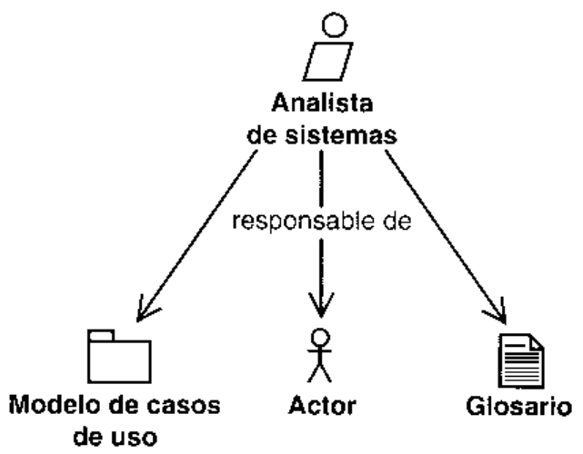

# 7.3.2. Trabajador: especificador de casos de uso

Habitualmente, el trabajo de captura de requisitos puede no estar dirigido por un solo individuo.De hecho, el analista de sistemas esta asistido por otros trabajadores que asumen las respon-sabilidades de las descripciones detalladas de uno o mas casos de uso. Estos trabajadores sedenominan especificadores de casos de uso (Figura 7.7).

Cada especificador de casos de uso necesita trabajar estrechamente con los usuarios realesde sus casos de uso.

# 7.3.3. [  Disenador de interfaz de usuario

Los diseniadores de interfaces de usuario dan forma' visual a las interfaces de usuario. Esto pue-de implicar el desarrollo de prototipos de interfaces de usuario para algunos casos de uso.b  a n  ('   o  osenador de interfaces de usuario de forma a las interfaces de usuario de uno o mas actores.

Ia interfaz de usuario. La implementacion real la hacen los desarrolladores durante los flujos de trabajo de diseno e imple- 1 Entendemos por disenio de inerfaces de usuario la forma visual de la interfaz de usuario, no la implementacion real dementacion.

# 7.3.4. Trabajador: arquitecto

El arquitecto participa en el flujo de trabajo de los requisitos para describir la vista de la ar-quitectura del modelo de casos de uso (Figura 7.9).

La vista de la arquitectura del modelo de casos de uso es una entrada importante para pla-nificar las iteraciones, como se describe en la Seccion 7.4.2, "Priorizar casos de uso'.

# 7.4. Flujo de trab

En la seccion anterior, describimos la captura de requisitos en terminos estaticos. Ahoravamos a utilizar un diagrama de actividad (Figura 7.10) para describir el comportamientodinamico.

El diagrama utiliza calles para mostrar que trabajadores ejecutan que actividades; cada ac-tividad (representada por ruedas dentadas) se situa en el mismo campo que el trabajadorque la ejecuta. Cuando los trabajadores ejecutan las actividades, crean y modifican artefactos.Describimos los flujos de trabajo como una secuencia de actividades que estan ordenadas, asique una actividad produce una salida que sirve de entrada a la siguiente actividad. No obs-tante, el diagrama de actividad presenta solamente el flujo logico. En el mundo real, no es ne-vias que producen un resultado final equivalente. Podemos, por ejemplo, comenzar encon-trando algunos casos de uso (la actividad de Encontrar Actores y Casos de Uso), despues di-senar las interfaces de usuario (la actividad de Prototipar la Interfaz de Usuario), solamentea la actividad de Encontrar Actores y Casos de Uso, rompiendo la secuencia estricta marcada),y asi sucesivamente.

Una actividad puede ser retomada muchas veces, y cada una de éstas puede acarrear laejecucion de una sola fraccion de la actividad. Por ejemplo, cuando retomamos la actividad deEncontrar los Actores y Casos de Uso, el nuevo resultado puede ser solamente una identifica-cion adicional de un caso de uso. Por tanto, los caminos de una actividad a otra actividadilustran tan solo la secuencia logica de actividades utilizando los resultados de la ejecucion deuna actividad como entrada para ejecutar otra.

Primero, el analista de sistemas (una persona respaldada por un equipo de analistas) ejecutala actividad de Encontrar Actores y Casos de Uso para preparar una primera version del modelode casos de uso, con los actores y casos de uso identificados. El analista de sistemas debeasegurar que el desarrollo del modelo de casos de uso captura todos los requisitos que sonentradas del flujo de trabajo, es decir, la lista de caracteristicas y el modelo de dominio o denegocio. Entonces, el arquitecto/s identificara/n los casos de uso relevantes arquitectonicamentehablando, para proporcionar entradas a la priorizacion de los casos de uso (y posiblemente otrosrequisitos) que van a ser desarrollados en la iteracion actual. Hecho esto, los especificadores decasos de uso (varios individuos) describen todos los casos de uso que se han priorizado. Mas omenos en paralelo con ellos. los disenadores de interfaz de usuario (varios individuos) sugierenlas interfaces de usuario adecuadas para cada actor basandose en los casos de uso. Entonces elanalista de sistemas reestructura el modelo de casos de uso definiendo generalizaciones entrelos casos de uso para hacerlo lo mas comprensible posible (comentaremos brevemente lasgeneralizaciones en la actividad de Estructurar el Modelo de Casos de Uso).

Los resultados de la primera iteracion a traves de este flujo de trabajo consisten en unaprimera version del modelo de casos de uso, los casos de uso y cualquier prototipo de interfazde usuario asociado. Los resultados de cualquier iteracion subsiguiente consistiran entonces ennuevas versiones de estos artefactos. Hay que recordar que todos los artefactos se completan ymejoran incrementalmente a traves de las iteraciones.

Las distintas actividades en el modelado de casos de uso adoptan formas diferentes en di-ferentes fases del proyecto (vease la Seccion 6.4). Por ejemplo, cuando un analista de sistemasejecuta la actividad de Encontrar Actores y Casos de Uso durante la fase de inicio, identifica-ra muchos actores y casos de uso nuevos. Pero cuando la actividad se realice durante la fase deconstruccion, el analista hara sobre todo cambios secundarios en el conjunto de actores ycasos de uso, tales como la creacion de un diagrama de casos de uso que describa mejor elmodelo de casos de uso desde una perspectiva en particular. A continuacion, vamos a describir

# 7.4.1. Actividad: encontrar actores y casos de uso

Identificamos los actores y los casos de uso para:

· Delimitar el sistema de su entorno.

· Esbozar quien y que (actores) interactuaran con el sistema, y que funcionalidad (casos deuso) se cspera del sistema.

· Capturar y definir un glosario de terminos comunes esenciales para la creacion de des-cripciones detalladas de las funcionalidades del sistema (es decir, de los casos deuso).

La identificacion de actorcs y casos de uso es la actividad mas decisiva para obtener ade-cuadamente los requisitos, y es responsabilidad del analista de sistemas (Figura 7.11). Pero elanalista de sistemas ? no puede hacer este trabajo solo. El analista requiere entradas de un equi-po que incluye al cliente, los usuarios, y otros analistas que participan en talleres de modeladodirigidos por el analista de sistemas.

Algunas veces puede que tengamos un modelo del negocio del cual partir. Si cs asi, elcquipo puede preparar un primer borrador del modelo de casos de uso mas o menos “auto-maticamente'. Otras veces, pueden partir del modelo del dominio, o la entrada puede sersolamente una breve descripcion general o la especificacion de requisitos detallada que inclu-ye las caracteristicas generales que se requieren. Tambien podemos tener como entrada losrequisitos adicionales que no pueden ubicarse en casos de uso individuales. Remitimos alCapitulo 6 para una descripcion de esos distintos artefactos de entrada.

Esta actividad consta de cuatro pasos:

e e s usp e p e  sa dad sdi anb en p pdd pa a i iad en a  2 Realmente, queremos decir aqui,*la persona que actua como analista del sistema. Llega a ser un poco pesado el dis-utilizamos el mismo enfoque para los otros trabajadores que se tratan.

· Encontrar los actores.

· Encontrar los casos de uso.

· Describir brevemente cada caso de uso.

· Describir el modelo de casos de uso completo (este paso tambien incluye la preparacionde un glosario de terminos).

Estos pasos no tienen por que ser ejecutados en ningun orden en particular y a menudo sehacen simultaneamente. Por ejemplo, el diagrama de casos de uso puede actualizarse tanpronto como identifiquemos un nuevo actor o caso de uso.

El resultado de esta actividad es una nueva version del modelo de casos de uso con actoresy casos de uso nuevos o cambiados. Podemos describir y dibujar superficialmente el artefactomodelo de casos de uso resultante, hasta el punto de poder describir cada caso de uso en deta-1le, que es lo que hace la siguiente actividad: detallar un Caso de Uso. La Figura 7.12 es unailustraci6n de un diagrama de caso de uso de ese tipo (madurado y reestructurado a traves dealgunas iteraciones). Pronto lo describiremos con mas detalle.

7.4.1.1.  Encontrar los actores  La tarea de encontrar los actores depende denuestro punto de partida

Cuando tenemos un modelo del negocio del cual partir, encontrar los actores resulta senci-cada actor del negocio (es decir, a cada cliente del negocio) que utilizara la informacion delsistema (vease tambien el Capitulo 6, Seccion 6.6.3).

En otro caso, con o sin un modelo del dominio, el analista del sistema, junto con el cliente,identifica los usuarios e intenta organizarlos en categorias representadas por actores.

En ambos casos, debemos identificar los actores que representan sistemas externos y los

Hay dos criterios uitiles a la hora de elegir los candidatos a actores: primero, deberia ser posi-ble identificar al menos a un usuario que pueda representar al actor candidato. Esto nos ayudaraa encontrar solamente a los actores relevantes, y eliminara a los actores que solo son fantasmas ennuestra imaginacion. Segundo, deberia existir una coincidencia minima entre los roles que de-sempenian las instancias de los diferentes actores en relacion con el sistema. No queremos dos omas actores que tengan en esencia los mismos roles. Si esto ocurre, debemos intentar combinarun actor generalizado que tenga asignados fos roles comunes a los actores que se solapan. Estenuevo actor puede ser especializado utilizando generalizaciones. Por ejemplo, el comprador y elvendedor pueden ser especializaciones del actor Cliente del Banco. En un primer momento, es ha-bitual encontrar muchos actores que se solapan. Esto lleva a algunas discusiones antes de en-contrar el conjunto de actores adecuado y de la definicion de las generalizaciones.

El analista de sistemas da nombre a los actores y describe brevemente los papeles de cadaimportante para comunicar la semantica deseada. La descripcion breve de cada actor debe es-bozar sus necesidades y responsabilidades.

# Ejemplo Los actores Comprador, Vendedor y Sistema de CuentasBancarias

# Comprador

describe en el caso de uso Ventas: del pedido a la entrega. Esta persona puede ser un individuo (esdecir, no asociado a una compania), o alguien dentro de una empresa. El Comprador de bienes y ser-

# Vendedor

Un Vendedor representa a una persona que vende y distribuye bienes o servicios. El Vendedor utilizael sistema para conseguir nuevos pedidos y entregar las confirmaciones de pedido, facturas y avisosde pago

# Sistema de Cuentas Bancarias

Bancarias.

El resultado de este paso es una nueva version del artefacto modelo de casos de uso conun conjunto de actores actualizado, cada uno con una breve descripcion. Estos acloresbrevemente descritos pueden utilizarse ahora como punto de partida para encontrar los casosde uso.

7.4.1.2.  Encontrar los casos de uso  Cuando el punto de partida es el modelodel negocio, cncontramos los actores y casos de la forma descrita en la Seccion 6.6.3, “Bus-queda de casos de uso a partir de un modelo del negocio", del Capitulo 6. Se propone un casode uso para cada rol de cada trabajador que participa en la realizacion de casos de uso delnegocio y que utilizara informacion del sistema. En otros casos, el analista de sistemas identi-ficara los casos de uso a traves de los talleres con los clientes y los usuarios. El analista de sis-temas va repasando los actorcs uno por uno y proponiendo los casos de uso para cada actor. Porejemplo, pueden utilizarse las entrevistas y el storyboarding para comprender que casos de usoson necesarios: vease [16]. El actor necesitara normalmente casos de uso para soportar sutrabajo de creaci6n, cambio, rastreo, eliminacion o estudio de los objetos del negocio, como Pe-didos y Cuentas, que se utilizan en los casos de uso del negocio. El actor tambien puedeinformar al sistcma acerca de algunos sucesos externos u otras formas de representacion —elactor puede necesitar al sistema para informarle de algunos sucesos que han tenido lugar,como cuando una factura ha vencido y no se ha pagado--. Puede haber tambien actores adi-cionales que ejecuten el inicio del sistema, su mantenimiento o su terminacion.

Algunos de los candidatos no llegaran a ser casos de uso por sf mismos; en cambio, podranser partes de otros casos de uso. Hay que recordar que intentamos crear casos de uso faciles demodificar, revisar, probar y manejar unitariamente.

Elegimos un nombre para cada caso de uso de forma que nos haga pensar en la secuenciade acciones concreta que anade valor a un actor. El nombre de un caso de uso a menudocomienza con un verbo, y debe reflejar cual es el objetivo de la interaccion entre el actor y elsistema. En nuestro ejemplo, tenemos casos de uso como Pagar Factura y Solicitar Bienes 0Servicios.

Algunas veces es dificil decidir el ambito de un caso de uso. Una secuencia de interaccionesusuario-sistema se puede especificar en un caso de uso o en varios, los cuales el actor invocauno tras otro. Cuando decidimos si un caso de uso candidato debe ser un caso de uso como tal,de otro caso de uso. Hay que recordar que los casos de uso anaden valor a los actores (veasela Seccion 7.2.3, "Caso de uso"). Para ser mas especificos, un caso de uso entrega un resulta-d od u s o a ooe n e oa e an A aaso pnd as ab  identificar un “buen" caso de uso puede ayudar a determinar el ambito apropiado de uno deellos.

Observese que hay dos frases claves en estas directrices que constituyen criterios utiles parala identificacion de casos de uso, resultado de valor y un actor en concreto:

· Resultado de valor: Cada ejecucion satisfactoria de un caso de uso debe proporcionaralgun valor al actor para alcanzar su objetivo [3]. En algunos casos, el actor quiere pagarpor el valor devuelto. Notese que una instancia de caso de uso, como la de una llamadatelefonica, puede implicar a mas de un actor. En este caso, el criterio para "un resultado devalor observable” debe ser aplicado al actor iniciador Este criterio de “resultado de valor?nos ayuda a evitar encontrar casos de uso demasiado pequenios.

# Ejemplo El ambito del caso de uso Pagar Facturas

El Sistema de Facturacion y Pago ofrece un caso de uso llamado Pagar Facturas, que lo utiliza uncomprador para planificar los pagos de las facturas por los bienes que él o ella ha solicitado y recibido.

S oed un ap uinoala ei ooo uouid ei ouei anoui senoes leed osn ap os l'soed ap uoionoale el eied eno A uoioeoueld el eied eun 'saed sop ua osn ap oseo la sowiii"Pianificacion de Pagos" no anadiria valor por si mismo. El valor se obtiene una vez que la factura hasido pagada (en este punto no nos tenemos que preocupar por los recordatorios de pago).

· Un actor en concreto: Identificando casos de uso que proporcionen valores a usuarios in-dividuales reales, nos aseguramos de que los casos de uso no se haran demasiado grandes.

e  e nnu d si  os p soso so sn so  snd ooreestructurados y reevaluados un par de veces antes de que el modelo de casos de uso se estabilice.

Como ya tratamos en el Capitulo 4, los casos de uso y la arquitectura del sistema se desa-rrollan mediante iteraciones. Una vez que ya tenemos la arquitectura, los nuevos casos de usoque capturemos deben ser adaptados a la arquitectura existente. Los casos de uso que no seajusten a la arquitectura elegida deben ser modificados para que encajen mejor con la arqui-tectura (podemos tambien mejorar la arquitectura para acomodar los nuevos casos de uso). Porejemplo, podemos haber hecho el trabajo inicial de especificacion de un caso de uso con unainteraccion particular del usuario en mente. Una vez que hemos elegido un determinado mar-co de trabajo de IGU puede que tengamos que modificar los casos de uso, aunque estas adap-taciones sean, normalmente, muy pequenas

No obstante, se pueden requerir cambios mas drasticos. El analista de sistemas puede propo-ner una forma de supervision de la carga del sistema especificando un simulador que actuecomo un actor relevante, que requiere casos de uso del sistema. De esta forma, se puede medir lostiempos de respuesta y otros requisitos de ejecucion. Tambien se puede medir el tiempo que uncaso de uso permanece en colas internas del sistema. Estos dos enfoques pueden dar valorestectura existente. Asi que el analista de sistemas puede necesitar que se renegocien los requisitosP   s  s   d    (  o  s)y mantener para los desarrolladores. El cliente tambien gana con la renegociacion de los requisitosy consigue la funcionalidad del sistema antes, con una mayor calidad y un menor coste.

7.4.1.3.  Describir brevemente cada caso de uso  A medida que los analistasvan identificando los casos de uso, algunas veces garabatean unas pocas palabras explicando cadacaso de uso, 0 algunas veces solo escriben los nombres. Despues, describen brevemente cada'n s a s s s n ss se o  rd  os p osdescripcion paso a paso de lo que el sistema necesita hacer cuando interactua con sus actores.

# Ejemplo Descripcion inicial del caso de uso Pagar Factura

# Breve descripcion

de uso Pagar Factura efectua el pago el dia de vencimiento de la misma.

# Descripcion paso a paso inicia!

Despues de que el caso de uso comience, el Comprador ya ha recibido una factura (enviada por otrocaso de uso lamado Enviar Factura al Comprador), y tambien ha recibido los bienes y servicios de-mandados:

2.  El Comprador planifica el pago de la factura por banco.

3. Cuando vence el dia de pago, el sistema revisa si hay suficiente dinero en la cuenta delComprador. Si tiene suficiente dinero disponible, se hace la transaccion.

Hasta aqui hemos descrito brevemente los actores y los casos de uso. No obstante, no es su-ficiente con describir y comprender cada caso de uso aisladamente. Tambien necesitamos verel cuadro completo. Necesitamos explicar como estan relacionados entre si los casos de uso ylos actores y como juntos constituyen el modelo de casos de uso.

7.4.1.4. Descripcion del modelo de casos de uso en su totalidadPreparamos diagramas y descripciones para explicar el modelo de casos de uso en su totalidad,especialmente como se relacionan los casos de uso entre si y con los actores.

No hay una regla estricta sobre lo que se debe incluir en el diagrama. De hecho, elegimos elconjunto de diagramas que describan mas claramente el sistema. Por ejemplo, podemos dibujardiagramas para mostrar los casos de uso que participan en un caso de uso del negocio (vease laFigura 7.12) o quizas para ilustrar los casos de uso que ejecuta un actor.

Para asegurar la consistencia cuando se describen varios casos de uso concurrentemente,resulta practico desarrollar un glosario de terminos. Estos terminos pueden derivar en (y llevarla traza de) clases en un modelo del dominio o un modelo de negocio (descrito en el Capitu-10 6).

El modelo de casos de uso requiere ser un modelo plano, como el que se describe aqui. Tam-bien puede organizarse en conjuntos de casos de uso llamados paquetes de casos de uso [12].

La salida de este paso es también una descripcion general del modelo de casos de uso. Estadescripcion explica el modelo de casos de uso como un todo. Describe como interactuan los ac-tores y los casos de uso y como se relacionan entre si los casos de uso. En la representacion delmodelo de casos de uso de UML, la descripcion general es un valor etiquetado del propiomodelo (vease el Apendice A, Seccion A.1.2).

# Ejemplo Descripcion general

La descripcion general para el modelo de casos de uso del Sistema de Facturacion y Pagos (veasela Figura 7.12) podria parecerse a lo siguiente. En esta descripcion, hemos incluido comentariosnumerados, que se explican al final del ejemplo.

El comprador utiliza el caso de uso Solicitar Bienes y Servicios para buscar los productos yprecios, para realizar un pedido y despues enviarlo.

El comprador activa el caso de uso Pagar Factura para dar el visto bueno a la factura recibidatomaticamente el dinero desde la cuenta del comprador a la cuenta del vendedor (comentario 1)

se produce un descubierto en el saido (comentario 2).

Vamos a pasar ahora a como utiliza el sistema el vendedor. El vendedor puede estudiar,Un pedido confirmado estara seguido de la entrega de los bienes o servicios (no descritos ennuestro modelo de casos de uso de ejemplo; de hecho se hace fuera del Sistema de Facturacionprador a traves del caso de uso Enviar Factura al Comprador. Al llevar a cabo la facturacion, elshn seuuo ea uaiguei anb apand A oanosap un reode anb ebuai anb apand opapuanfacturas en una.

Si el comprador no ha pagado en la fecha de vencimiento, se informara al vendedor y este pue.antes de que sean enviados para evitar violentar a algun cliente (comentario 3).

# Comentarios

1. Recuerdese que el modelo de casos de uso es mas que una lista de casos de uso.Tambien describe generalizaciones entre esos casos de uso. Por ejemplo, la subsecuenciade acciones para transacciones de pago en el caso de uso Pagar Factura puede sercompartida por muchos casos de uso (incluso aunque solamente se muestre una genera--qns el anb eounis uoioezielauan ei 'senoey sebed owoo 'osn ap soseo souea ap aeds  s n r sis  o g   s nsde uso Ejecutar Transaccion.

-and eiouanos el 'enoes sed osn ap os gap eiuiisui el enoala eaisis a anb epia b zde extenderse para incluir la secuencia de acciones descrita en el caso de uso extendidoy extension para mostrar que el modelo de casos de uso puede estructurarse para hacer masfacil la especificacion y comprension del conjunto total de requisitos funcionales; para masinformacion vease [7].

3. Enviar Aviso muestra un caso de uso que simplifica los caminos correctivos en los casos de'oanu ap eisid el algos asiauod e, osaooid je epne oaoaos ouso epeo oiobau lep osnpara prevenir un pequeno problema en la iteracion con el cliente, que podria convertirse en unap soseo ap aselo eisi 'souiweo sol ua seuoloeiasap ibaoo e uapne sal enb (osn ap sosesuso a menudo constituyen una gran cantidad de las responsabilidades totales del sistema paratratar las muchas posibles desviaciones.

# Descripcion

Hay varios modos de dar forma a un modelo de casos de uso, y este ejemplo solo ilustra una dea is esed ano? opeuoi soway anb osjwoidwon ap sauoonjos sel ap seunhje seleni e sowes 'seecomprador hojea un catalogo de bienes y servicios disponibles por Internet y despues hace un pedidointeractivo, y obtiene la confirmacion al instante? zSeguiria siendo necesario un caso de uso sepa-rado Confirmar Pedido? La respuesta es que no, ya que la confirmacion directa podria incluirse en elcaso de uso Solicitar Bienes y Servicios.

ozieue opis eey opipad un anb sandsap anb opinse soay 'auisgo ou 'oidwala aisa uo bien se confirma, o bien el vendedor realiza una propuesta alternativa. Por ejemplo, el vendedorpuede sugerir un conjunto de bienes alternativos de igual utilidad, mas barato, o que se entregase describe a continuacion:

1. Un comprador realiza un pedido inicial.2.  El vendedor sugiere un pedido alternativo y se lo envia al comprador.3.E El comprador realiza el pedido final.4.B  El vendedor envia al comprador una confirmacion de pedido.

Esto pasos se cubren con dos casos de uso: Solicitar Bienes y Servicios y Confirmar Pedido. 2Porque no hay cuatro casos de uso diferentes --o solo un caso de uso--? Vamos a ver primero por queestos pasos no se describen como un caso de uso grande: no queremos forzar al vendedor y allizarlos y confirmarlos todos al mismo tiempo. Esto no podria ser posible si los cuatro pasossiempre se termina antes de comenzar otro caso de uso.

Como resultado, un vendedor no podria tener varios pedidos iniciales pendientes (despues delpaso 1), y habria que esperar para que los pedidos alternativos fuesen enviados (paso 2, en elejemplo).

un oied 'sotunsip osn ap soseo ouieno las e jebell uejupod sosed oeno soi anb cisandns jodo ssaidxe uepod anb seis uen uos (e a i sosed) peu opiad un  peioiui oppadel diseno.

De forma similar, proponer un pedido alternativo (paso 2) implica la confirmacion de las partes depedido (paso 4) implica la confirmacion de todas las partes. Ambos pasos pueden expresarse en undo como sugerir alternativas. Asi que habra un caso de uso llamado Solicitar Bienes y Servicios, queproporciona los servicios correspondientes a los pasos 1 y 3, y otro caso de uso llamado ConfirmarPedido, que se corresponde con los pasos 2 y 4.

Cuando la descripcion del modelo de casos de uso este preparada, dejamos que de el vistobueno del modelo de casos de uso la gente que no forma parte del cquipo de desarrollo (esdecir. clientes y usuarios), convocando una revision informal para determinar si:

· Se han capturado como casos de uso todos los requisitos funcionales necesarios.

· La secuencia de acciones es correcta, completa y comprensible para cada caso de uso.· Se identifica alguin caso de uso que no proporcione valor. Si es asi, ese caso de uso deberiareconsiderarse.

# 7.4.2. Actividad: priorizar casos de uso

El proposito de esta actividad es proporcionar entradas a la priorizacion de los casos de usopara determinar cuales son necesarios para el desarollo (es decir, analisis, diseno, implemen-tacion, etc.) en las primeras iteraciones, y cuales pueden dejarse para mas tarde (Figura 7.13).

Los resultados se recogen en la vista de la arquitectura del modelo de casos de uso. Despues,esta vista se revisa con el jefe de proyecto, y se utiliza como entrada al hacer la planificacion delo que debe desarrollarse dentro de una iteracion. Hay que darse cuenta de que esta planificaciontambien necesita la consideracion de otros aspectos no tecnicos, como los aspectos econ6-micos 0 del negocio del sistema quc va a ser desarrollado (vease el Capitulo 12, Seccion 12.4.2).

La vista de la arquitectura del modelo de casos de uso debe mostrar los casos de uso signi-ficativos desde el punto de vista de la arquitectura. Remitimos a la Seccion 7.2.4, “Descripcionde la arquitectura (vista del modelo de casos de uso)" para mas detalles.

# 7.4.3.  Actividad: detallar un caso de uso

El objetivo principal de detallar cada caso de uso es describir su flujo de sucesos en detalle,

Con el modelo de casos de uso y los diagramas de casos de uso asociados como punto decomienzo, el especificador de un caso de uso individual puede ya describir cada caso de uso endetalle. El especificador de casos de uso detalla paso a paso la descripcion de cada caso de usoen una especificacion precisa de la secuencia de acciones. En esta seccion veremos:

· Como cstructurar la descripcion para especificar todas las vias alternativas del caso de uso.· Que incluir en una descripcion de caso de uso.· Como formalizar la descripcion del caso de uso cuando sea necesario.

Cada especificador de casos de uso debe trabajar estrechamente con los usuarios reales delos casos de uso. El especificador de casos de uso necesita entrevistarse con los usuarios, qui-zas anotar su comprension de los casos de uso y discutir propuestas con ellos, y solicitarles querevisen la descripcion de los casos de uso.

El resultado de esta actividad es la descripcion detallada de un caso de uso en particular enforma de texto y diagramas.

7.4.3.1.  Estructuracion de la descripcion de casos de uso  Ya hemosmencionado que un caso de uso define los cstados que las instancias de los casos de uso puedentener y la posible transici6n entre estos estados (vease la Figura 7.15). Cada transicion es unapor efecto de un suceso, como podria ser un mensaje.

El grafico de transicion de estados ilustrado cn la Figura 7.15 puede llegar a ser bastanteintrincado. Por ello, dcbemos describir la posible transicion de estados de manera simple yprecisa. Una tecnica probada es elegir un camino basico completo (las flechas rectas en lala descripcion. Entonces podemos describir en secciones separadas el resto de los caminos(flechas curvas) como caminos alternativos o desviaciones del camino basico. Algunas veces.no obstantc, las alternativas o desviaciones son lo suficientemente pequenas como para expli-carlas ^en linea” como parte de la descripcion del camino basico. El sentido comun determina

i  es os   ep s o  ,  ep odsp ei snica que elijamos, tendremos que describir todas las alternativas, sino no habremos especificadoel caso de uso.

Las alternativas, dcsviaciones, 0 excepciones del camino basico pueden ocurrir por muchasrazones:

· El actor puede elegir entrc diferentes caminos en el caso de uso. Por ejemplo, durante elcaso de uso Pagar Factura, el actor puede decidir pagar una factura o rechazarla.· Si esta implicado mas de un actor en el caso de uso, las acciones de uno de ellos puedeninfluenciar el camino de las acciones del resto de actores.· El sistema puede detectar entradas erroneas de los actores.· Algunos recursos del sistema pueden tener un mal funcionamiento, y asi impedir que elsistema realice de forma adecuada su trabajo.

El camino basico elegido debe ser el camino "normal", esto es, el quc cl usuario percibecomo el que mas habitualmente va a seguir y aquel que proporciona cl valor mas obvio al ac-tor. Generalmente, cada camino basico debe abarcar un par de excepciones y un par de pecu-liaridades que cl sistema raramente necesita manejar.

# Ejemplo Caminos en el caso de uso Pagar Factura

cribir brevemente cada caso de uso"). Este cambio refleja como detallamos los casos de uso amedida que los modelamos, aunque las descripciones completas de los casos de uso en realidad esmas probable que sean mas grandes y que cubran mas caminos.

Precondicion: el comprador ha recibido los bienes y servicios y al menos una factura del sistemaEl comprador ahora planifica el pago de las facturas.

# Camino basico

1. El comprador invoca al caso de uso para comenzar a hojear las facturas recibidas delsistema. El sistema verifica que el contenido de cada factura es consistente con las confir-maciones de pedido recibidas anteriormente (como parte del caso de uso Confirmar Pedido)y asi indicarselo al comprador. La confirmacion de pedido describe que elementos seranenviados, cuando, donde y a que precio.

2.  El comprador decide planificar una factura para pagarla por banco, y el sistema genera unapeticion de pago para transferir el dinero a la cuenta del vendedor. Notese que un compradorno puede planificar el pago de la misma factura dos veces.

3.  Mas tarde, si hay suficiente dinero en la cuenta del comprador, se hace un pago mediantecuenta del comprador a la cuenta del vendedor, como se describe en el caso de uso abs-

la transaccion, que se retiran de la cuenta del comprador.

4.  La instancia del caso de uso finaliza.

# Caminos alternativos

a! vendedor.

En el paso 3, si no hay suficiente dinero en la cuenta, el caso de uso cancelara el pago y se lonotificara al comprador

Postcondicion: la instancia del caso de uso termina cuando la factura ha sido pagada 0 cuandoel pago de la factura ha sido cancelado y no se ha hecho ninguna transferencia.

Debido a que los casos de uso deben ser entendidos por los desarrolladores y por losclientes y usuarios, deberian describirse siempre utilizando un castellano corriente como el quese utiliza en este ejemplo.

7.4.3.1.1.  iQue incluir en una descripcion de caso de uso?. Como hemosmostrado en el ejemplo anterior, la descripcion de un caso de uso debe incluir lo siguiente:· La descripcion de un caso de uso debe definir el estado inicial (vease la Figura 7.15) comoprecondicion.· Como y cuando comienza el caso de uso (es decir, la primera accion a ejecutar; paso 1 ).· El orden requerido (si hay alguno) en el que las acciones se deben ejecutar. En este· Como y cuando terminan los casos de uso (paso 4).· Una descripcion de caso de uso debe definir los posibles estados finales (Figura 7.15)como postcondiciones.· Los caminos de ejecucion que no estan permitidos. La nota del paso 2 nos indica que esecamino no es posible —pagar una factura dos veces—. Es un camino que el usuario nopuede tomar.· Las descripciones de caminos alternativos que estan incluidos junto con la descripcion delcamino basico. Todo lo que hay en el paso 3 son acciones que se ejecutan solamente sihay suficiente dinero en la cuenta.· Las descripciones de los caminos alternativos que han sido extraidas de la descripcion delcamino basico (paso 5).· La interaccion del sistema con los actores y qué cambios producen (pasos 2 y 3). Losejemplos mas tipicos son cuando el comprador decide planificar el pago de la factura enel paso 2 y cuando se notifica el resultado de la transaccion al comprador y al vendedor enel paso 3. En otras palabras, describimos la secuencia de acciones del caso de uso, comoestas acciones son invocadas por los actores y como su ejecucion resulta en solicitudes alos actores.

· La utilizacion de objetos, valores y recursos de sistema (paso 3). Dicho de otra formahemos descrito la secuencia de acciones en la utilizacion de un caso de uso, y hemosasignado valores a los atributos de los casos de uso. Un ejemplo claro es cuando setransfiere el dinero de la cuenta del comprador a la cuenta del vendedor en el paso 3.Otro ejemplo podria ser la utilizacion de facturas y confirmaciones de pedidos en elpaso 1.

· Observese que debemos describir explicitamente que hace el sistema (las acciones queejecuta). Dcbemos ser capaces de separar las responsabilidades del sistema y las de losactores, sino, la descripcion del caso de uso no sera suficientemcnte precisa para poderutilizarla como especificacion del sistema. Por ejemplo, cn el paso 1, escribimos "elo    spedido recibida'", y en paso 3, “estos cargos se retiran de la cuenta del comprador por elsistema".

Los atributos de los casos de uso pueden utilizarse como inspiracion para encontrar mastarde clases y atributos en el analisis y diseno. Por ejemplo, podemos identificar una clase dediseno llamada Factura, derivada de un atributo factura de un caso de uso. Durante el analisisy el diseno, también consideraremos algunos objetos que se utilizaran en varios casos de uso,aunque no es necesario considerarlo cn cl modelo de casos de uso. De hecho (como se ha dis-cutido en la Secci6n 7.2.3, "Caso de uso"), mantenemos simple el modelo de casos de usoprohibiendo las interacciones entre las instancias de casos de uso y prohibiendo a las instanciasacceder a los atributos de las otras.

Hemos hablado a menudo sobre los requisitos funcionales y como representarlos medianterequisitos no funcionales estan relatados con casos de uso especificos, como los requisitos paraespecificar la velocidad, disponibilidad, exactitud, tiempo de respuesta o utilizacion de memoriaque el sistema necesita para ejecutar los casos de uso. Estos requisitos se asocian como requisitos especiales (valores etiquctados en UML) con el caso de uso en cuestion. Esto puededocumentarse, por ejemplo. en una seccion separada dentro de la descripci6n de casos de uso.

# Ejemplo Requisito especial (de rendimiento)

Cuando un comprador envia una factura para su pago, el sistema debe responder con una verifica-u uoioaa el eed oda l sos sol ap ouaio lod o le ua opunas o'l ua uad el ap uoidebe exceder nunca 10,0 segundos, a menos que se rompa la conexion de red (en cuyo caso de-beriamos notificarselo al usuario).

Si cl sistema interactua con algunos otros sistema (actores no humanos), cs necesarioestandar). Esto se debe hacer en las primeras iteraciones, durante la fase de elaboraci6n, debi-do a que la realizacion de comunicaciones entre sistemas tiene habitualmente influencia en laarquitectura.

Las descripciones de casos de uso se dan por finalizadas cuando se consideran comprensi-bles, correctas (es decir, capturan adecuadamente los requisitos), completas (es decir, describentodos los caminos posibles) y consistentes. Las descripciones son evaluadas por los analistas,los usuarios y los clientes en reuniones de revision que se establecen al final de la captura derequisitos. Solamente los clientes y los usuarios pueden verificar si los casos de uso son loscorrectos.

7.4.3.2.  Formalizacion de la descripcion de casos de uso  La figura7.15 muestra como las transiciones hacen pasar a las instancias de los casos de uso de unnecesitamos describir explicitamente los estados. En su lugar, podemos elegir utilizar el es-tilo utilizado en el ejemplo de Pagar Factura. Aun asi, es una buena idea tener una maquinade estados en nuestras mentes cuando describimos un caso de uso, para asegurarnos de quecubre todas las posibles situaciones. No obstante, en algunas ocasiones, como cuandoeso puede llegar a ser necesaria una tecnica de descripcion mas estructurada. La interaccionsun A sopeise soun aod 'oidefe sod rensuen apand osn ep soseo sol A saonoe sol anuetransiciones alternativas que es casi imposible mantener consistente la descripcion textual delos casos de uso. Entonces puede ser uitil utilizar una tecnica de modelado visual paradescribir los casos de uso. Estas tecnicas pueden ayudar al analista de sistemas a mejorar lacomprension de los casos de uso:

· Pueden utilizarse los diagramas de estado de UML para describir los estados de los casosde uso y las transiciones entre esos estados; vease la Figura 7.16.

· Pueden utilizarse los diagramas de actividad para describir las transiciones entre estadoscon mas detalle como secuencias de acciones. Los diagramas de actividad pueden des-cribirse como una generalizacion de los diagramas de transicion de estados de SDL [15],· Se pueden utilizar los diagramas de interaccion para describir como interactua una ins-tancia de caso de uso con la instancia de un actor. Los diagramas de interaccion, entonces,muestran el caso de uso y el actor (o actores) participante.

Véase [2, 11, 12 17] para la explicacion de diagramas de estados, interaccion y actividad.

# Ejemplo Utilizacion de diagramas de estado para describir casosde uso

au ound 13 enioey tebed ap osn ap oser la eied sopeisa ap eweibeip un sa gt'/ einb eap arainb cse osn ap oseo lap ozuawoo la eripui ewiie lap loadns aed el ua eise anbque es ahi donde comienza la maquina de estados cuando se inicia un caso de uso. La flecha queparte del punto negro muestra a donde transita la maquina de estados inmediatamente cuando selas esquinas redondeadas. La transicion entre estados se muestra con flechas que van de unestado a otro.

Primero, el usuario hojea la factura (Paso 1 en el anterior ejemplo de Pagar Factura) y entoncesdecide planificar (Paso 2) o rechazar (Paso 5) una factura.

El caso de uso transita del estado Factura Planificada a Factura Pagada cuando la facturaplanificada se paga en la fecha de vencimiento (Paso 3). El caso de uso termina inmediatamente (el

o epebed einioey ap opeise je opezueoje eu as anb ap sendsap (osuap oibau ojund un uoo oinouioel de Factura Cancelada.

Notese que el uso de estos diagramas en el contexto de los casos de uso puede llevarnosalgunas veces a largos y complejos diagramas que son muy dificiles de leer y comprender. Porejemplo, un unico caso de uso puede implicar muchos estados que son dificiles de nombrar deforma comprensible. Esto es especialmente delicado si los interesados que no son desarrolla-dores de software deben leer los diagramas. Tambien es muy costoso desarrollar diagramasdetallados y mantenerlos consistentes con otros modelos del sistema.

Asi que nuestra recomendacion basica es utilizar esta clase de diagramas con cuidado, y quelas descripciones simplemente textuales (es decir, descripciones de flujos de sucesos) de los ca-sos de uso son con frecuencia suficientes. Tambien, en muchos casos las descripciones textualesy los diagramas pueden complementarse unos con otros.

# 7.4.4.  Actividad: prototipar la interfaz de usuario

El objetivo de esta actividad es construir un prototipo de interfaz de usuario (vease la Figu-ra 7.17).

Hasta ahora, el analista de sistemas ha desarrollado un modelo de casos de uso que espe-cifica que usuarios hay y para que necesitan utilizar el sistema. Esto se ha presentado en losdiagramas de casos de uso, en las descripciones generales del modelo de casos de uso y en lasdescripciones detalladas para cada caso de uso.

Ahora necesitamos disenar la interfaz de usuario que permita al usuario llevar a cabo loscasos de uso de manera eficiente. Lo haremos en varios pasos. Comenzamos con los casos deuso e intentamos discernir que se neccsita de las interfaces de usuario para habilitar los casos deuso para cada actor. Esto es, hacemos un diseno logico de la interfaz de usuario. Despues,creamos el diseno fisico de la interfaz de usuario y desarrollamos prototipos que ilustrencomo pueden utilizar el sistema los usuarios para ejecutar los casos de uso [1]. Mediante laespecificacion de que se necesita antes de decidir como realizar la interfaz de usuario, llegamosa comprender las necesidades antes de intentar realizarlas [1].

El resultado final de esta actividad es un conjunto de esquemas de interfaces de usuario yactores mas importantes.

7.4.4.1.(  Crear el diseno logico de una interfaz de usuario Cuandolos actores interactuen con el sistema, utilizaran y manipularan elementos de interfaces deusuario que representan atributos (de los casos de uso). A menudo estos son terminos delglosario (por ejemplo, balance de cuenta, fecha de vencimiento y titular de cuenta). Losactorcs pueden experimentar estos elementos de las interfaces de usuario como iconos,listas de elementos u objetos en un mapa de 2D, y pueden manipularlos por seleccion,arrastre o hablando con ellos. El disenador de interfaces de usuario identifica y especificaestos elementos actor por actor, recorriendo todos los casos de uso a los que el actorpuede acceder, e identificando los elementos apropiados de la interfaz de usuario para cadacaso de uso. Un unico elemento de interfaz de usuario puede intervenir en muchos casos deuso 3, desempenando un papel diferente en cada uno. Asi, los elementos de la interfaz deusuario pueden disenarse para jugar varios roles. Deberiamos responder a las siguientespreguntas para cada actor:

· Que elementos de interfaz de usuario se necesitan para posibilitar el caso de uso?· Como deberian relacionarse unos con otros?· Como se utilizaran en los diferentes casos de uso?· Cual deberia ser su apariencia?· Como deberian manipularse?

Para determinar que elementos de interfaz de usuario necesitan ser accesibles al actor encada caso de uso, podemos contestar a las siguientes preguntas:

· :Que clases del dominio, entidades del negocio o unidades de trabajo son adecuadas comoelementos de la interfaz de usuario para cada caso de uso?

· Con que elementos de la interfaz de usuario va a trabajar el actor?

· Que acciones puede invocar el actor, y que decisiones pucde tomar?

· tQue guia o informacion va a necesitar el actor antes de invocar cada accion de los casosde uso?

· tQué informaci6n debe proporcionar el actor al sistema?

· :Que informacion debe proporcionar el sistema al actor?

· Cuales son los valores medios de todos los parametros de entrada o salida? Por ejemplo,cuantas facturas manejara habitualmente un actor durante una sesion y cual es el saldo decuenta medio? Necesitamos estimaciones aproximadas de estas cosas porque asi setir un rango suficientemente grande).

# Ejemplo Elementos de interfaz de usuario empleados en el casode uso Pagar Factura

epod einb ap aselo anb owoo jse 'eeued el aiqos sejeqen eled enisaoau jooe ja anb ouensn apnecesitar el actor mientras trabaja.

El actor trabajara seguramente con elementos de la interfaz de usuario como Facturas (identifi-cadas a partir de una clase del dominio o de una entidad del negocio). Factura es por tanto unelemento de la interfaz de usuario como se ilustra en la Figura 7.18. Notese que las facturas tiene unafecha de vencimiento, una cantidad a pagar y una cuenta destino. Todos estos atributos sonnecesarios para un actor, que debe decidir si paga o no la factura.

Ademas, como el actor esta decidiendo que facturas pagar, él o ella puede querer consultar lacantidad de dinero en su cuenta para evitar quedarse en numeros rojos. Esto es un ejemplo de laclase de guia o informacion que un actor necesita. La interfaz de usuario debe pues mostrar lasfacturas segun se planifican en el tiempo y como afectara el pago planificado de las facturas al saldoclase del dominio comprador del Capitulo 6). La cuenta es ror eso otro aspecto de la interfaz deusuario. El saldo de la cuenta y su variacion esperada en el tiempo a medida que se paguen las fac-turas se indican en la Figura 7.18 mediante el atributo cuenta y mediante la asociacion factura a pa-gar entre los elementos de la interfaz de usuario Cuenta y Factura (vease la Figura 7.18).

Una forma practica de trabajo es representar los elementos de la interfaz de usuario medianteuna nota adhesiva 4 (como se muestra en la Figura 7.18), pegarlas en una pizarra, y ordenarlas parailustrar la apariencia de la intcrfaz de usuario. Seguidamente, los disenadores de interfaces dcusuario describen como pueden utilizar los actores estos elementos cuando trabajen con los casosde uso. La ventaja de utilizar notas adhesivas cs que pueden representar la cantidad necesaria desimplemente eliminarlas-, lo que hace que el usuario se sienta comodo proponiendo cambios.

De esta forma, los disenadores de interfaz de usuario aseguran que cada caso de uso esaccesible a traves de sus elementos de las interfaces de usuario. No obstante, también debenasegurarse de que el conjunto de casos de uso accesibles para el actor tiene una interfaz deusuario bien integrada, facil de utilizar y consistente.

Hasta aqui, solo hemos estudiado las necesidades del actor respecto al interfaz de usuario.Vcremos ahora como la interfaz fisica de usuario puede proporcionarnoslas.

7.4.4.2. Creacion de un diseno y un prototipo fisicos de interfazde usuario  Los disenadores de interfaz de usuario primero preparan unos csquemasterfaces de usuario utiles para los actorcs. Despues, bosquejan elementos adicionales neccsariospara combinar varios elementos de interfaces de usuario en interfaces de usuario completos. Es-tos elementos adicionales pueden incluir contenedores de los clementos de la interfaz deusuario (por cjemplo, carpetas), ventanas, herramientas y controles; vease la Figura 7.19. Estosesquemas pueden prepararse despues (o a veces concurrentemente) del desarrollo de las notasadhesivas identificadas durante el diseno de la interfaz de usuario logica.

# Modelado esencial de casos de uso

Las descripciones detalladas de los casos de uso son un buen punto de partida cuando di-senamos la interfaz de usuario --algunas veces un punto de partida demasiado bueno. Elproblema es que las descripciones a menudo contienen decisiones implicitas sobre las in-terfaces de usuario. Mas tarde, cuando los disenadores de interfaces de usuario sugiereninterfaces adecuadas para los casos de uso, pueden estar limitadas por esas decisiones im-invoca el caso de uso comenzando a hojear las facturas recibidas.". Tal descripcion puedeenganar al disenador de interfaces de usuario, que creara una interfaz de usuario que inclu-ya una lista de las facturas recibidas para que el comprador pueda hojearlas. Pero puede queesa no sea la mejor forma de estudiar las facturas recibidas. De hecho, el comprador puedeencontrar mas facil hojear las facturas de una forma menos obvia, por ejemplo a través de ico-nos puestos horizontalmente de acuerdo a la fecha de pago y verticalmente de acuerdo a lacantidad a pagar.

Larry Constantine propone un remedio para el problema de las decisiones implicitas en lasinterfaces de usuario [14]. Sugiere que los especificadores de caso de uso primero preparenuna descripcion somera de casos de uso —los casos de uso esenciales-- que no contenganninguna decision implicita de interfaz de usuario. El ejemplo anterior puede entonces rees*cribirse: "El comprador invoca el caso de uso para comenzar a estudiar las facturas recibi-das.."'. Entonces los disenadores de interfaces de usuario pueden utilizar estos casos de usoesenciales como entrada para crear la interfaz de usuario, sin estar limitados por ninguna de-cision implicita.

nificado esencial de una descripcion de caso de uso. En realidad, hacerlo podria requerir masque reemplazar una palabra en una descripcion. Lo importante es evitar tomar decisiones pre-maturas sobre:

'onsn ap zepaui el ap souawale sounbje seuasaid eed giezlln as anb euoai ei -como utilizar una lista o un campo de texto.

· La secuencia de entradas del actor, como introducir un atributo antes que otro.

-ed epunbes eun leoey uapend osn ap oseo ap salopeoyloadsa sol 'apeooud is 'sendsedsada sobre la descripcion de los casos de uso para anadir los detalles que quedaron fuera enla descripcion con el estilo esencial

# Ejemplo

# Diseno y prototipo fisicos de una interfaz de usuario

El disenador de interfaces de usuario bosqueja el siguiente diseno fisico de como el saldo decuenta visualizado se ve afectado en el tiempo por las facturas planificadas. Las facturas se mues-tran como trapecios blancos que reduciran el saldo de la cuenta cuando llegue el momento depagarlas. El disenador de interfaces de usuario elige trapezoides porque son suficientemente an-chos para ser visibles y seleccionables, pero también tienen una punta afilada que se utiliza para

reduccion de saldo de la cuenta en la fecha de vencimiento, como se ilustra en la Figura 7.19. Deigual forma, el dibujo muestra como se anade el dinero a la cuenta, quizas cuando el usuario ingresasu nomina. La figura tambien indica los controles de la interfaz de usuario, como los botones dedesplazamiento y zoom.

Ahora estamos preparados para construir prototipos ejecutables de las configuracionesmas importantes de elementos de interfaz de usuario. Estos prototipos pueden construirse conuna herramienta de prototipado rapido.

Puede haber varios prototipos, quiza uno para cada actor, para verificar que cada actor puedeejecutar el caso de uso que necesita. El esfuerzo de prototipado debe ser proporcional al valorde retorno esperado. Desarrollamos prototipos ejecutables de IGU cuando tenemos mucho queganar en facilidad de uso (por ejemplo, un prototipo para los actores mas importantes), y uti-lizamos bocetos en papel cuando no tengamos tanto que ganar.

La validacion de las interfaces de usuarios a través de revisiones de prototipos y esquemasen los primeros momentos pueden prevenir muchos errores que seran mas caros de corregirdespues. Los prototipos tambien pueden revisarse superficialmente en la descripcion de casosde uso, y permitir que se corrijan despues de que los casos de uso pasen a su disenado. Losrevisores deben verificar que cada interfaz de usuario

· Permite que el actor navegue de forma adecuada.

· Proporciona una apariencia agradable y una forma consistente de trabajo con la interfaz deusuario, como por ejemplo, en cuanto a orden de tabulacion y teclas rapidas.

· Cumple con estandares relevantes como el color, tamano de los botones y situacion de lasbarras de herramientas.

Notese que la implementacion de las interfaces de usuario reales (al contrario que el proto-durante los flujos de trabajo de analisis, disenio e implementacion. El prototipo de interfaz deusuario que hemos desarrollado aqui debera entonces servir como especificacion de la interfazde usuario. Esta especificacion sera realizada en terminos de componentes de calidad profe.sional.

El modelo de casos de uso se estructura para:

· Extraer descripciones de funcionalidad (de casos de uso) generales y compartidas quepueden ser utilizadas por descripciones (de casos de uso) mas especificas.

· Extraer descripciones de funcionalidad (de casos de uso) adicionales u opcionales que pueden extender descripciones (de casos de uso) mas especificas.los casos de uso, dibujandolos en diagramas, y explicando el modelo de casos de uso como un Antes de que tenga lugar esta actividad, el analista de sistemas ha identificado los actores ytodo. Los especificadores de casos de uso han desarrollado una descripcion detallada de cadacaso de uso. En este punto el analista de sistemas puede reestructurar el conjunto completo decasos de uso para hacer que el modelo sea mas facil de entender y de trabajar con él (Figu-ra 7.20). El analista debe buscar comportamientos compartidos y extensiones.

7.4.5.1. Identificacion de descripciones de funcionalidad compartidasA medida que identificamos y esbozamos las acciones de cada caso de uso, debemos tambienir buscando acciones o parte de acciones comunes 0 compartidas por varios casos de uso. Con

el fin de reducir la redundancia, esta comparticion puede extraerse y describirse en un caso deuso separado que puede ser despues reutilizado por el caso de uso original. Mostramos la re-lacion de reutilizacion mediante una generalizacion (llamada relacion de uso en [7]). La ge-neralizacion entre casos de uso es una clase de herencia, en la que las instancias de los casos delizador. Dicho de otra forima, una generalizacion de un caso de uso A hacia un caso de uso Bindica que una instancia del caso de uso A incluira tambien el comportamiento especificado en B.

# Ejemplo

# Generalizacion entre casos de uso

Recordemos la Figura 7.12, explicada anteriormente en este capitulo, en la cual generalizamos elcaso de uso Pagar Factura con el caso de uso Ejecutar Transaccion. La secuencia de accionesdescrita en el caso de uso Ejecutar Transaccion es, por tanto, heredada en la secuencia descrita enPagar Factura (Figura 7.21)

La generalizacion se emplea para simplificar la forma de trabajo y la comprension delmodelo de casos de uso y para reutilizar casos de uso “semifabricados" cuando reunimos casosuso concreto. Los inicia un actor, y sus instancias constituyen una secuencia de accionescompleta ejecutada por el sistema. El caso de uso “semifabricado" existe solamente para queotros casos de uso lo reutilicen y se les llama casos de uso abstractos. Un caso de uso abstractono puede instanciarse por si mismo, pero una instancia de un caso de uso concreto tambiénexhibc cl comportamiento especificado por un caso de uso abstracto que lo (re)utiliza. Paraentendernos, llamamos a esta instancia el caso de uso "real" que el actor(es) percibe cuandointeractua con el sistema.

# Ejemplo Caso de uso "real"

Podemos conceptualizar un caso de uso “real", como se muestra en la Figura 7.22, donde EjecutarTransaccion generaliza a Pagar Factura.

Este caso de uso "real' es el resultado que obtenemos despues de la aplicacion de la generalizaciona los dos casos de uso, uno concreto y otro abstracto. Este caso de uso real representa el comporta-miento de la instancia del caso de uso en la que se percibe la interaccion de un actor con el sistema. Si

el modelo contiene mas casos de uso concretos generalizados del caso de uso Ejecutar Transaccion,entonces habria mas casos de uso reales. Estos casos de uso reales tendrian especificaciones sola-padas, donde el solapamiento consiste en lo especificado en el caso de uso Ejecutar Transaccion.

Obsérvese que este ejemplo no expone la verdad completa, ya que hay tambien un caso de uso7.4.5.2.  Identificacion de descripciones de funcionalidad adiciona-relationship) [7]. Esta relacion modela la adici6n de una secuencia de acciones a un caso deuso. Una extension se comporta como si fuera algo que se anade a la descripcion original de uncaso de uso. Dicho de otra forma, una relacion de extension desde un caso de uso A hacia uncaso de uso B indica que una instancia del caso de uso B puede incluir (para especificarcondiciones especificas en las extensiones) el comportamiento especificado por A. El comportamiento especificado por varias extensiones de un unico caso de uso destino puede darsedentro una unica instancia de caso de uso.

La relacion de extension incluye tanto una condicion para la extension como una referenciaa un punto de extension en cl caso de uso destino, es decir, una posicion en el caso de usodonde se pueden hacer las adiciones. Una vez que una instancia de un caso de uso (destino)llega al punto de extension al cual se refiere una relacion de extension, se evalua la condicionde la relacion. Si la condicion se cumple, la secuencia seguida por la instancia del caso de usoincluye la secuencia del caso de uso extendido.

Podemos decir que los casos de uso reales, que son casos de uso en toda regla, se obtienenaplicando las relaciones de generalizacion y extension para utilizar casos de uso en el modelo.

# Ejemplo Relacion de extension entre casos de uso

Recordamos la Figura 7.12 situada anteriormente en este capitulo y el ejemplo expuesto en laSeccion 7.4.1.4, "Descripcion del modelo de casos de uso en su totalidad", en la cual el caso de uso-oe ap eiouanoes el lopnea opies sobieo jebed osn ap oseo je lod opipuaixa sa einioey jebedsa ap euasui as (eg'/ enbi) opnaa opies soieo seed osn ap oseo je ua sosap sauodicion para la extension).

Notese que con la relacion de extension podemos ir un paso mas alla cuando discutimos de loscasos de uso percibidos por el actor. Aplicando la relacion de extension desde el caso de uso Pagar(t' / eneig) osn ap soseo sal sol ap uoisn, el sa anb jeal osn ap oseo ono sowauaigo '(uoiooes

ed ono pe 'ise 'sonsn soi e oa uode anb sonlenbe uos saar osn op soseo soobtener buenos casos de uso que se menciono en la Seccion 7.4.1, “"Encontrar actores y casosde uso" (un caso de uso obtiene valores de resultados observables para un actor en particular)es relevante solamente para casos de uso reales. Asi que debemos identificar criterios separadospara realizar buenos casos de uso concretos, buenos casos de uso abstractos y buenas extensio-nes de casos de uso. Los casos de uso concretos no deben describir comportamientos (signifi-cantivos) que son compartidos con otros casos de uso concretos. Un caso de uso abstracto hacemas facil de especificar los casos de uso concretos ofreciendo comportamiento reutilizable ycompartido. Una extension de una caso de uso especifica comportamiento adicional para otros

Asi, para comprender las relaciones de generalizacion y extension, hemos introducido lanocion de caso de uso real. Una vez que hemos identificado los casos de uso concretos, los abs-tractos y las extensiones de los casos de uso, podemos combinarlos para obtener un caso de usoreal. No obstante, cuando comenzamos el modelado de un nuevo sistema, normalmenteseguimos el camino contrario, comenzando por los casos de uso reales e identificando com-portamientos comunes, que distinguen a los casos de uso concretos de los casos de uso abs-tractos, y comportamientos adicionales, que tratamos como extensiones de otros casos de uso.

Véase [7] par una discusion mas profunda de las relaciones de generalizacion (que tambienIlamaremos relaciones de uso, uses relationships) y extension, y de cuando utilizarlas.

7.4.5.3.  Identificacion de otras relaciones entre casos de uso Tambienexisten otras relacione entre casos de uso, como las relaciones de inclusion (include relation-ship) [12]. Podemos imaginar esta relacion, para simplificar, como una relacion inversa a la deextension, que proporciona una extension explicita c incondicional a un caso de uso. Es mascuando incluimos un caso de uso, la secuencia de comportamiento y los atributos del caso deuso incluido se encapsulan y no pueden modificarse o accederse —solamente puede utilizarseel resultado (o funcion) de un caso de uso incluido--; esto es una diferencia en comparacioncon la utilizacion de relaciones de generalizacion. No obstante, en este libro no entraremos enmuchos detalles sobre este tipo de relacion. Pero si decir algunas palabras de precaucion:

· La estructura de los casos de uso y de sus relaciones debe reflejar los casos de uso realeslos casos de uso reales, mas complicado sera comprender los casos de uso y sus proposid n oss so A sonn o snxa sd si id ss ou slos mismos desarrolladores.

· Cada caso de uso individual necesita ser tratado como un artefacto separado. Alguien, esdecir, un especificador de casos de uso, debe ser responsable de su descripcion; y en losflujos de trabajos subsiguientes —analisis y diseno—— debe representarse al caso de usomediante realizaciones de casos de uso separadas (como veremos en los Capitulos 8 y 9).Por este motivo los casos de uso no deberian ser demasiados o demasiado pequenos,conllevando asi una sobrecarga de gestion significativa.

· Evite descomponer funcionalmente los casos de uso en el modelo de casos de uso. Esto sehace mucho mejor mediante el refinamiento de cada caso de uso en el modelo de analisisComo veremos en el Capitulo 8, esto se debe a que la funcionalidad que definen los casosde uso se descompondra a su vez, de una forma orientada a objetos, en colaboraciones deobjetos de analisis conceptuales. Esta descomposicion nos proporcionara una comprensionen profundidad de los requisitos, si fuese necesario.

# 7.5. Resumen del flujo de trabajo de los requisitos

En este capitulo y en el anterior, hemos descrito como capturar los requisitos de un sistema enforma de:

· Un modelo del negocio o un modelo del dominio para establecer el contexto del sistema.· Un modelo de casos de uso que capture los requisitos funcionales, y los no funcionalesque son especificos de casos de uso concrctos. El modelo de casos de uso se realizamediante una descripcion general, un conjunto de diagramas, y una descripcion detalladade cada caso de uso.

· Un conjunto de esbozos de interfaces de usuario y de prototipos para cada actor, querepresentan el diseno de las interfaces de usuario.

· Una especificacion de requisitos adicionales para los requisitos que son genéricos y noespecificos de un caso de uso en particular.

Estos resultados son un muy buen punto de partida para los siguientes flujos de trabajo:analisis, diseno, implementacion y prueba. Los casos de uso dirigiran el trabajo a lo largo deestos flujos de trabajo iteracion por iteracion. Para cada caso de uso del modelo de casos de usoidentificaremos una realizacion de caso de uso correspondiente en las fases de analisis y dise-no y un conjunto de casos de prueba en la fase de pruebas. Por tanto, los casos de uso enlaza-ran directamente los diferentes flujos de trabajo.

En el Capitulo 8 pasamos al siguiente paso de nuestra cadena de flujos de trabajo —-anali-sis- donde reformularemos los casos de uso como objetos para obtener una mejor compren-si6n de los requisitos y tambien para prepararnos para el diseno e implementacion del sistema

# 7.6.  Referencias

[1]  Ahlqvist Stefan and Jonsson Patrik, "Techniques for systematic design of graphical userinterfaces based on usc cases", Proceedings OOPSLA 96.

[2] Grady Booch, James Rumbaugh, and lvar Jacobson, Unified Modeling Language UserGuide. Reading, MA: Addison-Wesley, 1998.

[3] Alistair Cockburn, “"Structuring use cases with goals", Report on Analysis and Design(ROAD),. 1997.

[4] Ivar Jacobson, Magnus Christerson, Patrik Jonsson, and Gunnar Overgaard, Object-Oriented Software Engineering: A Use-Case-Driven Approach. Menlo Park, CA:Addison-Wesley, 1992. (Revised fourth printing, 1993).

[5] 1var Jacobson, Maria Ericsson, and Agneta Jacobson, The Object Advantage—Busines.Process Reengineering with Object Technology Menlo Park, CA: Addison-Wesley, 1994.[6] Jacobson I., "Basic use case modeling", Report on Analysis and Design (ROAD).July-August, vol. 1 no. 2, 1994.

[7] Jacobson I., “Basic use case modeling (continued)", Report on Analysis and Design(ROAD), vol. 1 no. 3, Septeimber-October 1994.

[8] Ivar Jacobson and Magnus Christerson, "Modeling with use cases—A growing consensusOn use cases". Journal of Object-Oriented Programming, March-April 1995

[9]  Jacobson I., K Palmqvist, and S. Dyrhage, "Systems of interconnected systems", Report onAnalysis and Design (ROAD), May-June 1995.

[10] Ivar Jacobson, "Modeling with use cases—Formalizing use-case modeling", Journal ofObject-Oriented Programming, June 1995.

[11] James Rumbaugh, Ivar Jacobson, and Grady Booch, Unified Modeling LanguageReference Manual, Reading, MA: Addison-Wesley, 1998.

[12] OMG Unified Modeling Language Specification. Object Management Group,Framingham, MA, 1998. Internet: www.omg.org.

[13] Ivar Jacobson, Martin Griss, and Patrik Jonsson, Software Reuse: Architecture, Processand Organization for Business Success. Reading, MA: Addison-Wesley, 1997.

[14] L.L. Constantine and L.A.D. Lockwood, Software for Use: A Practical Guide to theModels and Methods of Usage-Centered Design. Reading, MA: Addison-Wesley, 1999.[15] CCITT, Specification and Description Language (SDL), Recommendation Z.100. Geneva,1988.

[16] John Carrol, Scenario-Based Design, New York: John Wiley & Sons, 1995.

[17]  David Harel, Michal Politi, Modeling Reactive Systems With Statecharts: The STATEMATEApproach, New York: McGraw-Hill, 1998.

# Analisis

# 8.1.1 Introduccion

Durante el analisis, analizamos los requisitos que se describieron en la captura de requisitos, re-finandolos y estructurandolos. El objetivo de hacerlo es conseguir una comprension mas precisade los requisitos y una descripcion de los mismos que sea facil de mantener y que nos ayude aestructurar el sistema entero —-incluyendo su arquitectura.

Antes de explicar exactamente lo que esto significa, permitasenos reflexionar un poco so-bre los resultados de la captura de requisitos. Recordemos que la regla numero uno de la cap-tura de requisitos es utilizar el lenguaje del cliente (vease Seccion 6.2). Creemos también,como explicamos en el Capitulo 7, que los casos de uso son una buena base para este lengua-je. Pero inchuso si conseguimos llegar a un acuerdo con el cliente sobre lo que deberia hacerel sistema, es probable que aun queden aspectos sin resolver relativos a los requisitos delsistema. Este es cl precio que hay que pagar por el uso del lenguaje intuitivo pero imprecisodel cliente durante la captura de requisitos. Para arrojar alguna luz sobre que “"temas sin re-solver'’ pueden haber quedado, relativos a los requisitos del sistema descritos en la captura derequisitos, recuerdese que para comunicar de manera eficiente las funciones del sistema alcliente:

1. Los casos de uso deben mantenerse tan independientes unos de otros como seaposible. Esto se consigue no quedandose atrapado en detalles relativos a las interfe-rencias, concurrencia, y conflictos entre los casos de uso cuando éstos, por ejemplo,compiten por recursos compartidos que son internos al sistema (vease la Sec-cion 7.2.3). Por ejemplo, los casos de uso Ingresar y Sacar Dinero acceden ambos a lamisma cuenta del cliente. O bien puede darse un conflicto si un actor combina casosde uso que dan como resultado un comportamiento no deseado, como cuando unabonado a una linea telefonica utiliza un caso de uso Llamada de Despertador, se-guido de un caso de uso Redirigir Llamadas Entrantes, para solicitar una llamada dedespertador para otro abonado. Por tanto, los aspectos relativos a la interferencia, laconcurrencia, y los conflictos entre casos de uso pueden quedar sin resolver en lacaptura de requisitos.

2.  Los casos de uso deben describirse utilizando el lenguaje del cliente. Esto se consiguefundamentalmente mediante el uso del lenguaje natural en las descripciones de casos deuso, y siendo cuidadosos al utilizar notaciones mas formales, como diagramas de esta-do, actividad o interaccion (vease la Seccion 7.4.3.2). Sin embargo, con la utilizacionsolamente de lenguaje natural, perdemos poder expresivo, y en la captura de requisitospueden quedar sin tratar —-o quedar solo vagamente descritos— muchos detalles quepodriamos haber precisado con notaciones mas formales.

3.1  Debe estructurarse cada caso de uso para que forme una especificacion de funcionalidad complera e intuitiva. Esto se consigue estructurando los casos de uso (y por tanto,los requisitos) de manera que reflejen intuitivamente los casos de uso “reales”’ que elsistema proporciona. Por ejemplo, no deberian estructurarse en casos de uso pequenos,abstractos y no intuitivos para reducir las redundancias. Aunque puede hacerse asi,debemos llegar a un equilibrio entre comprensibilidad y mantenibilidad en lasdescripciones de casos de uso (vease la Seccion 7.4.5.3). Por tanto, los aspectos relativos a esas redundancias entre los requisitos descritos puede que queden sin resolver du-rante la captura de requisitos.

Dados esos temas sin tratar, el proposito fundamental del analisis es resolverlos analizandolos requisitos con mayor profundidad, pero con la gran diferencia (comparado con la captura derequisitos) de que puede utilizarse el lenguaje de los desarrolladores para describir los resul-tados.

En consecuencia, en el analisis podemos razonar mas sobre los aspectos internos del siste-ma, y por tanto resolver aspectos relativos a la interferencia de casos de uso y demas (senaladosen el punto 1 anterior). También podemos utilizar un lenguaje mas formal para apuntar detallesrelativos a los requisitos del sistema (vease el punto 2 anterior). Llamaremos a esto “refinar losrequisitos".

Ademas, en el analisis podemos estructurar los rcquisitos de manera que nos facilite sucomprension, su preparacion, su modificacion, y, en general, su mantenimiento (el punto 3anterior). Esta estructura (basada en clases de analisis y paquetes) es independiente de laestructura que se dio a los requisitos (basada en casos de uso). Sin embargo, existe unatrazabilidad directa entre esas distintas estructuras, de forma que podemos hacer la traza dediferentes descripciones —en diferentes niveles de detalle—- del mismo requisito y mante-ner su consistencia mutua con facilidad. De hecho, esta trazabilidad directa se define entrecasos de uso del modelo de casos de uso y realizaciones de casos de uso en el modelo deanalisis; esto lo explicaremos en detalle mas adelante en este capitulo (vease tambien laTabla 8.1).

Por iltimo, la estructura de los requisitos que proporciona el analisis tambien sirve como en-trada fundamental para dar forma al sistema en su totalidad (incluida su arquitectura); esto esdebido a que queremos construir el sistema como un todo mantenible, y no solo describir susrequisitos.

En este capitulo presentaremos una explicacion mas detallada de que entendemos por ana-lisis y por refinamiento y estructuracion de requisitos. Empezaremos con una breve “puesta ensituacion" del analisis (Seccion 8.2) y despues describiremos el papel del analisis en las dife-rentes fases del ciclo de vida del software (Seccion 8.3). Después, presentaremos los artefactos(Seccion 8.4) y los trabajadores (Seccion 8.5) implicados en el analisis (vease la Figura 8.1).Para terminar describiremos el flujo de trabajo del analisis (Secci6n 8.6).

# 8.2.  El analisis en pocas palabras

El lenguaje que utilizamos en el analisis se basa en un modelo de objetos conceptual, qullamamos modelo de analisis. El modelo de analisis nos ayuda a refinar los requisitos segun lalineas que ya hemos mencionado antes (Seccion 8.1) y nos permite razonar sobre los aspectointernos del sistema, incluidos sus recursos compartidos internos. De hecho, un recurso intercliente que es accedida por los casos de uso Ingresar y Sacar. Ademas, el modelo de analisidel sistema.

El modelo de analisis también nos ayuda a estructurar los requisitos como se ha explicadanteriormente (Seccion 8.1) y nos proporciona una estructura centrada en el mantenimiento, easpectos tales como la flexibilidad ante los cambios y la reutilizacion. (Mas adelante en estcapitulo trataremos principios que haran el modelo de analisis flexible ante esos cambios y qucontendran elementos reutilizables). Esta estructura no solo es util para el mantenimiento de lorequisitos como tales, sino que tambien se utiliza como entrada en las actividades de disenode implementacion (como explicaremos en los Capitulos 9 y 10). Tratamos de preservar estestructura a medida que damos forma al sistema y tomamos las decisiones sobre su disenoximacion al modelo de diseno, aunque es un modelo por si mismo. Mediante la conservaciode la estructura del modelo de analisis durante el disenio, obtenemos un sistema que deberia setambién mantenible como un todo: sera flexible a los cambios en los requisitos, e incluirelementos que podran ser reutilizados cuando se construyan sistemas parecidos.

Sin embargo, es importante hacer notar aqui que el modelo de analisis hace abstraccionesevita resolver algunos problemas y tratar algunos requisitos que pensamos que es mejor poponer al diseno y a la implementacion (Apendice C; vease también la Seccion 8.2.1). DebidoP s  os si p d d s  ao nd s rs  snegociar y comprometer durante el disenio y la implementacion, como veremos en los Capito    , 1s g   z  oela practica es sencillamente que el diseno debe considerar la plataforma de implementaciolenguaje de programacion, sistemas operativos, marcos de trabajo prefabricados, sistemas hredados, y demas. Por economia, puede conseguirse una arquitectura mejor mediante la mdificacion de la estructura del modelo de analisis durante la transicion al modelo de diseno,ir dando forma al sistema.

Podria preguntarnos ahora por que no analizamos los requisitos al mismo tiempo que disename implementamos el sistema. Nuestra respuesta es que el diseno y la implementacion son muc.mas que el analisis (refinamiento y estructuracion de los requisitos), por lo que se requiere uiseparacion de intereses. En el diseno, debemos moldear el sistema y encontrar su forma, inclyendo su arquitectura; una forma que de vida a todos los requisitos incorporados en el sistemuna forma que incluya componentes de codigo que se compilan e integran en versiones ejectables del sistema; y con suerte una forma que podamos mantener a largo plazo —que se man  n    a s s n p sd s o

En el diseno tenemos por tanto que tomar decisiones relativas a como deberia el sistematratar, por ejemplo, los requisitos de rendimiento y de distribucion, y contestar preguntas tales5 milisegundos?"'; y "como podemos distribuir este codigo en ese nodo de la red sin sobrecar-gar el trafico de la misma??. Hay muchos mas temas parecidos que deben tratarse en el diseno,por ejemplo, como explotar de manera eficiente componentes comprados como bases de datosy object request brokers, y como integrarlos en la arquitectura del sistema, como utilizar el len-guaje de programacion de forma adecuada, y demas. No ofreceremos aqui una lista completa detodos los temas adicionales que aparecen durante el diseno y la implementacion, en cambio vol-veremos sobre ello en los Capitulos 9 y 10. Esperamos haber explicado lo que tratabamos de ex-plicar, a saber, que el diseno y la implementacion son mucho mas que simplemente el analizarlos requisitos refinandolos y estructurandolos: el diseno y la implementacion se preocupan ensopoi sopimpou- sonsinbat soi sopoi p ppia ap anh nuaumu ap puaisis pp puuof ap ap pppeatlos requisitos no funcionales— que incorpora. Para dar alguna idea sobre las abstracciones he-chas cn el analisis, en comparacion con la riqueza de detalle del modelo de diseno, son comunesentre ambos una proporcion de I a 5 de sus elementos de modelo.

Dicho todo esto, pensamos simplemente que antes de comenzar a disenar e implementar,deberiamos contar con una comprension precisa y detallada de los requisitos —-un nivel dedetalle que no preocupa al cliente (en la mayoria de los casos). Ademas, si contamos con unaTodo esto se consigue mediante el analisis.

Dicho simplemente, llevando a cabo el analisis conseguimos una separacion de intereses queprepara y simplifica las subsiguientes actividades de diseno e implementacion, delimitando lostemas que deben resolverse y las decisiones que deben tomarse en esas actividades. Ademas.mediante esta separacion de intereses, los desarrolladores pueden “afrontar la escalada" alcomienzo del esfuerzo de desarrollo de software, y por tanto evitar la paralisis que puede ocu-rrir cuando intentamos resolver demasiados problemas a la vez —incluyendo problemas quepuede que no se hayan resuelto en absoluto debido a que los requisitos eran vagos y jno secomprendian correctamente!

# 8.2.2. El objeto del analisis: resumen

Analizar los requisitos en la forma de un modelo de analisis es importante por varios motivos,como ya hemos explicado:

· Un modelo de analisis ofrece una especificacion mas precisa de los requisitos que la quetenemos como resultado de la captura de requisitos, incluyendo al modelo de casos de uso.· Un modelo de analisis se describe utilizando el lenguaje de los desarrolladores, y puedepor tanto introducir un mayor formalismo y ser utilizado para razonar sobre los funcio-namientos internos del sistema.· Un modelo de analisis estructura los requisitos de un modo que facilita su comprension,su preparacion, su modificacion, y en general, su mantenimiento.· Un modelo de analisis puede considerarse como una primera aproximacion al modelo deng pn un n d sa a (os s  o un s an odo se da forma al sistema en el disenio y en la implementacion. Esto se debe a que deberiaser mantenible el sistema en su conjunto, y no solo la descripcion de sus requisitos.

# 8.2.3.  Ejemplos concretos de cuando hacer analisis

Ademas de lo que ya hemos dicho, ofrecemos ejemplos mas completos de cuando utilizar elanalisis y de como explotar su resultado (el modelo de analisis):

· Mediante la realizacion separada del analisis, en lugar de llevarlo a cabo como parteintegrada en el diseno y la implementacion, podemos analizar sin grandes costes una granparte del sistema. Y podemos despues utilizar el resultado para planificar el trabajo de di-seno e implementacion subsiguiente; quiza en varios incrementos sucesivos, donde cadaincremento solo disena e implementa un pequenia parte del sistema; o quiza en variosincrementos concurrcntes, posiblemente disenados e implementados por equipos dedesarrollo distribuidos geograficamente. Sin los resultados del analisis, la identificacion )planificaci6n de estos incrementos puede ser mas dificil de hacer.

p  s s nd  ss pp r ia  nd si a etener mediante el estudio de los resultados del diseno y la implementacion, debido a qucontienen demasiados detalles (recuerdese la proporcion 1 a 5 que se explic6 en la Seccion 8.2.1). Una vision general como esa pucde ser muy valiosa para recien legados asistema o para desarrolladores que en general mantienen el sistema. Por ejemplo, unorganizacion ha desarrollado un gran sistema (uno con miles de subsistemas de servicio) utilizando principios parecidos a los que describimos en los Capitulos 3 y 4Incluimos, a posteriori, un modelo de analisis para obtener una mejor comprension desistema ya desarrollado. El directivo sintetizo su experiencia con las siguiente palabra"Gracias al modelo de analisis, ahora somos capaces de formar arquitectos del sistemen dos anos en lugar de en cinco." Para un sistema mas pequeno, el periodo de formacion podria medirse cn meses en lugar de en anios, pero las proporciones deberian selas mismas.

· Algunas partes del sistema tienen disenos y/o implementaciones alternativas. Por ejemplesistemas criticos como los de control aereo o ferroviario, pueden constar de varioprogramas distintos que calculan de manera concurrente las mismas operaciones, y solo spuede llevar a cabo una maniobra importante en el caso de que esos calculos arrojen lomismos resultados. Otro ejemplo seria cuando un cliente quiere que dos o mas fabricartes —o empresas subcontratadas-—- le proporcionen software en diferentes ubicaciones; 6cliente quiere que dos casas de software competidoras le hagan ofertas basadas en la mismas de una vez utilizando diferentes tecnologias, tales como lenguajes de programaci60 componentes, que se ejecutan en distintas plataformas. El modelo de analisis puede es    i o    ociones alternativas. En este caso, el modelo de analisis deberia, obviamente, mantenersa lo largo de la vida del sistema.

· El sistema se construye utilizando un sistema heredado complejo. La reingenieria deste sistema heredado, o de una parte de él, puede hacerse en terminos del modelo de analisis de manera que los desarrolladores pueden comprender el sistema heredado sin teneque profundizar en los detalles de su disenio e implementacion, y construir el nuevreingenieria completa del diseno y la implementacion de un sistema heredado de ese tipsea muy complicada, cara, y de poca utilidad —sobre todo si el sistema heredado no ha dcambiarse y esta implementado con tecnologias obsoletas.

# 8.3.  El papel del analisis en el ciclo de vida del software

Las iteraciones iniciales de la elaboracion se centran en el analisis (vease la Figura 8.2). Esocontribuye a obtener una arquitectura estable y solida y facilita una comprension en profun-didad de los requisitos. Mas adelante, al termino de la fase de elaboracion y durante laconstruccion, cuando la arquitectura es estable y se comprenden los requisitos, el énfasis pasaen cambio al diseno y a la implementacion.

El proposito y objetivo del analisis debe alcanzarse de algun modo en todo proyecto. Pero lamanera exacta de ver y de emplear el analisis puede diferir de un proyecto a otro, y nosotrosdistinguimos tres variantes basicas:

I. El proyecto utiliza el modelo de analisis (como se describira mas adelante en estecapitulo) para describir los resultados del analisis, y mantiene la consistencia de estemodelo a lo largo de todo el ciclo de vida del software. Esto puede hacerse, por ejem-plo, de manera continua -—-en cada iteracion en el proyecto——- para obtener algunos de los beneficios esquematizados en la Seccion 8.2.3.2. El proyecto utiliza el modelo de analisis para describir los resultados del analisis peroconsidera a este modelo como una herramienta transitoria e intermedia —-quizas de masinteres durante la fase de elaboracion—. Mas adelante, cuando el diseno y la imple-mentacion estan en marcha durante la fase de construccion, se deja de actualizar elanalisis. En su lugar, cualquier "tema de analisis" que aun quede se resuelve como parteintegrada dentro del trabajo de diseno en el modelo de diseno resultante (al cualvolveremos nuestra atencion en el Capitulo 9).

3.  El proyecto no utiliza en absoluto el modelo de analisis para describir los resultados delcaptura de requisitos o en el diseno. En el primero de los casos, hara falta un mayor analisis. En cambio, el proyecto analiza los requisitos como parte integrada en laformalismo en el modelo de casos de uso. Esto puede ser justificable si el cliente es

capaz de comprender los resultados, aunque creemos que rara vez se da el caso. El se-gundo caso podria complicar el trabajo de diseno como explicamos en la Seccion 8.2.1.Sin embargo, esto puede ser justificable si, por ejemplo, los requisitos son muy simplesy/o son bien conocidos, si es facil identificar la forma del sistema (incluyendo suarquitectura), o si los desarrolladores cuentan con una cierta comprension, intuitiva perocorrecta, de los requisitos, y son capaces de construir un sistema que los encarne de unamanera bastante directa. Tambien creemos que rara vez se da este caso.

Al elegir entre las dos primeras variantes, debemos sopesar las ventajas de mantener el mo-delo de analisis con el coste de mantenerlo durante varias iteraciones y generaciones. Por tan-to, tenemos que realizar un analisis coste/beneficio correcto, y decidir si deberiamos dejar deactualizar el modelo de analisis —quiza tan pronto como al final de la fase de elaboracion— osi deberiamos conservarlo y mantenerlo durante el resto de la vida del sistema.

En cuanto a la tercera variante, estamos de acuerdo en que el proyecto puede no solo evitarel coste de mantener el modelo de analisis, sino también el de introducirlo al principio (inclu-yendo el coste cn tiempo y recursos que consume el formar a los desarrolladores —y el hacerque tomen experiencia—- en el uso del modelo). Sin embargo, como creemos que ya hemossenalado anteriormente, normalmente las ventajas de trabajar con un modelo de analisis por lomenos al principio del proyecto sobrepasan los costes de emplearlo; por tanto, solo deberiamosemplear esta variante en casos excepcionales para sistemas extraordinariamente simples.

# 8.4. Artefactos

# 8.4.1.  Artefacto: modelo de analisis

Presentamos el modelo de analisis al comienzo de la Seccion 8.2. La estructura impuesta por elmodelo de analisis se define mediante una jerarquia como se muestra en la Figura 8.3.

El modelo de analisis se representa mediante un sistema de analisis que denota el paquete demas alto nivel del modelo. La utilizacion de otros paquetes de analisis es por tanto una formade organizar el modelo de analisis en partes mas manejables que representan abstracciones desubsistemas y posiblemente capas completas del diseno del sistema. Las clases de analisistro del modelo de analisis, los casos de uso se describen mediante clases de analisis y susobjetos. Esto se representa mediante colaboraciones dentro del modelo de analisis que llama-mos realizaciones de caso de uso-analisis. Los artefactos del modelo de analisis se describen endetalle mas adelante en las Secciones 8.4.2 a 8.4.5.

# 8.4.2.  Artefacto: clase del analisis

Una clase de analisis representa una abstraccion de una o varias clases y/o subsistemas deldiseno del sistema. Esta abstraccion posee las siguientes caracteristicas:

· Una clase de analisis se centra en el tratamiento de los requisitos funcionales y posponelos no funcionales, denominandolos requisitos especiales, hasta Hegar a las actividades dediseno e implementacion subsiguientes.

· Esto hace que una clase de analisis sea mas evidente en el contexto del dominio delproblema, mas “conceptual', a menudo de mayor granularidad que sus contrapartidas dediseno e implementacion.

· Una clase de analisis raramente define u ofrece un interfaz en terminos de operaciones yde sus signaturas. En cambio, su comportamiento se define mediante responsabilidades enun nivel mas alto y menos formal. Una responsabilidad es una descripcion textual de unconjunto cohesivo del comportamiento de una clase.

· Una clase de analisis define atributos, aunque esos atributos también son de un nivelbastante alto. Normalmente los tipos de esos atributos son conceptuales y reconocibles enel dominio del problema, mientras que los tipos de los atributos en las clases de diseno yla implementacion suelen ser tipos de lenguajes de programacion. Ademas, los atributosidentificados durante el analisis con frecuencia pasan a ser clases en el diseno y laimplementacion.

· Una clase de analisis participa en relaciones, aunque esas relaciones son mas conceptua-les que sus contrapartidas de diseno e implementacion. Por ejemplo, la navegabilidad delas asociaciones no es muy importante en el analisis, pero es fundamental en el diseno, 0por ejemplo, pueden utilizarse generalizaciones durante el analisis, pero podria no serposible utilizarlas en el diseno si no las soporta el lenguaje de programacion.

· Las clases de analisis siempre encajan en uno de tres estereotipos basicos: de interfaz, decontrol o de entidad (vease la Figura 8.4). Cada estereotipo implica una semantica es-pecifica (descrita brevemente), lo cual constituye un metodo potente y consistente deidentificar y describir las clases de analisis y contribuye a la creacion de un modelo deobjetos y una arquitectura robustos. Sin embargo, es mucho mas dificil estereotipar lasclases de diseno e implementacion de esta manera clara e intuitiva. Debido a que tratan re-quisitos no funcionales, éstas uiltimas “"viven en el contexto de un dominio de la solucion",y a menudo se describen mediante sintaxis de lenguajes de programacion y tecnologiassimilares de bajo nivel.

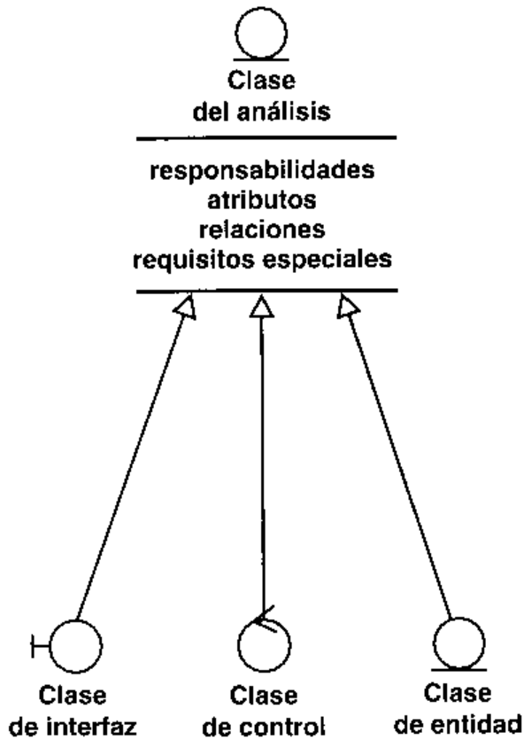

Estos tres estereotipos estan estandarizados en UML y se utilizan para ayudar a los desa-rrolladores a distinguir el ambito de las diferentes clases [3]. Cada estereotipo tiene su propiosimbolo, como se muestra en la Figura 8.5.

8.4.2.1. Clases de interfaz  Las clases de interfaz se utilizan para modelar la inte-raccion entre el sistema y sus actores (es decir, usuarios y sistemas externos). Esta interacciona menudo implica recibir (y presentar) informacion y peticiones de (y hacia) los usuarios y lossistemas externos.

Las clases de interfaz modelan las partes del sistema que dependen de sus actores, lo cualimplica que clarifican y reunen los requisitos en los limites del sistema. Por tanto, un cambio enun interfaz de usuario o en un interfaz de comunicaciones queda normalmente aislado en una omas clases de interfaz.

Las clases de interfaz representan a menudo abstracciones de ventanas, formularios, paneles,interfaces de comunicaciones, interfaces de impresoras, sensores, terminales, y API (posiblementeno orientados a objetos). Aun asi, las clases de interfaz deberian mantenerse en un nivel bastan-te alto y conceptual; por ejemplo, no deberiamos profundizar en cada widget de un interfaz dela interaccion (es decir, la informacion y las peticiones que se intercambian entre el sistema y susconsiderara en las actividades de diseno e implementacion subsiguientes.

Cada clase de interfaz deberia asociarse con al menos un actor, y viceversa.

# Ejemplo La clase de interfaz IU Solicitud de Pago

el actor Comprador y el caso de uso Pagar Factura (Figura 8.6).

aganudwoo sandsap sebed e senoe, sel ansuo ouensn un anb awuad obed ep pnllos nii  n p od a sis e as on o a p s u s sficandola). IU Solicitud de Pago tambien permite a un usuario descartar una factura que el compradorno quiere pagar.

A continuacion daremos ejemplos de como esta clase de interfaz se asocia con el “interior" delsistema, es decir, con las clases de control y de entidad.

8.4.2.2.  Clases de entidad  Las clases de entidad se utilizan para modelar infor-macion que posce una vida larga y que es a menudo persistente. Las clases de entidad modelano o      apersona, un objeto del mundo real, o un suceso del mundo real.

En la mayoria de los casos, las clases de entidad se derivan directamente de una clase deentidad del negocio (o de una clase del dominio) correspondiente, tomada del modelo deobjetos del negocio (o del modelo del dominio). Sin embargo, una diferencia fundamental entreclases de entidad y clases de entidad del negocio es que las primeras representan objetosmanejados por el sistema en consideracion, mientras que las ultimas representan objetos pre-sentes en el negocio (y en el dominio del problema) en general. En consecuencia, las clases deentidad reflejan la informacion de un modo que beneficia a los desarrolladores al disenar eimplementar el sistema, incluyendo su soporte de persistencia. Esto no sucede realmente con lasclases de entidad del negocio (o clases del dominio), que por el contrario, describen el contextodel sistema, y por tanto pueden incluir informacion que el sistema no maneja en absoluto.

s   nd a oisd   p er o  p oncomportamiento complejo relativo a la informaci6n que representa. Los objetos de entidadaislan los cambios en la informacion que representan.

Las clases de entidad suelen mostrar una estructura de datos logica y contribuyen a com-prender de que informacion depende el sistema.

# Ejemplo La clase de Entidad Factura

La siguiente clase de entidad, llamada Factura, se utiliza para representar facturas. La clase deentidad se asocia con la clase de interfaz IU Solicitud de Pago por medio de la cual el usuario con-sulta y gestiona las facturas; vease la Figura 8.7.

8.4.2.3.  Clases de control  Las clases de control representan coordinacion,secuencia, transacciones, y control de otros objetos y se usan con frecuencia para encapsular elcontrol de un caso de uso en concreto. Las clases de control también se utilizan para representarderivaciones y calculos complejos, como la l6gica del negocio, que no pueden asociarse conninguna informacion concreta, de larga duracion, almacenada por el sistema (es decir, una clasede entidad concreta).

Los aspectos dinamicos del sistema se modelan con clases de control, debido a que ellasmanejan y coordinan las acciones y los flujos de control principales, y delegan trabajo a otrosobjetos (es decir, objetos de interfaz y de entidad).

Observese que las clases de control no encapsulan aspectos relacionados con las interac-ciones, con los actores, ni tampoco aspectos relacionados con informacion de larga vida ypectivamente. En cambio, las clases de control encapsulan , y por tanto aislan, los cambios delcontrol, la coordinacion, la secuencia, las transacciones y a veces la logica del negocio com-pleja que implica a varios otros objetos.

# Ejemplo La clase de control Planificador de Pagos

cual es responsable de la coordinacion entre IU Solicitud de Pago y Factura; vease la Figura 8.8.

Planificador de pagos acepta una solicitud de pago, como una solicitud de pagar una factura, yuna fecha en la cual debe pagarse la factura. Mas adelante, en la fecha de pago, Planificador de pa-gos lleva a cabo el pago solicitando una transferencia de dinero entre las cuentas apropiadas.

# 8.4.3.  Artefacto: realizacion de caso de uso-analisis

Una realizacion de caso de uso - analisis es una colaboracion dentro del modelo de analisis quedescribc como se lleva a cabo y se ejecuta un caso de uso determinado cn terminos de las clasesdel analisis y de sus objetos del analisis en interaccion. Una realizacion de caso de usoproporciona por tanto una traza directa hacia un caso de uso concrcto del modelo de casos deuso (Figura 8.9).

Una realizacion de caso de uso posee una descripcion textual del flujo de succsos, diagramasde clascs que muestran sus clases del analisis participantes, y diagramas de interaccion quemuestran la realizacion de un flujo o escenario particular del caso de uso en terminos de inte-racciones de objetos del analisis (vease la Figura 8.10). Ademas, debido a que describimos unarealizacion de caso de uso cn terminos de clases del analisis y de sus objetos, se centra demanera natural cn los requisitos funcionales. Por tanto, al igual que las propias clases delanalisis. puede posponer el tratamiento de los requisitos no funcionales hasta las actividadessubsiguientes de diseno e implementacion. llamandoles requisitos especiales en la realizaci6n.8.4.3.1. Diagramas de clases  Una clase de analisis y sus objetos normalmcnteparticipan en varias realizaciones de casos de uso, y algunas de las responsabilidades, atributos,y asociaciones de una clase concreta suelen ser solo relevantes para una unica realizacion de

caso de uso. Por tanto, es importante durante el analisis coordinar todos los requisitos sobre unaclase y sus objetos que pueden tener diferentes casos de uso. Para hacerlo, adjuntamosdiagramas de clases a las realizaciones de casos de uso, mostrando sus clases participantes y susrelaciones (vease la Figura 8.11).

8.4.3.2.  Diagramas de interaccion  La secuencia de acciones en un caso de uso co-mienza cuando un actor invoca el caso de uso mediante el envio de algun tipo de mensaje alsistema. Si consideramos el "interior” del sistema, un objeto de interfaz recibira este mensaje delactor. El objeto de interfaz enviara a su vez un mensaje a algun otro objeto, y de esta forma los ob-jetos implicados interactuaran para llevar a cabo el caso de uso. En el analisis preferimos mostrar

y responsabilidades sobre los objetos, y no identificar secuencias de interaccion detalladas y or- esto con diagramas de colaboracion ya que nuestro objetivo fundamental es identificar requisitosdenadas cronol6gicamente (es ese caso, utilizariamos en cambio diagramas de secuencia).

En los diagramas de colaboracion, mostramos las interacciones entre objetos creando enla-ces entre ellos y anadiendo mensajes a esos enlaces. El nombre de un mensaje deberia denotarel proposito del objeto invocante en la interaccion con el objeto invocado.

# Ejemplo Un diagrama de colaboracion que muestra la realizacionde un caso de uso

La Figura 8.12 es un diagrama de colaboracion que describe la primera parte del caso de usoPagar Factura.

En relacion con la creacion y finalizacion de los objetos del analisis dentro de una realiza-cion de caso de uso, objetos diferentes tienen diferentes ciclos de vida (Apendice C):

· Un objeto de interfaz no tiene por que ser particular de una realizacion de caso de uso si,por ejemplo, debe aparecer en una ventana y participar en dos o mas instancias de caso deuso. Sin embargo, los objetos de interfaz a menudo se crean y se finalizan dentro de unasola realizacion de caso de uso.

· Un objeto de entidad normalmente no es particular de una realizacion de caso de uso. Alcontrario, un objeto de entidad suele tener una vida larga y participa en varias realizacio-nes de caso de uso antes de su destruccion.

· Las clases de control suelen encapsular el control asociado con un caso de uso concreto, lo cualimplica que deberia crearse un objeto de control cuando el caso de uso comienza, y ese obje-to dc control deberia destruirse cuando termina el caso de uso. Sin embargo, hay excepcionescomo cuando un objeto de control participa en mas de una realizacion de caso de uso, cuandovarios objetos de control (o diferentes clases de control) participan en una misma realizacionde caso de uso, y cuando una realizacion de caso de uso no requiere ningun objeto de control.8.4.3.3.  Flujo de sucesos-analisis  Los diagramas —-especialmente los diagra-mas de colaboracion—- de una realizacion de caso de uso pucden ser dificiles de lecr por si mis-mos, de modo que puede ser util un texto adicional que los expliquc. Este texto deberiaa cabo el caso de uso. Sin embargo, el texto no deberia mencionar ninguno de los atributos,responsabilidades, y asociaciones del objeto, debido a que cambian con bastante frecuencia yseria dificil mantenerlos.

# Ejemplo Un flujo de sucesos-analisis que explica un diagrama decolaboracion

(véase la Figura 8.12):

El comprador consulta a traves del IU Solicitud de Pago las facturas gestionadas por el sis-para comprobar las facturas con sus correspondientes confirmaciones de pedido (3, 4, 5),antes de mostrar la lista de facturas al comprador. Lo que suponga esta comprobacion de-cluir la comparacion del precio, la fecha de entrega, y contenidos de la factura con la con-de Pedido y Factura y como analizar las respuestas. Cualquier factura sospechosa queda-ra marcada de alguna forma por el IU Solicitud de Pago, quiza mediante un color diferenteque la resaife.

(6). El IU Solicitud de Pago solicita al Planificador de Pagos que planifique el pago de la facturaa pnos ni li (a) oed ap pnos un eaio sobed ap iopeoeid ia 'sandsaa '()Pago cambia a continuacion el estado de la factura a "planificada" (9).

El Planificador de Pagos iniciara el pago en el dia debido (no se muestra en el diagrama).

Es interesante comparar esta descripcion con el flujo de eventos dei caso de uso descrito en elCapitulo 7, Seccion 7.2.3.1. La descripcion del Capitulo 7 es la del comportamiento del caso de usosistema lleva a cabo el caso de uso en terminos de objetos (logicos) que colaboran.

8.4.3.4.  Requisitos especiales  Los requisitos espcciales son descripcionesAlgunos de estos requisitos ya se habian capturado de algun modo durante el flujo de trabajo delos requisitos (como se explico en los Capitulos 6 y 7), y solo se cambian a una realizacion decaso de uso - analisis. Sin embargo, algunos de ellos pueden ser requisitos nuevos o derivadosque se encuentran a medida que avanza el trabajo de analisis.

# Ejemplo

# Requisitos especiales para la realizacion de un caso de uso

El siguiente es un ejemplo de requisitos especiales sobre la realizacion del caso de uso pagar factura:· Cuando el comprador solicite ver las facturas recibidas, no deberia tardar mas de mediosegundo mostrar las facturas en la pantalla.

· Las facturas deberian pagarse utilizando el estandar SET.

# 8.4.4.  Artefacto: paquete del analisis

Los paquetes del analisis proporcionan un medio para organizar los artefactos del modelo de ana-lisis en piezas manejables. Un paquete de analisis puede constar de clases de analisis, de realiza-ciones de casos de uso, y de otros paquetes del analisis (recursivamente). Véase la Figura 8.13.

Los paquetes del analisis deberian ser cohesivos (es decir, sus contenidos deberian estarfuertemente relacionados), y deberian ser debilmente acoplados (es decir, sus dependenciasunos de otros deberian minimizarse).

Ademas, los paquetes del analisis tienen las siguientes caracteristicas:

· Los paquetes del analisis pueden representar una separacion de intereses de analisis.Por ejemplo, en un sistema grande algunos paquetes del analisis pueden analizarse demanera separada —posiblemente de manera concurrente por diferentes desarrolladorescon diferente conocimiento del dominio.

· Los paquetes del analisis deberian crearse basandonos en los requisitos funcionales y enel dominio del problema (es decir, la aplicacion o el negocio), y deberian ser reconociblesbasarse en requisitos no funcionales o en el dominio de la solucion.

· Los paquetes del analisis probablemente se convertiran en subsistemas en las dos capas deaplicacion superiores del modelo de diseno, 0 se distribuiran entre ellos. En algunos casos,un paquete del analisis podria incluso reflejar una capa completa de primer nivel en elmodelo de diseno.

8.4.4.1. Paquetes de servicio  Aparte de proporcionar casos de uso a sus actores,todo sistema también proporciona un conjunto de servicios a sus clientes. Un cliente adquiereuna combinacion adecuada de servicios para ofrecer a sus usuarios los casos de uso necesariospara llevar a cabo su negocio:

· Un caso de uso especifica una secuencia de acciones: un actor inicia un hilo, seguido deinteracciones entre el actor y el sistema, que termina tras haber devuelto un valor al actor.Normalmente, los casos de uso no existen aisladamente. Por ejemplo, el caso de usoEnviar Factura al Comprador presupone que otro caso de uso ha creado una factura y queestan disponibles la direccion del comprador y otros datos del cliente.

· Un servicio representa un conjunto coherente de acciones relacionadas funcionalmente—-un paquete de funcionalidad— que se utiliza en varios casos de uso. Un cliente de unsistema normalmente compra una combinacion de servicios para ofrecer a sus usuarios loscasos de uso necesarios. Un servicio es indivisible en el sentido de que el sistema necesitaofrecerlo o todo entero o nada en absoluto.

· Los casos de uso son para los usuarios, y los servicios son para los clientes. Los casos deuso atraviesan los servicios, es decir, un caso de uso requiere acciones de varios servicios.

En el Proceso Unificado, el concepto de servicio esta soportado por los paquetes de servicio.(uooan ap) einbf ei ap ofeq se pasu un u uzn ss onnaas ap snned sopaquetes del analisis para estructurar el sistema de acuerdo a los servicios que proporciona.Podemos observar lo siguiente acerca de los paquetes de servicio:

· Un paquete de servicio contiene un conjunto de clases relacionadas funcionalmente.· Un paquete de servicio es indivisible. Cada cliente obtiene o bien todas las clases o bienninguna del paquete de servicio.· Cuando se lleva a cabo un caso de uso, puede que sean participantes uno o mas paquctesde servicio. Ademas, es frecuente que un paquete de servicio concreto participe en variasrealizaciones de caso de uso diferentes.· Un paquete de servicio, depende a menudo de otro paquete de servicio.· Un paquete de servicio normalmente solo es relevante para uno o unos pocos actores.· La funcionalidad definida por un paquete de servicio, cuando se disena e implementa,de, por tanto, representar cierta funcionalidad “adicional del sistema. Cuando un paquetede servicio queda excuido, tambien lo queda todo caso de uso cuya realizacion requiera elpaquete de servicio.· Los paquetes de servicio pueden ser mutuamente excluyentes, o pueden representardiferentes aspectos o variantes del mismo servicio. Por ejemplo, “"correccion ortograficadel ingles britanico" y “correcci6n ortografica del inglés americano" pueden ser dospaquetes de servicio diferentes que proporciona un sistema.· Los paquetes de servicio constituyen una entrada fundamental para las actividades dediseno e implementacion subsiguientes, dado que ayudaran a estructurar los modelos dediseno e implementacion en terminos de subsistemas de servicio. En particular, lossubsistemas de servicio tienen una influencia decisiva en la descomposicion del sistemaen componentes binarios y ejecutables.

Mediante la estructuracion del sistema, de acuerdo a los servicios que proporciona, nospreparamos para los cambios en servicios individuales, ya que esos cambios probablemente selocalizaran en el paquete de servicio correspondiente. Esto da como resultado un sistemarobusto que es resistente al cambio.

En la Seccion 8.6. 1.1.2 ofrecemos un metodo para identificar paquetes de servicio, junto conejemplos de paquetes de servicio.

Obsérvese que la manera general de organizar los artefactos del modelo de analisis siguesiendo la utilizacion de paquetes del analisis ordinarios como explicamos en la seccion anterior.Sin embargo, aqui hemos introducido un estereotipo “paquete de servicio” para poder marcarmuchos paquetes), es especialmente importante el ser capaces de diferenciar diferentes tipos depaquetes de una manera sencilla. Esto es tambien un ejemplo de como pueden utilizarse y apro-vecharse los estereotipos dentro del UML.

8.4.4.1.1.  Los paquetes de servicio son reutilizables  Como explicamos en la seccionanterior, los paquetes de servicio tienen muchas caracteristicas buenas, como el ser cohe-sivos (Apendice C), indivisibles, debilmente acoplados, distribuidos de manera separada, yzacion, tanto dentro de un sistema como entre sistemas (mas o menos) relacionados. Mas enconcreto, los paquetes de servicio cuyos servicios se centran alrededor de una o mas clasesde entidad (vease la Seccion 8.4.2.2) son probablemente reutilizables en diferentes sistemasque soporten cl mismo negocio o dominio. Esto es debido a que las clases de entidad seobtienen a partir de clases de entidad del negocio o de clases del dominio, lo cual hace a lasclases de entidad y sus servicios relacionados candidatos para reutilizacion dentro del ne-gocio o dominio entero y dentro de la mayoria de los sistemas que los soportan —-no solocandidatos para un sistema en concreto-—. Los paquetes de servicio, y los servicios, sonindependientes de Ios casos de uso en el sentido de que un paquete de servicio puede em-plearse en varias rcalizaciones de caso de uso diferentes. Esto es particularmente ciertocuando el paquete de servicio reside en una capa general con funcionalidad comun y com-partida (vease la Seccion 8.6.1. 1.3). Un paquete de servicio de ese tipo es probable que screutilice en varias aplicaciones diferentes (configuraciones) del sistema, donde cadaaplicacion proporciona casos de uso cuyas realizaciones requieren el paquete de servicio.Seccion 9.3.4.1) y con componentes en la implementacion (vease la Seccion 10.3.2). Esoscomponentes son reutilizables por los mismos motivos por los que lo son los paquetes deservicio. Por tanto, los paquetes de servicio se revelan como nuestro instrumentofundamental para la reutilizacion durante el analisis. Esto tiene sus consecuencias tanto enel diseno como en la implementacion del sistema, y finalmente obtiene como resultado com-poncntes reutilizables.

# 8.4.5.  Artefacto: descripcion de la arquitectura(vista del modelo de analisis)

La descripcion de la arquitectura contiene una vista de la arquitectura del modelo de anali-sis (Apendice C), que muestra sus artefactos significativos para la arquitectura (Figura 8.14).

Los siguientes artefactos del modelo de analisis normalmente se consideran significativospara la arquitectura:

· La descomposicion del modelo de analisis en paquetes de analisis y sus dependenciasEsta descomposicion suele tener su efecto en los subsistemas de las capas superiorese  d i on d s a  i a os pgeneral.· Las clases fundamentales del analisis como las clases de entidad que encapsulan unfenomeno importante del dominio del problema; las clases de interfaz que encapsulaninterfaces de comunicacion importantes y mecanismos de interfaz de usuario; las clases decontrol que encapsulan importantes secuencias con una amplia cobertura (es decir,aquellas que coordinan realizaciones de casos de uso significativas); y clases del analisisque son generales, centrales, y que tienen muchas relaciones con otras clases del analisis.Suele ser suficiente con considerar significativa para la arquitectura una clase abstractapero no sus subclases.· Realizaciones de casos de uso que describen cierta funcionalidad importante y critica; queimplican muchas clases del analisis y por tanto tienen una cobertura amplia, posiblementea lo largo de varios paquetes de analisis; o que se centran en un caso de uso importanteque debe ser desarrollado al principio en el ciclo de vida del software, y por tanto esprobable que se encuentre en la vista de la arquitectura del modelo de casos de uso(Apendice C).

# 8.5. Trabajadores

# 8.5.1.  Trabajador: arquitecto

Durante el flujo de trabajo del analisis, el arquitecto es responsable de la integridad del mode-lo de analisis, garantizando que éste sea correcto, consistente y legible como un todo (vease laFigura 8.15). En sistemas grandes y complejos, estas responsabilidades pueden requerir masmantenimiento tras algunas iteraciones, y el trabajo que conllevan puede hacerse bastanterutinario. En esos casos, el arquitecto puede delegar ese trabajo a otro trabajador, posiblemen-te a un ingeniero de componentes de “alto nivel" (vease la Secci6n 8.5.3). Sin embargo, el

arquitecto sigue siendo responsable de lo que es significativo para la arquitectura —la des-cripcion de la arquitectura--. El otro trabajador sera responsable del paquete de nivel superiordel modelo de analisis, que debe ser conforme con la descripcion de la arquitectura.

El modelo de analisis es correcto cuando realiza la funcionalidad descrita en el modelo decasos de uso, y solo esa funcionalidad.

El arquitecto es también responsable de la arquitectura del modelo de analisis, es decir, dela existencia de sus partes significativas para la arquitectura tal y como se muestran en la vis-ta de la arquitectura del modclo. Recuerdese que esta vista es una parte de la descripcion de laarquitectura del sistema.

Observese que cl arquitecto no es responsable del desarrollo y mantenimiento continuo delos diferentes artefactos del modelo de analisis. Estos son responsabilidad de los correspon-dientes ingenieros de casos de uso e ingenieros de componentes (vease las Secciones 8.5.2y 8.5.3).

# 8.5.2.  Trabajador: ingeniero de casos de uso

Un ingeniero de casos de uso es responsable de la integridad de una o mas realizacioncs de casode uso, garantizando que cumplen los requisitos que recaen sobre ellos (vease la Figura 8.16).

Una realizacion de caso de uso debe levar a cabo correctamente el comportamiento de sucorrespondiente caso de uso del modelo de casos de uso, y solo ese comportamiento. Estoincluye garantizar que todas las descripciones textuales y los diagramas que describen larealizacion del caso de uso son legibles y se ajustan a su objetivo.

Observese que el ingeniero de casos de uso no es responsable de las clases del analisis ni delas relaciones que se usan en la realizacion del caso de uso. Estas son las responsabilidadescorrespondientes al ingeniero de componentes (vease la Seccion 8.5.3).

Como veremos en el siguiente capitulo, el ingeniero de casos de uso también es responsabledel diseno de las realizaciones de los casos de uso. Por tanto, el ingeniero de casos de uso esresponsable tanto del analisis como del diseho del caso de uso, lo cual resulta en una transicionsuave.

# 8.5.3.  Trabajador: ingeniero de componentes

El ingeniero de componentes define y mantiene las responsabilidades, atributos, relaciones, yrequisitos especiales de una o varias clases del analisis, asegurandose de que cada clase deluso en las que participa (véase la Figura 8.17).

El ingeniero de componentes también mantiene la integridad de uno o varios paquetesdel analisis. Esto incluye garantizar que sus contenidos (por ejemplo, clases y sus relacio-nes) son correctos y que sus dependencias de otros paquetes del analisis son correctas yminimas.

Suele ser apropiado dejar que el ingeniero de componentes responsable de un paquete delanalisis lo sea también de las clases del analisis contenidas en él. Ademas, si existe unacorrespondencia directa (una traza directa) entre un paquete del analisis y los subsistemas dediseno correspondientes (vease la Seccion 8.4.4), el ingeniero de componentes deberia ser tam-bien responsable de esos subsistemas, para utilizar el conocimiento adquirido durante el analisisen el diseno y la implementacion del paquete del analisis. Si no existe una correspondenciadirecta de ese tipo, pueden ocuparse en el diseno e implementacion del paquete del analisis aingenieros de componentes adicionales.

# 8.6. Flujo de trabajo

Anteriormente en este capitulo, describimos el trabajo del analisis en terminos estaticos. Aho-ra utilizaremos un diagrama de actividad para razonar acerca de su comportamiento dinamico(vease la Figura 8.18).

Los arquitectos comienzan la creacion del modelo de analisis (como hemos definido ante-riormente en este capitulo), identificando los paquetes de analisis principales, las clases deentidad evidentes, y los requisitos comunes. Despues, los ingenieros de casos de uso realizancada caso de uso en terminos de las clases del analisis participantes exponiendo los requisitosestos requisitos y los integran dentro de cada clase creando responsabilidades, atributos yrelaciones consistentes para cada clase. Durante el analisis, el arquitecto identifica de maneracontinua nuevos paquetes del analisis, clases, y requisitos comunes a medida que el modelo deanalisis evoluciona, y los ingenieros de componentes responsables de los paquetes del analisisconcretos continuamente los refinan y mantienen.

# 8.6.1.  Actividad: analisis de la arquitectura

El proposito del analisis de la arquitectura es esbozar el modelo de analisis y la arquitecturamediante la identificacion de paquetes del analisis, clases del analisis evidentes, y requisitosespeciales comunes (vease la Figura 8.19).

8.6.1.1. Identificacion de paquetes del analisis  Los paquetes del analisisproporcionan un medio para organizar el modelo de analisis en piezas mas pequenas y mas ma-nejables. Pueden, bien identificarse inicialmente como forma de dividir el trabajo de analisis, 0bien encontrarse a medida que el modelo de analisis evoluciona y “crece" convirtiéndose enuna gran estructura que debe descomponerse.

Una identificacion inicial de los paquetes del analisis se hace de manera natural basandonosen los requisitos funcionales y en el dominio del problema, es decir, en la aplicacion o negocioi  s snse s s  n o is ss

casos de uso, una forma directa de identificar paquetes del analisis es asignar la mayor parte derrespondiente dentro de ese paquete. Entre las “asignaciones” adecuadas de casos de uso a unpaquete en concreto tenemos las siguientes:

· Los casos de uso requeridos para dar soporte a un determinado proceso de negocio.

· Los casos de uso requeridos para dar soporte a un determinado actor del sistema.

· Los casos de uso que estan relacionados mediante relaciones de generalizacion y de ex-tension. Este tipo de conjunto de casos de uso es coherente en el sentido de que los casosde uso o bien especializan o bien "extienden' a los otros.

Los paquetes de estos tipos localizan los cambios respectivamente en un proceso del ne-gocio, en el comportamiento de un actor, y en un conjunto de casos de uso estrechamenterelacionados. Esta tecnica simplemente nos ayuda inicialmente a asignar casos de uso apaquetes. Por tanto, a medida que se desarrolla el trabajo del analisis, cuando los casos de usosean realizados como colaboraciones entre clases, posiblemente cn diferentes paquetes, secvolucionara hacia una estructura de paquetes mas refinada

# Ejemplo Identificacion de paquetes del analisis

Este ejemplo muestra como Interbank Software podria identificar algunos de sus paquetes del ana-lisis a partir del modelo de casos de uso. Los casos de uso Pagar Factura, Enviar Aviso, y Enviarla Entrega. Por tanto, pueden incluirse en un mismo paquete del analisis.

Sin embargo, Interbank Software debe ser capaz de poner su sistema a disposicion de diferentesclientes con diferentes necesidades. Algunos clientes utilizan el sistema solo como compradores,otros solo como vendedores, y algunos como compradores y vendedores. Por tanto, decidieron

separar la realizacion de los casos de uso necesarios para el vendedor de la realizacion de los casosde uso necesarios para el comprador. Aqui vemos como la suposicion inicial de un paquete del ana-lisis para el proceso del negocio Ventas: del Pedido a la Entrega se ha ajustado para adaptarse a losrequisitos del cliente. El resultado es que tenemos dos paquetes del analisis que pueden distribuirseseparadamente a los clientes dependiendo de sus necesidades: Gestion de facturas de comprador ygestion de facturas de vendedor (vease la Figura 8.20).

Observese que también hay otros casos de uso que soportan el proceso del negocio Ventas: delPedido a la Entrega, pero los hemos ignorado para hacer mas sencillo el ejemplo.

8.6.1.1.1.  Gestion de los aspectos comunes entre paquetes del analisis  Con frecuencia se dael caso de encontrar aspectos comunes entre los paquetes identificados como en la seccionanterior. Un ejemplo es cuando dos o mas paquetes del analisis necesitan compartir la mismaclase del analisis. Una manera apropiada de tratarlo es extraer la clase compartida, colocarladentro de su propio paquete o simplemente fuera de cualquier otro paquete, y hacer después

Las clases compartidas de ese tipo son muy probablemente clases de entidad de las cuales sepuede hacer una traza hasta clases del dominio o clases de entidad del negocio. Por tantomerece la pena estudiar las clases del dominio o las clases de entidad del negocio si estancompartidas, y si se van a identificar inicialmente los paquetes en el analisis.

# Ejemplo Identificacion de paquetes del analisis generales

partir del modelo del dominio. Cada una de las clases del dominio Cliente de Banco y Cuentarepresenta una entidad importante y compleja del mundo real. Interbank se da cuenta de que esasclases requieren un soporte sofisticado del sistema de informacion, y de que estan compartidas poraparte para cada clase, Gestion de Cuentas y Gestion de Clientes de Banco (vease la Figura 8.21).

Observese que los paquetes Gestion de Cuentas y Gestion de Clientes de Banco probablemen-te contendran muchas clases del analisis tales como clases de control y de interfaz relacionadas

paquetes contengan solo una o unas pocas clases de entidad trazables hasta sus correspondientesclases del dominio.

8.6.1.1.2. Identificacion de paquetes de servicio 0 La identificacion adecuada de los paquetesde servicio se suele hacer cuando el trabajo de analisis esta avanzado, momento en el que losrequisitos funcionales se comprenden bien y existen la mayoria de las clases del analisis. Todaslas clases del analisis dentro del mismo paquete de servicio contribuyen al mismo servicio.

Al identificar paquetes de servicio, debemos hacer lo siguiente:

s        eosera una unidad de compra.

# Paquetes de servicio opcionales

La mayoria de los vendedores que utilizan el sistema de interbank quieren un servicio para enviaravisos. Este servicio se describe en el caso de uso (opcional) enviar aviso. Algunos vendedores

quieren que los avisos se envien automaticamente tan pronto como se de una factura atrasada,mientras que otros prefieren que se les avise cuando haya una factura atrasada, y ellos mismos decidiran después si mandan un aviso. Esta variabilidad se representa mediante dos paquetes deservicio opcionales y mutuamente exclusivos: Avisos automaticos se utiliza para los avisos automaticos, y Avisos manuales notifica al vendedor, el cual decide si contacta con el comprador;vease la Figura 8.22. Cuando un vendedor no quiere ningun soporte para avisos, no se entreganinguno de los paquetes con el sistema. Los paquetes de servicio estan dentro del paquete gestionde facturas de vendedor.

· Identificar un paquete de servicio por cada servicio que podria hacerse opcional, incluso aunque todos los clientes siempre lo quieran. Debido a que los paquetes deservicio contienen clases relacionadas funcionalmente, obtendremos con ellos unaestructura de paquetes que aisla la mayoria de los cambios en paquetes individuales.Podriamos haber descrito este criterio tambien del siguiente modo: identificar unpaquete de servicio por cada servicio proporcionado por clases relacionadas funcio-nalmente. Los siguientes son ejemplos de cuando una clase A y una clase B estanrelacionadas funcionalmente:

Un cambio en A requerira muy probablemente un cambio en B.

La eliminacion de A hace que B sea superflua.

— Los objetos de A interactuan intensamente con objetos de B, posiblemente a traves devarios mensajes diferentes.

# Identificacion de paquetes de servicio que encapsulanclases relacionadas funcionalmente

El paquete Gestion de Cuentas incluye un paquete de servicio general llamado Cuentas que se uti- liza para acceder a las cuentas en actividades tales como la transferencia de dinero y la extraccionde historicos de transacciones. El paquete también incluye un paquete de servicio llamado Riesgosservicio son comunes y los utilizan varias realizaciones de caso de uso distintas. Vease la Figu-ra 8.23.

8.6.1.1.3. Definicion de dependencias entre paquetes del analisis Deberian definirsedependencias entre los paquetes del analisis si sus contenidos estan relacionados. La direccionde la dependencia deberia ser la misma (navegabilidad) direccion de la relacion.

El objetivo es conseguir paquetes que sean relativamente independientes y debilmenteacoplados pero que posean una cohesion interna alta. La cohesion alta y el acoplamiento debilhace que los paquetes sean mas faciles de mantener debido a que cambiar algunas clases delpaquete afectara fundamentalmente a clases dentro del propio paquete. Por tanto, es inteligenteintentar reducir el numero de relaciones entre clases en paquetes diferentes debido a que ello re-duce las dependencias entre paquetes.

Para hacer mas claras las dependencias, puede ser util estratificar el modelo de analisishaciendo que los paquetes especificos de la aplicacion queden en una capa de nivel superior ylos paquetes generales queden en una capa inferior. Esto aclara la diferencia entre funcionali-dad especifica y general.

# Dependencias entre paquetes del analisis y capas

en otros paquetes. Por ejemplo, la clase Cuenta es utilizada por clases en los paquetes Gestion deFacturas de Comprador y Gestion de Facturas de Vendedor. Por tanto, estos paquetes dependen delpaquete Gestion de Cuentas (vease la Figura 8.24).

Durante el diseno y la implementacion, refinaremos esas capas y anadiremos mas capas des    o p   s   n  ositos no funcionales en general.

8.6.1.2.  Identificacion de clases de entidad obvias  Suele ser adecuado pre-parar una propuesta preliminar de las clases de entidad mas importantes (10 o 20) basado en lasclases del dominio o las entidades del negocio que se identificaron durante la captura de re-quisitos. Sin embargo, la mayoria de las clases se identificaran al crear las realizaciones de loscasos de uso (en la actividad de analisis de casos de uso, vease la Seccion 8.6.2). Debido a esto,deberiamos tener cuidado de no identificar demasiadas clases en esta etapa y quedar atrapadosen demasiados detalles. Deberia ser bastante con un esbozo inicial de las clases significativaspara la arquitectura (véase la Seccion 8.4.5). En otro caso, probablemente tendremos querehacer gran parte del trabajo cuando se utilicen mas adelante los casos de uso para identificarlas clases de entidad realmente necesarias, es decir, aquellas que participan en la realizacion delos casos de uso. Una clase de entidad que no participa en una realizacion de caso de uso no esnecesaria

Las agregaciones y asociaciones entre clases del dominio en el modelo del dominio (o entreentidades del negocio en el modelo del negocio) pueden utilizarse para identificar un conjuntoprovisional de asociaciones entre las correspondientes clases de entidad.

# Ejemplo Una clase de entidad identificada a partir de una clasedel dominio

Factura es una clase del dominio que mencionamos en el Capitulo 6. Utilizaremos esta clase del do-sowaod 'eiid ap ound oo 'saneue pepua ap ss sel ap eun sauodoid eed ouiTambién podemos definir asociaciones entre clases de entidad del modelo del dominio, tales como laasociacion pagable entre un pedido y una factura.

8.6.1.3.  ldentificacion de reguisitos especiales comunes  Un requisitoespecial es un requisito que aparece durante el analisis y que es importante anotar de forma que· Persistencia.· Distribucion y concurrencia.· Caracteristicas de seguridad.· Tolerancia a fallos.· Gestion de transacciones.

El arquitecto es el responsable de identificar los requisitos especiales comunes de forma quelos desarrolladores puedan referirse a ellos como requisitos especiales sobre realizaciones decasos de uso y clases del analisis determinadas. En algunos casos, los requisitos especiales noxa s b  e oe oo   od pe  nzaciones de casos de uso y las clases del analisis. Observese tambien que no es raro que unaclase o una realizacion de caso de uso especifique varios requisitos especiales diferentes.

Deberian identificarse las caracteristicas fundamentales de cada requisito especial comunpara soportar mejor el diseno y la implementaci6n posteriores.

# Ejemplo Identificacion de las caracteristicas fundamentalesde un requisito especial

Un requisito de persistencia tienen las siguientes caracteristicas:

· Volumen: Numero de objetos que hay que hacer persistentes.

· Periodo de persistencia: Periodo de tiempo habitual que un objeto debe ser persistente.

· Frecuencia de actualizacion: Frecuencia de actualizacion de los objetos.

· Fiabilidad: Aspectos de fiabilidad tales como si los objetos deberian sobrevivir en caso deuna caida del software o del hardware.

Las caracteristicas de cada requisito especial se calificaran despues para cada clase o reali-zacion de caso de uso que haga referencia al requisito especial.

# 8.6.2.  Actividad: analizar un caso de uso

Analizamos un caso de uso para (vease la Figura 8.25):

· Identificar las clases del analisis cuyos objetos son necesarios para llevar a cabo el flujo desucesos del caso de uso.· Distribuir el comportamiento del caso de uso entre los objetos del analisis que interactuan.· Capturar requisitos especiales sobre la realizacion del caso de uso.

Otra forma de llamar al analisis de casos de uso podria ser refinamiento de casos de uso.Refinamos cada caso de uso como colaboracion de clases del analisis.

8.6.2.1.  ldentificacion de clases del analisis  En este paso, identificamos lasclases de control, entidad, e interfaz necesarias para realizar los casos de uso y esbozamos susnombres, responsabilidades, atributos y relaciones.

Los casos de uso descritos en los requisitos no siempre estan suficientemente detalladoscomo para poder identificar clases del analisis. La informacion sobre el interior del sistema nor-

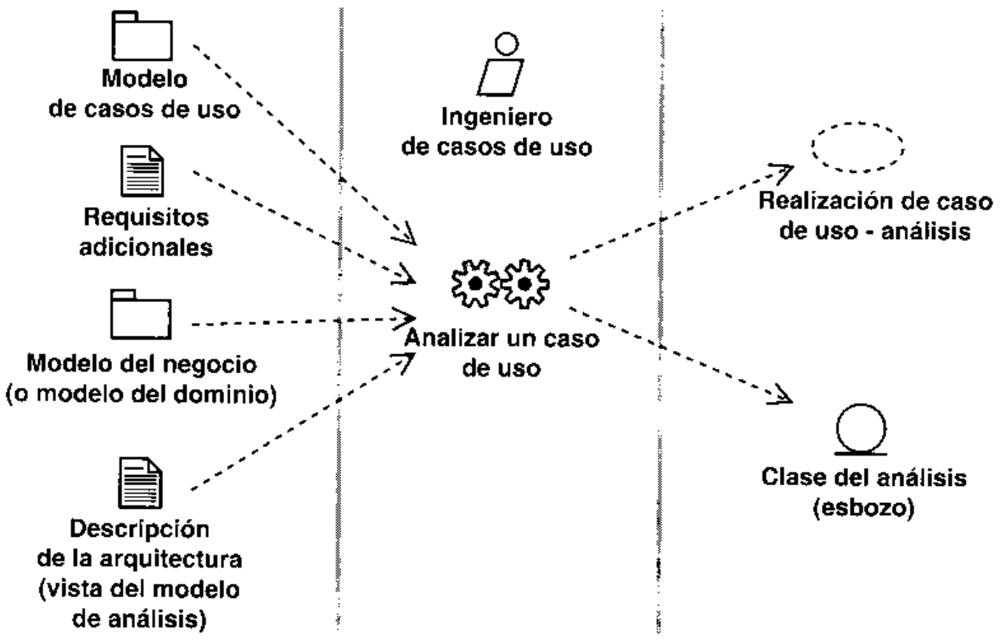

malmente no es de interes durante la captura de requisitos y por tanto puede haberse dejado delado. Por tanto, para identificar las clases del analisis puede que tengamos que refinar las des-cripciones de los casos de uso en lo referente al interior del sistema. Este refinamiento debe re-cogerse en la descripci6n textual de flujos de sucesos —analisis de la realizacion de los casosde uso.

· Identificar clases de entidad mediante el estudio en detalle de la descripcion del caso decion debe utilizarse y manipularse en la realizacion del caso de uso. Sin embargo, de-bemos ser conscientes de la informacion que es mejor capturar como atributo (vease laSeccion 8.6.3.2, "Identificaci6n de atributos'"), la que es preferible asociar a clases deinterfaz o de control, o la que simplemente no es necesaria para la realizacion del caso deuso; las "informaciones” de estos tipos no deberian modelarse como clases de entidad.· Identificar una clase de interfaz central para cada actor humano, y dejar que esta claserepresente la ventana principal del interfaz de usuario con el cual interactia el actor. Si elactor ya interactua con una clase de interfaz, deberiamos considerar el reutilizarla paraconseguir una buena facilidad de uso de la interfaz de usuario (Apendice C) y paraminimizar el numero de ventanas principales que cada actor requiere para interactuar conellas. Ademas, esas clases de interfaz centrales normalmente se consideran agregados declases de interfaz mas primitivas.

· Identificar una clase de interfaz primitiva para cada clase de entidad que hayamosinteractua el actor (humano) en la interfaz de usuario durante el caso de uso. Estas clasesde interfaz primitivas pueden refinarse despues de acuerdo a diversos criterios de facilidadde uso para contribuir a la creacion de una “buena" interfaz de usuario.

· Identificar una clase de interfaz central para cada actor que sea un sistema externo, y dejarque esta clase represente la interfaz de comunicacion. Recuérdese que un actor del siste-ma puede ser cualquier cosa desde unidades software o hardware que interactuan connuestro sistema, tales como impresoras, terminales, dispositivos de alarma, sensores,etc. Si las comunicaciones del sistema se dividen en varios niveles de protocolo, puede sernecesario que el modelo de analisis distinga algunos de esos niveles. Si esto es asi, de-bemos identificar clases de interfaz separadas para cada nivel de interes.

· Identificar una clase de control responsable del tratamiento del control y de la coordina-ci6n de la realizacion del caso de uso, y después refinar esta clase de control de acuerdo alos requisitos del caso de uso. Por ejemplo, en algunos casos el control se encapsula me-jor dentro de una clase de interfaz, especialmente si el actor maneja gran parte del control.En estos casos la clase de control no es necesaria. En otros casos el control es tan com-plejo que es mejor encapsularlo en dos o mas clases de control. En estos casos es nece-sario dividir la clase de control.

Al levar a cabo este paso, deberian tenerse en cuenta, naturalmente, las clases del analisisque ya estan presentes en el modelo de analisis. Algunas es probable que se reutilicen en larealizacion de caso de uso que estamos considerando, y se realizan casi simultaneamente varioscasos de uso, lo cual hace mas facil identificar clases del analisis que participan en variasrealizaciones de casos de uso.

Debemos recoger en un diagrama de clases las clases del analisis que participan en unarealizacion de caso de uso. Utilizaremos este diagrama para mostrar las relaciones que seutilizan en la realizacion del caso de uso.

8.6.2.2. Descripci6n de interacciones entre objetos del analisis  Cuan-do tenemos un esbozo de las clases necesarias para realizar el caso de uso, debemos describircomo interactuan sus correspondientes objetos del analisis. Esto se hace mediante diagramas decolaboracion que contienen las instancias de actores participantes, los objetos del analisis, y susenlaces. Si el caso de uso tiene flujos o subflujos diferenciados y distintos, suele ser itil crearun diagrama de colaboracion para cada flujo. Esto contribuye a hacer mas clara la realizaciondel caso de uso, y tambien hace posible extraer diagramas de colaboracion que representaninteracciones generales y reutilizables.

Un diagrama de colaboracion se crea comenzando por el principio del flujo del caso de uso,y continuando el flujo paso a paso decidiendo que interacciones de objetos del analisis y deinstancias de actor son necesarias para realizarlo. Normalmente los objetos encuentran su sitionatural en la secuencia de interacciones de la realizacion del caso de uso. Podemos observar losiguiente sobre estos diagramas de colaboracion:

· El caso de uso se invoca mediante un mensaje proveniente de una instancia de un actorsobre un objeto de interfaz.

· Cada clase del analisis identificada en el paso anterior deberia tener al menos un objetoque participase en un diagrama de colaboracion. Si no lo tiene, la clase del analisis esS  o     ed o ab a s

· Los mensajes no se asocian a operaciones debido a que no especificamos operaciones en lasclases del analisis. En cambio, un mensaje deberia reflejar el proposito del objeto invocan-te en la interaccion con el objeto invocado. Este “"proposito" es el origen de una responsa-bilidad del objeto receptor y podria llegar a ser incluso el nombre de una responsabilidad.· Los enlaces en el diagrama normalmente deben ser instancias de asociaciones entre clasesdel analisis. O bien esas asociaciones ya existen o bien los enlaces definen requisitos sobrelas asociaciones. Todas las asociaciones obvias deberian esbozarse en este paso y deberianmostrarse en el diagrama de clases asociado con la realizacion del caso de uso.

si es dificil de mantener o crea confusion en el diagrama. Al contrario, el objetivoprincipal deberia estar en las relaciones (enlaces) entre los objetos y en los requisitoso n o ( s    o)

· El diagrama de colaboracion deberia tratar todas las relaciones del caso de uso que se estarealizando. Por ejemplo, si el caso de uso A es una especializacion de otro caso de uso Bmediante una relaci6n de especializacion, el diagrama de colaboracion que realice elcaso de uso A puede requerir el hacer referencia a la realizacion (es decir, al diagrama decolaboracion) del caso de uso B.

En algunos casos es apropiado complementar el diagrama de colaboracion con descripcionestextuales, especialmente si el mismo caso de uso tiene muchos diagramas de colaboracion que lodescriben o si hay diagramas que representan flujos complejos. Esas descripciones textualesdeberian recogerse en el artefacto flujo de sucesos-analisis de la realizacion del caso de uso.

8.6.2.3.  Captura de requisitos especiales   En este paso recogeremos todos losrequisitos sobre una realizacion de caso de uso que se identifican en el analisis pero deberiantratarse en el diseno y en la implementacion, tales como los requisitos no funcionales.

# Ejemplo

# Requisitos especiales sobre una realizacion de casoosn ap

Los requisitos especiales planteados por la realizacion del caso de uso Pagar Factura incluyen lossiguientes:

· La clase Factura debe ser persistente.

Al capturar estos requisitos, debemos hacer referencia si es posible a los requisitosespeciales comunes que habian sido identificados por el arquitecto.

# 8.6.3.  Actividad: analizar una clase

Los objetivos de analizar una clase (vease la Figura 8.26) son:

· Identificar y mantener las responsabilidades de una clase del analisis, basadas en su papelen las realizaciones de caso de uso.

· Identificar y mantener los atributos y relaciones de la clase del analisis.

· Capturar requisitos especiales sobre la realizacion de la clase del analisis.

8.6.3.1.  Identificar responsabilidades  Las responsabilidades de una clase pue-den recopilarse combinando todos lo roles que cumple en diferentes realizaciones de caso de

uso. Podemos identificar todas las realizaciones de caso de uso en las cuales participa la clasemediante el estudio de sus diagramas de clases y de interaccion. Recuérdese tambien que losrequisitos de cada realizacion de caso de uso respecto a sus clases a veces estan escritostextualmente en el artefacto flujo de sucesos - analisis de la realizacion del caso de uso.

# Roles de clase

Los objetos Factura se crean durante el caso de uso Enviar Factura al Comprador. El vendedor llevaopeaio anj anb opipad un) opiped un anbed anb iopeudwoo je telioos eied osn ap oseo aisa oqeo eal comprador, que puede decidir pagarla despues.

sobed ap lopeoueld olelgo le apuop enioey jebed osn ap oseo ja ua ogeo e eaall as obed 13Enviar Factura al Comprador y Pagar Factura.

Hay varias maneras de recopilar las responsabilidades de una clase. Una tecnica simple esextraer las responsabilidades de cada rol uno detras de otro, anadiendo responsabilidades adi-cionales o modificando las existentes basandonos en una realizacion de caso de uso tras otra.

# Ejemplo Responsabilidades de clase

· Crear una solicitud de pago.· Iniciar la transferencia de dinero en la fecha debida.as opueno uolooou eun jelaua A openueld ueu as anb sobed sol ap ouajwinbas la iaoeh · ha efectuado o cancelado el pago.oap se) opebed ey as opueno A obed ns ejed opeoueid ey es opueno eunoey eun jeoon ·cerrado).

8.6.3.2.  Identificacion de atributos  Un atributo especifica una propiedad de una clase del analisis, y normalmente es necesaria para las responsabilidades de su clase (como setrato en el paso anterior). Deberiamos tener en mente las siguientes normas generales cuandoidentificamos atributos:

· El nombre de un atributo deberia ser un nombre [1,2].· Recuérdese que el tipo de los atributos deberia ser conceptual en el analisis, y, si esposible, no deberia verse restringido por el entorno de implementaci6n. Por ejemplo, “can-tidad" puede ser un tipo adecuado en el analisis, mientras que su contrapartida en eldisenio podria ser "entero"'.· Al decidir el tipo de un atributo, debemos intentar reutilizar tipos ya existentes.

· Una determinada instancia de un atributo no puede compartirse por varios objetos del ana-lisis. Si se necesita hacer esto, el atributo debe definirse en su propia clase.· Si una clase del analisis se hace demasiado dificil de entender por culpa de sus atributos.algunos de esos atributos podrian separarse en clases independientes.· Los atributos de las clases de entidad suelen ser bastante evidentes. Si una clase de enti-dad tiene una traza con una clase del dominio o con una clase de entidad del negocio, losatributos de esas clases son una entrada util.· Los atributos de las clases de interfaz que interactuan con los actores humanos suelenrepresentar elementos de informacion manipulados por los actores, tales como campos detexto etiquetados.· Los atributos de las clases de interfaz que interactian con los actores que representansistemas suelen representar propiedades de un interfaz de comunicacion.· Los atributos de las clases de control son poco frecuentes debido a su corto tiempo devida. Sin embargo, las clases de control pueden poseer atributos que representan valoresacumulados o calculados durante la realizacion de un caso de uso.· A veces no son necesarios los atributos formales. En su lugar, puede ser suficiente con unasencilla explicacion de una propiedad tratada por una clase del analisis, y pueden anadir-se a la descripcion de las responsabilidades de la clase.· Si una clase tiene muchos atributos o atributos complejos, podemos mostrarlos en undiagrama de clases aparte, que s6lo muestre la seccion de atributos.

8.6.3.3.  Identificacion de asociaciones y agregaciones  Los objetos delanalisis interactuan unos con otros mediante enlaces en los diagramas de colaboracion. Estosenlaces suelen ser instancias de asociaciones entre sus correspondientes clases. El ingeniero decomponentes deberia por tanto estudiar los enlaces empleados en los diagramas de colaboracionpara determinar que asociaciones son necesarias. Los enlaces pueden implicar la necesidad dereferencias y agregaciones entre objetos.

Deberiamos minimizar el numero de relaciones entre clases. No son las relaciones delmundo real lo que deberiamos modelar como agregaciones o asociaciones, si no las relacionesque deben existir en respuesta a las demandas de las diferentes realizaciones de caso de uso. Enel analisis el centro de atencion no deberia ser el modelado de rutas de busqueda optimas através de las asociaciones o agregaciones. Eso es mejor tratarlo durante el disenio y la imple-mentacion.

El ingeniero de componentes tambien define la multiplicidad de las asociaciones, los nom-bres de los roles, autoasociaciones, clases de asociacion, roles ordenados, roles cualificados yasociaciones n-arias (Apendice A). Puede consultarse [2, 3].

# Una asociacion entre clases del analisis

Una factura es una solicitud de pago de uno o mas pedidos (vease la Figura 8.27). Esto serepresenta mediante una asociacion con la multiplicidad "1." (siempre hay al menos un pedidoasociado con una factura) y mediante el nombre de rol pedido a pagar.

Las agregaciones deberian utilizarse cuando los objetos representan:

· Conceptos que se contienen fisicamente uno al otro, como un coche que contiene alconductor y a los pasajeros.· Conceptos que estan compuestos uno de otro, como cuando decimos que un coche constade un motor y ruledas.· Conceptos que forman una coleccion conceptual de objetos, como una familia que constade un padre, una madre, y los ninos.

8.6.3.4. ldentificacion de generalizaciones  Las generalizaciones deberianutilizarse durante el analisis para extraer comportamiento compartido y comun entre variasclases del analisis diferentes. Las generalizaciones deberian mantenerse en un nivel alto yconceptual, y su objetivo fundamental deberia ser hacer el modelo de analisis mas facil de com-prender.

# Identificacion de generalizaciones

Facturas y Pedidos tienen responsabilidades similares. Ambas son especializaciones de un mas ge-neral Objeto de Comercio; vease la Figura 8.28.

Durante el diseno, ajustaremos las generalizaciones para que encajen mejor con el entornode implementacion clegido, cs decir, con el lenguaje de programacion. Una generalizacionpodria desaparecer y convertirse cn su lugar en otra relacion, como una asociacion.

8.6.3.5.  Captura de requisitos especiales  En este paso recogeremos todoslos requisitos de una clase del analisis que se han identificado en el analisis pero que deberiantratarse en el diseno y en la implementacion (es decir, requisitos no funcionales). Al llevar acabo este paso, debemos asegurarnos de estudiar los requisitos especiales de la realizaci6n delcaso de uso, que pueden contener requisitos adicionales (no funcionales) sobre la clase delanalisis.

# Ejemplo Captura de requisitos especiales sobre una clasedel analisis

Las caracteristicas del requisito de persistencia de la clase Factura podrian definirse de lasiguiente manera:

· Rango de tamano: 2 a 24 Kbytes por objeto.· Volumen: hasta 100.000.· Frecuencia de actualizacion:- Creacion/borrado: 1.000 al dia.-- Actualizacion: 30 actualizaciones a la hora.-- Lectura: 1 acceso a la hora.

Al recoger estos requisitos, debemos hacer referencia si es posible a cualquier requisitoespecial comun identificado por el arquitecto.

# 8.6.4.  Actividad: analizar un paquete

· Garantizar que el paquete del analisis es tan independiente de otros paquetes como seaposible.· Garantizar que el paquete del analisis cumple su objetivo de realizar algunas clases deldominio o casos de uso.· Describir las dependencias de forma que pueda estimarse el efecto de los cambios futuros.Las siguientes son algunas normas generales para esta actividad:· Definir y mantener las dependencias del paquete con otros paquetes cuyas clasescontenidas esten asociadas con él.paquete incluyendo solo objetos relacionados funcionalmente.

· Limitar las dependencias con otros paquetes. Considerar la reubicacion de aquellas clasescontenidas en paquetes que son demasiado dependientes de otros paquetes.

# Dependencias entre paquetes

El paquete Gestion de Facturas de Vendedor contiene una clase Procesamiento de Factura asociadacon la clase Cuenta del paquete Gestion de Cuentas. Esto requiere una correspondiente depen-dencia entre los paquetes (vease la Figura 8.30).

# 8.7.  Resumen del analisis

El resultado del flujo de trabajo del analisis (Apendice C) es el modelo de analisis, que es unmodelo de objetos conceptual que analiza los requisitos mediante su refinamiento y estructu-racion. El modelo de analisis incluye los siguientes elementos:

· Paquetes del analisis y paquetes de servicio, y sus dependencias y contenidos. Lospaquetes del analisis pueden aislar los cambios en un proceso del negocio, el compor-tamiento de un actor, o en un conjunto de casos de uso estrechamente relacionados. Lospaquetes de servicio aislaran los cambios en deteriminados servicios ofrecidos por elsistema, y constituyen un elemento esencial para construir pensando en la reutilizaci6ndurante el analisis.

· Clases del analisis, sus responsabilidades, atributos, relaciones, y requisitos especiales.Cada una de las clases de control, entidad e interfaz aislaran los cambios al comporta-n   o      e  )usuario o en una interfaz de comunicacion normalmente se ubica en una o mas clases deinterfaz; un cambio en la informacion duradera, y a menudo persistente, gestionada por elsistema normalmente se ubica en una o mas clases de entidad; un cambio en el control,coordinacion, secuencia, transacciones, y a veces en la l6gica del negocio compleja, queimplica a varios objetos (de interfaz y/o de entidad) normalmente se ubica en una o masclases de control.

· Realizaciones de casos de uso-analisis, que describen como se refinan los casos de uso enterminos de colaboraciones dentro del modelo de analisis y de sus requisitos especialesLas realizaciones de casos de uso aislaran los cambios en los casos de uso, debido a quesi cambia un caso de uso, debe cambiarse también su realizaci6n.

· La vista de la arquitectura del modelo de analisis, incluyendo sus elementos significativospara la arquitectura. La vista de la arquitectura (Apendice C) aislara los cambios de laarquitectura.

Como presentaremos en el siguiente capitulo, el modelo de analisis se considera la entradafundamental para las actividades de diseno subsiguientes. Cuando utilizamos el modelo deanalisis con esta intencion, conservamos en todo lo posible la estructura que define durante eldiseno del sistema, mediante el tratamiento de la mayor parte de los requisitos no funcionalesy otras restricciones relativas al entorno de la implementacion. Mas en concreto, el modelo deanalisis influira en el modelo de diseno de las siguientes maneras:

· Los paquetes del analisis y los paquetes de servicio tendran una influencia fundamental enlos subsistemas de diseno y en los subsistemas de servicio, respectivamente, en las capasespecificas de la aplicacion y generales de la aplicacion. En muchos casos tendremos unatraza uno a uno (isomorfica) entre paquetes y los correspondientes subsistemas.

· Las clases del analisis serviran como especificaciones al disenar las clases. Se requierendiferentes tecnologias y habilidades al diseniar clases del analisis con diferentes estereo-tipos; por ejemplo, el diseno de las clases de entidad normalmente requiere el uso detecnologias de base de datos, mientras que el diseno de clases de interfaz normalmenterequiere el uso de tecnologias de interfaz de usuario. Sin embargo, las clases del analisisy sus responsabilidades, atributos, y relaciones sirven como una entrada (logica) para lacreacion de las correspondientes operaciones, atributos, y relaciones de las clases dediseno. Ademas, la mayoria de los requisitos especiales recogidos sobre una clase delanalisis seran tratados por las clases de diseno correspondientes cuando se tienen encuenta tecnologias como las de bases de datos y de interfaces de usuario.

· Las realizaciones de casos de uso-analisis tienen dos objetivos principales. Uno es ayudaruso en el modelo de casos de uso con diagramas de estado o diagramas de actividad, ladescripcion de un caso de uso mediante una colaboracion entre clases del analisis da comoresultado una especificacion formal completa de los requisitos del sistema. Las realiza-ciones de casos de uso-analisis también sirven como entradas al diseno de los casos deuso. Ayudaran a identificar las clases del diseno que deben participar en la corres-pondiente realizacion de caso de uso-diseno. Tambien son utiles porque esbozan unarequisitos especiales recogidos sobre una realizacion de caso de uso-analisis se trataran enla correspondiente realizacion de caso de uso-diseno al considerar tecnologias como las debases de datos y de interfaces de usuario.

· La vista de la arquitectura del modelo de analisis se utiliza como entrada en la creacion dela vista de la arquitectura del modelo de diseno. Es muy probable que los elementos delas diferentes vistas (de los diferentes modelos) tengan trazas entre ellos. Esto es debido aque la nocion de relevancia para la arquitectura tiende a fluir suavemente a lo largo de losdiferentes modelos mediante dependencias de traza.

# 8.8.  Referencias

[11 Ivar Jacobson, Magnus Christerson, Patrik Jonsson, and Gunnar Overgaard, Object-Orien-1992. (Revised fourth printing, 1993.)

[2] James Rumbaugh, M. Blaha, W. Premerlani, F. Eddy, W. Lorensen, Object-Oriented Mo-deling and Design, Englewood Cliffs, NJ: Prentice Hall, 1991.

[3] OMG Unified Modeling Language Specification. Object Management Group, Framinham,MA, 1998. Internet: www.omg.org.

# Diseno

# 9.1.  Introduccion

En el diseno modelamos el sistema y encontramos su forma (incluida la arquitectura) para quesoporte todos los requisitos —-incluyendo los requisitos no funcionales y otras restricciones-quc se le suponen. Una entrada esencial en el diseno es el resultado del analisis, esto es, elmodelo de analisis (vease la Tabla 9.1). El modelo de analisis proporciona una comprensiondetallada de los requisitos. Y lo que es mas importante, impone una estructura del sistema quedebemos esforzarnos por conservar lo mas fielmente posible cuando demos forma al sistema(referencia al Capitulo 8, Seccion 8.2). En concreto, los prop6sitos del diseno son:

i sog  soeu sds si p ppind  sd sn  osno funcionales y restricciones relacionadas con los lenguajes de programaci6n, compo-nentes reutilizables, sistemas operativos, tecnologias de distribucion y concurrencia,tecnologias de interfaz de usuario, tecnologias de gestion de transacciones, etc.

· Crear una entrada apropiada y un punto de partida para actividades de implementacionsubsiguientes capturando los requisitos o subsistemas individuales, interfaces y clases.· Ser capaces de descomponer los trabajos de implementacion en partes mas manejablesque puedan ser levadas a cabo por diferentes equipos de desarrollo, teniendo en cuenta laposible concurrencia. Esto resulta util en los casos en los que la descomposicion no

Modelo de diseno

tema y permite aspectos de la implementacion.

Menos formal.

Menos caro de desarrollar (ratio al diseno 1:5).

Menos capas.

Dinamico (no muy centrado en la secuencia).

Bosquejo del diseno del sistema, incluyendo su arqui-tectura.

Puede no estar mantenido durante todo el ciclo de vidadel software.

lo de diseno.

puede ser hecha basandose en los resultados de la captura de requisitos (incluyendo el modelode casos de uso) o analisis (incluyendo el modelo de analisis). Un ejemplo podria ser aquelloscasos en los que la implementacion de estos resultados no es directa.

· Capturar las interfaces entre los subsistemas antes en el ciclo de vida del software. Estoayuda cuando reflexionamos sobre la arquitectura y cuando utilizamos interfaces comoelementos de sincronizacion entre diferentes equipos de desarrollo.· Ser capaces de visualizar y reflexionar sobre el diseno utilizando una notacion comun.· Crear una abstraccion sin costuras de la implementacion del sistema, en el sentido de quela implementacion es un refinamiento directo del diseno que rellena lo existente sincambiar la estructura. Esto permite la utilizacion de tecnologias como la generacion decodigo y la ingenieria de ida y vuelta entre el diseno y la implementacion.

En este capitulo y los siguientes presentaremos como conseguir estos objetivos. Enfocamosel flujo de trabajo del diseio de una forma muy similar a como hicimos en el flujo de trabajodel analisis (vease Figura 9.1).

# 9.2. El papel del diseno en el ciclo de vidadel software

El diseno es el centro de atencion al final de la fase de elaboracion y el comienzo de las itera-ciones de construccion (vease Figura 9.2). Esto contribuye a una arquitectura estable y solida ya crear un plano del modelo de implementacion. Mas tarde, durante la fase de construccion,cuando la arquitectura es estable y los requisitos estan bien entendidos, el centro de atencion sedesplaza a la implementacion.

No obstante, el modelo de diseno esta muy cercano al de implementacion, lo que es naturalpara guardar y mantener el modelo de disenio a través del ciclo de vida completo del software.Esto es especialmente cierto en la ingenieria de ida y vuelta, donde el modelo de disenio sepuede utilizar para visualizar la implementacion y para soportar las tecnicas de programaciongrafica.

# 9.3.Artefactos

# 9.3.1.  Artefacto: modelo de diseno

El modelo de diseno es un modelo de objetos que describe la realizacion fisica de los casos deuso centrandose en como los requisitos funcionales y no funcionales, junto con otrasrestricciones relacionadas con el entorno de implementacion, tienen impacto en el sistema aconsiderar. Ademas, el modelo de diseno sirve de abstraccion de la implementacion delsistema y es. de ese modo, utilizada como una entrada fundamental de las actividades deimplementacion.

El modelo de disenio define la jerarquia que se ilustra en la Figura 9.3.

El modelo de diseno se representa por un sistema de diseno que denota el subsistema denivel mas alto del modelo. La utilizacion de otro subsistema es, entonces, una forma de orga-nizacion del modelo de diseno en porciones mas manejables.

Los subsistemas de diseno y clases del diseno representan abstracciones (Apendice C) delsubsistema y componentes de la implementacion del sistema. Estas abstracciones son directas,y representan una sencilla correspondencia entre el diseno y la implementacion.

En el modelo de diseno, los casos de uso son realizados por las clases de diseno y sus ob-jetos. Esto se representa por colaboraciones en el modelo de diseno y denota realizacion decaso de uso-diseno. Adviertase que realizacion de caso de uso-diseno es diferente de la reali-Zacion de casos de uso-analisis. Lo anterior describe como se realiza un caso de uso en termi-nos de interaccion entre objetos del diseno, mientras que lo ultimo describe como se realiza uncaso de uso en terminos de interaccion entre objetos del analisis.

# 9.3.2.  Artefacto: clase del diseno

Una clase de diseno es una abstraccion sin costuras de una clase o construccion similar en laimplementacion del sistema (vease Figura 9.4). Esta abstraccion es sin costuras en el siguien-te sentido:

programacion. Consecuentemente, la operaciones, parametros, atributos, tipos y demasson especificados utilizando la sintaxis del lenguaje de programacion elcgido.

· La visibilidad de los atributos y las operaciones de una clase de diseno se especifica confrecuencia. Por ejemplo, las palabras clave public, protected, private son usadas muy amenudo en C++.

· Las relaciones de aquellas clases del diseno implicadas con otras clases, a menudo tienenun significado directo cuando la clase es implementada. Por ejemplo, la generalizacion 0s pn  s s  ns    p oficado de generalizacion (o herencia) cn el lenguaje de programacion. Esto es, lasasociaciones y agregaciones a menudo se corresponden con variables (atributos) de clases cn la implementacion para proporcionar referencias entre objetos.· Los metodos (o lo que es lo mismo, las realizaciones de operaciones) de una clase dcldiseno tienen correspondencia directa con el correspondiente metodo en la implc-mentacion de las clascs (esto es, en el codigo). Si los metodos se especifican en eldiseno, se suelen especificar en lenguaje natural, o en pseudocodigo, y por eso puedenser utilizados como comentarios en las implementaciones del metodo. Esto es una de lasprincipales abstracciones entre diseno e implementacion y es raramente necesario por loque recomendamos que el mismo desarrollador disene e implemente una clase (vease Sec-cion 9.4.3)

· Una clase de discno puede postponer cl manejo dc algunos requisitos para las subsi-guientes actividades de implementacion, indicandolos como requisitos de implementacionde la clasc. Esto hace posible postponer decisiones que son inapropiadas de manejar en elmodelo de diseno, como las que tienen que ver con el c6digo de la clase.

· Una clase de disenio a menudo aparece como un estereotipo sin costuras que se corres-ponde con una construccion en el lenguaje de programacion dado. Por ejemplo, una cla-se de discno para una aplicacion en Visual Basic podria estereoriparse como un <class mo-dule>, 《form》, 《user control>, etc.

· Una clase de diseno puede realizar -—-y por tanto, proporcionar—- interfaces si tiene sen-tido hacerlo en el lenguaje de programacion. Por ejemplo, una clase de disefio que repre-senta una clase Java puede proporcionar una interfaz.

· Una clase de diseno puede activarse, implicando que objetos de la clase mantengan supropio hilo de control y se ejecuten concurrentemente con otros objetos activos. No obs-tante, las clases del diseno no estan normalmente activas, lo que implica que sus objetosse ejecuten en el espacio de direcciones y bajo el control de otros objetos activos. Por con-tra, la semantica detallada de esto es dependiente del lenguaje de programacion y las tec-nologias de distribucion y concurrencia que se utilicen. Adviertase que hay diferenciassignificativas entre la semantica de las clases activas y las que no son activas. Por esto, lasclases activas deberian, como alternativa, residir en su propio modelo de proceso enlugar de en el modelo del diseno. En concreto, esto puede ser apropiado cuando hayen algunos sistemas en tiempo real.

# Ejemplo

# La clase de diseno Factura

La Figura 9.5 ilustra la clase de diseno Factura tal y como se elabora en el diseno. El atributoCuenta sugerido en el analisis ha sido convertido en una asociacion con la clase Cuenta.

# 9.3.3.  Artefacto: realizacion de caso de uso-diseno

Una realizacion de caso de uso - diseno es una colaboracion en el modelo de diseno que des-cribe como se realiza un caso de uso especifico, y como se ejecuta, en terminos de clases dediseno y sus objetos. Una realizacion de caso de uso-diseno proporciona una traza directa auna realizacion de caso de uso-analisis en el modelo de analisis (vease Figura 9.6). Noteseque una realizacion de caso de uso-disenio de esta forma también puede tener una traza a uncaso de uso en el modelo de casos de uso a traves de una realizacion de caso de uso-analisis.

Cuando el modelo de analisis no va a mantenerse a lo largo del ciclo de vida del softwarepero en cambio se utiliza solo para crear un buen diseno, no tendremos realizacion de caso de

uso-analisis. La dependencia de traza de una realizacion de caso de uso-disenio ira en este casodirectamente hasta el caso de uso en el modelo de casos de uso.

Una realizacion de caso de uso-diseno tiene una descripcion de flujo de eventos textual,diagramas de clases que muestra sus clases de disenio participantes, y diagramas deinteraccion que muestran la realizacion de un flujo o escenario concreto de un caso de usoen terminos de interaccion entre objetos del diseno (véase Figura 9.7). Si fuera necesario,los diagramas pueden mostrar tambien los subsistemas e interfaces implicados en la reali-zacion de casos de uso (es decir, los subsistemas que contienen las clases participantes deldiseno).

Una realizacion de caso de uso-diseno proporciona una realizacion fisica de la reali-zacion de caso de uso-analisis para la que es trazado, y tambien gestiona muchos requisitosno funcionales (es decir, requisitos especiales) capturados de la realizacion de caso deuso-analisis. Por consiguiente, una realizacion de caso de uso-diseno puede, como puedenlas clases disefiadas, postponer el manejo de algunos requisitos hasta las subsiguientesactiviadades de implementacion anotandolas como requisitos de implementacion en larealizacion.

9.3.3.1.  Diagramas de clases  Una clase de diseno y sus objetos, y de ese modotambien los subsistemas que contienen las clases de diseno, a menudo participan en variasrealizaciones de casos de uso. Tambien puede darse el caso de algunas operaciones, atributos yasociaciones sobre una clase especifica quc son relevantes para solo una realizacion de caso deuso. Esto es importante para coordinar todos los requisitos que diferentes realizaciones de casosde uso imponen a una clase, a sus objetos y a los subsistemas que contiene. Para manejar todocsto, utilizamos diagramas de clases conectados a una realizacion de caso de uso, mostrandosus clases participantes, subsistemas y sus relaciones. De esta forma podemos guardar la pistade los clementos participantes en una realizacion del caso de uso.

Los ejemplos de diagramas de clases se proporcionan en la Seccion 9.5.2.1 y 9.5.2.3.

9.3.3.2.   Diagramas de interaccion  La secuencia de acciones en un caso de usocomienza cuando un actor invoca el caso de uso mediante el envio de algun tipo de mensaje alrecibe cl mensaje del actor. Despues cl objeto de diseno Hlama a algun otro objeto, y de estamanera los objetos implicados interactuan para realizar y llevar a cabo el caso de uso. En eldiseno, es preferible representar esto con diagramas de secuencia ya que nuestro centro detiempo.

En algunos casos incluimos subsistemas en los diagramas de secuencia para describir cua-les de ellos participan en una determinada realizacion de caso de uso, y quizas que interfacesintervienen de entre los que proporcionan esos subsistemas. Gracias a ello, podemos disenar loscasos de uso a un nivel alto antes de quc se hayan desarrollado los disenos intcrnos de los sub-sistemas que intervienen. Esto es util, por ejemplo, cuando tenemos que identificar lasinterfaces de los subsistemas en una fase temprana del ciclo de vida del software, antes dehaber desarrollado el disenio interno.

En los diagramas de secuencia, mostramos las interacciones cntre objetos mediante trans-un mensaje, queremos decir en realidad que cs un objeto de una clase del subsistema el que rc-en p mo n sa ae   , isns n on s  ase del subsistema el que envia el mensaje. El nombre del mensaje deberia indicar una operaciondel objeto que recibe la invocacion o de una interfaz que el objeto proporciona.

En la Seccion 9.5.2.2 damos ejemplos de estos diagramas de interaccion.

9.3.3.3.  Flujo de sucesos-diseno  Los diagramas de una realizacion de cas0 deuso, y especialmente los diagramas de interaccion, son dificiles de interpretar por si solos. Porque explica y complementa a los diagramas y a sus etiquetas. El texto deberia redactarseen terminos de objetos que interactuan para llevar a cabo el caso de uso, o bien en terminosdc los subsistemas que participan en él. Sin embargo, la descripcion no deberia hacer men-ci6n de ninguno de los atributos, operaciones y asociaciones de los objetos, ya que ello hariaque la descripcion fuese dificil de mantener debido a que los atributos, operaciones yasociaciones de las clases de diseno cambian con frecuencia. Ademas, en la descripcion nodeberia aparecer ninguna operacion de interfaz, en caso de que utilicemos interfaces en losdiagramas. Mediante esta tecnica, minimizamos la necesidad de tener que actualizar lasdescripciones flujo-de sucesos-disenio cuando se actualizan los diagramas descritos en ellas.especialmente cuando cambian las operaciones que se muestran en los mensajes de losdiagramas de interaccion.

El artefacto-flujo-de-sucesos-diseno es especialmente util cuando tenemos realizaciones des   o e  s s d s o  osrepresentan flujos complejos. Observese lo siguiente:

· El flujo-de-sucesos-diseno de una realizacion de caso de uso no es local a un determina-do diagrama de secuencia. Por tanto, puede utilizarse para describir las relaciones entrevarios diagramas

· Las etiquetas (marcas de tiempo o descripciones de acciones durante una activacion) deun diagrama de secuencia son locales al diagrama. Sin embargo, si ponemos muchasetiquetas, podemos oscurecer el diagrama. Si ocurre esto, puede omitirse el texto de

Cuando se utilicen tanto etiquetas como un flujo de sucesos-diseno, ambas representacionesdeberian ser complementarias.

Ofrecemos ejemplos de descripciones flujo de sucesos-diseno en la Seccion 9.5.2.2.

9.3.3.4. Requisitos de la implementacion  Los requisitos de la implementacionuna realizacion de caso de uso. Nos referimos a requisitos que se capturan solo en la fase decaso de uso. Sin embargo, puede que algunos de ellos sean requisitos nuevos o derivados, que seidentifican a medida que avanza el trabajo del diseno.

Ofrecemos ejemplos de requisitos de implementacion sobre una realizacion de caso de uso-diseno en la Seccion 9.5.2.5.

# 9.3.4.  Artefacto: subsistema de diseno

Los subsistemas de diseno son una forma de organizar los artefactos del modelo de diseno enpiezas mas manejables (vease la Figura 9.8). Un subsistema puede constar de clases del diseno.realizaciones de caso de uso, interfaces y otros subsistemas (recursivamente). Por otro lado, unsubsistema puede proporcionar interfaces que representan la funcionalidad que exportan en ter-minos de operaciones.

Un subsistema deberia ser cohesivo; es decir, sus contenidos deberian encontrarse fuerte-mente asociados. Ademas, los subsistemas deberian ser debilmente acoplados; esto es, sus de-

Los subsistemas de diseno tambien deberian poseer las siguientes caracteristicas:

en un sistema grande, algunos subsistemas pueden desarrollarse por separado, y quiza demanera simultanea, por equipos de desarrollo diferentes con aptitudes de diseno distintas.

· Las dos capas de aplicacion de mas alto nivel y sus subsistemas dentro del modelo de di-seno suelen tener trazas directas hacia paquetes y/o clases del analisis.

· Los subsistemas pueden representar componentes de grano grueso en la implementaciondel sistema; es decir, componentes que proporcionan varios interfaces compuestos apartir de otros varios componentes de grano mas fino, como los que especifican clases deimplementacion individuales, y que se convierten ellos mismos en ejecutables, ficherosbinarios o entidades similares que pueden distribuirse en diferentes nodos.

· Los subsistemas pueden representar productos software reutilizados que han sido encap-sulados en ellos. Por tanto, pueden utilizarse los subsistemas en el modelo de disefio pararepresentar la integracion de productos software reutilizados. Subsistemas de este tipo residen en las capas intermedias y de software del sistema.

· Los subsistemas pueden representar sistemas heredados (o parte de ellos) encapsulando-los. Por tanto, podemos utilizar subsistemas para incluir sistemas heredados en el mode-lo de diseno.

En la Seccion 9.5.1.2, daremos mas detalles sobre los subsistemas y sus aspectos practicos,junto con un metodo para identificarlos a ellos y a sus interfaces.

9.3.4.1.  Subsistemas de servicio  Los subsistemas de servicio diseno se utilizanen un nivel inferior de la jerarquia de subsistemas de diseno por el mismo motivo por el cualutilizabamos los paquetes de servicio en el modelo de diseno, es decir, para prepararnos para loscambios en servicios individuales, aislando los cambios en los correspondientes subsistemas deservicio. Puede encontrarse una descripcion de que es un servicio en la Seccion 8.4.4.1 delCapitulo 8.

La identificacion de subsistemas de servicio se basa en los paquetes de servicio del modelode analisis, y normalmente existe una traza uno-a-uno (isomorfica) entre ambos. En conse-cuencia, los subsistemas de servicio son mas comunes en las dos capas superiores (la capaespecifica de la aplicacion y la capa general de la aplicacion). Sin embargo, los subsistemas desiguientes motivos:

· Los subsistemas de servicio pueden tener que ofrecer sus servicios en terminos de inter-faces y de sus operaciones.

· Los subsistemas de servicio contienen clases del diseno en lugar de clases del analisis. Lossubsistemas de servicio se enfrentan por tanto a muchos requisitos no funcionales y a mu-chas otras restricciones asociadas al entorno de la implementacion. En consecuencia, lossubsistemas de servicio tienden a contener mas clases que sus correspondientes paquetesde servicio, y puede que requieran una descomposicion adicional en subsistemas mas pe-quenos solo para reducir su tamano.

· Un subsistema de servicio suele dar lugar a un componente ejecutable o binario en laimplementacion. Pero en algunos casos, debemos descomponer un subsistema de servicio,y cada una de sus partes se distribuira en un nodo diferente, lo cual puede implicar que senecesita un componente binario o ejecutable para cada nodo. En estos casos, puede que ten-gamos que descomponer el subsistema de servicio en subsistemas mas pequenos, y cadauno de ellos encapsulara la funcionalidad que debe distribuirse en cada nodo particular.

Ofrecemos ejemplos de subistemas de servicio en la Seccion 9.5.1.2.1.

Obsérvese que la manera general de organizar los artefactos del modelo de diseno siguesiendo la utilizacion de subsistemas de disenio normales como se trat6 en la seccion anterior. Sinembargo, incluimos aqui un estereotipo <service subsystem> para poder diferenciar de mane-sistemas grandes (que contienen muchos subsistemas) para ser capaces de diferenciar de formafacil los distintos tipos de subsistemas. Recuerdese que una motivacion parecida justifica el

# 9.3.5.  Artefacto: interfaz

Las interfaces se utilizan para especificar las operaciones que proporcionan las clases y los sub-sistemas del diseno (vease la Figura 9.9).

Una clase del diseno que proporcione una interfaz debe proporcionar también metodos querealicen las operaciones de la interfaz. Un subsistema que proporcione una interfaz debe

contener tambien clases del diseno u otros subsistemas (recursivamente) que proporcionen la interfaz.

Las interfaces constituyen una forma de separar la especificacion de la funcionalidad enterminos de operaciones de sus implementaciones en terminos de metodos. Esta distincion haceindependiente de la implementacion de la interfaz a cualquier cliente que dependa de ellasubsistema del disenio, por otra implementacion sin tener que cambiar los clientes.

La mayoria de las interfaces entre subsistemas se consideran relevantes para la arquitecturadebido a que definen las interacciones permitidas entre los subsistemas. En algunos casos, también es uitil diseniar interfaces estables pronto dentro del ciclo de vida del software, antes deimplementar mediante subsistemas la funcionalidad que representan. De esta forma, los equiposrequisitos, y pueden utilizarse también como instrumentos de sincronizacion entre diferentesequipos que pueden estar trabajando de manera simultanca con diferentes subsistemas [2].

En la Seccion 9.5.1.2.4, daremos mas detalles sobre las interfaces y sus aspectos practicos,junto con un metodo para identificarlas.

# 9.3.6.  Artefacto: descripcion de la arquitectura(vista del modelo de diseno)

La descripcion de la arquitectura contiene una vista de la arquitectura del modelo de diseno(Apendice C), que muestra sus artefactos relevantes para la arquitectura (Figura 9.10).

Suelen considerarse significativos para la arquitectura los siguientes artefactos del modelode diseno:

· La descomposicion del modelo de diseno en subsistemas, sus interfaces, y las dependenciasentre ellos. Esta descomposicion es muy significativa para la arquitectura en general, debidoa que los subsistemas y sus interfaces constituyen la estructura fundamental del sistema.· Clases del diseno fundamentales, como clases que poseen una traza con clases del analisissignificativas, clases activas ', y clases del disenio que sean generales y centrales, querepresenten mecanismos de diserio genericos, y que tengan muchas relaciones con otrasclases del diseno. Normalmente basta con considerar significativas para la arquitectura alas clases abstractas, y no a sus subclases, a menos que las subclases representen alguncomportamiento interesante y significativo para la arquitectura diferente al de la claseabstracta.

· Realizaciones de caso de uso-diseno que describan alguna funcionalidad importante y cri-tica que debe desarrollarse pronto dentro del ciclo de vida del software, que impliquen- o e isod de o nn  on od  osp ip ss songo de varios subsistemas, 0 que impliquen clases del disenio fundamentales como las quemencionamos en el punto anterior. Normalmente sucede que los casos de uso correspon-dientes se encuentran en la vista arquitectonica del modelo de casos de uso, y que lascorrespondientes realizaciones de caso de uso-analisis se encuentran en la vista arquitec-tonica del modelo de analisis.

En las Secciones 9.5.1.2, 9.5.1.3 y 9.5.1.4 ofrecemos ejemplos de lo que podria incluirse enla vista arquitectonica del modelo de diseno.

# 9.3.7.  Artefacto: modelo de despliegue

El modelo de despliegue es un modelo de objetos que describe la distribucion fisica del siste-ma cn terminos de como se distribuye la funcionalidad entre los nodos de computo ( vease la Fi-gura 9.11). El modelo de despliegue se utiliza como entrada fundamental en las actividades dediseno e implementacion debido a que la distribucion del sistema tiene una influencia principalen su diseno.

Podemos observar lo siguiente sobre el modelo de despliegue:

-odsp un o opesd un auoou onduo p osnoi un eusaidai opou ep otivo hardware similar.· Los nodos poseen relaciones que representan medios de comunicacion entre ellos, talescomo Internet, intranet, bus, y similares.· El modelo de despliegue puede describir diferentes configuraciones de red, incluidas las

· La funcionalidad (los procesos) de un nodo se definen por los componentes que se dis-tribuyen sobre ese nodo.

· El modelo de despliegue en si mismo representa una correspondencia entre la arquitecturasoftware y la arquitectura del sistema (el hardware).

Daremos ejemplos del modelo de despliegue en la Seccion 9.5.1.1.

# 9.3.8.  Artefacto: descripcion de la arquitectura(vista del modelo de despliegue)

La descripcion de la arquitectura contiene una vista de la arquitectura del modelo de des-pliegue (Apendice C), que muestra sus artefactos relevantes para la arquitectura (vease la Fi-gura 9.12).

Debido a su importancia, deberian mostrarse todos los aspectos del modelo de despliegue enla vista arquitectonica, incluyendo la correspondencia de los componentes sobre los nodos talcomo se identific6 durante la implementacion.

En la Seccion 9.5.1.1, ofrecemos ejemplos de lo que podria incluirse en la vista arquitecto-nica del modelo de despliegue.

# 9.4.  Trabajadores

# 9.4.1.  Trabajador; arquitecto

En el diseno, el arquitecto es responsable de la integridad de los modelos de diseno y dedespliegue, garantizando que los modelos son correctos, consistentes y legibles en su totalidad(véase la Figura 9.13). Al igual que en el modelo de analisis, puede incluirse, para sistemasgrandes y complejos, un trabajador aparte para asumir las responsabilidades del subsistema demas alto nivel del modelo de diseno (el sistema de diseno).

Los modelos son correctos cuando realizan la funcionalidad, y solo la funcionalidad, des-crita en el modelo de casos de uso, en los requisitos adicionales, y en el modelo de analisis.

El arquitecto tambien es responsable de la arquitectura de los modelo de diseno y desplie.gue, es decir, de la existencia de sus partes significativas para la arquitectura, como se muestranen las vistas arquitectonicas de esos modelos. Recuerdese que esas vistas son parte de la des-cripcion de la arquitectura del sistema.

Observese que el arquitecto no es responsable del desarrollo y mantenimiento continuos delos distintos artefactos del modelo de diseno. Estos se encuentran bajo la responsabilidad de loscorrespondientes ingenieros de casos de uso y de componentes (vease las Secciones 9.4.2 y9.4.3).

# 9.4.2.  Trabajador: ingeniero de casos de uso

El ingeniero de casos de uso es responsable de la integridad de una o mas realizaciones decasos de uso-diseno, y debe garantizar que cumplen los requisitos que se esperan de ellos(vease la Figura 9.14). Una realizacion de caso de uso-diseno debe realizar correctamente el

comportamiento de su correspondiente realizacion de caso de uso-analisis del modelo de ana-lisis, asi como el comportamiento de su correspondiente caso de uso del modelo de casos deuso, y solo esos comportamientos.

les y todos los diagramas que describen la realizacion del caso de uso. Esto incluye hacer legibles y adecuadas para sus propositos todas las descripciones textua-terfaces y relaciones de diseno que se utilizan en la realizacion del caso de uso. Estas son res- Observese que el ingeniero de casos de uso no es responsable de las clases, subsistemas, in-ponsabilidad del correspondiente ingeniero de componentes.

# 9.4.3.  Trabajador: ingeniero de componentes

El ingeniero de componentes define y mantiene las opcraciones, métodos, atributos, relacionesy requisitos de implementacion de una o mas clases del discno, garantizando que cada clase dele  osn p oseo ap sia si uss e ap uads ss anh sosbai s adn ousque participa (vease la Figura 9.15).

mas. Esto incluye garantizar que sus contenidos (clases y sus relaciones) son correctos, que las  El ingcniero de componentes puede mantener tambien la integridad de uno o mas subsiste-dependencias de otros subsistemas y/o interfaces son correctas y minimas, y que realizan co-rrectamente las interfaces que ofrecen.

Suele scr adecuado hacer que cl ingeniero de componentes responsable de un subsistema seatambién responsable de los elementos del modelo que éste ultimo contiene. Ademas, para con-seguir un desarrollo uniforme y sin discontinuidades, lo natural es que los artefactos del modelode diseno (las clases y subsistemas del diseno) se conserven en el flujo de trabajo de imple- mentacion y que los implemente el mismo ingeniero de componentes.

# 9.5. Flujo de trabajo

Hasta ahora en este capitulo, hemos descrito el trabajo de diseno en términos estaticos. A con-tinuacion, vamos a utilizar un diagrama de actividad para razonar sobre su comportamiento dinamico; vease la Figura 9.16.

Los arquitectos inician la creacion de los modelos de disenio y de despliegue (tal y como sehan definido anteriormente en este capitulo). Ellos esbozan los nodos del modelo de despliegue.los subsistemas principales y sus interfaces, las clases del diseno importantes como las activas,y los mecanismos genericos de diseno del modelo de diseno. Despues, los ingenieros de casosde uso realizan cada caso de uso en terminos de clases y/o subsistemas del diseno participantesy sus interfaces. Las realizaciones de caso de uso resultantes establecen los requisitos deuso. Los ingenieros de componentes especifican a continuacion los requisitos, y los integrandentro de cada clase. bien mediante la creacion de operaciones, atributos y relaciones consis-tentes sobre cada clase, o bien mediante la creacion de operaciones consistentes en cada inter-faz que proporcione el subsistema. A lo largo del flujo de trabajo del diseno, los desarrolladoresidentificaran, a medida que evolucione el diseno, nuevos candidatos para ser subsistemas.interfaces, clases y mecanismos de diseno genericos, y los ingenieros de componentes respon-sables de los subsistemas individuales deberan refinarlos y mantenerlos.

# 9.5.1.  Actividad: diseno de la arquitectura

El objetivo del diseno de la arquitectura es esbozar los modelos de diseno y despliegue y suarquitectura mediante la identificacion de los siguientes elementos (vease la Figura 9.17):

· Nodos y sus configuraciones de red.

· Subsistemas y sus interfaces.

· Clases del diseno significativas para la arquitectura, como las clases activas.

· Mecanismos de diseno genericos que tratan requisitos comunes, como los requisitos es-peciales sobre persistencia, distribucion, rendimiento y demas, tal y como se capturarondurante el analisis sobre las clases y las realizaciones de caso de uso-analisis.

A lo largo de esta actividad los arquitectos consideran distintas posibilidades de reutiliza-cion, como la reutilizacion de partes de sistemas parecidos, o de productos software generales.Los subsistemas, interfaces u otros elementos del diseno resultantes se anadiran posteriormente

al modelo de diseno. El arquitecto tambien mantiene, refina y actualiza la descripcion de la ar-quitectura y sus vistas arquitectonicas de Ios modelos de diseno y despliegue.

9.5.1.1. ldentificacion de nodos y configuraciones de red Lasconfiguraciones fisicas de red suelen tener una gran influencia sobre la arquitectura del software,incluyendo las clases activas que se necesitan y la distribucion de la funcionalidad entre losnodos de la red. Las configuraciones de red habituales utilizan un patron de tres capas en el cuallos clientes (las interacciones de los usuarios) se dejan en una capa, la funcionalidad de base dedatos en otra, y la logica del negocio o de la aplicacion en una tercera. El patron cliente/servidorsimple es un caso especial de este patron de tres capas en el cual la logica del negocio o de laaplicacion se ubica en una de las otras capas (en la capa del cliente o en la de base de datos).

Entre los aspectos de configuraciones de red podemos resaltar:

· &Que nodos se necesitan, y cual debe ser su capacidad en términos de potencia de proce-so y tamano de memoria?· tQue tipo de conexiones debe haber entre los nodos, y que protocolos de comunicacionesse deben utilizar sobre ellas?· Que caracteristicas deben tener las conexiones y los protocolos de comunicaciones, enaspectos tales como ancho de banda, disponibilidad y calidad?· Es necesario tener alguna capacidad de proceso redundante, modos de fallo, migracionde procesos, mantenimiento de copias de seguridad de los datos, o aspectos similares?

Gracias al conocimiento de los limites y las posibilidades de los nodos y de sus conexiones,el arquitecto puede incorporar tecnologias como object request brokers y servicios de replica-cion de datos, que pueden hacer mas facil la realizacion de la distribucion del sistema.

# Ejemplo Configuracion de red para el sistema Interbank

El sistema Interbank se ejecutara sobre tres nodos servidores y un cierto numero de nodos cliente. Ene anb e opigap dopapuaa ja eed oun A sopnidwoo je eed sopaas opou un sowauat lebn lauduna de las organizaciones compradoras o vendedoras requiere un servidor central para sus objetosde negocio y su procesamiento. Los usuarios finales, como el Comprador, acceden al sistemamediante nodos cliente. Estos nodos se comunican mediante el protocolo TCP/IP de Internet eintranet; vease la Figura 9.18.

Tenemos tambien un tercer nodo servidor para el propio banco. En él se producen los verdaderospagos de facturas (es decir, las transferencias entre cuentas).

Cada configuracion de red, incluidas las configuraciones para pruebas y simulacion, debe-ria mostrarse en un diagrama de despliegue separado. Dadas esas configuraciones de red,podemos comenzar a analizar como puede distribuirse la funcionalidad entre ellas (vease laSecci6n 9.5.1.3.2).

9.5.1.2.  ldentificacion de subsistemas y de sus interfaces Lossubsistemas constituyen un medio para organizar el modelo de disefio en piezas manejables.Pueden bien identificarse inicialmente como forma de dividir el trabajo de diseno, o bienpueden irse encontrando a medida que el modelo de diseno evoluciona y va “creciendo" hastaconvertirse en una gran estructura que debe ser descompuesta.

Observese también que no todos los subsistemas se desarrollan internamente en el proyec-to en curso. En realidad, algunos subsistemas representan productos reutilizados y otros sonrecursos existentes en la empresa. La inclusion de subsistemas de esos tipos en el modelo dediseno permite analizar y evaluar las alternativas de reutilizacion.

9.5.1.2.1.  Identificacion de subsistemas de aplicacion  En este paso identifica-mos los subsistemas de las capas especifica de la aplicacion y general de la aplicacion (es de-cir, los subsistemas en las dos capas superiores). Véase la Figura 9.19.

Si se hizo durante el analisis una descomposicion adecuada en paquetes del analisis, pode-mos utilizar esos paquetes tanto como sea posible e identificar los correspondientes subsistemasdentro del modelo de diseno. Esto es especialmente importante en el caso de los paquetes deservicio, de forma que podamos identificar subsistemas de servicio correspondientes que norompan con la estructuracion del sistema de acuerdo a los servicios que ofrece. Sin embargo,podemos refinar ligeramente esta identificacion de subsistemas inicial durante el diseno paraa o s  s   n    s s sexponer a continuacion.

# Ejemplo Identificacion de subsistemas del diseno a partirde paquetes del analisis

Los paquetes Gestion de Facturas de Comprador y Gestion de Cuentas del modelo de analisis se uti-lizan para identificar los correspondientes subsistemas del modelo de diseno (vease la Figura 9.20).

del modelo de analisis se utilizan para identificar los correspondientes subsistemas de servicio delmodelo de diseno (vease la Figura 9.21).

Puede ser necesario un refinamiento de esta descomposicion inicial en subsistemas, obtenidade los paquetes del analisis del modelo de analisis, en los siguientes casos:

· Una parte de un (anterior) paquete del analisis se corresponde con un subsistema por simisma (es decir, si encontramos que esa parte puede ser comparida y utilizada por variosotros subsistemas).

# Ejemplo Refinamiento de los subsistemas para tratarfuncionalidades compartidas

Interbank Software considero el implementar todos los paquetes de servicio para el pago defacturas en el subsistema Gestion de Facturas de Comprador, que es donde parecian encajar tras el analisis de los casos de uso relacionados con la gestion de facturas. En ese momento, losdesarrolladores se dieron cuenta de que varios casos de uso futuros podrian beneficiarse de la existencia de un subsistema de servicio de pagos general. Por tanto, decidieron agrupar lafuncionalidad de los pagos en un subsistema de servicio independiente, llamado Gestion de  Planificacion de Pagos. Esto implica que el subsistema Gestion de Facturas de Comprador utilizala funcionalidad para planificar facturas de este nuevo subsistema de servicio. Mas adelante, cuando el pago planificado debe hacerse efectivo, el subsistema Gestion de Planificacion de Pagosutiliza el subsistema Gestion de Cuentas para la transferencia real de dinero de una cuanta a otra.Véase la Figura 9.22.

· Algunas partes de un (anterior) paquete del analisis se realizan mediante productos soft-ware reutilizados. Estas funcionalidades podrian asignarse a capas intermedias o subsis-temas de software del sistema (vease la Seccion 9.5.1.2.2).

· Los (anteriores) paquetes del analisis no representan una divisi6n del trabajo ade-cuada.

· Los (anteriores) paquetes del analisis no representan la incorporacion de un sistemaheredado. Podemos encapsular un sistema heredado, 0 parte de él, mediante un subsiste-ma de diseno independiente

· Los (anteriores) paquetes del analisis no estan preparados para una distribucion directasobre los nodos. Puede que la descomposicion de subsistemas tenga que tratar en este casolos aspectos de distribucion de ese tipo descomponiendo adicionalmente algunos subsis-temas en subsistemas mas pequenos, de forma que cada uno de ellos pueda asignarse a unnodo determinado. Después, debemos refinar esos subsistemas mas pequenios paraminimizar el trafico de la red, y asi sucesivamente.

# Ejemplo Distribucion de un subsistema entre los nodos

El subsistema Gestion de Facturas de Comprador debe distribuirse en varios nodos diferentes parasu despliegue. Para poder hacerlo, descomponemos a su vez el subsistema en tres subsistemas: IUdel Comprador, Gestion de Solicitudes de Pago y Gestion de Facturas (vease la Figura 9.23). Lospand soyanbad seu sewaisisgns san sose ap oun epeo ap sed e sopeeuee saluauodwoodespués distribuirse respectivamente en los nodos Cliente del Comprador, Servidor del Comprador yServidor del Vendedor.

9.5.1.2.2.  Identificacion de subsistemas intermedios y de software del sistemaEl software del sistema y la capa intermedia constituyen los cimientos de un sistema, ya quetoda la funcionalidad descansa sobre software como sistemas operativos, sistemas de gestion de base de datos, software de comunicaciones, tecnologias de distribucion de objetos, kits de di-seno de IGU, y tecnologias de gestion de transacciones [3] (vease la Figura 9.24). La selecci6n e integracion de productos software que se compran o se construyen son dos de los objetivosfundamentales durante las fases de inicio y elaboracion. El arquitecto verifica que los produc-tos software elegidos encajan en la arquitectura y permiten una implementacion economica delsistema.

Un aviso de precaucion: cuando compramos middleware y software del sistema, tenemos uncontrol limitado o nulo sobre su evolucion. Por tanto es importante mantener una adecuada li-bertad de accion y evitar hacernos totalmente dependientes de un determinado producto o fa-

bricante sobre el cual nuestro proyecto tiene poca influencia. Debemos intentar limitar bien las dependencias de productos comprados, limitando asi el riesgo asociado con su uso, en caso deque cambien en el futuro, o bien ser capaces de cambiar de fabricante si es necesario.

Una forma de controlar las dependencias es considerar cada producto software compradocomo si fuese un subsistema independiente con interfaces explicitos para el resto de los siste-mas. Por ejemplo, si tenemos que implementar un mecanismo para distribucion transparente deobjetos, deberiamos hacerlo definiendo un interfaz estricto con un subsistema que se encarga-ra del mecanismo. Esto mantiene la libertad de elegir entre diferentes productos, ya quc quedadelimitado el coste de actualizar el sistema.

# Ejemplo Utilizacion de Java para construir la capa intermedia

Varias de las implementaciones de subsistemas de aplicacion que desarrolla Interbank Software pue- den tener que ejecutarse sobre diferentes tipos de maquinas, como computadores personales ymas. Interbank Software decidio implementar esta interoperacion mediante middleware, en este estaciones de trabajo UNix, y por tanto deben ser capaces de interoperar entre diferentes platafor-caso, mediante los paquetes Java AWT (Abstract Windowing Too/kit), RMI (Remote Method Invoca-aap anb eaer ap aaidiau! le sa anb 'eaer jen euinben el aigos ueinoala as sewaisisgns instalarse para que una maquina sea capaz de ejecutar codigo Java. Utilizamos en nuestros ejemplos'sialdde uelodioou anb qem seujbed jebieo eied jausatul ap lopebaaeu un

TCP/IP para la comunicacion en Internet (vease la Figura 9.25). A bajo nivel, Interbank Software se construira sobre software del sistema, como el protocolo

Cada ventana del interfaz de usuario se disena mediante la clase Java Applet junto con otras cla-ses de interfaz de usuario como List, que proporciona el subsistema AWT. El paquete Java AbstractWindowing Toolkit (java.awt) se construyo para permitir la creacion de interfaces de usuario inde-pendientes de la plataforma. El paquete AWT incluye clases como Field, Scrolbar y CheckBox.

Java RMl es un mecanismo para la distribucion de objetos integrado en las bibliotecas de clasesuna solucion CORBA o ActiveX/DCOM.

La Figura 9.25 ilustra como pueden organizarse en subsistemas los servicios Java en la capa demiddleware. Cada subsistema contiene clases disenadas para proporcionar ciertos servicios cuandose utilizan juntas. De igual manera, los componentes ActiveX, que comprenden hojas de calculo,multimedia, procesamiento de imagenes, gestion de seguridad, persistencia, distribucion, motores deinferencia, procesos y soporte de concurrencia, pueden representarse como subsistemas. Tambiensuele ser practico el crear un subsistema independiente para los tipos de datos estandar o las clasesfundamentales que otros subsistemas pueden importar y utilizar (por ejemplo, java.lang, queproporciona muchas de las clases fundamentales de Java, como Boolean, Integer y Float).

9.5.1.2.3.  Definicion de dependencias entre subsistemas Deberian definirse de-pendencias entre subsistemas si sus contenidos tienen relaciones unos con otros. La direccionde la dependencia deberia ser la misma que la direccion (navegabilidad) de la relacion. Sitenemos que esbozar las dependencias antes de saber los contenidos de los subsistemas,consideraremos las dependencias entre los paquetes del analisis que se corresponden con lossubsistemas del disefo. Estas dependencias seran probablemente parecidas en el modelo dediseno. Ademas, si utilizamos interfaces entre subsistemas, las dependencias deberian ir hacialas interfaces, no hacia los propios subsistemas (vease la Secci6n 9.5.1.2.4).

# Ejemplo

# Dependencias y capas

La Figura 9.26 muestra los subsistemas y algunas de las dependencias iniciales del sistema Interbank.

Observese que algunas de esas dependencias, especialmente las de las capas intermedias yde software del sistema, pueden ser mas 0 menos implicitas en el entorno de implementacion(Java en este caso). Pero cuando las dependencias tienen impacto en la arquitectura del sistemaespecielamente cuando “atraviesan" capas, es util hacerlas explicitas en el modelo de diseno ymostrarlas en diagramas de clases como el de la Figura 9.26. Asi, los ingenieros de componentesy de casos de uso pueden hacer referencia a esos diagramas al disenar casos de uso, clases ysubsistemas.

9.5.1.2.4. Identificacion de interfaces entre subsistemas Las interfaces propor-cionadas por un subsistema definen operaciones que son accesibles “desde fuera" del subsis-tema. Estas interfaces las proporcionan o bien clases o bien otros subsistemas (recursivamen-te) dentro del subsistema.

Para esbozar inicialmente las interfaces, antes de que se conozcan los contenidos de los sub-sistemas, comenzaremos considerando las dependencias entre subsistemas que se identificaronen el paso anterior (Seccion 9.5.1.2.3). Cuando un subsistema tiene una dependencia queapunta hacia él, es probable que deba proporcionar una interfaz. Ademas, si existe un paquetedel analisis que podamos obtener mediante una traza desde el subsistema, entonces cualquierclase del analisis referenciada desde el exterior del paquete puede implicar una interfaz candidatapara el subsistema (como se muestra en el siguiente ejemplo).

# Ejemplo Identificacion de interfaces candidatas a partir del modelode analisis

El paquete de servicio Cuentas contiene una clase del analisis llamada Transferencias entre Cuentasa la cual se hace referencia desde fuera del paquete. Podemos por tanto identificar una interfaz ini-cial, llamada Transferencias, proporcionada por el correspondiente subsistema de servicio Cuentasdel modelo de diseno (vease la Figura 9.27).

Mediante esta tecnica, identificamos inicialmente las interfaces que se muestran en la Figura 9.28en las dos capas superiores del modelo de diseno.

El subsistema Gestion de Cuentas proporciona la interfaz Transferencias para tranferir dineroentre cuentas. Esta es la misma interfaz que proporciona el subsistema de servicio Cuentas dentro deGestion de Cuentas (vease el ejemplo anterior). El subsistema Gestion de Planificacion de Pagosproporciona la interfaz SolicitudDePago que se utiliza para planificar los pagos. El subsistema Ges-tion de Facturas de Comprador proporciona la interfaz ReceptorDeFacturas para recibir nuevasfacturas de un vendedor. Esta interfaz se utiliza en el caso de uso Enviar Factura al Comprador, en elcual se manda una nueva factura al comprador.

Observese que las interfaces que hemos identificado aqui nos permiten refinar las depen-

Respecto a las interfaccs de las dos capas inferiores (las capas intermedias y de software delsistema), el problema de identificar interfaces es mas sencillo, ya que los subsistemas de estasdefinidas.

Sin embargo, no es suficiente con identificar las interfaces; tambien debemos identificar lasoperaciones que deben definirse sobre cada una de ellas. Esto se hace mediante el diseno de loscasos de uso en terminos de subsistemas y de sus interfaces, como se describe en las Secciones9.5.2.3 y 9.5.2.4, en la siguiente actividad de diseno de casos de uso. Asi se estableceran losrequisitos sobre las operaciones que deban definir las interfaces. Los requisitos de las diversaso zn o d e s p   a   o  oso  sdescribe en la Seccion 9.5.4.2.

9.5.1.3. Identificacion de clases del diseno relevantes para la arqui-tectura  Suele ser practico identificar las clases del diseno relevantes para la arquitecturapronto dcntro del ciclo dc vida del software, para comenzar el trabajo de diseno. Sin embargo,la mayoria de las clases del diseno se identificaran al disenar las clases dentro de la actividad dediseno de clases, y se refinaran de acuerdo a los resultados obtenidos en la actividad de disenode casos de uso (vease las Secciones 9.5.2 y 9.5.3). Por este motivo, los desarrolladorcsdeberian cvitar el identificar demasiadas clases en esta etapa o el quedar atrapados endemasiados detalles. Seria suficiente con un esbozo inicial de las clases significativas para laarquitectura (véase la Seccion 9.3.6). De otro modo, probablemente habra que retocar granparte del trabajo cuando mas adelante se utilicen los casos de uso para justificar las clases deldiseno (las clases quc participan en las realizaciones de caso de uso). Una clase del diseno queno participa en ninguna realizacion de caso de uso es innecesaria.

9.5.1.3.1.  Identificacion de clases del diseno a partir de clases del analisisPodemos esbozar inicialmente algunas clases del diseno a partir de las clases del analisisrclaciones entre esas clases del analisis para identificar un conjunto tentativo de relaciones entrelas correspondientes clases del diseno.

# Ejemplo Esbozo de una clase de diseno a partir de una clasedel analisis

La clase del diseno Factura se esboza inicialmente a partir de la clase de entidad Factura del modelode analisis (vease la Figura 9.29).

9.5.1.3.2.  Identificacion de clases activas  El arquitecto tambien identifica las clasesactivas necesarias en el sistema considerando los requisitos de concurrencia del mismo. Porejemplo:

· Los requisitos de rendimiento, ticmpo de respuesta y disponibilidad que tienen los dife-rentes actores en su interaccion con el sistema. Si, por ejemplo, un determinado actortiene requisitos exigentes en cuanto a tiempo de respuesta, entonces quiza podriamos de-dicar un objeto activo a la gestion de ese actor, que tome sus entradas y le cnvie las res-e eaieo eun ueauen soefqo sono anb e opigep aed as ou anb mafgo un- seisond(suponiendo que tenemos suficientes recursos de capacidad de procesador y de memoria).· La distribucion del sistema sobre los nodos. Los objetos activos deben soportar la distri-bucion sobre varios nodos diferentes, que pueden requerir, por ejemplo, al menos un objetoactivo por nodo y objetos activos aparte para gestionar la intercomunicacion entre los nodos.· Otros requisitos como requisitos sobre el arranque y terminacion del sistema, progresion,evitacion del interbloqueo, evitacion de la inanicion, reconfiguracion de nodos y lacapacidad de los nodos

Cada clase activa se csboza mediante la consideracion del ciclo de vida de sus objetosactivos y de como deberian comunicarse, sincronizarse y compartir informacion los objetosactivos. Despues, se asignan los objetos activos a los nodos del modelo de despliegue. Al haceresto ultimo, es necesario considerar la capacidad de los nodos, sus procesadores y sus tamanosde memoria, y las caracteristicas de las conexiones, como el ancho de banda y la disponibilidad.Debemos tener en cuenta la regla basica de que el trafico de la red sucle tener un impacto im-portante cn los recursos de computo (incluyendo tanto al hardware como al software) que el sis-tema necesita, y por tanto debe mantenerse bajo un control estricto. Esto puede condicionar demanera muy significativa el modelo de diseno.

Para esbozar las clases activas inicialmente podemos utilizar los resultados del analisis y elmodelo de despliegue como entradas y después hacer corresponder los disenos de lasrespectivas clases del analisis (o de partes de ellas) con los nodos, mediante el uso de clasesactivas.

# Ejemplo Utilizacion de clases del analisis para esbozarclases activas

Como ya hemos dicho, el sistema Interbank debe ser distribuido en nodos: cliente del Comprador,servidor del Comprador, servidor del Banco y demas. Por otro lado, hemos identificado clases delanalisis tales como IU Solicitud de Pago, Gestor de Pedidos, Confirmacion de Pedidos, Factura, etc.(vease la Figura 9.30). Ahora, nos encontramos con un comprador que esta interesado en la fun-cionalidad que proporcionan las clases del analisis Confirmacion de Pedido y Gestor de Pedidos, peroesta funcionalidad requiere mas potencia de calculo de la que tiene el nodo cliente del Comprador.Por tanto, las partes principales de esas dos clases del analisis deben ubicarse en el Servidor delComprador, y deben ser gestionadas por una clase activa separada (Procesamiento de Solicitudes dePago) en ese nodo.

Otra posibilidad para esbozar clases activas es utilizar los subsistemas que hemos obtenidoanteriormente y asignar esos subsistemas a nodos particulares, mediante la identificacion de unaclase activa dentro del subsistema (vease la Seccion 9.5.1.2.1). Debemos recordar que puedeque tengamos que refinar la descomposicion en subsistemas para hacer esto.

Cualquier clase activa que represente un proceso pesado es candidata para la identificacionde un componente ejccutable durante la implementacion. Por tanto, la asignacion de clases ac-tivas a los nodos cn este paso es una entrada importante para la asignacion de componentes(ejecutables) a los nodos durante la implementacion. Por otro lado, cuando asignamos unun componente (ejecutable) en ese nodo.

9.5.1.4. Identificacion de mecanismos genericos de diseno  En estepaso estudiamos requisitos comunes, como los requisitos especiales que se idcntificaron duranteel analisis en las realizaciones de caso de uso-analisis y en las clases dcl analisis, y decidimoscomo tratarlos, teniendo en cuenta las tecnologias de diseno e implementacion disponibles. Elresultado es un conjunto de mecanismos genericos de diseno que pueden manifestarse comoclases, colaboraciones o incluso subsistemas, de forma parecida a lo descrito en [1].

· Persistcncia.· Distribucion transparente de objetos.· Caracteristicas de seguridad.· Deteccion y recuperacion de errores.· Gestion de transacciones.

En algunos casos, el mccanismo no puede identificarsc a priori, y se descubre en cambio amedida que se exploran las realizaciones de caso de uso y las clases del diseno.

# Ejemplo Un mecanismo de diseno para la distribuciontransparente de objetos

Algunos objetos, como los objetos Factura, deben ser accesibles desde varios nodos, por lo quedeben disenarse para un sistema distribuido. Interbank Software decide implementar esa distribucionde objetos haciendo que cada clase distribuida sea subclase de la clase abstracta de Javajava.rmi.UnicastRemoteObject, que soporta RMl; vease la Figura 9.31. RMl es la técnica que Javautiliza para obtener una distribucion transparente de los objetos (es decir, objetos distribuidos demanera que el cliente no tiene conocimiento de donde reside el objeto).

# Ejemplo Mecanismos de diseno para la persistencia

terbank Software puede utilizar un sistema de gestion de bases de datos orientado a objetos, o bienuno relacional, o incluso ficheros binarios planos. La mejor eleccion depende de como debamos ac-ceder y actualizar los objetos, y de la facilidad de implementacion y evolucion futura de cada una delas opciones. Una base de datos relacional suele dar un mejor rendimiento para datos tabulares,mientras que una base de datos orientada a objetos lo hace para estructuras de objetos complejas.Los sistemas de gestion de base de datos relacionales son, por otro lado, una tecnologia mas ma-dura que las bases de datos de objetos, pero la migracion a un gestor de objetos de un sistema im-la solucion elegida, el arquitecto debe documentarla como un mecanismo de diseno generico para eltratamiento de los aspectos de persistencia.

s sia  sn d s o  n sn  orentes, cada una de ellas con sus pros y sus contras. Si no es factible utilizar un mismo meca-nismo para todas las situaciones, puede que sea necesario proporcionar mas de uno y usar elmas adecuado en cada situacion.

El arquitecto tambien deberia identificar colaboraciones genericas que puedan servir comopatrones utilizados por varias realizaciones de caso de uso dentro del modelo de diseno.

# Ejemplo Una colaboracion generica utilizada en variasrealizaciones de caso de uso

Mientras trabajan en los casos de uso y sus realizaciones, los arquitectos identifican un patron en elotro actor:

· Cuando un Comprador decide pedir ciertos bienes o servicios a un vendedor, el comprador in-car y enviar electronicamente un pedido al vendedor.

· Cuando un Vendedor decide enviar una factura a un comprador, invoca el caso de uso EnviarFactura al Comprador, el cual envia electronicamente una factura a un comprador.

Este es un tipo de comportamiento comun que puede representarse mediante una colaboracionn l     a a s s oo u

utiliza como entrada para la creacion de un Objeto de Comercio (1) (los numeros entre parentesishacen referencia a la Figura 9.32). Después, IU Creacion de Objeto de Comercio solicita aProcesamiento del Emisor la creacion de un objeto de comercio (2). Procesamiento del Emisor pidea la correspondiente clase Objeto de Comercio que cree una instancia (3). Procesamiento delmiento del Receptor puede consultar en ese momento al objeto de comercio la informacion quenecesite (5). Procesamiento del Receptor envia despues la referencia del objeto de comercio a IUPresentacion de Objeto de Comercio (6), y éste uiltimo muestra el objeto de comercio al actorReceptor (7)

Segun este esquema, cuando se lleva a cabo el caso de uso Enviar Factura al Comprador, porejemplo, podemos hacer que ciertos clasificadores concretos sean subtipos de cada uno de losclasificadores abstractos que participan en la colaboracion generica como se muestra en la Figu-ra 9.33.

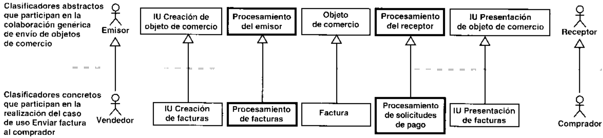

cadores concretos que son sus subtipos.

Podemos utilizar la misma tecnica para realizar el caso de uso Pedir Bienes o Servicios.

Obsérvese que el uso de generalizaciones no es la unica forma de emplear una colaboraciongenerica. Por ejemplo, los patrones que son colaboraciones parametrizadas (con clases para-metrizadas) tambien son genericos y pueden utilizarse asociando clases concretas con losparametros.

La mayoria de los mecanismos genericos deberian ser identificados y disenados en la fasede elaboracion. Si se hace asi con cuidado, el arquitecto suele ser capaz de disenar un conjun-to de mecanismos que daran solucion a los aspectos mas dificiles del diseno, haciendo que lamayor parte de los casos de uso sean facil y directamente realizables en la fase de construccion.Los mecanismos relacionados con productos software comprados son candidatos naturales parala capa intermedia. Los demas mecanismos encontraran probablemente su sitio natural en lacapa general de la aplicacion.

# 9.5.2.  Actividad: diseno de un caso de uso

Los objetivos del diseho de un caso de uso son:

· Identificar las clases del diseno y/o los subsistemas cuyas instancias son necesarias parallevar a cabo el flujo de sucesos del caso de uso.· Distribuir el comportamiento del caso de uso entre los objetos del diseno que interactuany/o entre los subsistemas participantes.· Definir los requisitos sobre las operaciones de las clases del diseno y/o sobre los subsis-temas y sus interfaces.· Capturar los requisitos de implementacion del caso de uso.

9.5.2.1. Identificacion de clases del diseno participantes En este pasoidentificaremos las clases del diseno que se necesitan para realizar el caso de uso (véase laFigura 9.34). Debemos hacer lo siguiente:

· Estudiar las clases del analisis que participan en la correspondiente realizacion de caso deuso-analisis. Identificar las clases del diseno que poseen una traza hacia esas clases del

analisis, creadas por el ingeniero de componentes en el disenio de clases o por el arquitectoen el diseno arquitectonico.

· Estudiar los requisitos especiales de la correspondiente realizacion de caso de uso-anali-sis. Identificar las clases del diseno que realizan esos requisitos especiales. Estas iltimaspueden haber sido identificadas bien por el arquitecto durante el disenio arquitectonico (enla forma de mecanismos genericos) o bien por el ingeniero de componentes durante eldiseno de clases.

· Como resultado, deberiamos identificar las clases necesarias, y deberiamos asignar su res-ponsabilidad a algun ingeniero de componentes.

· Si aun faltase alguna clase del diseno para el caso de uso en particular, el ingeniero de ca-sos de uso dcberia comunicarselo a los arquitectos o a los ingenieros de componentes. De-beria identificarse la clase necesaria, y esta iltima deberia asignarse a un ingeniero decomponentes.

Debemos recoger las clases del diseno que participan en una realizacion de caso de uso enun diagrama de clases asociado con la realizacion. Utilizaremos este diagrama para mostrar lasrelaciones que se utilizan en la realizacion del caso de uso.

# Ejemplo Clases participantes en la realizacion del caso de usoPagar Factura

La Figura 9.35 muestra un diagrama de clases que contiene las clases que participan en la realiza-cion del caso de uso Pagar Factura, y sus asociaciones.

Algunas clases activas, como Procesamiento de Solicitudes de Pago y Procesamiento de Fac-turas, son las que principalmente soportan la ejecucion del sistema Interbank. Lo hacen mediante latransferencia de objetos de comercio entre diferentes nodos desde un emisor a un receptor, por ejem-plo, la transferencia de una factura del vendedor al comprador.

9.5.2.2.  Descripcion de las interacciones entre objetos del disenoCuando tenemos un esquema de las clases del diseno necesarias para realizar el caso de uso,debemos describir como interactuan sus correspondientes objetos del diseno. Esto se hacemediante diagramas de secuencia que contienen las instancias de los actores, los objetos deldiseno, y las transmisiones de mensajes entre éstos, que participan en el caso de uso. Si los casosde uso tienen varios flujos o subflujos distintos, suele ser uitil en crear un diagrama de secuenciapara cada uno de ellos. Esto puede hacer mas clara la realizacion del caso de uso, y también

Para comenzar este paso, debemos estudiar la correspondiente realizacion de caso de uso-analisis. Podemos utilizarla para obtener un esbozo de la secuencia necesaria de mensajes entrelos objctos del diseno, aunque puede que se hayan anadido muchos objetos del diseno nuevos.En algunos casos, incluso puede merecer la pena transformar un diagrama de colaboracion dela realizacion de caso de uso-analisis en un esbozo inicial del correspondiente diagrama desecucncia.

Para crear un diagrama de secuencia, debemos comenzar por el principio del flujo delcaso de uso, y despues seguir ese flujo paso a paso, decidiendo que objetos del diseno y que in-teracciones de instancias de actores son necesarias para realizar cada paso. En la mayoria de loscasos, los objetos se ajustan de manera natural a la secuencia de interacciones de la realizacionde caso de uso. Debemos observar lo siguiente sobre estos diagramas de secuencia:

· El causante de la invocacion del caso de uso cs un mensaje de una instancia de un actorhacia un objeto del diseno.

· Cada clase del diseno identificada en el paso anterior deberia tener al menos un objeto deldiseho participante en el diagrama de secuencia.

· Los mensajes que realizan el caso de uso se envian entre lineas de vida de los objetos(Apendice A). Un mensaje puede tener un nombre temporal que despues pasara a ser elnombre de una operacion tras haber sido identificado por el ingeniero de componentesresponsable de la clase del objeto receptor.

e   a sd d  s p  gportante comprender el ordcn cronologico de las transferencias de mensajes entre objetos.· Utilizaremos etiquetas y el flujo de sucesos-diseno para complementar los diagramas desecuencia.

· El diagrama de secuencia deberia tratar todas las relaciones del caso de uso que realiza.Por ejemplo, si el caso de uso A es una especializacion de un caso de uso B mediante unarelacion de generalizacion, el diagrama de secuencia que realice el caso de uso A puedetener que hacer referencia a la realizacion (es decir, al diagrama de secuencia) del caso deuso B. Obsérvese que tambien es posible que ese tipo de referencias este presente en lascorrespondientes realizaciones de caso de uso-analisis.

# Ejemplo Diagrama de secuencia para la primera parte del casode uso Pagar Factura

La descripcion del flujo de sucesos-diseno que complementa a este diagrama de secuenciapodria ser algo parecido a lo siguiente:

El comprador utiliza el sistema mediante el applet IU Solicitud de Pago y mediante la apli-cacion de Procesamiento de Solicitudes de Pago para hojear las solicitudes de pago recibidas.Procesamiento de Solicitudes de Pago utiliza al Gestor de Pedidos para comprobar las fac-turas con sus confirmaciones de pedido asociadas, antes de que el lU Solicitud de Pago mues-tre la lista de facturas al comprador.

y a su vez el IU Solicitud de Pago pasa esta solicitud a Procesamiento de Solicitudes de Pago.pago de la factura, y éste crea una Solicitud de Pago. La aplicacion de Procesamiento de So-licitudes de Pago solicita despues a la aplicacion de Procesamiento de Facturas que cambieel estado de la factura a "Planificada"

A medida que vamos detallando los diagramas de interaccion, encontraremos muy proba-blemente nuevos caminos alternativos que puede tomar el caso de uso. Podemos describir es-tos caminos en las etiquetas de los diagramas o en diagramas de interaccion independientes. Alanadir mas informacion, el ingeniero de componentes descubrira con frecuencia nuevas ex-cepciones que no se tuvieron en cuenta durante la captura o el analisis de los requisitos. Estostipos de excepciones incluyen:

· Gestion de temporizadores cuando los nodos o las conexiones dejan de funcionar.

· Entradas erroneas que pueden proporcionar los actores, sean éstos humanos o no.

· Mensajes de error generados por la capa intermedia, el software del sistema, o el hard-ware.

9.5.2.3.  ldentificacion de subsistemas e interfaces participantesHasta aqui, hemos diseniado un caso de uso como una colaboracion de clases y de sus objetos.Sin embargo, a veces es mas apropiado disenar un caso de uso en terminos de los subsistemasy/o interfaces que participan en él. Por ejemplo, en el desarrollo descendente, puede que seanecesario capturar los requisitos sobre los subsistemas y sus interfaces antes de haber disenadosus contenidos, 0 en algunos casos deberia scr facil sustituir un subsistema y su diseno internoparticular por otro subsistema que tenga otro diseno distinto. En csos casos, podemos describirlas rcalizaciones de caso de uso-diseno cn varios niveles de la jerarquia de subsistemas (veasela Figura 9.37).

Para comenzar. es ncccsario identificar los subsistemas necesarios para realizar el caso deuso, mediante los siguientes pasos:

· Estudiar las clases del analisis que participan en las correspondicntes realizaciones de casode uso-analisis. Identificar los paquetes del analisis que conticnen a esas clases delanalisis, si existen. Despues, identificar los subsistemas del diseno que poseen una trazahacia csos paquetes del analisis.

· Estudiar los requisitos especiales de las correspondientes realizaciones de caso de uso-ana-lisis. Identificar las clases del diseno que realizan esos requisitos especiales, si existen.Despues, identificar los subsistemas del disenio que contienen a esas clases.

Debemos recoger los subsistemas que paricipan en una realizacion de caso de uso cn undiagrama de clases asociado a la realizacion. Utilizaremos este diagrama de clases para mostrarlas dependencias entre esos subsistemas y cualquier interfaz que se utilice en la realizacion delcaso de uso.

# Ejemplo Subsistemas e interfaces participantes en la realizaciondel caso de uso Pagar Factura

La Figura 9.38 muestra un diagrama de clases que incluye subsistemas, interfaces, y sus depen-dencias, para la primera parte del caso de uso Pagar Factura.

9.5.2.4.  Descripcion de interacciones entre subsistemas Cuandotenemos un esbozo de los subsistemas necesarios para realizar el caso de uso, debemosdescribir como interactuan los objetos de las clases que contiene en el nivel de subsistema. Loharemos mediante diagramas de secuencia que contengan las instancias de actores, subsistemas,y transmisiones de mensajes cntre éstos que participan. Al hacerlo, utilizaremos una tecnicasimilar a la descrita en la Seccion 9.5.2.2, con las siguientes diferencias:

· Las lineas de vida (Apendice A) en los diagramas de secuencia denotan subsistemas enlugar dc objetos del diseno.· Cada subsistema identificado cn la Seccion 9.5.2.3 deberia tener al menos una linea devida que lo denote en un diagrama de secuencia.· Si asignamos un mcnsaje a una operacion de una interfaz, puede resultar apropiadocualificar el mensaje con el interfaz que proporciona la operacion. Esto es necesariocuando un subsistema proporciona varias interfaces, y debemos distinguir que interfaz seutiliza en cada mensaje.

9.5.2.5. Captura de requisitos de implementacion  En este paso, incluimosen la realizacion del caso de uso todos los requisitos identificados durante el diseno quedeberian tratarse en la implementacion, como los requisitos no funcionales.

# Ejemplo Requisitos de implementacion del caso de usoPagar Factura

El siguiente es un ejemplo de un requisito de implementacion hallado en la realizacion del caso deuso Pagar Factura:

soportar 10 clientes de comprador diferentes sin un retraso perceptible para cada determi-nado comprador.

# 9.5.3.  Actividad: diseno de una clase

El propsosito de disehar una clase es crear una clase del diseno que cumpla su papel en las realizaciones de los casos de uso y los requisitos no funcionales que se aplican a estos (veaseFigura 9.39). Esto incluye cl mantenimiento del diseno de clases en si mismo y los siguientesaspectos de éste:

· Sus operaciones.· Sus atributos.· Las relaciones en las que participa.· Sus metodos (que realizan sus operaciones).· Los estados impuestos.· Sus dependencias con cualquier mecanismo de diseno generico.· Los requisitos relevantes a su implementacion.· La correcta realizacion de cualquier interfaz requerida.

9.5.3.1.  Esbozar la clase del diseno  Como un primer paso, necesitamos esbozaruna o varias clases del disenio, dada la entrada en terminos de clases de analisis y/o interfaces.Cuando tomamos una interfaz como entrada, suele ser simple y directo el asignar a una clase dediseno para que proporcione esa interfaz.

Cuando se dan como entrada una o varias clases del analisis, los metodos utilizadosdependen del estereotipo de la clase de analisis:

· Disenar clases de interfaz es dependiente de la tecnologia de interfaz especifica que seutilice. Por ejemplo, las clases de interfaz disenadas en Visual Basic implicarian clases deldiseno estereotipadas como <forms> junto con otras clases del diseno que representan 《controls>, posiblemente <controls> de ActiveX, en el interfaz de ususario. Tambiénhay que darse cuenta de que en algunas herramientas de diseno de interfaces de usuariomodernas, los interfaces de usuario creados de forma visual directamente sobre la panta-lla, haciendo asi implita la creacion de las correspondientes clases de disenio. Cualquierprototipo de interfaz de usuario existente es una entrada esencial en esta etapa.

· Disenar clases de entidad que representen informacion persistente (o clases que tienenotros requisitos persistentes) a menudo implica el uso de tecnologias de bases de datos es-pccificas. Por cjemplo, se puede incluir la creacion de clases de discno para hacer lacorrespondencia con tablas en un modelo de datos relacional. Este paso pucde automa-tizarse parcialmente utilizando las herramientas de modelado disponibles actualmente,aunque puede ser bastante delicado y requerir la adopcion de una estrategia persistente.Puede haber muchos aspectos del diseno involucrados en la adopcion de una estrategia,especialmente a la hora de hacer corresponder el modelo de diseno orientado a objctoscon cl modclo de datos relacional. Estos aspectos pueden a su vez requerir trabajadoresdistintos (por ejemplo, disenadores de bases de datos), actividades distintas (por ejemplo.diseno de bases de datos), y modelos distintos (por ejemplo, modelos de datos) en el pro-ceso de desarrollo —estos casos no son objeto de cste libro.

· Disenar clases de control es una tarea delicada. Debido a que encapsulan secuencias,coordinacion de otros obejetos 0 algunas veces pura logica del negocio, es necesiario con-siderar los siguientes aspectos:

Aspectos de distribucion: si la secuencia necesita ser distribuida y manejada por di-ferentcs los nodos de una red, se puede requerir separar las clases del diseno en dife-rentes nodos para rcalizar la clase de control.

radas para realizar la clase de control. En cambio, la clase de control podria realizar-se por las mismas clases del diseno que estan realizando algunas clases de interfaz 0clases de entidad rclacionadas.

Aspectos de transaccion: las clases de control a menudo encapsulan transacciones. Suscorrepondientes disenos deben incorporar cualquier tecnologia dc manejo de tran-saccion existente que se este utilizando.

Las clases de discno identificadas en cste paso deberan ser asignadas trazando dependenciasa las correspondientes clases de analisis que son disenadas. Es importante conservar cn mentelos "origenes" de la clase de diseno cuando sca refinada en los pasos posteriores.

la clases de diseno van a necesitar y describimos esas operaciones utilizando la sintaxis de loslenguajes de programacion. Esto incluye especificar la visibilidad de cada operacion (porejemplo, public, protected, privale cn C++). Algunas entradas importantes en esta etapa son:· Las responsabilidades de cualquier clase del analisis que tenga una traza con la clase deldiseno. Una responsabilidad a menudo implica una o varias operaciones. Es mas, si lasentradas y salidas se describen para las responsabilidades, pueden ser utilizadas como unprimer bosquejo de parametros formales y valores de retorno de las operaciones.

· Los requisitos especiales de cualquier clase de analisis que tenga una traza con la clase deldiseno. Recuerdese que aquellos requisitos a menudo necesitan ser manejados por elmodelo de diseno, posiblemente incorporando algun mecanismo o tecnologia de disenogenérico o tecnologia de base de datos.

· Las interfaces que la clase de disenio necesita proporcionar. Las operaciones de las inter-faces tambien necesitan ser proporcionadas por la clase de diseno.

· Las realizaciones de caso de uso-diseno en las que la clase participa (vease Sec-ci0n 9.5.2).

Las operaciones de la clase de disenio necesitan soportar todos los roles que las clases de-sempenan en las diferentes realizaciones de casos de uso. Estos roles se encuentran yendo a tra-vés de las realizaciones de casos de uso y mirando si la clase y sus objetos estan incluidos enlos diagramas y en las descripciones de flujos de sucesos-diseno de las realizaciones.

# Ejemplo Operaciones de la clase Factura

La clase Factura participa en varias realizaciones de casos de uso, como aquellas de Pagar Factu-ra, Enviar Aviso y Enviar Factura al Comprador. Cada una de estas realizaciones leen o cambian elestado de los objetos Factura. El caso de uso Enviar Factura al Comprador crea y envia facturas. Elcaso de uso Pagar Factura planifica Facturas, y asi todos. Cada una de estas realizaciones de casosobjetos desempenan distintos papeles en estas realizaciones de casos de uso.

Primero, los ingenieros de componentes pensaron en implementar estos cambios de estadocomo una operacion llamada setStatus, que tenia un parametro que indicaba la accion deseada y elplementar operaciones explicitas para cada transicion de estados. Es mas, decidieron utilizar estelas siguientes operaciones (cada una de las cuales cambia el estado de Objeto de Comercio): Crear,Enviar, Planificar y Cerrar. No obstante, estas operaciones son solamente operaciones virtuales quedefinen una signatura. Las clases que son subtipos de la clase Objeto de Comercio tienen que definircada una un metodo concreto que realice estas operaciones.

Para algunas clases el comportamiento de sus objetos depende fuertemente del estado delobjeto. Estas clases se decriben mejor utilizando diagramas de estado. Vease Seccion 9.5.3.7.9.5.3.3.  Identificar atributos  En este paso, identificamos los atributos requeridospor la clase de diseno y los describimos utilizando la sintaxis del lenguaje de programacion. Unatributo especifica una propicdad de una clase de diseno y esta a menudo implicado y esrequerido por las operaciones de la clase (como se considero en el paso anterior). Las siguientesnormas gcnerales han de tenerse en cuenta cuando se identifiquen atributos:

· Considerar los atributos sobre cualquier clase de analisis que tenga una traza con la clasede diseno. Algunas veces estos atributos implican la necesidad de uno o mas atributos dela clase de disenio.· Los tipos de atributos disponibles estan restringidos por el lenguaje de programacion.· Cuando se elige un tipo de atributo, intentar reutilizar uno que ya exista.· Una simple instancia de atributo no puede ser compartida por varios objetos de disenio. Siesto fuera necesario, el atributo necesita ser definido en una clase separada.· Si una clase de diseno llega a ser muy complicada de comprender por culpa de susatributos, algunos de estos atributos pueden ser separados en clases independientes.· Si hay muchos atributos o son complejos los atributos de una clase, se puede ilustrar éstaen un diagrama de clases separado que muestre solamente el apartado de atributos.

9.5.3.4.  Identificar asociaciones y agregaciones Los objetos de disenointeractuan unos con otros en los diagramas de secuencia. Estas interacciones a menudorequiercn asociaciones entre las clases correspondientes. Los ingenieros de componentesdebcn, por tanto, estudiar la transmision de mensajes en los diagramas de secuencia paradcterminar que asociaciones son necesarias. Las instancias de las asociaciones deben serutilizadas para abarcar las referencias con otros objetos, y para agrupar objetos en agregacionescon cl proposito de enviarles mensajes.

El numero de relaciones entre clases debe estar minimizado. Estas no son en un principio re-laciones del mundo real que deban ser modeladas como asociaciones o agregaciones, pero lasrelaciones deben existir en respuesta a las demandas de varias realizaciones de casos de uso.Notese tambien que puesto quc los aspectos de rendimiento necesitan ser manejados durante eldiseno, debe requerirse el modelado de rutas de busqueda optimas a traves de las asociacionesy agregaciones.

Deben tenerse en cuenta las siguientes directrices generales a la hora de definir o redefinirlas asociaciones y agregaciones:

· Considerar las asociacioncs y agregaciones involucrando la correspondiente clase deanalisis (o clases). Algunas veces estas relaciones (en el modelo de analisis) implican lanecesidad de una o varias relaciones correspondientes (en el modelo de diseno) queinvolucre la clase de diseno.

· Refinar la multiplicidad de las asociaciones, nombres de rol, clases de asociacion, roles deordenacion, roles de cualificacion y asociaciones n-arias de acucrdo con el soporte del len-guaje de programacion utilizado. Por ejemplo, los nombres de los roles pueden llegar a seratributos de la clase de diseno cuando se genere el codigo, por lo tanto se restringe laforma de los nombres de roles. O, una asociacion de clases puede llegar a ser una clasenueva entre las dos clases originales, por lo que se requiere nuevas asociaciones con lamultiplicidad apropiada entre la clase "asociacion" y las otras dos clases.

· Refinar la navegabilidad de las asociaciones. Considerar los diagramas de interaccion enlos que se emplean asociaciones. La direccion de las transmisiones de los mensajes entrelos objetos de discnio implica que se corresponda con la navegabilidad de las asociacionesentre sus clases.

9.5.3.5.  ldentificar las generalizaciones  Las generalizaciones deben serutilizadas con la misma semantica definida en el lenguaje de programacion. Si el lenguaje deprogramaci6n no admite generalizacion (o herencia), las asociaciones y/o agregaciones debenutilizarse en lugar de ésta para proporcionar delegacion desde los objetos de clases maspara realizar trabajo, obtener el trabajo realizado y un mensaje de confirmacion).

# Ejemplo Generalizaciones en el modelo diseno

Tanto Facturas como Pedidos cambian de estado de forma similar y soportan operaciones similares.Ambas son especializaciones de una clase Objeto de Comercio mas general (véase Figura 9.41)

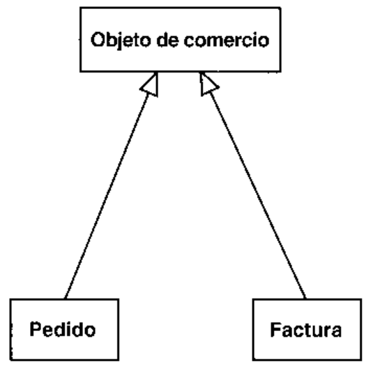

9.5.3.6.  Describir los metodos s Los metodos pueden ser utilizados durante eldiseno para especificar como se deben realizar las operaciones. Por ejemplo, un metodo puedeespecificar un algoritmo que sea utilizado para realizar una operacion. El metodo puedc screspecificado utilizando lenguaje natural o pscudocodigo si se considera mas apropiado.

No obstante, la mayoria de las veces los metodos no son especificados durante el diseno. Encambio, pueden ser creados durante la implementacion utilizando un lenguaje de programaciondirectamente. Esto es porque el mismo ingeniero de componentes debe disenar e implementarlas clases, de forma que se elimine la necesidad de menejo de especificaciones como las de losmetodos.

Notese que si la herramienta de diseno soporta una generacion de codigo integrada para losmetodos de las clases de disenio, pueden especificarse los metodos directamente en la herramienta de diseno utilizando un lenguaje de programacion, pero esto se considera una actividadde implementacion, y no se trata dentro del diseno. Les referimos al Capitulo 10 y al tema de laactividad de implementacion de clases (Seccion 10.5.4) para mas detalles.

que significa que sus estados determinan su comportamiento cuando reciben un mensaje. Enestos casos, es significativa la utilizacion de diagramas de estado para describir las diferentestransiciones de estado de un objeto del diseno. Cada diagrama de estados es entonces unaentrada de valor para la implementacion de la correspondiente clase del diseno.

# Ejemplo

# Diagrama de estados para la clase Factura

Los objetos Factura cambian de estado segun sean creados, enviados, planificados o cerrados.ejemplo, una factura puede no ser planificada antes de haber sido enviada. Esta secuencia de es-

el saououg opipad un anbed lopeidwoo un anb alainb lopapuan un opueno eao as enoe, eunel estado de la factura transita a planificada. Entonces, si el comprador no paga a tiempo, el estadode la factura transita a vencida y no pagada. Finalmente, como la factura se ha pagado, el esta-do transita a cerrada.

9.5.3.8.  Tratar requisitos especiales  En esta fase debe ser tratado cualquierrequisito que no haya sido considerado en pasos anteriores. Cuando se hace esto, hay queestudiar los requisitos formulados en la realizacion de los casos de uso en los que la claseparticipa. Estos pueden establecer requisitos (no funcionales) para la clase de diseno. Tambiéncs necesario estudiar los requisitos especiales de cualquier clase de analisis que trace la clasede diseno. Estos requisitos especiales a menudo necesitan ser manejados por la clase dediseno.

# Ejemplo Emplear un mecanismo de diseno para manejarrequisitos especiales

Los objetos Factura necesitan ser accedidos desde diferentes nodos, desde el Servidor del Com-disenada para un sistema distribuido. En nuestro ejemplo, implementamos esta distribucion deobjetos haciendo la clase Factura una subclase de la clase abstracta de Java java.rmi.Unicast-RemoteObject, que soporta la Invocacion de Mensajes Remotos (RMl), vease Figura 9.43. Adviertasearquitectonico.

Al tratar estos requisitos, debemos utilizar siempre que sea posible los mecanismos dediseno que identifico cl arquitecto.

Sin cmbargo, podria ser adecuado posponer hasta la implementacion el tratamiento dealgunos requisitos. Esos requisitos deberian anotarse como requisitos de implementacion parala clase del diseno.

# Requisito de implementacion para una clase Activa

El siguiente es un ejemplo de un requisito de implementacion para la clase Procesamiento de Soli-citud de Pago.

clientes de Comprador diferentes sin un retardo perceptible para los compradores.

# 9.5.4.  Actividad: diseno de un subsistema

Los objetivos del diseno de un subsistema son (vease la Figura 9.44):

· Garantizar que el subsistema es tan independiente como sea posible de otros subsistemasy/o de sus interfaces.

· Garantizar que el subsistema proporciona las interfaces correctos.

· Garantizar que el subsistema cumple su prop6sito de ofrecer una realizacion correcta delas operaciones tal y como se definen en las interfaces que proporciona.

9.5.4.1.  Mantenimiento de las dependencias entre subsistemasDeberian definirse y mantenerse dependencias en un subsistema respeeto a otros cuando loselementos contenidos en estos ultimos estén asociados con elemcntos dentro de aquel. Noobstante, si esos otros subsistemas proporcionan interfaces, las dependencias (de uso) deberiandeclararse hacia las interfaces en vez de hacia los propios subsistemas. Es mejor serdepcndiente de un interfaz que serlo de un subsistema, ya que un subsistema podria sersustituido por otro que posea un diseno interno distinto, mientras quc en ese mismo caso, noestariamos obligados a sustituir la interfaz.

Debemos intentar minimizar las dcpendencias entre subsistemas y/o interfaces, tratando dereubicar las clases contenidas en un subsistema que sean demasiado dependientes de otros sub-sistemas.

# 9.5.4.2. Mantenimiento de interfaces proporcionadas por el subsis-

tema  Las operaciones definidas por las interfaces que proporciona un subsistema debensoportar todos los roles que cumple el subsistema en las diferentes realizaciones de caso de uso.Incluso si las interfaces fueron esbozadas por los arquitectos, puede ser necesario que elingeniero de componentes las refine a medida que evoluciona el modelo de disenio y se vandisenando los casos de uso. Recuerdese que los ingenieros de componentes pueden utilizar unmismo subsistema y sus interfaces dentro de varias realizaciones de caso de uso, proporcionan-do por ello mas requisitos sobre las interfaces (vease la Seccion 9.5.2.4).

La tecnica para mantener interfaces y sus operaciones es similar a la tecnica para mantenerclases del diseno y sus operaciones, tal y como se describi6 en la Seccion 9.5.3.2.

9.5.4.3.  Mantenimiento de los contenidos de los subsistemas  Unsubsistema cumple sus objetivos cuando ofrece una realizacion correcta de las operaciones talquien esboz6 los contenidos de los subsistemas, puede ser necesario que los ingenieros decomponentes los refinen a medida que evoluciona el modelo de diseno. Algunos aspectosgenerales relacionados con esto son los siguientes:

· Por cada interfaz que proporcione el subsistema, deberia haber clases del diseno u otros· Para clarificar como el discno interno de un subsistema realiza cualquiera de sus interfa-ces o casos de uso, podemos crear colaboracioncs en terminos de los elementos conteni-dos en el subsistema. Podemos hacer esto para justificar los elementos contenidos en elsubsistema.

# Ejemplodentro de un subsistema

El subsistema Gestion de Facturas del Comprador proporciona la interfaz Factura. El ingeniero decomo se muestra en la Figura 9.45. Una realizacion alternativa podria haber sido hacer que algunaotra clase del diseno realizase la interfaz, y que a su vez usase a la clase Factura.

# 9.6.  Resumen del diseno

El principal resultado del diseno es el modelo de diseno que se esfuerza en conservar la es-tructura del sistema impuesta por el modelo de analisis, y que sirve como esquema para laimplementacion. El modelo de diseno incluye los siguientes elementos:

· Subsistemas del diseno y subsistemas de servicio y sus dependencias, interfaces y con-tenidos. Los subsistemas del diseno de las dos capas superiores (las capas especifica ygeneral de la aplicacion) se obtienen a partir de los paquetes del analisis (Seccion9.5.1.2.1). Algunas de las dependencias entre subsistemas del diseno se obtienen a par-tir de las correspondicntes dependencias entre paquetes del analisis (Seccion 9.5.1.2.3).Algunos de las interfaces se obtienen a partir de las clases del analisis (Seccion9.5.1.2.4).· Clascs del diseno, incluyendo las clases activas, y sus operaciones, atributos y requisitosde implementacion. Algunas clases del disenio relevantes para la arquitectura se obtienena partir de las clases del analisis relevantes para la arquitectura (Seccion 9.5.1.3.1).Algunas clases activas se obtiencn a partir de clases del analisis (Seccion 9.5.1.3.2). Engeneral, las clases del analisis se utilizan como especificaciones al obtener las clases deldiseno (Seccion 9.5.3.1).· Realizaciones de caso de uso-diseno, que describen como se disenan los casos de uso enterminos de colaboraciones dentro del modelo de diseno. En general, al obtener las rea-lizaciones de caso de uso-diseno utilizamos las realizaciones de caso de uso-analisiscomo especificaciones (Seccion 9.5.2).· La vista arquitectonica del modelo de diseno, incluyendo sus elementos significativos decara a la arquitectura. Como ya se dijo, se utilizan como especificaciones los elementossignificativos para la arquitectura del modelo de analisis cuando se identifican los ele-mcntos significativos para la arquitectura del modelo de diseno.

El diseno también obticne como resultado un modelo de despliegue, que describe todas lasconfiguraciones de red sobre las cuales deberia implantarse el sistema. El modelo de despliegueincluyc:

· Nodos, sus caracteristicas, y sus conexiones.

· Una correspondencia inicial de clases activas sobre los nodos.

· La vista arquitectonica del modelo de despliegue, que incluye a sus elemcntos relevantes

Como presentaremos en los siguientes capitulos, los modelos de diseno y de despliegue se· Los subsistemas dcl diseno y los subsistemas de servicio seran implementados mediantesubsistemas de implementacion que contienen los verdaderos componentes: ficheros decodigo fuente, scripts, binarios, ejecutables y similares. Estos subsistemas de implemen-tacion poseeran una traza uno-a-uno (isomorfica) hacia los subsistemas del diseno.

· Las clases del diseno se implementaran mediante componentes de fichero que contendranel codigo fuente. Es frecuente implementar varias clases del diseno dentro de un mismocomponente de fichero, aunque esto depende del lenguaje de programacion que estemosutilizando. Por otro lado, las clases activas del diseno que representen procesos pesados seutilizaran como entrada cuando identifiquemos los componentes ejecutables.

· Las realizaciones de caso de uso-diseno se utilizaran al planificar y llevar a cabo elesfuerzo de implementacion en pasos pequenos y manejables, que dan como resultado"construcciones". Cada construccion implementara principalmente un conjunto de reali-zaciones de caso de uso o partes de ellas.

El modelo de despliegue y las configuraciones de red se utilizaran al distribuir el sistemainstalando componentes ejecutables en los nodos.

# 9.7.  Referencias

[1] Erich Gamma, Richard Helm, Ralph Johnson, and John Vlissides, Design Patterns: Ele-ments of Reusable Object-Oriented Sofrware, Reading, MA: Addison-Wesley, 1994.

[2] Ivar Jacobson, Stefan Bylund, Patrik Jonsson, Staffan Ehnebom, “Using contracts and usecases to build plugable architectures"', Journal of Object-Oriented Programming, June.1995.

[3]  Ivar Jacobson, Martin Griss, and Patrik Jonsson, Software Reuse: Architecture, Process andOrganization for Business Success, Reading MA: Addison-Wesley, 1997.

# Implementacion

# 10.1.  Introduccion

En la implementacion empezamos con el resultado del diseno e implementamos el sistema enterminos de componentes, es decir, ficheros de codigo fuente, scripts, ficheros de codigo bi-nario, ejecutables y similares.

Afortunadamente, la mayor parte de la arquitectura del sistema es capturada durante el di-seno, siendo cl proposito principal de la implementacion el desarrollar la arquitectura y el sis-tema como un todo. De forma mas especifica, los propositos de la implementacion son:

· Planificar las integraciones de sistema necesarias en cada iteracion. Seguimos para ello unenfoque incremental, lo que da lugar a un sistema que se implementa en una sucesion depasos pequefos y manejables.· Distribuir el sistema asignando componentes ejecutables a nodos en el diagrama de des-pliegue. Esto se basa fundamentalmente en las clases activas encontradas durante el diseno.· Implementar las clases y subsistemas encontrados durante el diseno. En particular, las cla-ses se implementan como componentes de fichero que contienen codigo fuente.· Probar los componentes individualmente, y a continuacion integrarlos compilandolos yenlazandolos en uno o mas ejecutables, antes de ser enviados para ser integrados y llevara cabo las comprobaciones de sistema.

En éste y en los capitulos siguientes presentaremos como se lleva a cabo la implementaciony que trabajadores y artefactos cstan involucrados (vease Figura 10.1). Seguimos la linea de tra-bajo que seguimos para el diseno.

# 10.2. El papel de la implementacion en el ciclo de vidadel software

La implementacion es el centro durante las iteraciones de construccion, aunque tambien sc lle-va a cabo trabajo de implcmentacion durante la fase de elaboracion, para crear la linea base eje-cutable de la arquitectura, y durante la fase de transicion, para tratar defectos tardios como losencontrados con distribuciones beta del sistema (como se indica en la Figura 10.2 con un picoen la columna de transicion).

Ya que el modelo de implementacion denota la implementacion actual del sistema en tér-minos de componentes y subsistemas de implementacion, es natural mantener el modelo de im-plementacion a lo largo de todo el ciclo de vida del software.

# 10.3.  Artefactos

# 10.3.1.  Artefacto: modelo de implementacion

El modelo de implementacion describe como los elementos del modelo de diseno, como lasclases, se implemcntan en terminos de componentes, como ficheros de codigo fuente, ejecu-tables, etc. El modelo de implementacion describe tambien como se organizan los componen-tes de acuerdo con los mecanismos de estructuracion y modularizacion disponibles en elentorno de implementacion y en el lenguaje o lenguajes de programacion utilizados, y comodcpenden los componentes unos de otros.

El modelo de implementacion define una jerarquia, tal y como se ilustra en la Figura 10.3.

El modelo de implementacion se representa con un sistema de implementacion que denotael subsistema de nivel superior del modelo. El utilizar otros subsistemas es por tanto una formade organizar el modelo de implementacion en trozos mas manejables.

# 10.3.2.  Artefacto: componente

Un componente es el empaquetamiento fisico de los elementos de un modelo, como son las cla-ses en el modelo de diseno [5]. Algunos estereotipos estandar de componentes son los si-guientes:

· 《executable> es un programa que puede ser ejecutado en un nodo· 《file> es un fichero que contiene codigo fuente o datos.·《library> es una libreria estatica o dinamica.·<table> cs una tabla de base de datos.·<document> es un documento.

Durante la creacion de componentes cn un entorno de implementacion particular estos es-tereotipos pueden ser modificados para reflejar el significado real de estos componentes. Loscomponentes tiencn las siguientes caracteristicas:

· Los componentes tienen relaciones de traza con los elementos de modelo que imple-mentan.· Es normal que un componente implemente varios clcmcntos, por ejemplo, varias clases;turados y modularizados los ficheros de codigo fuente, dado el lenguaje de programacionque se este usando.

# Ejemplo Un componente que sigue la traza de una clase de diseno

En el sistema Interbank, la clase de diseno Transferencias entre Cuentas se implementa en el com--lo sa ou oisa anbune 'aselo epeo eied .eaer, eluany cbipoo ap oiauo un seaio ap eaer ua unugatorio. En cualquier caso, esto se modela con una dependencia de traza entre el modelo de disenoy el de implementacion (vease Figura 10.4)

· Los componentes proporcionan las mismas interfaces que los elementos de modelo queimplemcntan.

# Ejemplo Interfaces en el diseno y en la implementacion

n  s a ss   s  s sTransferencias. Esta interfaz es también proporcionado por el componente TransferenciasEntre-Cuentas.java, el cual implementa la clase Transferencias entre Cuentas (vease Figura 10.5),

# Modelo de diseno Modelo de implementacion

· Puede haber dependencias de compilacion entre componentes, denotando qué compo-nentes son nccesarios para compilar un componente determinado.

# Ejemplo Dependencias de compilacion entre componentes

En el sistema Interbank, el componente (fichero) TransferenciasEntreCuentas.java se compila auna componente (ejecutable) 1 TransferenciasEntreCuentas.class (véase Figura 10.6)

10.3.2.1. Stubs  Un stub? es un componente con una implementacion esqueletica o deproposito especial que puede ser utilizada para desarrollar o probar otro componente quedepende del stub; una definicion similar aparece en [l]. Los stubs pueden ser utilizados paraminimizar el numero de componentes nuevos necesarios en cada nueva version (intermedia) delsistema, simplificando asi los problemas de integracion y las pruebas de integracion (vease

# 10.3.3.  Artefacto: subsistema de implementacion

Los subsistemas de implementacion proporcionan una forma de organizar los artefactos del mo-delo de implementacion en trozos mas manejables (vease Figura 10.7). Un subsistema puedeestar formado por componentes, interfaces y otros subsistemas (recursivamente). Ademas,un subsistema puede implementar -—-y asi proporcionar—- las interfaces que representan la fun-cionalidad que exportan en forma dc operaciones.

Es importante entender quc un subsistema de implementacion se manifiesta a través de unles como:

· Un paquete en Java [2].· Un proyecto en Visual Basic [3].· Un directorio de ficheros en un proyecto de C++.· Un subsistema en un entorno de desarrollo integradq como Rational Apex· Un paquete en una herramienta de modelado visual como Rational Rose

Por tanto, la semantica de la nocion de subsistema de inplenentacion se refinara ligeraeste capitulo discutimos la implemcntacion a un nivel general, aplicable a la mayoria de los en-tornos de implementacion.

Los subsistemas de implementacion estan muy relacionados con los subsistemas de disenoen el modelo de diseno (vease Capitulo 9, Secci6n 9.3.4, "Artefacto: subsistema de diseno").De hecho, los subsistemas de implementacion deberian seguir la traza uno a uno (isomorfica-mente) de sus subsistemas de diseno correspondicntcs. Recordemos que un subsistema de di-seno ya define:

· Las dependencias sobre otros subsistemas o interfaces de otros subsistemas.

· Las interfaces que han de ser proporcionadas por el subsistema.

· Las clases de diseno o, de forma recursiva, subsistemas de diseno dentro del subsistemaque deberian proporcionar las interfaces proporcionadas por el subsistema mismo.

Estos aspectos son importantes para el subsistema de implementacion correspondiente porlas siguientes razones:

· El subsistema de implementacion deberia definir dependencias analogas hacia otros sub-sistcmas de implementacion o interfaces (correspondientes).· El subsistema de implementacion deberia proporcionar las mismas interfaces.· El sistema de implementacion deberia definir qué componentes o, recursivamente, queotros subsistemas de implementacion dentro del subsistema deberian proporcionar las in-terfaces proporcionadas por el subsistema. Ademas, estos componentes (o subsistemas dep snn  s s  n  s p s riseno) correspondientes en el subsistema de diseno que implementan.

La Figura 10.8 aclara la relacion entre los modelos de diseno e implementacion.

Cualquier cambio en el modo en que los subsistemas proporcionan y usan interfaces, 0cualquicr cambio en las interfaces mismas, esta descrito en el flujo de trabajo del disefio (vea-se Capitulo 9, Seccion 9.5.4). Por tanto, estos cambios no son tratados en el flujo de trabajo dela implementacion, aunque tambicn afectan al modelo de implementacion.

Observese que la correspondencia descrita tambien se da para los subsistemas de servicio enel modclo de diseno. Por tanto, los subsistemas de implementacion que siguen la traza de lossubsistemas de servicio residiran en un nivel inferior en la jerarquia del modelo de implemen-

Modelo de disenio

tacion y cumpliran el mismo proposito que los subsistemas de servicio, es decir, estructurar elsistema de acuerdo con los servicios que proporciona. Por esta razon, los subsistemas de im-plementacion que siguen el rastro de subsistemas de servicio en el modelo de diseno encapsu-Jaran muy probablemente componentes ejecutables que proporcionen los diversos servicios delsistema.

# 10.3.4.  Artefacto: interfaz

Las interfaces han sido descritas en detalle en el Capitulo 9. Sin cmbargo, las mismas interfa-ces pueden ser utilizadas en el modelo de implementacion para especificar las operaciones im-plementadas por componentes y subsistemas de implementacion. Ademas, como se mencionodencias de uso" sobre interfaces (Figura 10.9).

Un componente que implementa (y por tanto proporciona) una interfaz ha de implementarcorrectamente todas las operaciones definidas por la interfaz. Un subsistema de implementacionque proporciona una interfaz tiene también que contener componentes que proporcionen la in-terfaz u otros subsistemas (recursivamente) que proporcionen la interfaz.

La Figura 10.11 muestra el codigo Java de la interfaz Transferencias.

# 10.3.5.  Artefacto: descripcion de arquitectura (vistadel modelo de implementacion)

La descripcion de arquitectura contiene una vision de la arquitectura del modelo de imple-mentacion (apendice C), el cual representa sus artefactos significativos arquitectonicamente(vease Figura 10.12).

Los siguientes artefactos son usualmente considerados en el modelo de implementacion sig-nificativos arquitectonicamente:

· La descomposicion del modelo de implementacion en subsistemas, sus interfaces y lasdependencias entre ellos. En general, esta descomposicion es muy significativa para laarquitectura. Sin embargo, ya que los subsistemas de implementacion siguen la traza delos subsistemas de disenio uno a uno y los subsistemas de diseno seran muy probable-mente representados en la vista de la arquitectura del modelo de diseno, usualmente esinnecesario representar los subsistemas de implementacion en la vista de la arquitecturadel modelo de implementacion.

· Componentes clave, como los componentes que siguen la traza de las clases de diseno sig-nificativas arquitectonicamente, los componentes ejecutables y los componentes que songenerales, centrales, que implementan mecanismos de diseno genericos de los que de-penden muchos otros componentes.

En la Seccion 10.5.1.1, “"Identificacion de los componentes significativos arquitectonica-mente", damos ejemplos de lo que podria incluirse en la vista de la arquitectura del modelo deimplementacion.

# 10.3.6.  Artefacto: plan de integracion de construcciones

Es importante construir el software incrementalmente en pasos manejables, de forma quecada paso de lugar a pequenos problemas de integracion o prueba. El resultado de cada paso esllamado “"construccion", que es una version ejecutable del sistema, usualmente una parte es-pecifica del sistema. Cada construccion es entonces sometida a pruebas de integracion (comose describe cn el Capitulo 1l) antes de que se cree ninguna otra construccion. Para prepararseante el fallo de una construccion (por ejemplo, si no pasa las pruebas de integracion) se lleva uncontrol de versiones de forma que se pueda volver atras a una construccion anterior. Los be-neficios de este enfoque incremental son los siguicntes:

· Se puede crear una version ejccutable del sistema muy pronto, en lugar de tener que es-perar a una version mas completa. Las prucbas de integracion comienzan pronto, y lasversiones ejecutables pueden ser utilizadas para hacer demostraciones de las caracteris-ticas del sistema tanto a los participantes directos en el proyecto como a otras personas in-volucradas en él.

· Es mas facil localizar defectos durante las pruebas de integracion, porque solo se anade 0refina cn una construccion cxistente una partc pequena y manejable del sistema. Inclusomejor, los defectos estan muy probablemente (aunque no siempre) relacionados con laparte nueva o refinada.

· Las pruebas de integracion tienden a ser mas minuciosas que las pruebas del sistema com-s  snd s sd  no s nd ds

La integracion incremental (apendice C) es para la integracion del sistema lo que el de-sarrollo iterativo controlado es para el desarrollo de software en general. Ambos se centran enun incremento bastante pequeno y manejable de la funcionalidad.

Ponicndo esto en un contexto de desarrollo iterativo, cada iteracion resultara en al menosuna construccion. Sin cmbargo, la funcionalidad a ser implementada en una iteracion deter-is s  o  s d td os on e sde esto, puede que se cree una secuencia de construcciones dentro de una iteracion, cada una delas cuales representara un paso manejable en el que se hace un pequefio incremento al sistemaCada itcracion resultara entonces en un incremento mayor del sistema, posiblemente acumuladoa lo largo de varias construcciones (vease Capitulo 5).

Un plan de integracion de construcciones describe la secuencia de construcciones necesa-rias en una iteracion. Mas concretamente, un plan de este tipo describe lo siguiente para cadaconstruccion:

· La funcionalidad que se espera que sea implementada en dicha construccion. Consiste enuna lista de casos de uso o escenarios o parte de ellos, como se discuti6 en capitulos an-teriores. Esta lista puede tambien referirse a otros requisitos adicionales.

· Las partes del modelo de implementacion que estan afectadas por la construccion. Esto esuna lista de los subsistemas y componentes necesarios para implementar la funcionalidadsupuesta por la construccion.

En la Seccion 10.5.2, “"Actividad: integrar el sistema", describimos un enfoque sistematico

# 10.4.  Trabajadores

# 10.4.1.  Trabajador: arquitecto

Durante la fase de implementacion, el arquitecto es responsable de la integridad del modelo deimplementacion y asegura que el modelo como un todo es correcto, completo y legible. Comoen el analisis y el diseno, para sistemas grandes y complejos puede introducirse un trabajadoradicional para asumir la responsabilidad del subsistema de nivel mas alto (es decir, el sistemade implementacion) del modelo de implementacion.

El modelo es correcto cuando implementa la funcionalidad descrita en el modelo de disenoy en los rcquisitos adicionales (relevantes), y solo esta funcionalidad.

El arquitecto es responsable tambien de la arquitectura del modelo de implementacion, esdecir, de la existencia de sus partes significativas arquitectonicamente como se represento en lavista de la arquitectura del modelo de despliegue. Recordemos que esta vista es parte de la des-cripcion de la arquitectura del sistema. Véase Figura 10.13.

Por último, un resultado importante de la implementacion es la asignacion de componentesejecutables a nodos. El arquitecto es responsable de esta asignacion, la cual se representa en lavista de la arquitectura del modelo de despliegue. Véase detalles en el Capitulo 9, Seccion 9.3.7.Obsérvese que el arquitecto no es responsable del desarrollo en marcha ni del manteni-miento de los diversos artefactos en el modelo de implementaci6n; por el contrario, esto es res-ponsabilidad del ingeniero de componentes correspondiente.

# 10.4.2.  Trabajador: ingeniero de componentes

El ingeniero de componentes define y mantiene el codigo fuente de uno o varios componentes,especifican las clases de diseno).

A menudo, el ingeniero de componentes tambien mantiene la integridad de uno o variosa uno a los subsistemas de diseno, la mayoria de los cambios en estos subsistemas tienen lugardurante el disefio. Sin embargo, el ingeniero de componentes necesita garantizar que los con-tenidos (por ejemplo, los componentes) de los subsistemas de implementacion son correctos,que sus dependencias con otros subsistemas o interfaces son correctas y que implementan co-rrectamente las interfaces que proporcionan. Véase Figura 10.14.

A menudo es apropiado tambien que el ingeniero de componentes que es responsable de unsubsistema sea responsable de los elementos de modelo contenidos en él (por ejemplo, los com-ponentes). Ademas, para alcanzar un desarrollo tranquilo y sin problemas, es natural que un ingeniero de componentes tenga la responsabilidad de un subsistema y de sus contenidos a lolargo de las etapas de diseno e implementacion. Un ingeniero de componentes deberia, portanto, disenar e implementar las clases bajo su responsabilidad.

# 10.4.3.  Trabajador: integrador de sistemas

La integracion del sistema esta mas alla del ambito de cada ingeniero de componentes individual.sabilidades se incluye el planificar la secuencia de construcciones necesarias en cada iteraciony la integracion de cada construccion cuando sus partes han sido implementadas. La planifi-cacion da lugar a un plan de integracion de construcciones. Véase Figura 10.15.

# 10.5. Flujo de trabajo

En las secciones anteriores hemos descrito el trabajo de implementacion de forma estatica. Acontinuacion utilizaremos un diagrama de actividades para razonar su comportamiento dina-mico (véase Figura 10.16).

ciado por el arquitecto ? esbozando los componentes clave en el modelo de implementacion. Acontinuacion, el integrador de sistemas planea las integraciones de sistema necesarias en la pre-sente iteracion como una secuencia de construcciones. Para cada construccion, el integrador desistemas describe la funcionalidad que deberia ser implementada y que partes del modelo deimplementacion (es decir, subsistemas y componentes) se veran afectadas. Los requisitos sobreJos subsistemas y componentes en la construccion son entonces implementados por ingenieros

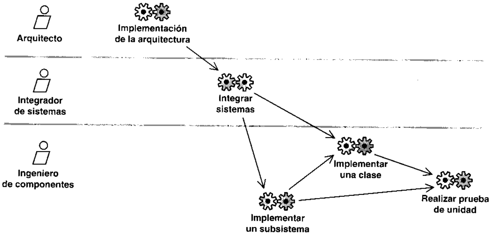

de componentes. Los componentes resultantes son probados y pasados al integrador de sistemaspara su integracion. Entonces, el integrador de sistemas integra los nuevos componentes en unaconstruccion y la pasa a los ingenieros de pruebas de integracion para llevar a cabo pruebas deintegracion (vease Capitulo 11). A continuacion, los desarrolladores inician la implementacionde la siguiente construccion, tomando en consideracion los defectos de la construcci6n anterior.

# 10.5.1.  Actividad: implementaci6n de la arquitectura

El proposito de la implementacion de la arquitectura es esbozar el modelo de implementaciony su arquitectura mediante:

· La identificacion de componentes significativos arquitectonicamente, tales como com-ponentes ejecutables.· La asignacion de componentes a los nodos en las configuraciones de redes relevantes.

Recordemos que durante el diseno de la arquitectura (vease Capitulo 9, Seccion 9.5.1) se es-bozan los subsistemas de diseno, sus contenidos e interfaces. Durante la implementacion uti-lizamos subsistemas de implementacion que siguen la traza uno a uno a estos subsistemas dedisenio y proporcionan las mismas interfaces. La identificacion de los subsistemas de imple-mentacion y sus interfaces es entonces mas o menos trivial y por tanto no la tratamos aqui. Porel contrario, el mayor reto durante la implementacion es crear dentro de los subsistemas de im-plementacion los componentes que implementen los subsistemas de diseno correspondientes.

Durante esta actividad, el arquitecto mantiene, refina y actualiza la descripcion de la ar-quitectura y las vistas de la arquitectura de los modelos de implementacion y despliegue.

10.5.1.1. ldentificacion de los componentes significativos arquitec-tonicamente A menudo resulta practico identificar pronto en el ciclo de vida del softwarelos componentes significativos arquitectonicamente, para iniciar asi el trabajo de imple-mentacion (vease Figura 10.17). Sin embargo, muchos componentes, en particular componentes

de fichero, son casi triviales de crear cuando las clases son implementadas pues estos compo-nentes no proporcionan mas que una forma de empaquetar la implementacion de las clases enficheros de codigo fuente. Por esta razon, los desarrolladores deberian tener cuidado de noidentificar demasiados componentes en esta etapa ni ahondar en demasiados detalles. De locontrario, gran parte del trabajo habra de volverse a hacer cuando se implementen las clases.Bastaria con un esbozo inicial de los componentes significativos arquitectonicamente [veaseSecci6n 10.3.5, “Descripcion de arquitectura (vista del modelo de implementacion)"].

10.5.1.1.1. ldentificacion de componentes ejecutables y asignacion de estos anodos  Para identificar los componentes ejecutables que puedan ser desplegados sobre losnodos, consideramos las clases activas encontradas durante el diseno y asignamos un compo-nente ejecutable por cada clase activa, denotando asi un proceso pesado. Esto podria incluir laidentificacion de otros componentes de fichero o de codigo binario necesarios para crear loscomponentes ejecutables, aunque esto es secundario.

# Ejemplo

# Identificacion de componentes ejecutables

En el modelo de diseno hay una clase activa denominada Procesamiento de Solicitudes de Pago. Enla implementacion, identificamos el componente ejecutable correspondiente llamado Procesamien-toDeSolicitudesDePago (vease Figura 10.18).

Continuando con el analisis de los modelos de disenio y despliegue para identificar compo.nentes ejecutables, podemos examinar si hay objetos activos asignados a nodos. Si se da eldesplegados sobre los mismos nodos.

# Ejemplo Despliegue de Componentes sobre nodos

Un objeto activo de la clase Procesamiento de Solicitudes de Pago esta asignada al nodo Servidordel Comprador. Ya que el componente ProcesamientoDeSolicitudesDePago implementa la clase Pro-Comprador (vease Figura 10.19).

La asignacion de componentes a nodos es muy importante para la arquitectura del sistema,y deberia ser representada en una vista de la aruitectura del modelo de despliegue.

# 10.5.2. Actividad: integrar el sistema

Los objetivos de la integracion del sistema son:

· Crear un plan de integracion de construcciones que describa las construcciones necesariasen una iteraci6n y los requisitos de cada construccion (vease Figura 10.20).

· Integrar cada construccion antes de que sea sometida a pruebas de integracion.

10.5.2.1. Planificacion de una construccion  En esta seccion discutimoscomo planificar los contenidos de una construccion, independientemente de que partamos deuna construccion previa o de que no partamos de ninguna. Suponemos que tenemos un numeroo sosai sono  (osn ap soseo ap sae e sono oep s) soos o osn p soseo phan de ser implementados en la iteracion actual.

Entre los criterios para crear una construccion tenemos:

· Una construccion deberia anadir funcionalidad a la construccion previa implementandocasos de uso completos o escenarios de éstos. Las pruebas de integracion de la construc-cion estaran basadas en estos casos de uso y escenarios; es mas facil probar casos de usocompletos que fragmentos de éstos (vease Capitulo 11).

· Una construccion no deberia incluir demasiados componentes nuevos o refinados. Si noes asi, puede ser muy dificil integrar la construcci6n y llevar a cabo las pruebas de inte-minimizar el numero de nuevos componentes introducidos en la construccion (veaseSeccion 10.3.2.1, “Stubs").

· Una construcci6n deberia estar basada en la construccion anterior, y deberia expandirsee s s s    tmedia y de software del sistema); las construcciones subsiguientes se expanden entonceshacia arriba a las capas general de aplicacion y especifica de aplicacion. La razon funda-mental de esto es simplemente que es dificil implementar componentes en las capas su-periores antes de que esten colocados y funcionando adecuadamente los componentesnecesarios en las capas inferiores.

Manteniendo estos criterios en mente, uno puede empezar a evaluar los requisitos, talescomo los casos de uso (o escenarios de ellos), que han de ser implementados. Observese que probablemente sera necesario un compromiso para cumplir de forma apropiada estos criterios.Por ejemplo, la implementacion de un caso de uso completo (punto uno) puede requerir muchoscomponentes nuevos (punto dos); puede hacerse sin embargo si implementar el caso de uso esimportante para la construccion actual. En cualquier caso, es importante identificar los requisitosapropiados a implementar en una construccion y dejar el resto de los requisitos para construcciones futuras. Para cada caso de uso que pueda ser implementado hagase lo siguiente:

1. Considerar el diseno del caso de uso, identificando su realizacion de caso de uso-dise-no correspondiente en el modelo de diseno. Recuérdese que puede seguirse la traza dela realizacion de caso de uso-disenio al caso de uso mismo (y por tanto, implicitamente,a cualquiera de sus escenarios) por medio de las dependencias de traza.

2.  Identificar los subsistemas y clases de diseno que participan en la realizacion de caso deuso-diseno.

3. Identificar los subsistemas y componentes de implementacion en el modelo de imple-mentacion que siguen la traza de los subsistemas y clases de disenio encontrados en elpaso 2. Estos son los subsistemas y componentes de implementacion que son necesariospara implementar el caso de uso.

4.  Considerar el impacto de implementar los requisitos de estos subsistemas de imple-mentacion y de los componentes sobre la construccion en cuestion. Obsérvese que es-tos requisitos se especifican como subsistemas y clases de diseno, como se hizo notar enel paso 3. Evaluar si este impacto es aceptable de acuerdo con el criterio descritoanteriormente. Si lo es, planifiquese el implementar el caso de uso en la construccion.En otro caso, dejese para una construccion posterior.

Los resultados deberian estar recogidos en el plan de integracion de la construccion y ser co-implementacion afectados. Los ingenieros de componentes pueden entonces empezar a im-cion actual (como se describe en las Secciones 10.5.3, “Actividad: implementar un subsistema",y 10.5.4, "Actividad: implementar una clase") y llevar a cabo las pruebas individuales decada unidad (como se describe en la Seccion 10.5.5. “"Actividad: realizar prueba de unidad"). Acontinuaci6n, los subsistemas de implementacion y los componentes se pasan al integrador desistemas para su integracion (vease Seccion 10.5.2.2, "Integracion de una construccion").

10.5.2.2.  Integracion de una construccion  Si la construccion ha sidoplanificada cuidadosamente como se describe en la seccion anterior deberia ser facil integrar laconstruccion. Esto se hace recopilando las versiones correctas de los subsistemas deimplementacion y de los componentes, compilandolos y enlazandolos para generar unaen la jerarquia de capas, ya que pueden existir dependencias de compilacion de unas capas aOtras en un nivel inferior.

La construcci6n resultante se somete entonces a pruebas de integracion, y a pruebas de sis-tema si pasa las pruebas de integracion y es la tiltima construccion dentro de una iteracion(vease Capitulo ll).

# 10.5.3.  Actividad: implementar un subsistema

El proposito de implementar un subsistema es el de asegurar que un subsistema cumple su pa-Esto quiere decir que se asegura que los requisitos (por ejemplo, escenarios o casos de uso) im-plementados en la construccion y aquellos que afectan al subsistema son implementadoscorrectamente por componentes 0 por otros subsistemas (recursivamente) dentro del subsiste-ma (vease Figura 10.21).

10.5.3.1. Mantenimiento de los contenidos de los subsistemas  Unactual y aquellos que afectan al subsistema estan implementados correctamente porcomponentes dentro del subsistema.

Incluso si el contenido de un subsistema (por ejemplo, sus componentes) es esbozado porevoluciona el modelo de implementacion. Este refinamiento puede incluir:

· Cada clase en el correspondiente subsistema de diseno que es necesaria en la construccionactual deberia ser implementada mediante componentes en el subsistema de implemen-tacion (vease Figura 10.22)

Observese que si el subsistema de diseno contiene otros subsistemas de diseno (recursiva-temas de diseno contenidos deberia ser implementado por un subsistema de implementacioncorrespondiente que es contenido a su vez por el subsistema de implementacion bajo conside-racion.

construccion actual deberia también ser proporcionada por el subsistema de implemen-tacion. Por tanto, el subsistema de implementacion ha de contener un componente o unsubsistema de implementacion (recursivamente) que proporcione la interfaz (vease Fi-gura 10.23).

# Ejemplo Un subsistema que proporciona una interfaz

El subsistema Gestion de Facturas de Comprador necesita proporcionar la interfaz Factura en laconstruccion actual. El ingeniero de componentes responsable del subsistema decide entonces de-

Dada esta situacion, los ingenieros de componentes pueden empezar a implementar lo que es re-querido por los componentes dentro del subsistema (como se describe en la Seccion 10.5.5, “"Ac-tividad: realizar prueba de unidad"'). El sistema resultante se pasa entonces al integrador de sistemaspara su integracion (como se describe en la Seccion 10.5.2, "Actividad: integrar el sistema").

# 10.5.4.  Actividad: implementar una clase

El proposito de la implementacion de una clase es implementar una clase de diseno en un com-ponente fichero. Esto incluye lo siguiente (vease Figura 10.25):

· Esbozo de un componente fichero que contendra el codigo fuente.· Generacion de codigo fuente a partir de la clase de diseno y de las relaciones en que par-ticipa.· Implementacion de las operaciones de la clase de diseno en forma de metodos.· Comprobacion de que el componente proporciona las mismas interfaces que la clase dediseno.

Aunque no lo describimos aqui, esta actividad tambien incluye varios aspectos del mante-nimiento de las clases implementadas, como la reparacion de defectos detectados durante laprueba de la clase.

10.5.4.1.  Esbozo de los componentes fichero  El codigo fuente queimplementa una clase de diseno reside en un componente fichero. Por tanto, hemos de esbozarel componente fichero y considerar su ambito. Es normal implementar varias clases de disenoen un mismo componente fichero. Recordemos, sin embargo, que el tipo de modula-rizacion ylas convenciones de los lenguajes de programacion en uso restringiran la forma en que loscomponentes fichero son esbozados (vease Seccion 10.3.2, "Artefacto: componente"). Porejemplo, cuando usamos Java, creamos un componente fichero "java" para cada clase denlacion, instalacion y mantenimiento del sistema.

10.5.4.2. Generacion de codigo a partir de una clase de diseno Alolargo del diseno, muchos de los detalles relacionados con la clase de diseno y con sus relacionesson descritos utilizando la sintaxis del lenguaje de programacion elegido, lo que hace que lad    s  e i   o  sdse cumple para las operaciones y atributos de la clase, asi como para las relaciones en las que laclase participa. Sin embargo, solo se genera la signatura de las operaciones; las operaciones en sihan de ser implementadas aun (vease Seccion 10.5.4.3, “Implementacion de operaciones").

Observese tambien que puede ser muy delicado generar codigo a partir de asociaciones y agre-gaciones, y la forma en que esto se haga depende en gran medida del lenguaje de programacionutilizado. Por ejemplo, es normal que una asociacion que se puede recorrer en una direccion seaun atributo en el objeto que referencia, y el nombre del atributo seria el nombre del rol del ex-su vez, si el tipo del atributo (de la referencia) deberia ser un puntero4 simplc (si la multiplicidades menor o igual que uno) o una coleccion de punteros (si la multiplicidad es mayor que uno) [6].10.5.4.3.  Implementacion de operaciones  Cada operacion definida por lase A eosae, o) ea, eas anb rs ou e pid s ap ey osp ap asoimplementada por descendientes (como subtipos) de la clase. Utilizamos el termino metodospara denotar la implementacion de operaciones [5]. Ejemplos de métodos en componentesfichero reales son los metodos en Java [2], los metodos en Visual Basic [3] y las funcionesmiembro en C++ [4].

La implementaci6n de una operacion incluye la eleccion de un algoritmo y unas estructurasde datos apropiadas, y la codificacion de las acciones requeridas por el algoritmo. Recordemosque el metodo puede haber sido especificado utilizando lenguaje natural o utilizando pseudocodigo durante el diseno de las clases de diseno (aunque esto es poco comun y a menudo unaperdida de tiempo; vease Seccion 9.5.3.6); por supuesto podria utilizarse cualquier "metodo dediseno" como entrada en esta etapa. Observese también que los estados descritos para la clasede diseno pueden influenciar el modo en que son implementadas las operaciones, ya que sus10.5.4.4. Los componentes han de proporcionar las interfaces apro-piadas  El componente resultante deberia proporcionar las mismas interfaces que las clasesde diseno que éste implementa. Véase ejemplo en la Seccion 10.3.2, *Artefacto: componente".

# 10.5.5.  Actividad: realizar prueba de unidad

El proposito de realizar la prueba de unidad es probar los componentes implementados como uni-dades individuales (véase Figura 10.26). Se llevan a cabo los siguientes tipos de pruebas de unidad:la unidad observable cxtcrnamente.· La prueba de estructura, o "prueba de caja blanca", que verifica la implementacion in-terna de la unidad.

Obsérvese que puede haber tambien otras pruebas que realizar sobre las unidades, comopruebas de rendimiento, utilizacion de memoria, carga y capacidad. Ademas, han de ser reali-- s s soap s b se d snsss A ne p sd se sportan correctamente cuando se integran (vease Capitulo 11).

10.5.5.1. Realizacion de pruebas de especificacion La prueba de espe-cificacion se realiza para verificar el comportamiento del componente sin tener en cuenta como seimplementa dicho comportamiento en el componente. Las pruebas de especificacion, por tanto,tienen en cuenta la salida que el componente devolvera cuando se le da una determinada entradaen un determinado estado. El numero de combinaciones de posibles entradas, estados iniciales ysalidas es a menudo considerable, lo que hace impracticable probar todas las combinaciones unaa una. En su lugar, el numero de entradas, salidas y estados se divide en clases de equivalencia.Una clase de equivalencia es un conjunto de valores de entrada, estado o salida para los que sesupone que un objeto se comporta de forma similar. Probando un componente para cadacombinacion de las clases de equivalencia de entradas, salidas y estados iniciales es posibleobtener casi la misma cobertura *efectiva"' de prueba que si se prueban individualmente cada unade las combinaciones de valores, pero con un esfuerzo considerablemente menor.

# Ejemplo Clases de equivalencia

El estado de una cuenta tiene tres clases de equivalencia: vacia, saldo negativo (quizas en descu-bierto) y saldo positivo. De forma similar, los argumentos de entrada pueden dividirse en dos clasesde equivalencia: cero y numeros positivos. Por ultimo, los valores de salida pueden caer dentro dedos clases de equivalencia: cantidad positiva retirada y nada retirado.

· Valores normales en el rango permitido para cada clase de equivalencia, como retirar 3, 3.14 05.923 euros de una cuenta.· Valores que estan en el limite de las clases de equivalencia, como retirar 0, el menor valor po-sitivo posible (por ejemplo, 0,00000001) y el mayor valor positivo posible.· Valores fuera de las clases de equivalencia permitidas, como retirar un valor mayor o menor quelos permitidos en el rango· Valores ilegales, como retirar -14 y A.

Cuando se eligen los valores de prueba el ingeniero de componentes deberia intentar cubrir todas lascombinaciones de clases de equivalencia de entrada, estado y salida. Por ejemplo, retirar 14 euros de· Una cuenta con -234,13 euros, lo que resulta en que nada es retirado· Una cuenta con 0 euros, lo que resulta en que nada es retirado· Una cuenta con 13,125 euros, lo que resulta en que nada es retirado.· Una cuenta con 15 euros, lo que resulta en que se retiran 14 euros.

El resultado neto de estos cuatro casos de prueba es que todas las combinaciones posibles de cla-ses de equivalencia de estados (saldo positivo y saldo negativo) y salidas (cantidad positiva retirada yy la salida (0 y 14 euros), pero con otro valor de la misma clase de equivalencia de la entrada, como 3,14.

A continuacion el ingeniero de componentes prepara rangos similares para probar los casosde otras clases de equivalencia para los valores de entrada. Por ejemplo, intentar retirar 0, 4,3,14, 5.923, 0,00000001, 37.000.000.000.000.000.000.000 (si éste es el mayor numer0 p0sible),37.000. 000.000.000.000.000.001, -14 y A euros.

10.5.5.2.  Realizacion de pruebas de estructura  Las pruebas de estructura sede componentes deberia asegurarse de probar todo el codigo durante las pruebas de estructura,lo que quiere decir que cada sentencia ha de ser ejecutada al menos una vez. El ingeniero decomponentes deberia también asegurarse de probar los caminos mas importantes en el codigo.Entre estos caminos tenemos los que son seguidos mas comunmente, los caminos mas criticos,los caminos menos conocidos de los algoritmos y otros caminos asociados con riesgos altos.

# Ejemplo Codigo fuente Java para un metodo

La Figura 10.27 muestra una implementacion (simplificada) del metodo retirar definido por la claseCuenta:

e uenjeaa as f! sauoionsu sel sepoi anb ap souenbase anb sowaual obipoo aisa seqoid iauainbis ol segoid sowapod 'oldwala lod 'opeinoala sa obipoo ja opoi anb A asiei e A an

· Retirar 50 euros de una Cuenta con saldo de 100 euros, con lo que el sistema ejecutara las lineas 10-13.· Retirar -50 euros de una Cuenta con saldo de 10 euros, con lo que el sistema ejecutara lalinea 21.

· Retirar 50 euros de una Cuenta con saldo de 10 euros, con lo que el sistema ejecutara lalinea 19.

· Disparar una excepcion cuando el sistema ejecuta la sentencia saldo = saldo - cantidad, con loque el sisfema ejecutara las lineas 14-17.

# 10.6.  Resumen de la implementacion

El resultado principal de la implementacion es el modelo de implementacion, el cual incluye lossiguientes elementos:

· Subsistemas de implementacion y sus dependencias, interfaces y contenidos.

· Componentes, incluyendo componentes fichero y ejecutables, y las dependencias entre ellos. Los componentes son sometidos a pruebas de unidad.· La vista de la arquitectura del modelo de implementacion, incluyendo sus elementos ar-quitectonicamente significativos.

La implementacion tambien produce como resultado un refinamiento de la vista de la ar-quitectura del modelo de despliegue, donde los componentes ejecutables son asignados a nodos.

Como presentaremos en el capitulo siguiente, el modelo de implementacion es la entradaprincipal de las etapas de prueba que siguen a la implementacion. Mas concretamente, duran-bas de integracion, y posiblemente también a pruebas de sistema.

# 10.7.  Referencias

[1] IEEE, Std 610.12-1990.

[2]   Ken Arnold and James Gosling, The JavaTM Programming Language, Reading, MA:Addison-Wesley, 1996.

[3] Anthony T. Mann, Visual Basic5—Developer's Guide, Indianapolis, IN: SAMS Publis-hing, 1997.

[4]  Bjarne Stroustrup, The C++ Programming Language, Third Edition, Reading, MA:Addison-Wesley, 1997.

[5]   The Unified Modeling Language for Object-Oriented Development, Documentation set,ver. 1.1, Rational Software Corp., September 1997.

[6]  James Rumbaugh, M. Blaha, W. Premerlani, F. Eddy, and W. Lorensen, Object-OrientedModeling and Design. Englewood Cliffs, NJ: Prentice Hall, 1991.

# Prueba

# 11.1.  Introduccion

En el flujo de trabajo de la prueba verificamos el resultado de la implementacion probando cadaconstruccion, incluyendo tanto construcciones internas como intermedias, asi como lasversiones finales del sistema a ser entregadas a terceros. En [2] puede encontrarse una buenavision general de la prueba. Mas concretamente, los objetivos de la prueba son:

· Planificar las pruebas necesarias en cada iteracion, incluyendo las pruebas de integraciony las pruebas de sistema. Las pruebas de integracion son necesarias para cada construc-cion dentro de la iteracion, mientras que las pruebas de sistema son necesarias solo al finalde la iteracion.· Disenar e implementar las pruebas creando los casos de prueba que especifican queprobar, creando los procedimientos de prueba que especifican como realizar las prucbas ycreando, si es posible, componentes de prueba ejecutables para automatizar las pruebas· Realizar las diferentes pruebas y manejar los resultados de cada prueba sistematicamen-te. Las construcciones en las que se detectan defectos son probadas de nuevo y posible-mente devueltas a otro flujo de trabajo, como disenio o implementacion, de forma que losdefectos importantes puedan ser arreglados.

En este capitulo presentaremos como se realizan las pruebas y que trabajadores y artefactosestan involucrados (vease Figura 11.1). El enfoque que utilizamos para este flujo de trabajo essimilar al que utilizamos para la implementacion.

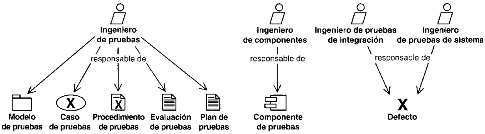

# 11.2. El papel de la prueba en el ciclo de vidadel software

Durante la fase de inicio puede hacerse parte de la planificacion inicial de las pruebas cuando sedefine el ambito del sistema. Sin embargo, las pruebas se llevan a cabo sobre todo cuando unaconstrucci6n (como un resultado de implementacion) es sometida a pruebas de integracion y desistema. Esto quiere decir que la realizacion de pruebas se centra en las fases de elaboracion,cuando se prueba la linea base ejecutable de la arquitectura, y de construccion, cuando el grue-so del sistema esta implementado. Durante la fase de transicion el centro se desplaza hacia lacorreccion de defectos durante los primeros usos y a las pruebas de regresion. Vease Figura 11.2.

Debido a la naturaleza iterativa del esfuerzo de desarrollo, algunos de los casos de pruebaque especifican como probar las primeras construcciones pueden ser utilizadas tambien comocasos de prueba de regresion que especifican como llevar a cabo las pruebas de regresion sobrelas construcciones siguientes. El numero de pruebas de regresion necesarias crece por tanto de

forma estable a lo largo de las iteraciones, lo que significa que las uiltimas iteraciones requeri-ran un gran esfuerzo en pruebas de regresion. Es natural, por tanto, mantener el modelo depruebas a lo largo del ciclo de vida del software completo, aunque el modelo de pruebascambia constantemente debido a:

· La eliminacion de casos de prueba obsoletos (y los correspondientes procedimientos deprueba y componentes de prueba).· El refinamiento de algunos casos de prueba en casos de prueba de regresion.· La creacion de nuevos casos de uso para cada nueva construccion.

# 11.3.  Artefactos

# 11.3.1.  Artefacto: modelo de pruebas

El modelo de pruebas describe principalmente como se prueban los componentes ejecutables(como las construcciones) en el modelo de implementacion con pruebas de integracion y desistema. El modelo de pruebas puede describir tambien como han de ser probados aspectosespecificos del sistema; por ejemplo, si la interfaz de usuario es utilizable y consistente o si el manualpruebas es una coleccion de casos de prueba, procedimientos de prueba y componentes de prueba.

Las siguientes secciones presentan los artefactos en el modelo de pruebas en detalle.Observese que si el modelo de pruebas es grande, es decir, si contiene una gran cantidad decasos de prueba, procedimientos de prueba y componentes de prueba, puede ser itil introducirpaquetes en el modelo para manejar su tamanio. Esta es una extension mas o menos trivial delmodelo de pruebas y no lo tratamos en este capitulo.

# 11.3.2.  Artefacto: caso de prueba

Un caso de prueba especifica una forma de probar el sistema, incluyendo la entrada o resulta-do con la que se ha de probar y las condiciones bajo las que ha de probarse (vease Figura 11.4).

En la practica, lo que se prueba puede venir dado por un requisito o coleccion de requisitos delcara de realizar. Los siguientes son casos de prueba comunes:

· Un caso de prueba que especifica como probar un caso de uso o un escenario especificode un caso de uso. Un caso de prueba de este tipo incluye la verificacion del resultado dela interaccion entre los actores y el sistema, que se satisfacen las precondiciones ypostcondiciones especificadas por el caso de uso y que se sigue la secuencia de accionesuso especifica tipicamente una prueba del sistema como “caja negra", es decir, una prue-ba del comportamiento observable externamente del sistema.

· Un caso de prueba que especifica como probar una realizacion de caso de uso-diseno o unescenario especifico de la realizacion. Un caso de prueba de este tipo puede incluir laverificacion de la interaccion entre los componentes que implementan dicho caso deuso. Observese que los casos de prueba basados en una realizacion de caso de uso tipi-la interaccion interna entre los componentes del sistema.

# Ejemplo

# Caso de prueba

Los ingenieros de pruebas sugieren un conjunto de casos de prueba para probar el caso de usoPagar Factura en el que cada caso de prueba verificara un escenario del caso de uso. Uno de losaloioig eun ap opipad un jod soune ooe ap einioey eun ap obed ja sa soisandoud eqanud ap soseo

Para ser completos, el caso de prueba ha de especificar la entrada, el resultado esperado y otrascondiciones relevantes para la verificacion del escenario del caso de uso.

# Entrada

· Existe un pedido valido de una bicicleta de montana y éste ha sido enviado a un vendedorCrazy Mountaineer, Inc. El precio de la bicicleta es 300 euros, incluyendo gastos de envio.

El precio confirmado de la bicicleta es de 300 euros, incluyendo gastos de envio.

· El comprador ha recibido una factura (ID 12345), la cual se conforma con la confirmacion delpedido de la bicicleta de montana. Esta es la unica factura presente en el sistema. El totalfacturado seria por un total de 300 euros, y la factura deberia estar en el estado Pendiente. Lafactura deberia apuntar a una cuenta 22-222-2222, la cual deberia recibir el dinero. Esta cuen-

· La cuenta 11-111-1111 del comprador tiene un saldo de 350 euros.

# Resuftado

· El saldo de la cuenta 22-222-2222 del vendedor deberia haber aumentado hasta 963.756,00euros.

# Condiciones

· No se permite que otras instancias de casos de uso accedan a las cuentas durante el caso deprueba.

Obsérvese que algunos casos de uso pueden ser parecidos y diferenciarse unicamente en unsolo valor de entrada o resultado. Esto se da a veces para casos de prueba que verifican dife-rentes escenarios del mismo caso de uso. En estos casos, puede ser apropiado especificar loscasos de uso cn forma de tabla, donde cada caso de prueba esta representado por una fila y cadas  ei  o     o   p s p onpuede proporcionar una buena vision general de casos de prueba similares y proporcionar unaentrada utilizable en la creacion de procedimientos de prueba y componentes de prueba (veaseSecciones 11.3.3 y 11.3.4).

Se pueden especificar otros casos de prueba para probar el sistema como un todo. Porejemplo:

· Las pruebas de instalacion verifican que el sistema puede ser instalado en la plataformadel cliente y que el sistema funcionara correctamente cuando sea instalado.

· Las pruebas de configuracion verifican que el sistema funciona correctamente en dife-rentes configuraciones; por ejemplo, en diferentes configuraciones de red.

· Las pruebas negativas intentan provocar que el sistema falle para poder asi revelar susdebilidades. Los ingenieros de pruebas identifican los casos de prueba que intentan uti-lizar el sistema en formas para los que no ha sido diseiado, por ejemplo, utilizandoconfiguraciones de red incorrectas, capacidad de hardware insuficiente o una carga detrabajo "imposible'''.

· Las pruebas de tension o de estres identifican problemas con el sistema cuando hayrecursos insuficientes o cuando hay competencia por los recursos.

Muchos de estos casos de prueba pueden encontrarse considerando los casos de uso delsistema. Damos mas detalles en la Seccion 11.5.2.

# 11.3.3.  Artefacto: procedimiento de prueba

Un procedimiento de prueba especifica como realizar uno a varios casos de prueba o partes deéstos. Por ejemplo, un procedimiento de prueba puede ser una instruccion para un individuo so-bre como ha de realizar un caso de prueba manualmente, o puede ser una especificacion decomo interaccionar manualmente con una herramienta de automatizacion de pruebas paracrear componentes ejecutables de prueba (vease Seccion 11.3.4).

El como llevar a cabo un caso de prueba puede ser especificado por un procedimiento deprueba, pero es a menudo util reutilizar un procedimiento de prueba para varios casos de-nah asnal end op oso un eied eqnd ap soupd sonna ezn A eqnra 11.5).

# Ejemplo Procedimiento de prueba

ebed osn ap oseo je ogeo e aaall onpiapui un anb eied eqanid ap ouawaroid un ehsaoau asla especificacion ya que ya esta especificado en el caso de uso):

Caso de uso: Pagar 300-Bicicleta de Montana

1.9 Seleccione el menu Hojear Facturas de la ventana principal. Se abre la ventana de dialogoConsultar Facturas.2.  En el campo Estado de la Factura, seleccione Pendiente y pulse el boton Consultar. Apa-so el  sose uaa  a s g a sa [tt ail osn3.  Seleccione la factura a pagar especificada pulsando el boton dos veces. Aparece la ventanaDetalles de Factura para la factura seleccionada. Verifique los siguientes detalles:· el Estado es Pendiente;· la Fecha de Pago esta vacia;· el ldentificador de Confirmacion de Pedido coincide con el identificador en el caso de uso[ID 98765];A [souna ooe] eganud ap oseo je ua epeoioadsa el uoo apiouloo eanjpet el ap pepueo el ·g

de dialogo para el Pago de Factura.

5.  Etc. (Se especifica como se lleva a cabo a traves de la interfaz de usuario el camino completosario verificar en las salidas del sistema.)

Observese que este procedimiento de prueba puede ser utilizado para otros casos de uso si-milares en los que se utilizan diferentes valores de entrada y resultado, es decir, los valores en-tre corchetes son diferentes. Observese también que el procedimiento de prueba es similar a ladescripci6n de flujo de eventos del caso de uso Pagar Factura (vease Seccion 7.4.3.1), aunqueel procedimiento de prueba incluye informacion adicional, como los valores de entrada del casode uso a utilizar, la forma en la que estos valores han de ser introducidos en el interfaz de usua-rio y lo que hay que verificar.

# Ejemplo Procedimientos de prueba generales

Cuando los disenadores de pruebas sugieren procedimientos de prueba hacen notar que varios ca-sos de uso (y los casos de prueba para verificarlos) empiezan validando objetos al comienzo del caso

Los disenadores de pruebas sugieren entonces un procedimiento de prueba general denominadoValidar Objetos de Negocio para probar dichas secuencias. El procedimiento de prueba especificaque los objetos a validar deberian en primer lugar ser creados, leyendo los valores que deberian te-ner de un fichero y creandolos entonces en una base de datos. A continuacion el procedimiento deprueba especifica que el objeto activo que valida los objetos de negocio deberia ser invocado;describe en el fichero mencionado.

Los disenadores de pruebas sugieren tambien un procedimiento de prueba denominado VerificarPlanificacion, el cual especifica como probar la planificacion de una factura y despues verifica que laplanificacion de la factura dispara una transferencia bancaria.

# 11.3.4.  Artefacto: componente de prueba

Un componente de prueba automatiza uno o varios procedimientos de prueba o partes deellos (véase Seccion 10.3.2). Véase Figura 11.6.

Los componentes de prueba pueden ser desarrollados utilizando un lenguaje de guiones o un len-s s nd o i p

Los componentes de prueba se utilizan para probar los componentes en el modelo deimplementacion (vease Capitulo 10), proporcionando entradas de prueba, controlando ymonitorizando la ejecucion de los componentes a probar y, posiblemente, informando de losresultados de las pruebas. En inglés, los componentes de prueba son a veces llamados testdrivers, test harnesses [1] y test scripts.

Obscrvese que los componentes de prucba pueden ser implementados usando tecnologia deobjetos. Si varios componentes de prueba tienen interacciones internas complejas o interac-ciones complejas con los componentes ordinarios en el modelo de implementacion puedeutilizarse un “modelo de diseno de pruebas" (similar al modelo de diseno; vease Seccion 9.3.1)para modelar los componentes de prueba y representar vistas de alto nivel de ellos. Aunque

# 11.3.5.  Artefacto: plan de prueba

El plan de prueba describe las estrategias, recursos y planificacion de la prueba. La estrategiael nivel de cobertura de prueba y de codigo necesario y el porcentaje de pruebas que deberianejecutarse con un resultado especifico.

# 11.3.6.  Artefacto: defecto

Un defecto es una anomalia del sistema, como por ejemplo un sintoma de un fallo software 0un problema descubierto en una revision. Un defecto puede ser utilizado para localizar cual-quier cosa que los desarrolladores necesitan registrar como sintoma de un problema en elsistema que ellos necesitan controlar y resolver.

# 11.3.7.  Artefacto: evaluacion de prueba

Una cvaluacion de prueba es una evaluaci6n de los resultados de los esfuerzos de prueba, talescomo la cobertura del caso de prueba, la cobertura de c6digo y el estado de los defectos.

# 11.4.  Trabajadores

# 11.4.1.  Trabajador: disenador de pruebas

Un disenador de pruebas cs responsable de la integridad del modelo de pruebas, asegurandoque el modclo cumple con su proposito. Los disenadores de pruebas tambien planean laslas pruebas. Ademas, los diseniadores de pruebas seleccionan y describen los casos de prueba ylos procedimientos de prueba correspondientes que se necesitan, y son responsables de laevaluacion de las pruebas de integracion y de sistema cuando éstas se ejecutan. Vease Figu-ra 11.7.

Observese que los disenadores de pruebas realmente no llevan a cabo las pruebas, sino quese dedican a la preparacion y evaluacion de las mismas. Otros dos tipos de trabajadores, losingenieros de pruebas de integracion y los ingenieros de pruebas de sistema, son los encargadosde llevarlas a cabo.

# 11.4.2.  Trabajador: ingeniero de componentes

Los ingenieros de componentes son responsables de los componentes de prueba que automa-tizan algunos de los procedimientos de prueba (no todos los procedimientos de prueba puedenser automatizados). Esto es asi porque la creacion de dichos componentes puede necesitar deingeniero de componentes en el flujo de trabajo de la implementacion; vease Seccion 10.4.2).

# 11.4.3.  Trabajador: ingeniero de pruebas de integracion

Los ingenieros de pruebas de integracion son los responsables de realizar las pruebas deimplementacion (vease Seccion 10.5.2). Las pruebas de integracion se realizan para verificarque los componentes integrados en una construccion funcionan correctamente juntos. Poresto, las pruebas de integracion se derivan a menudo de los casos de prueba que especificanEl ingeniero de pruebas de integracion se encarga de documentar los defectos en los resul-tados de las pruebas de integracion.

Observese que un ingeniero de pruebas de integracion prueba el resultado, es decir, unao  o   s    ddividuo o grupo de individuos para minimizar el solapamiento en el conocimiento necesario.

# 11.4.4.  Trabajador: ingeniero de pruebas de sistema

Un ingeniero de pruebas de sistema es responsable de realizar las pruebas de sistema necesariassobre una construccion que muestra el resultado (ejecutable) de una iteracion completa (veaseSeccion 10.5.2). Las pruebas de sistema se llevan a cabo principalmente para verificar las in-teracciones entre los actores y el sistema. Por esto, las pruebas de sistema se derivan a menudode los casos de prueba que especifican como probar los casos de uso, aunque también seaplican otros tipos de pruebas al sistema como un todo (vease Seccion 11.3.2).

El ingeniero de pruebas de sistema se encarga de documentar los defectos en los resultadosde las pruebas de sistema.

Debido a la naturaleza de las pruebas de sistema, los individuos que actuan como ingenie-ros de pruebas de sistema necesitan saber mucho sobre el funcionamiento interno del sistema.Por el contrario, éstos deberian tener familiaridad con el comportamiento observable externa-mente del sistema. Por tanto, algunas pruebas de sistema pueden ser realizadas por otrosmiembros del proyecto, como los especificadores de casos de uso, o incluso por personas ex-ternas al proyecto, como usuarios de versiones beta.

# 11.5. Flujo de trabajo

En las secciones anteriores describimos las pruebas estaticamente. Ahora utilizaremos un dia-grama de actividad (Figura 11.8) para razonar su comportamiento dinamico:

El principal objetivo de la prueba es realizar y evaluar las pruebas como se describe en elmodelo de pruebas. Los ingenieros de pruebas inician esta tarea planificando el esfuerzo deprueba en cada iteracion, y describen entonces los casos de prueba necesarios y los procedi-mientos de prueba correspondientes para llevar a cabo las pruebas. Si es posible, los ingenieross n d d p s s  n  slos procedimientos de prueba. Todo esto se hace para cada construccion entregada como re-sultado del flujo de trabajo de implementacion.

Con estos casos, procedimientos y componentes de prueba como entrada, los ingenieros depruebas de integracion y de sistema prueban cada construccion y detectan cualquier defecto queencuentren en ellos. Los defectos sirven como realimentacion tanto para otros flujos de traba-jo, como el de disenio y el de implementacion, como para los ingenieros de pruebas para queHleven a cabo una evaluacion sistematica de los resultados de las pruebas.

# 11.5.1.  Actividad: planificar prueba

El proposito de la planificacion de la prueba (vease Figura 11.9) es planificar los esfuerzos deprueba en una iteracion llevando a cabo las siguientes tareas:

· Describiendo una estrategia de prueba.

· Estimando los requisitos para el esfuerzo de la prueba, por ejemplo, los recursos humanosy sistemas necesarios.

· Planificando el esfuerzo de la prueba.

Cuando prepara el plan de prueba los ingenieros de prueba se mueven sobre un rango de va-lores de entrada. El modelo de casos de uso y los requisitos adicionales les ayudan a decidirsepor un tipo adecuado de pruebas y a estimar el esfuerzo necesario para llevar a cabo las prue-bas. El disenador de pruebas usara tambien otros artefactos como entrada, como por ejemplo elmodelo de diseno.

Los disenadores de pruebas desarrollan una estrategia de prueba para la iteracion, es decir,deciden que tipo de pruebas ejecutar, como ejecutar dichas pruebas, cuando ejecutarlas ycomo determinar si el esfuerzo de prueba tiene éxito.

# Ejemplo Estrategia de prueba de sistema para la ultima iteracionen la fase de elaboracion

Al menos el 75 por ciento de las pruebas deberian estar automatizadas, y el resto deberia ser ma-nual. Cada caso de uso sera probado para su flujo normal y para tres flujos alternativos.

Criterio de exito: 90 por ciento de los casos de prueba pasados con exito. No hay ningun defectode prioridad media-alta sin resolver.

El desarrollo, realizacion y evaluacion de cada caso de prueba, procedimiento de prueba ycomponente de prueba lleva algun tiempo y cuesta algun dinero. Sin embargo, ningun sistemapuede ser probado completamente; por tanto, deberiamos identificar los casos, procedimientosy componentes de prueba con un mayor retorno a la inversion en terminos de mejora de calidad[3]. El principio general consiste en desarrollar casos y procedimientos de prueba con unsolapamiento minimo para probar los casos de uso mas importantes y probar los requisitos queestan asociados a los riesgos mas altos.

# 11.5.2.  Actividad: disenar prueba

Los propositos de diseniar las pruebas (vease Figura 11.10) son:

· Identificar y describir los casos de prueba para cada construccion.· Identificar y estructurar los procedimientos de prueba especificando como realizar los ca-sos de prueba.

11.5.2.1.  Diseno de los casos de prueba de integracion  Los casos deprueba de integracion se utilizan para verificar que los componentes interaccionan entre si de laforma apropiada despues de haber sido integrados en una construccion (vease Seccion 10.5.2).La mayoria de los casos de prueba de integracion pueden ser derivados de las realizaciones decasos de uso-diseno, ya que las realizaciones de casos de uso describen como interaccionan lasclases y los objetos, y por tanto como interaccionan los componentes.

Los ingenieros de pruebas deberian crear un conjunto de casos de prueba que hicieranposible alcanzar los objetivos establecidos en el plan de prueba con un esfuerzo minimo. Parapoder hacer esto, los diseniadores de pruebas intentan encontrar un conjunto de casos deprueba con un solapamiento minimo, cada uno de los cuales prueba un camino o escenario inte-resante a traves de una realizacion de casos de uso.

Cuando los disenadores de pruebas crean los casos de prueba de integracion considerancomo entrada primeramente los diagramas de interaccion de las realizaciones de casos deuso. Los disenadores de pruebas buscan combinaciones de entrada, salida y estado inicial desistema quc den lugar a escenarios interesantes que empleen las clases (y por tanto los com-ponentes) que participan en los diagramas.

# Ejemplo Caso de prueba de integracion

Los disenadores de pruebas comienzan considerando un diagrama de secuencia que es parte de larealizacion de caso de uso-diseno para el caso de uso Pagar Factura. La Figura 11.11 muestra la pri-mera parte de este diagrama (vease Seccion 9.5.2.2).

Observese que pueden haber varias "secuencias" diferentes en el diagrama de secuencias

Un caso de pruebas que se deriva de un diagrama de secuencia como el mostrado en la Figu-la secuencia.

Mas tarde, cuando se realiza la prueba de integracion correspondiente, tomamos lasinteracciones actuales de objetos en el sistema; por ejemplo, creando trazas de su ejecucion 0ejecutandola paso a paso. A continuaci6n, comparamos las interacciones actuales con eldiagrama de interacciones, las cuales deberian ser iguales; en otro caso se trata de un defecto.11.5.2.2.  Diseno de los casos de prueba de sistema  Las pruebas desistema se usan para probar que el sistema funciona correctamente como un todo. Cada pruebade sistema prueba principalmente combinaciones de casos de uso instanciados bajo condicionesdiferentes. Estas condiciones incluyen diferentes configuraciones hardware (procesadores.memoria principal, discos duros, etc.), diferentes niveles de carga del sistema, diferentesnumeros de actores y diferentes tamanos de la base de datos. Cuando se desarrollan los casos deprueba de sistema los disenadores de pruebas deberian dar prioridad a las combinaciones de loscasos de uso que:

· Se necesita que funcionen en paralelo.

· Posiblemente funcionan en paralelo.

· Posiblemente se influencian mutuamente si se ejecutan en paralelo.

· Involucran varios procesadores.

· Usan frecuentemente recursos del sistema, como procesos, procesadores, bases de datosy software de comunicaciones, quizas en formas complejas e impredecibles.

Pueden encontrarse, por tanto, muchos casos de prueba de sistema considerando los casos deuso, especialmente considerando sus flujos de eventos y sus requisitos especiales (como los re-quisitos de rendimiento).

11.5.2.3.  Diseno de los casos de prueba de regresion  Algunos casos deprueba de construcciones anteriores pueden ser usados para pruebas de regresion ende regresion. Para ser adecuados y contribuir a la calidad del sistema los casos de prueba han deser suficientemente flexibles para ser resistentes a cambios en el software que esta siendoprobado. La flexibilidad requerida en un caso de prueba de regresi6n puede suponer unesfuerzo de desarrollo extra, lo que significa que debemos ser cuidadosos y convertirlos encasos de prueba de regresion unicamente cuando el esfuerzo merezca la pena.

11.5.2.4. Identificaci6n y estructuraci6n de los procedimientos deprueba  Los disenadores de pruebas pueden trabajar caso de prueba a caso de prueba ysugerir procedimientos de prueba para cada uno. Intentamos reutilizar procedimientos de pruebaexistentes tanto como sea posible, lo que significa que podemos necesitar modificarlos de formaque puedan usarse para especificar como realizar un caso de prueba nuevo o cambiado. Los di-senadores de pruebas tambien intentan crear procedimientos de prueba que puedan ser reuti-lizados en varios casos de prueba. Esto permite a los disenadores de pruebas usar un conjuntoreducido de procedimientos de prueba con rapidez y precision para muchos casos de prueba.

Ya que los casos de prueba estan basados en casos de uso o en realizaciones de casos de uso,la mayoria de los casos de prueba probaran varias clases de varios subsistemas de servicios.pero cada procedimiento de prueba deberia, si fuera posible, especificar como probar clases deun unico subsistema de servicios; sin embargo, varios procedimientos de prueba puedenespecificar como probar un subsistema de servicios. Cada caso de prueba precisara variosprocedimientos de prueba, quizas uno por cada subsistema de servicios probado en el caso depruebas. Relacionando de esta forma los procedimientos de prueba con los subsistemas deservicios los procedimientos de prueba serian mas faciles de mantener. Cuando se cambia unsubsistema dc servicios los efectos del cambio que tienen que ver con los procedimientos deprueba pueden entonces estar limitados a los procedimientos de prueba usados para verificar elsubsistema de servicios, y no se veria afectado ningun otro procedimiento de prueba.

# Ejemplo Procedimiento de prueba

El subsistema de servicios Cuentas proporciona funcionalidad para mover dinero entre cuentas.Esta funcionalidad esta involucrada en varias realizaciones de caso de uso, como las de PagarFactura y Transferencia entre Cuentas. Un procedimiento de prueba llamado Verificar Transfe-rencia entre Cuentas especificara como probar el movimiento de dinero entre cuentas. El proce-de entrada dos identidades de cuentas y una cantidad a transferir y valida la transferenciapreguntando por el saldo de las dos cuentas involucradas antes de transferir y después de la trans-ferencia.

Los disenadores de pruebas crean 8 casos de prueba para el caso de uso Pagar Factura y 14casos de uso para el caso de uso Transferencia entre Cuentas. El procedimiento de prueba Ve-rificar Transferencia entre Cuentas especifica como se realizan (parte de) todos esos casos deprueba.

# 11.5.3.  Actividad: implementar prueba

El proposito de la implementacion de las pruebas es automatizar los procedimientos de pruebacreando componentes de prueba si esto es posible, pues no todos los procedimientos de pruebapueden ser automatizados; vease Figura 11.12.

Los componentes de prueba se crean usando los procedimientos de prueba como entrada:· Cuando usamos una herramienta de automatizacion de pruebas realizamos o especifica-mos las acciones como se describe en los procedimientos de prueba. Estas acciones sonentonces grabadas dando como salida un componente de prueba; por ejemplo, generandoun scripi de prueba en Visual Basic.

· Cuando programamos los componentes de prueba explicitamente usamos Jos procedi-mientos de prueba como especificaciones iniciales. Observese que dicho esfuerzo deprogramacion podria requerir personal con buenas habilidades como programador.

Los componentes de prueba usan a menudo grandes cantidades de datos de entrada para serprobados y produccn grandes cantidades de datos de salida como resultado de las pruebas. Estitil poder visualizar estos datos de forma clara e intuitiva de manera que puedan especificarsecorrectamente y los resultados de las pruebas puedan ser interprctados. Utilizamos para ellohojas de calculo y bases de datos.

# 11.5.4.  Actividad: realizar pruebas de integracion

En esta actividad se realizan (véase Seccion 10.5.2) las pruebas de integracion (vease Sec-cion 11.5.2.1) necesarias para cada una de las construcciones creadas en una iteracion y serecopilan los resultados de las pruebas. Véase Figura 11.13. 1

Las pruebas de integracion se llevan a cabo en los siguientes pasos:

1.  Realizar las pruebas de integracion relevantes a la construccion realizando los proce-dimientos de prueba manualmente para cada caso de prueba o ejccutando cualquiercomponente de prueba que automatice los procedimientos de prueba.

2.  Comparar los resultados de las pruebas con los resultados esperados e investigar los re-sultados de las prucbas que no coinciden con los esperados.

3. Informar de los defectos a los ingenieros de componentes responsables de los compo-nentes que se cree contienen los fallos.

4. Informar de los defectos a los disenadores de pruebas, quienes usaran los defectos paraevaluar los resultados del esfuerzo de prueba (como se describe en la Seccion 11.5.6).

# 11.5.5.  Actividad: realizar prueba de sistema

El proposito de la prueba de sistema es el realizar las pruebas de sistema (vease Sec-cion 1i.5.1.2) necesarias en cada iteracion y el recopilar los resultados de las pruebas (veaseFigura 11.14).

La prucba de sistema puede empezar cuando las pruebas de integracion indican que elsistema satisface los objetivos de calidad de integracion fijados en el plan de prueba de laiteraci6n actual; por ejemplo, el 95 por ciento de los casos de prueba de integracion se ejecutancon el resultado esperado.

La prueba de sistema se realiza de forma analoga a la forma en que se realiza la prueba deintegraci6n (vease Seccion 11.5.4).

# 11.5.6. Actividad: evaluar prueba

El proposito de la evaluacion de la prueba es el de evaluar los esfuerzos de prueba en una ite-racion (vease Figura 11.15).

Los disenadores de pruebas evaluan los resultados de la prueba comparando los resultadosobtenidos con los objetivos esbozados en el plan de prueba. Estos preparan metricas que lespermiten determinar el nivel de calidad del software y qué cantidad de pruebas es necesariohacer.

En concreto, el ingeniero de pruebas observa dos metricas:

· Complecion de la prueba, obtenida a partir de la cobertura de los casos de prueba y de lacobertura de los componentes probados. Esta metrica indica el porcentaje de casos deprueba que han sido ejecutados y el porcentaje de codigo que ha sido probado.

· Fiabilidad, la cual se basa en el analisis de las tendencias en los defectos detectados y enlas tendencias en las pruebas que se ejecutan con el resultado esperado.

Para determinar la fiabilidad del sistema, los disenadores de pruebas crean diagramas de lastendencias de los defectos, donde representan la distribuci6n de tipos especificos de defectos(como defectos nuevos o fatales) a lo largo del tiempo. La prueba puede crear tambien dia-gramas de tendencias que representan el porcentaje de pruebas ejecutadas con éxito (es decir,ejecuciones de pruebas que generan los resultados esperados) a lo largo del tiempo.

Las tendencias de los defectos siguen a menudo patrones que se repiten en varios proyectos.Por ejemplo, normalmente el numero de defectos nuevos generados cuando se prueba unmantiene estable durante un tiempo y finalmente empieza a caer lentamente. Por tanto, com-parando la tendencia actual con tendencias similares en proyectos anteriores es posible prede-cir el esfuerzo necesario para alcanzar un nivel de calidad aceptable.

Basandose en el analisis de la tendencia de los defectos los disenadores de pruebas puedensugerir otras acciones, como por ejemplo:

· Realizar pruebas adicionales para localizar mas defectos, si la fiabilidad medida sugiereque el sistema no esta suficientemente maduro.· Relajar el criterio para las pruebas, si los objetivos de calidad para la iteracion actual sepusieron demasiado altos.· Aislar las partes del sistema que parecen tener una calidad aceptable y entregarlas comoresultado de la iteracion actual. Las partes que no cumplieron los criterios de calidad hande ser revisados y probadas de nuevo.

Los disenadores de pruebas documentan la complecion de la prueba, su fiabilidad y sugie-ren acciones en una descripcion de la evaluacion de la prueba.

# 11.6.  Resumen de la prueba

bado el sistema. El modelo de prueba incluye: El resultado principal de la prueba es el modelo de prueba, el cual describe como ha sido pro-· Casos de prueba, que especifican que probar en el sistema.· Procedimientos de prueba, que especifican como realizar los casos de prueba.· Componentes de prueba, que automatizan los procedimientos de prueba.

La prueba da tambien como resultado un plan de prueba, evaluaciones de las pruebas rea.lizadas y los defectos que pueden ser pasados como entrada a flujos de trabajo anteriores, comoel diseno y la implementacion.

# 11.7.  Referencias

[1]  IEEE, Std 610.12-1990.

[2] Bill Hetzel, The Conplete Guide to Soffware Testing, Second Edition, Wellesley, MA:QED Information Sciences, Inc., 1988.

# ParteIll

n sistema software pasa por varios ciclos de desarrollo a lo largo de su tiempo dcvida. Cada uno de estos ciclos da como resultado una nueva entrega del producto aclientes y usuarios, pudiendo ser la primera de estas entregas, muy probablemente, lamas dificil. En esta primera entrega residen los cimientos, la arquitectura del sistema, y en ellase explora un area nueva que puede encerrar serios riesgos. Un ciclo de desarrollo tiene portanto un contenido diferente dependiendo del lugar en que se encuentra el sistema en el ciclode vida del software. Un cambio serio en la arquitectura puede suponer mas trabajo cn lasfases iniciales en entregas posteriores; sin embargo, si la arquitectura original se puedeextender, cn la mayoria de las entregas posteriores el nuevo proyecto simplemente construiriasobre lo que ya cstaba hecho, es decir, una entrega del producto se construira sobre la entregaantcrior.

Cada vez mas gente adopta la idea de trabajar en los problemas lo mas pronto posible den-tro de cada ciclo de desarrollo. Aplican el termino iteracion para referirse a las secuencias deresoluciones de problemas en las fases de inicio y de elaboracion, ademas de a cada serie deconstrucciones en la fase de construccion.

Los riesgos no vienen en un paquete cstupendo con una tarjeta de identificacion plegadabajo un lazo rosa. Han de ser identificados, delimitados, monitorizados y eliminados —-y es im-portante atajar los riesgos mas importantes primero—. De forma similar, ha de pensarse cui-dadosamente el orden en el que tienen lugar las iteraciones, de forma que los problemas mas se-rios se resuelvan primero. Abreviando: haz el trabajo duro primero.

En la Parte II describimos por separado cada flujo de trabajo. Por ejemplo, la Figura 6.2 des-cribia donde se centra el flujo de trabajo de los requisitos a lo largo de las diferentes fases; deforma similar la Figura 8.2 hacia lo mismo para el analisis, la Figura 9.2 para el diseno, laFigura 10.2 para la implementacion y la Figura 11.2 para la prueba.

En esta parte mostramos como se combinan de diversas formas los flujos de trabajo,dependiendo del lugar del ciclo de vida en el que estamos. Describimos primero, en el Capitu-y sel sepon ue uaoade anb seso sei 'moap sa sasey sel sepon e uuoo sa anb ol '71 olcomo la planificaci6n de una iteracion, el establecimiento de los criterios de cvaluacion parauna iteracion, el establecimiento de una lista de riesgos, la asignacion de prioridades a los ca-sos de uso y la evaluacion de las iteraciones. Cada uno de los capitulos sucesivos se centra encada una de las fases.

En la fase de inicio (Capitulo 13) la actividad se concentra en el primer flujo de trabajo, elde los requisitos, realizandose poco trabajo en los flujos de trabajo segundo y tercero (analisisy diseno). Esta fase raramente realiza ningun trabajo en los dos iltimos flujos de trabajo, la im-plementacion y la prueba.

En la fase de elaboracion (Capitulo 14), mientras todavia hay una gran actividad dedicada acompletar los requisitos, los flujos de trabajo segundo y tercero, analisis y discno, reciben unalinea base ejecutable de la arquitectura hay necesariamcnte alguna actividad en los flujos de trabajo finales, la implementacion y la prueba.

analisis se aligera y los tres ultimos flujos de trabajo representan el grueso de la actividad.

En la fase de transicion (Capitulo 16) la actividad de los distintos flujos de trabajo dependede los resultados de las pruebas de aceptacion y de las versiones beta del sistema. Por ejemplo,si las pruebas de las versiones beta descubren algun defecto en la implementacion habra unaactividad considerable en los reanimados flujos de implementacion y prueba.

El capitulo final, el Capitulo 17, vuelve al tema central del libro; en un unico capitulomostramos como los diversos apartados -flujos de trabajo, fases e iteraciones- interaccionanpara dar lugar a un proceso bien disenado para utilizar en el proceso de desarrollo de softwarede sistemas criticos. Este capitulo también dedica unos cuantos parrafos a explicar comodeberian administrarse estas relaciones y a como puede ser realizada la transicion hacia elProceso Unificado en una organizacion que no lo utiliza.

# El flujo de trabajode iteracion generico

lo 5. La intencion de este capitulo es destilar el patron comun que caracteriza a In este capitulo volvemos a la idea de la iteracion genérica discutida en el Capitu-Itodas las iteraciones a partir de las distintas iteraciones que ocurren durante las cuatrofases.

Utilizamos este patron generico como base sobre la que construir las iteraciones concretas;cl contenido de una iteracion cambia para acomodarse a los objetivos particulares de cada fase(vease Figura 12.1).

analisis, diseno, implementacion y prueba. Este también incluye la planificacion, que precedea los flujos de trabajo, y la evaluacion, que va detras de ellos (los Capitulos 6-11 describen cadauno de los flujos de trabajo por separado). En este capitulo nos centraremos en la planificacion, en la evaluacion y en otras actividades comunes a todos los flujos de trabajo.

La planificacion es necesaria a lo largo de todo el ciclo de desarrollo, pero antes de que po-fundamentales proporcionan un punto de partida. Otro aspecto clave de la planificacion es laadministracion de riesgos, es decir, la identificacion y mitigaci6n de riesgos realizando elcorrespondiente conjunto de casos de uso. Por supuesto, un plan no estara completo sin la

cstimacion de recursos que este requerira y, por iltimo, tambien llevarse a cabo la cvaluaci6nde la ejecucion de cada iteracion y fase.

# 12.1.  La necesidad de equilibrio

En cada uno de los momentos en el ciclo de vida de un proyecto de desarrollo software estanactivas muchas secuencias de actividades diferentes: trabajamos en nuevas funciones, disena-mos la arquitectura, recibimos comentarios de los usuarios, mitigamos riesgos, planificamos elfuturo, ctc. Debemos equilibrar y sincronizar en todo momento estas secuencias de actividadesdiferentes para controlar asi esta complejidad.

Los desarrolladores dividen el trabajo. que es abrumadoramentc complejo como un todo, enpartes mas pequenas y comprensibles. A lo largo del ciclo de vida de desarrollo dividen el tra-bajo en fases, y cada una de estas fases en iteraciones, como se esbozo en la Parte I.

Dentro de cada iteracion el proyecto se esfuerza en alcanzar un equilibrio entre lassecuencias de actividad que se ejecutan a lo largo de la iteracion, lo que significa que de-trabajar en cada momento dependen del punto del ciclo de vida en que nos encontramos; latarea de un proyecto es seleccionar las cosas correctas en las que trabajar en cada secuencia deactividad. Determinar el equilibrio de las secuencias de actividades es tambien importante paraasegurar que son de una importancia parecida, de forma que pueda asignarseles una prioridady sincronizarlas con facilidad. Fallar en la consecucion de este tipo de equilibrio y ejecucioneficiente se traduce en general en el desastre de muchos ciclos de vida de desarrollo incre-mentales e iterativos.

En las primeras iteraciones trabajamos con riesgos criticos, casos de uso fundamentales,cuestiones arquitectonicas, la eleccion del entorno de desarrollo, todas las cuestiones orientadasa la investigacion, mientras que en las iltimas iteraciones trabajamos en actividades orientadasal desarrollo, como la implementacion y la prueba, problemas de evaluacion del rendimiento yel despliegue del sistema. El relacionar todas estas actividades entre si es una cuestion de equi-librio bastante delicada, lo que hace que el desarrollo de software sea una tarea extraordina-riamente dificil.

Lo que hacemos en una iteracion es entender estas secuencias de actividades diferentes ybuscar el equilibrio entre ellas. En el Proceso Unificado algunas de estas secuencias de activi-dades han sido identificadas y descritas en los flujos de trabajo fundamentales. Hay otrassecuencias que no hemos identificado formalmente, pero que perfectamente podrian ser trata-das de la misma forma que los flujos de trabajo. Por ejemplo:

· La interaccion con clientes en requisitos nuevos.· La preparacion de una ofcrta para los clientes.· La comprension del contexto de un sistema creando un modelo de negocio.· La planificacion y administracion de un proyecto.· El establecimiento y administracion de un entorno de dcsarrollo, es decir, el proceso y lasherramientas.· La administracion de riesgos.· La instalacion de un producto en su lugar dc destino.

# 12.2.  Las fases son la primera division del trabajo

El primer paso hacia la division del proceso de desarrollo de software consiste en separar laspartes en cuatro fases atendiendo al momento en que se realizan: inicio, elaboracion, cons-truccion y transicion. Cada una de las fases se divide entonces cn una o mas iteraciones. Estecapitulo esboza la naturaleza general de estas fases e iteraciones y los cuatro capitulos proximosconsideran cada una de las fases en detalle.

# 12.2.1.  La fase de inicio establece la viabilidad

El objetivo principal de esta fase es establccer el analisis de negocio —el analisis para decidirsi se sigue adelante con el proyecto—, aunque este analisis se seguira desarrollando en la fasede elaboracion conforme se vaya disponiendo de mas informacion. La fase de inicio no es unuso necesarios para fundamentar el analisis de negocio inicial. Para realizar este analisisseguimos cuatro pasos:

1. Delimitar el ambito del sistema propuesto, es decir, definir los limites del sistema yempezar a identificar las interfaces con sistemas relacionados que estan fuera de loslimites.

2.1  Describir o esbozar una propuesta de la arquitectura del sistema, y en especial deaquellas partes del sistema que son nuevas, arriesgadas o dificiles. En este paso solollegamos hasta una descripcion de la arquitectura, raramente hasta un prototipo ejecu-table; esta descripcion de la arquitectura consiste en unas primeras versiones de losmodelos. El principal objetivo es hacer creible el que se pueda crear una arquitecturaestable del sistema en la siguiente fase. Esta arquitectura no es construida en esta fase,arquitectura es el producto mas importante de la fase de elaboracion.

3.1 Identificar riesgos criticos, es decir, los que afectan a la capacidad de construir el sis-tema, y determinar si podemos encontrar una forma de mitigarlos, quizas en una etapaposterior. En esta fase consideramos s6lo los riesgos que afectan la viabilidad, es decir,aquellos que amenazan el desarrollo con éxito del sistema. Cualquier riesgo no criticoque se identifique es colocado en la lista de riesgos para su posterior consideracion de-tallada en la fase siguiente.

4.1  Demostrar a usuarios o clientes potenciales que el sistema propuesto es capaz de sol-En la fase de inicio podemos construir un prototipo para mostrar una solucion alproblema de los clientes o usuarios potenciales, el cual demuestra las ideas basicas delnuevo sistema haciendo énfasis en su uso -interfaces de usuario o algun algoritmonuevo interesante—. Este prototipo tiende a ser exploratorio, es decir, que demuestraeoe anb ous peu oonpod e sani ep ou anb apand anb ord uoionos alqisod eundescartandose. Por el contrario, un prototipo arquitectonico, desarrollado en la fase deelaboracion, suele ser capaz de evolucionar, es decir, un prototipo capaz de adaptarsesufriendo modificaciones en la etapa siguiente.

Continuamos con estos esfuerzos hasta el momento en que desarrollar el sistema parece serrentable economicamente, es decir, hasta que se concluye que el sistema proporcionara ingre-sos u otros beneficios proporcionales a la inversion necesaria con un margen suficiente paraconstruirlo. En otras palabras, hemos realizado una primcra version del analisis de negocio, elcual sera refinado en la fase siguiente, la de elaboracion.

La intencion es minimizar los gastos en tiempo de planificacion, esfuerzo y fondos enesta fase hasta que decidamos si el sistema es viable o no. En el caso de un sistema completaesfuerzo considerables y puede extenderse a varias iteraciones. En el caso de un sistema bienconocido en un dominio establecido o en el caso de tratarse de la extension de un sistema a unanueva version, los riesgos y casos desconocidos pueden ser minimos, permitiendo que cstaprimera fase se complete en pocos dias.

# 12.2.2.  La fase de elaboracion se centraen la factibilidad

El resultado principal de la fase de elaboracion es una arquitectura estable para guiar cl sistemaa lo largo de su vida futura. Esta fase tambien lleva el estudio del sistema propuesto al punto deplanificar la fase de construccion con gran precision. Con estos dos grandes objetivos — -Iaarquitectura y la estimacion de costes con gran precision— el equipo hace lo siguiente:

1. Crea una linea base para la arquitectura que cubre la funcionalidad del sistema signifi-cativa arquitectonicamente y las caracteristicas importantes para las personas involu-cradas como se describe en el Capitulo 4. Esta linea base consiste en los artefactos deésta. Esta linea base no solo demuestra que podemos construir una arquitectura estable,sino que encierra a la arquitectura.

2.  Identifica los riesgos significativos, es decir, los riesgos que podrian perturbar losplanes, costes y planificaciones de fases posteriores, y los reduce a actividades quepueden ser medidas y presupuestadas.

3. Especifica los niveles a alcanzar por los atributos de calidad, como la fiabilidad (por-centajes de defectos) y los tiempos de respuesta

4. Recopila casos de uso para aproximadamente el 80 por ciento de los requisitos funcio-nales, suficiente para planificar la fase de construccion. (Clarificaremos lo que quere-mos decir con el 80 por ciento mas tarde en este capitulo.)

5.  Prepara una propuesta de la planificacion cubierta, personal necesario y coste dentro delos limites establecidos por las practicas de negocio.

Los requisitos y la arquitectura (en el analisis, el diseno y la implementacion) representan elgrueso del esfuerzo en las fases de inicio y de elaboracion.

# 12.2.3.  La fase de construccion construye el sistema

El objetivo general de la fase de construccion viene indicado por su tarea fundamental: lacapacidad de operaci6n inicial. Es decir, un producto listo para ser distribuido como versi6nbeta y ser sometido a pruebas. Esta fase emplea mas personal a lo largo de un periodo de tiem-so sopoi sui aueodu uen sa anb of lod oisa sod so A 'asy eno eunluu anb oei sr oddetalles importantes bien preparados antes de empezar con la construccion. Generalmenteesta fase requiere un mayor numero de iteraciones que las fases anteriores.

En muchos casos el tener un trabajo de requisitos, analisis y diseno pobre parece implicarque la construccion lleve una cantidad de tiempo demasiado grande. En estos casos los desa-para que sc satisfagan los requisitos y para eliminar los defectos (bugs). Una de las grandesventajas de construir software utilizando un enfoque que use multiples fases y un desarrolloiterativo e incremental es que nos permite equilibrar la asignacion de recursos y de tiempo a lolargo del ciclo de vida (vease Seccion 12.1).

Entre las actividades de la fase de construccion tenemos:

1. La extension de la identificacion, descripcion y realizacion de casos de uso a todos loscasos de uso.

2. La finalizacion del analisis (posiblemente quedan todavia mas de la mitad de los casosde uso por ser analizados cuando comienza la fase de construccion), del diseno, de laimplementacion y de la prueba (posiblemente queda un 90 por ciento).

3. El mantenimiento de la integridad de la arquitectura, modificandola cuando sea necesario4. La monitorizacion de los riesgos criticos y significativos arrastrados desde las dosprimeras fases, y su mitigacion si se materializan.

# 12.2.4.  La fase de transicion se mete dentrodel entorno del usuario

La fase de transicion comienza a menudo con la entrega de una version beta del sistema, esdecir, la organizacion distribuye un producto software capaz ya de un funcionamiento inicial auna muestra representativa de la comunidad de usuarios. El funcionamiento del producto en elentorno de los usuarios es frecuentemente una prueba del estado de desarrollo del producto massevera que el funcionamicnto en el entorno del que lo desarrolla

Entre las actividades de la transicion se incluyen:

· Preparar las actividades, como la preparacion del lugar.

· Aconsejar al cliente sobre la actualizacion del entorno (hardware, sistemas opcrativos,protocolos de comunicaciones, etc.) cn los que se supone que el softwarc va a funcionar.· Preparar los manualesy otros documentos para la entrega del producto. En la fase deconstruccion se prepara una documentacion preliminar para los usuarios de las versionesbeta.

· Ajustar el software para quc funcione con los parametros actuales del entorno del usuario.

· Corregir los defectos encontrados a lo largo de las pruebas realizadas a la version beta.

· Modificar el software al detectar problemas que no habian sido previstos.

La fasc de transicion termina con la entrega del producto final. Sin embargo, antes de que elequipo del proyecto abandone cl proyecto, los lideres del equipo levan a cabo un estudio delsistema con los siguientes objetivos:

· Encontrar, discutir, evaluar y registrar las “lecciones aprendidas” para referencias futuras.

# 12.3.  La iteracion generica

Nosotros distinguimos entre los flujos de trabajo fundamentales y los flujos de trabajo iterati-vos. Los flujos de trabajo fundamentales —requisitos, analisis, diseno, implementacion yprueba— se describen en los Capitulos 6-11. En el Proceso Unificado estos flujos de trabajofundamentales no ocurren solo una vez, como sucede teoricamente en el modelo en cascada,sino que se repiten mas bien en cada iteracion, una y otra vez, como flujos de trabajo iterativos.En cada repeticion, sin embargo, se diferencian en los detalles, se enfrentan a los asuntos cen-trales de cada iteracion.

# 12.3.1.  Los flujos de trabajo fundamentalesse repiten en cada iteracion

La iteracion generica consiste en los cincos flujos de trabajo: requisitos, analisis, diseno, im-plementacion y prueba, e incluye también planificacion y evaluacion. Vease Figura 12.2.

En las Secciones 12.4-12.7 discutimos la planificacion que precede a la iteracion y en laSeccion 12.8 la evaluaci6n de cada iteracion. A continuacion, en los Capitulos 13-16, mostra-s p    o p so o so   o p a s

# 12.3.2. Los trabajadores participanen los flujos de trabajo

A veces nos hemos referido al desarrollo de software como un proceso “complejo". La Figura12.3, sin embargo, proporciona una vision general simplificada del proceso; aunque ésta distamucho de ser simple y, como es bien sabido, la realidad es todavia mucho mas complicada. Eneste capitulo no vamos a describir en detalle como produce cada trabajador los artefactos de losque él o ella es responsable, ni siquiera cuales son estos artefactos. Las pequenas ruedasdentadas en la figura representan ese trabajo y las flechas entre estas actividades representan lasrelaciones temporales. Véase los Capitulos 6-11 para obtener estos detalles.

A pesar de esto, la Figura l2.3 nos da una impresion de que se realiza dentro de cada itera-ci6n. Por ejemplo, empezando en la esquina superior izquierda, un analista de sistemasidentifica los casos de uso y los actores y los estructura dentro de un modelo de casos de uso. Acontinuacion, un especificador de casos de uso detalla cada uno de los casos de uso y undisenador de interfaces de usuario construye un prototipo de los interfaces de usuario. Elarquitecto asigna prioridades a los casos de uso a ser desarrollados dentro de las iteracionesteniendo en cuenta los riesgos.

Puede verse que las actividades particulares realizadas dentro del “circulo" de los requisitospodrian variar dependiendo de la posicion de la iteraci6n dentro del proceso de desarrollocompleto. En la fase de inicio, por ejemplo, los trabajadores se limitan a detallar y asignarflujos de trabajo se suceden a lo largo del tiempo, aunque pueda darse algun solapamiento. Lostres trabajadores involucrados en el analisis continuan con su trabajo en el flujo de diseno

![Figura 12.3.  Los nombres de los trabajadores estan colocados en los margencs izquierdo y derecho,identificando las *"calles". El tiempo avanza de izquierda a derecha. Los flujos de trabajo, incluyendo lostrabajadores y las actividades que realizan, estan representados por los *circulos" de trazo libre. El ingeniero.de componentes, por ejemplo. disenia una clase y un subsistema en el flujo de diseno, implementa una clasey un subsistema y realiza una prucba de unidad en el flujo de implementacion.](images/e33e39d067e55cc74602a6099f1d83845ee8d6cd7554fb2ca5421b1c5fd580b9.png)

La prueba, sin embargo, comienza muy pronto, cuando el ingenicro de pruebas planifica loque hay que hacer. Tan pronto como hay disponibles detalles suficientes en el flujo de imple-mentacion, el ingeniero de pruebas disena las pruebas. Conforme son integrados los compo-nentes que han pasado las prucbas de unidad, los ingenieros de pruebas de sistema y los deintegracion prueban los resultados de varios niveles de integracion. El ingeniero de pruebasevalua si la prueba que habia solicitado ha sido adecuada o no.

En los capitulos siguientes anadiremos sobre la Figura 12.3 lo que necesitemos para repre-sentar los flujos de trabajo de iteracion en cada fase. Todos estos flujos de trabajo siguen elpatron de esta figura generica, aunque ya que el foco cambia en las diferentes fases los flujos detrabajo de iteracion correspondientes tendran un grado distinto.

# 12.4. El planificar precede al hacer

Cuando comenzamos la fase de inicio sabemos tres cosas:

· Vamos a llevar a cabo el proyecto en una serie de iteraciones en cuatro fases.· Tenemos la informacion sobre el sistema propuesto que nuestros predecesores recopilaron(y que llevaron a comenzar un proyecto).

· Tenemos nuestra propia informacion basica sobre el dominio y sobre sistemas similares enlos que trabajamos en el pasado.

Partiendo de csta informacion hemos de planear el proyecto (plan de proyecto) y cadaiteracion (plan de iteraci6n). Al principio, con informacion limitada con la que trabajar, ambosplanes contienen poco detalle, pero conforme trabajamos en las fases de inicio y de elaboracionlos planes llegan a estar mas detallados.

a  a s  a ss  d oo ss i diteracion. En la Secci6n 12.5 discutimos como afectan los riesgos al plan y en la Seccion 12.6c6mo mitigamos estos riesgos seleccionando los casos de uso correctos. Por uiltimo, discutimosla localizaci6n de recursos en la Seccion 12.7.

# 12.4.1.  Planear las cuatro fases

Gracias a las indicaciones del Proceso Unificado sabemos que hay que hacer en cada una de lasfases. Nuestra tarea, en el plan del proyecto, es reducir estas indicaciones a terminos concretos:cada fase ha de haber sido completada. Estos tiempos, aunque establecidos con precision,pueden ser bastante inestables al principio de la fase de inicio, pero se iran fijandoconforme vayamos aprendiendo mas. Despues de todo no es hasta el final de la fase deelaboracion cuando hacemos una propuesta firme.· Hitos principales. Una fase termina cuando ha sido alcanzado el criterio actual. Al prin-cipio cstos criterios pueden ser poco mas que creencias basadas en alguna informacion,informacion que puede venir de nucstra experiencia pasada en el dominio, de las simi-litudes del sistema propuesto con sistemas anteriores, de las especificaciones delrendimiento que se pretende que el nuevo sistema alcance y de la capacidad de nuestraorganizacion de desarrollo de software.· Iteraciones por fase. Dentro de cada fase el trabajo se lleva a cabo a lo largo de variasiteraciones. El caracter de cada itcracion esta contenido en el plan de proyecto.planificacion, las fechas y criterios de los objetivos principales y la division de las fases eniteraciones.

Uno puede esperar que la primera iteracion en la fase de inicio sea dificil, ya que ademas dela iteracion misma uno ha de cubrir lo siguiente:

· Ajustar el Proccso Unificado al proyecto y seleccionar herramientas para automatizar elproceso.· Empezar a reunir a gente con el talento necesario para el proyecto.· Crear las relaciones que dan lugar a un equipo efectivo.· Entender el dominio, que a menudo es desconocido para el equipo.· Percibir la naturaleza del proyecto, que sera mas dificil si se trata de un desarrollo nuevoque si se trata de la extension de un producto ya existente.· Familiarizar al equipo con las herramientas apropiadas para el proceso y el proyecto.

# 12.4.2. Plan de iteraciones

Cada fase esta formada por una o mas iteraciones. La planificacion de las iteraciones pasa porun conjunto de pasos comparables con los seguidos en la planificacion de las fases:

· Planificacion de iteracion. Decidimos cuanto tiempo puede requerir cada iteracion y sus  z  ss  o s  od  i  nconforme aprendemos.

· Contenido de iteracion. Mientras que el plan del proyecto esboza las iteraciones planeadasen terminos generales, cuando la fecha de comienzo de una iteracion se acerca, planeamoslo que ha de hacerse mas en detalle. El contenido de una iteracion se basa en lo siguienteLos casos de uso que tienen que ser completados al menos parcialmente durante laiteracion,

— Los riesgos tecnicos que han de ser identificados, transformados en casos de uso ymitigados en ese momento.

- Los cambios que han sufrido los requisitos o los defectos que pueden haber sidocorregidos.

Los subsistemas que han de ser implementados parcial o completamente. Este puntovaria dependiendo de la fase en que se considere. Por ejemplo, en la fase de elabo.racion identificamos la mayoria de los subsistemas y todas las clases significativasarquitectonicamente; en cambio, en la fase de construccion completamos los subsis.temas con mas comportamiento, resultando en componentes mas completos.

El plan de la iteracion actual esta completamente detallado, y el de la siguiente va siendomas detallado conforme vamos aprendiendo. Los detalles de iteraciones posteriores puedenestar limitados por el conocimiento disponible en ese momento:

· Hitos secundarios (Apendice C). El alcanzar los criterios preestablecidos (preferible-mente en la fecha planeada) marca la complecion de la iteracion actual.

· Plan de iteracion (Apendice C). Las actividades de cada iteracion son recopiladas en undetallado plan de iteracion. Al comienzo de cada iteracion identificamos los individuosdisponibles para actuar como trabajadores.

El numero de iteraciones planeado para cada fasc depende, basicamente, de la complejidaddel sistema propuesto. Un proyecto muy simple podria ser realizado con una sola iteracion porfase, mientras que un proyecto mas complicado podria requerir mas iteraciones. Por ejemplo:· Fase de inicio (Apendice C): una iteracion, principalmente dedicada a definir el ambitodel sistema.

· Fase de elaboracion (Apendice C): dos iteraciones, la primera para esbozar la arquitec-tura y la segunda para completar la linea base de la arquitectura.

· Fase de construccion (Apendice C): dos iteraciones, para asegurar que los incrementosresultantes funcionan satisfactoriamente.

· Fase de transicion (Apendice C): una iteracion

consideraciones nuevas podemos esperar que el tamano de la organizacion del desarrollovaya creciendo. Habra mas iteraciones y sus duraciones variaran, dependiendo del tamano delsistema, entre una semana y tres meses por cada iteracion.

# 12.4.3.  Pensar a largo plazo

Durante el largo periodo de tiempo que el sistema puede durar, éste puede presenciar grandescambios, como nuevas tecnologias, nuevas interfaces con el entorno del sistema o plataformasavanzadas. Ademas, los planificadores deberian examinar si el negocio necesitaria ser adapta-do a otras organizaciones, como filiales o socios resultantes de fusiones. Sin embargo, no sedebe llegar al absurdo especulando con el futuro. Uno no quiere construir una arquitecturarigida para el sistema si es posible prevcr que ésta cambiara en el futuro, pero tampoco queremos introducir una flexibilidad innecesaria en el sistema, es decir, una flexibilidad que no serautilizada nunca.

# 12.4.4.  Planear los criterios de evaluacion

Las iteraciones son cortas comparadas con los proyectos tradicionales. Para quc no queden in-definidas los lideres del proyecto, ademas de establecer una planificacion, han de esbozar losobjetivos clave de cada iteracion. Para completar los objetivos, éstos establecen criteriosquc indican la complecion de la iteracion. Estos criterios, como el conjunto de caracteristicasminimo en un momento determinado, nos permiten centrarnos en una iteracion y nos ayudana fijarnos en lo temporalmente cercano. Los siguientes son ejemplos de criterios de este:odn

· Requisitos funcionales expresados en forma de casos de uso.

· Requisitos no funcionales que acompanan a los casos de uso a los que se refieren.

· Requisitos no funcionales que, como se detalla en la Seccion 6.7, no son especificos de uncaso de uso concreto, se incluyen en una lista de requisitos adicionales.

Por ejemplo, uno de los objetivos en una de las primeras iteraciones podria ser resolvcr lasambigicdades en la expresion actual de los requisitos del cliente. Los criterios especifican loque los planificadores intentan que se llegue a conseguir en una iteracion en terminos quepuedan ser medidos, como rendimiento, u observados, como una caracteristica deseable.

El jefe del proyecto establece criterios de evaluacion para cada iteracion y para la fasemisma por adelantado. Cada una necesita un punto de terminacion claro que permita a losdesarrolladores darse cuenta de que han terminado. Ademas, estos puntos de terminacionproporcionan los productos intermedios que los administradores pueden utilizar para determi-nar el progreso del trabajo.

A grandes rasgos, los criterios de evaluaci6n pueden clasificarse en dos categorias: requi-sitos verificables y criterios mas generales.

Los ingenieros de pruebas han estado participando en el desarrollo desde la fase de inicio,como se explica en el Capitulo 11, y son ellos los que identifican que caracteristicas de loscasos de uso pueden ser confirmadas haciendo pruebas. Ellos planean los casos de prueba quedefinen las pruebas de integracion y de regresion, asi como las pruebas de sistema. En eldesarrollo iterativo el ciclo de pruebas tambien es iterativo. Cada una de las construccionescreadas en una iteracion es sometida a prueba. Los ingenieros de pruebas aumentan y refinanlas pruebas que se ejecutan sobre cada construccion, acumulandose asi una cantidad de pruebasque seran utilizadas como pruebas de regresion en etapas posteriores. Las primeras iteracionesintroducen mas funciones nuevas y mas pruebas que las uiltimas iteraciones. Conforme avanzala integracion de construcciones disminuye el numero de nuevas pruebas y se ejecuta unnumero creciente de pruebas de regresion para validar la implementacion del sistema realiza-S  s  sn d s     splanificacion y diseno de pruebas, mientras que en las ultimas se realiza mas ejecucion yevaluacion de pruebas.

de pruebas pueden probar; puede que éstos hayan de ser percibidos en prototipos primero y enlas series de construcciones en funcionamiento y de iteraciones mas tarde. Los usuarios,clientes y desarrolladores pueden ver pantallas e interfaces graficas de usuario con mayor pers-s  d ndde los modelos.

Los criterios de evaluacion dicen como verificar que los requisitos para una iteracion hansido desarrollados correctamente. Especifican en terminos que pueden ser observados o veri-ficados hasta donde intenta el jefe del proyecto que llegue la iteracion. Al principio estoscriterios son un tanto vagos, pero van siendo mas detallados conforme los casos de uso, esce-ser los incrementos sucesivos.

# 12.5.  Los riesgos influyen en la planificaciondel proyecto

El modo en que se planifica el desarrollo de un nuevo sistema esta influenciado en gran medidapor los riesgos que se perciben. Por tanto, uno de los primeros pasos, al principio de la fase deinicio, es crear una lista de riesgos. Al principio, esto puede ser dificil por la falta de informa-cion, pero probablemente tenemos alguna intuicion de cuales pueden ser los riesgos —aquellosque determinaran si seremos capaces de construir el sistema. Conforme se va realizando eltrabajo inicial se va apreciando cuales seran los riesgos criticos -—aquellos que han de sermitigados para poder ofrecer una planificacion y un coste y para determinar un objetivo decalidad.

# 12.5.1.  Administrar la lista de riesgos

Una cosa es saber de una forma vaga que el desarrollo de software implica riesgos y otradistinta ponerlos donde todo el mundo pueda verlos, ser guiados por ellos y hacer algo conellos. Ese es el proposito de la lista de riesgos. No se trata de algo que se guarde en und os un aqos qes osiand s anb ii op oo  ua ado n ua o uepoder trabajar con él, incluyendo su identificador unico, deberia estar en la lista. Esta listaincluye:

· Descripcion: comienza con una breve descripcion y se van anadiendo detalles conformese va aprendiendo.

· Prioridad: se le asigna una prioridad al riesgo; al principio el riesgo se clasificara comocritico, significativo o rutinario, aunque conforme la lista se va desarrollando es posibleque se quieran anadir mas categorias.· Impacto: indica que partes del proyecto o del sistema se veran afectadas por el riesgo· Monitor: indica quien es responsable del seguimiento de un riesgo persistente.· Responsabilidad: indica qué individuo o unidad de la organizacion es responsable deeliminar el riesgo.· Contingencia: indica lo que ha de hacerse en caso de que el riesgo se materialice.

s   s s s spuedan ser ordenados y se puedan hacer busquedas sobre ellos de forma eficiente. Una de lasrazones por las que se sigue un desarroflo iterativo es que el equipo no puede centrarse en todoal mismo tiempo; los riesgos se ordenan por nivel de seriedad o por su influencia en el desa-rrollo y son resueltos en orden. Como hemos dicho muchas veces, los riesgos a tratar en primerlugar son aquellos que podrian provocar que el proyecto fallara. Algunos riesgos no tienen unasolucion facil y permanecen en la lista de riesgos por algun tiempo. Algunas organizacioneshan encontrado util destacar los “diez principales" de la lista como una forma de centrar laatencion.

La lista de riesgos no es un instrumento estatico, la lista crece conforme se descubrenpreside reuniones periodicas, a menudo coincidiendo con la terminacion de las iteraciones, pararicsgos menos importantes.

# 12.5.2.  Los riesgos influyen en el plan de iteracion

Durante la fase de inicio se identifican los riesgos criticos y el equipo intenta mitigarlos.Exploran su naturaleza hasta el punto de preparar un plan de iteracion. Para saber lo sufi-ciente para hacer un plan, por ejemplo, se ha de desarrollar el pequeno conjunto de casosde uso relacionados con el riesgo e implementarlo en un prototipo. A continuacion, conciertas entradas, se dan cuenta de que el prototipo genera una salida inaceptable —porejemplo, un despido prematuro—, es decir, un riesgo critico. Estas entradas han de estardentro del rango de entradas especificado, quizas en sus limites, y aun asi causar salidasinaceptables.

Ademas de las influencias que pueden tener los riesgos mas serios sobre el éxito de unproyecto, todos los riesgos tienen algun impacto en la planificacion, el coste o la calidad.Algunos de estos riesgos pueden ser lo suficientemente serios como para prolongar la planifi-cacion o incrementar el esfuerzo mas alla del esfuerzo planeado —a no ser que sean mitigadosantes de que sus efectos indeseables se materialicen—. En casi todos los casos un impacto enla planificacion también afecta al esfuerzo y al coste. En algunos casos, puede que un riesgotenga poco impacto sobre la planificacion o el coste pero afecte negativamente a otros factores,como la calidad o el rendimiento.

# 12.5.3.  Planificar la accion sobre los riesgos

El principio general es tener un plan de accion a seguir sobre los riesgos. Las fases y las iterciones dentro de las fases proporcionan el medio de planificar las acciones sobre los riesgoPor ejemplo, podemos planear tratar los riesgos que afectan la capacidad de construir el sistma en la iteracion o iteraciones de la fase de inicio. Es decir, se eliminan si es posible o?menos se da un plan de contingencia.

En nuestra experiencia el no tener una planificacion de riesgos no ha funcionado mubien. Cuando no existe un esfuerzo conscicnte para actuar pronto sobre los riesgos, éstose manifiestan usualmente al final de la planificacion, mientras se realizan las pruebade integracion y de sistema. Resolver a esa altura cualquier problema serio, que pueddrequerir amplias modificaciones del sistema, puede retrasar la entrega durante varias sema-nas o incluso mas. En el enfoque iterativo la construccion de prototipos, construccionesy artefactos descubre desde la primera fase los riesgos mientras hay aun tiempo para tra-tarlos.

Sabemos que es dificil identificar y describir algunos tipos de riesgos. Por muchas razonesalgunos riesgos pueden ser “oscuros"” —usualmente porque la gente no los busca lo suficien-si p seunage anb so sopiiedesap resed uapend soso so an bl rod uozei eno '-proyecto no pucde planificarlos en iteraciones ni mitigarlos en ningun orden.

Sea cual sea la razon, en algunos proyectos se pasaran por alto algunos riesgos hastaexperiencia administrando riesgos. Con practica y experiencia los equipos mejoraran su capaD n d d od p nb d ss  sn p sos s o dl6gico. Por ejemplo, cn la fase de construccion los riesgos que podrian hacer que la segundaiteraci6n no siguiera su planificacion deberian ser mitigados no mas tarde de la primera itera-cion de esa fase. El objetivo es hacer que cada iteracion en la fase de construccion proceda librede eventos y de acuerdo con el plan. Es improbable que esto ocurra si el proyecto se encuentracon riesgos inesperados que no puedan ser resueltos con rapidez.

# 12.6.  Asignacion de prioridades a los casos de uso

En esta seccion discutimos la seleccion de casos de uso como guias dentro de una iteracion.Recordemos que cada iteracion en el Proceso Unificado esta guiada por un conjunto de casosde uso, o, mas exactamente, por un conjunto de escenarios a traves de los casos de uso. Es masexacto porque en las iteraciones iniciales no es necesario considerar casos de uso completos,sino solo los escenarios o caminos a través de los casos de uso mas apropiados para la tarea quetenemos entre manos. A veces, cuando decimos que seleccionamos casos de uso, queremos de-cir que estamos seleccionando los escenarios mas apropiados para la iteracion.

La tarea que tiene como resultado esta seleccion se denomina dar prioridades a los casos deuso (vease Seccion 7.4.2). Las prioridades son asignadas a los casos de uso -0 a escenarios deellos— segun deberian ser éstos considerados en las iteraciones. Estos son clasificados a lolargo de varias iteraciones; en las primeras iteraciones se clasifican algunos casos de uso (oescenarios de ellos), pero muchos no han sido identificados en ella y por tanto no han sido cla-sificados todavia. Todos los casos de uso que se identifican son también clasificados. El re-sultado de la clasificacion es una lista ordenada de casos de uso.

El control de esta clasificacion es dificil. Ordenamos los casos de uso de acuerdo con elod os ns  osa o  sn n b aso a n osejemplo, tener que cambiar la arquitectura del sistema en las últimas fases es un riesgo quequeremos evitar. No construir el sistema correcto es otro riesgo que queremos mitigar pronto,encontrando los requisitos apropiados. El proceso de seleccion esta por tanto guiado por losla Seccion 12.5.1, y transformamos cada uno de estos riesgos en un caso de uso que mitiga- riesgos. Colocamos los riesgos que identificamos en una lista de riesgos, como se discutio enra el riesgo cuando sea implementado. Ese caso de uso sera introducido entonces cn la posi-cion que le corresponde dentro de la clasificacion de casos de uso de acuerdo con su nivel dericsgo.

En las primeras iteraciones dedicamos los casos de uso con mayor prioridad a los riesgosrelacionados con el ambito del sistema y con la arquitectura. En las últimas iteraciones selec-cionamos nuevos casos de uso para completar la arquitectura ya seleccionada con mas fun-cionalidad. Ponemos mas musculos sobre el esqueleto. Los iltimos casos de uso son anadidosen algun orden logico, que se corresponde con el orden utilizado para ordenar la lista de casosde uso. Por ejemplo, los casos de uso que necesitan otros casos de uso para funcionar estaranmas abajo en la lista y por tanto seran desarrollados despues que los otros. Vease en la Seccion5.3 una discusion sobre el enfoque iterativo como un esfuerzo guiado por los riesgos. En lasarquitectonicos y riesgos de requisitos.

# 12.6.1.  Riesgos especificos de un producto particular

de estos riesgos es transformado en un caso de uso que, una vez implementado correctamente.mitiga el riesgo. Tenemos que identificar estos riesgos uno por uno, pues el tratar con ellos noes formalmente parte del proceso. Con “formalmente parte del proceso" queremos decir que elproceso proporciona un lugar especifico en el que tratar con cierto tipo de riesgo. Por ejemplo.como se discute en la Seccion 12.6.2, ciertos riesgos arquitectonicos son considerados en la fasede inicio y otros en la fase de elaboracion. Los riesgos que no son formalmente parte del pro-ceso requieren ser tratados uno por uno y mitigados antes de que su presencia afecte al proce-so de desarrollo.

Uno de los riesgos mas serios es el de no construir un sistema que pueda evolucionar suave-mente por las fases siguientes o durante su tiempo de vida, es decir, el no establecer unaarquitectura flexible. Este riesgo es considerado explicitamente durante las fases de inicio y de elaboracion, cuando nos aseguramos de tener la arquitectura correcta y podemos entoncesfijarla (excepto cambios menores en la fase de construccion). Esto es lo que queremos decir enel parrafo anterior cuando deciamos que estaba prefijado dentro del Proceso Unificado elencontrar y tratar determinado tipo de riesgos. En este caso, por ejemplo, las fases de inicio yde elaboracion tratan con la arquitectura explicitamente.

&Como determinamos cuales son los casos de uso mas importantes para conseguir laarquitectura correcta? zComo mitigamos el riesgo de no conseguir una arquitectura estable?cipales tareas o funciones que el sistema ha de realizar. Uno se pregunta a si mismo: &por queconstruimos este sistema?

La respuesta se encuentra en los casos de uso criticos -—-aquellos que son mas importantespara los usuarios del sistema—. Ademas, los casos de uso que tiencn requisitos no funcionalesimportantes, como de rendimiento, tiempos de respuesta, etc., entran en esta categoria.Normalmente estos casos de uso ayudan a encontrar el esqueleto del sistema sobre el que anadirel resto de las funciones requeridas (vease Seccion 7.2.4).

Otras calegorias de casos de uso son:

· Secundarios. Estos casos de uso sirven de apoyo a los casos de uso criticos. Involucranfunciones secundarias, como las de supervision y compilacion de cstadisticas operativas.En su mayor parte esta categoria de casos de uso tiene solo un impacto modesto sobre laarquitectura, aunque pueden todavia necesitar ser desarrollados pronto si, por ejemplo, uncliente tiene un especial interes cn ver algun dato de salida, como el coste de la transac-cion descrito en el ejemplo de la Seccion 12.6.3. Este seria, por tanto, colocado mas arri-ba cn la lista porque queremos mitigar cl riesgo de no conseguir los requisitos correctos.· Auxiliares. Estos casos de uso no son claves para la arquitectura o para los riesgos criticos.Este nivel dc casos de uso raramente entra en juego durante las iteraciones en las fases deinicio y de elaboracion, y si lo hace es solo para completar los casos de uso criticos oimportantes.

· Opcionales. Pocos casos de uso pueden ser criticos o importantes, puede incluso que éstosno esten siempre presentes. Puede que necesitemos trabajar con ellos porque afecten a laarquitectura cuando estan presentes.

Adcmas, queremos estar seguros de que hemos considerado todos los casos de uso quepodrian tener algun impacto sobre la arquitectura. No quercmos dejar ninguna funcionalidad enla sombra para descubrir demasiado tarde que no tenemos una arquitectura estable. Necesita-mos tener una alta cobertura de los casos de uso que puedan afectar la arquitectura. Tener estaalta cobertura es importante, no solo para encontrar la arquitectura sino para asegurar quepodemos predecir con precision los costes de desarrollo del producto en el primer ciclo.Debemos evitar el riesgo de darnos cuenta demasiado tarde de que no podemos dar cabida auna funcionalidad descubierta recientemente.

Esta es la razon por la que necesitamos cubrir alrededor del 80 por cicnto de los casos deuso en la fase de elaboracion. Con "cubrir” queremos decir que entendcmos los casos dc uso yel impacto que pueden tener sobre el sistema. En la practica, como promedio, identificamosalrededor del 80 por ciento de los casos de uso y los incluimos en el modelo de casos de uso,pero usualmente no encontramos necesario describirlos todos en detalle. En un proyecto tipi-co podemos encontrar necesario describir solo partes de los casos de uso. Algunas de estasdescripciones pueden ser breves, de solo unas pocas lineas, si eso es suficiente para aclarar losobre los requisitos podemos detallar una parte menor de los casos de uso. En proyectos masgrandes y con grandes riesgos podemos encontrar recomendable describir en detalle el 80 porciento o mas de los casos de uso.

# 12.6.3. Riesgo de no conseguir los requisitos correctos

son s ab o y b rnss un s ou sa os os onhaga. Las formas de tratar este riesgo son tambien parte del proceso. Al final de la fase deelaboracion quercmos cstar seguros de que estamos construyendo el sistema correcto. Estedescubrimiento no puede demorarse porque en la fase de construccion el dinero empieza a fluiren grandes cantidades. cCuales son los casos de uso necesarios para asegurar que estamosdesarrollando el sistema correcto para los usuarios? zCuales son los casos de uso que aseguranque el sistema puede evolucionar en las otras fases de forma que podremos anadir todos los re-sombra. Necesitamos saber que lo que construimos puede crecer

Por supuesto, la primera parte de la respuesta es hacer el flujo de trabajo de los requisitosbien. Podriamos crear un modelo de negocio (o un modelo de dominio mas limitado en algunoscasos). La segunda parte de la respuesta es, basandose en las iteraciones iniciales y en lasobre el tan pronto como sea posible. Solo podemos estar seguros de que hemos construido elsistema correcto a partir del uso real.

# Ejemplo Sistema de facturacion y pago

En el sistema de facturacion y pago podriamos asumir que el banco decidiera que es muy importantepara ellos ganar dinero con sus servicios. Quizas quisiera cobrar una pequena cantidad de dinero porcada transaccion. Incorporar este coste seria una adicion de nuevas funciones a los casos de usoFactura. Sin embargo, desde el punto de vista del arquitecto la funcion de cobro puede no ser muyextension de otros casos de uso, por ejemplo, puede combinarse con unos cuantos casos de uso quese encarguen de los cobros. Hasta donde concierne a los desarrolladores, la funcion de cobro es bas-tante rutinaria; ya lo han hecho antes. Sin embargo, desde el punto de vista del usuario es extremadamente importante que los casos de uso de los cobros sean implementados correctamente antes deimportantes.

Como consecuencia de esto, cuando considera el orden de las iteraciones, el jefe del proyectotiene que calibrar la importancia de la funcion de cobro. Por un lado, si descubre que el cobro en elcaso en cuestion es una funcion simple que no presenta retos importantes a, los desarrolladorespresenta una serie de problemas internos complejos (separado de otros casos de uso), deberia

# 12.7.  Recursos necesitados

Uno puede pensar que el plan iterativo del desarrollo de software basado en fases tiene un me-rito considerable, pero varias cuestiones pueden importunarnos:

· Cuanto van a costar las fases de inicio y de elaboracion, tanto en terminos de esfuerzocomo en terminos de cualificacion del personal necesario?

· De donde va a venir el dinero necesario para pagar estas fases?

· Cuanto tiempo van a durar estas dos fases?

· Por cuantos meses van a retrasar las primeras fases lo que mucha gente considera comoel negocio real del desarrollo de software, es decir, la construccion?

# 12.7.1.  Los proyectos difieren enormemente

Por supuesto, no cs un secreto que los sistemas de software difieren enormemente en su pre-paracion para empezar el desarrollo. Veamos cuatro ejemplos:

1. Un producto complctamente nuevo o sin precedentes es un dominio inexplorado —-unatierra virgen—. Nadie sabe mucho sobre lo que va a hacerse o incluso si es posiblehacerlo. Hay poca experiencia en la que basarse y tendremos que depender de genteexperimentada para haccr conjeturas basadas en su experiencia. Bajo estas circunstan-cias el que quiere el sistema es responsable de financiar las fases de inicio y de elabo-racion. Las fases han de ser financiadas casi coino si se tratara de investigacion, esdecir, como si se tratara de un valor anadido. Ni siquiera se sabe lo suficiente como parafijar en las fases de inicio o de elaboracion un presupuesto o una planificacion. En estetipo de situaciones definir el ambito, encontrar una arquitectura candidata, identificar losriesgos criticos y hacer el analisis de negocio son tarcas de la fase dc inicio queconsumen mucho tiempo. De forma similar, alcanzar los objetivos de la fase de elabo-racion, es decir, llevar el proyecto hasta el punto en que se pucda planear la fase deconstruccion, lleva mas tiempo.

2. 1  Un producto de un tipo que ha sido realizado anteriormente en un campo cn el cualproductos anteriores proporcionan ejemplos pero no componentes reutilizables. Estosproductos previos proporcionan una guia para la arquitectura candidata, pero puedellevar unos dias asegurarse de que la arquitectura anterior encaja realmente. Bajo estascircunstancias, la fase de inicio scra probablemente breve (pocas scmanas). Puedemente se basara en el conocimiento de otras personas experimentadas que el pequenoequipo del proyecto necesita consultar. Ya que este tipo de producto ha sido realizadoantes, es improbable tener grandes riesgos. pero puede ser necesario dedicar algunosdias a asegurarse de esto.

3. Hay un producto ya existente, pero éste ha de ser actualizado, por ejemplo pasando defuncionar en un mainframe a funcionar en una arquitectura cliente/servidor. Hastacierto punto, partes del codigo existente pueden ser encapsuladas y utilizadas en elnuevo sistema. El equipo inicial ha de encontrar una arquitectura candidata, y ya queotras organizaciones han reutilizado productos existentes, el equipo sabc que puedeantes puede que no se conozca la informacion relacionada con el coste y con laplanificaci6n. Habra que concebir una linea base para la arquitectura y se tendra queidentificar una interfaz entre el sistema nuevo y el viejo empezando con los casos de

de las partes del sistema existente que no necesitan ser cambiadas.

A.  Existen los componentes. ya sea en el mercado o en la misma empresa. La organizacionde software espera que un porcentaje considerable del nuevo sistema, quizas entre un 50y un 90 por ciento, pueda construirse a partir de estos componentes, pero puede sernecesario hacer encajar los componentes, lo que requeriria codigo nuevo. El proyectonecesitara identificar y especificar las interfaces entre los componentes reutilizados y losnuevos y entrc los sistemas externos y los usuarios. Desarrollar a partir de componenteslleva tiempo y esfuerzo, y el cquipo puede tener riesgos, sin cmbargo, el desarrollobasado en componentes es mas rapido y mas barato que cuando se empieza desde cero.

Con estos ejemplos no intentamos definir diferentes categorias, sino que representan masZ0. Cuanta experiencia tiene nuestra organizacion en el area de aplicacion? Como es de gran-mas que una nueva entrega de un producto ya existente? Mejorara el estado del arte? :Es unsistema distribuido (donde solo hemos realizado trabajos no distribuidos)?

# 12.7.2.  Un proyecto tipico tiene este aspecto

A pesar de las incertidumbres que introducen diferentes estados de comienzo, el ciclo dedesarrollo inicial de un proyecto de tamano medio podria tener, aproximadamente, una distri-rrollo basado en fases desplaza el trabajo para preparar la arquitectura y mitigar los riesgos alprincipio del ciclo, en contraposicion con el desarrollo basado en el modelo en cascada

# 12.7.3.  Los proyectos mas grandes tienenmayores necesidades

Cual es el resultado de suponer un proyecto mas grande y mas complejo -—uno con, por ejem-plo, funcionalidad nueva, arquitectura distribuida u operaciones en tiempo real— que usatambién nueva tecnologia? Probablemente, tendremos que realizar un mayor numero de itera-ciones y tendremos que poner mas tiempo y esfuerzo en las fases de inicio y de elaboracion.Por tanto, estas dos fases pueden crecer como se muestra en la Figura 12.5.

uos sn sisa ua rde an sad soi anb reeu e soside sonsticos, por lo que no deberian ser aplicados arbitrariamente a proyectos reales. Con estos por-centajes intentamos mostrar que cuantas mas incognitas presente un proyecto, mas tiempo yesfuerzo tendra que emplearse en las fases de inicio y de elaboracion. Podemos ver como en elejemplo dedicamos mas tiempo a las fases de inicio y de elaboracion que a las otras dos fases.Sin embargo, con el esfuerzo no ocurre lo mismo, de forma que no necesitamos incrementar los

La utilizacion de marcos de trabajo acorta la construccion significativamente pero tiene menosefecto sobre las primeras fases. Las fases de inicio y de elaboracion seran mas largas si conside-

# 12.7.4. Una nueva linea de productos requiere experiencia

En la mayoria de los casos, y con seguridad para sistemas nuevos o dificiles, el equipo ha deadquirir mas informacion de la que posee. La fuente natural de esta informacion son laslos riesgos. Sin embargo, las personas informadas son la mitad de la batalla. Los usuariosdes ou ss nb apnd o :ondo oad pp ad ns oos n ooo pnd saque los sistemas de computacion son capaces de hacer.

Un fallo comun cuando se comienza el trabajo en una nueva linea de productos es intentarhacerlo sin reutilizar el conocimiento. Como la mayor parte del conocimiento sobre la forma enque funciona la compania reside en las mentes de las personas mas que en los documentos (loscuales no se leen de todos modos), reutilizar el conocimiento basicamente se reduce a “reuti-lizar" a la gente experimentada. Este fallo se descubre a si mismo cuando se asigna personalde hacer las cosas de la compania, cuando no en la nueva linea de productos misma.

Cuando una compania planea desarrollar una nueva linea de productos ésta sabe en unada. Al mismo tiempo, sin embargo, en otra parte de su mente colectiva esta pensando que estedinero existente.

tada esta trabajando se encuentran entre estos dos objetivos --obviamente, tanto la actual lineade productos como la nueva linea de productos son importantes-. En la practica, muchos de losaltos ejecutivos han estado ligados a la linea actual durante muchos anos, y estan por tantopsicologicamente casados con ella. A menudo, muchos de ellos son reacios a arriesgar el nego-cio actual dejando marchar al nuevo proyecto a su gente clave. Como consecuencia de esto, elnuevo equipo tendra poca gente con experiencia, y puede que éstos no sean los lideres mas fuer-tes ——-administrativa o tecnicamente hablando——: puede que ésta sea la gente que los ejecutivosestaban deseando dejar marchar. Estos nuevos lideres tendran entonces que completar susequipos con una gran cantidad de gente nueva, a menudo directamente de la universidad.

Ademas de su inexperiencia, la gente nueva traera consigo una particular actitud cultural.Estos tienden a ver viejo, como pasado de moda, todo lo que la compania ha estado haciendo.Para ellos solo es bueno lo nuevo. Los recien Hlegados no aciertan a apreciar la importancia delas materias que no aprendieron en la universidad, como los metodos de produccion y laadministracion del ciclo de vida.

s  d d      n s s b oo snllo de una nueva linea de productos; generalmente este personal no tiene el talento necesariopara desarrollarla dc forma que ésta este lista para el mercado en el momento apropiado.Normalmente, las deficiencias no se corrigen hasta la segunda generacion del producto, deforma que, en esencia, la primera version se convierte en una prueba para preparar el terreno.aunque puede que ésta no haya sido la intencion original de la compania.

# 12.7.5. El pago del coste de los recursos utilizados

Mantener el equipo que trabaja en las dos primeras fases, aunque sea pequeno, cuesta dinero.De hecho, la dificultad de conseguir fondos para costear estas dos primeras fases ha sido una delas causas que han llevado a las organizaciones fabricantes de software a acometer la fase deconstruccion prematuramente, dando lugar a veces a fallos bien conocidos. De donde han devenir estos fondos?:

· En el caso de una organizacion fabricante de software que produce un producto paravender, los fondos son parte de los "gastos generales" y, como tales, estan bajo el controlde la direccion. A largo plazo, sin embargo, estos fondos proceden de los clientes, es decir,estas organizaciones han de establecer los precios actuales lo suficientemente altos comopara cubrir el coste de desarrollar futuros productos.

· En el caso de una organizacion fabricante de software que produce un producto para uncliente dentro de la misma empresa, el coste de las primeras dos fases es parte de los "gas-tos generales' de la compania, de los fondos transferidos a ella por el cliente o de losfondos asignados a ella por la alta direccion de la empresa. Lo que indican las dos uiltimasformas de financiacion es que la direccion fuera de la organizacion fabricante de softwa-re ha de entender el valor de las primeras fases y asignar fondos para financiarlas.

· En el caso de una organizacion fabricante de software que produce un producto para unacorporacion distinta, el coste de las dos primeras fases puede venir de sus gastos genera-se ha invertido en desarrollos parecidos para proyectos anteriores. Si el proyecto encajadentro del negocio normal de la organizacion estc tipo de fondos puede ser suficiente,pero si el proyecto propuesto es mas arriesgado de lo normal entonces el cliente deberiacontribuir a la financiacion de las dos primeras fases.

La realidad es que en las primeras dos fases se lleva a cabo un trabajo importante, y querealizarlo leva tiempo y cuesta dinero. Ademas de los fondos el 1levarlas a cabo requiere lacolaboracion del cliente. Esta cooperacion —en la que se proporciona gente de la que lacompania de software obtiene la informacion que necesita-- tambien cuesta dinero (aunquepuede que ésta no sea incluida formalmente en las cuentas).

# 12.8.  Evaluar las iteraciones y las fases

Si se quieren conocer completamente los beneficios de la forma de trabajo iterativo, el proyectoa s o unn eio ap p e opn  as n o p d e  ade proyecto es responsable de esta evaluacion. Este analisis se hace no solo para evaluar la ite-racion en si, sino para impulsar estos otros dos objetivos:

· Reconsiderar el plan de la iteracion siguiente a la luz de lo que el equipo ha aprendidorealizando ésta y realizar los cambios necesarios en éste.· Modificar el proceso, adaptar las herramientas, prolongar la preparacion y realizar otrasacciones como sugiere la experiencia de la iteracion evaluada.

El primer objetivo de una evaluacion es examinar lo que ha sido realizado en terminos delcriterio de evaluacion actual. El segundo objetivo es el de comparar el progreso realizado conel plan de la iteracion o del proyecto:

· Avanza el proyecto dentro del presupuesto y siguiendo la planificacion?

· Esta alcanzando los requisitos de calidad, de acuerdo con los resultados de las pruebas ola observacion de los prototipos, componentes y construcciones?

Idealmente, el proyecto cumplira los criterios. El jefe del proyecto distribuye los resultadosde la evaluacion a las personas relacionadas con el proyecto y archiva el documento corres-pondiente. Este documento no se actualizara, cuando se informe de la siguiente evaluacion secreara un nuevo documento.

# 12.8.1. Criterios no alcanzados

Las evaluaciones raramente van tan bien. Frecuentemente alguna iteracion no alcanza loso  d b rn nd d  s snsiguiente iteracion (o hasta la iteraci6n posterior apropiada). Este trabajo puede implicar:

· Modificar o extender el modelo de casos de uso

· Modificar o extender la arquitectura.

· Modificar o extender los subsistemas desarrollados hasta entonces.

· Buscar otros riesgos.

· Incorporar ciertas habilidades al equipo.

Tambien es posible que, simplemente, se necesite mas tiempo para poder llevar a cabo elplan existente. Si éste es el caso, el proyecto podria extender la planificacion de la primeraiteracion, aunque si esto ocurre entonces se deberia especificar una fecha limite firme.

# 12.8.2. Los criterios mismos

Tambien es importante tener en cuenta los criterios de evaluacion mismos. El equipo puedehaber establecido los criterios en un momento en que todavia no tenia disponible toda lainformacion relevante. A lo largo de la iteracion podria haber descubierto necesidades adicio-nales o que las necesidades que enumero inicialmente se han mostrado innecesarias. Por tanto,los evaluadores podrian tener que cambiar los criterios, y no solo comprobar si se alcanzanestos criterios.

# 12.8.3. La siguiente iteracion

Un hito principal (Apendice C) marca la terminacion de una fase, el punto en el que no solo elequipo del proyecto sino todas las personas involucradas en él, en particular las autoridades qued     ' s p si s A so soalcanzado el criterio del hito y que esta justificado el paso a la siguiente fase.

d b sd sii p e   ss   o  1 esiguiente fase) hace lo siguiente:

· Determina que el trabajo esta listo para pasar a la siguiente iteracion.

· Si se necesita rehacer algun trabajo asigna en cuales de las siguientes iteraciones deberiarealizarse.

· Planea en detalle la siguiente iteracion.

· Actualiza el plan, en menos detalle, de las iteraciones posteriores a la siguiente

· Actualiza la lista de riesgos y el plan del proyecto.

· Compara el coste y la planificaci6n de la iteracion con los planeados.

Observamos que, en el desarrollo basado en componentes, el numero de lineas de codigoescritas no es un indicador fiable del progreso. Puesto que un desarrollador puede reutilizarbloques (subsistemas, clases y componentes) ya disenados, se puede avanzar mucho sin escri-bir mucho codigo.

# 12.8.4. Evolucion del conjunto de modelos

Una caracteristica clave del desarrollo iterativo en fases es la evolucion del conjunto de mo-delos. Esta evolucion contrasta con lo que ocurre en el modelo en cascada, donde imaginamosque los requisitos se completan primero, a continuacion el analisis y asi sucesivamente. En eldesarrollo iterativo, los modelos crecen juntos a traves de las fases. En las primeras iteracionesap nod ea osn ap sos ap oppou je odafa rod soo ap auep rod ua sonpo sondel modelo de implementacion. En lugar de que un modelo evolucione casi independientementedel siguiente modelo pensamos en terminos de un estado del sistema cntero que evoluciona ae p  s  ss o  sis pp o s osra 5.7. Cada iteracion -—-quizas cada construccion dentro de una iteracion— representa unavance en el estado del sistema completo, el cual se refleja en el movimiento gradual hacia laen cada evaluacion sera un indicador importante para el grupo evaluador.

En el siguiente capitulo volvemos a los comienzos del proyecto y consideramos la fase deinicio por si sola.

# La fase de inicio pone en marchaelproyecto

11 objetivo global de la fase de inicio es poner en marcha el proyecto. Antes de esta fase.1 puede que tenga simplemente una idea interesante rondandole la cabeza. La idea puede serIsugestiva, si se trata de algo totalmente nuevo y en un campo nuevo. O puede ser sose-gada, si consiste en una nueva version de un producto ya existente. La fase de inicio puede tra-tarse de algo tan sencillo como una persona que recopile una declaracion de objetivos, esboceuna arquitectura usando diversos diagramas, y desarrolle un analisis de negocio razonable. Oconsideremos la fasc de inicio como algo que ha de desarrollarse de una unica forma. Despuésdel inicio, incluso si el sistema es nuevo, se habra delimitado el problema que quiere resolver, yse habra hecho lo necesario para ver, con cierto grado de confianza, que es a la vez posible y de-seable desarrollar un sistema.

Por supuesto, esta confianza no es solo suya. El trabajo realizado durante la fase de inicio, daal cliente (o a sus representantes), a la organizacion de desarrollo, y al resto de personas invo-lucradas en el proyecto, la seguridad de que el arquitecto y los encargados del desarrollo serancapaces de mitigar los riesgos criticos, formular una propuesta de arquitectura —-una arquitec-tura candidata—- y hacer el analisis inicial de negocio.

# 13.1. La fase de inicio en pocas palabras

El objetivo de la fase de inicio es desarrollar el analisis de negocio hasta el punto necesario parajustificar la puesta en marcha del proyecto. Para desarrollar este analisis de negocio, primero te-nemos que delimitar el alcance —el ambito—— del sistema propuesto. Necesitamos hacer esto paradiscernir que es lo que debemos cubrir con el proyecto de desarrollo. Necesitamos saber cual esel ambito para comprender que debe cubrir la arquitcctura. Lo necesitamos para definir los limitesdentro de los cuales debemos buscar riesgos criticos. Lo necesitamos para delimitar las estimaciones de coste, agenda y recuperacion de la inversion -—los ingredientes del analisis de negocio.

Lo que intentamos es hacernos una idea de la arquitectura, para asegurarnos de que existeuna arquitectura que puede soportar el ambito del sistcma. Eso es lo que entendemos por “ar-quitectura candidata'.

Tambien intentamos anticiparnos a un fiasco. Numerosos proyectos dificiles quedaron em-o sa un sse ue ro oi e 'soo sos u uzdon ss nod sopd   ss sso   so  o  ssd s  s  i 1supuesto y el tiempo quc aun quedaba disponible. La incertidumbre, o el riesgo, existe, nos guste0 no. Nuestro unico recurso es mitigar los riesgos pronto, reducir el ambito dcl proyecto, o au-d ss o n sos sa d (so s rp s soo s A odn pe

Intentamos desarrollar el analisis inicial de negocio —-para considerar el sistema previsto enterminos cconomicos, es decir, estimaciones iniciales de costes, agenda y recuperacion de la in-version. Nos preguntaremos:

· Compensaran las ganancias procedentes del uso o la venta del producto software, los cos-tes de su desarrollo?

· Llegara cl producto al mercado (o a su aplicacion interna) a tiempo de obtener esas ga-nancias?

Intentamos dar apoyo al equipo del proyecto con un entorno de desarrollo —-proceso y he-rramientas. Por supuesto, el entorno de desarrollo dc una organizacion software es producto deanos de esfuerzo, la mayor parte del cual se realiza antes de que se inicie un proyecto determi-nado. A pesar de esto, adaptaremos el Proceso Unificado al tipo de sistema en desarrollo y al ni-vel de competencia de la organizacion de desarrollo que va a realizar el trabajo. Este es el tipode cuestiones que la fase de inicio intenta abordar.

# 13.2.  Al comienzo de la fase de inicio

Comience a planificar, cxtienda la descripcion del sistema prcvisto, y empiece a reunir sus cri-terios de evaluacion.

# 13.2.1.  Antes de comenzar la fase de inicio

Incluso antes de empezar la fase de inicio, ya se tiene alguna nocion de lo que se va a hacer. Al-guien —una organizacion cliente, la gente de ventas, o incluso alguien de la propia organizacionde desarrollo— tuvo una idea y la justific6 lo suficiente como para poner algo en marcha. Lacantidad de trabajo realizada antes del comienzo de la fase de inicio varia notablemente, reco-(und sn nausi sopod anb p ua oodsa un opo opu

· Organizaciones software que desarrollan productos para la venta general. La cantidad deinformacion de que se dispone para empezar puede ser muy sustanciosa. Probablemente, lagente de ventas y de direccion han dedicado un considerable esfuerzo a pensar en el pro-ximo producto, y han encargado a alguien de desarrollo que realice estudios exploratorios.En otras palabras, ya han realizado parte del trabajo de la fase de inicio.

· Organizaciones software que producen sistemas para otras unidades de la misma empresa.es decir, la tipica organizacion de desarrollo interno. Nos encontramos, a grosso modo, condos situaciones. En la primera, un departamento establece la necesidad de un sistemasoftware, y encarga a la organizacion software que lo desarrolle. El departamento solici-tante facilita una descripci6n de lo que tiene en mente, pero tiene poco conocimiento de lasramificaciones software de su peticion. En otras palabras, la organizacion software dispo-ne de poca informacion cuando la fase de inicio se pone en marcha. En la segunda, la di-En este caso, la fase de inicio puede comenzar con un buen conocimiento de los requisitos· Organizaciones software que producen sistemas para un clientc. A menudo, la peticion ini-cial de propuestas conticne considerables detalles, quizas muchas paginas de requisitos. EnOtros casos, si la relacion con el cliente es mas informal, éste puede haber facilitado solouna sucinta descripcion de sus necesidades.

Si se trata de hacer una nueva version de un producto, gran parte del trabajo de planificacionde Ia primera iteracion del nuevo producto habria sido hecha en la tiltima iteracion del ciclo an-terior. Si, por el contrario, se trata de un producto fundamentalmente nuevo, quienes lo origi-naron pueden qucrer ver su idea desarrollada mas profundamente. Pueden haber hecho una es-timacion de cuanto trabajo seria necesario, obtenido fondos para cubrir las fase de inicio, yestablecido una agenda.

# 13.2.2.  Planificacion de la fase de inicio

Al comienzo de un proyecto, es posible que se encuentre cn un dilema. La gente bienintencio-nada le aconseja que planifique, pero no se tiene mucha informacion sobre la que basar un plan.Solo se reconoce lo que tiene que ser planificado si sabe lo que es necesario haccr. De esto nossiguientes pasos:

· Reunir la informacion recogida antes de que el proyecto comenzase.

· Organizarla de forma que pueda ser utilizada.

· Reunir a un pequeno grupo de gcnte quc sepa como utilizarla.

· Descubrir lo que falta, no en terminos de las cuatro fases, sino en terminos de los objetivosaltamente limitados de la fase de inicio.

En otras palabras, limite el esfuerzo a lo que sea necesario para cumplir los objetivos clave deesta fase, que estan resumidos en la Seccion 13.1. Entonces, desarrolle un plan provisional paraclarificar los requisitos que conciernen a esos objetivos iniciales y para detallarlos en los co-rrespondientes casos de uso. Planifique la creaci6n de una arquitectura candidata. Proyectedesarrollar esta arquitectura solo hasta el punto de cstablecer que el proyecto es factible, nor-malmentc basta con esbozar las vistas de la arquitectura. Tan pronto como pueda, trate deTenga en cuenta que el plan inicial es provisional. Segun vaya recopilando mas informacion,modifique el plan para acomodar lo que vaya descubriendo. Trate, por supuesto, de completar lafase de inicio dentro de los limites de agenda y coste que la direccion (o el cliente) establecierorinicialmente. Debido a que estas cifras tuvieron forzosamente que fijarse en base a un conoci-miento limitado, mantenga a la direccion (y a todos los involucrados en el proyecto) informados

# 13.2.3.  Ampliacion de la descripcion del sistema

Al comienzo del ciclo de vida, el equipo puede disponer de poco mas de una pagina de des-cripcion del sistema previsto. Esta descripcion contendra una lista de caracteristicas (vease laSeccion 6.3), algo de informacion acerca del rendimiento, apenas conocimiento sobre los ries-una posible arquitectura (puede ser simplemente la frase "cliente/servidor' o algo asi), y unas ci-fras redondas estimando los aspectos economicos (como l0 millones de euros y dos anios).

Este equipo inicial puede incluir al jefe de proyecto, el arquitecto, uno o dos desarrolladorescon experiencia, un ingeniero de pruebas (en particular si los problemas de prucbas sc presentandc gran importancia), y probablemcntc rcpresentantes del cliente o los usuarios. El primeri  se   n onu o  s ss pp s i e sa o

Esto es facil de decir, pero dificil de llevar a cabo. Por eslo en el equipo tendria que haber re-presentantes de los intereses involucrados. Por esto tendria que haber gente con experiencia. Pors  s  s s e  s   s sncrsc de acuerdo cn un punto intermedio. Por esto lleva algo de ticmpo pensar en el desarrollode csta dificil tarea. Tenga en cuenta que no estamos buscando cl consenso; cstamos buscandola mejor respuesta. Las respuestas correctas vienen de un lider, de la persona responsable de ges-tionar el dinero invertido en esta tarea. pero tambien de un lider asesorado por especialistas bieninformados.

os mnd un ed oon opns un ond odi p un ap uop tun n oexistente). Para un proyecto novedoso puede flevar varios meses.

En el caso de un producto altamente original, la fase de inicio puede ser larga y costosa.

# 13.2.4.  Establecimiento de los criterios de evaluacion

En el momento en que el jefe de proyecto dispone de suficiente informacion para presentar elplan detallado de la primera iteracion, tambien presenta los criterios de evaluacion que indican, d  s  o    opuede ser bastante vago, debido a la escasez de informacion. Si éste es el caso, los criterios deevaluacion pueden ser bastante generales. Segun avanza la iteracion, y se saben mas cosas, elnerales de evaluacion para los cuatro objetivos de la fase de inicio:

Decidir el ambito del sistema  No cabe duda de que la descripcion inicial proporciona al-d  o sa r u an o d ss p   a ufase de inicio, el proyecto traza una linea precisa alrededor de lo que ha de estar dentro del sis-tema propuesto y de lo que esta fuera. Se identifican entonces los actores externos con los que vaa interactuar el sistema, que pueden ser otros sistemas o personas, y se especifica a alto nivel lanaturaleza de esta interaccion. Los criterios incluyen:

· Esta claro lo que va a formar parte del sistcma?· Se han identificado todos los actores?· Se ha expuesto la naturaleza general de las interfaces con estos actores (interfaces deusuario y protocolos de comunicacion)?· Puede, lo que esta incluido en el ambito, constituir por si mismo un sistema que funcione?Resolver ambiguedades en los requisitos necesarios en esta fase Los "requisitos" alcomienzo de la fase de inicio pueden variar desde una vision general a muchas paginas de des-cripcion textual. Sin embargo, estos requisitos iniciales suelen contener ambigiedades. Los as-pectos para la evaluacion son:

* Se han identificado y detallado los requisitos (tanto funcionales como no funcionales) dellimitado numero de casos de uso necesarios para alcanzar los objetivos de esta fase?*Se han identificado y detallado los requisitos adicionales (vease la Seccion 6.7)?

pan en la fase de inicio son capaces de centrarse bastante rapidamente en las funciones que sonnuevas o quc requieren un rendimiento novedoso. De entre ellas, deben seleccionar las pocasque puedan poncr en peligro el desarrollo de todo el sistema. Para estas pocas funciones, debendesarrollar como minimo una arquitectura factible. Los criterios de evaluacion son:

· Satisface esta arquitectura las necesidades de los usuarios?

· Es verosimil que funcione? (Considere este criterio en funcion del punto de desarrollo alpor ejemplo la descripcion de la arquitectura candidata es juzgada en funcion de su “"pro-mesa"” de funcionar.)

Para responder a esta pregunta, tenemos que considerar varias cuestiones. & Puede utilizar deforma apropiada la tecnologia (bases de datos, redes de comunicacion, etc.) sobre la que va a serconstruida? Puede ser eficiente? : Puede explotar los recursos existentes? Puede ser fiable y to-lerante a fallos? Sera robusta y flexible al cambio? Evolucionara facilmente si se anaden re-quisitos?

Mitigar los riesgos criticos Riesgos criticos son aquellos que, si no son mitigados, pondrianen peligro el éxito del proyecto. Los aspectos a evaluar incluyen:

· Se han identificado todos los riesgos criticos?· Se han mitigado los riesgos identificados 0 existe un plan para mitigarlos?

"Mitigado" no quiere decir que un riesgo critico haya sido enteramente eliminado en estafase. Podria significar que el cliente esta dispuesto a modificar los requisitos relacionados con elriesgo, en vez de afrontar la posibilidad de que el proyecto fracase. Podria significar que el equi-po del proyecto vislumbra un camino que evita el riesgo, aunque no perfilara los detalles hastauna fase posterior. En otros casos, podria significar que el equipo del proyecto vislumbra unaforma para reducir la probabilidad del riesgo, o para minimizar su gravedad si ocurre. Podria sig-nificar redactar un plan de emergencia para tratar con su ocurrencia. Ninguna de estas cuestio-nes lleva consigo un discernimiento simple y mecanico. al menos en situaciones extremas.El objetivo principal de la fase de inicio es alcanzar un punto en el proceso de desarrollo desoftware en el cual el jefe de proyecto, los ejecutivos y los responsables financieros (incluidoslos clientes) puedan evaluar estos criterios.

Juzgando el valor del caso de negocios inicial El asunto de las evaluaciones tes elcaso de negocios inicial lo suficientemente bueno como para justificar que sigamos hacia ade-lante con el proyecto?

parte de los responsables. En un a'rca conocida, probablemente se tendra un buen numero de ca-sos de negocios hasta el final de la fase de inicio. Pero en un area nueva, es dificil y puede quecontemos con un rango no demasiado amplio de posibilidades en las que basar nuestro criterio.

# 13.3.  Flujo de trabajo arquetipico de una iteracionen la fase de inicio

En la fase de inicio se desarrollan tres conjuntos de actividades. Una es planificar las iteraciones.como se describe en las Secciones 12.4 a 12.7 y cn la Seccion 13.2.3; la segunda son los cincoflujos de trabajo fundamentales, sobre los que se discute brevemente en la Seccion 13.3.1 y deforma extensa en la Seccion 13.4: y la tercera es la seleccion del cntorno de desarrollo adecua-do para el proyecto, como se describe en la Seccion 13.3.2. Ademas, la Seccion 13.5 describe elanalisis inicial de negocio, y la Seccion 13.6 incluye la evaluacion de csta fasc.

# 13.3.1. Introduccion a los cinco flujos de trabajofundamentales

El principal objetivo de la fase de inicio es realizar el analisis de negocio —el decidir, desde unpunto de vista de negocio, si seguir adelante con el proyecto—. Para lograr este objetivo, ne-cesitamos determinar el ambito del sistema propuesto, esbozar una arquitectura, identificarlos riesgos criticos para el éxito del proyecto y perfilar un plan para mitigarlos. Si estamos pro-poniendo un nuevo tipo de sistema, sera necesario hacer una demostracion del sistema y su usoden utilizarse prototipos de forma sclcctiva para gestionar y mitigar el riesgo: identificar areas dealto riesgo y construir un prototipo de partes clave del sistema de funcionalidad dificil, o de ren-dimiento conocido, O que presenten problemas de fiabilidad. Por ejemplo, en un sistema de in-tercambio financicro tolerante a fallos, se puede querer construir un prototipo del mecanismo derecuperacion de fallos ya en un momento muy temprano del proceso de desarrollo.

La mayor parte del trabajo de la fase de inicio se lleva a cabo en el primer flujo de trabajo, elde requisitos, como muestra la Figura 13.1, seguido de algo de trabajo en los flujos de analisisy diseno. Hay poco trabajo que realizar en los flujos finales, los de implementacion y pruebasEn esta fase. nuestro interes reside en mostrar nuevos conceptos, no en asegurar que los proto-

El analista de sistemas identifica los casos de uso y actores que definen el ambito del sistemaEl arquitecto establece prioridades entre estos casos de uso, seleccionando aquellos que son re-levantes para la arquitectura candidata. y prepara una descripcion inicial de dicha arquitectura. Los

cncargados de especificar los casos de uso detallan algunos caminos a traves de los casos de usoidentificados. Los casos dc uso que se describen detalladamente son aquellos que son relevantessr s ne d a o n i  isis p o p so e scriticos, es decir, aquellos relevantes para realizar el analisis inicial de negocio. Un resultado deesta tarea es el primer modelo de casos de uso, si el proyecto es novedoso, o una nueva version delmodelo de casos de uso, si esta siendo modificado un sistema ya existente. Tambien podcmos prc-parar una lista clasificando los casos de uso, como se discutio en el Capitulo 12.

En el flujo de trabajo de analisis, creamos un modelo de analisis inicial para la mayoria de loscasos de uso y escenarios de casos de uso con los que tratamos durante la fase de inicio. El modelo de analisis es importante para comprender claramente los casos de uso. Es tambien impor-tante comprender que es lo que subyace bajo nuestra primera aproximacion a la arquitectura.

Si el sistema es nuevo o novedoso, el equipo de la fase de inicio puede preparar, de forma ra-pida, un prototipo exploratorio para mostrar las ideas clave. La intencion de tal prototipo es la demostrar los conceptos involucrados, no la de evolucionar hacia la implemcntacion final. En otraspalabras, probablemente se trate de un prototipo desechable. En algunos casos, determinarp u e e sod p ou s p s so n na nne p an onecesario.

La iteracion puede acabarse con la "descripcion de la arquitectura candidata", incluyendobocetos de las vistas de los modelos, tan pronto como el jefe de proyecto determine que laarquitectura candidata se muestre capaz de funcionar, y que el riesgo es menos que critico 0proyecto y de las personas involucradas en él.

# 13.3.2.  Ajuste del proyecto al entorno de desarrollo

El entorno de desarrollo consiste en un proceso, las herramientas para llevarlo a cabo, y una se-rie de servicios para los proyectos. Incluye la configuracion y mcjora del proceso, la selecciony adquisicion de herramientas, los servicios tecnicos, formacion y asesoria.

Las herramicntas incluyen las que sirven de apoyo a los flujos de trabajo fundamentales: re-quisitos, analisis, diseno, implementacion y pruebas, asi como las herramientas administrativasy los cambios, generacion de documentacion, y herramicntas on-line relacionadas con el propioproceso. Ademas de estas herramientas, que a menudo son de proposito general y se obtienen deproyecto o de la empresa, para servir de apoyo a sus necesidades especificas. Los servicios se re-fieren a la administracion del sistema, copia de seguridad y telecomunicaciones.

En la fase de inicio, comienza la tarea de haccr que el entorno de desarrollo de la organiza-cion software sirva de apoyo al proyecto. Este trabajo continua en la fase de elaboracion,cuando el proyecto se encuentra con una mayor necesidad de apoyo por parte de herramientas yotros servicios. La organizacion del proyecto gestiona su entorno de desarrollo en paralelocon el resto del trabajo a realizar en esta fase.

# 13.3.3.  Identificacion de los riesgos criticos

En el Capitulo 12, dedicamos las Secciones 12.5 y 12.6 a identificar y mitigar los riesgos quecar y mitigar o planificar como mitigar. Un riesgo critico es uno que haria el proyecto inviableEn la Seccion 13.2.4 discutimos lo que significa mitigar un riesgo critico. Es de la maxima importancia encontrar los riesgos de esta magnitud durante la fase de inicio. Si encontramos unriesgo de este tipo y no podemos hallar una forma de mitigarlo o un plan de cmergcncia paracontenerlo, debemos de considerar el abandono del proyecto

# 13.4.  Ejecucion de los flujos de trabajo fundamentales,de requisitos a pruebas

En esta seccion del capitulo, describimos con mas detalle lo que necesitamos hacer en esta fase.producto nuevo, partiendo de un papel en blanco. Continuar con el desarrollo de un productoexistente sera normalmente mucho mas sencillo

Cada iteracion sigue la estructura de un pequeno ciclo de vida en cascada, pasando a travesP   a   s   s 's oe  so o sParte H, dedicamos un capitulo a cada uno de estos flujos de trabajo fundamentales —con dosseccion a cada uno de los cinco flujos de trabajo, pero considerandolos en el contexto de la fasede inicio. Para mostrar donde reside el énfasis, hemos delimitado dos grupos de actividades erla Figura 13.2. Uno de estos grupos incluye las actividades relativas a la determinacion del am-bito del sistema, y el otro, a la comprension de la arquitectura candidata.

Los trabajadores que se muestran en la figura representan los papeles que juegan las perso-nas durante el desarrollo. No obstante, en esta fase el equipo de trabajo es pequeno, por lo quesus miembros desempenan varios papeles distintos.

# 13.4.1. Recopilacion de requisitos

En la fase de inicio, el énfasis reside principalmente en el primer flujo de trabajo, el de requisi-tos. Este flujo de trabajo incluye identificar y detallar los casos de uso pertinentes en esta fase.Esto incluye los siguientes aspectos, descritos en el Capitulo 6:

1. Enumerar los requisitos candidatos a figurar en la lista de caracteristicas del sistema.2.  Comprender cl contexto del sistema.3.  Representar los requisitos funcionales pertinentes como casos de uso.4.  Recoger los requisitos no funcionales relacionados.

Enumerar los requisitos candidatos La lista de caracteristicas surge a menudo de la ex-periencia que los clientes o usuarios tienen con sistemas predecesores o similares. En el caso deproductos de gran distribucion, las nuevas caracteristicas surgen por demanda del mercado. Adi-cionalmente, muchas de las ideas de posibles caracteristicas surgen de los trabajadores de la pro-pia organizacion de desarrollo. Algunas caracteristicas surgen de la interaccion entre la organi-zacion software y los usuarios; otras se originan en el departamento de ventas. Las caracteris-ticas provenientes de todas esas fuentes se convierten en requisitos candidatos para la lista de ca-racteristicas, descrita en el Capitulo 6.

Comprender el contexto del sistema Si el cliente tiene un modelo de negocio (o unmodelo del dominio), el equipo de personas de la fase de inicio pueden trabajar sobre él. Si elclicnte no dispone en la actualidad de tal modelo, deberiamos alentarle a desarrollarlo, inclusoestan a disposicion de un unico proyecto. Sea enérgico.

Recopilar los requisitos funcionales  Los requisitos funcionales se representan como ca-. sos de uso, tal como se indica en el Capitulo 7 y en la Seccion 13.4.1.1.

Recopilar los requisitos no funcionales Los requisitos funcionales especificos de uncaso de uso, deben ser adjuntados al caso de uso al que se aplican (Secciones 6.3 y 7.2.3.2).Aquellos que sean especificos de un objeto del modelo de negocio o del dominio deben refle-jarse en el glosario que se adjunta al modelo de casos de uso (Seccion 6.3); aquellos que seanmas generales (que scran mucho menores en numero), se recogen como requisitos adicionales(Seccion 6.7). Algunos de estos uiltimos son muy importantes a la hora de elegir la plataforma,sn n s a e a ss p s si  e  o sfase (vease la Seccion 4.3, "Casos de uso y arquitectura").

# 13.4.1. Representar los requisitos como casos de uso

Volvamos ahora a la Figura 13.2 para discutir las actividades representadas en ella. En esta sec-cion relatamos como representar los requisitos como casos de uso en terminos de las actividadesque muestra la Figura 13.2.

Encontrar actores y casos de uso (véase la Seccion 7.4.1) Una relacion "completa" de losrcquisitos, lo mismo que un modelo de casos de uso completo, esta mas alla del alcance de losrecursos de la fase de inicio. Los participantes en esta fase deben, en primer lugar, clasificar elsubconjunto de casos de uso necesarios para llevar a cabo el trabajo de esta fase, y en segundolugar, detallarlos. como se cstablece en el Capitulo 7. Como encontrar estos casos de uso esta es-bozado en la Seccion 12.6.

De nuevo, el problema de la fase de inicio esta en restringir el volumen de trabajo, funda-S  e   seo s e oe  osn  so so ep d ealternativas o caminos dentro de un caso de uso, e ignore los casos de uso que no sean impor-tantes para el ambito del sistema o la arquitectura candidata. los que no planteen riesgos criticos,0 los que tengan poco efecto en el analisis inicial de negocio.

Para clasificar los casos de uso con los que trabajar en la fase de inicio, el jefe de proyectodebe colaborar con el analista de sistemas y el arquitecto. El analista de sistemas se ocupara deestablecer el ambito del sistema. El arquitecto debera prestar atencion a todos los casos de uso,con objeto de decidir cuales no precisan ser tenidos en cuenta por el momento. El arquitectodebe ocuparse de los riesgos criticos y significativos, e identificar aquellos casos de uso nece-sarios para planificar el trabajo en la arquitectura, trabajo que es realizado fundamentalmente enla fase siguiente. El esfuerzo necesario podria ser muy pequenio en aquellas partes del sistema enlas que el arquitecto ha trabajado en sistemas anteriores, en las que sabe que no hay nada im-portante para los objetivos de esta fase. El arquitecto debe atender a todos los casos de uso, almenos para decidir cuales no son dignos de consideracion en este momento.

Determinar la prioridad de los casos de uso (vease la Seccion 7.4.2)  A continuacion, els  d s      s o  so sciones al mismo tiempo que se detallan los casos de uso encontrados ya. El plan de la iteraciones el resultado final que muestra las prioridades de los casos de uso asociados a los objetivos deesta fase.

Detallar un caso de uso (véase la Seccion 7.4.3)  Al mismo tiempo que aceptamos la ne-cesidad de esta restriccion de trabajo, reiteramos no obstante la importancia de completar todaslas alternativas pertinentes en los casos de uso que tengan que ver con la fase de inicio, es decir,los casos de uso necesarios para determinar el ambito del sistema, planificar como mitigar losg      e  on  i  s scasos, se cree que se han comprendido los requisitos necesarios, pero en realidad se han pasadopor alto algunos que son clave. Existe una tendencia a creer que los beneficios de detallar los ca-siempre suponiendo que detallarlos sca rcalmcntc necesario

El objetivo es saber hacia donde nos dirigimos. Esto no significa, no obstante, que se debaun prototipo de la arquitectura en esta fase, no son necesarias labores de implementacion y prue-bas. Sin embargo, si se quiere mostrar las ideas fundamentales con un prototipo desechable. se10 por ciento del conjunto de casos de uso del modelo de casos de uso.

-o soonu uiorpisuo ua un s onune 'h sa residxa arnnh uioe esh snb otsos de uso, solo se detalla una fraccion de ellos. Se entra en detalles en aquéllos que son perti-detallar el 20 por ciento, en promedio, de los escenarios de cada uno de ellos, habremos traba-jado en detalle solo en el 10 por ciento del conjunto total de casos de uso. La cuestion esta enque intentemos contener el coste y agenda de la fase de inicio. Cuales son los porcentajes

Todos los rcquisitos funcionales necesarios en esta fase se representan como casos de uso,como se discute en el Capitulo 7.

Construir un prototipo de la interfaz de usuario (véase la Seccion 7.4.4)  No es de inte-res en esta fase.

Estructurar el modelo de casos de uso (véase la Seccion 7.4.5)  No cs de interes en estafase.

# 13.4.2. Analisis

Los objetivos generales del flujo de trabajo de analisis son analizar los requisitos, refinarlos y es-s ap o p sn nd oo as anb so p olo n  sonEn esta fase, el resultado es un modelo inicial de analisis. Utilizaremos este modelo de analisipara definir con precision los casos de uso, y como ayuda para guiarnos en el establecimiento dela arquitectura candidata —el desarrollo completo de la linea base de la arquitectura es asunto dela fase de elaboracion. Por supuesto, esto significa que solo una parte muy pequenia del modelode analisis se completa en la fase de inicio (digamos un 5 por ciento). De hecho, podriamos con-siderar el modelo de analisis de la fase de inicio como una primera impresion; se trata solo delAnalisis de la arquitectura (vease la Seccion 8.6.1)  La tarea a realizar en la fase de inicioconsiste en clasificar los casos de uso o escenarios que necesitamos examinar cuidadosamenteto inicial de casos de uso y escenarios, el arquitecto construye una primera version del modelode analisis para estas partes del sistema. No es necesario que sea exhaustivo, y no es necesarioque sea perfecto. No se necesita para empezar a construir directamente el proyecto sobre él en lasiguiente fase. Se puede, de hecho, descartarlo, excepto por su valor como guia.

Analizar un caso de uso (vease la Seccion 8.6.2)  En algunas situaciones, considerar los ca-sos de uso uno a uno no es suficiente. El modelo de casos de uso muestra solo un caso de uso decada vez. En realidad, algunos casos de uso comparten recursos en el sistema, tales como basesde datos, recursos computacionales, etc. El modelo de analisis revela esos recursos compartidos.Por tanto, a menudo necesitamos realizar el analisis hasta el punto de resolver estos conflictos.

En el flujo de trabajo de esta iteraci6n, se pueden analizar, y a continuacion refinar, algunosde los casos de uso (el 10 por ciento del conjunto de casos de uso) que se detallaron en la Sec-ci6n 13.4.1.1. Se puede detallar la mitad de ellos, es decir, alrededor del 5 por ciento del con-junto de casos de uso.

Analizar una clase y analizar un paquete Si se realiza en esta fase, hagalo minimamente.

# 13.4.3. Diseno

En esta fase, el objetivo principal del flujo de trabajo de diseno es esbozar un modelo de disenio ded n i  s   o

Si necesitamos desarrollar un prototipo de demostracion, lo haremos utilizando modulos pre-simplemente muestre la idea. La demostracion de interfaces de usuario y algoritmos no habi-tuales hace creible a todos los involucrados en el proyecto que merece la pena seguir adelante.Mostraremos este prototipo a usuarios representativos, para asegurarnos que satisface sus ne-cesidades, y si hace falta, para hacer cambios para satisfacer mejor dichas necesidades.

Diseno de la arquitectura (vease la Seccion 9.4.1)  La intencion, en el flujo de trabajo de di-seno, es desarrollar un esbozo inicial del modelo de diseno, un primer paso para la vista de la ar-quitectura del modelo de diseno que realice los casos de uso (que fueron identificados ante-riormente en el flujo de trabajo de requisitos) como colaboraciones entre subsistemas o clases.Debemos ser perspicaces al identificar interfaces (y como mucho definir algunas de sus opera-ciones) entre los subsistemas o clases, incluso si se trata simplemente de un esbozo del diseno.tamos identificar los mecanismos genericos de diseno que necesitaremos en las capas subya-centes de los subsistemas que van a llevar a cabo los casos de uso que hemos identificado.Elegiremos el software del sistema y los marcos de trabajo que se utilizaran en la capa inter-media (vease la Seccion 9.5.1). Deberiamos hacer este modelo inicial de diseno incluso aunqueuna arquitectura candidata.

sos de uso designados, sino también los requisitos no funcionales, como el rendimiento, quepuedan ser un riesgo.

Si el sistema propuesto va a ser distribuido sobre varios nodos, el arquitecto disenara una ver-sion a pequena escala del modelo de despliegue, limitado, por ejemplo, a los nodos cuyo ren-dimiento es puesto en cuestion o a conexiones entre nodos. En este punto, el jefe de proyectopodria pedir a un ingeniero de casos de uso que modele las partes de dos nodos y de la interaccion entre ellos en donde resida la amenaza.

Disenar un caso de uso (vease la Seccion 9.4.2)  En la fase de inicio, el trabajo de diseniarcasos de uso es minimo.

Disenar una clase y disenar un subsistema De nuevo, si se realiza en esta fase, hagalominimamente.

# 13.4.4.Implementacion

Por un lado, hay quien sostiene que no se puede estar seguro de que la arquitectura candidatasirva hasta que no se vea un prototipo funcionando. No se puede estar seguro de que se haya eli-minado un riesgo hasta que la parte del prototipo referente a ese riesgo funcione realmente. Porotro lado, al mantener al minimo la plantilla y el tiempo dedicado a la fase de inicio, se debened anb enonbe tun ap uoiodnosp ti eaun as ooo cud un ofeqenn ap sofn sot redrezca que pueda funcionar. Decidir el punto exacto hasta el que desarrollar la arquitectura can-didata es responsabilidad del jefe de proyecto.

En situaciones normales, éste finalizara la fase con la descripcion de la arquitectura candi-data, en cuyo caso, seguir con el flujo de trabajo de implementacion no es necesario.

No obstante, puede ser necesario un prototipo de demostracion (un prototipo desechable). Sis nd a  ss ie  n p o   a d  se spequeno.

# 13.4.5.  Pruebas

Como muestra la Figura 13.2, en paralelo con las actividades de analisis, diseno e implemen-tacion, los ingenieros de pruebas se van poniendo al corriente de la naturaleza general del sis-tema propuesto, van considerando que pruebas requerira, y van desarrollando algunos planesprovisionales de pruebas. Sin embargo, no se realiza un trabajo significativo de pruebas duran-te la fase de inicio, como indican las Figuras 11.2 y 13.1, ya que el prototipo exploratorio de demostracion tiene, por lo general, caracter ilustrativo, mas que operativo. En cualquier caso, eljefe de proyecto puede considerar util el dedicar un pequeno esfuerzo a pruebas

# 13.5.  Realizacion del analisis inicial de negocio

Una vez que hemos establecido, al final de la fase de inicio, que el proyecto tiene una arqui-tectura candidata y que puede superar los riesgos criticos, es hora de traducir la idea del sistemaa terminos economicos, considerando las exigencias de recursos del proyecto, los costes de la in-version, las estimaciones de beneficios y la accptacion del mercado (o interna). Una parte delanalisis de negocio es la apuesta economica; la otra cara de la moneda, las ganancias que se deriven del eventual uso del producto.

# 13.5.1.  Esbozar la apuesta economica

Las formulas de estimacion que subyacen a la apuesta economica, dependen normalmente del"tamano" del producto final. No obstante, al acabar la fase de inicio, este tamano puede diferirdel tamano final en un porccntaje sustancial, digamos un 50 por ciento (recuerde que solo se haeste punto pueden diferir del coste real al final del proyecto en el mismo 50 por ciento.

Por ejemplo, tomemos los casos de uso como medida del tamano, con objcto de realizar lascstimaciones. Ia cantidad de horas-persona necesarias para disenar, implementar y probar unao opep osn p oeo un ano 'sou op s soa eisey r un opsp ea osn ap osen este rango depende de varios factores:

· Estilo. Si los encargados del desarrollo incluyen mas caracteristicas dentro de los limites deun unico caso de uso, cste sera mas potente que un caso de uso promedio, pero puede cos-tar mas horas-persona.

· Complejidad del sistema propuesto. Cuanto mas complejo sea el sistema, mas costoso re-sultara (para un tamano dado). Averigie si puede simplificar el sistema reduciendo su fun-cionalidad.

· Tamano. Por regla general, un caso de uso de un sistema pequeno es mas facil de imple-mentar que un caso de uso de un sistema grande. El factor tamano del sistema puede tenerun impacto tan grande como 10 veces sobre las horas-persona por caso de uso.

· Tipo de aplicacion. Algunos sistemas de tiempo real sobre entornos distribuidos, como porejemplo los sistemas tolerantes a fallos o de alta disponibilidad, tienen un significativo im-pacto sobre el coste por caso de uso, con un factor de entre 3 y 5, comparados a otras apli-caciones.

Esta lista no cs exhaustiva. Las organizaciones de desarrollo y los clientes del proyecto pue-den ajustar las variables de estimacion segun su propia experiencia. En ausencia de experiencia,le sugerimos que haga las estimaciones tal y como haya venido haciéndolo tradicionalmente. Acontinuacion, anada estimaciones del coste y tiempo necesarios para aprender un enfoque nue-vo, usar herramientas nuevas, y adoptar el resto de nuevas caracteristicas del Proceso Unificado.Despues de una o dos experiencias con el Proceso Unificado, las organizaciones notan que suscostes han caido drasticamente, que los plazos de entrega han mejorado enormemente y que lacalidad y fiabilidad de los sistemas ha aumentado.

Los equipos de proyecto no estan normalmente en disposicion de poder hacer el analisis denegocio definitivo al acabar la fase de inicio. Por este motivo, cl Proceso Unificado no exige unao s  os d sh nt  e ii p   s  sne,lisis de negocio en la fase de inicio el analisis inicial de negocio. Este analisis inicial de negociosolo necesita ser lo suficientemente preciso --en la practica muy impreciso—- como para justi-ficar el entrar en la fase de elaboracion. Por ejemplo, en la situacion actual del mercado decomputadores personales, no es necesario realizar una fase de inicio para averiguar que no hayoportunidad de negocio para lanzar al mercado otro procesador de textos tipico. Sin embargo, enel caso de los proyectos que contemplan realmente las empresas, el analisis de negocio essiempre una cuestion que precisa de una gran cantidad de investigacion.

Los propios requisitos de plantilla y agenda de las primeras iteraciones precisan de respaldofinanciero. La necesidad que tienen los jefes de proyecto de las primeras iteraciones de datos so-bre los cuales basar el esfuerzo y agcnda de futuros proyectos es, con frecuencia, poco valorada.Por tanto, las organizaciones deben guardar registros de metricas adecuadas para la fase de ini-cio. Estas cifras les proporcionarian una base para estimar cuales podrian ser las cifras para lasiteraciones en la fase de inicio del proximo proyecto. Las cifras de proyectos anteriores puedenmodificarse de acuerdo con la adecuada valoracion de si el proximo proyecto va a ser mas o me-nos complejo que los anteriores.

# 13.5.2.  Estimar la recuperacion de la inversion

p si  d     amoneda, no existe una formula clara de calcular las ganancias que proporcionara el software. Enel caso de un software que vaya a ser puesto en el mercado, el numero de unidades vendidas, ela si ueud as anh ua odan ap opond pe A cond pe gpua as anb e oiodson aspectos que deben considerar los expertos cn ventas y quc deberan juzgar los ejecutivos. Enel caso de software para uso interno, solicite a los departamentos afectados que estimen el aho-ro que esperan conseguir. Normalmente, el margen de error cs grande, pero al menos, la esti-macion proporciona una base para ponderar las ganancias frente a los costes.

Para un producto software comercial, el analisis de negocio deberia incluir un conjunto de suposiciones sobre el proyecto y el orden de magnitud de la recuperacion de la inversion si esassuposiciones son ciertas. Para asegurarse de que el analisis de negocio es lo razonablementeexacto como para merecer la pena, la direccion a menudo determina que ha de superarse un elc-vado margen de recuperacion de la inversion.

d is p se eraa ua oiosau ap sise un reei pand ss rond asa e sopace rentable continuar con el proyecto. Lo que necesitamos para concluir la fase de inicio no soncifras exactas, sino el conocimiento de que el sistema esta —economicamente——- al alcance de laorganizacion de desarrollo y de sus clientes. En este punto, aun no se dispone de forma detalladade la informacion necesaria para completar el analisis de negocio en terminos financieros.Para hacer esto, es necesario llegar a la situacion de tener una apuesta economica y una agendafirmes y estables. Estas suposiciones se comprueban de nuevo al final de la fase de elaboracion,una vez que se ha definido el proyecto de forma mas precisa.

# 13.6.  Evaluacion de la iteracion o iteraciones de la fasede inicio

Cercano al comienzo de la fase de inicio, tan pronto como la informacion adecuada estuvo dis-ponible, el jefe de proyecto estableci6 los criterios con los cuales evaluar la conclusion de la pri-mera iteracion y de toda la fase, tal como se detalla en la Seccion 13.2.4. Al llegar la fase de ini-cio a su fin, el jefe de proyecto designa un grupo de personas (que pueden ser tan s6lo un par deellas) para evaluarla. Normalmente, el grupo de evaluacion incluye representantes del cliente 0los usuarios. Para un proyecto de cierta envergadura, puede ser necesario incluir representantesde todos las personas involucradas. Algunos de los criterios pueden mostrarsc como no alcan-zables dentro del plan original. Ejemplos de cstos criterios incluyen:

· Ampliacion del modelo de casos de uso hasta el extrcmo nccesario en esta fase.

· Desarrollo de un prototipo cxploratorio hasta el punto dc la demostracion

· Sospecha de que no se hayan encontrado todos los riesgos criticos.

· El hecho de que no todos los riesgos criticos considerados hayan sido mitigados o sufi-cientemente cubiertos por un plan de emergencia.

El jefe de proyecto traslada los criterios aun no satisfechos a posteriores iteraciones, y mo-difica cn consecuencia los planes y agendas de las iteraciones afectadas. Por ejemplo, el que seanecesario que trabajadores adicionales, con ciertas habilidades o antecedentes, sc unan al equi-po en la siguiente iteracion.

Un resultado crucial de la evaluacion de la fase de inicio es la importante decision de si se-guir adelante o abandonar el proyecto. Examine los objetivos de csta fasc —-ambito, riesgos cri-ticos, arquitectura candidata—- y decida bien continuar o bien abandonar el proyecto. Puede sernecesario esperar a este hito principal antes de decidir seguir adelante. Se deberia abandonar tanpronto como se conozcan los hechos que justifiquen hacerlo —no tiene sentido invertir csfuer-zos adicionales. Sin embargo, csta decision no es arbitraria. Seguir adelante o parar requiere laconformidad de las personas involucradas, en particular, de los inversores y de los representantesrrir una forma de evitar el obstaculo.

# 13.7.  Planificacion de la fase de elaboracion

Hacia el fin de la fase de inicio, a medida que vamos siendo conscientes de los costes y agendade la fase de elaboracion, comenzaremos a planificarla. En ella, intentaremos determinar alre-dedor del 80 por ciento de los requisitos; trataremos de no pasar por alto nada que sea impor-tante para la arquitectura. Necesitamos hacer ambas cosas tanto para ser capaces de rcalizar unaapuesta economica mas exacta que la quc permitieron los limitados datos disponibles en la fasela apuesta economica. De este 80 por ciento, puede resultar necesario analizar el 50 por cientopara comprender correctamente los requisitos.

Para obtener la linea base de la arquitectura, podemos necesitar hasta un 80 por ciento paraasegurarnos de que no hemos pasado por alto nada importante. De este 80 por ciento, seleccio-naremos la parte significativa del conjunto total de casos de uso sobre la que basaremos el di-senio de la linea base de la arquitectura. Estos casos de uso significativos seran auin un porcentaje-p opeuxa sou anb on od oo as anh osn p soseo p pi mnoo p oanbad sgamos, el 40 por ciento de los casos de uso y el 20 por ciento (en promedio) de cada uno deellos. El producto de estos dos porcentajes es un conjunto de casos de uso de solo el 8 por cien-to. En otras palabras, por lo general, menos del 10 por ciento del conjunto de casos de uso alum-bra todo lo que necesitamos saber en este momento sobre los casos de uso significativos. Usa-remos esta fraccion para dirigir el trabajo en la linea base de la arquitectura, lo que incluye unadescripcion de la arquitectura y versiones de todos los modelos.

De esta forma encaminaremos nuestros pasos a las iteraciones necesarias en la fase de ela-boracion —si se necesita mas de una. Podemos asumir una iteracion, pero puede haber mas encasos complejos. Decidiremos lo que es conveniente hacer en cada iteracion, que requisitos im-plementar y probar y, de este modo, que riesgos mitigar.

La experiencia indica quc gran parte del diseno y la implementacion desarrolladas en la fasede inicio, como los prototipos cxploratorios y los usados para mostrar conceptos, no seranadecuados para utilizarlos en la fase siguiente.

De momento, puede ser que este teniendo dificultades para seguir la pista de todos estos por-centajes. Por consiguiente, los hemos reunido en la Tabla 13.1, que sirve de referencia rapida.

# Fase de transicion

Nota: Las cifras de la tabla son meramente indicativas. Distinguimos entre identificar y decir unas pocas palabras acercade un caso de uso y describirlo mas extensamente, lo que se hace en la actividad de detallar un caso de uso (vease la Seccion7.4.3) lEl analisis de los casos de uso se realiza en la actividad de analizar un caso de uso (Seccion 8.4.2). La colunna de la de.recha indica que parte del conjunto de casos de uso figura en la linea basc al final de cada una de las fases.

# 13.8.  Productos de la fase de inicio

La fase de inicio produce los siguientes productos:

· Una lista de caracteristicas.

· Una primera version del modelo de negocio (o del dominio) que describe el contexto delsistema.

· Un esbozo de los modelos que representan una primera version del modelo de casos de uso,el modelo de analisis y el modelo de diseno. Respecto al modelo de implementacion y elmodelo de pruebas, puede existir algo rudimentario. También se genera una primera versionde los requisitos adicionales.

· Un primer esquema de la descripcion de una arquitectura candidata, que perfila las vistasde los modelos de casos de uso, analisis, diseno e implementacion.

· Una lista inicial de riesgos y una clasificacion de casos de uso.

· Los rudimentos de un plan para el proyecto en su totalidad, incluyendo el plan general delas fases.

· Un primer borrador del analisis de negocio, que incluye: contexto del negocio y criterios deéxito (estimaciones de beneficios, reconocimiento del mercado, estimaciones del proyecto).

Todas las personas involucradas en el proyecto deberian en este momento tener una com-prension bastante buena de la idea del proyecto y de que sea factible llevarlo a termino. Se ha es-tablecido un orden de prioridad entre los casos de uso. La informacion esta ahora a mano, lo quepermite al jefe de proyecto planificar detalladamente la siguiente fase. Los resultados alcanzadosen esta fase se refinan en la fase de elaboracion, hacia la que nos volvemos en el Capitulo 14.

# La fase de elaboracion construyela linea base de la arquitectura

egun entramos en la fase de claboracion, dejamos atras un hito principal que senala treslogros:

· Hemos formulado la arquitectura inicial —la arquitectura candidata—, lo que significa que sabemos como construir una arquitectura que abarque las partes dificiles y novedosas delsistema propuesto.

hasta el punto de que confiamos en que sea factible construir el sistema.

· Hemos realizado el analisis inicial de negocio con el suficiente grado de detalle como paraentrar en esta segunda fase, y hemos obtenido la aprobacion de todos los implicados en elproyecto, en particular de aquéllos que financian la aventura.

# 4.1.  La fase de elaboracion en pocas palabras

Nuestros principales objetivos son:

· Recopilar la mayor parte de los requisitos que aun queden pendientes, formulando los re-quisitos funcionales como casos de uso.

· Establecer una base de la arquitectura solida —-la linea base de la arquitectura—— para guiarel trabajo durante las fases de construccion y transicion, asi como en las posteriores gene-raciones del sistema.

· Continuar la observacion y control de los riesgos criticos que aun queden, e identificar losriesgos significativos hasta el punto de que podamos estimar su impacto en el analisis denegocio, y en particular en la apuesta economica.

· Completar los detalles del plan del proyecto.

- si g 'sis  p s p cd n s 'soo ss roisos, en los que los riesgos tecnicos predominen, o sean los mas significativos, podemos necesi-od  a p ood n g s n n ns d dpor tanto, necesitar adoptar un punto de vista enfocado sobre los puntos clave del sistema. Losarquitectos del sistema deben identificar las partes mas peliagudas del mismo tan pronto como

Tomaremos decisiones de la arquitectura basandonos en la comprension del sistema en su to-talidad: su ambito y sus requisitos funcionales y no funcionales, como el rendimiento. Mas aun,al tomar estas decisiones, tenemos que llegar a un equilibro entre los requisitos, representados enlos casos de uso y el modelo de casos de uso, y la arquitectura. Ambos se desarrollan en con-juncion y se influencian entre si (vease la Seccion 4.3).

El objetivo principal de la fase de elaboracion es formular la linea base de la arquitectura.Esto implica desarrollar alrededor del 80 por ciento de los casos de uso y abordar los riesgosque interfieran en la consecucion de este objetivo. En esta fase, acrecentaremos el entorno dedesarrollo, no solo para llevar a cabo las actividades de esta fase, sino para estar preparadospara la fase de construccion. Hacia el final de esta fase, habremos acumulado la informacionnecesaria para planificar la fase de construccion. Tambien, en ese momento, tendremos in-formacion suficiente para realizar un analisis de negocio fiable, trabajo que comenzamos du-rante la fase de inicio.

# 14.2.  Al comienzo de la fase de elaboracion

Al comienzo de la fase de elaboracion, recibimos de la fase de inicio un plan para la fase de elacandidata. Podemos tener tambien los rudimentos de un modelo de analisis y un modelo de di-guia. De hecho, una de las tareas de la fase de elaboracion es completar estos modelos, tampo-co esta vez en su totalidad, sino hasta el punto necesario para alcanzar la linea base de la ar-quitectura.

También podemos disponer de un prototipo que muestre el funcionamiento del sistema.Sin embargo, no podemos pretender construir sobre ese prototipo. Por lo general, ha sido pre.parado de la forma mas rapida posible con objeto de determinar que el sistema es factible, nois n i    i s sq  s

# 14.2.1.  Planificacion de la fase de elaboracion

La planificacion de esta fase, realizada al final de la fase de inicio, puede no ser completa. Amenudo, los recursos disponibles durante la fase de elaboracion no se conocen con exactitudi p  p a o p osd  y 'so se g o   i b sde inicio y el comienzo de la fase de elaboracion. Con un conocimiento mas actualizado de losrecursos, la agenda y las personas disponibles, el jefe de proyecto modifica los planes de itera-cion y de fase previos.

# 14.2.2.  Formacion del equipo

No todo lo descubierto por el equipo de la fase de inicio queda registrado. Por consiguiente, eljefe de proyecto debe mantener en la fase de elaboracion tantos miembros del equipo como seanecesario. Serviran, en parte, como "memoria del equipo". Ademas, durante la elaboracion sepondran de manifiesto necesidades adicionales. Por ejemplo, haran falta personas que tengan unconocimiento practico de los bloques de construccion que podamos reutilizar en el proyecto. Se-p asee i ap odnba le anb noe oaie peuh oi rod 'sa uioee ap odinbe pe oisa unacio. Subiran nuevas personas a bordo. El jefe de proyecto debera seleccionar a algunas dea s rpl n n s nnss p as i np s d sosd sispos de disenio.

# 14.2.3.  Modificacion del entorno de desarrollo

A la luz de los resultados de la fase de inicio y de las necesidades de la fase de elaboracion, eljefe de proyecto continua haciendo cambios en el entorno de desarrollo, descrito por primera vezen la Seccion 13.3.2.

# 14.2.4.  Establecimiento de los criterios de evaluacion

Los criterios especificos a alcanzar en una iteracion, o en la fase de elaboracion en su conjunto,son propios de cada proyecto, pero podemos considerar los resultados en funcion de los objeti-

# 14.2.4.1.  Extender los requisitos  Los criterios de evaluacion son:

· Se han identificado los requisitos, actores y casos de uso necesarios para disenar la lineabase de la arquitectura? &Se han identificado los riesgos significativos?

· Se han detallado lo suficiente como para lograr los objetivos de esta fase?

14.2.4.2.  Definir la linea base de la arquitectura Los criterios de evaluacionson:

· tSatisface la linea base de la arquitectura no solo los requisitos recopilados formalmentehasta ahora, sino también las necesidades de todos los usuarios?

· Parece la linea base de la arquitectura lo suficientemente robusta como para resistir la fasesiones del sistema?

# 14.2.4.3.  Mitigar los riesgos significativos  Los criterios de evaluacion son:

· Se han mitigado de forma adecuada los riesgos criticos, ya sea eliminandolos o prepa-rando un plan de emergencia?

· tSe han identificado todos los riesgos significativos? (Vease las Secciones 12.2.2y 12.5)S rs p snndoosns sosa ap ns e  d ue nb sosa so os? .de forma rutinaria en la fase de construccion?

# 14.2.4.4.  Juzgar la valia del analisis de negocio  Los criterios de evaluacion son:

· Esta el plan del proyecto lo suficientemente definido como para apostar por un precio,agenda y calidad?·  Parece verosimil que el analisis de negocio logre la recuperacion de la inversion o alcanceel margen de beneficios que el negocio impone?· En resumen, estamos preparados para redactar un contrato por un precio fijo (o el equi-valente en el caso de un desarrollo interno)?

# 14.3. Flujo de trabajo arquetipico de una iteracionen la fase de elaboracion

La iteracion arquetipica esta formada por los cinco flujos de trabajo fundamentales, ilustradosen la Figura 14.1. Los flujos de trabajo estan descritos en la Parte I, pero en este capitulo noscentramos solo en el papel que desempenan durante la elaboracion. De nuevo, desarrollamos

cuatro grupos de actividades en paralelo. Uno de ellos son los flujos de trabajo fundamentales;el segundo es planificar las iteraciones, como se describe en las Secciones 12.4 a 12.7 y en laSecci6n 14.2.1; el tercero es la evaluaci6n descrita en las Secciones 12.8 y 14.6; y el cuarto es lapreparaci6n mas detallada del entorno de desarrollo, descrita por primera vez en la Seccion 13.5.Hd ns A sag on p sou oi p pn usa nn ros sop us isadurante la fase de elaboracion. En la Seccion 14.4 entraremos en mas detalles.

Durante el “diseno de la arquitectura", recopilaremos, analizaremos, disenaremos, imple-mentaremos y probaremos solamente los requisitos relevantes desde cl punto de vista de laarquitectura. Apenas prestaremos atencion a los detalles que no sean significativos, postergan-dolos hasta la fase de construccion. La linea base de la arquitectura resultante de estos esfuerzossera simplemente un esqueleto del sistema. No servira de mucho por si sola, exceptuando lass i n o d ap   nb opin so n sraciones, dependiendo del ambito del sistema, los riesgos, el grado de novedad, la complejidadde la solucion tecnica y la experiencia de los desarrolladores.

El objetivo de la investigacion de riesgos en esta fase no es eliminar por completo los riesgos.sino reducirlos a un nivel aceptable para la fase de construccion. Otra forma de verlo, es decirque la fase de elaboracion aborda los riesgos tecnicos que tienen caracter de la arquitectura jme-diante la implementacion de la arquitectura! cQue significa “nivel de riesgo aceptable para lademos prever la forma en que puede ser mitigado, y que podemos estimar el esfuerzo y el tiem-po que llevara mitigarlo. En la practica, el riesgo no sera eliminado hasta que los casos de usorelacionados con él esten implementados, algunas veces en la fase de elaboracion, normalmen-te en la fase de construccion, y en ocasiones, no antes de la fase de transicion.

# 14.3.1.  Recopilacion y refinamiento de la mayor partede los requisitos

tQue significa aqui recopilar "la mayor parte de los requisitos"? Esta cuestion empezo aabordarse en la Seccion 13.7, al empezar a planificar la fase de elaboracion. Alli dijimos quenuestra aspiracion deberia ser identificar alrededor del 80 por ciento de los casos de uso. Aquipodemos describir detalladamente entre el 40 y el 80 por ciento de todos los casos de uso. No esnecesario identificar todos los casos de uso, y no es necesario describir en detalle todos los queBs nd sss sie anb se sixa d ss an osnd ssssdiseniados (arquitectonicamente) en seguida, no contener riesgos inesperados y pueden sertasados de forma exacta. Vease tambien los Capitulos 6 y 7.

Del conjunto de casos de uso que describiremos en detalle, seleccionaremos quizas la mitadpara examinarlos muy cuidadosamente durante el analisis. De esta mitad, puede ser necesarioconsiderar solo una fraccion de sus escenarios durante el diseno, implementacion y pruebas, conobjeto de obtener la arquitectura y mitigar los riesgos. Véase la Tabla 13.1. El objetivo es reco-p soao s  p od  s sa sn rs

# 14.3.2.  Desarrollo de la linea base de la arquitectura

El arquitecto establece la prioridad de los casos de uso y realiza actividades de analisis, disenos    s     p 1 i strabajadores llevan a cabo actividades de diseno, como se describe en los Capitulos 8 y 9; esdecir, analizan las clases y paquetes (vease el Capitulo 8) y disenan las clases y subsistemas(vease el Capitulo 9).

s d  a sd a o pe    ss sd p so sod n sp ss os  soso so n  d sq    sto de vista de la arquitectura.

# 14.3.3.  Iterando mientras el equipo es pequeno

Micntras cl equipo es aun pequeno, como sucede durante la elaboracion, tenemos la oportunidadde iterar y ensayar diferentes soluciones (tecnologias, marcos dc trabajo, estructuras, etc.). Si elproyecto es todo un desafio, pueden necesitarse tres o cuatro iteraciones hasta conseguir unaarquitectura estable. Mas tarde, durante la fase de construccion, cuando pueda haber decenas depersonas en cl cquipo y centenares de miles de lineas de codigo a las que seguir la pista, seranecesario partir de una arquitectura estable y hacer crecer cl sistema de forma incremental.

Una unica iteracion puede ser suficiente si el sistema es pequeno y sencilo, pero puedeadicionales dependen de aspectos como la complejidad del sistema y de la linea base de la ar-quitectura necesaria para guiar su desarrollo, o de la seriedad de los riesgos.

Las iteraciones continuan hasta que la arquitectura alcance un nivel estable, es decir, hastaque represente el sistema de forma afectable y haya llegado a un punto en el que sean previsiblespocos cambios.

# 14.4. Ejecucion de los flujos de trabajo fundamentales,de requisitos a pruebas

En la fase de elaboracion construiremos sobre el trabajo de la fase de inicio. Sin embargo, du-rante el inicio, solo tuvimos que hacer creible que podriamos, en una fase posterior, construiruna arquitectura. Ahora, durante la claboracion, sera cuando la hagamos real. Revisaremos lo he.Ahora no estamos buscando simplemente casos de uso que representen riesgos criticos, sino lossera necesaria una cobertura mucho mayor de los casos de uso con objeto de fijar una apuestas  s sla arquitectura ejecutable, una linea base estable sobre la que podamos anadir cosas en la fase deconstruccion. Por tanto, debemos construir prestando mas atencion a la calidad y la extensibi-lidad de lo que fue necesario en la fase de inicio.

Al comienzo de esta iteracion, revisaremos los riesgos e identificaremos los casos de uso,como se describe en el Capitulo 12. Necesitamos cubrir alrededor del 80 por ciento de losrequisitos para encontrar los que son significativos desde un punto de vista de la arquitectura,y también para recopilar suficiente informacion como para realizar una apuesta economica. Engeneral, el encontrar el 10 por ciento que son relevantes para desarrollar la linea base de laarquitectura lleva aproximadamente esta proporcion de los casos de uso.

En el proyecto hipotetico que consideremos de aqui en adelante, supondremos un sistemamoderadamente complejo para el que podamos obtener la linea base de la arquitectura en unaiteracion. Supondremos que el proyecto es novedoso. Como ya hemos indicado, el jefe deproyecto disponc de un plan del proyecto rudimentario y un plan de iteracion algo mas detalladopara esta primera iteracion, desarrollados en la fase de inicio. El primer paso es anadir detallcsal plan de iteracion en colaboracion con el arquitecto y con los desarrolladores experimentados.

La relacion siguiente esta estructurada en terminos de los cinco flujos de trabajo. Esta suce-sion de flujos de trabajo podria inducir a pensar que se desarrollan secuencialmente, pero eltrabajo puede realizarse de forma concurrente entre los distintos flujos, como muestra la Figu-ra 14.2.

# 14.4.1. Recopilar los requisitos

En esta seccion encontraremos, estableceremos la prioridad y estructuraremos los casos deuso (vease los Capitulos 6 y 7 para una discusion detallada sobre los requisitos).

14.4.1.1. Encontrar casos de uso y actores  El analista de sistemas identificacasos de uso y actores adicionales a aquellos identificados en la fase de inicio (vease la Seccion7.4.1). Aunque es necesario comprender alrededor del 80 por ciento de los casos de uso paraalcanzar los objetivos de esta fase, no es necesario detallar toda esa cantidad. Podemosidentificar casi todos (el 80 por ciento), describir solamente una fraccion de ellos, y analizar solopartes de aquellos que describimos. Por “comprender” queremos decir “aprehender lo que espasado por alto nada que pueda tener un impacto en la arquitectura o la apuesta economica.

Cuanto debemos recopilar tambien depende de lo exactos que necesitemos ser. Si vamos aestablecer un precio fijo, por ejemplo, puede ser necesario detallar mas casos de uso, es posibleque hasta cerca del 80 por ciento de ellos. Para algunos sistemas complejos, puede ser necesarioidentificar casi todos los casos de uso y detallar hasta un 80 por ciento de ellos. Si somos no-t  os  s    s  e e  sos  on s  o e  sganancia inmediata.

14.4.1.2.  Desarrollar prototipos de las interfaces de usuario  Otraactividad que tiene lugar durante la recopilacion de requisitos es la identificacion de lasinterfaces de usuario (vease la Seccion 7.4.4).

Durante la elaboracion, solo nos preocuparemos de las interfaces de usuario si son intere-is- osee p za ea sa s o s e e p sa p cd n psp ssunos pocos casos son las interfaces de usuario uinicas en algun sentido. Si lo son, podemos tenerque crear nuestro propio marco de trabajo de interfaces de usuario. Un ejemplo es cuando elmismo sistema quc estamos desarrollando es un marco de trabajo de interfaces de usuario. Otroejcmplo es un sistema con protocolos de comunicacion exclusivos que son importantes para laarquitectura en terminos de rendimiento o de tiempo de respuesta.

Hay una razon adicional para hacer una interfaz de usuario incluso si no es significativa des-de un punto de vista de la arquitectura, y es para averiguar si funciona, utilizando para ello a losusuarios reales. Sin embargo, deberiamos llegar a este extremo solo si no hemos sido capaces dedemostrar la valia del sistema durante la fase de inicio. Por norma general, no es necesario de-sarrollar prototipos de las interfaces de usuario durante la elaboracion.

14.4.1.3.  Determinar la prioridad de los casos de uso Al construir sobreel modelo parcial de casos de uso preparado en la fase de inicio, perseguimos dos objetivos:completar los casos de uso y trabajar en la linea base de la arquitectura (vease la Seccion7.4.2). Al principio, invertiremos ticmpo en encontrar mas casos de uso, para a continuaciondirigir nuestra atencion sobre la arquitectura. Sin embargo, dcbcmos coordinar estos dosobjetivos. Nuestras decisiones estan influenciadas por las prioridades asociadas a los riesgospercibidos, y por el orden en que decidimos seguir el desarrollo. (Véase el Capitulo 7, Sec-'o  s  o    1  1   6 7t 5genera una vista que se incluye en la descripcion de la arquitectura.

completaran los detalles que sean necesarios para entender completamente los requisitos ypara crear la linea base de la arquitectura (vease el Capitulo 7, Seccion 7.4.3). En esta fase,limitaremos nuestros esfuerzos a realizar descripciones preliminares de casos de uso completosy arquitectonicamente significativos. Por lo general, no detallamos en su totalidad los casos deuso seleccionados, sino que limitamos el detalle a los escenarios que nccesitfamos para esta fase.Evitaremos describir mas de lo que sea necesario. Sin embargo, como dijimos antes, en algunoscasos complejos puede ser necesario detallar casi todos los escenarios y casos de uso, es decir,cerca del 100 por cien del total de casos de uso.

14.4.1.5.  Estructurar el modelo de casos de uso  El analista de sistemasrevisa lo que ha hecho y busca similitudes, simplificaciones y oportunidades para mejorar laestructura del modelo de casos de uso. El analista emplea mecanismos como la extension o lageneralizacion (vease la Seccion 7.4.5) para lograr un modelo mejor estructurado y mas facil deentender. Podemos lograr que el modelo sea mas facil de modificar, ampliar y mantener, si, porejemplo, reducimos la redundancia. No obstante, a veces el analista no logra descubrir en estemomento la mejor estructura. Puede necesitar esperar hasta mas adelante en la iteracion, enocasiones, no antes de que los casos de uso hayan sido sujeto de los flujos de trabajo deanalisis y disenio.

# Ejemplo Estructuracion del modelo de casos de uso

A medida que los desarrolladores trabajen en el modelo de casos de uso, descubriran que varios ca-mercio entre Compradores y Vendedores. Un caso de uso reutilizable para este comportamientocomun es Enviar Objetos de Comercio, que se anade al reestructurar el modelo de casos de usoObjetos de Comercio. Los objetos de comercio incluidos en este conjunto, tales como Factura, Pedidoy Confirmacion de Pedido, cambian su estado de forma similar, admiten operaciones similares, y sonintercambiados entre Compradores y Vendedores. El hecho de que existan estas similitudes indica

# 14.4.2. Analisis

Durante la fase de inicio, comenzamos a hacer un borrador del modelo de analisis (vease el Ca-pitulo 8 para una discusion detallada sobre analisis). Ahora, construiremos sobre este borrador,pero podemos descubrir que es necesario desechar partes substanciales de él. En la fase de ela-boracion, necesitamos trabajar con los casos de uso que son significativos desde un punto devista de la arquitectura, y con aquellos casos de uso complejos que necesitemos refinar paracomprender mejor los detalles de la apuesta economica.

En esta seccion, abordamos las actividades de analisis de la arquitectura, analizar un caso deuso, analizar una clase y analizar un paquete. En el analisis, necesitamos ocuparnos de los ca-sos de uso significativos desde un punto de vista de la arquitectura. Por lo general, esta pro-porcion es menos del 10 por ciento del total. Tambien analizaremos los casos de uso para en-tenderlos de forma mas precisa y para discernir la interferencia de unos con otros. En total,podemos necesitar considerar el 50 por ciento de los casos de uso que hemos descrito endetalle.

# Adaptar los requisitos a la arquitectura

Segun vamos recolectando mas requisitos --al ir completando casos de uso adicionales- uti-lizaremos nuestro progresivo conocimiento de la arquitectura que esta siendo desarrollada parahacer esta tarea de forma habil (vease la Seccion 4.3). Al evaluar el valor y el coste de cadanuevo requisito o caso de uso, lo haremos a la luz de la linea base de la arquitectura que yatenemos. La arquitectura nos dira que algunos requisitos seran faciles de implementar, mienltras que otros seran dificiles.

Después de estudiar la situacion que crearia un nuevo requisito, podriamos encontrar, porejemplo, que un cambio en los requisitos —un cambio que tuviese poco o nulo impactocambio en los requisitos levase a un diseno mas compatible con la arquitectura existente. Ne-gociaremos este cambio en los requisitos con el cliente.

Segun procedemos a analizar, disenar, implementar y probar el sistema, necesitamosajustar cualquier cambio en el diseno con la arquitectura ya existente en el modelo de diseno.El efectuar este ajuste significa que debemos tener en cuenta los subsistemas, componentes,interfaces, realizaciones de casos de uso, clases activas, etc. que ya existan. De esta forma,

# Ejemplo Renegociando los requisitos

que analiza carteras de acciones, a clientes particulares. Hace tres anos, los clientes estabande acuerdo con introducir los cambios en los precios de las acciones de forma manual. Con laexplosion de la World Wide Web, los clientes se han vuelto mucho mas exigentes, al poderconseguir las cotizaciones sin esfuerzo, de manera gratuita y casi en tiempo real. Para seguir !siendo competitivos, necesitamos hacer que PortfolioPlus pueda recibir las cotizaciones a esteritmo.

Debido a la arquitectura de PorfolioPlus, cambiarlo para que pueda “leer las tiras de coti-zaciones" directamente llevaria un monton de trabajo. Una alternativa menos costosa podria.usar la APl que hemos desarrollado con anterioridad para recibir datos de una hoja de calcu-lo Excel. Una solucion simple y efectiva consistiria en implementar una macro en PortfolioPlusque no solo cargue una hoja de calculo Excel, sino que solicite una nueva version de dichahoja a nuestro servidor de Web, con las cotizaciones que el usuario necesite. Nuestro trabajose limita entonces a tres tareas:

· Generar la hoja de calculo en nuestro servidor de Web cuando los clientes de PortfolioPlus la soliciten.· Habilitar el servidor de Web para acomodar el volumen esperado de usuarios de Portfo-lioPlus.· Escribir la macro que traiga la hoja de calculo.

# Ejemplo

# El mundo real

Este ejemplo demuestra como reutilizar en sentido real, y muestra el impacto que las.negociaciones pueden tener en un proyecto.

(continua)"

Por medio de la negociacion de los requisitos con el cliente a la luz de la arquitectura dis-ponible, las empresas de software han sido capaces de construir sistemas con menor coste ymayor calidad. Un ejemplo tipico relativo a una empresa de telecomunicaciones ilustra estamejora.

de uso. Al estimar el coste de desarrollar este sistema de forma tradicional, se descubri6 quellevaria alrededor de 25 personas-ano. El proveedor de software mostro a la empresa de te-gun esta arquitectura fue posible recortar los costes de desarrollo jen un 90 por ciento!

La empresa de telecomunicaciones decidio adoptar la arquitectura propuesta, y consi-guio un sistema que era un producto estandar, ligeramente modificado para acomodar sus ne-cesidades especificas. Asi ahorro mas de 20 personas-ano de esfuerzo de desarrollo. Ademasde esto, no se enfrento con los costes adicionales de mantener hardware y software desarro-llados a medida, sino que bast6 con el mantenimiento, mucho mas barato, del producto es-tandar.

La diferencia entre lo que el cliente queria inicialmente y lo que acordo comprar al final fueel resultado de como el vendedor ajusto los casos de uso a la arquitectura. Con ligeras varia-ciones en las interfaces de usuario, en la forma de supervisar los procesos principales, en la dede costes. Ademas, el cliente consiguio una funcionalidad mayor que la solicitada. Recibio a unprecio mas bajo, lo que clientes anteriores habian pagado mucho mas caro. El vendedor desoftware pudo mantener bajo el precio de estas funciones adicionales, debido a que ya habiaimplementado y probado el sistema.

14.4.2.1.  Analisis de la arquitectura  En la fase de inicio, desarrollamos elanalisis de la arquitectura solo hasta el extremo de determinar que habia una arquitecturafactible (vease la Seccion 8.6.1). Normalmente, esto no es ir demasiado lejos. Ahora, en la fasede elaboracion, tenemos que extender el analisis de la arquitectura hasta el extremo de que puedaservir de base a una linea base de la arquitectura ejecutable.

Con este proposito, el arquitecto realiza una particion inicial (de alto nivel) del sistema en pa-quetes de analisis, trabajando sobre la vista de la arquitectura del modelo de casos de uso, los re-quisitos relacionados con ellos, el glosario, y el conocimiento del dominio, disponible en formaarquitectura en capas, identificando los paquetes especificos de la aplicacion y los paquetesgenerales; éstos son los paquetes mas importantes desde la perspectiva de la aplicacion. Alobservar los casos de uso “directores" de la vista de la arquitectura del modelo de casos de uso,el arquitecto puede identificar paquetes de servicio y clases de analisis que sean obvios y ar-quitectonicamente significativos.

Ademas, al trabajar con las necesidades colectivas de los casos de uso, el arquitecto buscaralos mecanismos subyacentes necesarios para la implementacion de los casos de uso, e identifi-cara los mecanismos genericos del analisis que se necesiten (vease la Seccion 8.6.1.3). Estosnericos. La colaboraciones genéricas incluyen caracteristicas tales como recuperacion de erro-res o procesamiento de transacciones. Los paquetes genericos se refieren a caracteristicas talescomo persistencia, interfaces de usuario graficas o distribucion de objetos.

El arquitecto estara ahora en disposicion de mejorar la vista del modelo de analisis.

14.4.2.2.  Analizar un caso de uso  Muchos casos de uso no son claramentecomprensibles tal y como estan descritos en el modelo de casos de uso (vease la Seccion 8.6.2)si b s p ss s p   so s p o p soso soambito de los requisitos pero que no se implementan necesariamente de forma directa. Estad a sono on p soo so d n d sa a p pisaquellos que tienen impacto unos en otros, es decir, para los casos de uso que son dependientesinformacion, algunos otros casos de uso deben haber proporcionado dicha informacion.

Por tanto, los casos de uso interesantes desde un punto de vista de la arquitectura, junto conlos casos de uso cuya comprension es importante, deben ser refinados en funcion de estas clasesdel analisis. Los otros casos de uso, los que nos son interesantes desde la perspectiva de la ar-quitectura o de la comprension de los requisitos, no se refinan ni analizan. Para estos casos deuso, los ingenieros de casos de uso solo necesitan una comprension de lo que son, y del hecho deque no tendran impacto. Sabran como tratar con ellos cuando sea la hora de implementarlos-durante la fase de construccion.

No es necesario describir con mucho detalle los casos de uso significativos o complejos, solohasta el punto de que los analistas comprendan la tarea que los casos de uso estan perfilando, esdecir, la linea base de la arquitectura y el analisis de negocio. Si considerasemos el 80 por cien-to de los casos de uso con el objeto de comprender su papel en el sistema, y describiésemos me--a ot o sonoo sopod saoua osn p soso soi p pn pp tuno od ot lp soral de algunos menos en el analisis, ya que algunos de estos casos de uso no tendran ningunimpacto en el analisis de negocio (vease la Tabla 13.1, referente a estos porcentajes).

A continuacion, los ingenieros de casos de uso empezaran a buscar clases del analisis quefueron identificadas por el arquitecto, y asignaran responsabilidades a dichas clases. Gran par-te del trabajo al analizar los casos de uso consiste en trabajar sobre cada caso de uso del modelosi ss a ss si p r ua epp s n  ose  osn p sosbilidades. También mostraran sus relaciones (entre clases) y sus atributos (de las clases).

# Ejemplo Responsabilidades de una clase

Durante la primera iteracion, mientras los desarrolladores trabajan sobre el caso de uso Pagar Fac--s sel uo -sobed ap sopueld la- sobed senoaja A seued eed aslo eun uaaiins 'einguientes responsabilidades:

· Crear una solicitud de pago.

· Iniciar la transferencia de dinero en la fecha indicada.

responsabilidades. Anadirlas no deberia implicar reestructurar las clases. En un buen modelo de ana-lisis, deberiamos ser capaces de anadir nuevas responsabilidades sin desechar lo que ya habiamoshecho o, lo que seria aun peor, sin tener que reestructurar las clases que ya habiamos encontradoMas adelante, cuando los desarrolladores amplien el ambito de su trabajo, digamos durante unasegunda iteracion en la fase de elaboracion, puede descubrirse que la clase debe tener mas res-podrian incluir:

· Seguir el rastro de los pagos que han sido planificados.

opueno A (epeueld) obed ns opeoueld opis ehey anb zan un eunioey eun e ieoion ·haya sido pagada (Cerrada).

Tomando como base esta labor de analisis sobre los casos de uso, el arquitecto selecciona lasclases que son arquitectonicamente significativas. Estas clases se convierten en la base de la vis-ta de la arquitectura del modelo de analisis.

14.4.2.3.  Analizar una clase  Los ingenieros de componentes deberan refinar lasclases identificadas en los pasos anteriores, mezclando las responsabilidades que han sidoasignadas a estas clases desde diferentes casos de uso. Tambien identificaran los mecanismos de14.4.2.4. Analizar un paquete Como hemos mencionado anteriormente en elanalisis de la arquitectura, el arquitecto meditara sobre los servicios del sistema y sobre elagrupamiento de clases en paquetes de servicio. Esto se hara en la actividad de analisis de laarquitectura; dada esta agrupacion en paquetes de servicio, los ingenieros de componentesasumiran la responsabilidad de los paquetes, su refinamiento y mantenimiento (vease la Sec-c10n 8.6.4).

# 14.4.3. Diseno

Por lo general, en esta fase disenaremos e implementaremos menos del 10 por ciento de los ca-sos de uso. Este pequeno porcentaje es solo una fraccion del total de casos de uso identificadodurante esta fase. En la fase de elaboracion disenaremos desde un punto de vista de la arqui-tectura. Esto quicre decir que diseniaremos los casos de uso, clases y subsistemas que sean ar-quitectonicamente significativos. Los paquetes, durante el analisis, y los subsistemas, durante eldiseno, son criticos para definir las vistas de la arquitectura. Mientras algunos clasificadores pue-quetes y los subsistemas si lo seran. (Véase el Capitulo 9.)

14.4.3.1.  Diseno de la arquitectura  El arquitecto es responsable del diseno de losaspectos arquitectonicamente significativos del sistema, tal como estan descritos en la vista dela arquitectura del modelo de diseno (vease la Seccion 9.3.6). La vista de la arquitectura delmodelo de diseno incluye subsistemas, clases, interfaces y realizaciones de casos de uso arqui-tectonicamente significativos, incluidos éstos en la vista del modelo de casos de uso. OtrosEl arquitecto identifica la arquitectura en capas (incluyendo mecanismos de diseno genéri-cos), los subsistemas y sus interfaces, las clases de diseno arquitectonicamente significativas ylas configuraciones de nodos de las que se trata a continuacion:

Identificar la arquitectura en capas.  El arquitecto continua el trabajo comenzado en lafase de inicio y disena la arquitectura en capas. Vuelve a considerar la capa de software delsistema y la capa intermedia tratadas en la Secci6n 9.5.1.2.2 y selecciona los productos que sevan a utilizar finalmente. El arquitecto puede incorporar sistemas legados desarrollados por supropia organizacion, en cuyo caso debe identificar que partes pueden ser reutilizadas y lasinterfaces de dichas partes. El arquitecto seleccionara los productos de las capas inferiorescomo implementaciones de los mecanismos de diseno que se corresponden con los mecanismosde analisis hallados en pasos anteriores (vease la Secci6n 14.5.2.1). Recuerde que por"mecanismos de diseno", nos referimos a mecanismos del sistema operativo sobre el que elrequest brokers (ORB), etc. El entorno de implementacion limita los mecanismos de diseno quepueden ser utilizados por el producto, los cuales se obtienen ya sea desarrollandolos ocomprando productos que los implementen, y seran a menudo los subsistemas de las capasconstruidos o desarrollados en paralelo con el flujo de trabajo de analisis. Los ingenieros decomponentes realizaran sus disenos cn funcion de cllos.

# Ejemplo Distribucion de objetos mediante Java RMl

Se usara Java RMl para la distribucion de objetos, es decir, el paquete java.rmi sera utilizado en la ite-racion de elaboracion para implementar el caso de uso Enviar Objeto de Comercio.

Identificar los subsistemas y sus interfaces  A continuacion, el arquitecto trabajara enlos niveles mas altos de la arquitectura, cercanos a los niveles de aplicacion. Por tanto,basandose en los paquetes del modelo de analisis, identificara los subsistemas correspondientes,que deben incluirse en el modelo de discno. Normalmente, intentara hacer de cada paquete deservicio del modelo de analisis un subsistema de servicio en el diseno; los paquetes del analisisde mas alto nivel se convertiran en subsistemas en el modelo de diseno.

Este enfoque resulta bien en algunos casos, pero en otros, entra en juego la impedancia entreanalisis y diseno. En algunas situaciones, un paquete del analisis no se traduce en un sistema deldiseno, sino en un sistema legado (o parte de él). Tampoco la equivalencia tiene por que ser unoa uno. Mas bien, el sistema legado puede realizar varios paquetes de analisis o partes de ellos, 0un paquete de analisis puede traducirse en varios sistemas legados diferentes, es decir, se trata deuna relacion muchos a muchos.

En otras situaciones, el arquitecto puede elegir utilizar bloques de construccion reutilizablestales como marcos de trabajo, ya sean de desarrollo propio o fabricados por proveedores exter-nos. Puede ser que estos bloques no se correspondan exactamente con la estructura del paqueteque propone el modelo de analisis, asi que el arquitecto puede tener que elegir una estructura de-np iosss e e ane er tie ap es an ne u p os pe d esisnssIdentificar las clases de diseno significativas para la arquitectura El arquitecto"traducira" las clases del analisis significativas para la arquitectura en clases de diseno. Segun sevan identificando nuevas clases del diseno, seleccionara aquellas que sean interesantes desde unpunto de vista de la arquitectura, por ejemplo clases activas, y las describira en la descripcion dela arquitectura.

Si se trata de un sistema distribuido, identificar los nodos y las configuraciones dered  El arquitecto reflexionara sobre la concurrencia y distribucion requerida por el sistema, es-tudiando los hilos y procesos necesarios y la red fisica de procesadores y otros dispositivos. Loscasos de uso ya disenados, en particular tal y como se muestran en los diagramas de interaccion,son de gran ayuda para esta tarea. El arquitecto alojara los objetos usados en los diagramas deinteraccion en clases activas, y éstas, a su vez, son asignadas a procesadores y otros dispositivos.S  o os      s d s

El arquitecto preparara una nueva version de la vista de la arquitectura del modelo de disenoy una nueva version de la vista del modelo de despliegue, incluyendo ambas en la descripcion dela arquitectura.

14.4.3.2.  Disenar un caso de uso  Los casos de uso arquitectonicamente signi-ficativos son diseniados ahora en terminos de subsistemas del diseno, subsistemas de servicio yclases del diseno (véase la Seccion 9.5.2). (Los otros casos de uso que fueron identificados,detallados y analizados no han sido objeto de diseno durante esta fase.) Esta actividad essimilar a la que hicimos en el analisis (analizar un caso de uso) con unas pocas diferenciasimportantes. Durante el analisis, queriamos analizar y refinar los casos de uso para conseguiruna especificacion que fuese robusta, facil de adaptar a futuros cambios y reutilizable. Estaespecificacion funcionaria como un primer boceto del diseno. También tratamos de determinarlas responsabilidades de las clases del analisis identificadas.

En el diseno, entraremos en muchos mas detalles. Al moverse del analisis al diseno, los in-genieros de componentes tienen que adaptar el modelo de analisis para conseguir un modelo dediseno que pueda funcionar, puesto que éste iltimo esta limitado por los mecanismos de diseno.Sin embargo, los paquetes y clases del analisis nos proporcionan una forma directa de encontrarsubsistemas y clases del disenio. Una vez encontrados, describiremos no s6lo las responsabili-dades que estos elementos del diseno deben asumir, sino tambien el detalle de las interaccionesentre ellos.

En el analisis, describimos como el foco de atencion se mueve de un elemento al siguiente alrealizar un caso de uso, y utilizamos diferentes clases de diagramas de interaccion para mostrareste movimiento. En el diseno, especificaremos ademas las operaciones usadas para la comu-nicacion. En el diseno, necesitamos tener en cuenta que subsistemas, marcos de trabajo o sistemaslegados se van a reutilizar, y a continuacion que operaciones proporcionan. Si éstos elementosson dificiles de entender, el disenio sera dificil de entender.

El resultado de esta actividad es un conjunto de realizaciones de caso de uso —disenio, unode tales artefactos por cada caso de uso arquitectonicamente significativo.

14.4.3.3.  Disenar una clase   Disenaremos las clases que participaron en lasrealizaciones de caso de uso del paso anterior. Obsérvese que, por lo general, las clases no estanaun completas; participaran en mas realizaciones de caso de uso que se desarrollaran eniteraciones posteriores. Los ingenieros de componentes integran los diferentes roles de cadaclase en una clase consistente, tal como se describe en la Seccion 10.3.

14.4.3.4.  Disenar un subsistema  Los ingenieros de componentes disenian lossubsistemas resultantes del diseno de la arquitectura. Durante esta fase, el arquitecto actualizara,si es necesario, la vista de la arquitectura del modelo de diseno.

# 14.4.4. Implementacion

Este flujo de trabajo implementa y prueba los componentes arquitectonicamente significativosa partir de los elementos de diseno arquitectonicamente significativos. El resultado es la lineabase de la arquitectura, implementada normalmente a partir de menos del 10 por ciento de loscasos de uso. En esta seccion abordamos las actividades de implementacion de la arquitecturaimplementacion de una clase e implementacion de un subsistema, asi como la integracion delsistema. (Véase el Capitulo 10).

14.4.4.1.  Implementacion de la arquitectura  Basandose en la vista de laarquitectura del modelo de diseno y la vista de la arquitectura del modelo de despliegue, seidentifican los componentes necesarios para implementar los subsistemas de servicio. Losejecutarse. A continuacion, el arquitecto ilustrara esto en la vista de la arquitectura del modelode implementacion (vease la Seccion 10.5.1).

14.4.4.2.  Implementacion de una clase e implementacion de unsubsistema  En el flujo de trabajo de diseno, los ingenieros de componentes diseniaron unat e i  e     t d sa   ssbase va a ser una version cjecutable preliminar del sistema que vamos a construir. En este flujode trabajo, los ingenieros de componentes implementaran estas clases en terminos decomponente funciona como una unidad. (Vease las Secciones 10.5.3. y 10.5.4.)

14.4.4.3. Integrar el sistema Sobre la base del pequeno porcentaje de casos de usoque se han de implementar en esta iteracion, cl responsable de integrar el sistema establece lacomponentes correspondientes en una linea base de la arquitectura ejecutable. (Vease la Sec.ci6n 10.5.2.)

# Ejemplo Tres construcciones

El responsable de integrar el sistema sugiere tres construcciones iniciales. Vease la Figura 14.3.

El ejemplo que se muestra en la Figura 14.3 esta compuesto de tres construcciones, cada una delas cuales es sujeto de la actividad de realizar pruebas de integracion:

2. Las clases del Paquete de Facturas de Comprador que estan involucradas en el caso de usoPagar Factura, junto con la primera construccion.

3.  Las clases del Paquete de Facturas de Vendedor y del Paquete de Facturas de Compradorque estan involucradas en el caso de uso Enviar Factura al Comprador. Estos subsistemaso g   ss smercio. Mas adelante estas clases genericas seran trasladadas a un sistema que podra serreutilizado en varios otros subsistemas. Esta construccion tiene que integrarse con el paqueteJava RMI

fase de inicio, pero claramente en la fase de elaboracion no resulta practico trabajar sin herra-mientas. Por ejemplo, es ahora cuando empezamos a manejar versiones, asi que se necesitaranherramientas de control de la configuracion. Es posible trabajar con lapiz y papel hasta Hlegar ala elaboracion, pero no deberiamos acabar esta fase sin tener la linea base de la arquitectura bajoel control de alguna herramienta.

De esta forma, los trabajadores habran sido capaces de utilizar el lenguaje de "produc-la ventaja de probar los diferentes entornos de desarrollo y familiarizarse con herramientas y mé-todos nuevos. En este caso, es razonable que el primer incremento use la infraestructura del sis-tema final, es decir, el software del sistema y de la capa intermedia, y sera mas verosimil que elprototipo evolucione hacia el sistema final.

# 14.4.5. Pruebas

Aqui el objetivo es asegurarse de que los subsistemas de todos los niveles (subsistemas de ser-vicio y subsistemas del diseno) y de todas las capas (desde la capa del sistema hasta las capas es-pecificas de la aplicacion) funcionen; vease el Capitulo 11. Por supuesto, solo podemos probarlos componentes ejecutables. Si funcionan, tendremos cierta seguridad de que otras cosas (enOtros modelos) tambien funcionaran.

Empezar por las capas mas bajas de la arquitectura significa probar los mecanismos dedistribucion, almacenamiento, recuperacion (persistencia) y concurrencia de objetos, asi comootros mecanismos de las capas inferiores del sistema. Esto implica no solo comprobar la fun-cionalidad, sino también si el rendimiento es aceptable. Muchas de las capas no necesitan serprobadas per se; lo que necesitamos probar es como las capas superiores hacen uso de las infe-riores.

En las capas especificas y generales de la aplicacion, las pruebas miden la facilidad de escalarel sistema al incorporar nuevos subsistemas que usan interfaces ya previstas.

14.4.5.1.  Planificar las pruebas   El ingeniero de pruebas seleccionara los objetivosque evaluaran la linea base de la arquitectura. Un objetivo, por ejemplo, podria ser ejecutar unescenario de caso de uso con tiempo de respuesta preestablecido dado un cierto nivel de carga.(Véase la Seccion 11.5.1).

14.4.5.2.  Disenar las pruebas  Tomando como base estos objetivos, el ingeniero depruebas identificara los casos de pruebas necesarios, y preparara procedimientos de pruebas paracomprobar la sucesiva integracion de subsistemas hasta acabar con la linea base completa.(Vease la Secci6n 11.5.2).

14.4.5.3.  Realizar pruebas de integracion  Segun se van comprobando loscomponentes, quedaran listos para las pruebas de integracion. Los encargados de realizar estasingeniero de pruebas del sistema lo prueba. Este sistema (que es una version del sistema final)es la linea base de la arquitectura. El ingeniero de pruebas notificara los defectos a los ingenierosde componentes o al arquitecto para su correccion. ( Vease la Seccion 11.5.5).

Los ingenieros de pruebas revisaran los resultados de las pruebas del sistema para verificarque se cumplen los objetivos originales o para decidir como se deben modificar los casos deprueba con objeto de alcanzar estos objetivos.

# Ejemplo Las transferencias inconsistentes suponen un riesgo grave

objetivos de calidad esperados, con una excepcion: cuando los encargados de probar el sistemaejecutan el caso de uso Pagar Factura, algunos de los resultados son incorrectos. La envolventeed oisiaaid opensal le anpod ou seuano ap uonsar ap opebal eaisisgns (ep (addem)algunas transferencias de cantidades con decimales, como por ejemplo 134.65 euros. Otras trans-ferencias, como 124.54 euros, funcionan correctamente. Los encargados de las pruebas llaman laatencion sobre este problema y el arquitecto lo califica de riesgo grave. El jefe de proyecto designa ungrupo de trabajo para abordarlo inmediatamente.

# 4.5.  Desarrollo del analisis de negocio

La razon subyacente para mitigar los riesgos y desarrollar la linea base de la arquitectura es elllevar el proyecto hasta un punto del desarrollo en el cual el equipo pueda empezar la fase deconstruccion con plena confianza de que puede construir el producto dentro de los limites delnegocio. Fundamentalmente, existen dos limites del negocio. Uno es la planificacion, esfuerzoy coste estimados para una calidad dada. El otro es la recuperacion de la inversion (o alguna mé-trica comparable) indicando que el sistema propuesto sera economicamente un éxito.

Al final de la fase de inicio, la organizacion software podia juzgar las virtudes del analisis dea sonod p oso   'so - son  e p s son o ooaudificiles o novedosos. Al final de la fase de elaboracion, se ha avanzado en el conocimiento delproyecto hasta el punto de haber estrechado notablemente estos margenes. De esta forma, sepuede preparar una apuesta economica y desarrollar el analisis de negocio dentro de los mar-genes mucho mas estrechos de la practica empresarial.

# 14.5.1.  Preparar la apuesta economica

Se supone que el equipo de desarrollo desarrollara la fase de construccion desde una perspecti-externo, un acuerdo con otro departamento de la misma empresa o el desarrollo de un productopara vender a muchos clientes.

Hemos observado que las estimaciones del software se basan a menudo en el tamano del pro-yecto y el productividad de la organizacion de desarrollo. La productividad de la organizacion seaprendido en la fase de elaboracion. Para hacer una estimacion realista, habra que perseverar ene ofeqen pp uioiae nq sun son a u ond e es uioia p ase tlugar, si el proyecto presenta riesgos de cierta magnitud, habra que investigarlos hasta el extre-mo de estimar cuanto tiempo y esfuerzo llevara superarlos.

# 14.5.2.  Actualizar la recuperacion de la inversion

El analisis de negocio, reducido a lo esencial es éste: &Superaran las ganancias resultantes deluso o la venta del producto software el coste de su desarrollo? Llegara al mercado (o a su usointerno) a tiempo de obtener esas ganancias?

La organizacion software dispone ahora de una estimacion del coste de las fases de cons-truccion y transici6n en forma de apuesta economica. Esta estimacion constituye una parte delanalisis de negocio. Para la otra cara de la moneda, no existe una formula clara para calcular las

En el caso de un software que vaya a ser puesto en el mercado, el numero de unidades ven-didas, el precio al que se vendera el producto, y el periodo de tiempo en que se prolongaran lasoi znf rep anb A sa a sda so rpso qep an sdse uos sacutivos. En el caso de software para uso interno, solicite a los departamentos afectados queestimen el ahorro que esperan conseguir. Normalmente, el margen de error es grande, pero almenos, la estimacion proporciona una base para ponderar las ganancias frente a los costes.

# 14.6.  Evaluacion de las iteraciones de la fasede elaboracion

Al concluir una iteracion, debe ser evaluada segun a los criterios establecidos en el plan de ite-racion preparado antes de su comienzo, como se esboz6 en la Seccion 14.2.5. El equipo de eva-luacion rcvisa los resultados de cada iteracion para comprobar que, efectivamente, la linea baserepresenta una arquitectura capaz de llevar a cabo los objetivos iniciales y mitigar los riesgos

Si va a haber varias iteraciones, el resultado de la primera de ellas puede ser solo una primeraaproximacion a la arquitectura. Esta aproximacion puede consistir perfectamente en una buenadescripcion de las vistas de la arquitectura de los diferentes modelos: casos de uso, analisis, di-seno, despliegue c implementacion. El resultado de la segunda iteracion es la segunda aproxi-macion a la arquitectura. La iteracion final proporciona la linea base de la arquitectura. Al con-o  o o  p u d p e p rn nevaluacion, evalua lo que sc ha logrado frente a los criterios establecidos de antemano. Si el pro-yecto no ha alcanzado estos criterios, el jefe de proyecto lo reorienta, como se esboza en elCapitulo 12. Durante la fase de elaboracion, esto puede significar traspasar actividades noacabadas a la iteracion siguiente.

Dado que cl jefe de proyecto ha involucrado al cliente y otras personas implicadas en el pro-yecto en el logro de cada hito secundario, por lo general éstos encontraran el hito principal (finde la fase) menos traumaitico. El equipo de proyecto habra desarrollado una relacion mas estrechacon el cliente de la que a menudo se obtiene al seguir el modelo de ciclo de vida en cascada. Ellargo de este camino

En este momento, al final de la fase de elaboracion, la evaluacion debe convencer a los im-una linea base de la arquitectura estable. Les convence de que el sistema puede ser construido deacuerdo al plan del proyecto y a la apuesta economica para la fase de construccion.

# 14.7.  Planificacion de la fase de construccion

Hacia el final de la fase de elaboracion, el jefe de proyecto comienza a planificar de forma detalladala primera iteracion de la fase de construccion, y a esbozar en terminos mas generales las iteracio-nes restantes. El numero de iteraciones necesarias depende del tamano y complejidad del proyec-to. Normalmente, los jefes de proyecto planifican dos o tres, algunas veces cuatro o mas, en el casode empresas grandes y complejas. En cada iteracion, esbozan una serie de construcciones, cada unade ellas anadira una pieza relativamente pequena a lo que haya sido hecho hasta entonces.

La lista de riesgos contendra aun muchos riesgos. El jefe de proyecto planifica el orden enque se investigaran los riesgos remanentes con objeto de mitigar cada uno de ellos antes de queaparezca en la secuencia de construcciones o iteraciones. Los principios operativos siguensiendo los mismos: reducir los riesgos antes de que interrumpan la secuencia de construccion.

La fase de elaboracion habra completado solo porcentajes de cada uno de los modelos. Eljefe de proyecto reflexionara sobre el orden en que trabajar en los casos de uso y escenarios res-tantes, y en que completar los modelos. Estas consideraciones llevan al secuenciamiento de lasutilizando mas personas, cl jefe de proyecto organizara el trabajo que los trabajadores puedenllevar a cabo en paralelo. El desarrollo de sistemas grandes, de uso industrial, implica que elequipo de proyecto debe encontrar rutas paralelas a traves del proyecto, ya que estos proyectosse enfrentan con restricciones temporales. El equipo busca la forma de desplegar un gran nu-mero —a menudo decenas-- de personas.

Este despliegue se basa en los subsistemas establecidos en la linea base de la arquitectura. Enel flujo de trabajo de disenio (inspirado por los paquetes de analisis), nos encontraremos con sub-sistemas de diferentes niveles. Estos subsistemas tendran interfaces, y un objetivo principal erala identificacion y definicion de estas interfaces. Las interfaces son el nucleo de la arquitectura.Una vez identificados y especificados los subsistemas y sus interfaces, estamos preparados paratrabajar en paralelo.

El responsable de un subsistema de servicio de un subsistema del diseno sera un individuo.Un grupo sera responsable de un subsistema del diseno.

Si los individuos o pequenos grupos van a trabajar con un grado de independencia razonable,las interfaces que delimitan sus areas de actividad deben ser solidas. Para enfatizar la importan-cia de estas especificaciones de interfaz, se las llama a veces contratos. Un contrato comprome-te a los desarrolladores actuales, y a aquellos de los ciclos subsiguientes, con una interfaz. Elhecho de que una interfaz cste firmemente definida es lo que hace posible una arquitecturaconectable. Mas adelante, los desarrolladores pueden sustituir un subsistema por otro, siempreque no rompan el contrato de la interfaz. La construccion de subsistemas que se interconectan ade sistemas de sistemas, de lo que trataba el recuadro de la Seccion 7.2.3, "Modelado de grandessistemas'.

# 14.8.  Productos clave

Los productos son:

· Preferiblemente un modelo completo de negocio (o del dominio) que describe el contextodel sistema.

· Una nueva version de todos los modelos: casos de uso, analisis, diseno, despliegue e im-plementacion. (Al final de la fase de elaboracion estos modelos estaran completos enmenos de un 10 por ciento, exceptuando los modelos de casos de uso y de analisis que pue-den incluir mas (en algunos casos hasta el 80 por ciento) casos de uso para tener la certe-za de que se han comprendido los requisitos. La mayoria de los casos de uso han sidocomprendidos para asegurarnos de que no han dejado de lado ningun caso de uso arqui-tectonicamente importante, y que podemos estimar los costes de introducirlos.)

· Una linca base de la arquitectura

· Una descripcion de la arquitectura, incluyendo vistas de los modelos de casos de uso, ana-lisis, diseno, despliegue e implementacion.

· Una lista de riesgos actualizada.

· El plan del proyecto para las fases de construccion y transicion

· Un manual de usuario preliminar (opcional).

· El analisis de negocio completo, incluida la apuesta economica

# La construccion lleva a la capacidadoperativainicial

11 proposito primordial de esta fase es dejar listo un producto software en su version ope-rativa inicial, a veces llamada “version beta". El producto deberia tener la calidad ade-cuada para su aplicacion y asegurarse de cumplir los requisitos. La construccion deberiatener lugar dentro de los limites del plan de negocio.

Al final de la fase de elaboracion, hemos llevado el producto software al estado de una lineabase de la arquitectura ejecutable. Las fases previas han reducido los riesgos criticos y signifi-cativos a niveles rutinarios que pueden ser gestionados durante el plan de construccion. Durantela fase de elaboracion, el equipo del proyecto establecio los fundamentos de los elementos ar-quitectonicamente significativos de los modelos de diseno y despliegue. Estos fundamentosincluyen los subsistemas, las clases activas, y los componentes y sus interfaces, asi como las re-alizaciones de los casos de uso significativos. Esto se llev6 a cabo detallando tan s6lo un 10 porciento de los casos de uso. Recuerde que para cumplir los objetivos de la fase de elaboracion, sehan recopilado casi todos los requisitos (normalmente alrededor del 80 por ciento), pero aun nohan sido detallados completamente. Esto es lo que vamos a hacer en la fase de construccion.

# 15.1.  La fase de construccion en pocas palabras

El equipo que trabaja en la fase de construccion, a partir de una linea base de la arquitectura eje-cutable, y trabajando a traves de una serie de iteraciones e incrementos, desarrolla un productosoftware listo para su operacion inicial en el entorno del usuario, a menudo llamado version beta.Para ello, detalla los casos de uso y escenarios restantes, modifica si es necesario la descripcion de la arquitectura, y continua los flujos de trabajo a través de iteraciones adicionales, dejando ce-rrados los modelos de analisis, diseno e implementacion. Ademas, integra los subsistemas y losprueba, e integra todo el sistema y lo prueba.

A medida que el proyecto pasa de la fase de elaboracion a la de construccion, se produce uncambio de enfoque. Mientras que las fases de inicio y elaboracion podrian ser consideradas comoinvestigacion, la fase de construccion es analoga al desarrollo. El énfasis se traslada de la acu-mulacion del conocimiento basico necesario para construir el proyecto a la construccion pro-

Durante la fase de construcci6n, el jefe de proyecto, el arquitecto y los desarrolladores se ase-guran de establecer la prioridad de los casos de uso, que son agrupados en construcciones e ite-raciones y desarrollados segun un orden que evita las vueltas atras.

Ademas, mantendran actualizada la lista de riesgos, mediante su continuo refinamiento, deforma que reflejc los riesgos reales del proyecto. Su objetivo es acabar esta fase con todos losriesgos mitigados (exceptuando aquellos que se derivan de la operacion, que son tratados en lafase de transicion). El arquitecto vigila que la construccion se ajuste a la arquitectura, y si es ne-cesario, modifica dicha arquitectura para incorporar los cambios que surgen durante el procesode construccion.

# 15.2.  Al comienzo de la fase de construccion

Al final de la fase de elaboracion, el jefe de proyecto planifico la fase de construccion. Una vezque recibe autorizacion de los responsables financieros para seguir adelante, puede tener quemodificar el plan de la fase de construccion de acuerdo con las circunstancias. En particular, po-demos citar dos posibilidades que se dan a menudo.

Una es el posible lapso de tiempo entre las fases de elaboracion y construccion. Los res-ponsables financieros pueden autorizar inmediatamente la fase de construccion, habilitando aljefe de proyecto y su equipo a continuar sin interrupcion, aprovechando su detallado conoci-cion de la propuesta y la apuesta economica y la firma real del contrato o la autorizacion paracontinuar. Mientras tanto, el jefe de proyecto y el equipo se dedican a otras tareas y pueden noresponsabilidad de la fase de construccion recae sobre un nuevo jefe de proyecto y un equipo ensu mayoria nuevo.

La segunda posibilidad es que los fondos y la agenda sean menores de lo planificado para elproyecto durante la fase de elaboracion. El ambito del sistema puede haberse reducido para ajus-tarse a los fondos y agenda, o puede que no. La situacion a la que estamos llegando es que, al prin-cipio de la fase de construccion, las circunstancias pueden diferir —-poco o mucho— de aquellassobre las que se basaba la planificacion al final de la fase de elaboracion. Nos guste o no -—-y porlo general no nos gustara—, el jefe de proyecto tendra que rehacer en cierta medida la planifica-cion. En casi todos los casos, tendra que adaptar el plan de proyecto de la fase de elaboracion paraajustarse a los recursos de personal disponibles y a la agenda que han fijado los inversores.

# 15.2.1.  Asignacion de personal para la fase

En la fase de construccion, el trabajo se extiende mas alla de la arquitectura (es decir, de los ele-dos por el arquitecto en la fase de elaboracion no estaban completos —solamente se imple-asignar personal adicional para esta tarea.

La linea base de la arquitectura con su rcpresentacion de subsistemas e interfaces cs laresponsabilidad de un desarrollador, que actuara como ingeniero de componentes. Normalmente,como dijimos en el Capitulo 9, el desarrollador responsable de un subsistema es también res-ponsable de las clases de dicho subsistema. No es habitual que un desarrollador sea responsablede una sola clase; ésa seria una division demasiado detallada del trabajo.

La fase de elaboracion da empleo a los siguientes puestos de trabajo para las tareas principales de la fase: ingeniero de casos de uso, ingeniero de componentes, ingeniero de pruebas, res-las pruebas del sistema. Comparado con la fase elaboracion, el numero de trabajadores aumentanotablemente, aproximadamente al doble, como se muestra en la Seccion 12.7. La Tabla 13.1 su-giere el volumen aproximado de trabajo que se deja para la fase de construccion por cada flujo detrabajo —un 60 por ciento en analisis y un 90 por ciento en diseno, implementacion y pruebas

Ademas de los trabajadores citados anteriormente, el arquitecto debe continuar disponible,aunque el tiempo que dedica a esta fase es, por lo general, menor. Por otra parte, ya que quedanpor recopilar alrededor del 20 por ciento de los requisitos, el analista de sistemas y el encarga-do de especificar los casos de uso continuan su trabajo.

# 15.2.2.  Establecimiento de los criterios de evaluacion

Los criterios espccificos que deben lograrse en una iteracion o en la fase de construccion en suconjunto son exclusivos de cada proyecto, y han sido establecidos, en el curso del desarrollo delos casos de uso. Como hemos mencionado en capitulos anteriores, los casos de uso corres-ponden por si mismos a requisitos funcionales, aunque tambien llevan asociados requisitos nofuncionales, tales como rendimiento, y se utilizan para mitigar los riesgos. Cada construccion oo  sde casos de uso se basan, por tanto, en los requisitos funcionales y no funcionales relacionadoscon dichos casos de uso.

Estos criterios de evaluacion, relativos a los casos de uso, permiten a los propios desarro-Hladores ver claramente cuando han completado una determinada construccion o iteracion.

Ademas, durante la fase de construccion se prepara material adicional que tambien requierecriterios de evaluacion. Por ejemplo:

Material de usuario En la fase de construccion se prepara una primera version de los mate.riales escritos de ayuda a los usuarios finales, tales como guias de usuario, textos de ayuda, no-tas de version, manuales de usuario, etc. Los criterios de evaluacion, son suficientes para darsoporte a los usuarios en la fase de transicion?

los usuarios finales, tales como diapositivas, notas, ejemplos y tutoriales, se preparan tambiendurante esta fase. Son suficientes para dar soporte a los usuarios en la fase de transicion?

Los criterios de evaluacion durante la fase de construccion, deberan tener presente si la ca-pacidad operativa esta suficientemente madura y estable para permitir la entrega de versionesbeta o preliminares a los usuarios, sin que las organizaciones de software y las propias comu-nidades de usuarios sufran riesgos inaceptables o de dificil control.

# 15.3.  Flujo de trabajo arquetipico de una iteracionen la fase de construccion

La iteracion arquetipica esta formada por los cinco flujos de trabajo, ilustrados en la Figura 15.1Los flujos de trabajo estan descritos detalladamente en la Parte Il, pero en este capitulo nos cen-tramos solo en el papel que desempenan durante la construccion. De nuevo, desarrollamos cua-tro grupos de actividades en paralelo. El primero son los cinco flujos de trabajo fundamentales;el segundo es planificar las iteraciones, tal y como se describe en las Secciones 12.4 a 12.7 y enla Seccion 15.2; el tercer0 es el analisis de negocio, descrito en las Secciones 13.5 y 15.5; y elcuarto es la evaluacion, descrita en las Secciones 12.8 y 15.6. En esta secci6n damos s6lo unavision general de los cinco flujos de trabajo fundamentales. En la seccion siguiente entraremosen mas detalles.

En las primeras iteraciones de la fase de construccion, los flujos de trabajo iniciales recibenmayor énfasis; los iltimos, un énfasis menor. Este énfasis se desplaza a lo largo de las itera-ciones de construccion. Por ejemplo, si trazasemos una curva de campana para ilustrar las su-cesivas cargas de trabajo, el pico de la curva se desplazaria de izquierda a derecha, segun cadaiteracion pusiese mayor énfasis en el flujo de trabajo de implementacion.

![Figura 15.1.  El trabajo de una iteracion durante la fase de construccion discurre a lo largo de los cincoflujos de trabajo —-requisitos, analisis, diseno, implementacion y pruebas. Aqui se detallan y analizan losrequisitos restantes, pero la carga de trabajo en estos dos flujos es relativamente leve. La mayor parte de esteque tiene lugar la mayor parte del trabajo de los flujos de implementacion y pruebas. (El tamano de las barras  trabajo fue realizada en las dos fases anteriores. El diseno juega un papel importante. y es en esta fase en latiene un caracter meramente ilustrativo, y sera distinto en diferentes proyectos.)](images/6ab159bb5d7c202bb917545709fedeb901a0c0b0bc3946c895e76e2292a0d6fc.png)

Construccion del sistema En este momento, los requisitos y la arquitectura son estables. Elénfasis se pone a completar las realizaciones de casos de uso para cada uno de ellos, disenandolos subsistemas y clases necesarios, implementandolos como componentes y probandolos tan-to de forma individual como en construcciones. En cada construccion, los desarrolladores to-maran un conjunto de casos de uso, como los definieron el jefe de proyecto y el responsable deintegrar el sistema, y los realizaran.

Un desarrollo iterativo, guiado por los casos de uso y centrado en la arquitectura, construyeel software mediante pequenos incrementos, y anade cada incremento a la acumulacion previaincrementos se ordena de forma progresiva, de modo que los constructores nunca tienen que vol-ver atras varios incrementos y rehacerlos.

Construir el software en incrementos relativamente pequenios hace que un proyecto seamas manejable. Reduce el ambito de los flujos de analisis, diseno, implementacion y pruebas alnuimero de aspectos y problemas comparativamente menor encontrados dentro de un incrementoindividual. Aisla en gran parte riesgos y defectos dentro del ambito de una construccion indi-vidual, haciendo que sean mas faciles de encontrar y tratar.

Las fases anteriores han investigado y mitigado los riesgos criticos y significativos, pero ha-bra aun muchos riesgos en la lista de riesgos. Ademas, pueden aparecer nuevos riesgos a medidaque los desarrolladores realicen construcciones e iteraciones y que los usuarios prueben nuevosincrementos. Por ejemplo. la mayoria de los lenguajes de programacion han venido usandosedesde hace tiempo, y es perfectamente comprensible que en un proyecto se asuma que el com-pilador que se planea utilizar funcione de manera satisfactoria. Sin embargo, los lenguajes seamplian y los compiladores se reeditan, y una nueva edicion de un compilador puede contenerque los repetidos fallos de pruebas sucesivas eran causados por el compilador. A esto siguio unretraso adicional hasta que el fabricante del compilador encontr6 el sutil defecto y lo corrigi6

# 15.4. Ejecucion de los flujos de trabajo fundamentales.de requisitos a pruebas

En la seccion anterior esbozamos el objetivo general de la fase de construccion. En esta seccion,presentamos estas actividades con mas detalle, utilizando como guia la Figura 15.2. Como en ca-pitulos anteriores, esta seccion se estructura en funcion de los cinco flujos de trabajo. Del mis-mo modo, aunque la presentacion es secuencial, la labor de los flujos de trabajo se desarrolla deforma concurrente, como muestra la figura

En el curso de este trabajo, los trabajadores participan en los flujos de trabajo tal y como seesboz6 en la Parte Il, construyendo sobre los artefactos de la linea base de la arquitectura 0sobre iteraciones posteriores

En la fase de elaboracion, puede que el proyecto haya diseniado e implementado menos del 10por ciento de los casos de uso —solo lo necesario para producir la linea base de la arquitecturaAhora, en la fase de construccion, el proyecto se enfrenta a la tarea de anadir masa muscular aeste esqueleto de la arquitectura. En realidad, se van a completar los modelos ilustrados en loss  s s s   i  a d    t sel curso de las cuatro fases. Cada construccion y cada iteracion anade mas realizaciones de casosde uso, clases, subsistemas y componentes a la estructura evolutiva del modelo.

En las subsecciones siguientes describimos de forma secuencial los flujos de trabajo, comoindica la Figura 15.2, pero, en la practica, los trabajadores no realizan su labor en esta secuencia.Por ejemplo, la planificacion de las pruebas se realiza al comienzo de cada iteracion, para poneren marcha el trabajo de pruebas necesario en la iteracion. Esta planificacion de las pruebas pue-de realizarse antes de detallar, analizar, disenar e implementar los casos de uso. Este trabajo enparalelo no queda reflejado en el texto a continuacion. Merece la pena repetir que los cinco flu-jos de trabajo se repiten en cada iteracion.

# 15.4.1. Reguisitos

Tras esta introduccion a la fase de construccion, nos dirigiremos ahora a encontrar casos de usoy actores, construir prototipos de las interfaces de usuario, y detallar y estructurar los casos de uso.En la fase de elaboracion, identificamos todos los caso de uso y actores; comprendimos alrededordel 80 por ciento, pero solo describimos en detalle del orden del 20 por ciento —-de este numero,fuimos capaces de seleccionar el pequeno numero (menos del 10 por ciento, lo que necesitamosimplementar en aquel momento) porque solo necesitamos un grado de detalle que bastase para es-tablecer la linea base de la arquitectura. Por supuesto, en la fase de construccion vamos a recorrertodo el camino hasta lograr el  sistema inicial con capacidad operativa, asi que tenemos que reali-zar la recopilacion completa de requisitos (es decir, identificar y detallar el 100 por cien).

Encontrar actores y casos de uso  Normalmente, solo resta identificar una pequena fraccionde los casos de uso y actores durante la fase de construccion (menos del 20 por ciento). Si es ne-cesario, el analista de sistemas actualizara los casos de uso y actores en el modelo de casos de uso.Desarrollar un prototipo de la interfaz de usuario Por regla general, en las fases de ini-cio y elaboracion no desarrollamos prototipos de las interfaces de usuario, solo si teniamos unembargo, ahora debemos disenar las interfaces de usuario. Lo que tenemos que hacer aqui de-pende del tipo de sistema que estemos construyendo.

Para algunos sistemas -—especialmente aquellos en los que algunos casos de uso requierenuna interfaz de usuario muy complicada—, es dificil comprender la interfaz de usuario sin cons-los usuarios lo prueben. Basandonos en sus respuestas, amoldaremos el prototipo hasta que sa-tisfaga las necesidades de los usuarios. El diseno de la interfaz de usuario es parte del flujo dese convierte entonces en la especificaci6n de la interfaz de usuario del sistema (vease el Capitulo7 para mas detalle).

Para sistemas de los que esperemos un gran numero de ventas, construiremos un prototipo dela interfaz de usuario incluso si no es muy compleja. El coste de reemplazar una interfaz pocosatisfactoria una vez distribuido el producto seria muy grande.

e a  e   s  i p os p d sr  p sodida que identificamos casos de uso, los anadimos a la clasificacion, con objeto de establecer suprioridad (vease las Secciones 12.6 y 7.4.2).

Detallar un caso de uso Los encargados de especificar los casos de uso detallaran com-pletamente todos los casos de uso y escenarios de caso de uso que queden, trabajando en ellossegun su importancia.

Estructurar el modelo de casos de uso  El analista de sistemas puede querer mejorar la es-tructura del modelo de casos de uso. No obstante, debido a que en esta fase el sistema ya tieneuna arquitectura estable, cualquier cambio debe referirse fundamentalmente a casos de uso queaun no hayan sido desarrollados. Cada caso de uso modificado, implica la correspondiente rea-lizacion de caso de uso en los modelos de analisis y diseno.

# 15.4.2. Analisis

En esta subseccion consideraremos de nuevo las actividades de analisis de la arquitectura,analizar un caso de uso, analizar una clase y analizar un paquete, iniciadas en la fase de elabo-racion. En esa fase, solo debimos prestar atencion a aquellos casos de uso que eran significa-tivos desde un punto de vista de la arquitectura o que eran necesarios para apoyar la apuestaeconomica. Para dar al lector una idea de donde nos hallamos en este momento, digamos quepodemos haber analizado el 40 por ciento de los casos de uso en la fase de elaboracion. Esto esalrededor de la mitad del total de los casos de uso, un 80 por ciento, que normalmente se ne-cesita para realizar el analisis economico. Por favor, no tome los porcentajes de forma literal.Reiteramos que pueden variar de alguna forma dependiendo de las circunstancias de cada pro-yecto. Ahora, en la fase de construccion, nos interesan todos los casos de uso, pero no necesa-riamente debemos extender el modelo de analisis con ellos.

Tal como se discutio en el Capitulo 8 (vease la Seccion 8.3), existen casos en los que el mo-delo de analisis no se mantendra despues de la primera fase de elaboracion de un producto nue-vo. Sin embargo, en otros casos el jefe de proyecto puede continuar utilizando el modelo de ana-lisis en la fase de construccion y, de hecho, hasta el final del proyecto o a lo largo de la vida delproducto. Ya que esta uiltima situacion es mas compleja, sera la que asumamos en lo sucesivo. Ladiferencia fundamental entre la fase de elaboracion y la de construccion estriba en que en la cons-truccion completareimos el modelo de analisis. El modelo de analisis que teniamos al final de lafase de elaboracion era la vista de la arquitectura —se referia sobre todo a la arquitectura—-Ahora, la vista de la arquitectura del modelo de analisis sera solo parte del modelo de analisiscompleto. Al final de la construccion, tenderemos el modelo de analisis completo. La vista de laarquitectura sera solo un pequeno subconjunto de él.

Analisis de la arquitectura  Al final de la fase de elaboracion, el arquitecto habra preparadola vista de la arquitectura del modelo de analisis. Por consiguiente, tendra poco que hacer en elconjunto de actividades de la fase de construccion, aparte de las actualizaciones necesarias de-bidas a los cambios que afecten a la arquitectura.

Analizar un caso de uso En la fase de elaboracion, el arquitecto utilizo solamente aquelloscasos de uso que eran arquitectonicamente significativos, y los aplic6 a la vista de la arquitecturadel modelo de analisis. En cada iteracion de la fase de construccion, ampliaremos el modelo deanalisis con los casos de uso que sean incluidos en la iteracion.

Analizar una clase  Los ingcnieros de componentes continuan el trabajo que comenzaron enla fase de elaboracion.

Analizar un paquete El arquitecto identific6 los paquetes durante la fase de elaboracion, ylos refin6 en la fase de construccion, seguin fuera necesario para acomodar los nuevos casos deuso. El ingeniero de componentes mantendra los paquetes durante la construccion.

# 15.4.3. Diseno

Normalmente, en esta fase se disena e implementa el 90 por ciento restante de los casos de usoaquellos que no fueron utilizados para desarrollar la linea base de la arquitectura—. Al con-siderar el flujo de trabajo de diseno, hacemos énfasis de nuevo en que éste y los otros flujos deDiseno de la arquitectura  Por lo general, en la fase de construccion el arquitecto no anadirasubsistemas del diseno ni subsistemas de servicio. Estos elementos ya cxisten, en forma de es-queleto, para ser exactos, en la linea base de la arquitectura

El arquitecto puede anadir subsistemas si son similares, puede ser que alternativos, a los queya estan en la arquitectura. Por ejemplo, si hay un subsistema para un protocolo de comunica-cion y se aniade otro protocolo de comunicacion que no nccesita nuevas interfaces, entonces esaceptable anadir un nuevo subsistema para ese protocolo de comunicacion.

El comportamiento de un subsistema de servicio puede derivarse normalmente de partes deun uinico caso de uso o de un conjunto de casos de uso relacionados. Otra forma de decir esto esuso. Entre cl 40 y el 60 por ciento de las responsabilidades de un subsistema de servicio vienende un caso de uso de este estilo. Si el porcentaje es mas alto, digamos un 80 por ciento, el jefe deproyecto evaluara si el proyecto debe completar el 20 por ciento restante del servicio en la mis-ma construccion o dejarlo para una construccion posterior. Puede ser una buena idea autorizar eldesarrollo completo del servicio en este momento, incluso si otras partes del subsistema pro-vienen de casos de uso de menor rango que el caso de uso dominante. Incluso aunque estos ca-- se as apand 'sopelrsod rs upnd A efeq se pepond eun ulun sanusai osn ap sociente completar el paquete entero de una sola vez.

Por un lado, trabajar en los casos de uso de menor prioridad en este momento permite al in-gcniero de componentes desarrollar el subsistema entero de una sola vez. Parece mas probableque se consiga desarrollar correctamente su estructura en virtud de haber examinado el subsis-tema entero al mismo tiempo. Si el ingeniero de componentes, 0 alguna otra persona, debe vol-ver sobre el subsistema en una iteracion posterior para trabajar en los casos de uso restantes, demenor prioridad, puede encontrarse con discrepancias que precisen de una modificacion porcompleto del diseno. Se tendria que reescribir codigo porque no funcionase bien junto con el c6-digo anadido que se deriva de los casos de uso de prioridad mas baja. Por tanto, es bueno incluirtante— el impacto que tendran esta claro. La razon es que es mejor hacer una pieza de trabajocompleta de una sola vez que repartir sus pedazos a lo largo de varias iteraciones.

Por otro lado, tratar los casos de uso de baja prioridad en una de las primeras construccionescontradice nuestra intencion general de examinar primero los casos de uso de prioridad alta. Laregla general es que si es conveniente tomar unos cuantos casos de uso de baja prioridad juntoa los de alta prioridad y no lleva un tiempo excesivo, entonces, hagase asi. Pero, incluso en esecaso, la intencion es obtener el diseno correcto, no implementar y probar todos los caso de usode baja prioridad que hemos tomado. El jefe de proyecto deberia postergar estas tareas (diseno,sod un nn nsu (q d ap n ap sos si p snd a unoque corresponda a su prioridad.

El arquitecto introducira mejoras en la vista de la arquitectura de los modelos de disefio ydespliegue para reflejar la experiencia de la fase de construccion. No obstante, y en general,habra completado la arquitectura al final de la fase de elaboracion, asi que lo que hara en cstemomento cs actualizarla. Para una descripcion del resto de actividades de este flujo de trabajo(diseno de casos de uso, clases y subsistemas), nos referimos al Capitulo 9. Aqui, basta condecir que el diseno es el principal objetivo de la fase de construccion (y la implementacion aunmas), tal como indica la Figura 15.1. Su resultado es el modelo de diseno y el modelo dedesplicguc. Ambos se actualizan a lo largo del ciclo de desarrollo y se transportan a ciclosfuturos. El modelo de diseno es el “esquema" del modelo de implementacion y de la propiaimplementacion.

# 15.4.4. Implementacion

Este flujo de trabajo implementa y lleva a cabo las pruebas de unidad de todos los componentes,trabajando principalmente a partir del modelo de diseno. El resultado, despues de varias itera-ciones y de la integracion y pruebas del sistema, es la version operativa inicial, que representa el100 por cien de los casos de uso. En esta subsecci6n tratamos las actividades de implementaci6nde la arquitectura, implementar una clase e implementar un subsistema, realizar pruebas de uni-dad, e integrar el sistema.

Es en este flujo de trabajo en el que el proyecto lleva a cabo la mayor parte del trabajo de layecto rellena cada componente con mas y mas codigo, construccion tras construccion, iteraciontras iteracion, hasta que al final de la fase de construccion, todos los componentes estan "llenos".Implementacion de la arquitectura En este momento la arquitectura esta firmementeasentada. El papel del arquitecto, en lugar de realizar una vigilancia continua, sera solo el de ac-tualizarla si es necesario.

implementaran las clases y subsistemas del modelo de implementacion. Implementaran clasesstub cuando sea necesario para armar una construccion.

Realizar pruebas de unidad  El ingeniero de componentes sera el responsable de realizar laspruebas de unidad del componente que fabrique. Si es necesario, corregira el diseno y la implementacion del componente.

e   sde construcciones que perfile la secuencia de construcciones. Este plan mostrara los casos de usoO escenarios de un caso de uso que va a implementar la construccion. Estos casos de uso y es-cenarios nos conduciran a los subsistemas y componentes.

Los responsables de la integracion de sistemas normalmente encuentran aconsejable empe-eo i oo s     t e p s s i s dsoftware del sistema o la capa intermedia (ilustradas en la Figura 4.5). Las construcciones si-guientes se expandiran hacia arriba, hacia las capas general y especifica de la aplicacion. Es di-ficil montar una construccion sin tener las funciones de apoyo que proporcionan las capas in-feriores.

Por ejemplo, la organizacion software de una determinada empresa quimica esta pensadapara realizar un incremento, en promedio, cada dos semanas. Se dice que los proyectos en Mi-crosoft Corporation desarrollan una construccion cada dia ---una vez que el proyecto llega alpunto de tener una construccion de codigo. Cada construccion es sometida a pruebas —-pruebasde las nuevas adiciones y pruebas de regresion del codigo anadido con el ya existente— paraasegurar que el codigo en desarrollo es capaz de funcionar. Este proceso diario de construccioncomprueba cada dia que las unidades de codigo comprobadas el dia anterior son compatibles.Esta practica presiona a los desarrolladores para que no "rompan la construccion'". Al mismotiempo, sin embargo, reduce la presion a largo plazo sobre la organizacion software, ya que losproblemas de integracion son descubiertos durante las pruebas, normalmente cada noche, yresueltos poco despues. El hacer una construccion cada dia puede parecer que impone una con-comprobaran su codigo cuando consideren que esta listo. No tiene demasiado sentido compro-bar codigo que no este listo, posiblemente eso romperia la construccion. Sin embargo, losdesarrolladores individuales estaran bajo la presion de comprobar su c6digo a tiempo de cumplircon el plan de integracion de construcciones.

La duracion de cada periodo de construccion es ciertamente un asunto que cada organizacionobtener las ventajas que las construcciones frecuentes traen consigo.

Para limitar el tamano de cada construccion, a menudo el responsable de la integracion delsistema encargara un stub o un driver para representar un componente que no haya sido cons-truido aun. Un stub es un elemento muy sencillo que simplemente proporciona una respuesta aun estimulo -—o a todos los estimulos que el componente puede recibir de otros componentes(aun no completados) de la construccion. De forma similar, un driver proporciona un estimuloson sencillos, no es probable que stubs y drivers introduzcan complicaciones adicionales.

p              nsamblar los componentes, con objeto de formar una configuraci6n estable y que pueda serprobada. Documentara sus hallazgos en el plan de integracion de construcciones, que mostrarap   d  opruebas. El responsable de la integracion del sistema reunira clases completas y stubs en unaconstruccion ejecutable, de acuerdo con el plan de construccion, y hara construcciones cada vezmayores, mientras los encargados de las pruebas de integracion y regresion las comprueban. Enel paso final de cada iteracion, y por iltimo de la propia fase, el responsable de la integracion delsistema conectara el sistema en su conjunto, y los responsables de probar el sistema y de reali-zar las pruebas de regresion lo comprobaran

Esta planificacion establecera una secuencia que ordenara las construcciones de cada iteraciony las iteraciones de la fase de construccion. Debido a que a menudo existen dependencias de com-pilacion de las capas superiores de la arquitectura respecto a las capas inferiores, los responsablesde la integracion del sistema podran tener que planificar la compilacion de abajo a arriba

# 15.4.5. Pruebas

Los esfuerzos de los ingenieros de pruebas para descubrir lo que puede ser comprobado de for-ma efectiva y para desarrollar casos de pruebas y procedimientos de pruebas para hacerlo,descritos en el Capitulo 11, tendran su fruto en la fase de construccion. Esta es una actividadfundamental de esta fase, como muestra la Figura 15. 1. Debido a que realizar pruebas de unidades responsabilidad de los ingenieros de componentes, los ingenieros de pruebas deberan estardisponibles para proporcionar asistencia tecnica. No obstante, los ingenieros de componentes yp sd si p opeo e a i p sd si p oo pe 'sno ssistema, son los responsables de la comprobacion de las construcciones, es decir, los incre-mentos al final de las iteraciones, y en ultima instancia, de la construccion final, que constituyela version completa del sistema

Planificar las pruebas Los ingenieros de pruebas seleccionaran los objetivos que com-Disenar las pruebas Los ingenieros de pruebas, determinaran como probar los requisitos enel conjunto de construcciones, con objeto de verificar los requisitos que puedan ser comproba-dos. Prepararan casos y procedimientos de prueba con este proposito. De los casos y procedi-mientos de prueba de construcciones precedentes, seleccionaran aquellos que aun sean perti-nentes y los modificaran para utilizarlos en las pruebas de regresion de las construccionessiguientes. Los ingenieros de pruebas verificaran los componentes que deberan ser comprobadosde forma conjunta, tal y como se estableci6 originalmente en el plan de pruebas. El proposito deestas pruebas de integracion es verificar las interfaces entre los componentes que esten siendolos casos de prueba, siguiendo los procedimientos de prueba. Si la construccion supera las prue-bas, el responsable de la integracion del sistema anadira construcciones adicionales, segun va-yan estando disponibles, y el encargado de las pruebas de integracion seguira comprobandolasSi las pruebas de integracion detectan fallos, los encargados de las pruebas los registraran y no-P  s   d   d       esera el siguiente paso a dar. Esta persona puede ser el responsable de la integracion del sistema,el cual posee el conocimiento tecnico pertinente. El siguiente paso podria ser, por ejemplo, pro-longar el trabajo en la misma construccion, diferir la correccion del defecto hasta la construccionsonas especialmente cualificadas para investigarlo.

Realizar pruebas del sistema En el momento en que las sucesivas construcciones alcancenel final de una iteracion, habran alcanzado el status de version parcial del sistema, y entraran ensistema, siguiendo los procedimientos de prueba del sistema. Si estas comprobaciones detectanfallos, el encargado de las pruebas del sistema los registrara y notificara al jefe de proyecto o lapersona que éste designe para su resolucion.

Al final de la uiltima iteracion de la fase de construccion, el encargado de las pruebas del sis-tema comprobara la version operativa inicial. De nuevo, notificara los fallos al jefe de proyec-to para que encargue al ingeniero de componentes responsable de su correccion.

s   i  sd sn      singenieros de pruebas revisaran los resultados de las pruebas al final de cada construccion a laluz de los objetivos originalmente fijados en el plan de pruebas (posiblemente modificado du-rante las sucesivas iteraciones). El proposito de evaluar las pruebas es asegurarse de que éstas al-cancen sus objetivos. Si una prueba no alcanza sus objetivos, los casos y procedimientos deprueba deberan ser modificados para lograrlos (véase la Seccion 11.5.6).

# 15.5.  Control del analisis de negocio

Uno de los propositos de la apuesta de negocio, desarrollada al final de la fase de elaboracion, esr  s  o d sa s      i  sp d   d    atidad de codigo desarrollado, tamano de la base de datos y otras métricas.

Rara vez el numero de lineas de codigo completadas es una buena medida del progreso en undesarrollo basado en componentes. Debido a que uno de sus objetivos es la reutilizacion de cla-ses y componentes, un ingeniero de componentes u otros trabajadores pueden realizar un buenprogreso con las construcciones e iteraciones y sin embargo escribir poco codigo nuevo. Unamedida mas pertinente del trabajo desarrollado, en estas circunstancias, es la finalizacion de lasconstrucciones e iteraciones de acuerdo con el plan.

Discrepancias mayores de un pequeno porcentaje, especialmente en sentido negativo, lle-varan al jefe de proyecto a tomar medidas. De forma similar, discrepancias de mayor tamano lle-varan a reuniones de revision con los inversores.

s se      dcidades del producto durante la fase de construccion, puede encontrar necesario actualizar elanalisis de negocio y comunicar el nuevo analisis a los inversores.

# 15.6.  Evaluacion de las iteraciones y la fasede construccion

Sobre la base de una revision de los resultados de las pruebas y otros criterios de evaluacion, in-cluyendo los esbozados en la Seccion 15.2.2, el jefe de proyecto y el grupo de evaluacion:

· Revisaran lo logrado en una iteracion contrastandolo con lo que habia sido planificado.· Planificaran en cual de las iteraciones siguientes se habra de llevar a cabo el trabajo nocompletado.· Determinaran que la construccion esta lista para entrar en la siguiente iteracion.· Actualizaran la lista de riesgos.· Completaran el plan de la iteracion siguiente.· Al final de la uiltima iteracion de esta fase, determinaran que el producto ha superado lasto pi ei oe 1  A sss p s· Autorizaran la entrada en la fase de transicion.· Actualizaran el plan de proyecto.

# 15.7.  Planificacion de la fase de transicion

El equipo de proyecto no puede esperar planificar de antemano la fase de transici6n con tantodetalle como hizo para las fases anteriores. Sus miembros saben, por supuesto, que van a pro-ducir versiones beta (o su equivalente) para que las evaluen usuarios seleccionados. Esta partede la fase de transicion: seleccionar a los encargados de probar las versiones beta, reproducir elcodigo de operacion, preparar instrucciones de pruebas, etc. es la que se puede planificar concierto detalle.

La respuesta recibida -—riesgos, problemas, fallos, sugerencias— dificilmente puede preversede antemano. Si el equipo ha tenido experiencia en pruebas beta, podra hacerse una idea de loque cabe esperar. Sera capaz de estimar la cantidad aproximada de personal experimentado ne-cesario para abordar los problemas que los usuarios de la beta descubran.

# 15.8.  Productos clave

Los productos son:

· El plan de proyecto para la fase de transicion.

· El sistema software ejecutable —-la version con capacidad operativa inicial—. Esta es laconstruccion final de la fase.

· Todos los artefactos, incluyendo los modelos del sistema.

· La descripcion de la arquitectura, minimamente modificada y actualizada.

· Una version preliminar del manual de usuario, lo suficientemente detallado como paraguiar a los usuarios de la beta.

· El analisis de negocio, que refleja la situacion al final de la fase.

El objetivo es que los productos etiquetados como *completos" lo sean realmente. La ope-racion del software en la comunidad de usuarios durante la fase de transicion puede desvelar quealgunos de ellos no son realmente correctos. En ese caso, se modificaran para que lo sean.

# La transicion completa la versiondel producto

na vez que el proyecto entra en la fase de transicion, el sistema ha alcanzado la capacidadoperativa inicial.

El jefe de proyecto ha considerado que el sistema ofrece la confianza suficiente como paraoperar en el entorno del usuario, aunque no sea necesariamente perfecto. Por ejemplo, algunosproblemas, riesgos y defectos que no se han puesto en evidencia durante las pruebas del sistema,al final de la fase de construccion, pueden ponerse de manifiesto en el entorno del usuario. Elusuario puede descubrir con rctraso la necesidad de determinadas caracteristicas. Si son muy im-e  nd d    a d  o  o  sembargo, los cambios deben ser lo suficientemente pequenios como para que puedan ser intro-ducidos sin afectar seriamente el plan de proyecto. Si una caracteristica propuesta afecta a la pla-nificacion, su necesidad debe ser aguda. En la mayoria de los casos, consideramos que es mejoranadirla a la lista de caracteristicas y dejarla para el siguiente ciclo de desarrollo, es decir, parael desarrollo de la siguiente version del sistema.

Los objetivos basicos de esta fase son:

· Cumplir los requisitos, establecidos en las fases anteriores, hasta la satisfaccion de todoslos usuarios.

· Gestionar todos los aspectos relativos a la operacion en el entorno del usuario, incluyendola correccion de los defectos remitidos por los usuarios de la version beta o por los encar-gados de las pruebas de aceptacion.

Las pruebas de aceptacion son responsabilidad del cliente, aunque algunos pueden contra-tarlas a una organizacion especializada en pruebas de aceptacion.

# 16.1.  La fase de transicion en pocas palabras

d  nb   i inro ap  ns  d  r o  os ssyecto lleva a cabo este objetivo varia con la naturaleza de la relacion del producto con su mer-cado. Por ejemplo, si un producto va a salir al mercado, el equipo de proyecto distribuye unaversion beta a usuarios tipicos pertenecientes a organizaciones "clientes beta" que sean representativas. Si un producto va a distribuirse a un uinico cliente (o quizas a una serie de usuarios enuna organizacion grande), el equipo instala el producto en un solo sitio.

El proyecto recibira informacion de los usuarios para:

· Determinar si el sistema hace lo que demandan sus usuarios y el negocio

· Descubrir riesgos inesperados.

· Anotar problemas no resueltos.

· Encontrar fallos.

· Eliminar ambigtiedades y lagunas en la documentacion de usuario

· Centrarse en areas en las que los usuarios muestren deficiencias y necesiten informacion oformacion.

Partiendo de una respuesta de este tipo, el equipo del proyecto modifica el sistema o los ar-tefactos relacionados. El equipo prepara la produccion del producto, el empaquetado, la distri-bucion y lanzamiento al mercado en general.

En csta fase no se busca reformular el producto. El cliente y el equipo del proyecto deberianhaber incorporado cambios significativos en los rcquisitos durante las fases anteriores. Por el con-trario, el equipo busca pequenas deficicncias que pasaron desapercibidas durante la fase de cons-truccion y que pueden ser corregidas en el marco de la linea base de la arquitectura existente.

En su relacion con el cliente, el equipo puede tambien proporcionar ayuda para crear un en-torno apropiado para el producto, y en la formacion de la organizacion del cliente para que uti-lice el producto de forma efectiva. Puede ayudar a los usuarios a llevar en paralelo la operacions     otos a la nueva configuracion.

En el caso de productos para muchos usuarios (para el "mercado del software enlatado") es-o ond pp snd s nb uosi p rod e e nns s sonarsmentado con el servicio de asistencia tecnica.

La fase de transicion finaliza con el lanzamiento del producto.

# 16.2.  Al comienzo de la fase de transicion

El software se desarrolla bajo distintos tipos de acuerdos comerciales. Sin entrar en demasiadodetalle, podemos agrupar esos acuerdos en dos patrones:

Produccion por parte de un fabricante de software para la venta en un determinadomercado a muchos clientes A veces este mercado es muy grande, como el mercado de loscomputadores personales. Otras, es mas pequeno, como es el caso de la produccion de compo.nentes reutilizables para fabricantes de software, o de programas prefabricados que puedan seradaptados a cada instalacion. En estos mercados, aunque el tamano pueda variar, se da una re-lacion uno a muchos (un vendedor, muchos clientes) que influye en las tareas de la fase de tran-sicion.

Este patron tiene diversas variaciones:

· La organizacion software trabaja para un unico cliente con una unica sede.

· La organizacion trabaja para un cliente con muchas suborganizaciones y sedes

· La organizacion software, como EDs, Computer Science o Andersen Consulting, que a ve-ces desarrolla software inicialmente para un unico cliente o sede, pero que despues lo adap-ta para otras sedes o clicntes.

· La organizacion software desarrolla software para otros departamentos de la misma em-presa bajo acuerdos contables especificos.

La relaci6n entre la organizacion de la fase de transicion y el usuario o cliente varia, depen-de transicion prepara artefactos adicionales, como programas de instalaci6n, programas deconversion o de migracion de datos, o modifica los desarrollados durante la fase de construccionpara preparar el programa ejecutable para su distribucion mas alla de sus propios limites

# 16.2.1.  Planificacion de la fase de transicion

No debemos pretender planificar de forma detallada y por adelantado la fase de transicion de unproyecto, como se hizo con la fase de construccion. Por un lado, el jefe de proyecto sabe queesta fase va a partir de versiones beta (o su equivalente), desarrolladas en la fase de construccion,para que las prueben los usuarios. Este conocimiento es la base para hacer una planificacion ini-cial de la fase de transicion. La cantidad de trabajo relativa a la produccion de la version beta, lapreparacion de la documentacion de las pruebas, la seleccion de los usuarios, etc., es conocida.Por otro lado, habra una cantidad de trabajo desconocida, en funcion de los resultados de lass  s  e sd s e   d  n  e sspara trabajar en otros proyectos, pero teniendolos disponibles para trabajar a destajo en los pro.blemas de la transicion.

Al planificar la fase de transicion, el jefe de proyecto presupone que la version operativa ini-cial de la fase de transicion requerira poca reelaboracion como resultado de las pruebas beta. De

hecho, éste deberia ser el caso, si el proceso de desarrollo ha sido realizado de forma iterativa.Este proceso de desarrollo permite a los desarrolladores experimentar durante las iteraciones ini-ciales, y descubrir sus errores de concepto en las pruebas de los incrementos iniciales y en la ob-servacion de su operaci6n. De forma similar, los errores deberian ser detectados y corregidos,construccion a construccion, segun se desarrolla el trabajo. En resumen, la reelaboraciontemprana es buena. En la fase de transicion, como consecuencia del desarrollo iterativo, lareelaboracion deberia ser menor del 5 por ciento. Sin embargo, los jefes de proyecto deberianS  ss p ou ond un so s o b  s n rssuperaran todos los controles. La tendencia de un proyecto a despreciar la posibilidad de reela-boracion puede ser el resultado de:

· Demasiada presion de la agenda, que conduce a cometer errores debidos a las prisas.· Ausencia de pruebas del sistema y cvaluacion adecuadas al final de la fase de construccion.· Error al cvaluar el considerable trabajo que aun queda en la fase de transicion.· El sentimiento de que incluso considerar la necesidad de reelaboracion hara que esa necesidad se materialice.· La disposicion de considerar la reelaboracion como “mala", como una admision de la in-competencia del proyecto.

El problema del software "lo bastante bueno" puede aparecer en la planificacion de la fase detransicion. Es un hecho que ningun producto software es perfecto. Por ejemplo, los productos sefase de transicion carece de recursos para satisfacer. Hay tres respuestas para el problema del "lobastante bueno".

En primer lugar, las fases e iteraciones del Proceso Unificado estan disenadas para identificar los riesgos, recoger de forma precisa los requisitos, y planificar el proyecto de acuerdo aesto. En el Proceso Unificado, el equipo del proyecto lleva a cabo estos esfuerzos en conjuncioncon los usuarios y clientes. Por tanto, la version operativa inicial, o versi6n beta, deberia estarproxima a lo que tanto el proyecto como los clientes esperan.

En segundo lugar, debido a que ni el proyecto ni los clientes pretenden que la version ope-rativa inicial este libre de errores, se han reservado algunos recursos para la fase de transicion.operacion con los clientes, el resultado puede ser la ampliacion de la fase o la postergacion deltrabajo inesperado hasta el siguiente ciclo de desarrollo.

# 16.2.2.  Asignacion de personal para la fase

D s s  a        oo ppara las pruebas beta o de aceptacion, y despues para ser utilizada, las necesidades de personalson similares a las de la fase de construccion, aunque el énfasis puede ser algo diferente.

El analisis del resultado de las pruebas beta o de aceptacion y la respuesta a este resultadopuede necesitar de personas que esten mas orientadas al servicio que al desarrollo. El conside--d spua u oos cu sodxa ap nbaa pnd eo enbad en osn ap pepoq e etes del sistema, sino en la naturaleza de la aplicacion a la cual esta siendo aplicado. Ademas.mientras las pruebas simplemente encuentran el defecto, realizar su traza hasta el origen requieret  d   so  o s  o  d is  oberse originado el fallo. Mas aun, el material de usuario y cursos, aunque iniciado en la fase deconstruccion, debe ser reescrito de forma tecnica antes de que el producto sea distribuido a losclientes normales. Durante esta fase, el arquitecto ha de estar disponible, pero principalmentepara asegurar y mantener la integridad de la arquitectura, y a veces (aunque pocas) para consi-derar pequenos cambios de la arquitectura.

# 16.2.3.  Establecimiento de los criterios de evaluacion

Al final de la fase de construccion, despues de las pruebas del sistema, se considero que el pro-ducto alcanzaba la capacidad operativa inicial, o en otras palabras, cumplia con los terminos dela especificacion de requisitos. Para la fase de transicion, es necesario evaluar solo los problemasque surjan en esta fase. Basicamente, hay cinco aspectos:

1.  Han cubierto los usuarios beta las funciones clave, por ejemplo las representadas por todos los casos de uso, relativas a la operacion con éxito del producto en el campo de apli-cacion?

2.  De forma similar, ha superado el producto las pruebas de aceptacion realizadas por elcliente? Los criterios de prueba vienen fijados por el contrato, que ha sido acordado tan-to por la organizacion de desarrollo como por el cliente. Ademas, y de forma general, laspruebas de aceptacion hacen funcionar el sistema en modo de produccion durante un pe-riodo de tiempo previamente acordado.

3. * Tiene el material de usuario una calidad aceptable?

4. :Esta listo el material de cursos necesario (incluyendo la guia del profesor, en su caso)?5.  Por ultimo, &parecen los usuarios y clientes satisfechos con el producto? Profundizaremos sobre este aspecto en la Seccion 16.4.6.

# 16.3.  Los flujos de trabajo fundamentales desempenanun papel pequeno en esta fase

En esta fase, la actividad es baja en los cinco flujos de trabajo, como muestra la Figura 16.1.Como casi todo el trabajo se realizo en la fase de construccion, el nivel de actividad en esta fasees bajo, justo lo necesario para corregir los problemas encontrados durante las pruebas en el en-torno del usuario. Sin embargo, esto no quiere decir que no haya una buena cantidad de trabajoen esta fase (vease la Seccion 16.4 para mas detalles). No deberia haber apenas trabajo en losflujos de trabajo de requisitos, analisis y disefio. Normalmente, las actividades de diseno dis-minuyen durante la fase de transicion, y en cualquier caso, consisten por lo general en poco masque hacer pequenias mejoras de diseno destinadas a corregir problemas o defectos o para efectuarmejoras de ultima hora (por lo general, menores). La atencion se desplaza a la correccion dedefectos para eliminar los fallos que ocurran durante el uso inicial, a asegurarse de que las co-rrecciones en si estan bien, y a hacer pruebas de regresion para asegurar que estas modifica-ciones no introduzcan nuevos defectos

![Figura 16.1.  El trabajo de una iteracion durante la fase de transicion discurre a lo largo de los mismoscinco flujos de trabajo que las fascs anteriores. (El tamano de las barras tiene un caracter meramenteilustrativo, y sera distinto en diferentes proyectos.) Los flujos de trabajo de implementacion y pruebas son losque reciben mayor atencion cn esta fase. Es aqui donde los defectos encontrados durante las pruebas beta 0las de aceptacion se identifican, corrigen y prueban de nuevo. En unos pocos casos sera necesario rediseniar,para corregir los defectos, lo que llevaria a un pequeno aumento en el flujo de trabajo de disenio. Losrequisitos no se ven muy afectados.](images/e3db3caa71d95161183a53931b17fdc69f9ffed89e852555b152890818fac1d2.png)

La iteracion arquetipica esta formada por los cinco flujos de trabajo ya discutidos en capi-tulos anteriores. En este capitulo nos centramos solo en el papel que juegan durante la transicion.Mas ampliamente, realizaremos cuatro grupos de actividades en paralelo. Una son los cinco flu-jos de trabajo en la iteracion o iteraciones; la segunda es la planificacion de las iteraciones, tal ycomo se describe en las Secciones 12.4 a 12.7; la tercera es un analisis mas profundo del anali-sis de negocio, como se discute en la Seccion 16.5, y la cuarta es la evaluaci6n, descrita en lasSecciones 12.8 y 16.6. En esta seccion proporcionamos solamente una vision general de la fasede transicion, que detallamos en la seccion siguiente.

# 16.4.  Lo que se hace en la fase de transicion

El proyecto leva a cabo las actividades de transicion segun las siguientes lineas:

· Preparar la version beta (o de pruebas de aceptacion) a partir de la version con capacidadoperativa inicial producida durante la fase de transicion.· Instalar (o preparar la instalacion de) esta version en los lugares elegidos, junto con las ac-tividades relacionadas en dichos lugares, tales como la migracion de datos desde el siste-ma anterior.· Actuar a partir de la informacion recogida en las instalaciones de pruebas.· Adaptar el producto corregido a las circunstancias de los usuarios.

· Completar los artefactos del proyecto.

· Determinar cuando se acaba el proyecto.

Los detalles de esta secuencia de actividades variaran dependiendo de si el proyecto consis-habra muchos usuarios potenciales, y la seleccion y direccion de los usuarios beta sera una laborconsiderable. Ademas, como usuarios reales, no seguiran un plan de pruebas preestablecido, sinoque usaran el producto como quieran e informaran de lo que encuentren.

En el segundo caso, probablemente el cliente seleccionara un lugar de pruebas para la ins-talacion inicial, y las pruebas de aceptacion seguiran un procedimiento formal, sistematico yacordado de antemano. Los informes resultantes se referiran fundamentalmente a desviacionesde las especificaciones formales. Si surgen problemas que esten mas alla del ambito del acuer-do contractual existente, las partes acordaran una ampliacion del contrato.

Tambien variara el esquema de las actividades, dependiendo de si el producto software es no-so n s sg onu a s o sixa e d u p f nn sa is o osoas   o p   scomo se discute en el Capitulo 2.

# 16.4.1.  Preparacion de la version beta

La mayor parte del conjunto inicial de usuarios para las pruebas beta (o de aceptacion) seranusuarios experimentados. La organizacion de transicion pretendera que trabajen a partir deficas de como informar de los hallazgos de sus pruebas y observaciones. Al principio de la fasenecesiten los usuarios beta o los encargados de las pruebas de aceptacion. Esta informacion es-tara complementada con instrucciones especificas para las pruebas beta. Se seleccionara a losusuarios de la beta y se les distribuira la version beta y el material de acompanamiento.

# 16.4.2.  lnstalacion de la version beta

Las actividades en los lugares de prueba varian entre las pruebas beta y las de aceptacion.Normalmente, habra un gran numero de lugares donde se realicen pruebas beta, y el personal detransicion no estara presente en ellos, por lo que deben darse instrucciones especificas sobre comoinstalar el software de pruebas, como operar con él, en que aspectos y problemas deben centrarselos clientes y usuarios de la beta, y como informar de los fallos y problemas encontrados. Si la ver-sion es una actualizacion o sustitucion de un software existente, el personal de transicion debe pro-porcionar instrucciones a los usuarios beta sobre como deben migrar los datos o convertir lasbases de datos a la nueva version. Es posible que estas instrucciones deban indicar la operacion enparalelo de la version beta con el software existente durante un cierto periodo de tiempo.

Por el contrario, en las pruebas de aceptacion, por lo general estaran presentes miembros delpersonal del proyecto. Habra un documento formal de pruebas de aceptacion, aunque seracomplementado mediante comunicaciones informales. Si es posible, los fallos y problemas secorregiran sobre el terreno, o se remitiran a los miembros del proyecto que tengan la cualifica-cion adecuada, en caso de que sea necesario.

# 16.4.3.  Reaccion a los resultados de las pruebas

El proyecto recopila y analiza los resultados de las pruebas con el objeto de llevar a cabo ac-ciones. Por lo general, los resultados entraran en dos categorias: fallos de codificacion relati-ser dificil en algunos casos) y problemas mas importantes que pueden tener ramificaciones masextensas, incluso hasta la posibilidad de un cambio en la arquitectura.

Fallos En primer lugar, un fallo resulta de un defecto en un componente, pero ese defecto pue-de tener que ser rastreado hasta una deficiencia en los modelos de disefio, analisis, e inclusoa os b  d   ssd   s    'singeniero de componentes o del resto del personal que realiz6 el trabajo original en el area. Ded  sd p d g  p    ed  s srealizara las pruebas de regresion. Ademas, el proyecto se planteara cuestiones como:

· Parece verosimil que el defecto este relacionado con otros aun no descubiertos?· Puede ser corregido sin que afecte a la arquitectura o el diseno?· Ha sido corregido sin introducir nuevos defectos?

Problemas mas amplios  Algunas de las dificultades encontradas durante las pruebas betapliarse hasta el grado de requerir una iteracion de pruebas adicional. Pueden sugerir cambios,de Control de Cambios. A este respecto, a medida que se implementan los cambios, queremoshacer hincapie en la importancia de realizar el control de configuraciones. Como hemos dichoanteriormente, los cambios sustanciales que excediesen los recursos, retrasasen la distribuciondesarrollo.

Es importante mantener la integridad de la arquitectura del sistema al corregir problemas yTrabajara en “modo de seguimiento" para asegurarse de que la correccion de problemas y de-fectos respeta la arquitectura. El arquitecto (o el equipo de arquitectura) se asegurara de que losnsLograr este objetivo requiere a veces un pequeno ajuste fino de la arquitectura. Si, finalmente, laactividad en esta fasc afecta a la arquitectura, el arquitecto actualizara su descripcion.

el jefe de proyecto tiene que medir los costes y retrasos de elementos concretos que se debanreelaborar como aspectos del analisis de negocio.

# 16.4.4.  Adaptacion del producto a entornos de usuariovariados

Como indicamos anteriormente, las organizaciones software elaboran productos de acuerdo ados grandes formas de relacion mercantil: el mercado de productos (uno a muchos) y el clienteindividual (uno a uno). En cada relacion, puede haber tareas adicionales de migracion de datos0 conversion de una base de datos de un sistema viejo a uno nuevo.

Relacion de mercado El mercado puede consistir en un conjunto altamente diversificado dedestinatarios, para el que el equipo tiene que preparar diferentes versiones del programa eje-s a     's s  sa s  smedida. Si el producto va a funcionar sobre nodos diferentes de una red, puede tener que sermodificado para cada nodo.

Probablemente, los usuarios de la primera version comercial sean menos experimentados quelos usuarios beta, asi que el equipo ampliara la documentacion preliminar de las pruebas beta

Por lo general, los productos de mercado son instalados por el usuario o por el administradorde sistemas de una empresa. En otros caso, un vendedor local realiza la instalacion. El equipopreparara procedimientos para ser seguidos por el instalador y un guion para el servicio de asis-tencia telefonica. Estos procedimientos pueden ser muy complejos, por ejemplo, en casos en losque el producto va a instalarse sobre una serie de ordenadores personales o estaciones de trabajoconectados a traves de una red privada. Los procedimientos seran aun mas complejos cuando seinstalen partes del producto en nodos diferentes, y estos nodos deban ser configurados de unmodo determinado. Diferentes tipos de nodos pueden precisar diferentes procedimientos de ins-talacion.

Relacion de cliente individual La transicion de un sistema a un unico cliente sujeto a unacuerdo contractual sigue en gran parte el patron que acabamos de enumerar. Sin embargo, exis-ten unas pocas diferencias:

· Probablemente, representantes del cliente han participado en las fases anteriores, propor-cionando informes sobre los incrementos.· Han observado las pruebas finales del sistema, de acuerdo a las premisas del contratistasoftware.· Han participado en algunas de las sesiones de evaluacion que marcan la superaci6n del hitode construccion.· Probablemente, la organizacion software ha ayudado a instalar el sistema en la sede inicialdel cliente. En el caso de sistemas grandes y complejos, puede haber realizado el gruesodel trabajo de instalacion.· Los representantes del contratista han observado las pruebas de aceptacion y pueden haberrealizado correcciones sobre el terreno cuando esto fuese posible. En caso de problemasmas serios, han remitido los detalles a su propia organizacion para conseguir la ayuda deexpertos para realizar los cambios y correcciones.sistema cumple con los requisitos previamente acordados entre ambos. Por supuesto,pueden haberse detectado necesidades adicionales o cambios en las necesidades que llevena una ampliacion del contrato.

Migracion y conversion de datos Por lo general habra un sistema ya existente que va a serreemplazado, lo que lleva a la necesidad de procedimientos de migracion de datos o de con-od openesp ond un u resa upnd sone sop sot 'p p sseq p uisiasmisma casa de software, y puede ser muy sencillo transferirlos al nuevo producto. Sin embargo,si estan en un producto desarrollado por otro proveedor, posiblemente un competidor, puede sermas dificil transferir los datos. Las responsabilidades pueden incluir:

· La sustitucion del sistema antiguo por el nuevo, ya sea con una asuncion completa de lastareas existentes por parte del nuevo sistema o a veces con la operacion paralela de ambossistemas hasta que el usuario quede satisfecho de que el nuevo sistema esta funcionandocorrectamente.

· La transferencia de datos del sistema antiguo al nuevo, en ocasiones con un cambio de for-mato en los datos.

· Ademas de proporcionar instrucciones para estas transferencias, la documentacion puedecontener pruebas para permitir a los usuarios verificar que la instalacion ha sido hecha co-rrectamente.

lefonica, especialmente informacion necesaria para ayudar a los usuarios en caso de que lainstalacion salga mal.

# 16.4.5.  Finalizacion de los artefactos

La fase de transicion no se cierra hasta que el proyecto haya completado todos los artefactos, in-cluyendo los modelos y la descripci6n de la arquitectura. En particular, hacemos hincapie en queel conjunto de modelos deberia estar completo al final de la construccion, no rellenado de re-pente hacia el final de la fase de transicion. Mas bien, este conjunto de modelos evoluciona a lolargo de todas las iteraciones y todas las fases, como describimos en la Secci6n 12.8.4, y secorrige, si es necesario, en la fase de transicion. Al final de la fase de transicion, habremosverificado, a traves del uso real, que todos los artefactos son consistentes unos con otros.

# 16.4.6.  Cuando acaba el proyecto?

La fase de transicion no acaba cuando se completan todas las tareas y artefactos, sino cuando elcliente queda “satisfecho". Cuando estan los usuarios satisfechos? La determinacion de estemomento depende de la relacion mercantil.

En el caso de productos de cara al mercado, el jefe de proyecto concluira que la amplia masade clientes quedara satisfecha, una vez que el proyecto haya reaccionado ante los resultados delas pruebas beta. En este punto, se lanzara al mercado una version comercial. En la mayoria des   s   s       stransfiera la responsabilidad del mantenimiento continuado a una organizacion de apoyo.

En el caso de productos contratados por un cliente, el jefe de proyecto concluira que el clien-te esta satisfecho una vez que el sistema pase las pruebas de aceptacion. Por supuesto, este pun-nal de la fase de elaboracion), y modificados a través de adiciones durante las fases posterioresEl cliente puede acordar determinadas modalidades de contrato de mantenimiento al proveedorsoftware. De forma alternativa, el cliente puede llevar a cabo su propio mantenimiento o con-tratarlo a un tercero. Los detalles pueden diferir, pero el caso es que la fase de transicion.como tal, habra acabado.

# 16.5.  Finalizacion del analisis de negocio

Los costes y agenda de la fase de transicion fueron cubiertos en la apuesta de negocio al final dela fase de elaboracion. Al final de la fase de transicion, tendremos disponible mas informacionsobre la que juzgar la bondad del analisis de negocio.

# 16.5.1. Control del progreso

s        pa dplanificado para la fase.

-d sn  d p    s n i p se i ppuestarios, el jefe de proyecto convocara un grupo para revisar el tiempo, personas-hora, coste,porcentajes de defectos y otras metricas que la empresa pueda utilizar en relacion con las cifrasplanificadas para el proyecto en su conjunto, con el objeto de:

· Ver si el proyecto ha alcanzado los objetivos planeados.

· Determinar las razones por las que no lo ha hecho (si éste es el caso).

# 16.5.2.  Revision del plan de negocio

trones: produccion bajo contrato y producci6n de cara al mercado. En el primer caso, el éxito esfacil de definir: : Ha cubierto el precio contratado los costes del proyecto? Por supuesto, este pro-blema relativamente sencillo puede complicarse con consideraciones relacionadas, como si la em-presa ha abierto con éxito una nueva area de negocio, o si alguno de los componentes o subsis-temas fabricados bajo este contrato pueden llevar a una reduccion de costes en contratos futuros.

En el segundo caso, el plan de negocio es mas complicado. El éxito se mide de acuerdo a siel producto alcanzara objetivos tales como el margen de beneficios obtenido sobre el capital in-vertido en el desarrollo. Al final de la fase de transicion y del proyecto, no se dispone aun de to-dos los datos, por ejemplo, el nivel de ventas futuras, pero en este punto, la empresa sabe lo queo n b   s ssd s p oo o n n  osmenzo el proyecto. El ejecutivo responsable reunira todos los datos disponibles y convocara ungrupo para revisar el plan.

# 16.6.  Evaluacion de la fase de transicion

la Seccion 12.8) y para realizar una “autopsia" del ciclo de desarrollo en su conjunto. Esta eva-luacion difiere de las realizadas al final de las fases anteriores por dos motivos: primero, se tra-ta de la uiltima fase; no hay una fase siguiente a la que transferir el trabajo no concluido aun. Noobstante, en un sistema de cierto tamano, habra un grupo de producto al cual se puedan remitirideas utiles. Segundo, aunque ésta sea la ultima fase del ciclo de desarrollo actual, previsible-mente cxistiran futuros ciclos de desarrollo. El grupo de evaluacion deberia registrar los ha-llazgos que sean de utilidad para ellos.

Estos hallazgos entraran en dos categorias, como se describe en las subsecciones siguientes.

# 16.6.1.  Evaluacion de las iteraciones y de la fase

p s sd s s oo e ll  d p r 1 s oefectiva, la fase de transicion deberia desarrollarse sin sobresaltos y completarse de acuerdo conla agenda y presupuesto asignados. Las pruebas beta detectaran solo fallos rutinarios que el equi-sean uitiles para el grupo de producto o para el proyecto que aborde el siguiente ciclo de vida.

Por otro lado, si la organizacion del proyecto fracaso al identificar todos los riesgos impor-tantes, si fracaso al desarrollar una arquitectura que cumpla con los requisitos, o si fracas6 alimplementar un diseno que proporcione el sistema requerido, este tipo de deficiencias se mos-traran dolorosamente evidentes en la fase de transicion. Como resultado de estas deficiencias, eljefe de proyecto puede ampliar la fase de transicion justo hasta alcanzar un sistema minima-p so u oanq aseq i, onnd un rod anb n d osslos requisitos para una version posterior.

Por supuesto, estas deficiencias seran materia de trabajo del grupo de evaluacion final,quienes, en efecto, evaluaran el proyecto completo -—-las cuatro fases——- y se encargaran de re.so, el objetivo de la evaluacion es permitir que el proyecto que trabaje en la nueva version lohaga mejor. En particular, la evaluacion, como tal, no deberia ser base de represalias sobre elpersonal. Estas acciones deberian basarse en otras evidencias. Si el grupo de evaluacion consi-dera que los hallazgos pueden ser utilizados de manera incorrecta, pueden decidir morderse lalengua. El completo establecimiento de los hechos es importante para el éxito futuro de la or-ganizacion.

# 16.6.2. Autopsia del proyecto

A diferencia de la evaluacion, la autopsia se dedica fundamentalmente a analizar lo que la or-n s    o      o  d  igistro que permitira organizar futuros proyectos de forma mas efectiva y llevar a cabo el procesode desarrollo con mayor éxito, por ejemplo:

· Los aspectos pertinentes al sistema que ha sido desarrollado deberian ser registrados parasu utilizacion por parte de los encargados del mantenimiento y por el equipo de la siguienteversion. Por ejemplo, mientras que se suelen registrar las razones para elegir el diseno quese ha utilizado, las razones para rechazar otros disenos posibles pueden ser tambien de uti-lidad para equipos posteriores.

· Los aspectos pertinentes al proceso de desarrollo en si deberian ser considerados detalla-damente. Por ejemplo:

— Se necesita mas formacion general?

— Que areas requieren formacion especializada?

—Deberian proseguir las actividades de asesoramiento?

La experiencia de este proyecto con aspectos especializados del Proceso Unificado(véase el Capitulo 2) ha permitido desarrollar intuiciones que beneficiaran a futurosproyectos?

# 16.7.  Planificacion de la proxima version o generacion

La experiencia de decadas de la industria del software demuestra que pocos productos softwa-s au   oao s  on oi  sn s sis aaejecutan sufren posteriores desarrollos. El entorno de negocios o gubernamental cambia. El soft-warc se aplica a sectores cada vez mayores de los ambitos comercial, industrial, gubernamentaly personal. Casi todos los sistemas software entran en un nuevo ciclo de desarrollo de forma casiinmediata. El nuevo ciclo repite las fases de inicio, elaboracion, construccion y transicion.

# 16.8.  Productos clave

Los productos de esta fase son muy similares a los indicados para la fase de construccion (vea-se el Capitulo 15), pero han sido corregidos y ahora estan completos:

· El propio software ejecutable, incluyendo el software de instalacion.

· Documentos legales, como contratos, licencias, renuncias de derechos y garantias.· La version completa y corregida de linea base de la version del producto, incluyendo todoslos modelos del sistema.

· La descripcion completa y actualizada de la arquitectura.

· Referencias (incluyendo referencias de la Web) para la ayuda del cliente, acerca de dondeencontrar mas informacion, como informar de defectos o donde encontrar informacionsobre defectos y actualizaciones.

# Como hacer que el ProcesoUnificado funcione

11 desarrollo de software para sistemas criticos sigue siendo excesivamente complejo.1 como han dejado claro los capitulos precedentes de este libro. En este capitulo final, unaI vez mas y como repaso, reunimos todos los elementos, con objeto de atar cabos. Nuestraintencion es mostrar, de forma mas breve que en los capitulos anteriores, como se relacionan ycooperan cstos elementos unos con otros.

Ademas, ampliaremos este capitulo a dos nuevas areas. Primero, si el proceso software escomplejo por si mismo, de esto se deriva que la gestion de este proceso tambien es compleja. Se-gundo, la transicion entre no tener proceso o seguir un proceso ad hoc, y el Proceso Unificado

# 17.1. El Proceso Unificado ayuda a manejarla complejidad

En primer lugar, tenemos las cuatro fases: inicio, elaboracion, construccion y transicion. Masalla de las fases del ciclo inicial, y debido a que los grandes sistemas software estan en continuodesarrollo, legan versiones posteriores y, tras revisiones generales, nuevas generaciones. Den-tro de estas fases se entremezclan los flujos de trabajo, la arquitectura, la gestion de riesgos, lasiteraciones e incrementos, como:

· El desarrollo de software guiado por los casos de uso a traves de los flujos de trabajo: re-quisitos, analisis, diseno, implementacion y pruebas.

· El desarrollo guiado por la arquitectura —el esqueleto de los elementos estructurales y decomportamiento que permite que el sistema evolucione sin sobresaltos.· El desarrollo a partir del uso de bloques de construccion y componentes, facilitando la reu-tilizacion.· El desarrollo llevado a cabo a traves de iteraciones y construcciones dentro de las itera-ciones, lo que resulta de un crecimiento incremental del producto.· El desarrollo con riesgos controlados.· El desarrollo visualizado y registrado usando el Lenguaje Unificado de Modelado (UML).· El desarrollo evaluado en los hitos.

Cuatro hitos controlan el proceso: los objetivos del ciclo de vida, la arquitectura del ciclo devida, la capacidad operativa inicial y el lanzamiento del producto [1].

# 17.1.1.  Los objetivos del ciclo de vida

El primer hito clarifica los objetivos del ciclo de vida del producto al plantear cuestionescomo:

· :Se ha determinado con claridad el ambito del sistema? Se ha determinado lo que va a es-tar dentro del sistema y lo que va a estar fuera de él?

damentales del sistema?

una forma de mitigarlos?

· Es factible para su organizacion llevar adelante el proyecto?

· Estan los inversores de acuerdo con los objetivos?

Contestar a estas preguntas es asunto de la fase de inicio.

# 17.1.2.  La arquitectura del ciclo de vida

El segundo hito clarifica la arquitectura para el ciclo de vida del producto a traves de cuestionescomo:

· Se ha creado una linea base de la arquitectura? :Es adaptable y robusta? :Puede evolu-cionar a lo largo de la vida del producto?· Se han identificado y mitigado los riesgos graves hasta el punto de asegurar que notrastornaran el plan de proyecto?· tSe ha desarrollado un plan de proyecto hasta el nivel necesario para respaldar una agen-da, costes y calidad realistas y que cubran la apuesta?

una recuperacion adecuada de la inversion?

·Se ha obtenido la aprobacion de los inversores?

Contestar a estas preguntas es asunto de la fase de elaboracion.

# 17.1.3.  Capacidad operativa inicial

El tercer hito establece que el proyecto ha alcanzado la capacidad operativa inicial: :El productoen particular para realizar las pruebas beta?

Esta es la pregunta clave del tercer hito. Al comenzar a acercarnos a este hito, tenemos una li-nea base de la arquitectura, hemos investigado los riesgos, tenemos un plan de proyecto y tene-mos recursos. De modo que construimos el producto. Si nos hemos decidido por los objetivos yla arquitectura del ciclo de vida, la construccion se desarrolla sin sobresaltos. Una labor importante en esta fase es el secuenciamiento de construcciones e iteraciones. Una buena secuencia in-dica que los prerrequisitos de cada iteracion son los correctos. Una buena secuencia evita tenerque dar marcha atras y rchacer una iteracion previa debido a algo aprendido mas tarde.

No obstante, a pesar de nuestros esfuerzos para evitar problemas, algunos seguiran apare-ciendo. Lo que hay que hacer aqui es superar los problemas del dia a dia. La construccion delsistema es el objetivo de la fase de construccion.

# 17.1.4.  Lanzamiento del producto

El cuarto hito determina que el producto esta listo para su lanzamiento sin restricciones a la co-munidad de usuarios: :Es el producto capaz de operar con éxito en entornos de usuario tipicos?

Aun hay trabajo que hacer una vez alcanzada la capacidad operativa inicial; en concreto, lass  s a sd s    a i p sd s q sns s sonn soi n o  oie so on oq p o p  do eitan satisfechos, distribuiremos el producto.

Estas tareas son asunto de la fase de transicion.

# 17.2.  Los temas importantes

Estos temas son el recorrido a traves de los cuatro hitos principales y la vinculacion de unos conotros, pero tambien los requisitos, la arquitectura, el desarrollo basado en componentes, elcionamos los temas no refleja su importancia. Todos son importantes. Todos tienen que com-binarse unos con otros.)

de casos de uso, el analisis, etc. El mejor comienzo del Proceso Unificado esta guiado por los ca-sos de uso.

tas particiones colaboren entre si. La arquitectura solidifica las interfaccs entre las particiones.p o o     o s   omanteniéndola correcta. La vigilancia de la arquitectura controla el proyecto desde un punto devista tecnico.

Use componentes  Las firmes interfaces de la arquitectura (asi como las interfaces estandarde grupos estandar), son uno de los elementos que hacen posible el desarrollo basado en com-poncntes. Los bloques de construccion reutilizables reducen los costes de desarrollo, ponen losproductos en el mercado de forma mas rapida y mejoran la calidad.

Piense y comuniquese en UML  El desarrollo de software es algo mas que escribir codigoUML (junto con otras caracteristicas del Proceso Unificado) convierte el desarrollo de software en una disciplina de ingenieria. Es un lenguaje grafico con el que la gente del softwarepuede pensar, visualizar, analizar, comunicar y registrar.

Sin un medio de comunicacion cstandar como UML, habria gran dificultad en comprender loque otras personas y equipos estan haciendo. Habria dificultades para transmitir la informaciona traves de las fases y a las versiones y generaciones posteriores.

Itere Las iteraciones y construcciones proporcionan vcntajas: tareas pequenas, grupos detrabajo pequenos, una ligazon con la gestion de riesgos, controles frecuentes, y frecuentes rea-limentaciones.

Gestione los riesgos  Identifique los riesgos —criticos, significativos, rutinarios—, ponga-los en una lista de riesgos, y mitiguelos antes de que se manifiesten en el proceso de desarrollo.

# 17.3.  La direccion lidera la conversion al ProcesoUnificado

Mas alla de la tarea de gestionar y controlar un proceso en curso, esta la de llevar una empresa,publica o privada, de los viejos metodos a la nueva senda. El ambito empresarial y guberna-ood oan u  s s n   n gproceso software. Por supuesto que desarrollan software, ya que lo hacen de alguna forma, perono lo estan haciendo de forma organizada y repetible. Asi mismo, hay muchas otras organiza-ciones que disponen de alguna clase de proceso software, pero que estan, quiza de una formavaga, insatisfechas con él. Tambien éstas desarrollan software, a veces con un éxito considera-a d oo?  oi n osnn d  o ae n p n s ddmarcha estas organizaciones por el buen camino?

var a cabo esta transicion. Puede ser el que actue de lider de la nueva senda, una vez que la or-ganizacion haya decidido adoptarla. No, ésta es claramente una responsabilidad del ejecutivoque este en la cima de la empresa de desarrollo de software. Es él quien debe liderar, porque estoafecta a tod: su organizacion; el que tiene que entender la idea de que existe un camino mejor ye           a   oemarcha en el area del proceso software.

# 17.3.1.  La necesidad de actuar

Debido a que el nuevo camino afectara a otras partes de la organizacion de desarrollo de softwarey a toda la empresa, el primer ejecutivo debe buscar el apoyo de otros ejecutivos. Puede haceresto a través de una declaracion de necesidad de actuar. Basicamente, esta declaracion estableceque la forma en la que se estan haciendo las cosas ya no es valida. Que cuesta mucho. Que la ca-lidad es baja y, lo que probablemente es mas importante, que el tiempo de entrega es demasiadolargo. Incluso si estamos utilizando nuestro software internamente, no estamos logrando los be-neficios competitivos de la mejora del software a un ritmo adecuado. Ganancias afio a ano de uncinco por ciento ya no son lo bastante buenas. Ahora son posibles grandes ganancias en estas tresareas —costes, agenda y calidad—, porque otras empresas lo han demostrado.

La declaracion de la necesidad de actuar lleva a lo que debe ser esta accion. Por lo general, lasorganizaciones de desarrollo de software no estan en el negocio del desarrollo de metodos, blo-ten organizaciones que producen y venden componentes. Hay organizaciones, como SAP, quecado es un gran marco de trabajo en el cual el cliente, con la ayuda del proveedor, realizazaciones, como Rational Software Corporation que respaldan el Proceso Unificado. La labor del

Dado que las opciones no son muchas, para la mayoria de las organizaciones solo hay un ca-mino: el desarrollo de software basado en componentes. Decidir si tratamos de hacer mucho pornuestra propia cuenta, como en la banca, seguros, defensa, telecomunicaciones, etc., o si trata-mos de encontrar un sistema prefabricado, de construir sobre bloques de construccion reutili-zables, es un problema que debe resolver el ejecutivo del software en funcion de su propiasituacion. En la mayoria de los casos habra aun algun —o mucho— desarrollo de software querealizar internamente. Alguien tendra que adquirir los bloques de construccion; alguien tendraque ajustarlos a las necesidades especificas de la empresa. Esto requiere un proceso software. Enmuchos casos, los ejecutivos del software descubriran que el Proceso Unificado es la respuestaa esa parte de sus necesidades

# 17.3.2. La directriz de reingenieria

El ejecutivo inicial explicara cuidadosa y extensamente, y sin exagerar en la directriz de rein-genieria, por que la empresa esta cambiando a un proceso software mejorado. La directriz cubre:· La situacion actual del negocio y el hecho de que esta cambiando.· Lo que esperan los clientes en la actualidad.· La competicion a la que se enfrenta la empresa.· Los retos que afronta la empresa.· El diagnostico al que llevan estos retos.· Los riesgos que traera el no realizar cambios.· Lo que la empresa debe hacer sobre el proceso software en particular [2]. 'nanciero continuado. Entre otras cosas, esta garantia cubre la formacion inicial, el asesoramientomientras el jefe de proyecto vigila las aplicaciones iniciales del nuevo proceso, y la formacioncontinuada a medida que cambian las necesidades. No intente realizar la transicion al nuevo proexternos o internos. El comenzar un nuevo proyecto con un nuevo proceso depende de la plenaintegracion de cuatro apoyos: proceso, herramientas, formacion y asesoria.

Continuidad de los proyectos existentes En una empresa de cierto tamano, con muchosproyectos en curso, los proyectos actuales y la mayoria de los que aparezcan en un futuro in-mediato tendran que continuar con el proceso actual. No se puede formar a todo el mundo a lavez. No todo proyecto puede permitirse el posible trastorno de realizar cambios considerables.

Al mismo tiempo, la directriz de reingenieria deberia dejar claro que el personal y los jefes desa o opi p sop s e a o sxa snsd so o n an coroque el turno, seran formados y asignados a proyectos que se realicen bajo el Proceso Unificado.La transici6n lleva tiempo. Necesariamente, la empresa debe continuar con el negocio existen-te como parte del precio para estar ahi en el futuro. Se formara a estas otras personas de mane.ra que puedan participar en las discusiones sobre lo que va a venir. No deben sentirse comoproscritos. Si lo hacen, pueden daniar seriamente el esfuerzo de transicion.

Confianza en el propio futuro  Las personas implicadas en esta transicion son profesiona-s   s    t    o  o sg aestandares historicos. Algunos han tenido dificultades para mantenerse al dia. Los mandos in-termedios, preocupados como estan por tareas administrativas, sienten especialmente esta car-ns  n  m  oid ns  so a ns s sempresas que tradicionalmente han cuidado de si mismas tienen ventaja en esto, pero todas tie-nen que ser conscientes de su importancia.

# 17.3.3. Implementacion de la transicion

El ejecutivo del software se enfrenta con los problemas de implementaci6n.

e rd pn i p san e  n i sa d dnecesita un ingeniero tecnicamente cualificado para liderar el cambio dia a dia, es decir, para su-pervisar la transicion. Este lider debe comprender el Proceso Unificado y, para lograr tal com-prension, debe realizar alguna formacion y conseguir asesoria personalizada.

Este lider sera, probablemente, un jefe de proyecto que sea tecnicamente competente. Podriaser un arquitecto con capacidades de direccion de proyectos. Habra estudiado el Proceso Uni-ficado, estara convencido de que puede ayudar a la empresa y estara deseoso de defender supunto de vista. Sin embargo, y al mismo tiempo, tendra la confianza tanto de los ejecutivos quenq s  d   on d p o oo ss s odo a otros. Normalmente, estara interesado en metodos y proceso, pero al mismo tiempo sera losuficientemente maduro como para no comenzar desde cero con su propio y exclusivo metodo.Al contrario, adaptara el Proceso Unificado a las necesidades particulares del primer proyecto.

No es necesario que el lider haya estado antes en un proyecto que siguiese el Proceso Uni-ficado. De hecho, no es probable que haya tenido esta oportunidad, ya que habra estado traba-jando para la organizacion desde hace algun tiempo. Solo es necesario que comprenda lo quesignifica hacerlo. Basta con que este deseoso de ponerse a hacerlo—con ayuda, por supuesto,del jefe de proyecto y el asesor, de los que hablamos a continuacion.

n   n n si p o  ee sp sr b gxa r oexcepcionalmente capaz. Necesitara uno que sienta hasta la medula que es importante tantoadoptar el nuevo proceso como llevarlo a cabo. El proyecto aun tiene que desarrollarse con éxi-to ante las caras de perplejidad que pueden estar presenciando la adopcion del nuevo procesoEl asesor  La formacion no lo es todo. En particular, no proporciona experiencia directa en re-correr la nueva senda. Por tanto, el lider y el jefe de proyecto necesitaran estar respaldados pordos talentos especiales. Uno es la habilidad para anticipar problemas en el proyecto. Esta habi-Proceso Unificado. Segundo, tiene que ser capaz de colaborar con la variada gente con la que seejecutivo que lo financia.

portantes. Nuestra experiencia con proyectos piloto artificiales no ha sido alentadora. Tienden acritico, pero su agenda no deberia ser demasiado critica. Aja, dira alguien, todos los proyectosimportantes tienen agendas apretadas.

Lo sabemos. En realidad, el trabajo bajo el Proceso Unificado discurre de forma mas rapidaque bajo metodos mas antiguos. Se buscan antes los riesgos, se desarrolla antes una arquitectura,de modo que, en realidad, la construccion discurre mas rapidamente. Ademas, el primer pro-proceso. Saben hacerlo funcionar.

significa hacer demasiadas cosas al mismo tiempo. El proceso, si. Las herramientas que van conel proceso, sf —-van juntos, si las herramientas estan bien integradas—. Pero, un nuevo sistemaoperativo, una nueva tecnologia de base de datos, un nuevo lenguaje de programacion, una nue-va plataforma distribuida, probablemente no —no parta de demasiadas cosas nuevas al mismotiempo, en particular de una tecnologia que no este estrechamente integrada con otra tecnolo-gia—. Dependiendo de las circunstancias, podria ser capaz de usar una tecnologia nueva mas.No en un sistema tan grande como el primero.

Consideraciones adicionales Nuestra experiencia nos dicta unas pocas cosas mas:

s oed oeo e eall ss anb ua ei ei ais s ou jbe sosd anb anoe  -forma sistematica de adoptar el Proceso Unificado.ab e oe o e p ua s pnd os e osid s rp sr nos un -progreso es casi invisible, el apoyo desaparece gradualmente y la transicion fracasa.puede contar con ello, lleva mucho tiempo, y a menudo falla.

· En cualquier caso, es mejor tener la transicion bajo control efectivo de los gestores y lle-varla a cabo. Los errores resultantes de una falta de control son dificiles de arreglar.

# 17.4.  Especializacion del Proceso Unificado

El Proceso Unificado, tal y como se presenta en este libro, no es lo unico que se puede decir aeste respecto. De hecho, hay otras dos cosas importantes que decir sobre él. Primero, es un mar-co de trabajo. Tiene que ser adaptado en una serie de variables: el tamano del sistema en curso,ricia y nivel de proceso de la organizacion del proyecto y sus miembros. Segundo, este libro,aunque parezca detallado, da solo una vision general del proceso de trabajo. En realidad, paralizaciones del Proceso Unificado en las proximas dos subsecciones.

# 17.4.1.  Adaptacion del proceso

Los sistemas y productos software y las organizaciones que los construyen siguen siendo tanficado, como las cuatro fases y los cinco flujos de trabajo, existen tambien numerosos factoresvariables. Por ejemplo, cual deberia ser la longitud relativa de las fases? :Cuantas iteracionese s o  ? t s o s  d s saquitectura candidata (o la mitigacion de riesgos criticos, la linea base de la arquitectura, el ana-lisis de negocio, etc.) lo suficientemente definida?

La respuesta a preguntas como éstas depende del tamano del sistema, de la naturaleza de laaplicacion, de la experiencia de la organizacion del proyecto en el dominio, de la complejidaddel sistema, de la experiencia del equipo del proyecto, del grado de capacidad de los gestores, in-cluso del grado en el que son capaces de colaborar de forma efectiva todos los implicados en elproyecto.

Por poner un ejemplo —-si el sistema es relativamente pequeno, y el equipo del proyecto tie-ne experiencia en el dominio (si ha desarrollado versiones anteriores o productos similares) lafase de inicio puede ser muy breve. El equipo (y probablemente también el resto de los impli-cados en el proyecto) sabran que no hay riesgos criticos en el curso del desarrollo con éxito. Sa-bran que puede utilizarse de nuevo una arquitectura empleada con anterioridad. El resultado seraque unos pocos dias, para confirmar el ambito del sistema y para asegurarse de que no ha sur-gido riesgos en este ambito, pueden ser suficientes para completar la fase de inicio.

Ip odinbe la eed osopaou A ofido apa so esis pe is ondfa ono suod os  p s    sdmas largas y discurriran a traves de mas iteraciones.

El numero de variaciones sobre estos temas es tan grande como el numero de sistemas aconstruir. Aqui es donde la experiencia desempeia su papel. Aqui es donde el jefe de proyectodebe tener clara la conveniencia de incorporar la experiencia de otras gentes del software, asicomo el conocimiento de los usuarios. Se puede adaptar el proceso para ajustarlo a sus cir-cunstancias [3].

# 17.4.2.  Completando el marco de trabajo del proceso

El Proceso Unificado presentado en este libro es solo una vision general del proceso que se ne-cesita para gestionar un equipo de personas trabajando al unisono. El libro pretende proporcio-e odd on nd p uso  'ssa s e A ud  b si emiembros del equipo las indicaciones detalladas que necesitan para guiar su trabajo diario. Soloenumera algunos de los artefactos que el proceso crea y usa; existen otros. No proporciona plan-tillas de documentos. No identifica todos los diferentes tipos de trabajadores; existen mas. Se re-fiere de vez en cuando al hecho de que las herramientas pueden ser de gran ayuda para llevar acabo el proceso. De hecho, gran parte del trabajo rutinario relativo a implementar el procesopuede ser realizado por herramientas, y realizado de forma mas rapida y precisa que por perso-nas que no dispongan de estas ayudas. El libro, sin embargo, no detalla lo que son estas herra-mientas, cuales se usan para que, ni como usarlas. En esencia, el libro cubre las ideas basicas.Describe algunos flujos de trabajo, algunos artefactos, algunos trabajadores y algunas de sus ac-tividades, asi como los usos del Lenguaje Unificado de Modelado.

Hay mucho mas. Para esta version altamente desarrollada, se necesita el Rational UnifiedProcess. Este producto de proceso es una base de conocimiento en la que pueden hacerse bus-quedas on-line sobre un total aproximado de 1.800 paginas de material. Aumenta la produc-tividad del equipo al proporcionar, a cada miembro del equipo, indicaciones para aumentar laproductividad, plantillas y la ayuda de herramientas para actividades criticas del desarrollo. Elproceso esta integrado con las herramientas de Rational. De hecho, las herramientas y el procesofueron desarrollados de forma conjunta. Los contenidos son actualizados de forma continua. Es-tan respaldados por un exhaustivo conjunto de cursos. Esta es la base a partir de la que los ase-sores ofrecen indicaciones personalizadas.

El Rational Unified Process es un desarrollo adicional del Rational Objectory Process,existente desde hace tiempo. Si se ha estado utilizando éste iltimo, puede adaptarse facilmenteal nuevo Rational Unified Process.

# 17.5.  Relacion con comunidades mas amplias

Ademas de dotar de un entorno de trabajo mas efectivo al proyecto, y de relaciones mas efecti-vas con los usuarios e inversores, el Proceso Unificado proporciona una interfaz mas satisfac-toria a comunidades aun mas amplias:

· La comunidad educativa  Los educadores y los encargados de la formaci6n pueden cen-trar sus cursos en lo que los estudiantes necesitan saber para trabajar con el Proceso Uni-ficado y para pensar y visualizar usando el Lenguaje Unificado de Modelado.

· La comunidad software  Los arquitectos, desarrolladores, etc. pueden cambiar de pro-yecto, e incluso de empresa, sin un largo periodo de adaptacion a practicas exclusivas de lanueva empresa.

· La comunidad de reutilizacion Los proyectos pueden reutilizar subsistemas y compo-nentes de forma mas facil, puesto que estan representados en UML.

· La comunidad de herramientas Los proyectos estaran respaldados por herramientas masefectivas, ya que el amplio mercado del Proceso Unificado permite mejor soporte finan-ciero para el desarrollo de herramientas.

Reafirme pronto los requisitos haciendo evolucionar los casos de uso conjuntamente con losusuarios reales y la gente de ingenieria y de proceso; muévase de forma mas efectiva de los re-quisitos a los flujos de trabajo posteriores (analisis, diseno, etc.) —debido a que el Proceso Uni-ficado esta dirigido por los casos de uso (Apendice C).

Consolide lo que el proyecto ha de hacer; dirija el proyecto al hacerlo; dote de una guia a lases comprensible, adaptable, robusta y evolutiva para los anos venideros —debido a que elProceso Unificado esta centrado en la arquitectura.

Aprenda de la experiencia de construcciones e iteraciones sucesivas, tanto los desarrollado-res como el resto de los implicados en el proyecto —debido a que el Proceso Unificado es ite-rativo (Apendice C) e incremental.

cado esta guiado por los riesgos.

Mejore la velocidad del proceso de desarrollo, reduzca sus costes y aumente la calidad delproducto a traves de la reutilizacion de bloques de construccion —debido a que el Proceso Uni-ficado esta basado en componentes.

Logre que los miembros del equipo del proyecto, y el resto de los implicados en él, trabajende forma conjunta —debido a que el Proceso Unificado es mas que una guia para desarrolla-dores individuales, es un proceso de ingenieria.

El disponer de este marco de trabajo de fases, iteraciones, hitos y evaluaciones dota de unaserie de puntos de apoyo a los cuales los usuarios pueden agarrarse durante el desarrollo y des-cubrir que es lo que esta pasando. Sabiendo lo que ocurre y estando informados por su propiotema. Y lo que es mas importante, debido a que las fases iniciales tienen en cuenta aspectos cla-d pe o s  oo nd ssois s  e  s oa tiempo de hacer buen uso de ellas.

Basado en 30 anios de trabajo en la practica, el Proceso Unificado reune la experiencia de va-rios lideres de pensamiento y organizaciones experimentadas. Esta unificado a partir de muchasaplicaciones y tecnicas, tales como:

·. “Visualizable"’ Los modelos visuales y artefactos empleados en el Proceso Unificado seexpresan en el Lenguaje Unificado de Modelado, lo que nos conduce a sus muchas ven-tajas, tales como una gran reutilizacion del software y a esquemas del software.

· “Mecanizable" Un proceso unificado y un lenguaje estandar dotan del soporte financieropara herramientas mas completas, lo que, a su vez, hace el proceso mas efectivo.

· “Adaptable" Es un marco de trabajo de proceso, no un proceso rigido. Es especializablea diferentes campos de aplicacion y necesidades organizativas.

· “Extensible" El Proceso Unificado no limita a sus usuarios a una unica forma de llevara cabo una actividad, por ejemplo, el analisis de riesgos. Los usuarios pueden dirigirse aotras fuentes para guiarse. Lo que hace el Proceso Unificado es determinar puntos logicos

en el proceso en los cuales la actividad, en este caso el analisis de riesgos, va a tener lugar,

El Proceso Unificado capacita a las organizaciones de muchas maneras. La mas importantees que proporciona la forma en la que el equipo de proyecto puede trabajar conjuntamente. Ade-mas, proporciona la forima en la que el equipo de proyecto puede trabajar con los usuarios y conel resto de los implicados.

# 17.7.  Referencias

[1] Barry Boehm, “"Anchoring the software process", IEEE Software, July 1996, pp. 73-82.[2] Ivar Jacobson, Martin Griss, Patrik Jonsson, Software Reuse: Architecture, Process andOrganization for Business Success, Reading, MA: Addison-Wesley, 1997.

[3] Walker Royce, Software Project Management: A Unified Framework, Reading, MA:Addison-Wesley, 1998.

# Vision general de UML

# A.1. Introduccion

Las ramas mas antiguas de la ingenieria han encontrado util desde hace mucho tiempo repre-sentar los disenos mediante dibujos. Desde los inicios del software, los programadores han en-capsulado sus conceptos en diversos tipos de dibujos o, mas ampliamente, de modelos. Lacomunidad del software precisa de una forma de comunicar sus modelos, no solo entre losmiembros de un proyecto, sino a todas las personas involucradas en él, y, con el paso deltiempo, a los desarrolladores de futuras generaciones. Necesita un lenguaje no solo para comu-nicarse con otros, sino para proporcionar un marco en el que desarrolladores individuales pue-dan pensar y analizar. Ademas, éstos no pueden retener todo esto en sus cabezas durante meses0 anios. Tienen que registrarlo sobre papel o electronicamente. El Lenguaje Unificado de Mo-delado (UML) es un lenguaje estandar de modelado para software —un lenguaje para la visua-el software juega un papel importante. Basicamente, UML permite a los desarrolladores visua-lizar los resultados de su trabajo en esquemas o diagramas estandarizados. Por ejemplo, lossimbolos o iconos caracteristicos utilizados para capturar los requisitos son una elipse para re-presentar un caso de uso y un monigote para representar un usuario que utiliza el caso de uso.De forma similar, el icono principal utilizado en diseno es un rectangulo para representar una cla-se. Estos iconos no son mas que una notacion grafica, es decir, una sintaxis. En la Seccion A.2damos una vision general de la notacion grafica de UML. Véase [2] para una referencia mas de-tallada y [3] para una guia de usuario. Sin embargo, tras esta notacion grafica, UML especifica unsignificado, es decir, una semantica. Damos en la Seccion A.3 una breve vision general de estasemantica, proporcionando definiciones escuetas de los terminos centrales de UML. Vease [2]y [3] para un tratamiento mas profundo de la semantica de UML. Otra referencia que trata tan-to la notacion como la semantica de UML es su documentacion puiblica [1], aunque ésta es deuna naturaleza mas formal. Otras referencias generales sobre UML son [4] y [5].

# A.1.1. Vocabulario

UML proporciona a los desarrolladores un vocabulario que incluye tres categorias: elementos,relaciones y diagramas. Las mencionaremos aqui solo para darle una idea de la estructura basi-ca del lenguaje.

Hay cuatro tipos de elementos: estructurales, de comportamiento, de agrupacion y de anota-cion. Hay siete tipos principales de elementos estructurales: casos de uso, clases, clases activas,interfaces, componentes, colaboraciones y nodos. Hay dos tipos de elementos de comporta-delos, subsistemas y marcos de trabajo. Y hay un tipo principal de elementos de anotacion: notas.

Dentro de la segunda categoria, la de relaciones, encontramos de tres tipos: de dependencia,de asociacion y de generalizacion.

Y en la tercera categoria, la de diagramas, UML proporciona nueve tipos: diagramas de casode uso, de clases, de objetos, de secuencia, de colaboracion, de estados, de actividad, de com-ponentes y de despliegue.

# A.1.2. [ Mecanismos de extensibilidad

UML proporciona mecanismos de extensibilidad, los cuales permiten a sus usuarios refinar susintaxis y su semantica. UML puede, por tanto, ajustarse a un sistema, proyecto o proceso de de-sarrollo especifico si es necesario. Véase el Apendice B para un ejemplo de dicho ajuste.

Los mecanismos de extensibilidad incluyen estereotipos, valores etiquetados y restricciones.Los estereotipos proporcionan una forma de definir nuevos elementos extendiendo y refinandola semantica de elementos como elementos y relaciones (vease Seccion A.1.1) ya existentes. Losvalores etiquetados proporcionan una forma de definir nuevas propiedades de elementos ya exis-tentes. Finalmente, las restricciones proporcionan una forma de imponer reglas (como reglas deconsistencia o reglas de negocio) sobre elementos y sus propiedades.

# A.2. Notacion grafica

El resto de las figuras en este apendice estan tomados de El Lenguaje Unificado de Modelado deGrady Booch, James Rumbaugh e Ivar Jacobson [3].

# A.2.1.  Cosas estructurales

# A.2.2. Elementos de comportamiento

# A.2.3.  Elementos de agrupaci6n

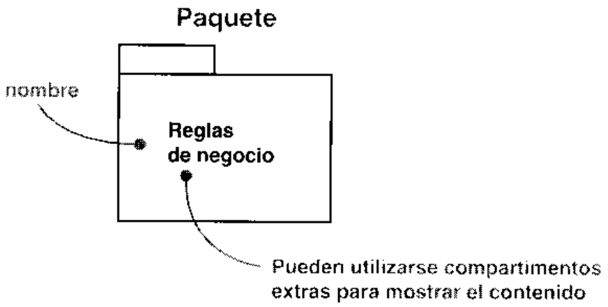

# A.2.4.  Elementos de anotaci6n

# A.2.5. Relaciones de dependencia

# A.2.6.  Relaciones de asociacion

# A.2.7.  Relaciones de generalizacion

# A.2.8.  Mecanismos de extensibilidad

# A.3.  Glosario de terminos

cedimiento computacional. Una accion da lugar a un cambio de estado y se leva a cabo en-viando un mensaje a un objeto o modificando un valor en un atributo.

s  d   o    o   r  s ssultados.

accion sincrona  Una peticion donde el objeto emisor se detiene a esperar los resultados.

activaci6n  La ejecucion de una accion.

actividad  El estado en que se exhibe algun comportamiento.

actor  Un conjunto coherente de roles que los usuarios de casos de uso desempenan cuando in-teraccionan con estos casos de uso.

agregado (el todo) y una parte componente (la parte).

i   e,  e   n

ambito  El contexto que da un significado especifico a un nombre.

asociacion  Una relaci6n estructural que describe un conjunto de enlaces, donde un enlace esuna conexion entre objetos; la relacion semantica entre dos o mas clasificadores que implicanlas conexiones entre sus instancias.

asociacion binaria  Una asociacion entre dos clases.

asociacion n-aria  Una asociacion entre n clases. Cuando n es igual a dos la asociacion es bi-naria. Vease asociacion binaria.

atributo   Una propiedad con nombre de un clasificador que describe el rango de valores quelas instancias de una propiedad pueden tomar.

cardinalidad El numero de elementos en un conjunto.

caso de uso  Una descripcion de un conjunto de secuencias de acciones, incluyendo variacio-nes, que un sistema leva a cabo y que conduce a un resultado observable de interés para unactor determinado.

clase  Una descripcion de un conjunto de objetos que comparten los mismos atributos, opera-ciones, relaciones y semantica.

clase abstracta   Una clase que no puede ser instanciada directamente.

clase activa  Una clase cuyas instancias son objetos activos. Véase proceso, tarea, hilo.

clase asociacion  Un elemento de modelado que tiene a la vez propiedades de asociacion y declase. Una clase asociacion puede verse como una asociacion que tiene ademas propiedadesde clase, o una clase que tiene ademas propiedades de asociacion.

clase concreta  Una clase que puede ser instanciada directamente

clasificacion multiple  Una variacion semantica de generalizacion en la cual un objeto puedeclasificador  Un mecanismo que describe caracteristicas estructurales y de comportamiento.cliente Un clasificador que solicita servicio de otro clasificador.

colaboracion  Una sociedad de clases, interfaces y otros elementos que trabajan juntos paraproporcionar algun comportamiento cooperativo que es mayor que la suma de todos loselementos; la especificacion de como un elemento, como un caso de uso o una operacion, esllevada a cabo por un conjunto de clasificadores y asociaciones desempefiando roles espe-cificos utilizados de una forma especifica.

comentario  Una anotacion que se adjunta a un elemento o coleccion de elementos.

componente  Una parte fisica y reemplazable de un sistema que se ajusta a, y proporciona larealizacion de, un conjunto de interfaces.

el tiempo de vida como parte del todo; las partes con multiplicidad variable pueden ser crea-das despues del compuesto mismo, pero una vez creadas viven con él; dichas partes puedentambién ser destruidas explicitamente antes de la muerte del compuesto.

compuesto Una clase que esta relacionada con una o mas clases mediante una relacion decomposicion.

concurrencia  La ocurrencia de dos o mas actividades durante el mismo intervalo de tiempo.La concurrencia puede conseguirse mediante el entrelazado o por la ejecucion simultanea dedos o mas hilos.

contenedor  Un objeto que existe para contener otros objetos, y que proporciona operacionespara acceder o iterar sobre su contenido.

cificacion de una operacion

dependencia  Una relacion semantica entre dos elementos, en la cual un cambio en un ele-mento (la cosa independiente) puede afectar la semantica del otro elemento (la cosa depen-diente).

diagrama  La presentacion grafica de un conjunto de elementos, usualmente representadodiagrama de actividad  Un diagrama que muestra el flujo de actividad a actividad; los dia-gramas de actividad tratan la vista dinamica de un sistema. Un caso especial de diagrama deestados en el cual todos o casi todos los estados son estados de accion y en el cual todas o casitodas las transiciones son disparadas por la terminacion de las acciones en los estados origen.diagrama de caso de uso  Un diagrama que muestra un conjunto de casos de uso y de actoresy sus relaciones; los diagramas de casos de uso muestran los casos de uso de un sistema des-de un punto de vista estatico.

diagrama de clases  Un diagrama que muestra un conjunto de clases, interfaces y colabora-ciones y las relaciones entre éstos; los diagramas de clases muestran el disenio de un sistemadesde un punto de vista estatico; un diagrama que muestra una coleccion de elementos (es-taticos) declarativos.

diagrama de colaboracion  Un diagrama de interaccion que enfatiza la organizacion estruc-tural de los objetos que envian y reciben mensajes; un diagrama que muestra las interaccio-nes organizadas alrededor de instancias y de los enlaces entre ellas.

diagrama de componentes   Un diagrama que muestra un conjunto de componentes y sus re-laciones; los diagramas de componentes muestran los componentes de un sistema desde unpunto de vista estatico.

diagrama de despliegue muestra el despliegue de un sistema desde un punto de vista estatico.diagrama de estados  Un diagrama que muestra una maquina de estados; los diagramas de es-tados tratan la vista dinamica de un sistema.

diagrama de interaccion  Un diagrama que muestra una interaccion, consistente en un con-junto de objetos y sus relaciones, incluyendo los mensajes que pueden ser enviados entreellos; los diagramas de interaccion tratan la vista dinamica de un sistema; un termino gene-rico que se aplica a varios tipos de diagramas que enfatizan las interacciones de objetos, in-cluyendo diagramas de colaboracion, diagramas de secuencia y diagramas de actividad.

diagrama de objetos   Un diagrama que muestra un conjunto de objetos y sus relaciones en unmomento determinado; los diagramas de objetos muestran el diseno o los procesos de un sis-tema desde un punto de vista estatico.

diagrama de secuencia  Un diagrama de interaccion que hace énfasis en la ordenacion tem-poral de los mensajes.

disparar  Ejecutar una transicion de estado.

elemento   Un constituyente atomico de un modelo.

enlace  Una conexion semantica entre objetos; una instancia de una asociacion.

espacio de nombres Una parte del modelo en el cual pueden ser definidos y usados losnombres; dentro de un espacio de nombres, un nombre tiene un significado unico.

especificacion  Una manifestacion textual de la sintaxis y semantica de un bloque de cons-truccion especifico; una declaracion declarativa de lo que algo es o hace.

estado  Una condicion o situacion durante la vida de un objeto durante la cual éste satisface al-estado de accion  Un estado que representa la ejecucion de una accion atomica, tipicamente lainvocacion de una operacion.

estereotipo  Una extension del vocabulario de UML, que permite la creacion de nuevos tiposde bloques de construccion que se derivan de otros existentes pero que son especificos a unproblema particular.

estimulo  Una operacion o una senal.

n p o  sh a  's a s p x p   p  atimulo que puede disparar una transicion de estados.

nombres en que se encuentra.

extremo de enlace Una instancia de extremo de asociacion.

fachada  Una fachada es un paquete estereotipado que no contiene mas que referencias a ele-mentos de modelos que pertenecen a otros paquetes. Es utilizado para proporcionar una vis-nbed un op sopu si ap ounae p eotand, e

foco de control  Un simbolo en un diagrama de secuencia que muestra el periodo de tiempodurante el cual un objeto esta levando a cabo una accion, tanto si es directamente como si esa traves de una operacion subordinada.

generalizacion  Una relacion de especializacion/generalizacion en la que objetos del elemen-to especializado (el subtipo) son sustituibles por objetos del elemento generalizado (el su-pertipo).

guarda  Una condicion que ha de ser satisfecha para activar el disparo de una transicion asociada.hilo  Un flujo de control ligero que puede ejecutarse concurrentemente con otros hilos en elmismo proceso.

herencia  El mecanismo mediante el cual elementos mas especificos incorporan la estructuray el comportamiento de elementos mas generales.

herencia de interfaz  La herencia del interfaz de un elemento mas especifico; no incluye la he-rencia de la implementacion

herencia muiltiple Una variacion semantica de generalizacion en la cual un tipo puede tenermas de un supertipo.

herencia simple  Una variacion semantica de generalizacion en la cual un tipo puede tener uni-camente un supertipo.

clases pueden ser referenciadas dentro de unos paquetes dados (incluyendo paquetes recur-sivamente importados por él).

interfaz Una coleccion de operaciones que son utilizadas para especificar un servicio deuna clase o de un componente.

nd   s  n n     naplicarse un conjunto de operaciones y que tiene un estado que almacena los efectos de lasoperaciones; un sinonimo de objeto.

interaccion  Un comportamiento que consta de un conjunto de mensajes intercambiados por unconjunto de objetos dentro de un contexto particular para llevar a cabo un proposito especifico.jerarquia de contencion  Una jerarquia en el espacio de nombres que esta formada por elementos y las relaciones de contencion que existen entre ellos.

lenguaje de restriccion de objetos (OCL)  Un lenguaje formal utilizado para expresar res-tricciones libres de efectos laterales.

ligadura o enlazado (binding)  La creacion de un elemento a partir de una plantilla suminis-trando los argumentos para los parametros de la plantilla.

linea de vida  Véase linea de vida de un objeto.

linea de vida de un objeto  Una linea en un diagrama de secuencia que representa la existen-cia de un objeto a lo largo de un periodo de tiempo.

localizacion   La colocacion de un componente sobre un nodo.

maquina de estados  Un comportamiento que especifica las secuencias de estados por los quepasa un objeto durante su tiempo de vida en respuesta a eventos, junto con sus respuestas adichos eventos.

aplicaciones dentro de un domino especifico.

mecanismo de extensibilidad  Uno de los tres mecanismos (estereotipos, valores etiquetadosy restricciones) que pueden ser utilizados para extender UML de forma controlada.

-  e   n e  e s s ee p b  asaje es normalmente considerada una instancia de un evento.

metaclase  Una clase cuyas instancias son clases.

metodo  La implementacion de una operacion.

modelo  Una abstraccion de un sistema cerrada semanticamente.

de tener.

nodo Un elemento fisico que existe en tiempo de ejecucion y que representa un recursod p po o e a t n so  a acesamiento.

nombre  Como se llama a una cosa, relacion o diagrama; una cadena de caracteres utilizadanota  Un comentario asociado a un elemento o a un conjunto de elementos.

objetoVease instancia.

objeto activo  Un objeto que posee un proceso o hilo y puede iniciar actividad de control.objeto persistente  Un objeto que existe despues de que el proceso o hilo que lo cre6 ha dejadode existir.

la clase para afectar su comportamiento.

plantilla Un elemento parametrizado

postcondicion  Una restriccion que ha de ser cierta al completarse una operacion.

precondicion  Una restriccion que ha de ser cierta cuando una operacion es invocada.

proveedor Un tipo, clase o componente que proporciona servicios que pueden ser invocadospor otros.

realizacion  Una relacion semantica entre clasificadores, en la que un clasificador especifica uncontrato que otro clasificador garantiza Hlevar a cabo.

o n     p sn n  o

neo un d oa s n  s n  b orelacion   Una conexion semantica entre elementos.

responsabilidad  Un contrato u obligacion de un tipo o clase.

restriccion  Una extension de la semantica de un elemento de UML que permite anadir nuevasreglas o modificar las existentes.

signatura El nombre y los parametros de una caracteristica de comportamiento.

sistema  Una coleccion de subsistemas organizados para levar a cabo un proposito especificoy descritos por un conjunto de modelos, posiblemente desde distintos puntos de vista.

subsistema  Una agrupacion de elementos, de los que algunos constituyen una especificaciondel comportamiento ofrecido por los otros elementos contenidos.

pratipo.

o    i      o osubtipo.

e o o  n d n  sa    sotra representacion de un flujo de control; un hilo o proceso.

tipo  Un estereotipo de clase utilizado para especificar un dominio de objetos junto con las ope-raciones (pero no metodos) aplicables a los objetos.

primitivos predefinidos (como numeros y cadenas) y los tipos enumerados (como los boo-leanos).

tipo primitivo  Un tipo basico predefinido, como un entero o una cadena de caracteres.

transicion  Una relacion entre dos estados indicando que un objeto en el primer estado llevara a cabo ciertas operaciones especificadas y entrara en el segundo estado cuando un eventoespecificado ocurra y se satisfagan las condiciones especificadas.

representan el mismo concepto, sin reglas especificas para derivar una de la otra.

unidad de despliegue e Un conjunto de objetos o componentes que estan asignados a una tareao a un procesador como un grupo.

uso Una dependencia en la que un elemento (el cliente) requiere la presencia de otro elemento(el proveedor) para su correcto funcionamiento o implementacion.

valor etiquetado  Una extension de las propiedades de un elemento UML, lo que permite lacreacion de nueva informacion en la especificacion de ese elemento.

visibilidad   Como un nombre puede ser visto y usado por otros.

vista  Una proyeccion de un modelo, la cual es vista desde una perspectiva determinada o pun-

# A.4.  Referencias

MA, 1998. Internet:.

[2] James Rumbaugh, Ivar Jacobson y Grady Booch, The Unified Modeling Language Re-ference Manual, Reading, MA: Addison-Wesley, 1998.

[3] Grady Booch, James Rumbaugh e Ivar Jacobson, The Unified Modeling Language UserGuide, Reading, MA: Addison-Wesley, 1998.

[4]  Martin Fowler, UML Distilled, Reading, MA: Addison-Wesley, 1997.

[5] Hans-Erik Eriksson y Magnus Penker, UML Toolkit, New York: John Wiley & Sons, 1998.

# Extensiones de UML especificasdel Proceso Unificado

# B.1. Introduccion

Este apendice describe las extensiones de UML que precisa el Proceso Unificado. Estas exten-siones se describen en terminos de estereotipos y valores etiquetados, es decir, en terminos de losmecanismos de extension proporcionados por UML, asi como con la notacion grafica usada pararepresentar algunos de los estereotipos. Los estereotipos que no son parte o que difieren de lasextensiones estandar de UML [1] y [2] estan indicados con un asterisco (*).

Para una vision de conjunto de UML, consulte el Apendice A.

# B.2. Estereotipos

Clase del modelo de analisis usadapara modelar la interaccion entre elsistema y sus actores, esto es, usua-rios y sistemas externos.

Colaboracion del modelo de analisisque describe como se realiza un de-terminado caso de uso, en terminosde clases de analisis (clases de con-trol, entidad y entorno) y sus objetosde analisis correspondientes.

Paquete que proporciona los mediospara organizar los artefactos del mo-delo de analisis en piezas maneja-bles. Un paquete del analisis puedeconsistir en clases del analisis (cla-ses de control, entidad y entorno),realizaciones de casos de uso-anali-sis, y otros paquetes del analisis (re-cursivamente).

Paquete que proporciona los mediospara organizar los artefactos del mo-delo de diseno en piezas manejables.Un subsistema del diseno puedeconsistir en clases del diseno, reali-zaciones de casos de uso-diseno,interfaces, y otros subsistemas del di-seno (recursivamente).

Variante de un subsistema del disenoque es usado en un nivel inferior dela jerarquia de subsistemas del dise-no (en el modelo de diseno) para es-tructurar el sistema de acuerdo a losservicios que proporciona.

Modelo de objetos que describe la dis-tribucion fisica del sistema, en termi-nos de como se distribuye la funcio-nalidad entre nodos computacionales.

# B.3. Valores etiquetados

# B.4. Notacion grafica

La mayoria de los estereotipos presentados en la Seccion B.2 no imponen por si mismos ningunsimbolo grafico, sino que pueden dibujarse mostrando las palabras clave del estereotipo entrecomillas dobles (<< y >>) en el simbolo al que se aplica el estereotipo.

Sin embargo, las clases de control, entidad y contorno imponen nuevos simbolos que puedendibujarse como se muestra en la Figura B.1.

# B.5.  Referencias

[1]  OMG Unified Modeling Language Specification. Object Management Group, Framingham,MA, 1998. Internet: www.omg.org.

[2]  James Rumbaugh, Ivar Jacobson, and Grady Booch, Unified Modeling Language ReferenceManual, Reading, MA: Addison-Wesley, 1998.

# Glosario general

# C.1.  Introduccion

Este apendice recopila y define los terminos generales usados para describir el Proceso Unifi-cado, exceptuando los terminos relacionados con UML y los terminos relacionados con exten-siones de UML especificas para el Proceso Unificado. Para una descripci6n resumida de estostérminos, vease el Apendice A "Vision general de UML", y el Apendice B “"Extensiones deUML especificas del Proceso Unificado"'.

# C.2.  Terminos

abstraccion  Caracteristicas esenciales de una entidad que la distinguen de cualquier otraclase de entidades. Una abstraccion define un contorno relativo a la perspectiva del obser-vador.

actividad Unidad tangible de trabajo realizada por un trabajador en un flujo de trabajo, de for-ma que (1) implica una responsabilidad bien definida para el trabajador, (2) produce un re-sultado bien definido (un conjunto de artefactos) basado en una entraba bien definida (otroconjunto de artefactos), y (3) representa una unidad de trabajo con limites bien definidos a laque, probablemente se refiera el plan de proyecto al asignar tareas a los individuos. Tambienjador.

object request broker (ORB)   Mecanismo para la organizacion y reenvio de mensajes a ob-jetos distribuidos en entornos heterogeneos. Vease distribucion.

analisis (flujo de trabajo) Flujo de trabajo fundamental cuyo proposito principal es analizarlos requisitos descritos en la captura de requisitos, mediante su refinamiento y estructuracion.o ( a 'sa s  d s s t  () s s  ouna descripcion de los requisitos que sea facil de mantener y que nos ayude a dar estructuraal sistema en su conjunto —incluyendo su arquitectura.

arquitectura  Conjunto de decisiones significativas acerca de la organizacion de un sistema soft-ware, la seleccion de los elementos estructurales a partir de los cuales se compone el sistema,y las interfaces entre ellos, junto con su comportamiento, tal y como se especifica en las co-laboraciones entre esos elementos, la composicion de estos elementos estructurales y de com-portamiento en subsistemas progresivamente mayores, y el estilo arquitectonico que guiaesta organizacion: estos elementos y sus interfaces, sus colaboraciones y su composicion. Laarquitectura del software se interesa no solo por la estructura y el comportamiento, sino tam-bién por las restricciones y compromisos de uso, funcionalidad, funcionamiento, flexibilidad alcambio, reutilizacion, comprension, economia y tecnologia, asi como por aspectos esteticos.artefacto  Pieza de informacion tangible que (1) es creada, modificada y usada por los traba-jadores al realizar actividades; (2) representa un area de responsabilidad, y (3) es candidataa ser tenida en cuenta para el control de la configuracion. Un artefacto puede ser un modelo,un elemento de un modelo, o un documento. Vease trabajador, actividad.

artefacto de gestion  Artefacto que no es de ingenieria, por ejemplo un plan de proyecto crea-do por el jefe de proyecto. Vease artefacto de ingenieria.

artefacto de ingenieria Artefacto creado en los flujos de trabajo fundamentales. Véase flujode trabajo fundamental.

capa  Parte bien definida de un sistema, definida a partir de paquetes o subsistemas. Véasecapa general de aplicacion, capa especifica de aplicacion.

capa del software del sistema   Capa que contiene el software para la infraestructura de com-datos, interfaces para determinados componentes hardware, etc. Se trata de la capa inferior dela jerarquia de capas. Véase capa intermedia.

capa especifica de aplicacion  La parte (paquetes o subsistemas) de un sistema que es espe-cifica de la aplicacion y no es compartida por otras partes (subsistemas). Esta capa utiliza lacapa general de aplicaci6n. Vease capa general de aplicacion.

aplicacion. Vease capa especifica de aplicacion.

capa intermedia (middleware)  Capa que ofrece bloques de construccion reutilizables (pa-quetes o subsistemas) a marcos de trabajo y servicios independientes de la plataforma, paracosas como computacion con objetos distribuidos, o interoperabilidad en entornos hetero-geneos. Ejemplos son los object request brokers (ORB), los marcos de trabajo independien-tes de la plataforma para crear interfaces de usuario graficas o, en general, cualquier productoque llevan a cabo mecanismos de diseno genéricos. Vease capa de software del sistema,object request brokers, mecanismo de diseno.

caso de prueba  Especificacion de un caso para probar el sistema, incluyendo qué probar, conque entradas y resultados y bajo que condiciones.

centrado en la arquitectura  En el contexto del ciclo de vida del software, significa que la ar-quitectura de un sistema se usa como un artefacto primordial para la conceptualizacion, cons-truccion, gesti6n y evolucion del sistema en desarrollo

ciclo de vida del software  Ciclo que cubre cuatro fases en el siguiente orden: inicio, elabo-racion, construccion y transicion. Vease inicio, elaboracion, construccion y transicion.

cohesivo  Capacidad de una entidad (por ejemplo, un sistema, subsistema o paquete) de man-tener juntas sus partes.

concurrencia  Ocurre cuando varios trabajos (flujos de control, procesos) mas o menos inde-pendientes comparten un unico dispositivo hardware (procesador) al mismo tiempo.

construccion Version ejecutable del sistema, por lo general, de una parte especifica del mis-mo. El desarrollo transcurre a traves de una sucesion de construcciones.

defecto  Anomalia del sistema, por ejemplo un sintoma de un error en el software descubierto du-rante las pruebas, o un problema descubierto durante una reunion de revision. Véase pruebas.desarrollador  Trabajador participante en un flujo de trabajo fundamental. Por ejemplo, un in-geniero de casos de uso, un ingeniero de componentes, etc. Vease flujo de trabajo funda-mental.

desarrollo basado en componentes (DBC) Creacion y despliegue de sistemas con grancantidad de software mediante su ensamblado a partir de componentes, asi como el desarrollodescripcion arquitectonica  Descripcion de la arquitectura del sistema, incluyendo las vistasarquitectonicas de los modelos. Vease vista arquitectonica, vista arquitectonica del modelolo de diseno, vista arquitectonica del modelo de despliegue, vista arquitectonica del modelode implementacion.

mular modelos que se centran en los requisitos no funcionales y el dominio de la solucion, ydespliegue  Ocurre cuando varios trabajos mas o menos independientes (flujos de control, pro-cesos) se distribuyen entre diferentes dispositivos hardware (procesadores)

dominio Area de conocimiento o actividad caracterizada por un conjunto de conceptos y ter-minologia comprendidos por los practicantes de ese dominio.

dominio de la solucion  Dominio en el que se define una solucion (para un problema) —-por logeneral, una solucion que pone de manifiesto el diseno y la implementacion de un sistema. Eldominio de la solucion es comprendido, por lo general, por los desarrolladores del sistema.Vease dominio, desarrollador

dominio del problema  dominio sobre el que se define un problema —-generalmente un pro-blema que debe ser 'resuelto' por un sistema. El dominio del problema es comprendido, porlo general, por el cliente del sistema. Vease dominio, cliente.

enfoque en cascada   Enfoque para el desarrollo de un sistema en el cual el desarrollo se or-ganiza en una secuencia lineal de trabajos, por ejemplo, en el orden siguiente: captura de re-quisitos, analisis, diseno, implementacion y pruebas. Vease requisitos, analisis, diseno, im-plementacion, pruebas.

estilo arquitectonico  Los sistemas que comparten una estructura de alto nivel y mecanismosclave similares se dice que tienen un estilo arquitectonico similar.

evaluacion de las pruebas  Evaluacion de los resultados del esfuerzo de prueba, como co-bertura de casos de prueba, cobertura de codigo y estado de los defectos. Vease prueba, casode prueba, defecto.

fase  Periodo de tiempo entre dos hitos principales de un proceso de desarrollo. Véase hitoprincipal, inicio, elaboracion, construccion, transicion.

fase de construccion   Tercera fase del ciclo de vida del software, en la que el software es de-sarrollado a partir de una linea base de la arquitectura ejecutable, hasta el punto en el que estalisto para ser transmitido a la comunidad de usuarios.

fase de elaboracion  Segunda fase del ciclo de vida, en la que se define la arquitectura.

fase de inicio  Primera fase del ciclo de vida del software, en la que la idea inicial para el de-sarrollo es refinada hasta el punto de quedar lo suficientemente bien establecida como paragarantizar la entrada en la fase de elaboracion.

fase de transicion   Cuarta fase del ciclo de vida del software, en la que el software es puestoen manos de la comunidad de usuarios.

cucion real. Puede medirse, por ejemplo, en funcion de la disponibilidad del sistema, suexactitud, el tiempo medio entre fallos, los defectos por cada 1.000 lineas de codigo o los de-fectos por clase.

flujo de trabajo  Realizacion de un caso de uso de negocio o parte de él. Puede describirse envidades que realizan y los artefactos que producen. Vease flujo de trabajo fundamental, flu-jo de trabajo de una iteracion.

si ap uoa nn esai anb oeqen anb oi unan un ap ofeqen ap ojos de trabajo fundamentales: captura de requisitos, analisis, disenio, implementacion ypruebas. Descripcion de una iteracion que incluye los trabajadores participantes, las activi-flujo de trabajo fundamental  Cada uno de los flujos de trabajo de requisitos, analisis, dise-no, implementaci6n o pruebas. Véase flujo de trabajo, requisitos, analisis, diseno, imple-mentacion, pruebas.

framework  Vease marco de trabajo.

gestion de la configuracion  Tarea de definir y mantener las configuraciones y versiones de losartefactos. Esto incluye la definicion de lineas base, el control de versiones, el control de es-tado y el control del almacenamiento de los artefactos. Véase artefacto, linea base.

dirigido por los casos de uso   En el contexto del ciclo de vida del software, indica que los ca-sos de uso se utilizan como artefacto principal para definir el comportamiento deseado parael sistema, y para comunicar este comportamiento entre las personas involucradas en el sis-s ssi  d d   s on  sooimplementacion y pruebas del sistema, incluyendo la creacion, verificacion y validacion dela arquitectura del sistema. Vease analisis, diseno, implementacion, pruebas, arquitectura.dirigido por los riesgos  En el contexto del ciclo de vida del software, indica que cada nuevaversion se centra en atacar y reducir los riesgos mas significativos para el éxito del proyecto.dirigido por modelos  En el contexto del ciclo de vida del software, significa que el sistema enhito principal  Punto en el que han de tomarse importantes decisiones de negocio. Cada faseacaba en un hito principal en el cual los gestores han de tomar decisiones cruciales de con-tinuar o no el proyecto, y decidir sobre la planificacion, presupuesto y requisitos del mismo.Consideramos a los hitos principales como puntos de sincronizacion en los que coinciden unaserie de objetivos bien definidos, se completan artefactos, se toman decisiones de pasar o noa la fase siguiente, y en los que las esferas tecnica y de gestion entran en conjuncion

hito secundario  hito intermedio entre dos hitos principales. Puede existir, por ejemplo, al aca-bar una iteracion, o cuando se finaliza una construccion en una iteraci6n. Véase hito princi-pal, iteracion, construccion.

implementar el sistema en terminos de componentes, es decir, codigo fuente, guiones, fi-cheros binarios, ejecutables, etc.

construcciones sucesivas. Cada iteracion resultara, al menos, en una nueva construccion, deforma que se anada un incremento al sistema. Sin embargo, se puede crear una secuencia deconstrucciones en una sola iteracion, cada una de ellas anadiendo al sistema un pequeno in-cremento. Por tanto, una iteracion aniade al sistema un incremento mayor, posiblementeacumulado a lo largo de varias construcciones. Vease construccion, iteracion.

ingenieria directa  En el contexto del desarrollo del software, la transformacion de un mode-lo en codigo a traves de su traduccion a un determinado lenguaje de implementacion. Véeaseingenieria inversa.

ingenieria inversa  En el contexto del desarrollo de software, transformacion del codigo en unmodelo a traves de su traduccion desde un determinado lenguaje de implementacion. Veaseingenieria directa.

integracion del sistema  Compilacion y ensamblado de parte de los componentes de un sis-d  n ) s s o on

integracion incremental  En el contexto del ciclo de vida del software, proceso que implica laintegracion continua de la arquitectura del sistema para producir versiones, de forma quecada nueva version incluya mejoras incrementales sobre las anteriores.

interfaz de usuario  Interfaz a traves de la cual un usuario interactua con un sistema

iteracion  Conjunto de actividades levadas a cabo de acuerdo a un plan (de iteracion) y unosde iteracion, version, version interna, version externa.

Ss

juego de aplicaciones   Conjunto de diferentes aplicaciones (sistemas) cuyo proposito es tra-bajar conjuntamente para proporcionar valor anadido a algunos actores. Vease aplicacion(sistema).

Lenguaje Unificado de Modelado (UML)  Lenguaje estandar para el modelado de softwarelenguaje para visualizar, especificar, construir y documentar los artefactos de un sistemacon gran cantidad de software. Lenguaje usado por el Proceso Unificado. Lenguaje que per-mite a los desarrolladores visualizar el producto de su trabajo (artefactos) en esquemas o dia-gramas estandarizados. Vease artefacto, Proceso Unificado, desarrollador.

linea base  Conjunto de artefactos revisados y aprobados que (l) representa un punto deacuerdo para la posterior evolucion y desarrollo, y (2) solamente puede ser modificado a través de un procedimiento formal, como la gestion de cambios y configuraciones. Vease lineabase de la arquitectura, gestion de la configuracion.

linea base de la arquitectura  Linea base resultado de la fase de elaboracion, centrada en laarquitectura del sistema. Vease elaboracion, arquitectura, linea base.

marco de trabajo  Microarquitectura que proporciona una plantilla incompleta para sistemas

sos de uso.

mecanismo  Solucion comun a un problema o requisito comun. Ejemplos son los mecanismosmodelo de diseno que llevan a cabo requisitos comunes, como requisitos de persistencia, dis-tribucion y funcionamiento.

modelado visual   Visualizacion de productos (artefactos) en esquemas o diagramas estanda-rizados.

Cliente-Servidor, 3 Niveles y EntrePares, Layer, Client-Server, Three-tier y Peer-to-peer, cadaas  s    d sa n n  sn s p ocomo deben ser asignados a sus nodos los componentes (la funcionalidad). Vease patron, vis-ta de la arquitectura.

Vease riesgo.

plan de iteracion  Plan detallado para una iteracion. Plan que determina, para una iteracion, loscostes previstos, en terminos de dinero y recursos, y los resultados previstos, en terrminos deartefactos. Plan que establece quién debe hacer que en la iteracion y en que orden. Esto se lle-va a cabo asignando trabajadores y describiendo un flujo de trabajo detallado para la itera-cion. Vease iteracion, artefacto, trabajador, flujo de trabajo de una iteracion.

plan de proyecto  Plan que esboza el ‘mapa de carreteras’ global de un proyecto, incluyendos s     sd s s  s  snraciones. Vease proyecto, hito principal.

portabilidad  Grado en el que un sistema, en funcionamiento en un determinado entorno deejecucion, puede ser convertido facilmente en un sistema funcionando en otro entorno de eje-cucion.

procedimiento de pruebas  Especificacion de como llevar a cabo uno o varios casos deprueba o partes de ellos. Véase caso de prueba.

proceso de desarrollo de software Proceso de negocio, o caso de uso de negocio, de un ne-gocio de desarrollo de software. Conjunto total de actividades necesarias para transformar losd n  n snn  si o n    p ssno s d -on  ta od mnd n    orequisitos en nuevas versiones del producto software. Véase proceso de negocio, ProcesoUnificado.

proceso de negocio  Conjunto total de actividades necesarias para producir un resultado de va-lor percibido y medible para un cliente individual de un negocio.

Proceso Unificado  Proceso de desarrollo de software basado en el Lenguaje Unificado deriesgos. Proceso que se organiza en cuatro fases: inicio, elaboracion, construccion y transi-cion, y que se estructura en torno a cinco flujos de trabajo fundamentales: recopilacion de re-quisitos, analisis, diseno, implementacion y pruebas. Proceso que se describe en terminos deun modelo de negocio, el cual esta a su vez estructurado en funcion de tres bloques de cons-truccion primordiales: trabajadores, actividades y artefactos. Vease proceso de desarrollo desoftware, Lenguaje Unificado de Modelado, iterativo, centrado en la arquitectura, dirigidopor los casos de uso, dirigido por los riesgos, fase, inicio, elaboracion, construccion, tran-sicion, flujo de trabajo fundamental, requisitos, analisis, diseno, implementacion, pruebas,trabajador, actividad y artefacto.

prototipo arquitectonico  Fundamentalmente, prototipo ejecutable que se centra en la vista ar-quitectonica del modelo de implementacion y en los componentes que ponen de manifiestoel prototipo. Si un prototipo arquitectonico es evolutivo, probablemente estara fundado sobreuna linea base, y su estructura se pondra de manifiesto mediante una descripcion arquitec-tonica mas completa, aunque también prototipica (o esbozada), incluyendo todas sus vistasarquitectonicas. Vease prototipo evolutivo, linea base, descripcion arquitectonica, vista ar-quitectonica.

prototipo de interfaz de usuario  Fundamentalmente, un prototipo ejecutable de una interfazde usuario, pero que puede, en los momentos iniciales del desarrollo, consistir unicamente endibujos en papel, disenos de pantallas, etc. Véase interfaz de usuario.

prototipo evolutivo  Prototipo que evoluciona y es refinado para convertirse finalmente en par-i  p ss s e o sh b oe sp a s  pfiguraciones. Vease gestion de configuraciones.

prototipo exploratorio  Prototipo usado unicamente con motivos exploratorios y que esdesechado una vez que se han cumplido estos propositos. Prototipo que no es candidato a sersujeto de la gestion de configuraciones. Véase gestion de configuraciones.

proyecto Esfuerzo de desarrollo para Hlevar un sistema a lo largo de un ciclo de vida. Véase ci-clo de vida del software.

habia sido probada con anterioridad. Las pruebas de regresion se realizan fundamentalmen-, n  aanu p, n s o    struccion nueva". Vease prueba, construccion.

pruebas (flujo de trabajo)  Flujo de trabajo fundamental cuyo proposito esencial es com-probar el resultado de la implementacion mediante las pruebas de cada construccion, inclu-yendo tanto construcciones internas como intermedias, asi como las versiones finales delsistema que van a ser entregadas a terceras partes. Véase implementacion, construccion, ver-sion interna, version externa.

requisito  Condicion o capacidad que debe cumplir un sistema.

tar el desarrollo hacia el sistema correcto. Esto se lleva a cabo mediante la descripcion de losrequisitos del sistema de forma tal que se pueda llegar a un acuerdo entre el cliente (inclu-yendo los usuarios) y los desarrolladores del sistema, acerca de lo que el sistema debe hacery lo que no. Véase requisito, cliente, desarrollador.

requisito adicional  requisito de caracter general que no puede ser asociado a un caso de usoen concreto o a una clase concreta del mundo real, tal como una clase entidad del dominio odel negocio. Vease requisito.

requisito de rendimiento  Requisito que impone condiciones de comportamiento sobre unVease requisito funcional, requisito.

requisito funcional  Requisito que especifica una accion que debe ser capaz de realizar el sis-tema, sin considerar restricciones fisicas; requisito que especifica comportamiento de entra-da/salida de un sistema. Vease requisito.

del entorno o de implementacion, rendimiento, dependencias de la plataforma, mantenibili-dad, extensibilidad o fiabilidad. Requisito que especifica restricciones fisicas sobre unrequisito funcional. Vease requisito, requisito de funcionamiento, fiabilidad, requisito fun-cional.

sistir en que un proyecto experimente sucesos no deseados, como retrasos en la programa-cion, desviaciones de costes o una cancelacion definitiva. Véase riesgo tecnico, riesgo no tec-nico.

cursos (personas) disponibles, sus competencias, o con las fechas de entrega. Vease artefactode gestion, riesgo, riesgo tecnico.

como las tecnologias de implementacion, la arquitectura o el rendimiento. Véase artefacto derobustez  capacidad de una entidad (por lo general, un sistema) para adaptarse al cambio

viejo que fue creado usando tecnologias de implementacion mas o menos obsoletas, perod  o p s  es 1- pz o o s p oso no ate——- al construir un nuevo sistema durante el proyecto. Vease proyecto.

dsi arnnb anb A odinba o euosiad sun e opeuise os apend sn oisnd opefeqbilidades y habilidades como realizar determinadas actividades o desarrollar determinados ar-tefactos. Vease actividad, artefacto.

version   Conjunto de artefactos relativamente completo y consistente —que incluye posible-mente una construccion-- entregado a un usuario interno o externo; entrega de tal conjunto.Vease artefacto, construccion.

bros. Vease version.

version interna  Una version no expuesta a los clientes y usuarios, sino solo de forma interna,al proyecto y sus miembros. Vease version.

vista  Proyeccion de un modelo, que es visto desde un perspectiva dada o un lugar estrategico,y que omite las entidades que no son relevantes para esta perspectiva.

vista arquitectonica del modelo de analisis  Vista de la arquitectura de un sistema, abarcan-do las clases, paquetes y realizaciones de casos de uso del analisis; vista que fundamen-talmente aborda el refinamiento y estructuracion de los requisitos del sistema. La estructurade esta vista se preserva en la medida de lo posible cuando se disena e implementa la arqui-tectura del sistema. Vease vista arquitectonica del modelo de diseno, vista arquitectonica delmodelo de implementacion.

vista arquitectonica del modelo de casos de uso  Vista de la arquitectura de un sistemaabarcando los casos de uso significativos desde un punto de vista arquitectonico.

vista arquitectonica del modelo de despliegue   Vista de la arquitectura de un sistema abar-cando los nodos que forman la topologia hardware sobre la que se ejecuta el sistema; vista queaborda la distribucion, entrega e instalacion de las partes que constituyen el sistema fisico.vista arquitectonica del modelo de diseno  Vista de la arquitectura de un sistema, abarcandolas clases, subsistemas, interfaces y realizaciones de casos de uso del diseno que forman elvocabulario del dominio de la solucion del sistema; vista que abarca también los hilos y pro-cesos que establecen la concurrencia y mecanismos de sincronizacion del sistema; vista queaborda los requisitos no funcionales, incluyendo los requisitos de rendimiento y capacidad decrecimiento de un sistema.

vista arquitectonica del modelo de implementacion Vista de la arquitectura de un sistema,abarcando los componentes usados para el ensamblado y lanzamiento del sistema fisico; vis-ta que aborda la gestion de la configuracion de las versiones del sistema, constituida porcomponentes independientes que pueden ser ensamblados de varias formas para producir unsistema ejecutable.

accion, 5actividad, 126, 136-138actor, 20-21, 33, 39, 115-116, 120, 140-142,154-155, 336, 351-353particular, 141-142agregacion, 199-200, 246agrupamiento, 408, 411alcance (sistema), 330Alexander, Christopher, 67analista de sistemas, 134-135, 138anotacion, 408, 411apuesta economica, 340-350arquitecto, 71-72arquitectura, 55-79candidata, 329-331artefacto, 18de gestion, 19de ingenieria, 19aseguramiento de la calidad, 28asignacion de tiempo, 311, 312asociaci6n, 199-200atributo, 173, 198-199, 245-246, 275-276autocontenido, 20

Boehm, Barry, 82, 86

# c

"calle", 23campeon, 400caracteristica, 108-109, 335caso denegocio, 81pruieba, 52-53, 283-285candidato, 35uso, 5, 31-53abstracto, 159, 161candidato, 39-40concreto, 159, 161《real>, 159, 161ciclode vida, 8-12, 17-18del software, 28claseactiva, 76-77, 210, 269, 410, 232-234, 249de analisis, 173-178de control, 176-177, 179, 195, 244de diseno, 47, 50, 209-210, 243-249de diagrama, 42, 43, 47de dominio, 112-115, 118-119, 189-190de entidad, 175, 179, 184, 192, 194, 244de equivalencia, 277de estereotipo, 42

de interfaz, 42, 174-175, 179de negocio, 175de responsabilidades, 34, 45, 356frontera, 174-175, 179, 195-196notaci6n grafica, 409, 424rol, 41, 45, 114, 198clasificador, 33cliente, 382, 389-392codigo, 18codigo fuente, 18, 274-275codigo maquina, 18colaboracion, 21, 34comillas (《>), 9, 42componente, 50-52, 257-259de dependencia, 259de fichero, 274-276de interfaz, 262de prueba, 287, 294ejecutable, 269-270configuracion de red, 222-224, 359Constantine, Larry, 156construccion, 62, 87-89contrato, interfaz, 364-365coste, 323-324

defecto, 288, 298, 388dependenciade compilacion, 259de traza, 10, 21-22, 37, 166, 258entre componentes, 259entre paquetes del analisis, 192entre subsistemas, 228-231, 250notacion grafica, 411descripcionde caso de uso, 142-152de flujo de eventos, 45de la arquitectura, 57-58, 69-73diagramade actividad, 23, 129, 151de colaboraci6n, 44-45, 129de estados, 33, 129de interacci6n, 178-180, 212-213de secuencia, 47-48, 129directiva de reingenieria, 399-400director de prueba, 288, 376directriz de arquitectura, 64-67, 69diseniador de interfaz de usuario, 135-137Drucker, Peter F., 85

ejecutivo, 398-400elemento (UML), 407-408elemento de comportamiento, 408, 410elemento estructural, 408-410entidad de negocio, 116, 118entidad, clase, 42, 175, 179entorno de desarrollo, 334especificaci6n funcional, 5especificador de casos de uso, 135, 137, 147estandarizaci6n, 59estereotipo, 23, 419-422estilo arquitectonico, 57estructura de equipo, 14-15, 90, 347evaluaci6n, 313-314

fase, 8, 10-12de construcci6n, 12, 82, 101, 367-379de elaboraci6n, 11, 82, 101, 345-365de evaluaci6n, 324-326de inicio, 11, 81, 101, 327-344de iteraci6n, 95, 100-101de planificacion, 311de transici6n, 12, 82, 101, 381-393fiabilidad, 110flujo de trabajo, 10, 22-24, 126

generalizacion, 159, 200, 236, 247, 412gesti6n, 398-401de requisitos, 28de riesgo, 14gestor de proyecto, 313, 325glosario (artefacto), 132-133guion, prueba, 287

# H

Harness (prueba de), 302herramienta, 13, 25-29de programacion, 28hito, 10, 81, 98

incremento, 7, 8, 97vease tambien iteracioningenierode casos de uso, 185-186, 219

de componentes, 186, 220, 266, 278-279,374-375, 378de pruebas de integraci6n, 288de pruebas del sistema, 289de pruebas, 289, 313instalaci6n (producto), 389, 390instanciade caso de uso, 129-130de clase, 37de proceso, 22integrador del sistema, 266, 376-377interaccion, 410interesado, 18-19interfaz, 409de usuario, 110, 133, 135, 152-158, 373inversion (retorno de la), 341, 363iteraci6n, 6-8, 10, 82-102controlada, 7de flujo de trabajo, 94-95generica, 94-97, 303-304, 308-310iteraciones de organizaci6n, 101

Java, 228-229, 278, 358Jones, Capers, 87

Layer, 68lenguaje de programacion, 209, 275lenguaje unificado de modelado (UML), 4, 398,407-424linea base de la arquitectura, 65-66linea de vida, 242

manual de usuario, 38, 369maquina de estados, 410matriz de prueba, 285mecanismo, 70ode extensibilidad, 408-409, 412, 419-424mensaje, 39, 211-213mentor, 401middleware, 62, 227-229migracion de datos, 389miniproyecto, 7, 83modelo, 19-22(artefacto), 99de analisis, 9-10, 166-204

de casos de uso, 5, 10, 21, 127-128de despliegue, 10, 76-77de diseno, 10, 21, 205-253de implementaci6n, 10, 32, 256-279de negocio, 10, 115-121del dominio, 10, 112-116, 118-119en cascada, 86, 90, 95-96, 326modularidad de funciones, 60

nodo, 76nota, 411notacion “en forma de pez", 24nucleo (flujo de trabajo), 94-95, 100, 308-310

# 0

objeto, 25, 177, 179, 195-196, 212, 239-241activo, 76-77, 232, 270vease tambien claseorganizacion (tipos de), 328, 329organizaciones de software, 328-329

paquete, 411, 181-183, 189-192, 215de analisis, 181-184, 201-202de servicio, 182-183patronBroker, 68, 69Client/Server, 68de arquitectura, 67-69de diseno Proxy, 67de diseno, 67Layers, 68organizacion, 18persistencia, 235, 244personas, 13-17plan de construccion de integracion, 264planificacion, 310-314plantilla, 67procedimiento de prueba, 52, 286-287, 294-295procesoautomatizado, 25-27comun, 25de desarrollo de software, 4, 13de desarrollo, 4, 13, 22-29de especializacion, 24-25generico, 24unificado, 3-12Proceso Objectory de Rational, 403

Proceso Unificado de Rational, 403producto, 9, 13carrera, 369de mercado, 388-390prototipo, 133, 135, 152-158, 306, 332-333, 352,373de interfaz de usuario, 133, 135, 152- 158proyecto, 13, 22green-field, 17prueba, 281-299alfa, 382de aceptaci6n, 384, 386-387de caja blanca, 35, 284de caja negra, 34, 283de configuracion, 285de especificacion, 277de estrés, 300de instalacion, 285de integracion, 264-265de regresi6n, 95-96, 282-283, 294de unidad, 276-279del sistema, 294, 297, 362negativa, 285

ranking (caso de uso), 316-317, 367realizaci6n de casos de uso, 44-48, 117-118, 177-181, 210-212, 242,284recurso, 17relaci6n, 21-22, 33-34de cliente individual, 389de extension, 160, 161de inclusion, 161-162de uso, 159requisitode funcionalidad, 35-36de interfaz, 121de rendimiento, 110, 150especial, 132, 150, 180-181, 193, 197, 201, 249fisico, 121no funcional, 40, 110suplementario, 111, 121-122requisitos, 22, 105-123resguardo (programa de prueba), 259, 376responsabilidad, clase, 34, 45

restriccionde diseno, 121de implementacion, 122resultado de valor, 141-142retroalimientaci6n, 15reutilizaci6n, 59-60riesgo de rendimiento, 92rol, 16-17, 41,45, 114, 120, 128-129, 140, 198ruta (caso de uso), 40, 130, 240basica, 147-149

sentenciade caso de accion, 399de visi6n, 330sistemaAXE de Ericsson, 60-61de sistemas, 131-132heredado, 61prefabricado, 399software, 227-229software, 18-22subsistema, 49-50de mas alto nivel, 21de servicio, 49-51, 60-61Ttrabajador, 16-17, 17-20unidad de trabajo, 116usuario, 5

validacion de tercera parte, 382valor etiquetado, 422-423version, 8, 17beta, 13externa, 84interna, 65, 84viabilidad, 14, 81, 305, 334vista, 20, 57-58

Wieger, Karl, 35

# The CRC Card Book

David Bellin y Susan Suchman SimonePrologos de Kent Beck y Ward CunninghamAddison-Wesley Object Iechnology Series

Las tarjetas CRC avudan a los equipos de proyectos a "representar" las diferentes partesdel dominio de un problema. El desarrollador de aplicaciones puede utilizar esastarjetas para definir las Clases, las Relac iones entre clases y la Colaboracion entre esasclases (CRC) antes de comenzar el diseno orientado a objetos del programa deaplicacion. Los estudios de casos en este libro se presentan enlazados en forma denovela para mostrar como entran en juego las personalidades y la cultura de laOrganizacion cuando se utiliza la tecnica CRC. Expertos en C++, lava y Smalltalkproporcionan ejemplos de implementacion en cada lenguaje.

# Object Solutions

Managing the Object-Oriented ProjectGrady Booch

Addison Wesley Object Iechnology Series

Object 5o/utions es una consecuencia directa de la experiencia dle Grady Booch conproyectos orientados a objetos en desarrollos en todo el mundo. Este libro se centra enel proceso de desarrollo, y es el recurso perfecto para los desarrolladores y losadministradores que quieren implantar tecnologias de objetos por primera vez o afinarsu practica actual de desarrollo orientado a objetos. A partir de su conocimiento de lasestrategias utilizadas tanto en proyectos con exito como en otros fallidos, el autor ofrecesugerencias practicas para aplicar tecnologias de objetos y controlar los proyectos deforma efectiva.

D-8053-0594-7 + En rustica + 336 paginas + @ 1996

# Surviving Object-Oriented Projects

A Manager's GuideAlistair CockburnAddison-Wesley Object Iechnology SeriesFste libro permite sobrevivir y, en iltima instancia, tener exito con un proyectoorientado a objetos. Alistair Cockbun profundiza en su experiencia personal y suamplio conocimiento para proporcionar la informacion que los administradoresnecesitan para enfrentarse a los imprevistos retos que les esperan durante laimplantacion dlel proyecto. Surviving Object-Oriented Projects da soporte a sus ideasclaves a traves de pequenos casos de estudio extraidos de proyectos orientados aobjetos reales. Un apendice recoge esas guias y soluciones en forma de breves tablas,ideales para tener referencias a mano.

0 201498340 + En rustica + 272 paginas + @ 1998

# Objects, Components, and Frameworks with UML

The Catalysis ApproachDesmond F. D'Souza and Alan Cameron WillsAddison-Wesley Object Iechnology Series

Catalysis es un metodo basado en UMl que esta tomando auge rapidamente para eldesarrollo de componentes y el desarrollo basado en frameworks con objetos. Losautores describen un enfoque unico basado en UMl para la especificaci6n precisa deinterfaces de componentes utilizando un modelo de tipos, permitiendo una descripcionexterna precisa del comportamiento sin restringir las implementaciones. Este enfoqueproporciona a los desarrolladores de aplicaciones y a los arquitectos de sitemas unastecnicas bien definidas reutilizables que les ayudan a construir sistemas de objetosdistribuidos y abiertos a partir de componentes y frameworks.

0-201-31012-0 + En rustica ● 800 paginas ● 0 1999

# Real-Time UML

Developing Effic ient Objects for Embedded SystemsBruce Powel DouglassAdison-Wesley Object Technology Series

El Lenguaje Unificado de Modelado esta especialmente indicado para modelar sistemasde tiempo real y sistemas embebidos. Rea/- Time UMl es la introduccion que necesitanlos desarrolladores de sistemas de tiempo real para hacer la transicion hacia el analisisy el diseno orientados a objetos con UML. El libro cubre las caracteristicas importantesde UML, y muestra como utilizar de forma efectiva esas caracteristicas para modelarsistemas de tiempo real. Tambien se incluyen discusiones especiales sobre las maquinasde estados finitos, estrategias de identific acion de objetos y patrones de diseno detiempo real, para ayudar a los desarrolladores principiantes y expertos.

0-201-32579-9 ● En rustica + 400 paginas ● @ 1998

# Analysis Patterns

Reusable Object ModelsMartin IowlerAddison Wesley Object lechnology SeriesMartin Fowler comparte la riqueza de su experiencia de modelado y su aguda vistapara resolver problemas repetitivos y transformar las soluciones en modelosreutilizables. Ana/ysis Patterns suministra un catalogo de patrones que han emergido enun amplio rango de dominios, incluyendo el comercio, las medidas, la contabilidad ylas relaciones organizativas.

# UML Distilled

App/ving the Standard Object Modeling LanguageMartin Fowler con Kendall ScottPrologo de Grady Booch, Ivar Jacobson y James RumbaughAddison-Wesley Object Technology Series

Receptor del Productivity Award de 1997 de la revista Software Development, estaconcisa vision global introduce al lector en el Lenguaje Unificado de Modelado,destacando los elementos claves de su notacion, su semantica y sus procesos. Seincluve una breve explicacion de la historia, el desarrollo y los fundamentos de UMLasi como discusiones sobre como puede integrarse UML en el proceso de desarrolloorientado a objetos. Este libro tambien perfila varias tecnicas de modelado asociadas aUML (casos de uso, tarjetas CRC, diseno por contrato, clasificacion dinamica, interfacesy clases abstra( tas).

0 201 325632 ● En ristica + 208 paginas ● @ 1997

# Software Reuse

Architecture, Process, and Organization for Business SuccessIvar Jacobson, Martin Griss y Patrik JonssonAddison-Wesley Object lechnology Series

Este libro da un paso de gigante para acercar a los ingenieros de software, a losdisenadores, a los programadores y a sus jefes a un futuro en el que la norma es laingenieria del software orientado a objetos basada en componentes. Jacobson, Griss yJonsson dlesarrollan un modelo coherente y un conjunto de guias para asegurar el exitocon la reutilizacion orientada a objetos, sistematica y a gran escala. Su marco,denominado "Negocio de Ingenieria del Software Dirigida por la Reutilizacion"(Negocio de Reutilizacion) trata de forma sistematica las cuestiones claves de procesode nego io, arquitectura y organizacion, que dificultan el exito con la reutilizacion.0 201 92476 5 ● Pastas rigidas ● 560 paginas # @ 1997

# El Lenguaje Unificado de Modelado

Grady Booch, James Rumbaugh e Ivar JacobsonRational Software Corporation

Esla obra es la gufa de usuario por excelencia del revolucionario Lenguaje Unificadode Modelado, UML, escrito por los creadores del lenguaje. Este libro presenta unadescripcion exhaustiva del lenguaje. Comienza desarrollando el modelo conceptualde UML y progresivamente, va aplicando UML a una serie de problemas cada vezmas complejos y de diversos ambitos. Este enfoque basado en los ejemplos ayudaal lector a entender y aplicar de forma rapida UML

Se incluye el CD-ROM multimedia Inside the UML que proporciona una completaintroduccion al modelado visual con UML.

84-7829-028-1 ± 448 paginas ± @ 1999

# Visual Modeling with Rational Rose and UML

Terry Quatrani

Addison-Wesley Object Technology Series

Ierry Quatrani, el apostol de Rose en Rational Rose Corporation, ensena a hacermodelado visual con UML, facilitando la aplicacion de un proceso iterativo eincremental para el analisis y el diseno. Con la orientacion practica que se ofrece eneste libro, uno sera capaz dle especificar, visualizar, documentar y crear solucionessoftware. Los puntos mas relevantes de este libro incluyen un examen delComportamiento de un sistema desde un enfoque basado en casos de uso; unadiscusion de los conceptos y las notaciones utilizadas para encontrar objetos y clases;una introduccion a la notacion necesaria para crear y documentar la arquitectura de unsistema; y una revision del proceso de planificacion de iteraciones.0-201-31016-1 ● En rustica ● 240 paginas ● @ 1998

# Software Project Management

A Unified FrameworkWalker RoycePrologo de Barry BoehmAddison-Wesley Object Technologv 5eriesEste libro presenta un nuevo marco de gestion, adaptado de forma unica a lascomplejidades del desarrollo de software moderno. La perspectiva practica de WalkerRoyce muestra los defectos de muchas prioridades de gestion bien aceptadas yproporciona a los profesionales del software un conocimiento actualizado derivado desus veinte anos de experiencia de gestion con exito en el mundo real. En resumen, ellibro proporciona a la industria del software unos puntos de referencia probados en larealidad para tomar decisiones tacticas y elecciones estrategicas que aumentaran lasprobabilidades de exito de una organizacion.

0-20130958-0  Pastas rigidas  448 paginas ● @ 1998

# El Lenguaje Unificado de Modelado. Manual de referencia

lames Rumbaugh, Ivar Jacobson y Grady BoochRational Software Corporation

lames Rumbaugh, Ivar lacobson v Grady Booch han creado la referencia definitiva deUML. Este libro a dos colores cubre todos los aspectos y detalles de UML y presenta ellenguaje de modelado en un formato de referencia uitil que los arquitectos de software ylos programadores profesionales deberian tener en su estanteria. El libro se organiza portemas y ha sido disenado para facilitar un acceso rapido. Los autores tambienproporcionan la informacion necesaria para facilitar la transicion a UML de los usuariosexistentes de las notaciones OMT, Booch y OOSE. El libro proporciona una visionglobal del fundamento semantico de UMl a traves de un conciso apendice84-7829-037-0  CD-ROM ± 424 paginas ● @ 2000

# Applying Use Cases

Geri Schneider y Jason P. WintersAddison-Wesley Object Technology SeriesApplying Use Cases proporciona una introduccion clara y practica al desarrollo decasos de uso, mostrando su uso a traves de un continuo estudio de casos. Utilizando elProceso Unificado de Desarrollo de Software como marco v el Lenguaje Unificado deModelado como notacion, los autores guian al lector a traves de la aplicacion de loscasos de uso en diferentes fases del proceso, centrandose en donde y como se aplicanmejor los casos de uso. El libro tambien ofrece una comprension de los errores ytrampas mas comunes que pueden aparecer en un proyecto orientado a objetos.0-201-30981-5 ● En rustica ● 208 paginas * @ 1998

# Enterprise Computing with Objects

From Client/Server Environments to the InternetYen-Ping Shan y Ralph H. LarleAddison-Wesley Object Iechnology Series

Este libro ayuda a situar las tecnologias rapidamente cambiantes (tales como Internet, laWorld Wide Web, la computacion distribuida, la tecnologfa de objetos y los sistemascliente/servidor) en sus contextos aproximados cuando uno se esta preparando para eldesarrollo, despliegue y mantenimiento de sistemas de informacion. Los autoresdistinguen lo esencial de lo circunstancial, mientras que ofrece una clara comprensionde como encajan juntas las tecnologias subyacentes. El libro examina temas esenciales,incluyendo persistencia de datos, seguridad, rendimiento, capacidad de crecimiento yherramientas de desarrollo.

D-201-32566-7 ● En rustica ● 448 paginas ● @ 1998

# The Object Constraint Language

Precise Modeling with UMLJos Warmer y Anneke KleppeAddison-Wesley Object Technology SeriesEl Lenguaje de Restricciones de Objetos (OCL) es un lenguaje notacional nuevo, unsubconjunto del Lenguaje Unificado de Modelado, que permite a los desarrolladores desoftware expresar un conjunto de reglas que gobiernan aspectos muy especificos de unobjeto en aplicaciones orientadas a objetos. Con OCL, los desarrolladores serancapaces de expresar mas facilmente limitaciones unicas y de escribir los detalles debajo nivel que a menudo son necesarios en los disenos software complejos. El enfoquepractico del autor y el uso ilustrativo de ejemplos ayudara a los desarrolladores deaplicaciones a adquirir rapidamente presteza.

0201-37940-6 ● En rustica ● 144 paginas ● @ 1999

