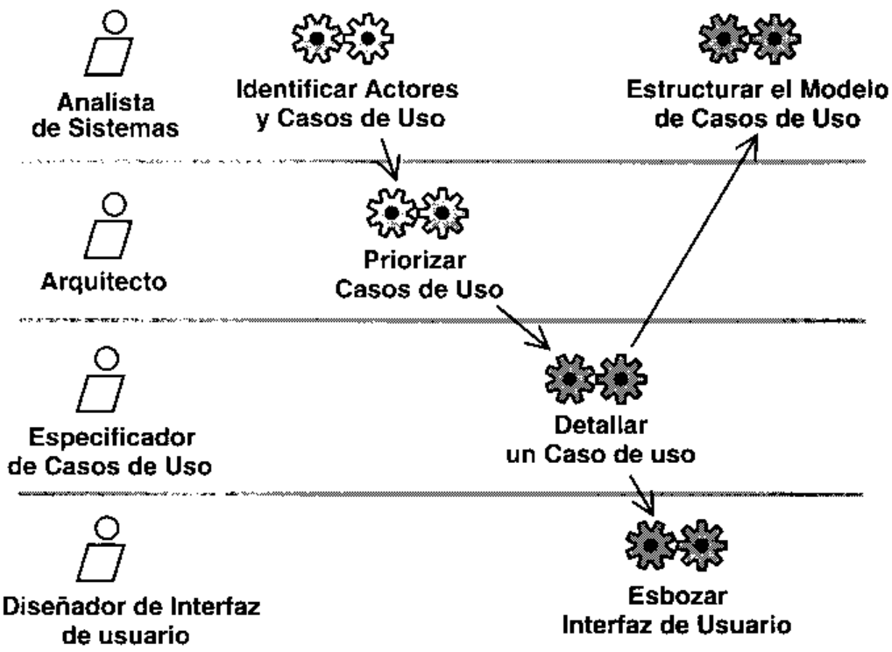

# PROCESO DUNIFICADODE DESARROLLODE SOFTWARE

IVARJACOBSONGRADYBOOCHJAMESRUMBAUGH

La guia completadel ProcesoUnificado escritapor sus creadoresBOOCHJACOBSONRUMBAUGH

# The Addison-Wesley Object Technology Series

Grady Booch, Ivar Jacobson, and James Rumbaugh, Series Editorsde cada libro [http:/www.awl.com/cseng/I-S-B-N/] (I-S-B-N- cs el numero de ISBN del libro en ingles, incluyendo los guiones).David Bcilin and Susan Suchman Simone, The CRC' Card BookISBN 0-201-89535-8

Grady Booch, Object Solutions: Managing the Object-OrientedProjectISBN 0-8053-0594-7

David Jordan. C- + Object Databases: Prograinming withthe ODMG StandardISBN 0-201-63488-0

Philippe Kruchten, The Rational Unified Process: An lntroductionISBN 0-20I-60459-0

Grady Booch, Object-Oriented Analysis and Design withApplicutions, Second EditionISBN 0-8053-5340-2

Wilf LaLonde, Discovering SmalltalkISBN 0-8053-2720-7

Grady Booch, James Rumbaugh, and lvar Jacobson,The Unified Modeling Language User Guide ISBN 0-201-57168-4

Lockheed Martin Advanced Concepts Center and RationalSoftwarc Corporation, Succeeding with the Booch and OMTMethods: A Practical Approach

Don Box, Essential COM

Thomas Mowbray and William Ruh, Inside CORBA:Distributed Object Standards and Applications

Don Box, Kcith Brown, Tim Ewald, and Chris Sclis, EffecriveCOM: 50 Ways to Improve Your (COM and MTS-based ApplicationsISBN 0-201-37968-6

ISBN 0-201-89550-1 Ira Pohl, Object-Oriented Programming Using C+-, Second EditionAlistair Cockburn, Surviving Object-Oriented Projecis:A Manager 's GuideISBN 0-201-49834-0

Rob Pooley and Perdita Stevens, Using UML: SofrwareEngineering with Objects and ComponentsISBN 0-201-36067-5

Dave Collins, Designing Ohject-Oriented User InterfacesISBN 0-8053-5350-X

Terry Quatrani, Visual Modeling with Rational Rose and UML

Bruce Powel Douglass, Doing Hard Tine:Designing andImplementing Embedded Systems with UMLISBN 0-201-49837-5

Brent E. Rector and Chris Sells, ATL InternalsISBN 0-201-69589-8

Bruce Powel Douglass, Real-Time UML: Developing EfficientOhjects for Embedded Systens

Doug Rosenberg with Kendall Scott, Use Case Driven ObjectModeling with UML: A Practical Approach

Walker Royce, Software Project Managenent: A Unified FrameworkDesmond F. D'Souza and Alan Cameron Wil1s, Ohjeets.Components, and Frameworks with UML: The Catalysis ApproachISBN 0-201-31012-0

Martin Fowler, Analysis Patterns: Reusable Ohject ModelsISBN 0-201-89542-0

William Ruh, Thomas Herron, and Paul Klinker, IOP Complete:MiddtewareInteroperabilityand Distributed OhjectStandardsMartin Fowler with Kendall Scott, UML DistilledApplying the Standard Object Modeling LanguageISBN 0-201-32563-2

James Rumbaugh. lvar Jacobson, and Grady Booch,The Unified Modeling Language Reference ManualISBN 0-201-30998-X

Petcr Heinckiens, Building Scalable Database Applications:Ohject-Oriented Design, Architectures, and ImplenentationsISBN 0-201-31013-9

Geri Schneider and Jason P. Winters, Applying Use Cases:A Practical GuideISBN 0-201-30981-5

Ivar Jacobson, Grady Booch, and Jamcs Rumbaugh,The Unified Software Development ProcessISBN 0-201-57169-2

Yen-Ping Shan and Ralph H. Earle, Enterprise Computingwith Objects: From Client/Server Environments to the InternetIvar Jacobson, Magnus Christerson, Patrik Jonsson, andGunnar Ovcrgaard, Object-Oriented Sofrware Engineering:A Use Case Driven Approach

David N. Smith, IBM Smalltalk: The Language

Ivar Jacobson, Maria Ericsson, and Agncta Jacobson,with Object Technology The Object Advantage: Business Process ReengineeringISBN 0-201-42289-1

Daniel Tkach, Waler Fang. and Andrew So, Visual ModelingTechnique: Ohject Technotogy Using Visual ProgrammingISBN 0-8053-2574-3

Danicl Tkach and Richard Puttick, Object Technology inApplication Development. Second EditionISBN 0-201-49833-2

lvar Jacobson, Martin Griss, and Patrik Jonsson.Sofrware Reuse: Architecture, Process und Organizationfor Business SuccessISBN 0-201-92476-5

Jos Wariner and Anneke Kleppe, The Object ConstraintLanguage: Precise Modeling with UMLISBN 0-201-37940-6

# EL PROCESO UNIFICADODEDESARROLLODE SOFTWARE

Ivar JACOBSONGrady BOOCHJames RUMBAUGHRATIONAL SOFTWARE CORPORATION

Traduccion:

Salvador SanchezUniversidad Pontificia de Salamanca en MadridMiguel Angel SiciliaUniversidad Pontificia de Salamanca en MadridCarlos CanalUniversidad de MalagaFrancisco Javier DuranUniversidad de Malaga

# Coordinacion de la traduccion y revision tecnica:

Luis Joyanes

Director del Departamento de Lenguajes y Sistemas InformaticosUniversidad Pontificia de Salamanca en Madrid

Ernesto Pimentel

Director del Departamento de Lenguajes y Sistemas InformaticosUniversidad de Malaga

# ADDISON WESLEY

Madrid · Mexico · Santafe de Bogota · Buenos Aires · Caracas · Lima · Montevideo · San JuanSan Jose · Santiago · Sao Paulo · White Plains

# 1. Jacobson, G. Booch, J. RumbaughEL PROCESO LNIFICADO DE DESARROLLO DE SOFTWARE

No esia permitida la reproduccion total o parcial de esta obrani su tratamiento o transimision por cualquier inedio o metodosin autorizacion escrita de la Editorial.

DERECHOS RESERVADOSO 2000 respecto a la primera edicion cn espaniol por:PEARSON EDUCACION, S. A.Nunez de Balboa, 12028006 Madrid

# ISBN: 84-7829-036-2

Dep0sito legal: M. 20.385-2000

ADDISON WESLEY es un sello editorial de PEARSON EDUCACION, S. A.Traducido de:THE UNIFIED SOFTWARE DEVELOPMENT PROCESSCopyright @ 1999 Addison Wesley Longman Inc.

ISBN: 0-201-57169-2

Edicion en espanot:Editor: Andrés OteroAsistente editorial: Ana Isabel GarciaDisenio de cubierta: DIGRAF, S. A.Composicion: COPIBOOK, S. L.Impreso por: Imprenta FARESO, S. A.IMPRESO EN ESPANA - PRINTED IN SPAIN

# Contenido

Prefacio XV

# Parte I:

# El Proceso Unificado de Desarrollo de Software

Capitulo 1:  El Proceso Unificado: dirigido por casos de uso,centrado en la arquitectura, iterativo e incremental.1.1.  El Proceso Unificado en pocas palabras 41.2.  El Proceso Unificado esta dirigido por casos de uso 51.3.  El Proceso Unificado esta centrado en la arquitectura  51.4.  El Proceso Unificado es iterativo e incremental 61.5. La vida del Proceso Unificado 81.5.1. El producto 91.5.2.  Fases dentro de un ciclo 101.6.  Un Proceso integrado 12

# Capitulo 2:   Las cuatro "p" en el desarrollo de software: Personas,Proyecto, Producto y Proceso.

2.1.  Las personas son decisivas 142.1.1.  Los procesos de desarrollo afectan a las personas 142.1.2.  Los papcles cambiaran 152.1.3.  Convirtiendo "recursos" en "trabajadores" 162.2.  Los proyectos construyen el producto 172.3. El producto es mas que codigo 182.3.1.  tQue es un sistema software? 182.3.2.Artefactos 18

2.3.3.  Un sistema posee una coleccion de modelos 192.3.4. &Que es un modelo? 202.3.5.  Cada modelo es una vista autocontenida del sistema 202.3.6. Dentro de un modelo 212.3.7.  Relaciones entre modelos 212.4.  El proceso dirige los proyectos 222.4.1. El proceso: una plantilla 222.4.2.  Las actividades relacionadas conforman flujos de trabajo 222.4.3. Procesos especializados 242.4.4. Meritos del proceso 252.5.  La herramientas son esenciales en el proceso 252.5.1.  Las herramientas influyen en el proceso . . . : 252.5.2.  El proceso dirige las herramientas 262.5.3.  El equilibrio entre el proceso y las herramientas 272.5.4.  El modelado visual soporta UML 272.5.5.  Las herramientas dan soporte al ciclo de vida completo 282.6.   Referencias . . 29

# Un proceso dirigido por casos de uso

3.1.  Desarrollo dirigido por casos de uso en pocas palabras . . : 333.2. Por que casos de uso? 353.2.1.  Para capturar los requisitos que aportan valor anadido 353.2.2.  Para dirigir el proceso 363.3.3.  Para idear la arquitectura y mas... 373.3. La captura de casos de uso . 383.3.1. El modelo de casos de uso representa los requisitos funcionales. 383.3.2. Los actores son el entorno del sistema 393.3.3.  Los casos de uso especifican el sistema 393.4. Analisis, diseno e implementacion para realizar los casos de uso . 403.4.1. Creacion del modelo de analisis a partir de los casos de uso 413.4.2. Cada clase debe cumplir todos sus roles de colaboracion 453.4.3. Creacion del modelo de disenio a partir del modelo de analisis  463.4.4.  Los subsistemas agrupan a las clases 493.4.5.  Creacion del modelo de implementacion a partir del modelo dediseno 503.5. Prueba de los casos de uso . 523.6. Resumen . 533.7.  Referencias 54

# Capitulo 4:    Un proceso centrado en la arquitectura 55

4.1. La Arquitectura en pocas palabras  564.2.  Por que es necesaria la arquitectura 584.2.1.  Comprension del sistema 584.2.2. Organizacion del desarrollo 594.2.3. Fomento de la reutilizacion 594.2.4.  Evolucion del sistema 604.3. Casos de uso y arquitectura 614.4.  Los pasos hacia una arquitectura 64

4.4.1. La linea base de la arquitectura es un sistema “"pequeno y flaco" 654.4.2. Utilizacion de patrones arquitectonicos 674.4.3.  Descripcion de la arquitectura . 694.4.4.  El arquitecto crea la arquitectura 714.5.  Por fin, una descripcion de la arquitectura . 724.5.1. La vista de la arquitectura del modelo de casos de uso 734.5.2. La vista de la arquitectura del modelo de disenio 744.5.3. La vista de la arquitectura del modelo de despliegue 764.5.4. La vista de la arquitectura del modelo de implementacion . 774.6.  Tres conceptos interesantes 784.6.1. &Que es una arquitectura? 784.6.2. &Como se obtiene? 784.6.3. :Como se describe? 784.7.  Referencias . 78

# Capitulo 5. Un proceso iterativo e incremental 81

5.1.  Iterativo e incremental en breve 825.1.1.  Desarrollo en pequenos pasos  835.1.2.  Lo que no es una iteracion 845.2.  Por que un desarrollo iterativo e incremental? . 855.2.1. Atenuacion de riesgos 855.2.2.  Obtencion de una arquitectura robusta 875.2.3. Gestion de requisitos cambiantes 875.2.4. Permitir cambios tacticos 885.2.5.  Conseguir una integracion continua 885.2.6.  Conseguir un aprendizaje temprano 905.3.  La aproximacion iterativa es dirigida por los riesgos 905.3.1.  Las iteraciones alivian los riesgos tecnicos  915.3.2.  La direccion es responsable de los riesgos no tecnicos 935.3.3. Tratamiento de los riesgos 935.4.  La iteracion generica 945.4.1.  Lo que es una iteraci6n 945.4.2. Planificacion de las iteraciones . . . 965.4.3. Secuenciaci6n de las iteraciones . . 965.5. El resultado de una iteracion es un incremento 975.6.  Las iteraciones sobre el ciclo de vida 985.7.  Los modelos evolucionan con las iteraciones 1005.8  Las iteraciones desafian a la organizacion 1015.9  Referencias 102

# Parte Il: Los flujos de trabajo fundamentales

# Capitulo 6: Captura de requisitos: de la vision a los requisitos 105

6.1.  Por que la captura de requisitos es complicada 1066.2.  El objeto del flujo de trabajo de los requisitos . 1076.3. Vision general de la captura de requisitos 1076.4.  El papel de los requisitos en el ciclo de vida del software . 1116.5.  La comprension del contexto del sistema mediante un modelo deldominio 1126.5.1. tQue es un modelo del dominio? 1126.5.2. Desarrollo de un modelo del dominio 1146.5.3. Uso del modelo del dominio 1156.6.  La comprension del contexto del sistema mediante un modelo del negocio. 1156.6.1. &Que es un modelo del negocio? 1156.6.2. Como desarrollar un modelo del negocio . 1186.6.3. Busqueda de casos de uso a partir de un modelo del negocio 1206.7.  Requisitos adicionales 1216.8. Resumen . 1236.9. Referencias 123

# Captura de requisitos como casos de uso

7.1. Introduccion 1257.2. Artefactos 1277.2.1. Artefacto: modelo de casos de uso 1277.2.2. Artefacto: actor 1287.2.3. Caso de uso 1297.2.4. Artefacto: descripcion de la arquitectura (vista del modelo decasos de uso) 1327.2.5. Artefacto: glosario 1337.2.6.  Artefacto: prototipo de interfaz de usuario 1337.3. Trabajadores 1337.3.1.  Trabajador: analista del sistema 1347.3.2.  Trabajador: especificador de casos de uso . . . 1357.3.3.  Disenador de interfaces de usuario 1357.3.4. Trabajador: arquitecto 1367.4.  Flujo de trabajo 1367.4.1. Actividad: encontrar actores y casos de uso 1387.4.2. Actividad: priorizar casos de uso 1467.4.3. Actividad: detallar un caso de uso 1477.4.4. Actividad: prototipar la interfaz de usuario 1527.4.5. Actividad: estructurar el modelo de casos de uso . 1587.5.  Resumen del flujo de trabajo de los requisitos 1627.6.  Referencias 163

# Analisis

8.1. Introduccion 1658.2.  El analisis en pocas palabras 1688.2.1.  Por que el analisis no es diseno ni implementacion 1688.2.2.  El objeto del analisis: resumen . 1698.2.3.  Ejemplos concretos de cuando hacer analisis 1708.3.  El papel del analisis en el ciclo de vida del software 1718.4. Artefactos 1728.4.1. Artefacto: modelo de analisis 1728.4.2. Artefacto: clase del analisis 1738.4.3. Artefacto: realizacion de caso de uso-analisis 177

8.4.4.  Artefacto: paquete del analisis 1818.4.5. Artefacto: descripcion de la arquitectura (vista del modelo deanalisis) .. 1838.5. Trabajadores 1848.5.1. Trabajador: arquitecto 1848.5.2. Trabajador: ingeniero de casos de uso 1858.5.3. Trabajador: ingeniero de componentes 1868.6. Flujo de trabajo 1878.6.1. Actividad: analisis de la arquitectura 1878.6.2. Actividad: analizar un caso de uso 1948.6.3. Actividad: analizar una clase 1978.6.4.  Actividad: analizar un paquete 2018.7.  Resumen del analisis 2038.8. Referencias 204

# Capitulo 9: Diseno 205

9.1. Introduccion 2059.2.  El papcl del diseno en el ciclo de vida del software 2079.3. Artefactos 2089.3.1. Artefacto: modelo de disenio 2089.3.2. Artefaclo: clase del diseno 2099.3.3. Artefacto: realizacion de caso de uso-diseho 2109.3.4. Artefacto: subsistema del diseno . 2139.3.5. Artefacto: interfaz 2159.3.6. Artefacto: descripcion de la arquitectura (vista del modelo dediseno) . 2169.3.7. Artefacto: modelo de despliegue . 2179.3.8. Artefacto: descripcion de la arquitectura (vista del modelo dedespliegue) 2189.4. Trabajadores 2189.4.1. Trabajador: arquitecto 2189.4.2.  Trabajador: ingeniero de casos de uso 2199.4.3. Trabajador: ingeniero de componentes 2209.5. Flujo de trabajo 2209.5.1. Actividad: diseno de la arquitectura 2219.5.2. Actividad: disenar un caso de uso . 2379.5.3. Actividad: disenar una clase 2439.5.4.  Actividad: disenar un subsistema 2509.6.  Resumen del diseno 2519.7.  Referencias 253

# Implementacion

10.1. Introduccion 25510.2.  El papel de la implementacion en el ciclo de vida del software 25610.3. Artefactos 25710.3.1. Artefacto: modelo de implementacion 25710.3.2. Artefacto: componente 257

10.3.3. Artefacto: subsistema de la implementacion . . 26010.3.4. Artefacto: interfaz 26210.3.5. Artefacto: descripcion de la arquitectura (vista del modelo deimplementaci6n) 26310.3.6. Artefacto: plan de integracion de construcciones 26410.4. Trabajadores . 26510.4.1. Trabajador: arquitecto 26510.4.2. Trabajador: ingeniero de componentes . . 26610.4.3. Trabajador: integrador de sistemas 26610.5. Flujo de trabajo 26710.5.1.  Actividad: implementacion de la arquitectura 26810.5.2. Actividad: integrar el sistema 27010.5.3. Actividad: implementar un subsistema 27210.5.4. Actividad: implementar una clase 27410.5.5.  Actividad: realizar prueba unidad 27610.6.  Resumcn de la implementacion . : 27910.7.  Referencias . 279

, Capitulo 11: : Prueba .

11.1. Introducci6n 28111.2.  El papel de la prueba en el ciclo de vida del software 28211.4.1.  Trabajador: diseniador de pruebas 28811.4.2.  Trabajador: ingeniero de componentes 28911.4.3.  Trabajador: ingeniero de pruebas de integracion 28911.4.4. 28911.3. Artefactos. 28311.3.1. Artefacto: modelo de pruebas 28311.3.2.  Artefacto: caso de prueba 28311.3.3. Artefacto: procedimiento de prueba 28611.3.4. Artefacto: componente de prueba 28711.3.5. Artefacto: plan de prueba 28811.3.6. Artefacto: defecto 28811.3.7. Artefacto: evaluacion de prueba 28811.4. Trabajadores 28811.5. Flujo de trabajo  Trabajador: ingeniero de pruebas del sistema. 29011.5.1. Actividad: planificar prueba 29111.5.2. Actividad: disenar prueba 29211.5.3.  Actividad: implementar prueba 29511.5.4.  Actividad: realizar pruebas de integraci6n 29611.5.5.  Actividad: realizar prueba de sistema 29711.5.6.  Actividad: evaluar prueba 29711.6.  Resumen de la prueba 29911.7. Referencias . 299

# Parte Ill: El Desarrollo iterativo e incremental

Capitulo 12: :  El flujo de trabajo de iteracion generico 30312.1.  La necesidad de equilibrio 30412.2.  Las fases son la primera division del trabajo 30512.2.1.  La fase de inicio establece la viabilidad 30512.2.2.  La fase de elaboracion se centra en la factibilidad 30612.2.3. La fase de construccion construye el sistema 30712.2.4.  La fase de transicion se mete dentro del entorno del usuario 30812.3. La iteraci6n generica 30812.3.1.  Los flujos de trabajo fundamentales se repiten en cadaiteracion 30812.3.2.  Los trabajadores participan en los flujos de trabajo 30912.4.  El planificar precede al hacer 31012.4.1. Planear las cuatro fases 31112.4.2.  Plan de iteraciones 31212.4.3.  Pensar a largo plazo 31312.4.4.  Planear los criterios de evaluacion 31312.5.  Los riesgos influyen en la planificacion del proyecto 31412.5.1. Administrar la lista de riesgos 31412.5.2.  Los riesgos influyen en el plan de iteracion 31512.5.3. Planificar la accion sobre los riesgos 31612.6.  Asignacion de prioridades a los casos de uso 31612.6.1. Riesgos especificos de un producto particular 31712.6.2. Riesgo de no conseguir la arquitectura correcta 31712.6.3.  Riesgo de no conseguir los requisitos correctos 31912.7.  Recursos necesitados 31912.7.1. Los proyectos difieren enormemente 32012.7.2.  Un proyecto tipico tiene este aspecto 32112.7.3.  Los proyectos mas grandes tienen mayores necesidades  32112.7.4.  Una nueva linea de productos requiere experiencia 32212.7.5. El pago del coste de los recursos utilizados  32312.8. Evaluar las iteraciones y las fases 32412.8.1. Criterios no alcanzados 32412.8.2. Los criterios mismos 32512.8.3. La siguiente iteracion 32512.8.4. Evolucion del conjunto de modelos 326

# Capitulo 13: La fase de inicio pone en marcha el proyecto 327

13.1.  La fase de inicio en pocas palabras 32713.2.  Al comienzo de la fase de inicio 32813.2.1. Antes de comenzar la fase de inicio 32813.2.2.  Planificacion de la fase de inicio 32913.2.3. Ampliacion de la descripci6n del sistema 33013.2.4. Establecimiento de los criterios de evaluacion 33013.3.  Flujo de trabajo arquetipico de una iteracion en la fase de inicio 33213.3.1. Introduccion a los cinco flujos de trabajo fundamentales . 33213.3.2. Ajuste del proyecto al entorno de desarrollo 33413.3.3.  Identificacion de los riesgos criticos 33413.4. Ejecucion de los flujos de trabajo fundamentales, de requisitosa pruebas 33413.4.1. Recopilacion de requisitos 335

13.4.2. Analisis 33713.4.3. Diseno 33813.4.4. Implementacion 33913.4.5. Pruebas 33913.5.  Realizacion del analisis inicial de negocio 34013.5.1. Esbozar la apuesta economica 34013.5.2.  Estimar la recuperacion de la inversion 34113.6.  Evaluacion de la iteracion o iteraciones de la fase de inicio 34113.7.  Planificacion de la fase de elaboracion 34213.8.  Productos de la fase de inicio 343

# Capitulo 14: La fase de elaboracion construye la linea basede la arquitectura . . 345

14.1.  La fase de elaboracion en pocas palabras 34514.2.  Al comienzo de la fase de elaboracion 34614.2.1.  Planificacion de la fase de elaboracion 34614.2.2.  Formacion del equipo 34714.2.3.  Modificacion del entorno de desarrollo 34714.2.4.  Establecimiento de criterios de evaluacion 34714.3.  Flujo de trabajo arquetipico de una iteracion en la fase deelaboracion 34814.3.1.  Recopilacion y rcfinamiento de la mayor parte de losrequisitos 34914.3.2.  Desarrollo de la linea base de la arquitectura 34914.3.3.  Iterando mientras el equipo es pequeno 35014.4.  Ejecucion de los flujos de trabajo fundamentales, de requisitosa pruebas 35014.4.1. Recopilar los requisitos  35114.4.2. Analisis 35314.4.3. Diseno 35714.4.4. Implementacion 36014.4.5. Pruebas 36114.5.  Desarrollo del analisis del negocio 36314.5.1.  Preparar la apuesta economica 36314.5.2.  Actualizar la recuperacion de la inversion 36314.6. Evaluacion de las iteraciones de la fase de elaboracion . . 36414.7.  Planificacion de la fase de construccion 36414.8. Productos clave 365

# Capitulo 15:   La construccion lleva a la capacidad operacion inicila 367

15.1.  La fase de construccion en pocas palabras 36715.2. Al comienzo de la fase de construccion . 36815.2.1. Asignacion de pcrsonal para la fase . 36815.2.2. Establecimiento de los criterios de evaluacion 36915.3.  Flujo de trabajo arquetipico de una iteracion en la fase de construccion 37015.4. Ejecucion de los flujos de trabajo fundamentales, de requisitosa pruebas . 37115.4.1. Requisitos 372

15.4.2. Analisis 37315.4.3. Diseho 37415.4.4. Implementacion 37515.4.5.  Pruebas 37715.5. Control del analisis de negocio 37815.6. Evaluacion de las iteraciones y de la fase de construccion 37815.7. Planificacion de la fasc de transicion . 37915.8. Productos clave 379

# Capitulo 16:  La transicion completa la version del producto . . . : 381

16.1.  La fase de transicion en pocas palabras 38216.2.  Al comienzo de la fase de transicion 38316.2.1.  Planificacion de la fase de transicion 38316.2.2.  Asignacion dc personal para la fase 38416.2.3.  Establecimiento de los criterios de evaluaci6n 38516.3.  Los flujos de trabajo fundamentales desempenan un papel pequenoen esta fase. . 38516.4.  Lo que se hace en la fase de transicion 38616.4.1. Preparacion de la version beta 38716.4.2. Instalacion de la version beta 38716.4.3. Rcaccion a los resultados de las pruebas 38816.4.4. Adaptacion del producto a entornos de usuario variados 38816.4.5. Finalizacion de los artefactos 39016.4.6. : Cuando acaba el proyecto? 39016.5. Finalizacion del analisis del negocio 39116.5.1. Control del progreso 39116.5.2. Revision del plan del negocio 39116.6.  Evaluacion de la fase de transicion 39116.6.1. Evaluacion de las iteraciones y de la fase 39216.6.2. Autopsia del proyecto 39216.7.  Planificacion de la proxima version o generacion . . 39316.8. Productos clave 393

# Capitulo 17: Como hacer que el Proceso Unificado funcione 395

17.1.  El Proceso Unificado ayuda a manejar la complejidad 39517.1.1.  Los objetivos del ciclo de vida 39617.1.2.  La arquitectura del ciclo de vida 39617.1.3. Capacidad operativa inicial 39717.1.4. Lanzamiento del producto 39717.2. Los temas importantes 39717.3. La direccion lidera la conversion al Proceso Unificado 39817.3.1. La necesidad de actuar 39917.3.2. La directriz de reingenieria 39917.3.3.  Implementacion de la transicion 40017.4. Especializacion del Proceso Unificado 40217.4.1. Adaptacion del proceso . 40217.4.2. Completando el marco de trabajo del proceso 40317.5.  Relacion con comunidades mas amplias 40317.6.  Obtenga los beneficios del Proceso Unificado 40417.7. Referencias . 405

# Apendice A:  Vision general del UML 407

A.1.  Introduccion 407A.1.1. Vocabulario 408A.1.2.  Mecanismos de extensibilidad 408A.2. Notacion grafica 409A.2.1. Cosas estructurales 409A.2.2. Elementos de comportamiento . 410A.2.3.  Elementos de agrupacion 411A.2.4. Elementos de anotacion 411A.2.5.  Relaciones de dependencia . 411A.2.6.  Relaciones de asociacion 411A.2.7.  Relaciones de generalizacion 412A.2.8.  Mecanismos de extensibilidad 412A.3. Glosario de terminos 412A.4.  Referencias 418B.1.  Introduccion 419B.2. Estereotipos 419B.3. Valores etiquetados 422B.4.  Notacion grafica 424B.5.  Referencias 424

# Apendice C:  Glosario general

C.1. Introduccion 425C.2. Términos

# Prefacio

ay gente que cree que las empresas profesionales deberian organizarse en torno a las habilidades de individuos altamente cualificados, que saben como hacer el trabajo y lohacen bien, y que raramente necesitan direccion sobre las politicas y procedimientos de laorganizacion para la que trabajan.

Esta creencia es una equivocacion en la mayoria de los casos, y una grave equivocacion en elcaso del desarrollo de sofftware. Por supuesto, los desarrolladores de software estan altamentecualificados, pero la profesion es aun joven. En consecuencia, los desarrolladores necesitandireccion organizativa, a la cual, en este libro, llamamos "proceso de desarrollo de software".Ademas, debido a que el proceso que ponemos en marcha en este libro representa la union demetodologias antes separadas, nos sentimos justificados al llamarlo “Proceso Unificado". Nos6lo reune el trabajo de tres autores, sino que incorpora numerosas aportaciones de otras per- sonas y empresas que han contribuido a UML, asi como un numero significativo de aportacio-la experiencia directa de cientos de organizaciones que han trabajado en sus oficinas con lasprimeras versiones del proceso.

musicos cuando comenzar y ayudarles a tocar juntos. El o ella no puede hacer mas porque ha Un director de una orquesta sinfonica durante un concierto hace poco mas que decir a losdirigido a la orquesta durante los ensayos y la preparacion de las partituras, y porque cada mu-del resto de los otros miembros de la orquesta. Lo que es mas importante para nuestros pro-positos, cada musico sigue un “"proceso" diseiado hace mucho tiempo por el compositor. Es lapartitura musical la que proporciona el grueso de "la politica y el procedimiento” que guian elconcierto. En contraste, los desarrolladores de software no trabajan de manera independiente:interaccionan unos con otros y con los usuarios. No tienen una partitura --mientras no tengan unproceso.

La necesidad de un proceso promete hacerse mas critica, especialmente en empresas u or-ganizaciones en las cuales los sistemas software son esenciales, tales como las financicras, las decontrol de trafico aereo, las de defensa y las de sistemas de telecomunicaciones. Con esto que-del software que la soporta. Estos sistemas software se hacen mas complejos, su tiempo de sa-lida al mercado necesita reducirse, y su desarrollo, por tanto, se hace mas dificil. Por razonesque una orquesta necesita la partitura de un compositor para dirigir cl concierto.

# Que es un proceso de desarrollo de software?

En la ingenieria del software el objetivo es construir un producto software o mejorar unocxistente. Un proccso efectivo proporciona normas para cl desarrollo eficiente de software de ca-lidad. Captura y presenta las mejores practicas que el estado actual de la tecnologia permite. Enconsecuencia, reduce el riesgo y hace el proyecto mas predecible. El efecto global es el fomentodc una vision y una cultura comunes.

Es necesario un proceso que sirva como guia para todos los participantes -—clientes, usuarios,desarrolladorcs y directores ejecutivos. No nos sirve ningun proceso antiguo; necesitamos unopuedan comprender su papel en el desarrollo en el que se encuentran implicados.

Un proceso de desarrollo de software deberia tambien ser capaz de evolucionar durante mu-chos anos. Durante esta evolucion deberia limitar su alcance, en un momento del tiempo dado,· Tecnologias. El proceso debe construirse sobre las tecnologias —lenguajes de programa-cion, sistemas operativos, computadores, estructuras de red, cntornos de desarrollo, etc.--disponibles en el momento en que sc va a emplear el proceso. Por ejemplo, hace veinteanos el modelado visual no era realmente de uso general. Era demasiado caro. En aquellosmas hechos a mano. Esa suposicion limitaba mucho el grado en el cual el creador delproceso podia establecer el modelado dentro del proceso.

· Herramientas. Los procesos y las herramientas deben desarrollarse en paralelo. Lasherramientas son esenciales en el proceso. Dicho de otra forma, un proceso ampliamenteutilizado puede soportar la inversion necesaria para crear las herramientas que lo soporten.· Personas. Un creador del proceso debe limitar el conjunto de habilidades necesarias paratrabajar en el proceso a las habilidades que los desarrolladores actuales poseen, o apuntarherramientas software tecnicas que antes requerian amplios conocimientos, como la com-probacion de la consistencia en los diagramas del modelo.

· Patrones de organizacion. Aunque los desarrolladores de software no pueden ser expertostan independientes como los musicos de una orquesta, estan muy lejos de los trabajado-res automatas en los cuales Frederick W. Taylor bas6 su “direccion cientifica" hacecien anos. El creador del proceso debe adaptar el proceso a las realidades del momento-hechos como las empresas virtuales; el trabajo a distancia a traves de lineas de alta ve-locidad; la mezcla (en empresas pequenas recién montadas) de socios de la empresa, em-pleados asalariados, trabajadores por obra, y subcontratas de outsourcing: y la prolongadaescasez de desarrolladores dc software.

Los ingenieros del proceso deben equilibrar estos cuatro conjuntos de circunstancias. Ade-mas, el equilibrio debe estar presente no solo ahora, sino también en el futuro. El creador delproceso debe disenar el proceso de forma que pueda evolucionar, de igual forma que el desa-rrollador de software intenta desarrollar un sistema que no solo funciona este anio, sino que evo-luciona con éxito en los anos venideros. Un proceso debe madurar durante varios anos antes dealcanzar el nivel de estabilidad y madurez que le permitira resistir a los rigores del desarrollo deproductos comerciales, manteniendo a la vez un nivel razonable de riesgo en su utilizacion. Eldesarrollo de un producto nuevo es bastante arriesgado en si mismo como para anadirle el ries-go de un proceso que este poco validado por la experiencia de su uso. En estas circunstancias, unproceso puede ser estable. Sin este equilibrio de tecnologias, herramientas, personas y organi-zacion, el uso del proceso seria bastante arriesgado.

# Objetivos de este libro

Este libro prcsenta el proceso de desarrollo que estuvo constantemente en nuestras cabezasmientras desarrollabamos el Lenguaje Unificado de Modelado. Aunque UML nos ofrece unmodo estandar de visualizar, especificar, construir, documentar y comunicar los artefactos de unsistema muy basado en el software, por supuesto somos conscientes de que un lenguaje comoéste debe utilizarse en el contexto de un proceso de software completo. UML es un medio, y noun fin. El objetivo final es una aplicacion software robusta, flexible y escalable. Es necesariotanto un proceso como un lenguaje para poder obtenerla, y el objetivo de este libro es mostrar laparte del proceso. Aunque proporcionamos un breve apendice sobre UML, no pretende ser com-pleto ni detallado. Para un tutorial detallado sobre UML, remitimos a El Lenguaje Unificado deModelado, traduccion de la Guia de Usuario del Lenguaje Unificado de Modelado [11]. Parauna referencia completa de UML remitimos al Lenguaje Unificado de Modelado Manual de Re-ferencia [12].

# Audiencia

Este libro esta destinado a cualquier persona implicada en el desarrollo de software. Se dirigeprincipalmente a miembros del equipo de desarrollo que se dedican a las siguientes actividadesdel ciclo de vida: requisitos, analisis, diseno, implementacion y pruebas —es decir, a trabajosque producen modelos UML. Asi, por ejemplo, este libro es uitil para analistas y usuarios finalesde aplicaciones (que disenan los sistemas que satisfacen esos requisitos), para programadores(que convierten esos disenos en codigo ejecutable), para ingenieros de prueba (que verifican yvalidan la estructura y comportamiento del sistema), para desarrolladores de componentes

Este libro presupone un conocimiento basico de conceptos de orientacion a objetos. Tambienes util, pero no se requiere, experiencia en desarrollo de software y en alguin lenguaje orientadoa objetos.

# Metodo del libro

Hemos dedicado la mayoria del espacio de este libro a aquellas actividades —-requisitos, anali-sis y disenio— sobre las cuales UML hace mayor hincapie. Es en esas areas de mayor énfasis enlas que el proceso desarrolla la arquitectura de sistemas software complejos. Sin embargo, tra-tamos el proceso completo, aunque con menos detalle. No en vano, es el programa ejecutable elque se ejecuta finalmente. Para legar hasta él, un proyecto depende de los esfuerzos de cadamiembro del equipo, asi como del soporte de los usuarios. Como se vera, el proceso descansa enuna tremenda variedad de actividades. Es necesario producir y hacer el seguimiento de muchosartefactos. Todas las actividades deben gestionarse.

El tratamiento completo del ciclo del ciclo de vida queda fuera de la intencion de cualquierlibro. Un libro que lo hiciese tendria que cubrir normas de disenio, plantillas para los artefactos,indicadores de calidad, gestion del proyecto, gestion de la configuracion, metricas y mas, mu-cho mas! Con el desarrollo del acceso interactivo, ese “mas" esta hoy disponible, y puede ac-tualizarse segun dicten los nuevos avances. Por esto, remitimos al lector al Proceso Unificado deRational, un producto software que puede utilizarse desde la Web, que orienta a los equipos dedesarrollo hacia practicas de desarrollo de software mas efectivas. (Consultar para mas infor-macion http://www.rational.com.) Al cubrir el ciclo de vida completo, el Proceso Unificado deRational extiende el Proceso Unificado mas alla de las areas descritas en este libro y ofrece flu-jos de trabajo adicionales que este libro no cubre o que menciona solo de pasada, como el mo.delado del negocio, la gestion del proyecto, y la gestion de la configuracion.

# Historia del Proceso Unificado

El Proceso Unificado esta equilibrado por ser el producto final de tres decadas de desarrollo yuso practico. Su desarrollo como producto sigue un camino (vease la Figura P.1) desde el Pro-ceso Objectory (primera publicaci6n en 1987) pasando por el Proceso Objectory de Rational(publicado en 1997) hasta el Proceso Unificado de Rational (publicado en 1998). Su desarrollo

ha recibido influencias de muchas fuentes. No pretendemos tratar de identificarlas todas (real-mente no sabemos cuales son todas), trabajo que dejamos a la investigacion de los arqueologosdel software. Sin embargo, describiremos la influencia sobre el producto de los metodos deEricsson y de Rational, asi como el de varias otras fuentes.

El Proceso Unificado posee raices profundas. En palabras de Peter F. Drucker, es una "innova-cion basada en el conocimiento". El nos informa de que “"hay un lapso de tiempo prolongado en-d  o p  rde ooi bau s   s ood o o ptos, procesos o servicios." [1]

Un motivo para este largo tiempo de aparici6n es que la innovacion basada en el conoci-miento se cimienta en la union de muchos tipos de conocimiento, y esto lleva su tiempo. Otrarazon es que las personas que tienen que hacer efectiva la nueva idea necesitan tiempo paradigerirla y comunicarla a los demas.

Como primer paso hacia el alumbramiento del desarrollo del Proceso Unificado, nos re-montaremos a 1967 para esbozar los logros de Ericsson [14], [15], [16]. Ericsson modelaba elsistema entero como un conjunto de bloques interconectados (en UML, se los conoce como"subsistemas" y se implementan mediante “componentes"). Despues, ensamblaba los bloques demas bajo nivel en subsistemas de mas alto nivel, para hacer el sistema mas manejable. Identifi-caban los bloques estudiando los casos de negocio —hoy conocidos como “casos de uso"-—, pre-viamente especificados. Para cada caso de uso, identificaban los bloques que debian cooperarpara realizarlo. Con el conocimiento de las responsabilidades de cada bloque, preparaban su es-pecificacion. Sus actividades de disenio producian un conjunto de diagramas de bloques estaticoscon sus interfaces, agrupados en subsistemas. Estos diagramas de bloques se corresponden di-rectamente con una version simplificada de los diagramas de clases o paquetes de UML —sim-plificados en que solo mostraban las asociaciones que se utilizaban para comunicaciones.

El primer producto del trabajo de las actividades de diseno era una descripcion de arquitec-tura software. Se basaba en la comprensi6n de los requisitos mas criticos, y describia breve-describian a los bloques y a sus interconexiones. Sobre las interconexiones se comunicaban se-nales, es decir, un tipo de mensaje. Todos los mensajes quedaban descritos, uno por uno, en unabiblioteca de mensajes. La descripcion de la arquitectura software y la biblioteca de mensajeseran los documentos fundamentales que guiaban el trabajo de desarrollo, pero también se utili-zaban para presentar el sistema a los clientes. En aquellos momentos (1968) los clientes noestaban acostumbrados a que les presentasen los productos software por medios similares a losdatos de proyectos de ingenieria.

Para cada caso de uso, los ingenieros preparaban bien un diagrama de secuencia o bien undiagrama de colaboracion (hoy desarrollados adicionalmente en UML). Estos diagramas mos-traban como los bloques se comunicaban dinamicamente para levar a cabo el caso de uso. Pre-paraban una especificacion en forma de grafo de estados (que incluia solo estados y transiciones)y un grafo de transicion de estados (una version simplificada de los diagramas de actividad deUML). Este metodo, el disenar a partir de bloques con interfaces bien definidos, fue la clave deld s - s   u   d s  scliente nuevo —-intercambiando un bloque por otro que proporcionase las mismos interfaces.

Por tanto, los bloques no eran solo subsistemas y componentes de codigo fuente; sc compi-laban en bloques ejecutables, se instalaban en la maquina destino uno por uno, y se comproba-ba que funcionaban con el resto de los bloques ejecutables. Es mas, debia ser posible instalarcada bloque ejecutable, nuevo o modificado, sobre la marcha en un sistema en ejecuci6n,mientras éste gestionaba llamadas de sistemas de telefonia en operacion durante el 1o0 porciento del tiempo. No se puede parar sistemas de cse tipo solo para hacer cambios. Seria comocambiar las ruedas a un coche que circula a loo kilometros por hora.

En esencia, el metodo quc utilizaban era el que hoy conocemos como desarrollo basado encomponentes. Ivar Jacobson fue el creador dc este metodo de desarrollo. El dirigio su evolucionhacia un proceso de desarrollo de software durante muchos anos cn el periodo anterior a Objectory.

# El Lenguaje de Descripcion y Especificacion

p d d ai  n   od s  oorganismo internacional para la estandarizacion en el area de las telccomunicaciones, del Len-guaje de Especificacion y Descripcion (Specification and Description Language, SDL) para elnificativamente por el metodo de Ericsson, especificaba un sistema como un conjunto de blo-ques interconectados que se comunicaban unos con otros uinicamente a traves de mensajes(llamados “"seniales" en el estandar). Cada bloque poseia un conjunto de “proccsos", que era elbr p ssn so osd u 'a ss s is  Ts orecida a como lo hacen las clases en terminos de orientacion a objetos. Las instancias de los pro-cesos interactuaban mediante mensajes. SDL proponia diagramas que cran especializaciones delo que hoy UML llama diagramas de clases, diagramas de actividad, diagramas de colaboraciony diagramas de secuencia.

Por tanto, SDL era un estandar de modelado de objetos especializado. Se actualiza periodicamente, y todavia lo utilizan mas de 10.000 desarrolladores y cuenta con el soporte de variosfabricantes de herramientas. Fue desarrollado iniciaimente hace veinte anos, y estaba muy pordelante de su tiempo. Sin embargo, se desarroll6 en un momento en el cual el modelado de ob-jetos no habia madurado. Probablemente. SDL sera sustituido por UML, que se estandarizo er1997.

# Objectory

En 1987 Ivar Jacobson dej6 Ericsson y fund6 Objectory AB en Estocolmo. Durante los si-guientcs ocho anos, él y sus colaboradores desarrollaron un proceso denominado Objectory("Objectory" es una abreviatura de "Object Factory", fabrica de objetos). Extendieron su uso enotras industrias ademas de las de telecomunicaciones, y en otros paises aparte de Suiza.

le habia dado un nombrc (que se present6 en la conferencia OOPSLA de 1987), se habia desa-rrollado una tecnica de representacion, y la idea se habia ampliado para abarcar una variedad deaplicaciones. Es decir, los casos de uso que dirigian el desarrollo se hicieron mas claros. Dichode otro modo, la arquitectura que conduce a los desarrolladores e informa a los usuarios co-menzo a destacar.

Los flujos de trabajo sucesivos se representaron en una serie de modelos: requisitos-casos deuso, analisis, disehio, implementacion y prueba. Un modelo es una perspectiva del sistema. Lasrelaciones entre los modelos de esta serie eran importantes para los desarrolladores como formade hacer el seguimiento de una caracteristica de un extremo a otro de la serie de modelos. De he.cho, la trazabilidad se convirtio en un prerrequisito del desarrollo dirigido por casos de uso. Losta el codigo fuente o bien, cuando surgian problemas, volver hacia atras.

El desarrollo del proceso Objectory continu6 en una serie de versiones, desde Objectory 1.0en 1988 a la primcra version interactiva, Objcctory 3.8, cn 1995 (puede consultarse una visiongeneral de Objectory en [2]).

ss u oo sa os e oil oo nd oidod pe an u sonu ima. Esta forma de describir un proceso —como un producto en forma de sistema—- proporcio-naba una manera mejor de desarrollar una nueva version de Objectory a partir de una anterior.Este modo de desarrollar Objectory hizo mas facil el ajustarlo para cubrir las necesidades es-pecificas de diferentes organizaciones de desarrollo. El hecho de que el propio proceso de de-

La experiencia en el desarrollo de Objectory también aporto ideas sobre como disenar losestos se recogieron en un libro en 1995 [3]

Rational Software Corporation compr6 Objectory AB a finales de 1995 y la tarea de unificar losprincipios basicos subyacentes en los procesos de desarrollo existentes adquirio una urgencia es-pecial. Rational habia desarrollado algunas practicas de desarrollo de software, la mayoria deellas complementarias a las contenidas en Objectory.

Por cjemplo, como recordaron James E. Archer Junior y Michael T. Devlin en 1986 [4], "En1981. Rational se dispuso a crear un entorno interactivo que mejoraria la productividad en el de-sarrollo dc grandcs sistemas software". A continuacion dijeron que en este esfuerzo, eranimportantes cl discno orientado a objetos, la abstraccion, la ocultacion de la informacion, la reu-tilizacion y el prototipado.

Muchos libros, articulos y documentos internos detallan los desarrollos de Rational desde1981. pero quiza las dos contribuciones mas importantes al proceso fueron los énfasis en laarquitectura y en el desarrollo iterativo. Por ejemplo, en 1990, Mike Devlin escribi6 un articu-lo introductorio sobre un proceso de desarrollo iterativo dirigido por la arquitectura. PhilippeKruchten, a cargo de la division de Practicas de Arquitectura en Rational, firmo articulos sobrela iteracion y la arquitectura.

Mencionaremos uno de ellos, un articulo sobre una representacion de la arquitectura con cua-tro vistas: la vista logica, la vista de procesos, la vista fisica, y la vista de desarrollo, mas una vis-ta adicional que ilustraba las primeras cuatro vistas mediante casos de uso o escenarios [6]. Laidea de tener un conjunto de vistas, en lugar de tratar de meter todo en un unico tipo de diagra-ma, nacio de la experiencia de Kruchten en varios proyectos grandes. Las vistas multiplespermitieron encontrar, tanto a los usuarios como a los desarrolladores, lo que necesitaban parasus diferentes objetivos con la vista adecuada.

Hay gente que percibe el desarrollo iterativo como algo caotico o anarquico. El metodo decuatro fases (comienzo, elaboraci6n, construccion y transicion) se disen6 para estructurar mejory controlar el proceso durante las iteraciones. La planificacion detallada de las fases y la orde-nacion de las iteraciones dentro de las fases fue un esfuerzo conjunto entre Walker Royce y RichReitman, junto con la participacion continua de Grady Booch y Philippe Kruchten.

Booch estaba presente desde los principios de Rational, y en 1996 en uno de sus libros men-· “Un estilo de desarrollo dirigido por la arquitectura es normalmente la mejor aproximacionpara la creacion de la mayoria de los proyectos complejos muy basados en el software."· “Para que un proyecto orientado a objetos tenga éxito, debe aplicarse un proceso iterativoe incremental." [7]

# El Proceso Objectory de Rational: 1995-1997

En el momento de la fusion, Objectory 3.8 habia demostrado que se puede crear y modelar unproceso de desarrollo software como si fuese un producto. Habia disenado la arquitectura original de un proceso de desarrollo software. Habia identificado un conjunto de modelos quedocumentaban el resultado del proyecto. Estaba correctamente desarrollado en areas como elte de los casos de uso, implementacion y pruebas—-no estaba tan bien desarrollado. Ademas,decia poco sobre gestion del proyecto, gestion de la configuracion, distribucion, y sobre laPor ello se le anadieron la experiencia y practicas de Rational para formar el ProcesoObjectory de Rational 4.1. Se anadieron, en concreto, las fases y la aproximacion iterativa con-trolada. Se hizo explicita la arquitectura en forma de una descripcion de la arquitectura —la"Biblia" de la organizacion de desarrollo de software.

Se desarroll6 una definicion precisa de la arquitectura, considerada como la parte mas sig-nificativa de la organizacion del sistema. Representaba la arquitectura como vistas arquitecto-nicas de los modelos. Se amplio el desarrollo iterativo, pasando de ser un concepto relativamente

En estos momentos, UML estaba en fase de desarrollo y se incorporo como cl lenguaje demodelado del Proceso Objectory de Rational (Rational Objectory Process, ROP). Los autores deeste libro colaboraron como creadores originales de UML. El equipo de desarrollo del proceso,liderado por Philippe Kruchten, corrigio algunas de las debilidades del ROP reforzando, porejemplo, la gestion del proyecto, basada en aportaciones de Royce [8].

# El Lenguaje Unificado de Modelado

Era evidente desde hace alguin tiempo la necesidad de un lenguaje de modelado visual y con-sistente, en el cual expresar los resultados de las bastante numerosas metodologias de orientaciona objetos existentes a principios de los noventa.

Durante este periodo, Grady Booch, por ejemplo, era el autor del método Booch [9], y JamesRumbaugh era el desarrollador principal de OMT (Object Modelling Technique) [10j creado enel Centro de Investigacion y Desarrollo de General Electric. Cuando este iltimo se incorporo aRational en Octubre de 1994, los dos comenzaron el trabajo de unificar sus metodos, en coor-dinacion con muchos de los clientes de Rational. Publicaron la version O.8 del Metodo Unificadoen Octubre de 1995, casi en el mismo momento de la incorporaci6n de Ivar Jacobson a Rational.

Los tres, trabajando juntos, publicaron la version 0.9 del Lenguaje Unificado de Modelado.cluian a IBM, HP y Microsoft, cada una de las cuales contribuy6 al estandar en evolucion. Ennoviembre de 1997, después de pasar por el proceso de estandarizacion, el Object Managemento       s   o odla Guia de Usuario [11] y al Manual de Referencia [12] para obtener informacion detallada.

El Proceso Objectory de Rational utilizo UML en todos sus modelos.

# El Proceso Unificado de Rational

Durante este periodo, Rational compro o se fusiono a otras empresas fabricantes de herra-mientas. Cada una de ellas aporto a la mezcla su experiencia en areas del proceso que ampliarons  os e xe  de 'o s· SQA Inc. habia desarrollado un proceso de prueba para acompanar a su producto de· Pure-Atria anadio su experiencia en gestion de configuracion a la de Rational.· Performance Awareness anadi6 las pruebas de rendimiento y las de carga.· Vigortech anadio su experiencia en ingenieria de datos.

basado en [3], que se utiliza para obtener los requisitos a partir de los procesos de negocio quecasos de uso (basado en el trabajo de Objectory AB).

A mediados de 1998 el Proceso Objectory de Rational se habia convertido en un procesohecho y derecho, capaz de soportar el ciclo de vida del desarrollo en su totalidad. Para ello, in-tegraba una amplia variedad de aportaciones, no solo de los tres autores de este libro, sino de lasmuchas fuentes sobre las cuales sobre las cuales se basaron Rational y UML. En junio, Rationalpublic6 una nueva version del producto, el Proceso Unificado de Rational 5.0 [13j. En ese mo-ese proceso propietario a traves de este libro.

El cambio de nombre refleja el hecho de que la unificacion ha tenido lugar en muchas di-mensiones: unificacion de tecnicas de desarrollo, a traves del Lenguaje Unificado de Modelado.y unificacion del trabajo de muchos metodologistas --no solo en Rational sino tambien en lasoficinas de los cientos de clientes que Hlevaban utilizando el proceso muchos anos.

# Agradecimientos

sp p esn so A  e ap on gp o p sa p s ap ood uncias personalmente a tantos como sea posible.

# Por aportaciones a este libro

Birgitte Lonvig preparo el ejemplo del sistema Interbank y lo desarroll6 en todos los modelos.Este es el ejemplo principal que utilizamos a lo largo del libro.

Patrik Jonsson extrajo material de la documentacion del Proceso Objectory de Rational y lodispuso en el orden de los capitulos propuestos. Tambien ayudo en la preparacion de los ejem-

Ware Myers participo en el desarrollo de este libro desde el esquema inicial en adelante. Con-

siAdemas, agradecemos principalmente las revisiones de Walker Royce, Philippe Kruchten,Dean Leffingwell, Martin Griss, Maria Ericsson y Bruce Katz. Tambicn fueron revisores PeteMcBreen, Glenn Jones, Johan Galle, N. Venu Gopal, David Rine, Mary Loomis, Marie Lenzi,Janet Gardner, y algunos revisores anonimos, a todos los cuales queremos dar las gracias.

Terry Quatrani de Rational mejoro el inglés de los Capitulos 1 al 5. Karen Tongish corrigioel libro entero. Nuestros agradecimientos para ambos.

Queremos dar las gracias en particular a Stefan Bylund que reviso a conciencia los borra-dores y sugirio mejoras detalladas, muchas de las cuales se han incorporado. Sus aportacioneshan aumentado considerablemente la calidad del libro.

# Durante los anos

Tambien queremos dar las gracias a bastantes personas que nos han ayudado a “mantener allas gracias a las siguientes personas: Stefan Ahlquist, Ali Ali, Gunilla Andersson, Kjell S.Andersson, Sten-Erik Bergner, Dave Bernstein, Kurt Bittner, Per Bjork, Hans Brandtberg,Mark Broms, Stefan Bylund, Ann Carlbrand, Ingemar Carlsson, Margaret Chan, MagnusChristerson, Geoff Clemm, Catherine Connor, Hakan Dahl, Stephane Desjardins, Mike Devlin,Hakan Dyrhage, Susanne Dyrhage, Staffan Ehnebom, Christian Ehrenborg, Maria Ericsson,Gunnar M. Eriksson, lain Gavin, Carlo Goti, Sam Guckenheimer, Bjorn Gullbrand, SunnyGupta, Marten Gustafsson, Bjorn Gustafsson, Lars Hallmarken, David Hanslip, Per Hedfors.Barbara Hedlund, Jorgen Hellberg, Joachim Herzog, Kelli Houston, Agneta Jacobson, StenJacobson, Paer Jansson, Hakan Jansson, Christer Johansson, Ingemar Johnsson, Patrik Jonsson,Dan Jonsson, Bruce Katz, Kurt Katzeff, Kevin Kelly, Anthony Kesterton, Per Kilgren, Ru-di Koster, Per Kroll, Ron Krubeck, Mikael Larsson, Bud Lawson, Dean Leffingwell, RolfLeidhammar, Hakan Lidstrom, Lars Lindroos, Fredrik Lindstrom, Chris Littlejohns, AndrewLyons, Jas Madhur, Bruce Malasky, Chris McClenaghan, Christian Meck, Sue Mickel, JormaMobrin, Christer Nilsson, Rune Nilsson, Anders Nordin, Jan-Erik Nordin, Roger Oberg, BennyOdenteg, Erik Ornulf, Gunnar Overgaard, Karin Palmkvist, Fabio Peruzzi, Janne Pettersson,Gary Pollice, Tonya Prince, Leslee Probasco, Terry Quatrani, Anders Rockstrom, WalkerRoyce, Goran Schefte, Jeff Schuster, John Smith, Kjell Sorme, Ian Spence, Bir-gitta Spiridon, Fredrik Stromberg, Goran Sundelof, Per Sundquist, Per-Olof Thysselius, MikeTudball, Karin Villers, Ctirad Vrana, Stefan Wallin, Roland Wester, Lars Wetterborg, BrianWhite, Lars Wiktorin, Charlotte Wranne, y Jan Wunsche.

Ademas, las siguientes personas han ofrecido al autor principal su apoyo personal duranteanos, por lo cual me siento muy agradecido: Dines Bjorner, Tore Bingefors, Dave Bulman, LarryConstantine, Goran Hemdal, Bo Hedfors, Tom Love, Nils Lennmarker, Lars-Olof Noren, DaveThomas, y Lars-Erik Thorelli.

# Por ultimo, queremos dar las gracias en particular

A Mike Devlin, presidente de Rational Software Corporation, por su confianza en el procesoObjectory como un producto que ayudara a todos los desarrolladores de software del mundo, ypor su apoyo constante en el uso de un proceso de software eficaz como guia para el desarrollode herramientas.

Y por iltimo, queremos dar las gracias a Philippe Kruchten, director del Proceso Unificadode Rational, y a todos los miembros del equipo del proceso Rational por haber integrado loS a  e o    s  sn  s   p svalores individuales. Ademas, no podriamos haber conseguido este objetivo sin contar con elte, el mejor proceso de software nunca visto en el mundo.

# El proceso se abre camino

A lo largo de este libro, y del resto de los libros, versiones interactivas y herramientas relacio-nados, el proceso de desarrollo de software se hace mayor. El Proceso Unificado tomo su ins-piracion de muchas fuentes, y ya esta ampliamente difundido. Proporciona un sustrato comun decomprension del proceso del cual pueden partir los desarrolladores, los directores y los usuarios.Todavia queda mucho trabajo por hacer. Los desarrolladores deben aprender maneras uni-ficadas de trabajar. Los clientes y los directivos deben apoyarlas. Para muchas empresas dedesarrollo, el adelanto es solo potencial. Usted puede hacerlo real.

Ivar JacobsonPalo Alto, CaliforniaDiciembre de 1998ivar@ rational.com

# Referencias

[1] Peter F. Drucker, “The Discipline of Innovation," Harvard Business Review, May-June,1985; reprinted Nov.-Dec. 1998, pp. 149-157.

[2]  Ivar Jacobson, Magnus Christerson, Patrik Jonsson, and Gunnar Overgaard, Object-Oriented Software Engineering: A Use-Case Driven Approach, Reading, MA: Addison-Wesley, 1992.

[3]  Ivar Jacobson, Maria Ericsson, and Agneta Jacobson, The Object Advantage: BusinessProcess Reengineering with Object Technology, Reading, MA: Addison-Wesley, 1995.[4] James E. Archer Jr. and Michael T. Devlin, “Rational's Experience Using Ada for VeryLarge Systems," Proceedings of the First International Conference on Ada ProgrammingLanguage Applications for the NASA Space Station, June, 1986.

[6]  Philippe B. Kruchten, “"The 4 + 1 View Model of Architecture", IEEE Software, November1995, Pp. 42-50.

[7] Grady Booch, Object Solutions: Managing the Object-Oriented Project, Reading, MA:Addison-Wesley, 1996.

[8] Walker Royce, Software Project Management: A Unified Framework, Reading, MA:Addison- Wesley, 1998.

[9] Grady Booch, Object-Oriented Analysis and Design with Applications, Redwood City, CA:Benjamin/Cummings, 1994.

[10] James Rumbaugh, Michael Blaha, William Premerlani, Frederick Eddy, and WilliamLorensen, Object-Oriented Modeling and Design, Englewood Cliffs, NJ: Prentice Hall,1991.

[1l] Grady Booch, James Rumbaugh, and Ivar Jacobson, The Unified Modeling LanguageUser Guide, Reading, MA: Addison-Wesley, 1998.

[12] James Rumbaugh, Ivar Jacobson, and Grady Booch, The Unified Modeling LanguageReference Manual, Reading, MA: Addison-Wesley, 1998.

[13] Philippe Kruchten, The Rational Unified Process: An Introduction, Reading, MA:Addison-Wesley, 1998.

[14] Ivar Jacobson, Concepts for Modeling Large Real Time Systems, Chapter 2, Dissertation,Department of Computer Systems, The Royal Institute of Technology, Stockholm, Sept.1985.

[15] Ivar Jacobson, “Object-Orientation as a Competitive Advantage", American Programmer,Oct. 1992.

s a s ,  e ]jects", Object Magazine, May 1996.

# El Proceso Unificadode Desarrollo de Software

El Capitulo 1 describe el Proceso Unificado de Desarrollo de Software brevemente,centrandose en su caracter dirigido por los casos de uso, centrado en la arquitectura, iterativo eincremental. El proceso utiliza el Lenguaje Unificado de Modelado (UML), un lenguaje que pro-duce dibujos comparables en sus objetivos a los esquemas que se utilizan desde hace muchotiempo en otras disciplinas tecnicas. El proceso pone en practica el basar gran parte del proyectode desarrollo en componentes reutilizables, es decir, en piezas de software con una interfaz biendefinida.

El Capitulo 2 introduce las cuatro “P": personas, proyecto, producto, y proceso, y describesus relaciones, que son esenciales para la comprension del resto del libro. Los conceptos clavenecesarios para comprender el proceso que cubre este libro son: artefacto, modelo, trabajadory flujo de trabajo.

El Capitulo 3 trata el concepto de desarrollo dirigido por casos de uso con mayor detalle. Loscasos de uso son un medio para determinar los requisitos correctos y utilizarlos para conducir elproceso de desarrollo.

El Capitulo 4 describe el papel de la arquitectura en el Proceso Unificado. La arquitectura es-tablece lo que se tiene que hacer; esquematiza los niveles significativos de la organizacion delsoftware y se centra en el armazon del sistema.

El Capitulo 5 enfatiza la importancia de adoptar una aproximacion iterativa e incremental enel desarrollo de software. En la practica, esto se traduce en atacar primero las partes del sistemapartes mas rutinarias en iteraciones sucesivas, cada una de las cuales lcva a un incremento delprogrcso hasta la version final.

En la Parte II profundizaremos mas. Dedicamos un capitulo a cada flujo de trabajo funda-mental: requisitos, analisis, diseno, implementacion y prueba. Estos flujos de trabajo se utili-zaran despues en la Parte II como actividades importantes en los diferentes tipos de iteraciondurante las cuatro fases en las que dividimos cl proceso.

En la Parte IHI describimos cn concreto como se lleva a cabo el trabajo en cada fase: en la deinicio para obtener un analisis del negocio, en la de elaboracion para crear la arquitectura y ha-cer un plan, en la de construccion para aumentar la arquitectura hasta conseguir un sistemaentorno del usuario. En esta parte, volvemos a utilizar los flujos de trabajo fundamentales y loscombinamos de un modo ajustado a cada fase de manera que seamos capaces de alcanzar losresultados deseados.

La intencion subyacente de una organizacion no es, sin embargo, tener un software bueno,sino administrar sus procesos de negocio, o sistemas empotrados, de forma que le permitaproducir rapidamente bienes y servicios de alta calidad con costes razonables, en respuesta a lasdemandas del mcrcado. El software es el arma estrategica con el cual las empresas o los go-biernos pueden conseguir enormes reducciones en costes y tiempos de produccion tanto parabicnes como para servicios. Es imposible reaccionar con rapidez frente al dinamismo del mer-cado sin unos buenos procesos de organizacion establecidos. En el entorno de una economiaglobal que opera veinticuatro horas al dia, siete dias a la semana, muchos de esos procesos nopueden funcionar sin el software. Un buen proceso de desarrollo de software es, por tanto, unelemcnto critico para el éxito de cualquier organizacion.

# El Proceso Unificado: dirigidopor casos de uso, centradoen la arquitectura, iterativoe incremental

a tendencia actual en el software lleva a la construccion de sistemas mas grandes y mascomplejos. Esto es debido en parte al hecho de que los computadores son mas potentesIcada ano, y los usuarios, por tanto, esperan mas de ellos. Esta tendencia tambien se ha vis-to afectada por el uso creciente de Internet para el intercambio de todo tipo de informacionp dn nsn  A sn 'so   mxn e o us xn p-software aun mas sofisticado crece a medida que vemos como pueden mejorarse los productosde una version a otra. Queremos un software que este mejor adaptado a nuestras necesidades,pero csto, a su vez, simplemente hace cl software mas complejo. En breve, querremos mas.

Tambien lo queremos mas rapido. El tiempo de salida al mercado es otro conductor im-portante.

Conseguirlo, sin embargo, es dificil. Nuestra demanda de software potente y complejo nos    o   ssoftware mediante los mismos metodos que llevan utilizandose desde hace 25 anos. Esto es unproblema. A menos que renovemos nuestros metodos, no podremos cumplir con el objetivo dedesarrollar el software complejo que se necesita actualmente.

El problema del software se reduce a la dificultad que afrontan los desarrolladores paracoordinar las multiples cadenas de trabajo de un gran proyecto de software. La comunidad dedesarrolladores necesita una forma coordinada de trabajar. Necesita un proceso que integre lasmultiples facetas del desarrollo. Necesita un metodo comun, un proceso que:

· Proporcione una guia para ordenar las actividades de un equipo.· Dirija las tareas de cada desarrollador por separado y del equipo como un todo.· Especifique los artefactos que deben desarrollarse.· Ofrezca criterios para el control y la medicion de los productos y actividades del proyecto.

La presencia de un proceso bien definido y bien gestionado es una diferencia esencial entreproyectos hiperproductivos y otros que fracasan. (Vease la Seccion 2.4.4 para mas motivos porlos cuales es necesario un proceso.) El Proceso Unificado de Desarrollo -el resultado de mass   e    -  suna vision general del Proceso Unificado completo. En posteriores capitulos, examinaremoscada elemento del proceso en detalle.

# 1.1.  El Proceso Unificado en pocas palabras

En primer lugar, el Proceso Unificado es un proceso de desarrollo de software. Un proceso dedesarrollo de software es el conjunto de actividades necesarias para transformar los requisitos deun usuario en un sistema software (vease la Figura 1.1). Sin embargo, el Proceso Unificado esgran variedad de sistemas software, para diferentes areas de aplicacion, diferentes tipos de or-ganizaciones, diferentes niveles de aptitud y diferentes tamanos de proyecto.

El Proceso Unificado esta basado en componentes, lo cual quiere decir que el sistema soft-ware en construccion esta formado por componentes software (Apendice A) interconectados atraves de interfaces (Apendice A) bien definidas.

El Proceso Unificado utiliza el Lenguaje Unificado de Modelado (Unified Modeling Lan-guage, UML) para preparar todos los esquemas de un sistema software. De hecho, UML es unaparte esencial del Proceso Unificado —sus desarrollos fueron paralelos.

No obstante, los verdaderos aspectos definitorios del Proceso Unificado se resumen en tresfrases clave -dirigido por casos de uso, centrado en la arquitectura, e iterativo e incremental.Esto es lo que hace unico al Proceso Unificado.

En las tres secciones siguientes describiremos esas tres frases clave. Despues, en el restodel capitulo, daremos una breve vision general del proceso: su ciclo de vida, fases, versiones.iteraciones, flujos de trabajo, y artefactos. Toda la motivacion de este capitulo es la de presentarlas ideas mas importantes y dar una “vista de pajaro" del proceso en su totalidad. Despues deeste capitulo, el lector deberia conocer, pero no necesariamente comprender en su totalidad, dequé trata el Proceso Unificado. El resto del libro cubrira los detalles. En el Capitulo 2 estable-cemos el contexto de las cuatro “p"’ del desarrollo de software: personas, proyecto, productoy proceso. Despues, dedicamos un capitulo a cada una de las tres ideas clave antes mencionadas.Todo esto constituira la primera parte del libro. Las Partes II y IlI —el grueso del librodescribiran los distintos flujos de trabajo del proceso en detalle.

# 1.2.  El Proceso Unificado esta dirigido por casos de uso

Un sistema software ve la luz para dar servicio a sus usuarios. Por tanto, para construir un sis-tema con éxito debemos conocer lo que sus futuros usuarios necesitan y desean.

El termino usuario no solo hace referencia a usuarios humanos sino a otros sistemas. En estesentido, el termino usuario representa alguien o algo (como otro sistema fuera del sistema enconsideracion) que interactua con el sistema que estamos desarrollando. Un ejemplo de inte-raccion seria una persona que utiliza un cajero automatico. El (o ella) inserta la tarjeta de plas-tico, responde a las preguntas que le hace la maquina en su pantalla, y recibe una suma dedinero. En respuesta a la tarjeta del usuario y a sus contestaciones, el sistema lleva a cabo unasecuencia de acciones (Apendice A) que proporcionan al usuario un resultado importante, eneste caso, la retirada del efectivo.

Una interaccion de este tipo es un caso de uso (Apendice A; vease tambien el Capitulo 3).Un caso de uso es un fragmento de funcionalidad del sistema que proporciona al usuario un re-sultado importante. Los casos de uso representan los requisitos funcionales. Todos los casos deuso juntos constituyen el modelo de casos de uso (Apendice B; vease tambien la Seccion 2.3),el cual describe la funcionalidad total del sistema. Puede decirse que una especificacion fun-cional contesta a la pregunta: :Que debe hacer el sistema?. La estrategia de los casos de uso pue-de describirse anadiendo tres palabras al final de esta pregunta: ..para cada usuario? Estas trespalabras albergan una implicacion importante. Nos fuerzan a pensar en terminos de importanciapara el usuario y no solo en terminos de funciones que seria bueno tener. Sin embargo, los casosde uso no son solo una herramienta para especificar los requisitos de un sistema. Tambienguian su diseno, implementacion, y prueba; esto es, guian el proceso de desarrollo. Basandoseen el modelo de casos de uso, los desarrolladores crean una serie de modelos de diseno e im-plementacion que levan a cabo los casos de uso. Los desarrolladores revisan cada uno de los su-cesivos modelos para que sean conformes al modelo de casos de uso. Los ingenieros de pruebaprueban la implementacion para garantizar que los componentes del modelo de implementacionimplementan correctamente los casos de uso. De este modo, los casos de uso no solo inician elproceso de desarrollo sino que le proporcionan un hilo conductor. Dirigido por casos de usoquiere decir que el proceso de desarrollo sigue un hilo —avanza a través de una serie de flujosde trabajo que parten de los casos de uso. Los casos de uso se especifican, se disenan, y los ca-deprueba.

Aunque es cierto que los casos de uso guian el proceso, no se desarrollan aisladamente. Sedesarrollan a la vez que la arquitectura del sistema. Es decir, los casos de uso guian la arqui-tectura del sistema y la arquitectura del sistema influye en la seleccion de los casos de uso. Porp  s  o p s s  s p   on sdesarrollo.

# 1.3.  El Proceso Unificado esta centrado en la arquitectura

truccion de edificios. El edificio se contempla desde varios puntos de vista: estructura, servicios,conduccion de la calefaccion, fontaneria, electricidad, etc. Esto permite a un constructor ver unaimagen completa antes de que comience la construccion. Analogamente, la arquitectura en unsistema software se describe mediante diferentes vistas del sistema en construccion.

ficativos del sistema. La arquitectura surge de las necesidades de la empresa, como las percibenlos usuarios y los inversores, y se refleja en los casos de uso. Sin embargo, también se ve in-fluida por muchos otros factores, como la plataforma en la que tiene que funcionar el softwarecomunicaciones en red), los bloques de construccion reutilizables de que se dispone (por ejem-plo, un marco de trabajo (Apendice C) para interfaces graficas de usuario), consideraciones deimplantacion, sistemas heredados, y requisitos no funcionales (por ejemplo, rendimiento, fia-bilidad). La arquitectura es una vista del diseno completo con las caracteristicas mas importan-tes resaltadas, dejando los detalles de lado. Debido a que lo que es significativo depende enB   a  xa   n s za ns e  adepende de las personas que se hayan responsabilizado de su creacion. No obstante, el procesocidad de adaptacion al cambio, y la reutilizacion.

&Como se relacionan los casos de uso y la arquitectura? Cada producto tiene tanto una fun-cion como una forma. Ninguna es suficiente por si misma. Estas dos fuerzas deben equilibrarsepara obtener un producto con éxito. En esta situacion, la funcion corresponde a los casos de usoy la forma a la arquitectura. Debe haber interaccion entre los casos de uso y la arquitectura. Esun problema del tipo "el huevo y la gallina". Por un lado, los casos de uso deben encajar en laarquitectura cuando se llevan a cabo. Por otro lado, la arquitectura debe permitir el desarrollo detodos los casos de uso requeridos, ahora y en el futuro. En realidad, tanto laarquitectura como los casos de uso deben evolucionar en paralelo.

Por tanto, los arquitectos moldean el sistema para darle una forma. Es esta forma, la arqui-tectura, la que debe diseniarse para permitir que el sistema evolucione, no solo en su desarrolloinicial, sino tambien a lo largo de las futuras generaciones. Para encontrar esa forma, los ar-quitectos deben trabajar sobre la comprension general de las funciones clave, es decir, sobre loscasos de uso claves del sistema. Estos casos de uso clave pueden suponer solamente entre el 5 yei uannsuoo snb soi 'soanois sop uos diad osn ap sosio sop sopoi p ouio rod ii pfunciones fundamentales del sistema. De manera resumida, podemos decir que el arquitecto:· Crea un esquema en borrador de la arquitectura, comenzando por la parte de la arquitecturaque no es especifica de los casos de uso (por ejemplo, la plataforma). Aunque esta parte de laarquitectura es independiente de los casos de uso, el arquitecto debe poseer una comprensiongeneral de los casos de uso antes de comenzar la creacion del esquema arquitectonico.

· A continuacion, el arquitecto trabaja con un subconjunto de los casos de uso especificados,con aquellos que representen las funciones clave del sistema en desarrollo. Cada caso deuso seleccionado se especifica en detalle y se realiza en términos de subsistemas (Apen-· A medida que los casos de uso se especifican y maduran, se descubre mas de la arquitec-tura. Esto, a su vez, lleva a la maduracion de mas casos de uso.

Este proceso continua hasta que se considere que la arquitectura es estable.

# El Proceso Unificado es iterativo e incremental

El desarrollo de un producto software comercial supone un gran esfuerzo que puede durar entrevarios meses hasta posiblemente un ano o mas. Es practico dividir el trabajo en partes masLas iteraciones hacen referencia a pasos en el flujo de trabajo, y los incrementos, al crecimien-to del producto. Para una efectividad maxima, las iteraciones deber estar controladas; esto es,

Los desarrolladores basan la seleccion de lo que se implementara en una iteracion en dos factores. En primer lugar, la iteracion trata un grupo de casos de uso que juntos amplian la utilidad delproducto desarrollado hasta ahora. En segundo lugar, la iteracion trata los riesgos mas importan-tes. Las iteraciones sucesivas se construyen sobre los artefactos de desarrollo tal como quedaronal final de la uiltima iteracion. Al ser miniproyectos, comienzan con los casos de uso y continuana traves del trabajo de desarrollo subsiguiente ——-analisis, diseno, implementacion y prueba---, quesupuesto, un incremento no necesariamente es aditivo. Especialmente en las primeras fases del ci-tallado o sofisticado. En fases posteriores, los incrementos son tipicamente aditivos.

En cada iteracion, los desarrolladores identifican y especifican los casos de uso relevantes,crean un diseno utilizando la arquitectura seleccionada como guia, implementan el disenio me-diante componentes, y verifican que los componentes satisfacen los casos de uso. Si una itera-iss      s s  n siteracion. Cuando una iteracion no cumple sus objetivos, los desarrolladores deben revisar sus

Para alcanzar el mayor grado de economia en el desarrollo, un equipo de proyecto intentaraseleccionar solo las iteraciones requeridas para lograr el objetivo del proyecto. Intentara se-cuenciar las iteraciones en un orden logico. Un proyecto con éxito se ejecutara de una formadirecta, solo con pequehias desviaciones del curso que los desarrolladores planificaron ini-cialmcnte. Por supuesto, en la medida en que se anadan iteraciones o se altere el orden de lasmismas por problemas inesperados, el proceso de desarrollo consumira mas esfuerzo y tiempo.

Son muchos los beneficios de un proceso iterativo controlado:

· La itcracion controlada reduce el coste del riesgo a los costes de un solo incremento. Si losdesarrolladores tienen que repetir la iteraci6n, la organizacion solo pierde el esfuerzo malempleado de la iteracion, no el valor del producto entero.

· La iteracion controlada reduce el riesgo de no sacar al mercado el producto en el calendarioprevisto. Mediante la identificacion de riesgos en fases tempranas del desarrollo, el tiem-po que se gasta en resolverlos se emplea al principio de la planificacion, cuando la gentecsta menos presionada por cumplir los plazos. En el metodo "tradicional', en el cual losproblemas complicados se revelan por primera vez cn la prueba del sistema, el tiempo ne-cesario para resolverlos normalmcnte es mayor que el tiempo que queda en la planifica-cion, y casi siempre obliga a retrasar la entrega.

· La iteracion controlada acelera cl ritmo del esfuerzo de desarrollo en su totalidad debido aque los desarrolladorcs trabajan de manera mas eficiente para obtener resultados claros a· La iteracion controlada reconoce una realidad que a menudo se ignora —que las necesidades del usuario y sus correspondientes requisitos no pueden definirse completamente alprincipio. Tipicamente, se refinan en iteraciones sucesivas. Esta forma de operar hace masfacil la adaptacion a los requisitos cambiantes.

Estos conceptos -—los de desarrollo dirigido por los casos de uso, centrado en la arquitec-tura, iterativo e incremental- - son de igual importancia. La arquitectura proporciona la es-tructura sobre la cual guiar las iteraciones, mientras que los casos de uso definen los objetivosy dirigen el trabajo de cada iteracion. La eliminacion de una de las tres ideas reduciria drasti-camente el valor del Proceso Unificado. Es como un taburete de tres patas. Sin una de ellas, eltaburete se cae.

Ahora que hemos presentado los tres conceptos clave, es el momento de echar un vistazo alproceso en su totalidad, su ciclo de vida, artefactos, flujos de trabajo, fases e iteraciones.

# 1.5. La vida del Proceso Unificado

El Proceso Unificado se repite a lo largo de una serie de ciclos que constituyen la vida de un sis-tema, como se muestra en la Figura 1.2. Cada ciclo concluye con una version del producto(Apendice C; vease también el Capitulo 5) para los clientes.

Cada ciclo consta de cuatro fases: inicio', elaboraci6n, construccion y transicion. Cada fase(Apendice C) se subdivide a su vez en iteraciones, como se ha dicho anteriormente. Vease la Fi-gura 1.3.

IN. del T. Tambien se suele utilizar e! termino "fase de comienzo".

# 1.5.1. El producto

Cada ciclo produce una nueva version del sistema, y cada version es un producto preparado parasu entrega. Consta de un cuerpo de codigo fuente incluido en componentes que puede compi-larse y ejecutarse, ademas de manuales y otros productos asociados. Sin embargo, el productoterminado no solo debe ajustarse a las necesidades de los usuarios, sino tambien a las de todoslos interesados, es decir, toda la gente que trabajara con el producto. El producto software de-beria ser algo mas que el codigo maquina que se ejecuta.

El producto terminado incluye los requisitos, casos de uso, especificaciones no funcionalesy casos de prueba. Incluye el modelo de la arquitectura y el modelo visual —artefactos mo-delados con el Lenguaje Unificado de Modelado. De hecho, incluye todos los elementos quehemos mencionado en este capitulo, debido a quc son esos elementos los que permiten a los in-teresados—(  clientes, usuarios, analistas, disenadores, programadores, ingenieros de prueba, ydirectores —especificar, disenar, implementar, probar y utilizar un sistema. Es mas, son esoselementos los que permiten a los usuarios utilizar y modificar el sistema de generacion engeneracion.

Aunque los componentes ejecutables sean los artefactos mas importantes desde la perspectivadel usuario, no son suficientes por si solos. Esto se debe a que el entorno cambia. Se mejoran lossistemas operativos, los sistemas de bases de datos y las maquinas que los soportan. A medidaque el objetivo del sistema se comprende mejor, los propios requisitos pueden cambiar. De hecho, el que los requisitos cambien es una de las constantes del desarrollo de sofiware. Al final.los desarrolladores deben afrontar un nuevo ciclo, y los directores deben financiarlo. Para llevara cabo el siguiente ciclo de manera eficiente, los desarrolladores necesitan todas las represen-taciones del producto software (Figura 1.4):

· Un modelo de casos de uso, con todos los casos de uso y su relacion con los usuarios.· Un modelo de analisis, con dos propositos: refinar los casos de uso con mas detalle y es-tablecer la asignacion inicial de funcionalidad del sistema a un conjunto de objctos queproporcionan cl comportamiento.· Un modelo de diseno que define: (a) la estructura cstatica del sistema en la forma de sub-sistemas, clases c interfaces y (b) los casos de uso reflejados como colaboraciones (Apen-dice A: vease tambien la Seccion 3. 1) entre los subsistemas, clases, c interfaces.· Un modelo de implementacion, que incluye componcntes (quc rcpresentan al codigofuente) y la correspondencia de las clases con los componentes.· Un modelo de despliegue ', que define los nodos fisicos (ordenadores) y la corresponden-cia de los componentes con csos nodos.· Un modelo de prueba, que describe los casos de prueba que verifican los casos dc uso.· Y, por supuesto, una representacion de la arquitectura.

El sisteima tambicn debe tener un modelo del dominio o modelo del negocio que describa elcontexto del negocio en el que se halla el sistema

Todos cstos modelos estan relacionados. Juntos, representan al sistema como un todo. Los2.3.7) hacia atras y hacia adelante, mediante enlaces hacia otros modelos. Por ejemplo, podemoshacer el seguimiento de un caso de uso (en el modelo de casos de uso) hasta una realizacion decaso de uso (en el modelo dc discno) y hasta un caso de prueba (en el modelo de prucba). La tra-Zabilidad facilita la comprension y el cambio.

# 1.5.2.  Fases dentro de un ciclo

Cada ciclo se desarrolla a lo largo del tiempo. Este tiempo, a su vez, se divide en cuatro fases.como se muestra en la Figura 1.5. A traves de una secuencia de modelos, los implicadosvisualizan lo que esta succdiendo en esas fases. Dentro de cada fase, los directores o los desa.rrolladores pueden descomponer adicionalmente el trabajo --en iteraciones con sus incrementosresultantes. Cada fase termina con un hito (Apendice C; vease tambien Capitulo 5). Cada hito sedetermina por la disponibilidad de un conjunto de artefactos; es decir, ciertos modelos o docu-mentos han sido desarrollados hasta alcanzar un cstado predefinido.

Los hitos tiencn muchos objetivos. El mas critico es que los directores deben tomar ciertasdecisiones cruciales antes de que el trabajo pueda continuar con la siguiente fase. Los hitostambien permiten a la direccion, y a los mismos desarrolladorcs, controlar el progreso del trabajosegun pasa por csos cuatro puntos clave. Al final, se obticne un conjunto de datos a partir del se-guimiento dcl tiempo y esfuerzo consumido en cada fasc. Estos datos son utiles en la estimaciondel tiempo y los recursos humanos para otros proyectos, en la asignacion de los recursos duranteel tiempo que dura el proyecto, y en el control del progrcso contrastado con las planificaciones.

La Figura I.5. muestra en la columna izquierda los flujos de trabajo -requisitos, analisis, di-senio, implementacion y prueba. Las curvas son una aproximacion (no deben considerarse muy li-teralmente) de hasta dondc sc llevan a cabo los flujos de trabajo en cada fase. Recuerdesc que cadafase sc divide normalmente en iteraciones o mini-proyectos. Una iteracion tipica pasa por los cin-co flujos de trabajo, como se muestra en la Figura 1.5 para una iteracion en la fase de elaboracion.

Durante la fase de inicio, se desarrolla una descripcion del producto final a partir de una bue.na idea y se presenta el analisis de negocio para el producto. Esencialmente, esta fase respondea las siguicntes preguntas:

· Cuales son las principales funciones del sistema para sus usuarios mas importantcs?

·:Como podria ser la arquitectura del sistema?

· :Cual es el plan de proyecto y cuanto costara desarrollar el producto?

La respuesta a la primera pregunta sc encuentra en un modelo de casos de uso simplificadoque contenga los casos de uso mas criticos. Cuando lo tengamos, la arquitectura cs provisional,y consiste tipicamente en un simple esbozo que muestra los subsistemas mas importantes. Enesta fase, se identifican y priorizan los riesgos mas importantes, se planifica cn detalle la fase deelaboracion, y se estima cl proyecto de manera aproximada.

Durante la fase de elaboracion, se especifican en detalle la mayoria de los casos de uso delproducto y se disena la arquitectura del sistema. La relacion entre la arquitectura del sistema yel propio sistema es primordial. Una manera simple de expresarlo es decir que la arquitcctura esanaloga al esqueleto cubierto por la piel pero con muy poco musculo (el software) entre los hue-sos y la piel solo lo necesario para permitir que el esqueleto haga movimientos basicos. El sis-tema es el cuerpo entero con esqueleto, piel, y musculos.

Por tanto, la arquitectura se expresa en forma de vistas de todos los modelos del sistema, loscuales juntos representan al sistema entero. Esto implica que hay vistas arquitectonicas del mo-delo de casos de uso, del modelo de analisis, del modelo de disenio, del modelo de implemen-tacion y modelo de despliegue. La vista del modelo de implementacion incluye componentespara probar que la arquitectura es ejecutable. Durante esta fase del desarrollo, se rcalizan los ca-sos de uso mas criticos que se identificaron en la fase de comienzo. El resultado de esta fase estina linea base de la arquitectura (Apendice C; vease tambien Seccion 4.4).

Al final de la fase de elaboracion, el director de proyecto esta en disposicion de planificar lasdamental es: son suficientemente estables los casos de uso, la arquitectura y el plan, y estan losriesgos suficientemente controlados como para que seamos capaces de comprometernos al de-sarrollo cntero mediante un contrato?

Durante la fase de construccion se crea el producto —se anaden los musculos (software ter-minado) al esqueleto (la arquitectura). En esta fase, la linea base de la arquitectura crece hastaconvertirse en el sistema completo. La descripcion evoluciona hasta convertirse en un produc-to prcparado para ser entregado a la comunidad de usuarios. El grueso de los recursos requeri-s  s e o  o       soestable, aunque los desarrolladores pueden descubrir formas mejores de estructurar el sistema,ya que los arquitectos recibiran sugerencias de cambios arquitectonicos de menor importancia.Al final de esta fase, el producto contiene todos los casos de uso que la direccion y el cliente hanacordado para el desarrollo de esta version. Sin embargo, puede que no esta completamente li-bre de defectos. Muchos de estos defectos se descubriran y solucionaran durante la fase de tran-sicion. La pregunta decisiva es: zcubre el producto las necesidades de algunos usuarios demanera suficiente como para hacer una primera entrega?

La fase de transicion cubre el periodo durante el cual el producto se convierte en versionbeta. En la version beta un numero reducido de usuarios con experiencia prueba el producto e in-forma de defectos y deficiencias. Los desarrolladores corrigen los problemas e incorporan al-gunas de las mejoras sugeridas en una version general dirigida a la totalidad de la comunidad deusuarios. La fase de transicion conlleva actividades como la fabricacion, formacion del cliente.el proporcionar una linea de ayuda y asistencia, y la correccion de los defectos que se encuentrentras la entrega. El equipo de mantenimiento suele dividir esos defectos en dos categorias: los quen    ndelta) y los que pueden corregirse en la siguiente version normal.

# 1.6. Un proceso integrado

El Proceso Unificado esta basado en componentes. Utiliza el nuevo estandar de modelado vi-sual, cl Lenguaje Unificado de Modelado (UML), y se sostiene sobre tres ideas basicas —casosde uso, arquitectura, y desarrollo iterativo e incremental. Para hacer que estas ideas funcionen,del ricgo, control de calidad, gestion de proyecto y control de la configuracion. El Proceso Uni-ficado ha establecido un marco de trabajo que integra todas esas diferentes facetas. Este marcode trabajo sirve tambien como paraguas bajo el cual los fabricantes de herramientas y los desa-rrolladores pueden construir herramientas que soporten la automatizacion del proceso entero, decada flujo de trabajo individualmente, de la construccion de los diferentes modelos, y de laintegracion del trabajo a lo largo del ciclo de vida y a traves de todos los modelos.

El proposito de este libro es describir el Proceso Unificado con un énfasis particular en las fa-cetas de ingenieria, en las tres ideas clave (casos de uso, arquitectura, y desarrollo iterativo e in-fases y los diferentes flujos de trabajo, pero no vamos a cubrir con gran detalle temas de gestionfiguracion, recogida de metricas y control de calidad, y solo trataremos brevemente la automa-tizacion del proceso.

# Las cuatro “p'' en el desarrollode software: Personas, ProyectoProducto y Proceso

1 resultado final de un proyecto software (Apendice C) es un producto que toma forma1 durante su desarrollo gracias a la intervencion de muchos tipos distintos de personas. Unproceso de desarrollo de software guia los esfuerzos de las personas implicadas en el pro-yecto, a modo de plantilla que explica los pasos necesarios para terminar el proyecto. Tipica-mente, cl proceso esta automatizado por medio de una herramienta o de un conjunto de ellasVease la Figura 2.1.

A lo largo de este libro utilizaremos los terminos personas, proyecto, producto, proceso(Apendice C) y herramientas, que definimos a continuacion:

· Personas. Los principales autores de un proyecto software son los arquitectos, desarro-lladores, ingenieros de prueba, y el personal de gestion que les da soporte, ademas de losusuarios, clientes, y otros interesados. Las personas son realmente seres humanos, a dife-rencia del termino abstracto trabajadores, que introduciremos mas adelante.

· Proyecto. Elemento organizativo a traves del cual se gestiona el desarrollo de software. Elresultado de un proyecto es una version de un producto.

· Producio. Artefactos que se crean durante la vida del proyecto, como los modelos (Apén-dice A), codigo fuente, ejecutables, y documentacion.

· Proceso. Un proceso de ingenieria de software es una definicion del conjunto completo deactividades necesarias para transformar los requisitos de usuario en un producto. Un pro.ceso es una plantilla para crear proyectos.

· Herramientas. Software que se utiliza para automatizar las actividades definidas en el pro.ceso.

# 2.1.  Las personas son decisivas

Hay personas implicadas en el desarrollo de un producto software durante todo su ciclo de vida.Financian el producto, lo planifican, lo desarrollan, lo gestionan, lo prueban, lo utilizan y sebenefician de él. Por tanto, el proceso que guia este desarrollo debe orientarse a las personas, esdecir, debe funcionar bien para las personas que lo utilizan.

# 2.1.1. Los procesos de desarrollo afectan a las personas

El modo en que se organiza y gestiona un proyecto software afecta profundamente a las perso-nas implicadas en él. Conceptos como la viabilidad, la gestion del riesgo, la organizacion de losequipos, la planificacion del proyecto y la facilidad de comprension del proyecto tienen unpapel importante:

· Viabilidad del proyecto. La mayoria de la gente no disfruta trabajando en proyectos que pa-recen imposibles -—nadie quiere hundirse con la nave. Como vimos en el Capitulo 1, unaaproximacion iterativa cn cl dcsarrollo permite juzgar pronto la viabilidad del proyecto.Los proyectos que no son viables pueden detenerse en una fase temprana, aliviando asf losproblemas de moral.ois  ou sos soi anb is ae e oo i nit o os ip uosi .lizados y reducidos, se sienten incomodos. La exploracion de los riesgos significativos enlas primeras fases atenua este problema.· Estructura de los equipos. La gente trabaja de manera mas eficaz en grupos pequenos decomo el analisis de un determinado riesgo, el desarrollo de un subsistema (Apendice A), 0el llevar a cabo una iteracion, proporciona esta oportunidad. Una buena arquitectura, coninterfaces bien definidas (Apendice A; vease tambien el Capitulo 9) entre subsistemas ycomponentes (Apendice A; vease tambien el Capitulo 10) hace posible una division del es-fuerzo de este tipo.

· Planificacion del proyecto. Cuando la gente cree que la planificacion de un proyecto no esrealista, la moral se hunde -—-la gente no quiere trabajar a sabiendas de que por mucho quelo intenten, nunca podran obtener los resultados deseados. Las tecnicas que se utilizan enlas fases de inicio y de elaboracion permiten a los desarrolladores tener una buenanocion de cual deberia ser el resultado del proyecto--- es decir, de lo que deberia hacer laversion del producto. Debido a que hay una sensacion adecuada de lo que deberia hacerel producto, puede crearse un plan de proyecto realista para el esfuerzo requerido, asi comouna definicion del tiempo necesario para lograr los objetivos, atenuando el problema del"'nunca acabaremos''.

quieren tener una comprension global. La descripci6n de la arquitectura proporciona unavision general para cualquiera que se encuentre implicado en el proyecto.

· Sensacion de cumplimiento. En un ciclo de vida iterativo, la gente recibe retroalimentacionfrecuentemente, lo cual a su vez, hace llegar a conclusiones. La retroalimentacion frecuentey las conclusiones obtenidas aceleran el ritmo de trabajo. Un ritmo de trabajo rapidocombinado con conclusiones frecuentes aumenta la sensacion de progreso de la gente.

# 2.1.2.  Los papeles cambiaran

Debido a que son las personas las que ejecutan las actividades clave del desarrollo de software,es necesario un proceso de desarrollo uniforme que este soportado por herramientas y un Len-guaje Unificado de Modelado (hoy disponible en UML) (Apéndice C), para hacer que las per-sonas sean mas eficaces. Ese proceso permitira a los desarrolladores construir un mejor softwareen terminos de tiempo de salida al mercado, calidad y costes. Les permite especificar losrequisitos que mejor se ajusten a las necesidades de los usuarios. Les permite elegir una ar-quitectura que permita construir los sistemas de forma economica y puntual. Un buen procesode software tiene otra ventaja: nos ayuda a construir sistemas mas complejos. Senialamos en elprimer capitulo que a medida que el mundo real se hace mas complejo, los clientes requeriransistemas software mas complejos. Los procesos de negocio y su correspondiente software ten-dran una vida mas larga. Debido a que los cambios en el mundo real seguiran sucediendodurante estos ciclos de vida, los sistemas software tendran que disenarse de un modo que les per-mita crecer durante largos periodos de tiempo.

Para comprender y dar soporte a esos procesos de negocio mas complejos y para imple-mentarlos en software, los desarrolladores deberan trabajar con muchos otros desarrolladores.Para trabajar eficazmente en equipos cada vez mas grandes, se necesita un proceso que sirvacomo guia. Esta guia tendra como resultado desarrolladores "que trabajan de manera mas inte-[ a n od b on e s sns ss   p s 'icliente. Un paso en esta direccion es el modelado de casos de uso, que centra el esfuerzo en loque el usuario necesita hacer. Otro paso es una arquitectura que permitira a los sistemas el con-tinuar su evolucion durante los anos venideros. Un tercer paso es la compra o reutilizacion detanto software como sea posible. Esto, a su vez, puede lograrse solo si hay un modo con-sistente de integrar componentes reutilizables con elementos de nuevo desarrollo.

En los anos venideros, la mayoria de los informaticos van a empezar a trabajar mas estre-proceso automatizado y a los componentes reutilizables. Las personas seran decisivas en el de-adecuadas es lo que nos lleva al éxito. El problema radica en hacerlas eficaces y permitir que sedediquen a lo que solo los seres humanos pueden hacer —ser creativos, encontrar nuevasoportunidades, utilizar la razon, comunicarse con los clientes y usuarios, y comprender rapida-mente un mundo cambiante.

# 2.1.3. Convirtiendo "recursos" en "trabajadores"

La gente llega a ocupar muchos puestos diferentes en una organizacion de desarrollo de softwa-re. Su preparacion para esos puestos requiere una formacion y un entrenamiento preciso, segui-o eun uoisiaredns epensape eun iod A siseue ja lod epeing uroeuaise esopepino un ap sopa id sd  n  b is a   o  as"latente" a un puesto concreto de "trabajador".

Hemos elegido la palabra trabajador (Apendice C) para denominar a los puestos a los cua-les se pueden asignar personas, y los cuales esas personas aceptan [4]. Un tipo de trabajador esun papel que un individuo puede desempenar en cl desarrollo de software, como puede ser unespecificador de casos de uso, un arquitecto, un ingeniero de componentes, o un ingeniero deprucbas de integracion. No utilizamos el termino rol (en lugar de trabajador) principalmente pordos motivos: tiene un significado preciso y diferente en UML, y el concepto de trabajador tienepapeles que cumple un trabajador. Un trabajador puede asumir roles en relacion con otros tra-puede participar en varios flujos de trabajo y puede asumir un rol diferente en cada uno de ellos.

Cada trabajador (un trabajador concreto) es responsable de un conjunto completo de activi-dades, como las actividades necesarias para el disenio de un subsistema. Para trabajar eficaz-mente, los trabajadores necesitan la informacion requerida para llevar a cabo sus actividades.Necesitan comprender cuales son sus roles en relacion con los de otros trabajadores. Al mismotiempo, si tienen que hacer su trabajo, las herramientas que emplean deben ser las adecuadas.Las herramientas no solo deben ayudar a los trabajadores a llevar a cabo sus propias actividades,sino que tambien deben aislarles de la informacion que no les sea relevante. Para lograr estos ob-jetivos, el Proceso Unificado describe formalmente los puestos -—es decir, los trabajadoresque las personas pueden asumir cn el proceso.

La Figura 2.2 ilustra como una persona puede ser varios trabajadores dentro de un proyecto.

Un trabajador también puede representar a un conjunto de personas que trabajan juntas. Por

Cada trabajador tiene un conjunto de responsabilidades y lleva a cabo un conjunto de acti-vidades en el desarrollo de software.

Al asignar los trabajadores a un proyecto, el jefe del proyecto debe identificar las aptitudes delas personas y casarlas con las aptitudes requeridas de los trabajadores. Esta no es una tareafacil, en especial si es la primera vez que se utiliza el Proceso Unificado. Se deben casar las ha-bilidades de los recursos (las personas reales) con las competencias especificadas por los dife-rentes trabajadores que el proyecto necesita. Las aptitudes requeridas por algunos trabajadoresla experiencia. Por ejemplo. las habilidades necesarias para ser un especificador de casos de uso

pueden obtenerse mediante formacion, pero las de un arquitecto se adquieren normalmente de laexperiencia.

Una persona puede ser muchos trabajadorcs durante la vida de un proyecto. Por ejemplo,Maria pucde comenzar como especificador de casos de uso. y despues pasar a ser ingeniero decomponentes.

Al asignar recursos, el jefe de proyecto deberia minimizar el trasiego de artefactos de un re-curso a otro de manera quc cl flujo del proceso sea tan continuo como se pueda. Por ejemplo. elingeniero de casos de uso del caso de uso Sacar Dinero (Apendice A; vease tambien el Capitu-lo 7) obtendra gran cantidad de conocimiento sobre las responsabilidades de la clase Cuenta(Apendice A), asi que Cl o ella seria una eleccion logica para ser el ingeniero de componentes dela clase Cuenta. La alternativa seria la de formar a una nueva persona para hacer el trabajo, locual es posible, pero seria menos eficiente por la perdida de informacion. por el riesgo de unamala comprension, etc.

# 2.2. Los proyectos construyen el producto

Un proyecto de desarrollo da como resultado una nueva version de un producto. El primer pro)yecto dentro del ciclo de vida (es decir, el primer ciclo de desarrollo, llamado a veces en inglés'green-field project", proyecto inicial o innovador en castellano) desarrolla y obtiene el sistema0 producto inicial. Vease [9l y [10] para una presentacion mas completa de la gestion deproyecto.

A traves de su ciclo de vida, un equipo de proyecto debe preocuparse del cambio, las itera-ciones, y el patron organizativo dentro del cual se conduce el proyecto:

· Una secuencia de cambio: Los proyectos de desarrollo de sistemas obtienen productoscomo resultados, pero el camino hasta obtenerlos es una serie de cainbios. Este hecho de lavida del proyecto debe tenerse en mente mientras los trabajadores progresan a traves de lasfases e iteraciones. Cada ciclo, cada fase y cada iteracion modifican el sistema de ser unacosa a otra distinta. El primer ciclo de desarrollo es un caso especial que convierte cl sis-tema de nada en algo. Cada ciclo lleva a una version, y mas alla de una secuencia de ciclosel cambio continua por generaciones.

· Una serie de iteraciones: Dcntro de cada fase de un ciclo, los trabajadorcs llevan a cabo lasactividades de la fase a traves de una serie dc iteraciones. Cada iteracion implementa unconjunto de casos de uso relacionados o atenua algunos riesgos. En una iteracion los de-sarrolladores progresan a traves de una serie de flujos de trabajo: requisitos. diseno, im-plemcntacion y prueba. Debido a que cada iteracion pasa por cada uno de csos flujos dctrabajo, podemos pensar en una iteracion como si fuese un miniproyecto.

· Un patron organizativo: Un proyccto implica a un equipo de personas asignadas para lo-grar un resultado dentro de las restriccioncs del negocio, es decir, tiempo, coste y calidad.tron dentro del cual las pcrsonas cn su papel dc trabajadores ejecutan un proyccto. Estepatron o plantilla indica los tipos dc trabajadores que el proyeclo neccsita y los artefactospor los cuales hay quc trabajar. El proceso tambien ofrece un monton de guias, heuristicasy practicas de documentacion que ayudan a hacer su trabajo a las personas asignadas.

# 2.3. El producto es mas que codigo

En cl contexto del Proceso Unificado, el producto quc se obtienc ecs un sisteima softwarc. El tér-mino produicto aqui hace refcrencia al sistema entero, y no solo al codigo que se cntrega

# 2.3.1. Que es un sistema software?

: Un sistema software es cl codigo maquina, los ejecutables? Lo cs, por supuesto, pero que esel codigo maquina? ;Es una descripcion! Una descripcion en forma binaria que pucde "ser

Un sistema software es el codigo fuente? Es decir. es una descripcion escrita por progra-madores que puede leer y comprendcr un compilador? Si, puede que csta sea la respuesta.

Podermos seguir de csta forma haciendonos preguntas similares sobre el diseno de un sistemasofiware cn terminos de subsistemas. clases, diagramas de interaccion (Apendice A), dia-gramas de estados (Apendice A), y otros artefactos. Son ellos el sistema? Si, son parte de él.&Que hay de los requisitos, pruebas, venta, produccion, instalacion y operacion? &Son cl siste-ma? Si. tambien son partc del sistcma.

Un sistema cs todos los artefactos que se necesitan para representarlo en una forma com-prensible por maquinas u hombres, para las maquinas, los trabajadores y los interesados. Lasmaquinas son las herramientas. compiladores, u ordenadores destinatarios. Entre los trabajado-res tenemos directores, arquitectos. desarrolladores, ingenieros de prucba, personal de marketing.administradores. y otros. Los interesados son los inversores, usuarios, comerciales, jefes de pro-yccto, directores de linea de producto, personal de produccion, agencias de regulacion, etc.

En este libro, utilizaremos el termino trabajador para cstas tres categorias a la vez, a menosque indiquemos explicitamentc otra cosa.

# 2.3.2.Artefactos

ducida, cambiada o utilizada por los trabajadores en el desarrollo del sistema. Algunos ejemplosdc artcfactos son los diagramas UML y su texto asociado, los bocetos de la interfaz dc usuarioy los prototipos (Apendice C; vease tambien los Capitulos 7 y 13), los componentes. los plancsde prueba (vease Capitulo 11) y los procedimientos de prueba (vease Capitulo 11).

Basicamente, hay dos tipos de artefactos: artefactos de ingenicria y artefactos de gestion. Estelibro se centra en los artefactos de ingenieria creados durante las distintas fases del proceso (requisitos, analisis, disefo, implementacion y prueba).

Sin embargo. el desarrollo de software también requiere artefactos de gestion. Varios de es-tos artefactos tienen un tiempo dc vida corto --solo duran lo que dure la vida del proyeclo. Acstc conjunto pertenecen arlefactos como el analisis del negocio, el plan de desarrollo (inclu-ycndo cl plan de versiones e iteraciones), un plan para la asignacion de personas concretas a tra-bajadores (es decir. al diferentcs puestos o responsabilidades cn cl proyecto), y el disenio de lasactividades de los trabajadores cn cl plan. Estos artefactos se describcn mediante texto o dia-mido por el cquipo de desarrollo con los inversores. Los artefactos de gestion tambien incluyenlas especificaciones del entorno dc desarrollo-— el software de automatizacion del proceso asicomo la plataforma hardware necesaria para los dcsarrolladores y necesaria como repositorio delos arlefactos de ingenieria.

# Un sistema posee una coleccion de modelos

El tipo de artefacto mas interesantc utilizado en el Proceso Unificado es el modelo. Cada tra-bajador necesita una perspectiva difercnte dcl sistema (véase la Figura 2.3). Cuando disenamoscl Proccso Unificado, identificamos todos los trabajadores y cada una de las perspcctivas que po-en unidades mas grandes, es decir, modelos, de modo que un trabajador pucde tomar una pers-pectiva concrcta del conjunto de modelos.

lizando distintos modelos para describir todas las perspectivas diferentes del sistema. La elec-

cion de los modelos para un sistema es una de las decisiones mas importantes del equipo dedesarrollo.

En el Capitulo 1 presentamos los modelos principales del Proceso Unificado (vease la Fi-gura 2.4).

El Proceso Unificado proporciona un conjunto de modelos cuidadosamente seleccionado conel cual comenzar. Este conjunto de modelos hace claro el sistema para todos los trabajadores, in-cluycndo a los clientcs, usuarios y jefes de proyecto. Fue clegido para satisfacer las necesidadesde informacion de esos trabajadores.

# 2.3.4.  Qué es un modelo?

Un modelo es una abstraccion del sistema, cspecificando el sistema modelado desde un cierto odfe rod 'sa eisa ap ound un lil uioonsqe ap pau opuaiap un ua A esia ap ounduna vista de especificacion o una vista de diseno del sistema.

Los modelos son abstracciones del sistema que construyen los arquitectos y desarrolladores.Por ejemplo, los trabajadores que modelan los requisitos funcionales piensan en el sistema conlos usuarios fuera de cl y con los casos de uso en su interior. No se preocupan de como es el sis-tema por dentro, solo se preocupan de lo que puede hacer para sus usurarios. Los trabajadoresque construyen el diseno piensan en los elementos estructurales como subsistemas y clases;piensan en terminos de como esos elementos funcionan en un contexto dado y como colaboranpara proporcionar los casos de uso. Comprenden como funcionan esos clementos abstractos, y

# 2.3.5.  Cada modelo es una vista autocontenida del sistema

Un modelo es una abstraccion semanticamente cerrada del sistema. Es una vista autocontenidaen el sentido de que un usuario de un modelo no necesita para interpretarlo mas informacion (deotros modelos).

La idea de ser autocontenido significa que los desarrolladores trataron de que hubiera unasola interpretacion de lo que ocurrira en el sistema cuando se dispare un evento descrito en elmodelo. Ademas dcl sistema, un modelo debe describir las interacciones entre el sistema y losque le rodean. Por tanto, aparte del sistema que se csta modelando, el modelo tambien deberiaincluir clementos que describan partes rclevantes de su entorno, es decir, actores (Apendice A;vease tambien el Capitulo 7).

La mayoria de los modelos de ingenieria se definen mediante un subconjunto de UML cui-dadosamente seleccionado. Por ejemplo, el modelo de casos de uso comprende a los casos deuso y los actores. Esto es basicamente lo que un lector necesita para comprenderlo. El modelo dediseno describe los subsistemas y las clases del sistema y como interactuan para llevar a cabo loscasos de uso. Tanto el modelo de casos de uso como el modelo de diseno describen dos inter-pretaciones, diferentes pero mutuamente consistentes, de lo que el sistema hara dado un conjuntode estimulos externos provinientes de los actores. Son diferentes debido a que estan pensadospara ser utilizados por diferentes trabajadores con diferentes tareas y objetivos. El modelo de ca-sos de uso es una vista externa del sistema, el modelo de diseno es una vista interna. El modelode casos de uso captura los usos del sistema, mientras que el modelo de disenio representa laconstruccion del sistema.

# 2.3.6.  Dentro de un modeio

Un modelo siempre identifica el sistema que esta modelando. Este elemento del sistema es portanto el contenedor de los demas elementos. El subsistema de mas alto nivel (Apendice B)representa al sistema en construccion. En el modelo de casos de uso, el sistema contiene casosde uso; en el modelo de diseno, contiene subsistemas, interfaces y clases. Tambien contiene co-laboraciones (Apendice A) que identifican a todos los subsistemas o clases participantes, y puede contener mas cosas, como diagramas de estado o diagramas de interaccion. En el modelo dediseno cada subsistema puede ser contenedor de construcciones similares. Esto implica que hayuna jerarquia de elementos en este modelo.

# 2.3.7.  Relaciones entre modelos

Un sistema contiene todas las relaciones (Apendice A) y restricciones entre elementos incluidosen diferentes modelos [1]. Por tanto un sistema no es solo la coleccion de sus modelos sino quecontiene tambien las relaciones entre ellos.

Por ejemplo, cada caso de uso en el modelo de casos de uso tiene una relacion con una co-laboracion en el modelo de analisis (y viceversa). Esa relacion se llama en UML dependencia des s i s h   '  1i   d)  s oun solo sentido.

Tambien hay, por ejemplo, trazas entre las colaboraciones del modelo de diseno y las colabo-raciones en el modelo de analisis, y entre los componentes en el modelo de implementacion y lossubsistemas en el modelo de diseno. Por tanto, podemos conectar elementos en un modelo a ele-mentos en otro mediante trazas.

El hecho de que los elementos en dos modelos esten conectados no cambia lo que hacen enlos modelos a los que pertenecen. Las relaciones de traza entre elementos en modelos distintos

no anaden informacion semantica para ayudar a comprender los propios modelos relacionados;simplemente los conectan. La posibilidad de crear trazas es muy importante en el desarrollo desoftware por razones como la comprensibilidad y la propagacion de los cambios.

# 2.4.  El proceso dirige los proyectos

La palabra proceso es un termino demasiado utilizado. Se utiliza cn muchos contextos diferen-tes, como cuando decimos proceso de negocio, proceso de desarrollo y proceso softwarc, conmuchos significados diferentes. En el contexto del Proceso Unificado, el termino se refiere a losprocesos "de negocio" claves en una empresa de desarrollo de software, es decir, en una orga-nizacion que desarolla y da soporte al software (sobre el diseno de una empresa de desarrollo desoftware, vease [2]). En estos negocios tambien existen otros procesos, como el proceso de so-porte, que interactua con los usuarios de los productos, y un proceso de venta, que comienza conun pedido y cntrega un producto. Sin embargo, en este libro nos centramos en el proceso de de-sarrollo [3].

# 2.4.1.  El proceso: una plantilla

puede reutilizarse para crear instancias de ella. Es comparable a una clase, que puede utilizarsepara crear objetos en el paradigma de la orientacion a objetos. Instancia del proceso es un si-nonimo de proyecto.

En este libro, un proceso de desarrollo de software es una definicion del conjunto completode actividades necesarias para convertir los requisitos de usuario en un conjunto consistente deartefactos que conforman un producto software, y para convertir los cambios sobre esos requi-sitos en un nuevo conjunto consistente de artefactos.

La palabra requisito se utiliza con un sentido general, refiriéndose a “necesidades". Al prin-cipio, estas necesidades no necesariamente se entienden en su totalidad. Para capturar estos re-quisitos, O necesidades, de una forma mas completa, tenemos que comprender con mayor am-plitud el negocio de los clientes y el entorno en que trabajan sus usuarios.

El resultado de valor anadido del proceso es un conjunto consistente de artefactos, una lineabase que conforma una aplicacion o una familia de ellas que forman un producto software.

Un proceso es una definicion de un conjunto de actividades, no su ejecucion.

Por ultimo, un proceso cubre no solamente el primer ciclo de desarrollo (la primera version)sino tambien los ciclos posteriores mas comunes. En versiones posteriores, una instancia del pro-ceso toma cambios incrementales en los requisitos y produce cambios incrementales en elconjunto de artefactos.

# 2.4.2.  Las actividades relacionadas conforman flujosde trabajo

p on n apop oqen ap son ap souei e sa osod un soosp anb u opotrabajo es un conjunto de actividades. 2Cual es el origen de esos flujos de trabajo? No losobtenemos mediante division del proceso en un numero de subprocesos mas pequenios que in-teractuan. No utilizamos diagramas de flujo tradicionales para describir como descomponemosel proceso en partes mas pequenas. Estas no son formas eficaces de disenar la estructura de flu-jos de trabajo.

En cambio, identificamos primero los distintos tipos de trabajadores que participan en el pro-ceso. Despues identificamos los artefactos que necesitamos crear durante el proceso para cadaA ae un ua rroeu epand ss snb oe sh ou oisndns rod uioopi eisg opeleqen op odncerrar de ojos. El Proceso Unificado se basa en una amplia experiencia para encontrar el con-junto factible de artefactos y trabajadores. Una vez que lo hemos identificado, podemos describircomo fluye el proceso a traves de los diferentes trabajadores, y como ellos crean, producen y uti-lizan los artefactos de los demas. En la Figura 2.6 mostramos un diagrama de actividad(Apendice A) que describe el flujo de trabajo en el modelado de casos de uso. Observense las"calles" (Apendice A) ——hay una para cada trabajador—, como fluye el trabajo de un trabajadora otro, y como los trabajadores de este flujo llevan a cabo las actividades (representadas por rue-das dentadas).

A partir de aqui podemos identificar facilmente las actividades que estos trabajadores debenrealizar cuando se activan. Estas actividades por trabajador son trabajos significativos para unap o n  za n p s d u o  e  s

En otras palabras, describimos cl proceso entero en partes llamadas flujos de trabajo (Apen-dice C). En terminos de UML, un flujo de trabajo es un estereotipo (Apendice A) de colabora-cion, en el cual los trabajadores y los artefactos son los participantes. Por tanto, los trabajadores( s   d  o  o    a scn otros flujos de trabajo. Usaremos para los flujos de trabajo la notacion de la Figura 2.7.

Un ejemplo de un flujo de trabajo es el flujo de trabajo de los requisitos. Incluye a los si-de interfaz de usuario. Y los siguientes artefactos: modelo de casos de uso, caso de uso, y otros.Otros ejemplos de trabajadores son: ingenieros de componentes e ingenieros de pruebas de in-tegracion. Otros ejemplos de artefacto son las realizaciones de caso de uso (Apendice B; véa-se también los Capitulos 8 y 9), clases, subsistemas e interfaces.

# 2.4.3.  Procesos especializados

Ningun proceso de desarrollo de software es de aplicabilidad universal! Los procesos varianporque tienen lugar en diferentes contextos, desarrollan diferentes tipos de sistemas, y se ajus-tan a diferentes tipos de restricciones del negocio (plazos, costes, calidad y fiabilidad). Porconsiguiente, un proceso de desarrollo de software del mundo real debe ser adaptable y confi-o   d   s     dEl Proceso Unificado se disen6 para poder ser adaptado (sobre el diseno del proceso, vease [6]). EsProceso Unificado en algun momento lo especializara para ajustarlo a su situacion (es decir, sutipo de aplicacion, su plataforma, etc.) (sobre la especializacion de un proceso, vease [8]).

0 de organizacion. Al mismo tiempo, es deseable que el proceso sea, al menos, completamenteconsistente dentro de una organizacion. Esta consistencia permitira el intercambio de compo-nentes, una transicion eficaz de personas y directivos entre proyectos, y el logro de conseguirque las metricas sean comparables.

Los factores principales que influyen en como se diferenciara el proceso son:

· Factores organizativos: La estructura organizativa, la cultura de la empresa, la organiza-cion y la gestion del proyecto, las aptitudes y habilidades disponibles, experiencias previasy sistemas software existentes.· Factores del dominio: El dominio de la aplicacion, procesos de negocio que se deben so-· Factores del ciclo de vida: El tiempo de salida al mercado, el tiempo de vida esperado delsoftware, la tecnologia y la experiencia de las personas en el desarrollo de software, y lasversiones planificadas y futuras.· Factores tecnicos: Lenguaje de programacion, herramientas de desarrollo, base de datos,cion.

Estas son las causas. &Que efecto tendran? Bien, puede decidir eliminar trabajadores y arte--u s osp p sao e nof sne as anb eed opon osd rp soduras. Tambien puede ocurrir que extienda el proceso con trabajadores o artefactos nuevos一proyecto. Tambien puede cambiar la forma en que piensa que un determinado artefacto deberiadescribirse; puede imponer una estructura diferente a su definicion. Nuestra experiencia esque la gente en los primeros proyectos utiliza mucho lo que sugiere el Proceso Unificado. A me-dida que transcurre el tiempo y ganan mas experiencia, desarrollan sus propias extensionessecundarias.

:Que tiene el diseno del Proceso Unificado que le permite ser especializado [6]? La respuestaque son, en efecto, objetos: casos de uso, colaboraciones y clases. Por supuesto, las clases aquino son software sino objetos de negocio, es decir, trabajadores y artefactos. Pueden especiali-zarse o intercambiarse con otros sin cambiar el diseno del proceso. En capitulos posteriorescuando describamos los flujos de trabajo, vercmos como utilizamos objetos para describirlos.Esos objetos son trabajadores y artefactos

# 2.4.4.  Meritos del proces0

ficios:

desarrollar el producto.· Los desarrolladores pueden comprender mejor lo que los otros estan haciendo —en mo-mentos al principio o al final del proyecto, en proyectos similares en la misma empresa, endiferentes ubicaciones geograficas, e incluso en proyectos de otras empresas.· Los supervisores y directores, incluso los que no entienden el codigo, pueden comprenderlo que los desarrolladores estan haciendo gracias a los esquemas de la arquitectura' · Los desarrolladorcs, los supervisores y los directores pueden cambiar de proyecto o de· La formacion puede estandarizarse dentro de la empresa, y puede obtenerse de companeros o de cursos breves.· El devenir del desarrollo del software es repetible, es decir, puede planificarse y estimarse

A pesar de estas ventajas de un proceso comun, hay quien insiste en que un proceso comunno resuelve los "problemas verdaderamente dificiles". A esto simplemente contestamos: “"porsupuesto que no". Es la gente la que realmente resuelve los problemas. Pero un buen procesoayuda a la gente a sobresalir como equipo. Comparemoslo con una organizacion de operacionesmilitares. La batalla siempre sc rcduce a personas que hacen cosas, pero el resultado tambien sedecide por la eficacia de la organizacion.

# 2.5. Las herramientas son esenciales en el proceso

Las herramientas soportan los procesos de desarrollo de software modernos. Hoy, es impensa-ble desarrollar software sin utilizar un proceso soportado por herramientas. El proceso y las he-rramientas vienen en el mismo paquete: las herramientas son esenciales en el proceso [5], [7]

# 2.5.1.  Las herramientas influyen en el proceso

El proceso se ve influido fuertemente por las herramientas. Las herramientas son buenas parade informacion y para guiarnos a lo largo de un camino de desarrollo concreto.

Con poco soporte por herramicntas, un proceso debe sostenerse sobre gran cantidad de tra-bajo manual y sera por tanto menos formal. En la practica, la mayoria del trabajo formal debetice la consistencia a lo largo del ciclo de vida, sera dificil mantener actualizados los modelos yla implementacion. El desarrollo iterativo e incremental sera mas dificil, acabara siendo incon-asi la consistencia. Esto 6ltimo podria disminuir la productividad del equipo de manera signi-ficativa. El equipo tendria que hacer manualmente todas las comprobaciones de consistencia.Esto es muy dificil, si no imposible. por lo que tendriamos muchas fisuras en los artefactos de-sarrollados. Y hacerlo de cse modo requeriria mas tiempo de desarrollo.

Las herramientas se desarrollan para automatizar actividades, de manera completa o parcial.da que introducimos soporle por herramientas, obtenemos un proceso diferente, mas formal.Podemos incluir nuevas actividades que seria poco practico realizar sin herramientas. Podemostrabajar de una manera imas precisa durante el ciclo de vida cntero: podemos utilizar un lenguajede modelado formal como UML para asegurar que cada modelo es consistente internamente ycn relacion con otros modelos. Podemos utilizar un modelo y a partir de él generar partes de otromodelo (por ejemplo, del diseno a la implementacion y vicevcrsa).

# 2.5.2.  El proceso dirige las herramientas

El proceso, tanto si se define explicita como implicitamente, especifica la funcionalidad de lasherramientas, es decir, los casos de uso de las herraimicntas. El hecho de que existe un procesoautomatizar tanto como sea posible del proceso.

casos de uso necesita cada usuario y que artcfactos necesita manejar. Un proceso automati-de los trabajadores. y proporciona una manera de comprobar la consistencia de todos los arte-factos.

Las herramientas que implementan un proceso automatizado deben ser ficiles de usr. Ha-cerlas muy manejables significa que los desarrolladores de hcrramientas deben considerar se-riamente la forma en que se Heva a cabo el desarrollo de software. Por ejemplo, tcomo afrontaraun trabajador una determinada tarea? &Como se dara cuenta de como le pucde ayudar la herra-mienta? Que tareas hara con frecuencia y por tanto, merecen la pena ser automatizadas? tQuetareas son poco frccuentes y quiza no merece la pena incluir en una herramienta? Como puedeoos nb suod seaen si ta odn ns adnoo anb ned nopefeqen un e rina nuq eél puede hacer, ocupandose la herramienta del resto?

Para responder a preguntas como éstas, la herramienta debc ser sencilla de comprender ymanejar para los trabajadores. Es mas, para que merezca la pena el tiempo que se tarda en aprcn-derla, debe proporcionar un incremento de productividad sustancial.

Hay razones cspeciales para el objetivo de la facilidad dc uso. Los trabajadores deben ser ca-paces de probar diferentes alternativas y deberian poder tantear los disenos candidatos para cadaalternativa con facilidad. Deberian ser capaces de elegir una aproximacion y probarla. Si resul-berian permitir a los trabajadores reutilizar tanto como sea posiblc; no deberian comenzar todode nuevo para cada alternativa probada. En resumen, es esencial que las herramientas seancapaces tanto de soportar Ia automatizacion de actividades repetitivas como de gestionar lainformacion representada por la serie de modelos y artcfactos, fomentando y soportando lasactividades creativas quc son cl nucleo fundamental del desarrollo.

# 2.5.3.  El equilibrio entre el proceso y las herramientas

Por tanto, dcsarrollar un proceso sin pensar como se automatizara es un mero ejercicio acadé-mico. Dcsarrollar herramientas sin saber que proceso (marco de trabajo) van a soportar puede

Por un lado, el proceso dirige el desarrollo de las herramientas. Por otro lado, las herramientasdirigen el desarrollo del proceso. El desarrollo del proceso y su soportc por hcrramicntas debctener lugar de imancra simultanca. En cada version del proceso debe haber tambien una versi6nde las herramientas. En cada version debe darse este equilibrio. Alcanzar casi el ideal de esteequilibrio nos llevara varias itcracioncs, y las sucesivas iteraciones deben guiarse por la retroal-limcntacion de los usuarios entre versiones.

mcro? En el caso de las herramientas, muchas de ellas en las ultimas decadas han llegado antesde tiempo. El proceso aun no estaba bien desarrollado. En consecuencia, las herramientas nofuncionaban tan bien como se csperaba cn los proccsos, bastante mal planificados, cn los cualeslos usuarios intcntaron aplicarlas. Muchos de nosotros habiamos perdido la fe en las herra-deben soportar un proceso bien pensado.

Queremos explicar este tema con la mayor claridad: el desarrollo con éxito de una automa-para todo el mundo. Si aun alberga una sombra de duda. preguntese si seria posible desarrollarun soporte informatico para los proccsos de negocio cn un banco sin conocer cuales son.

# 2.5.4.  El modelado visual soporta UML

Hasta aqui solo hemos dicho que las herramientas son importantes para llevar a cabo el propo.sito del proceso.

Vamos a examinar un ejemplo significativo de una herramienta en el contexto del soporte delProceso Unificado. Nuestro ejemplo es la herramienta de modelado para UML. UML es un len-guaje visual. Como tal, se le suponen caracteristicas comunes en muchos productos de dibujo.esas caracteristicas, UML definc reglas sintacticas quc cspecifican como combinar clementos dcllenguaje. Por tanto, la herramienta debe ser capaz de garantizar que se cumplen esas reglas. Estaposibilidad esta fuera del alcance de los productos de dibujo habituales, donde no se comprue-ban reglas.

Desafortunadamente, hacer cumplir reglas sintacticas de este tipo sin excepcion haria que lasera con frecuencia sintacticamente incorrecto, y la herramienta debe poder permitir incorecciones sintacticas en este modo. Por ejemplo, debe permitirse incluir mensajes en un diagramab  s       soperacion para la clase.

UML incluye un cierto numero de reglas semanticas que tambien requieren soporte. Estas he-S  no a o p   p o s o o o oaerrores comunes, o buscan faltas de complecion semanticas o sintacticas. En resumen, la herra-mienta de modelado debe incorporar mas que conocimicnto de UML; debe permitir que losdesarrolladores trabajen creativamente con UML.

g o p  u   u   ab  o suoportunidad de un soporte mejor es debida en parte a la definicion precisa de UML. Tambienpuede atribuirse al hecho de que UML es hoy un estandar industrial ampliamente utilizado. Enmodelado diferentes, el juego esta ahora cn cncontrar al que mejor soporte UML. Este nuevojuego es mejor para los usuarios y clientes del software.

UML es solo el lenguaje de modelado. No define un proceso que diga como utilizar UMLpara desarrollar sistemas software. La herramienta de modelado no tiene que obligar a utilizar un

# 2.5.5.  Las herramientas dan soporte al ciclode vida completo

· Gestion de requisitos: Se utiliza para almacenar, examinar, revisar, hacer el seguimientoy navegar por los diferentes requisitos de un proyecto software. Un requisito deberia tenerun estado asociado, y la herramienta dcberia permitir hacer el seguimiento de un requisitodesde otros artefactos del ciclo de vida, como un caso de uso o un caso de prueba (vease elCapitulo 11).

· Modelado visual: Se utiliza para automatizar el uso de UML, es decir, para modelar y en-samblar una aplicacion visualmente. Con esta herramienta conseguimos la integracion conentornos de programacion y aseguramos que el modelo y la implementacion siempre sonconsistentes.

· Herramientas de programacion: Proporciona una gama de herramientas, incluyendo edi-tores, compiladores, depuradores, detectores de errores y analizadores de rendimiento.· Aseguramiento de la calidad: Se utiliza para probar aplicaciones y componentes, es decir.para registrar y ejecutar casos de prueba que dirigen la prueba de un IGU y de las interfa-ces de un componente. En un ciclo de vida iterativo, la prueba de regresion es aun masesencial que en el desarrollo convencional. La automatizacion de los casos de prueba esla aplicacion cuando la estan utilizando 1o.o00 usuarios concurrentes? Queremos saber larespuesta a esta pregunta antes de entregarla al usuario numero 10.000.

Ademas de estas herramientas orientadas a la funcionalidad, hay otras herramientas que abar-can todo el ciclo de vida. Estas herramientas incluyen las de control de versiones, gestion de lacion de procesos.

# 2.6. Referencias

[1] OMG Unified Modeling Language Specification. Object Management Group, Framingham, MA, 1998. Internet: www.omg.org.[2] Ivar Jacobson, Martin Griss, and Patrik Jonsson, Software Reuse: Architecture, Processand Organization for Business Success, Reading, MA: Addison-Wesley, 1997.[3] Watts S. Humphrey, Managing the Software Process, Reading. MA: Addison-Wesley.1989.[4] Ivar Jacobson, Maria Ericsson, and Agneta Jacobson, The Object Advantage: BusinessProcess Reengineering with Object Technology, Reading, MA: Addison-Wesley, 1995.[5]  Ivar Jacobson and Sten Jacobson, “"Beyond methods and CASE: The software engineeringprocess with its integral support environment', Object Magazine, January 1995.[6] Ivar Jacobson and Sten Jacobson, "Designing a Software Engineering Process", Objec!Magazine, June 1995.September 1995.[8]  Ivar Jacobson and Sten Jacobson, "Building your own methodology by specializing amethodology framework", Object Magazine, November-December 1995.[9] Grady Booch, Object Solutions: Managing the Object-Oriented Project, Reading, MA:Addison-Wesley, 1996.[10] Walker Royce, Software Project Management: A Unified Framework, Reading, MA: Ad-dison-Wesley, 1998

# Un proceso dirigido por casosdeuso

11 objetivo del Proceso Unificado es guiar a los desarrolladores en la implementacion y1 distribucion eficiente de sistemas que se ajusten a las necesidades de los clientes. LaIeficiencia se mide en terminos de coste, calidad, y tiempo de desarrollo. El paso desde ladeterminacion de las necesidades del cliente hasta la implementacion no es trivial. En primerIugar, las necesidades del cliente no son faciles de discernir. Esto nos obliga a que tengamosalgun modo de capturar las necesidades del usuario de forma que puedan comunicarse facil-mente a todas las personas implicadas en el proyecto. Despues, debemos ser capaces de disenaruna implementacion funcional que se ajuste a esas necesidades. Por ultimo, debemos verificarque las necesidades del cliente se han cumplido mediante la prueba del sistema. Debido a estacomplejidad, el proceso se describe como una serie de flujos de trabajo que construyen elsistema gradualmente.

Como dijimos en el Capitulo 1, el Proceso Unificado esta dirigido por los casos de uso, cen-trado cn la arquitectura y es iterativo e incremental. En este capitulo examinaremos el aspectodirigido-por-casos-de-uso del Proceso Unificado, presentado por primera vez en [1] y explicadoen mas profundidad en [2j. Los aspectos de centrado en la arquitectura e iterativo e incrementalson el tema de los Capitulos 4 y 5, respectivamente. Gracias a la division de la explicacion, es-peramos comunicar la idea de desarrollo dirigido por casos de uso mas simple y claramente.o  s  o  d    s  odisenar subsistemas con una alta cohesion, a como desarrollar buenos componentes de implementacion (vease la Secci6n 10.3.2), y a como 1llevar a cabo otros tipos de pruebas. Estos temasno contribuyen a la explicacion de los casos de uso y a como estos dirigen el trabajo de desa-rrollo, por lo que posponemos su explicacion detallada hasta la Parte II.

La Figura 3.1 muestra la serie de flujos de trabajo y modelos del Proceso Unificado. Losdesarrolladores comienzan capturando los requisitos de cliente en la forma de casos de uso encl modelo de casos de uso. Despues analizan y disenan el sistema para cumplir los casos de uso,creando cn primer lugar un modelo de analisis, después uno de diseno y despues otro deimplementacion, el cual incluye todo el codigo, es decir, los componentes. Por iltimo, losdesarrolladores preparan un modelo de prueba que les permite verificar que el sistemaproporciona la funcionalidad descrita en los casos de uso. Todos los modelos se relacionan conlos otros mediante dependencias de traza. El modelo de implementacion es el mas formal,mientras que el modelo de casos de uso es el menos formal, en el sentido de poder ser inter-pretado por la maquina, es decir, las partes del modelo de implementacion pueden compilarsey enlazarse produciendo ejecutables, mientras que el modelo de casos de uso se describefundamentalmente mediante lenguaje natural.

Los casos de uso han sido adoptados casi universalmente para la captura de requisitos desistemas software en general, y de sistemas basados en componentes en particular [6], pero losde desarrollo en su totalidad. Los casos de uso son la entrada fundamental cuando se identifi-can y especifican clases, subsistemas e interfaces (Apendice A), cuando se identifican y espe-cifican casos de prueba, y cuando se planifican las iteraciones del desarrollo y la integracion delsistema (vease Capitulo 10). Para cada iteracion, nos guian a traves del conjunto completo deflujos de trabajo, desde la captura de requisitos, pasando por el analisis, diseno e implementa-cion, hasta la prueba, enlazando estos diferentes flujos de trabajo.

# 3.1.   Desarrollo dirigido por casos de uso en pocaspalabras

La captura de requisitos tiene dos objetivos: encontrar los verdaderos requisitos (vease Capitu-lo 6), y representarlos de un modo adecuado para los usuarios, clientes y desarrolladores. En-espcrado para los usuarios. Con *representarlos de un modo adecuado para los usuarios, clien-debe ser comprensible por usuarios y clientes. Este es uno de los retos principales del flujo desosinbau sol p ofege.n

Normalmente, un sistema tiene muchos tipos de usuarios. Cada tipo de usuario se representapor un actor. Los actores utilizan el sistema interactuando con los casos de uso. Un caso de usoes una secuencia de acciones que el sistema lleva a cabo para ofrecer algun resultado de valorSosno sol sopon A saoon soi sopi od oisndo gisa osn p soseo ap oppo i on un bedde uso de un sistema [3]. [4].

Durante el analisis y el diseno, el modelo de casos de uso se transforma en un modelo dediseno a traves de un modelo de analisis. En breve, tanto un modelo de analisis como unjunto de realizaciones de casos de uso (vease Capitulos 8 y 9) que describen como esa estruc-tura realiza los casos de uso. Los clasificadores son, en general, elementos “"parecidos a clases".Por ejemplo, tienen atributos y operaciones (Apendice A), se les puede describir con dia-gramas de estados (Apendice A), algunos de ellos pueden instanciarse, pueden ser partici-pantes en colaboraciones, etc. UML define muchos tipos de clasificadores. Subsistemas, clasese interfaces son ejemplos de clasificadores en esta estructura. Tambien son clasificadores losactores, casos de uso, componentes y nodos (Apéndice A; véase tambien la Seccion 9.3.7).mera aproximacion del modelo de diseno, aunque es un modelo con entidad propia. Los desa-rrolladores lo utilizan para comprender de manera mas precisa los casos de uso descritos en elflujo de trabajo de los requisitos, refinandolos en forma de colaboraciones entre clasificadoresconceptuales (diferentes de los clasificadores de disenio que seran objeto de implementacion).El modelo de analisis tambien se utiliza para crear un sistema robusto y flexible (incluyendouna arquitectura) que emplea la reutilizacion de componentes de manera considerable. Elmodelo de analisis es diferente del de disenio en que es un modelo conceptual, en lugar de serun esquema de la implementacion. El modelo de analisis puede ser transitorio y sobrevivir s6loal primer par de iteraciones. Sin embargo, en algunos casos, especialmente para sistemasgrandes y complejos, el modelo de analisis debe mantenerse durante toda la vida del sistema.Es estos casos, existe una relacion directa (mediante dependencias de traza) entre una realiza-cion de caso de uso en el modelo de analisis y la correspondiente realizacion de caso de uso enel modelo de diseno. Cada elemento del modelo de analisis es trazable a partir de elementos delmodelo de diseno que lo realizan. (El modelo de analisis, su proposito y su relacion con clmodelo de diseno se explican en profundidad en las Secciones 8.1 a 8.3).

El modelo de diseno posee las siguientes caracteristicas:

· El modelo de diseno es jerarquico, pero también contiene relaciones que atraviesan lajerarquia. Las relaciones son las habituales en UML: asociaciones, generalizaciones, ydependencias (Apendice A).

· Las realizaciones de los casos de uso son estereotipos de colaboraciones. Una colaboracion representa como los clasificadores participan y desempenan papeles cn hacer algoátil, como la realizacion de un caso de uso.

· El modelo de diseno es tambien un esquema de la implementacion. Existe una corres-pondencia directa entre subsistemas del modelo de diseno y componentes del modelo deimplemcntacion.

Los dcsarrolladores crean un modelo de analisis quc utiliza el modelo de casos de uso comoentrada [5]. Cada caso de uso en cl modelo de casos de uso se traducira en una realizacion decaso de uso en el modelo de analisis. La dualidad caso de uso/realizacion de caso de uso es labase de una trazabilidad directa entre los requisitos y el analisis. Tomando los casos de uso unoa uno, los desarrolladores pueden identificar las clases que participan en la realizacion de loscasos de uso. Por ejeinplo, el caso dc uso Sacar Dinero puede realizarse por parte de las clasesde analisis Retirada de Efectivo, Cuenta, Cajero. y otras que no necesitamos identificar paracsta explicacion. Los desarrolladores asignan responsabilidades (Apendice A) definidas en elcaso de uso a responsabilidades de las clases. En nuestro ejemplo, la clase Cuenta podria tenerobtenemos un conjunto de clases que juntas realizan los casos de uso y son verdaderamentcnecesarlas para los usuarios.

Despues, los desarrolladores disenan las clases y las realizaciones de casos de uso para ob-tener mejor partido de los productos y tecnologias (object request brokers', kits de construccionde IGU. y sistcmas de gestion de base de datos) que se utilizaran para implementar el sistema.Las clascs de diseno se agrupan en subsistemas, y pueden definirse interfaces entre ellos.Los desarrolladores tambien preparan el modelo de despliegue, donde definen la organizacionfisica del sistema en términos de nodos de computo. y verifican que los casos de uso puedenimplementarse como componentes que se ejecutan en esos nodos.

A continuacion, los desarrolladores implementan las clases disenadas mediante un conjun-to de ficheros (codigo fuente) cn el modelo de implementacion, a partir de los cuales se puedenproducir (compilar y enlazar) ejecutables, como DLL's, JavaBeans, y componentes ActiveX.Los casos de uso ayudan a los desarrolladores a dcterminar el orden de implementacion eintegracion de los componentes.

Por ultimo, durante el flujo de trabajo de prueba los ingenieros de prueba verifican quc elsistema implemcnta de verdad la funcionalidad descrita en los casos de uso y que satisface losrequisitos del sistema. El modelo de prucba se compone de casos de prueba (y otros elementosque cxplicaremos mas adelante en cl Capitulo 11). Un caso de prueba define una coleccion detener dircctamente de los casos de uso y por tanto tenemos una dependencia de traza entre clcaso de prueba y el caso de uso corrcspondiente. Esto significa que los ingenieros de prucbaverificaran quc el sistema pucde hacer lo que los usuarios quicren que haga, es decir, queejecuta los casos de uso. Cualquiera que haya probado softwarc en el pasado en rcalidad ha pro-bado casos de uso -- incluso si su trabajo no los describia en esos terminos en su momento [8].Lo novedoso y diferente del Proceso Unificado es que la prueba puede planificarse al principiodel ciclo de desarrollo. Tan pronto como se hayan capturado los casos de uso, cs posiblecspecificar los casos de prueba (pruebas de “caja negra") y determinar el orden en el cualrealizarlos, integrarlos y probarlos. Mas adelante, segun se vayan realizando los casos de uso enel diseho. pueden detallarse las pruebas de los casos de uso (pruebas de ^“caja blanca"). Cadaforma de ejecutar un caso de uso —es decir, cada camino a traves de una realizacion de un casode uso-- es un caso de prueba candidato.

s ei r  oo gse ou soy o a s  o on peplicidad hasta cste momento. En el Capitulo 5 veremos como estos pasos pucden desarrollarsede una forma mucho mas interesante mediante una aproximacion iterativa e incremental.Realmente, lo que hemos descrito hasta aqui cs una sola iteracion. Un proyecto de desarrollocompleto scra una serie de iteraciones, en la cual cada una de ellas (con la posible excepcion dela primera) consiste en una pasada a traves de los flujos de trabajo de requisitos, analisis.diseno, implementacion y prucba.

Vamos a cxaminar con mas detalle los beneficios de los casos de uso antes de estudiar losflujos de trabajo mas en profundidad.

# 3.2.   Por que casos de uso?

Existen varios motivos por los cuales los casos de uso son buenos, se han hecho populares y se· Proporcionan un medio sistematico e intuitivo de capturar requisitos funcionales(Apendice C; vease tambien los Capitulos 6 y 7) centrandose en el valor anadido para elusuarlo.

analisis, discno y prueba se llevan a cabo partiendo de los casos de uso. El diseno y laprueba pueden también planificarse y coordinarse en terminos de casos de uso. Estacaracteristica es aun mas evidente cuando la arquitectura se ha estabilizado en el proyec-to, despues del primer conjunto de iteraciones.

# 3.2.1.  Para capturar los requisitos que aportan valoranadido

Segun Karl Wieger, *la perspectiva que proporcionan los casos de uso refuerza el objetivoiltimo de la ingenieria del software: la creacion de productos que permitan a los clientesrealizar un trabajo util." [9]. Existen varias razones por las cuales esto es cierto.

En primer lugar, la idea de caso de uso permite la identificacion del software que cumplensis n uonodod anb suoiun sep uos osn ap soso sog 'onsn pp soanefqo so uoopara aniadir valor a sus usuarios. Tomando la perspectiva de cada tipo de usuario, podemoscapturar los casos de uso que necesitan para hacer su trabajo. Por otro lado, si comenzamospensando en un conjunto de buenas funciones del sistema sin pensar en los casos de uso queemplean los usuarios concretos, sera dificil decir si esas funciones son importantes o incluso sison buenas. A quién ayudan? :Que necesidades del negocio satisfacen? &Cuanto valor anadenal negocio?

Los mejores casos de uso son aquellos que anaden el mayor valor al negocio que implantael sistema. Un caso de uso que aporta un valor negativo o que permite hacer al usuario cosasque no deberia poder hacer no es un caso de uso. Podriamos llamarlo un “caso de abuso", yaque especifica formas de utilizar el sistema que deben prohibirse. Un ejemplo de un caso de usode este tipo seria permitir a un cliente de un banco transferir dinero de la cuenta de otro a lasuya. Los casos de uso que aportan poco o ningun valor se utilizaran con menos frecuencia; son"casos sin-uso" superfluos.

Como dijimos en el Capitulo 1, mucha gente ha llegado a la conclusion de que preguntarsea si mismos sobre que quieren que haga el sistema no les ayuda a obtener las respuestascorrectas. En su lugar, obtienen una lista de funciones del sistema, que a primera vista puedeparecer valiosa, pero cuando se examina mas en profundidad se ve que no necesariamente estarelacionada con las necesidades del usuario. Puede parecer que la estrategia de los casos de usoque reformula la pregunta anadiendo tres palabras al final —-que se quiere que haga el sistemapara cada usuario?— - es solo un poco diferente, pero obtiene un resultado muy distinto. Nosmantiene centrados en la comprension de como el sistema debe dar soporte a cada uno de sususuarios. Nos guia en la identificacion de las funciones que cada usuario necesita. Tambien nosayuda a abstenernos de sugerir funciones superfluas que ninguno de los usuarios necesita.

Ademas, los casos de uso son intuitivos. Los usuarios y los clientes no tienen que aprenderuna notacion compleja. En su lugar, se puede usar simple castellano (es decir, lenguaje natural)p isndod e A osn ap soso si p bo ei li s ay anb oi odun pp ahrd porcambios.

La captura de los casos de uso implica a los usuarios, a los clientes y a los desarrolladores.Los usuarios y los clientes son los expertos en los requisitos. El papel de Ios desarrolladores esel de facilitar las discusiones y ayudar a los usuarios y a los clientes a comunicar sus necesi-dades.

El modelo de casos de uso se utiliza para conseguir un acuerdo con los usuarios y clientessobre que deberia hacer el sistema para los usuarios. Podemos pensar en el modelo de casos deuso como en una especificacion completa de todas las formas posibles de utilizar el sistema (loscasos de uso). Esta especificacion puede utilizarse como parte del contrato con el cliente. Elmodelo de casos de uso nos ayuda a delimitar el sistema definiendo todo lo que debe hacer parasus usuarios. Una tecnica interesante para estructurar los casos de uso se encuentra en [12].y [l l] proporciona una buena introduccion general a los casos de uso.

# 3.2.2.  Para dirigir el proceso

Como hemos dicho, el que un proyecto de desarrollo este dirigido por los casos de uso significaque progresa a traves de una serie de flujos de trabajo que se inician a partir de los casos de uso.Los casos de uso ayudan a los desarrolladores a encontrar las clases. Las clases se recogen delas descripciones de los casos de uso a medida que las leen los desarrolladores, buscando cla-ses que sean adecuadas para la realizacion de los casos de uso?. Los casos de uso tambien nos

ayudan a desarrollar interfaces de usuario que hacen mas facil a los usuarios el desempeno desus tareas. Mas adelante, las realizaciones de los casos de uso se prueban para verificar que lasinstancias (Apendice A) de las clases pueden llevar a cabo los casos de uso [8].

Los casos de uso no solo inician un proceso de desarrollo sino que lo enlazan, como semuestra en la Figura 3.2.

Tambien tenemos que estar seguros de que capturamos los casos de uso correctos de formaque los usuarios obtengan los que realmente quieren. La mejor forma de conseguir esto es, porsuficicnte. Un sistema en ejecucion nos permite una validacion adicional de los casos de usocon las necesidades reales del usuario.

Los casos de uso ayudan a los jefes de proyecto a planificar, asignar y controlar muchas delas tareas que los desarrolladores realizan. Por cada caso de uso, un jefe de proyecto puedeidentificar unas cuantas tareas. Cada caso de uso a especificar es una tarea, cada caso de uso adisenar es una tarea, y cada caso de uso a probar es una tarea. El jefe de proyecto puede inclusoestimar el esfuerzo y el tiempo necesario para llevar a cabo esas tareas. Las tareas identificadasa partir de los casos de uso ayudan a los jefes a estimar el tamano del proyecto y los recursosnecesarios. Entonces esas tareas pueden asignarse a desarrolladores concretos que se hacen res-ponsables de ellas. Un jefe de proyecto podria hacer responsable de la especificacion de cincocasos de uso a una persona durante el flujo de requisitos, a otra responsable de disenar tres ca-sos de uso y a un tercero responsable de especificar los casos de prueba para dos casos de uso.

Los casos de uso son un importante mecanismo para dar soporte a la trazabilidad a traves detodos los modelos. Un caso de uso en el modelo de requisitos es trazable a su realizacion en elanalisis y en el diseno, a todas las clases participantes en su realizacion, a componentes (indi-rectamente), y finalmente, a los casos de prueba que lo verifican. Esta trazabilidad es un aspectoimportante de la gestion de un proyecto. Cuando se cambia un caso de uso, las realizaciones,clases, componentes y casos de prueba correspondientes tienen que comprobarse para seractualizadas. De igual forma, cuando un componente de fichero(codigo fuente) se modifica, lasclases, casos de uso y casos de prueba correspondientes que se ven afectados también debencomprobarse (véase [10]). La trazabilidad entre los casos de uso y el resto de los elementos delmodelo hace mas facil mantener la integridad del sistema y conservar actualizado al sistema ensu conjunto cuando tenemos requisitos cambiantes.

# 3.2.3.  Para idear la arquitectura y mas..

Los casos de uso nos ayudan a llevar a cabo el desarrollo iterativo. Cada iteracion, excepto qui-za la primera de todas en un proyecto, se dirige por los casos de uso a través de todos los flujosCada incremento del desarrollo es por tanto una realizacion funcional de un conjunto de casos deuso. En otras palabras, en cada iteracion se identifican e implementan unos cuantos casos de uso.

Los casos de uso también nos ayudan a idear la arquitectura. Mediante la seleccion del conllevarlo a cabo durante las primeras iteraciones, podemos implementar un sistema con unaarquitectura estable, que pueda utilizarse en muchos ciclos de desarrollo subsiguientes.Volveremos a este tema en el Capitulo 4.

Los casos de uso tambien se utilizan como punto de partida para escribir el manual de usua-rio. Ya que cada caso de uso describe una forma de utilizar el sistema, son el punto de partidaideal para explicar como puede el usuario interactuar con el sistema.

Mediante la estimacion de la frecuencia de uso de los diferentes caminos en los casos deuso, podemos estimar que caminos necesitan el mejor rendimiento. Esas estimaciones puedenutilizarse para dimensionar la capacidad de proceso del hardware subyacente o para optimizarel diseno de la base de datos para ciertos usos. Pueden utilizarse estimaciones parecidas paraconseguir una buena facilidad de uso, seleccionando los caminos mas importantes para cen-trarnos en ellos durante el disenio de la interfaz de usuario.

# 3.3.  La captura de casos de uso

Pasamos ahora a dar una vision general de como se desarrolla el trabajo a traves de todos lospor-casos-de-uso. En la siguiente seccion nos centramos en la captura de requisitos funcionalesen la forma de casos de uso, aunque tambien es necesario capturar otros tipos de requisitos.

Durante el flujo de trabajo de los requisitos identificamos las necesidades de usuarios yclientes como requisitos. Los requisitos funcionales se expresan como casos de uso en unanb sol e osn ap soseo sol e ,ueunfpe, as uaiq o sonisinbau seuuep sol A osn ap soseo ap olepouafectan, o bien se guardan en una lista aparte o se describen de alguna otra forma.

# 3.3.1.  El modelo de casos de uso representalos requisitos funcionales

El modelo de casos de uso ayuda al cliente, a los usuarios y a los desarrolladores a llegar a unacuerdo sobre como utilizar el sistema. La mayoria de los sistemas tienen muchos tipos de usua-rios. Cada tipo de usuario se representa mediante un actor. Los actores utilizan el sistema alinteractuar con los casos de uso. Todos los actores y casos de uso del sistema forman un mode-lo de casos de uso [2], [3]. Un diagrama de casos de uso (Apendice A; vease tambien la Sec-cion 7.4.1) describe parte del modelo de casos de uso y muestra un conjunto de casos de uso y(  ll asar) i  o  os d   o t o s

# Ejemplo Un modelo de casos de uso para un sistema de cajeroautomatico (CA)

para transferir dinero entre cuentas. Esto se representa por los tres casos de uso que se muestran en

# 3.3.2. Los actores son el entorno del sistema

No todos los actores represcntan a personas. Pueden ser actores otros sistcmas o hardwareexterno que interactuara con el sistema. Cada actor asume un conjunto coherente de papelescuando interactua con el sistema. Un usuario fisico puede actuar como uno o varios actores,desempenando los papeles de csos actores en su interaccion con el sistema. Varios usuariosconcretos pueden actuar coimo diferentes ocurrencias del mismo actor. Por cjemplo, puedehaber miles de personas que actuan como el aclor Cliente de Banco.

Los actores se comunican con el sistema mediante el envio y rccepcion de mensajes(Apendice A) hacia y desde el sistema seguin éste lleva a cabo los casos de uso. A medida quedefinimos lo que hacen los actores y lo que hacen los casos de uso, trazaremos una claraseparacion entre las responsabilidades de los actorcs y las del sistema. Esta separacion nosayuda a delimitar el alcance del sistema.

Podemos encontrar y especificar todos los actores examinando a los usuarios que utilizarancl sistema y a otros sistemas que deben intcractuar con él. Cada categoria de usuarios o siste-

# 3.3.3.  Los casos de uso especifican el sistema

Los casos de uso estan disenados para cumplir los deseos del usuario cuando utiliza el sistema.El modelo de casos de uso captura todos los requisitos funcionales del sistema. Definiremos uncaso de uso de manera precisa como sigue:

Un caso de uso especifica una secuencia de acciones, incluyendo variantes, que el sistena puede llevar (t cabo, y que producen un resultado observable de valor para un actor concreto.

Identificamos los casos de uso examinando como los usuarios necesitan utilizar el sistcmapara realizar su trabajo (para un modo de estructurar los casos de uso basado en objctivos.vease [10l). Cada uno de esos modos de utilizar el sistema que anaden valor al usuario es uncaso de uso candidato. Estos candidatos se ampliaran, se cambiaran, se dividiran en casos deuso mas pequenos, 0 se integraran en casos de uso mas completos. El modelo de casos de usocsta casi terminado cuando recoge todos los requisitos funcionales correctamente de un modoque puedan comprender los clientes, usuarios y desarrolladores. La secuencia de acciones rea-lizada por un caso dc uso durante su operacion (es decir, una instancia del caso de uso) es uncamino especifico a traves del caso de uso. Puedc haber muchos caminos, muchos de ellos muyparccidos —son variantes de la ejecucion de la secucncia de acciones especificada en el caso deuso. Para hacer que un modelo de casos de uso sea mas comprensible, podemos agrupardescripciones de caminos variantes parecidas en un solo caso de uso. Cuando decimos queidentificamos y describimos un caso de uso, realmente estamos diciendo que identificamos ydescribimos los diferentes caminos que es practico definir como un solo caso dc uso.

# El caso de uso sacar dinero

La secuencia de acciones para un camino a traves de este caso de uso es (de forma muy simplifi-cada):

El Cliente del Banco se identifica

El sistema deduce la cantidad de la cuenta y entrega el dinero.

Los casos de uso también se utilizan como *contenedores" de los requisitos no funciona-les (Apendice C; vease también el Capitulo 6), tales como los requisitos de rendimiento,disponibilidad, exactitud y seguridad que son especificos de un caso de uso. Por ejemplo, puedeasociarse al caso de uso Sacar Dinero el siguiente requisito: el ticmpo de respuesta para unCliente de Banco medido desde la selecci6n de la cantidad a sacar hasta la entrega de losrecibos debe ser menor de 30 segundos en el 95 por ciento de los casos.

Resumiendo, todos los requisitos funcionales quedan atados mediante casos de uso, ymodelo de casos de uso es un vehiculo para organizar los requisitos de un modo facil de muchos de los requisitos no funcionales pueden asociarsc a los casos de uso. De hecho, elgestionar. Clientes y usuarios pueden comprenderlo y utilizarlo para comunicar sus necesida-des de un modo consistente y no redundante. Los desarrolladores pueden dividir el trabajo decaptura de requisitos entre cllos, y despues utilizar los resultados (fundamentalmente los casosde uso) como entrada para el analisis, diseno. implementacion y prueba del sistema.

# 3.4. Analisis, diseno e implementacion para realizarlos casos de uso

Durante el analisis y el disenio, transformamos el modelo de casos de uso mediante un modelode analisis en un modelo de diseno, es decir, en una estructura de clasificadores y realizacionesa  ap eroe g nun op on ap soso so zi sa onfqo s 'on p sos oel sistema ofrezca un rendimiento adecuado y pucda evolucionar en cl futuro.

En esta seccion, veremos como pasar por un modelo de analisis para desarrollar un disenoque realice los casos de uso. En los Capitulos 4 y 5, examinaremos como la arquitectura y eldesarrollo iterativo e incremental nos ayudan a desarrollar un sistema economico que puedaincorporar nuevos requisitos.

# 3.4.1. Creacion del modelo de analisis a partir de loscasos de uso

El modelo de analisis crece incrementalmente a mcdida que se analizan mas y mas casos deuso. En cada iteracion, elegimos un conjunto de casos de uso y los reflejamos cn el modelo dcanalisis. Construimos el sistema como una estructura de clasificadores (clases de analisis) y re-laciones entre ellas. Tambien describimos las colaboraciones que Hlcvan a cabo los casos de uso,es decir, las realizaciones de los casos de uso. Despues, en la siguiente iteracion, tomamos otroconjunto de casos de uso para desarrollar, y los anadimos a la iteracion anterior. En lasSecciones 5.3 y 12.6, discutiremos como identificar y seleccionar los conjuntos mas "impor-tantes" de casos de uso para las primeras iteraciones con el objetivo de construir pronto unaarquitectura estable dentro del ciclo de vida del sistema.

Una forma practica de trabajar es identificar y describir cn primer lugar los casos de usopara una itcracion, despues leer la descripcion de cada caso de uso (ejemplificada en la Sec-uso. Lo hacemos para todos los casos de uso de una iteracion a modo de esfuerzo coordinado.Dependiendo de donde nos encontremos en el ciclo de vida y del tipo de iteracion que estemostratando, puede que haya ya una arquitectura establecida para guiarnos en la identificacion denuevos clasificadores y en la reutilizacion de los existentes (vease la Seccion 4.3). Cada clasi-ficador descmpena uno o varios roles en una realizacion de caso de uso. Cada papel de un cla-sificador cspecifica las responsabilidades, atributos y demas que el clasificador debe tener paraparticipar en la realizacion del caso de uso. Podemos pensar en esos roles como en “embriones"de clasificadores. De hecho, un rol en UML es un clasificador en si mismo. Por cjemplo,podemos pensar que un rol de una clase es una vista de la clase. Por tanto, incluye lo queincluya la clase, es decir, sus responsabilidades, atributos y demas —pero solo aquellos qucsean de interes para el rol en una realizacion de caso de uso. Otra forma de describir un rol deuna clase es verlo como lo que queda de la clase cuando se le pone un filtro, un filtro que blo-quea el resto de los roles de la clase que no tienen responsabilidades comunes. Este conccpto derol se describe brevemente en este capitulo, aunque por simplicidad no se desarrolla comple-tamente hasta la Parte I1 de este libro donde se explican todos los clasificadores en detalle.

# Ejemplo La realizacion de un caso de uso en el modelo de analisis

En la Figura 3.4 describimos como se lleva a cabo el caso de uso Sacar Dinero mediante una cola-boracion (es decir, una realizacion de caso de uso) con una dependencia de "traza" (una traza es un

estereotipo de dependencia que se indica mediante las comillas << y >>) entre ellos, y como cuatroclases participan y desempenan roles en la realizacion del caso de uso. Como puede verse en lafigura, la notacion para una realizacion de caso de uso o colaboracion es una elipse con una linea detrazo discontinuo.

Comenzamos normalmente examinando unos pocos casos de uso, creando sus realizaciones,c identificando los roles de los clasificadores. Despues hacemos lo mismo para mas casos dese como roles nuevos o modificados de clasificadores ya identificados, mientras que otros ro-les necesitaran nuevos clasificadores. Despues observamos de nuevo los primcros casos de uso,o o   oso  o  sos s     olisis estable. Al final, cada clasificador puede participar y desempenar papeles en varias realiza-ciones de caso de uso.

# Estereotipos de analisis

En el modelo de analisis, se utilizan tres estereotipos diferentes sobre las clases: "boundaryclass", "control class",y "entity class"3 (traducidos al castellano, clase de interfaz, clase de con-s s ss  sis  acir, los usuarios y los sistemas externos). Retirada de Efectivo es una clase de control que seaa ua anb 'pepe ap ase eun se eun (aaua eoes osn ap oso e 'odual ja ua) osn-d so sa e nb a   un e nb soo so d n s gsistente. Por tanto, cada uno de estos estereotipos de clase encapsula un tipo diferente decomportamiento (o funcionalidad, si se quiere). En consecuencia, los estereotipos nos ayudana construir un sistema robusto, algo a lo cual volveremos, para explicarlo en mas detalle, enel Capitulo 8. También nos ayudan a encontrar activos reutilizables, ya que las clases de en-tidad son normalmente genéricas para muchos casos de uso, y por tanto para muchas apli-caciones diferentes. La distincion de las clases de analisis en esos tres estereotipos sedifundida e esta incluida en UML [12]

# Una clase que participa en varias realizaciones de casode uso en el modelo de analisis

ap ewaisis un eied osn ap soseo ap ounluoo un sowaual g'e eneiy el ap epiainbzi aed el uasistema, en este caso, las clases de analisis que realizan los casos de uso. La estructyra del sistema

-ap A edioed osn ap oseo ap sauoioezean anb ua seopui ered sopeangwos salualajp opeznsempenia algun rol cada clase.

El diagrama de clases para el sistema CA (Figura 3.5) se obtuvo a partir del estudio de las des-cripciones de los tres casos de uso y de la posterior busqueda de formas de levar a cabo cada unode ellos. Podriamos haber hecho algo como lo siguiente:

Dinero implica a la clase Interfaz del Cajero y a la clase de entidad Cuenta. La ejecucion decada caso de uso comienza con un objeto (Apendice A) de la clase Interfaz del Cajero. Des-a osn ap ose jap aued jorew el eupooo anb jouoo ap oalgo un ua enuuoo oleqe la 'sandcuestion. La clase de este objeto es especifica de cada caso de uso. La clase Retirada de Efec-tivo participa por tanto en el caso de uso Sacar Dinero, etc. El objeto Retirada de Efectivo pideopis ja enuiwsip anb eluano oialgo pe apid aisa A 'oauip la anbaua anb eples aselo el e

uso Transferencia entre Cuentas que actualicen sus saldos.

incremente el saldo.

Hasta aqui hemos trabajado para obtener una estructura del sistema estable para la iteracioncn curso. Hemos identificado las responsabilidades de los clasificadores participantes. y hemoscncontrado relaciones entre los clasificadores. Sin embargo, no hemos identificado en detalle lainteraccion que debe tener lugar en el desarrollo de los casos de uso. Hemos encontrado laestructura, pero ahora es necesario sobreponer sobre esa estructura los diferentes patrones deinteraccion necesarios para la realizacion de cada caso de uso.

Como dijimos anteriormente, cada caso de uso se desarrolla como una realizacion decaso de uso. y cada realizacion de caso de uso tiene un conjunto de clasificadores partici-pantes, que desempenan diferentes roles. Comprender los patrones de interaccion significaque describimos como se lleva a cabo o se ejecuta (o se instancia) una realizacion de casode uso. Por ejemplo, que ocurre cuando un Cliente de Banco concreto saca dinero, cs decir,cuando él o ella cjccuta un caso de uso Sacar Dinero. Sabemos que las clases Interfaz delCajero, Rctirada de Efectivo, Salida y Cuenta participaran en la realizacion del caso de uso.También sabemos las responsabilidades que deberian cumplir. Sin embargo, aun no sabemoscomo ellas —o mas corrcctamente, como objetos de esas clases- interactuaran para llevara cabo la realizacion dcl caso de uso. Esto es lo siguiente que dcbemos averiguar. Utiliza.mos fundaimcntalmente diagramas de colaboracion (Apcndice A) para modelar las in-teracciones entre objetos en el analisis. (UML también proporciona diagramas de secuenciapara modelar interacciones, volveremos a hablar de ellos cuando tratemos el diseno cn laSecci6n 3.4.3.) Un diagrama de colaboracion recuerda a un diagrama de clases, pero con-tiene instancias y enlaces (Apendice A) en lugar de clascs y asociaciones. Muestra como in-tcractuan los objetos secuencialmente o cn paralelo, numerando los mensajes que se envianunos a otros.

# Ejemplo Uso de diagramas de colaboracion para describir unarealizacion de caso de uso en el modelo de analisis

En la Figura 3.6 utilizamos un diagrama de colaboracion para describir como una sociedad de obje-tos de analisis lleva a cabo la realizacion del caso de uso Sacar Dinero.

El diagrama muestra como el control pasa de un objeto a otro a medida que se leva acabo el caso de uso, y los mensajes que se envian entre los objetos. Un mensaje de un objetode su clase.

El nombre de un mensaje indica el motivo del objeto que realiza la llamada en su interaccion conel objeto invocado. Mas adelante, en el diseno, estos mensajes se refinaran en una o masSeccion 3.4.3).

Como complemento a un diagrama de colaboracion, los desarrolladores pueden usartambien texto para explicar como interactuan los objetos para levar a cabo el flujo de eventosdel caso de uso. Existen muchas otras formas de describir una realizacion, como el textoestructurado o cl pscudocodigo.

# Ejemplo Descripcion del flujo de sucesos de una realizacion de casode uso

Describimos ahora la realizacion del caso de uso Sacar Dinero en terminos de objetos y actores queinteractuan, como se muestra en la Figura 3.6.

Un Cliente de Banco decide sacar dinero y activa el objeto Interfaz del Cajero. El Cliente deBanco se identifica y especifica la cantidad a retirar y la cuenta de la cual hacerlo (1). Interfazdel Cajero verifica la identidad del Cliente de Banco y solicita al objeto Retirada de Efectivo quelleve a cabo la transaccion (2).

Si la identidad del Cliente de Banco es valida, se le solicita al objeto Retirada de Efectivota. El objeto Retirada de Efectivo lo confirma solicitando al objeto Cuenta que valide la peticiony, si la peticion es valida, que reste la cantidad (3).

Banco la cantidad solicitada (4). Entonces es cuando el Cliente de Banco recibe la cantidad dedinero solicitada (5).

Observese que este sencillo ejemplo solo muestra un camino a traves de la realizacion del casode uso, cuando todo sucede sin complicaciones. Podrian ocurrir complicaciones, por ejemplo, si elsaldo de la Cuenta es demasiado bajo para permitir la retirada de efectivo.

En este nomento, hcmos analizado cada caso de uso y por tanto hemos identificado todoslos roles de clase que participan en cada realizacion de caso de uso. Ahora pasamos a comoanalizar cada clase.

# 3.4.2.  Cada clase debe cumplir todos sus rolesde colaboracion

Las responsabilidades de una clase son sencillamente la recopilacion de todos los roles quecumple en todas las realizaciones de caso de uso. Juntandolas y eliminando repeticiones entrelos roles, obtenemos una especificacion de todas las responsabilidades y atributos de la clasc.

Los desarrolladores responsables de analizar y realizar los casos de uso son los responsablesde espccificar los rolcs de las clascs. Un desarrollador responsable de una clase agrupa todos losroles de la clase en un conjunto completo de responsabilidades para la clase, y despues losintegra en un conjunto consistente de responsabilidades.

Los desarrolladores responsables de analizar los casos de uso deben asegurarse de que lasclases realizan los casos de uso con la calidad adecuada. Si se cambia una clase, su desarrouso. Si se cambia un rol en una realizacion de caso de uso, el desarrollador del caso de usodebe comunicar el cambio al desarrollador de la clase. Por tanto, los roles ayudan a mantenerla integridad del analisis tanto a los desarrolladores de las clases, como a los de los casos deuso.

# 3.4.3.  Creacion del modelo de diseno a partir del modelode analisis

El modelo de diseio se crea tomando el modelo de analisis como entrada principal, pero seadapta al entorno de implementacion elegido, por ejemplo, a un object request broker, un kitpara reutilizar sistemas heredados (Apendice C) u otros marcos de trabajo desarrollados parael proyecto. Por tanto, micntras quc cl modelo de analisis sirve como una primera aproxima-cion del modelo de diseno, el modclo de diseio funciona como esquema para la implcmen-tacion.

De igual forma que cl modelo de analisis, el modelo de disenio tambien define clasificado-res (clases, subsistemas e interfaces), relaciones entre esos clasificadores, y colaboraciones quelevan a cabo los casos de uso (las realizaciones de casos de uso). Sin embargo, los elementosdefinidos en el modelo de diseno son las "contrapartidas de diseno" de los elementos, mas con-ceptuales, definidos en el modelo de analisis, en el sentido de quc los primeros (diseno) seadaptan al entorno de la implementacion mientras que los iltimos (analisis) no. Dicho deotra forma, el modelo de diseno es mas "fisico" por naturaleza, mientras que cl modelo deanalisis cs mas "conceptual'.

Puede hacerse la traza de una realizacion de caso de uso en el modelo de analisis a partir deuna realizacion de caso de uso cn el modelo de diseno.

# Ejemplo Realizaciones de casos de uso en los modelos de analisisy diseno

En la Figura 3.7 describimos como el caso de uso Sacar Dinero se lleva a cabo mediante una reali-Zacion de caso de uso tanto en el modelo de analisis como en el modelo de diserio.

Las realizaciones de caso de uso en los diferentes modelos sirven para cosas distintas. Recuerdese de la Seccion 3.4.1 (Figura 3.4) que las clases de analisis Interfaz del Cajero, Retirada de Efec-tivo, Cuenta, y Salida participan en la realizacion del caso de uso Sacar Dinero en el modelo desurgir clases de diseno mas refinadas que se adaptan al entorno de implementacion, como seejemplifica en la Figura 3.8.

Por ejemplo, la clase del analisis llamada Interfaz del Cajero se disena mediante cuatro clases deldiseno: Dispositivo de visualizacion, Teclado, Lector de Tarjetas, y Gestor de Cliente (ésta ultima es

Observese en la Figura 3.8 que la mayoria de las clases de diseno normalmente tienen una solal ap seotioadsa uos anb ouasip ap saselo sel eied jengey sa oise 'sisleue ap aselo eun e eziaplicacion, disenadas para dar soporte a una aplicacion o a un conjunto de ellas. Por tanto, laestructura del sistema definida por el modelo de analisis se conserva de forma natural durante eldiseno, aunque pueden ser necesarios algunos cambios (como por ejemplo, el Gestor de Cliente queparticipa en el diseno de las dos clases Interfaz del Cajero y Salida). Ademas, las clases activas(Gestor de Cliente, Gestor de Transacciones y Gestor de Cuentas) representan procesos que orga-nizan el trabajo de las otras clases (no activas) cuando el sistema es distribuido (volveremos a estetema en la Seccion 4.5.3).

Como consecuencia, la realizacion del caso de uso Sacar Dinero en el modelo de diseno debedescribir como se realiza el caso de uso en terminos de las clases de diseno correspondientes. LaFigura 3.9 muestra un diagrama de clases que es parte de la realizacion del caso de uso.

Es evidente que este diagrama de clases incluye mas detalles que el diagrama de clases delmodelo de analisis (Figura 3.5). Este detalle es necesario debido a la adaptacion del modelo dediseno al entorno de la implementacion.

De manera parecida a como lo haciamos en el analisis (Figura 3.6), debemos identificar la inte-raccion detallada entre los objetos de diseno que tiene lugar cuando se lleva a cabo el caso de usoen el modelo de diseno. Utilizamos principalmente diagramas de secuencia para modelar las inte-racciones entre objetos del diseno, como se muestra en la Figura 3.10.

El diagrama de secuencia muestra como el control —que comienza en la esquina superiorizquierda- pasa de un objeto a otro a medida que se ejecuta el caso de uso y a medida que seobjeto receptor y la realizacion de las operaciones de su clase.

Es un ejercicio interesante comparar este diagrama de secuencia con su "contrapartida de ana-lisis" —es decir, el diagrama de colaboracion— de la Figura 3.6. Como puede comprobarse, los dos

primeros mensajes del diagrama de colaboracion ("1: identificacion" y "2: solicitar retirada") se dise-Han mediante todos los mensajes en el diagrama de secuencia de la Figura 3.10. Esto nos propor-ciona una idea de la complejidad y de la cantidad de detalle que se incluye en el modelo de diseno encomparacion con la del modelo de analisis.

De igual forma que en los diagramas de colaboracion, los desarrolladores pueden también utilizartexto como complemento a los diagramas de secuencia —explicando como interactuan los objetos dediseno para llevar a cabo el flujo de eventos del caso de uso.

Como puede observarse en este ejemplo. el modelo de diseno contendra probablementemuchas clases. Por tanto, cs necesaria una forma de organizarlas. Esto se hace mcdiantesubsistemas, que tratamos en la siguiente seccion.

# 3.4.4.  Los subsistemas agrupan a las clases

Es imposible utilizar solo clases para realizar los casos de uso cn un sistema grande concientos o miles de clases: el sistema es demasiado grande para poder comprenderlo sin una -e un so eisisqns un ssisqns ue udin ss sseio set au oe su p uonoezaopamienlo semanticamcnte util de clases o de otros subsistemas. Un subsistema posce un con-junto de interfaccs que ofrece a sus usuarios. Estas interfaces definen el contexto del subsistema

Los subsistemas dc bajo nivel se denominan subsistemas de servicio (Apendice B: véasetambien el Capitulo 9) debido a que sus clases llevan a cabo un servicio (para una descripcionmas detallada del concepto de servicio. vease la Seccion 8.4.5.1). Los subsistemas de servicioconstituyen una unidad manejable de funcionalidad opcional (o potencialmente opcional).Solo es posible instalar un subsistema en un sistema del cliente si se hace en su totalidad. Lossubsistcmas de servicio tambien se utilizan para modelar grupos de clases que tienden acambiar juntas.

Los subsistemas pueden diseniarse descendentc o ascendentemente. Cuando se hace demanera ascendente, los desarrolladores proponen subsistemas basados en las clases que yaciones claramente definidas. Si en cambio los desarrolladores eligen un enfoque descendcnte.el arquitecto identifica los subsistemas de mas alto nivel y las interfaces antes de quc sehayan identificado las clases. Por tanto, se asigna a los desarrolladores el trabajo con de-terminados subsistcmas para identificar y disenar las clases dentro de sus subsistemasPrescntamos los subsistcmas en el Capitulo 1, y los explicaremos con mas profundidad en losCapitulos 4 y 9.

# Ejemplo

# Los subsistemas agrupan clases

Los desarrolladores agrupan las clases en los tres subsistemas que se muestran en la Figura 3.11.ubican en un subsistema, todas ias que tienen que ver con las cuentas en otro, y las clases especi-ficas de los casos de uso en un tercero. La ventaja de colocar todas las clases de interfaz grafica enun subsistema de Interfaz CA es que podemos reemplazar este subsistema por otro que ofrezca lamisma funcionalidad ai subsistema de Gestion de Transacciones. Un subsistema de Interfaz CAda para aceptar y entregar monedas en lugar de billetes.

Cada una de las clases especificas de los casos de uso en el subsistema de Gestion deTransacciones, como la clase Retirada de Efectivo, se colocan en un subsistema de servicio aparte.ol ou oad 'pepleai ua aselo eun ap se lauauo epod ooas ap saisisans soise ap oun epehemos reflejado en nuestro sencillo ejemplo.

La Figura 3.11 también muestra las interfaces entre los subsistemas. Un circulo representa unainterfaz. La linea continua de una clase a una interfaz significa que la clase proporciona la interfaz.

Una linea de trazo discontinuo de una clase a una interfaz significa que la clase usa la interfaz. Por-aldwa lebni ns ua :saooe sil uezn o ueuoiodoid anb saoeaui sel sowensow ou 'zalluas mos asociaciones normales.La interfaz Transferencias define operaciones para transferir dinero entre cuentas, retirar dinero,radas de efectivo de una cuenta. La interfaz Entrega define operaciones que otros subsistemas, como el de Gestion de Transacciones, pueden utilizar para entregar dinero al cliente del banco.

# 3.4.5. Creacion del modelo de implementacion a partirdel modelo de diseno

Durante el flujo de trabajo de implementacion desarrollamos todo lo necesario para obtener unsistema ejecutable: componentes ejecutables, componentes de fichero (codigo fuente, guioncsshell, etc), componentes de tabla (elementos de la base de datos), etc. Un componente es unaparte fisica y reemplazable del sistema que cumple y proporciona la realizacion de un conjun- to de interfaces. El modelo de implementacion esta formado por componentes, que incluyentodos los ejecutables (Apendice A: vease tambien cl Capitulo 10) tales como componentesActiveX y JavaBeans, asi como otros tipos de componentes.

# Ejemplo Componentes en el modelo de implementacion

En la Figura 3.12 se muestran los componentes que implementan las clases de diseno (como se definio en la Seccion 3.4.3).

Por ejemplo, el componente fichero salida.c contiene el codigo fuente de tres clases (y por tantolas implementa): Alimentador de la Salida, Gestor de Cliente, y Contador de Efectivo. Este compo-

nente fichero se compilara y enlazara junto con el componente fichero cliente.c para obtenercliente.exe, que es un ejecutable.

Un componente presupone un contexto de la arquitectura definido por sus interfaces. Tam-bién es reemplazable, es decir, los desarrolladores pueden intercambiar un componente con otro,quizas mejor, siempre que el nuevo proporcione y requiera las mismas interfaces. Normal-mente existe una forma directa de implementar un subsistema de servicio del modelo de disenomediante componentes que pueden asignarse a nodos del modelo de despliegue. Cada subsis-tema de servicio se implementara mediante un componente si siempre se asigna a un mismo tipode nodo en el modelo de despliegue. Si se asigna a mas de un nodo, podemos dividir el subsis.tema de servicio ——normalmente separando algunas clases— en tantas partes como tipos denodo. En cste caso, cada parte del subsistema de servicio se implementara como un componcnte.

# Ejemplo Un subsistema de servicio implementado mediantecomponentes

Supongamos que hemos elegido una solucion cliente/servidor (vease la Seccion 9.5.1.1) paranuestro ejemplo del Cajero Automatico. Podriamos distribuir tanto en el cliente como en el servidorparte del subsistema de servicio Gestion de Retirada de Efectivo (Figura 3.11) que contiene a la cla-se Retirada. El subsistema de servicio Gestion de Retirada de Efectivo podria implementarse me-diante dos componentes: "Retirada en el Cliente" y "Retirada en el Servidor".

Si los componentes se implementan en un lenguaje de programacion orientado a objetos, laimplementacion de las clases es tambien directa. Cada clase de diseno se corresponde con unaclase en la implementacion, por ejemplo, clases C++ o Java. Cada componente fichero puedeimplementar varias de esas clases, dependiendo de las convenciones del lenguaje deprogramacion.

Pero la implenentacion es mas que el desarrollo del codigo para crear un sistema ejecutable.Los desarrolladores responsables de implementar un componente son tambien responsables dehacer su prueba de unidad antes de enviarlo a las prucbas de integracion y del sistema.

# 3.5.  Prueba de los casos de uso

Durante Ia prueba, verificamos que el sistema implementa correctamente su especificacion.Desarrollamos un modelo dc prucba compucsto por casos de prueba y procedimientos deprueba (Apendice C; véase tambien el Capitulo 11) y despues ejecutamos los casos de pruebapara estar seguros de que el sistema funciona coino esperamos. Un caso de prueba es un con-junto de cntradas de prueba, condiciones de ejecucion, y resultados esperados, desarrolladospara un objetivo concreto. tal como probar un camino concreto a traves de un caso de uso. 0verificar quc se cumple un requisito especifico. Un procedimiento de prueba es una especifi-cacion de como llevar a cabo la preparacion. ejecucion, y cvaluaci6n de los resultados de uncaso de prueba particular. Los procedimicntos de prueba tambien pucden derivarse de los casosde uso. Los defectos hallados se analizan para localizar el problema. Despues estos problemasse priorizan y se corrigen por orden de importancia.

En la Seccion 3.3, comenzamos con la captura de los casos de uso, y despues en la Sec-cion 3.4 analizamos., disenamos. e implementamos un sistema que llevaba a cabo los casos deuso. Ahora, describiremos como probar que los casos de uso se han implementado correcta-mente. De alguna forma, esto no es nada nuevo. Los desarrolladores siempre han probado loscasos de uso, incluso antcs de que se acunara el termino caso de uso. La forma practica deprobar las funcioncs de un sistema es la prueba de que el sistcma puede utilizarse de manerasque tengan sentido para los usuarios. Sin embargo, por otro lado, esta es una tecnica nueva. Esnueva ya que identificamos los casos de prueba (como casos de uso durantc el flujo de trabajode los requisitos) antes de que tan siquiera comencemos a disenar el sistema, y después nosaseguramos de que nuestro diseno realmente implementa los casos de uso.

# Ejemplo Identificacion de un caso de prueba a partir de un casode uso

En la Figura 3.13 mostramos un caso de prueba, Sacar Dinero-Flujo Basico, que especifica como

Observese el nuevo estereotipo que presentamos aqui para los casos de prueba, un simbolo decaso de uso con una cruz dentro. Hacemos esto para poder dibujar los casos de prueba en losdiagramas (vease el Capitulo 11).

El caso de prueba especifica la entrada, los resultados esperados, y otras condiciones relevantespara verificar el flujo basico del caso de uso Sacar Dinero:

# Entradas:

· La cuenta 12-121-1211 del Cliente de Banco tiene un saldo de 350 dolares.+ El Cliente de Banco se identifica correctamente.· El Cliente de Banco solicita la retirada de 200 dolares de la cuenta 12-121-1211.● Hay suficiente dinero (por lo menos 200 dolares) en el Cajero Automatico.

# Resuftados:

· El saldo de la cuenta 12-121-1211 del Cliente de Banco disminuye a 150 dolares.· El Cliente de Banco recibe 200 dolares del Cajero Automatico.

# Condiciones:

No se permite a ningun otro caso de uso (instancias de) acceder a la cuenta 12-121-1211 durantela ejecucion del caso de prueba.

Observese que cste caso de prucba se basa en la descripcion del caso de uso Sacar Dineroque se dio en la Seccion 3.3.3. Mediante la identificacion temprana de los casos de uso, pode-mos comenzar pronto la planificacion de las actividades de prueba. y podemos proponer casosde prueba desde el comienzo. Estos casos de prueba podran detallarse mas durante el diseno,cuando sepamos mas sobre como el sistema llevara a cabo los casos de uso. Algunas herra-mientas generan los casos de prueba a partir del modelo de diseno --todo lo que hay que haceres introducir manualmente los datos necesarios para ejecutar las pruebas.

Las pruebas de los casos de uso pueden llevarse a cabo bien desde la perspectiva de un actorque considera el sistema como una caja negra, o bien desde una perspectiva de diseno, en lacual el caso de prueba se construye para verificar que las instancias de las clases participantesen la realizacion del caso de uso hacen lo que deberian hacer. Las prucbas de caja negra puedenidentificarse, especificarse y planificarse tan pronto como los requisitos sean algo estables.

También hay otro tipo de prucbas, como las del sistema, las de aceptacion, y las de ladocumentacion de usuario. Hablaremos mas sobre las pruebas cn el Capitulo 11.

# 3.6.  Resumen

Los casos de uso dirigen el proceso. Durante el flujo de trabajo de los requisitos, los desarro-lladores pueden representar los requisitos en la forma de casos de uso. Los jefes de proyectopueden despues planificar el proyecto en terminos de los casos de uso con los cuales trabajan losdesarrolladores. Durante el analisis y el diseno, los desarrolladores crean realizaciones de casosde uso en terminos de clases y subsistemas. Los componentes se incorporan en los incrementos,y cada uno de ellos realiza un conjunto de casos de uso. Por ultimo, los ingenieros de prueba ve-rifican que el sistema implementa los casos de uso correctos para los usuarios. En otras palabras,los casos de uso enlazan todas las actividades del desarrollo y dirigen el proceso de desarrollo—éste es quiza el beneficio mas importante de la aproximacion dirigida por los casos de uso.

Los casos de uso proporcionan muchos beneficios al proyecto. Sin embargo, no son todo.En el siguiente capitulo hablaremos sobre otro aspecto muy importante del Proceso Unificado-el estar centrado en la arquitectura.

# 3.7.  Referencias

[1] Ivar Jacobson, "Object-oricnted development in an industrial environment", Procee-dings of OOPSLA'87, Special issue 0f SIGPLAN Notices 22(12): 183-191, December1987.[2] Ivar Jacobson, Magnus Christerson, Patrik Jonsson, and Gunnar Overgaard, Object-Oriented Software Engineering: A Use-Case Driven Approach, Reading, MA: Addison-Wesley, 1992 (Revised fourth printing. 1993).[3] Ivar Jacobson, “"Basic use case modeling." ROAD I(2), July-August 1994.[4]  Ivar Jacobson, “"Basic Use Case Modeling (continued)", ROAD 1 (3), September-October1994.[51 Ivar Jacobson, "Use cases and objects", ROAD 1(4), November-December 1994.[6]  Ivar Jacobson and Magnus Christerson, "A growing consensus on use cases", Journal ofObjeci-Oriented Programming, March-April 1995.[7] Ivar Jacobson and Sten Jacobson, "Use-casc engineering: Unlocking the power'", ObjeclMagazine, October 1996.[8] Karl Wicger, "Use cases: Listening to the customer's voice", Sofiware Developinent,March 1997.[9] E. Ecklund, L. Delcambre, and M. Freiling, "Change cases: Use cases that identify futu-rc requirements", Proceedings, Conference on Object-Oriented Programming Systems,Languages, & Applications (OOPSLA'96), ACM, 1996. pp. 342-358.[10] Alistair Cockburn, "Structuring use cases with goals", Report on Analysis & Design(ROAD), 1997.[11] Geri Schneider and Jason Winters, Applying Use Cases: A Practical Approach, Reading,MA: Addison-Wesley, 1998.[12] OMG Unified Modeling Languagc Specification. Object Management Group, Framing-ham, MA, 1998. Internet: www.omg.org.

# Un proceso centradoen la arquitectura

1 n cl Capitulo 3, comenzamos con una simplificaci6n, diciendo que solo los casos de uso1 mostrarian el camino a traves de los requisitos, analisis, diseio, implementacion yprucbas para producir un sistema. No obstante, para desarrollar software hay que haceralgo mas que conducirse a ciegas a traves de los flujos de trabajo guiado exclusivamente por loscasos de uso.

Los casos de uso solamente no son suficientes. Se necesitan mas cosas para conseguir unsistema de trabajo. Esas “"cosas" son la arquitectura. Podemos pensar que la arquitectura de unsistema es la vision comun cn la que todos los empleados (desarrolladores y otros usuarios)deben estar de acuerdo, o como poco, deben aceptar. La arquitectura nos da una clara pers-pectiva del sistema completo, necesaria para controlar el desarrollo.

Necesitamos una arquitectura que describa los clementos del modelo que son mas importan-tes para nosotros. &Como podemos determinar que elementos son importantes? Su importanciareside en el hecho de que nos guian en nuestro trabajo con el sistema, tanto en este ciclo como aincluyen algunos de los subsistemas, dependencias, interfaces, colaboraciones, nodos y clasesactivas (Apendice A; vease también la Seccion 9.3.2). Describen los cimientos del sistema, queson necesarios como base para comprenderlo, desarrollarlo y producirlo economicamente.

Vamos a comparar un proyecto software con la construccion de un garaje de uso individualEn primer lugar, el constructor deberia considerar como quieren utilizar el garaje los usuarios.Un caso de uso podria scr ciertamente Guardar el Coche, es decir, conducir cl coche dentro delgaraje, y dejarlo alli para sacarlo mas tarde.

& Tendra el usuario algun otro uso en mente? Supongamos que quiere utilizarlo tambiencomo taller. Esto lleva al constructor a pensar en las necesidades de luz -—algunas ventanas yluz eléctrica-—. Muchas herramientas funcionan con electricidad, asi que el constructor debeplanear poner media docena de enchufes y el suficiente voltaje para soportarlos. De alguna for-ma, el constructor esta desarrollando una arquitectura simple. Puede hacerlo mentalmenteporque ya ha visto un garaje antes. Ha visto un banco de trabajo antes. El sabe que una perso-esta familiarizado con la arquitectura tipica de un pequeno garaje. Simplemente ha juntado lasas A sfeea un osia eq eounu nonnsuoo pe is x? osn ns bied sfee pe renoape ered saniedgs oxa     tn s  anecesita considerar no solamente la funcionalidad del garaje, sino su forma.

Construir una casa con 10 habitaciones, una catedral, un centro comercial o un rascacielos,son tareas diferentes. Hay muchas formas de construir grandes edificios como éstos. Para di-n n on p s so s p o  ai s soinformados del progreso de la arquitectura. Esto significa que tendran que registrar su trabajode forma que sea comprensible para los otros miembros del equipo. Tambien tendran quepresentarselo de forma comprensible a una persona no experta --ya sea el propietario, elusuario u otros interesados-. Por último, también deben informar de la arquitectura al cons-tructor y a los proveedores de materiales mediante los planos del edificio.

De forma similar, el desarrollo de muchos sistemas software —o de sistemas softwarecon el hardware correspondiente sobre el que se ejecuta-— requiere el pensar y registrar lasideas de forma compresible, no solo para los siguientes desarrolladores, sino para otro tipo deusuarios. Es mas, estas ideas, esta arquitectura, no brotan hechas y dercchas del monte de Zeus:los arquitectos las desarrollan iterando repetidas veces durante la fase de inicio y elaboracion.s    a ie   i  oo rdforma que sea una arquitectura base ejecutable (Apendice C). Como resultado, se cntra en lafase de construccion con unos fundamentos solidos para construir el resto del sistema.

# 4.1.  La arquitectura en pocas palabras

Necesitamos una arquitectura, bien. Pero, ique quiere decir exactamente “arquitectura desistemas software?? A medida que uno busca en la literatura sobre arquitectura software, nosviene a la cabeza la parabola del ciego y cl elefante. Un elefante es todo lo que el hombre ciego(la pata)-—. De forma similar, la idea de arquitectura, al menos reducida a una sencilla frasedefinitoria, es lo que se encuentra en la mente del autor en ese punto.

Vamos a comparar de nuevo la arquitectura software con la construccion de casas. Unedificio, por tanto, puede encontrar util el hacer una maqueta a escala del edificio, junto con losdibujos del edificio visto desde distintas perspectivas. Estos planos no son muy detallados porlo general, pero son comprensibles para el cliente.

No obstante, la construccion de edificios implica a otro tipo de trabajadores durante la fasede construccion, como carpinteros, albaniles, peones, soladores, fontaneros y electricistas.Todos ellos necesitan mas detalles y planos especializados del edificio, y todos estos planosdeben ser consistentes unos con otros. Las tuberias de ventilacion y las tuberias de agua, porejemplo, no deben estar situadas en el mismo espacio fisico. El papel del arquitecto es crear losaspectos mas significativos del diseno del edificio cn su conjunto. Asi que el arquitccto hace unconjunto de planos del edificio que describcn muchos de los bloques del cdificio, tales como lospilarcs en la excavacion. Un ingeniero de estructuras determina el tamano de las vigas quesoportan la estructura. Los pilares soportan las paredes, los suelos y el techo. Esta estructuracontiene sistemas para ascensores, agua, electricidad, aire acondicionado, sanitarios, ctc. Sinembargo, cstos planos de la arquitectura no son lo suficientemente detallados para que los cons-porcionan detalles sobre la eleccion dc materiales, subsistemas de ventilacion, y cosas asi. Elarquitecto tiene la responsabilidad global sobre el proyecto, pero estos otros tipos de disena-dores completan los detalles. En general, el arquitecto es un experto en integrar todos losaspcctos del cdificio, pero no es un experto en cada aspecto. Cuando todos los planos estanhechos, los planos dc la arquitectura cubren unicamente las partes principales del edificio. Losplanos son vistas de todos los otros planos, siendo consistentes con todos ellos.

Durante la construccion, distintos trabajadorcs utilizaran los planos de la arquitectura —-lasvistas de los planos detallados- para tener una buena vision global del edificio, pero se fiarande los planos de la construccion mas detallados para realizar su trabajo.

Como un cdificio, un sistema software es una unica entidad, pero al arquitecto del sofiware y a los desarrolladores les resulta util presentar el sistema desde diferentes perspectivas parasistema. Todas las vistas juntas representan la arquitectura.

La arquitectura software abarca decisiones importantes sobre:

· La organizacion del sistcma soflware.

· I os clementos estructurales quc compondran el sistema y sus interfaces. junto con suscomportamientos, tal y como se especifican en las colaboraciones entre estos elementos.· La composicion de los elementos estructurales y del comportamiento en subsistemasprogresivamcnte mas grandes.

· El estilo de la arquitectura (Apendice C) que guia esta organizacion: los elementos y susintcrfaces. sus colaboraciones y su composicion.

portamiento, sino tambien por el uso, la funcionalidad, el rendimiento, la flexibilidad, larcutilizacion, la facilidad de comprension, las restricciones y compromisos economicos ytecnologicos, y la estetica.

En la Scccion 4.4, discutiremos el concepto de arquitectura software en terminos mas con-cretos y se describira como representarla utilizando el Proceso Unificado. No obstante, aquiinsinuaremos una descripcion de la arquitectura (Apendice C). Ya hemos dicho que la arqui-tectura se representa mediante vistas del modelo: una vista del modelo de casos de uso, una vistadel modelo de analisis, una vista del modelo de diseno, etc. Este conjunto de vistas concuerda conlas 4+1 vistas discutidas en [31. Ya que una vista de un modelo es un extracto, o una parte de esemodelo, una vista del modelo de casos de uso, por ejemplo, se parece al propio modelo de casosde uso. Tiene actores y casos de uso, pero solamente aquellos que son arquitectonicamentesignificativos. De forma similar, la vista de la arquitectura del modelo de diseno se parece al mo-delo de diseno, pero contiene exclusivamente aquellos elementos del disenio que comprenden loscasos de uso importantes desde el punto de vista de la arquitectura (vease la Seccion 12.6.2).

No hay nada magico en la descripcion de la arquitectura. Es como un descripcion completan s so n s sie r so ss so  sspero mas pequeno. tComo de pequeno? No hay un tamano absoluto para la descripcion de la arquitectura, pero segun nuestra expcriencia una gran clase de sistemas suele estar entre 50 y 100ciones de arquitectura para sistemas de conjuntos de aplicaciones sera mayor (Apendice C).

# 4.2.  Por que es necesaria la arquitectura

Un sistema software grande y complejo requiere una arquitectura para que los desarrolladorespuedan progrcsar hasta tener una vision comun. Un sistema software es dificil de abarcarvisualmente porque no existe en un mundo de tres dimensiones. Es a menudo unico y sin pre-cedente en determinados aspectos. Suele utilizar tecnologia poco probada o una mezcla detecnologias nuevas. Tampoco es raro que el sistema Hleve a sus viltimos limites la tecnologiaexistcnte. Ademas, debe ser construido para acomodar gran cantidad de clases que sufrirancambios futuros. A medida que los sistemas se hacen mas complejos, "los problemas de dise-no van mas alla de los algoritmos y las estructuras de datos para su computacion: para disenary especificar una estructura del sistema global surgen nuevos tipos de problemas" [1].

Ademas, existe con frecuencia un sistema que ya realiza algunas de las funciones del sistemapropuesto. El saber identificar que hace este sistema, casi siempre con poca o ninguna docu-mentacion, y que codigo pueden reutilizar los desarrolladores, anade complejidad al desarrollo

Se necesita una arquitectura para:

· Comprender el sistema.· Organizar el desarrollo.· Fomentar la rcutilizacion.· Hacer evolucionar el sistema.

# 4.2.1.  Comprension del sistema

Para que una organizacion desarrolle un sistema, dicho sistema debe ser comprendido por todossa sis ss so si si b u    a e ua n sonreto importante por muchas razones:

· Abarcan un comportamiento complcjo

· Operan en entornos complejos.

· Son tecnologicamente complejos.

· A menudo combinan computacion distribuida, productos y plataformas comerciales(como sistemas operativos y sistemas gestores de bases de datos) y reutilizan compo-nentes y marcos de trabajo.

· Deben satisfacer demandas individuales y de la organizacion

· En algunos casos son tan grandes que la direccion tiene que dividir el trabajo de desarrolloen varios proyectos., que estan a menudo separados geograficamente, anadiendo dificul-tades a la hora de coordinarlos.

Por otra parte, estos factores cambian constantemente. Todo esto afiade dificultad potencialpara comprender la situacion.

ad  u  d)  e  on rspfallos en la compresion del sistema. Por consiguiente, el primer requisito que tiene lugar cn unadescripcion de la arquitectura es que se debe capacitar a los desarrolladores, directivos, clientes ys e  g o   soo  sp  s sot d oy deben utilizarse para describir la arquitectura. A medida que la gente se vaya familiarizando conUML, encontraran mas facil de comprender la arquitectura modelada en ese lenguaje.

# 4.2.2.  Organizacion del desarrollo

Cuanto mayor sea la organizacion del proyccto software, mayor sera la sobrecarga de comu-nicacion cntre los desarrolladores para intentar coordinar sus esfuerzos. Esta sobrecarga seincrementa cuando el proyecto esta geograficamente disperso. Dividiendo el sistema ensubsistemas, con las interfaces claramente definidas y con un responsable o un grupo deresponsables establecido para cada subsistema, el arquitecto puede reducir la carga de comu-nicacion entre los grupos de trabajo de los diferentes subsistemas, tanto si estan en el mismoedificio como si estan en diferentes continentes. Una "buena" arquitectura es la quc defineexplicitamente estas interfaces, haciendo que sea posible la reduccion en la comunicacion. Unainterfaz bien definida “comunica" eficientemente a los desarrolladores de ambas partes qucnecesitan saber sobre lo que los otros equipos estan haciendo.

Las interfaces estables permiten que el software de ambas partes progrese independiente-mente. Una arquitectura y unos patrones de diseno (Apendice C) adecuados nos ayudan aencontrar las interfaces correctas entre los subsistemas. Un ejemplo es el patron Boundary-Con-trol-Entity (vease la Seccion 4.3.1), que nos ayuda a distinguir el comportamiento especifico delos casos de uso. las clases de interfaz y las clases genericas.

# 4.2.3.  Fomento de la reutilizacion

Permitanos usar una analogia para explicar como la arquitectura es importante para la reutili-zacion. La industria de la fontaneria esta estandarizada desde hace tiempo. Los contratistas dee e  s p r   s p q asmension de componentes “crcativos". obtenidos de aqui y de alla, el fontanero los selecciona deun conjunto de componentes estandarizados que sicmpre se ajustaran.

Como el fontanero, los desarrolladores capaces de reutilizar conocen el dominio del proble-ma (Apendice C) y que componentes cspecifica como adecuados la arquitectura. Los desarro-y realizar el modelo de casos de uso. Cuando tienen disponibles componentes reutilizables, losusan. Como los elementos estandar de fontaneria, los componentes software reutilizables estandisenados y probados para encajar, y asi el tiempo de construccion y el coste son menores. Elresultado es predecible. Como en la industria de la fontaneria, donde la estandarizacion llevosiglos, en la estandarizacion del software se va avanzando con la experiencia —pero espcramos que

La industria del software todavia tiene que alcanzar el nivel de estandarizacion que muchosdominios hardware han conseguido, pero las bucnas arquitecturas y las interfaces bien definidasson pasos en esa direccion. Una buena arquitectura ofrcce a los desarrolladores un andamioreutilizables quc cl desarrollador pueda utilizar. Se obtienen subsistemas reutilzables disenando-los con cuidado para que puedan ser utilizados conjuntamente [2]. Un buen arquitecto ayuda a losdesarrolladores para que sepan donde buscar elementos reutilizables de manera poco costosa, ypara que puedan encontrar los componentes adecuados para scr rcutilizados. El UML acelerara elpara su reutilizacion.

# 4.2.4.  Evolucion del sistema

-isuo oueunn un ap euansis rinbieno snb ap sa somaas aeisa soapod snb of op oai Aeu isderable evolucionara. Evolucionara incluso aunque aun este cn desarrollo. Mas tarde, cuandoeste en uso, el entorno cambiante provocara futuras evoluciones. Hasta que esto ocurra, el sis-tema debe ser facil de modificar; esto quiere decir que los desarrolladores debcrian ser capacesde modificar partes del diseno e implementacion sin tener que preocuparse por los efectosinesperados quc puedan tener repercusion en el sistema. En la mayoria de los casos, deberian sercapaces de implementar nuevas funcionalidades (es decir, casos dc uso) en el sistema sin tenerque pensar en un impacto dramatico en el diseno e implementacion existentes. En otras palabras,el sistema dcbe ser en si mismo flexible a los cambios o tolerante a los cambios. Otra forma deenunciar este objetivo es afirmar que el sistema debe ser capaz de evolucionar sin problemas. Lasarquitecturas del sistema pobres, por el contrario, suelen degradarse con el paso del tiempo ynecesitan ser "parcheadas" hasta que al final no es posible actualizarlas con un coste razonable.

# Ejemplo El Sistema AxE de Ericsson - Sobre la importancia de laarquitectura

El sistema de conmutacion de telecomunicaciones de Ericsson se desarrollo inicialmente a principiode los setenta usando una primera version de nuestros principios de las arquitecturas. La descripcionde la arquitectura software es un artefacto importante que ha guiado el desarrollo completo del trabajohan incorporado al Proceso Unificado.

Uno de estos principios era el de la modularizacion de funciones. Las clases o los elementos dediseno equivalentes se agruparon en bloques funcionales, 0 subsistemas de servicio, que los clien-tes podian considerar como opcionales (incluso si se entregaban a todos los clientes). Un subsiste-a  o is g  s s  s  n  ssubsistema de servicio y raramente estos cambios afectaban a mas de un servicio.

dian soportar la misma interfaz. Cambiar un subsistema de servicio por otro podia hacerse sincambiar los clientes del subsistema de servicio (los cuales dependian solamente de las interfaces, nodel codigo del subsistema de servicio).

Un tercer principio era hacer corresponder los subsistemas de servicio en el diseno a uno o mas com-en diferentes nodos de computacion. Habia exactamente un componente por cada nodo de proceso enordenador central (servidor), entonces habria exactamente un componente para el subsistema. Si elprincipio simplifico la gestion de los cambios en el software en las diferentes instalaciones.

Todavia hay otro principio, que era el bajo acoplamiento entre los subsistemas de servicio. La unicacomunicacion entre los subsistemas de servicio eran las senales. Aunque las seniales eran asincronas

Dado que su comienzo y su consiguiente desarrollo fue guiado por una arquitectura biendisenada, el sistema AxE continua hoy en uso, con mas de un centenar de clientes y varios miles deinstalaciones. Se espera que continue funcionando durante decadas, con los cambios necesarios.

# 4.3.  Casos de uso y arquitectura

Ya hemos senalado que existe cierta interaccion entre los casos de uso y la arquitectura. En elCapitulo 3 mostramos por primera vez como desarrollar un sistema que proporciona los casosde uso correctos a sus usuarios. Si el sistema proporciona los casos de uso correctos —-casos deuso de alto rendimiento, calidad y facilidad de utilizacion— los usuarios pueden emplearlo parallevar a cabo sus objetivos. Pero, como podemos conseguirlo? La respuesta, como ya hemossugerido, es construir una arquitectura que nos permita implementar los casos de uso de unaforma economica, ahora y en el futuro.

Vamos a clarificar como succde esta interaccion, observando primero que influye en laarquitectura (vease la Figura 4.1) y despues que influye en los casos de uso.

Como ya hemos dicho, la arquitectura esta condicionada por los casos de uso que queremosque soporte el sistema; los casos de uso son directores de la arquitectura. Despues de todo,qucremos una arquitectura viable a la hora de implementar nuestros casos de uso. En lasprimeras iteraciones, elegimos unos pocos casos de uso, que pensamos que son los que nosficativos incluyen los que son mas necesarios para los clientes en la proxima version y quizapara versiones futuras.

Sin cmbargo, la arquitectura no solo se ve condicionada por los casos de uso arquitectoni-camente significativos, sino tambien por los siguientes factores:

· Sobre que productos software del sistema queremos desarrollar, como sistemas operativosO sistemas de gestion de bases de datos concretos.

· Que productos de middleware (capa de intermedia; Apendice C) queremos utilizar.Por ejemplo, tcnemos que seleccionar un object requcst broker (ORB), que es un meca-nismo para la conversion y envio de mensajes a objetos en entornos heterogéneos [6], 0un marco de trabajo indcpendiente de la plataforma, es decir, un subsistcma "prefabrica-do'", para construir interfaces graficas.

· Que sistemas heredados queremos utilizar en nuestro sistema. La utilizacion en nuestrapermite reutilizar gran parte de la funcionalidad existentc, pero tambien tenemos que ajus-· A que estandares y politicas corporativas debemos adaptarnos. Por ejemplo, podemoselegir cl Lenguaje de Definicion de Interfaccs (Interface Definition Language, IDL) [7]para especificar todas las interfaces de las clases, o el estandar TMN de telecomunica-ciones [8] para espccificar objetos en nuestro sistema.

· Requisitos no funcionales generales (no especificos de los casos de uso), como losrequisitos de disponibilidad, tiempo de recuperacion. o uso de memoria.

· Las necesidades de distribucion especifican como distribuir el sistema, quiza a traves de

Podemos pensar cn los elementos de la parte derecha dc la Figura 4.1 como en restriccionesy posibilidades que nos llevan a forjar la arquitectura de una forma determinada.

La arquitectura se desarrolla en iteraciones de la fase de elaboracion. La siguiente podria serde alto nivcl para la arquitectura, a modo de una arquitectura en capas (Apendice C). Despuesformamos la arquitectura en un par de construcciones (Apendicc C; vease tambien el Capitu-lo 10) dentro de la primera iteracion.

ce C), que son generales en cuanto al dominio, y que no son especificas del sistema quepensamos desarrollar (es decir, seleccionamos el software del sistema (capa de software del sis-tema; Apendice C; vease tambien la Seccion 9.5.1.2.2), el middleware, los sistemas heredados,los estandares y las politicas de uso). Decidimos que nodos contendra nuestro modelo dedesarrollo y como deben interactuar entre ellos. Tambien decidimos como manejar los requisi-tos generales no funcionales, asi como la disponibilidad de estos requisitos. Con la primera pa-sada es suficiente para tener una vision general del funcionamiento de la aplicacion.

En la segunda construccion, trabajamos con los aspectos de la arquitectura espccificos de laaplicacion (capa especifica de la aplicacion; Apendice C). Escogemos un conjunto de casos de usorelevantcs cn cuanto a la arquitcctura, capturamos los requisitos, los analizamos, los diseniamos.los implementamos y los probamos. El resultado seran nuevos subsistemas implementadoscomo componentes del desarrollo que soportan los casos de uso seleccionados. Pueden existirtambien algunos cambios en los componentes significativos de la arquitectura que implemcnta-mos en la primcra entrega (cuando no pensamos en terminos de casos de uso). Los componentesnuevos o cambiados se desarrollan para realizar los casos de uso, y de esta forma la arquitecturase adapta para ajustarse mejor a los casos de uso. Entonces elaboraremos otra construccion, y asisucesivamcnte hasta terrminar con las iteraciones. Si este final de las iteraciones tiene lugar en clfinal de la fase de elaboracion, habremos conseguido una arquitectura estable.

Cuando tencmos una arquitectura cstable, podemos implcmentar la funcionalidad comple-tamente realizando cl resto de casos de uso durante la fase de construccion. Los casos de usoimplementados durante la fasc de construccion se desarrollan utilizando como entradas losrequisitos de los clientes y de los usuarios (vease la Figura 4.2), pero los casos de uso estantambien inluenciados por la arquitectura elegida en la fase de elaboracion.

tenemos de la arquitectura existente para hacer mejor nuestro trabajo. Cuando calculamos elvalor y el coste de los casos de uso que se sugieren, lo hacemos a la luz de la arquitcctura quetenemos. Algunos casos de uso seran mas faciles dc implementar, mientras que otros seran masdificiles.

# Ejemplo Adaptacion de los casos de uso a la arquitecturaya existente

El cliente ha requerido una funcion que supervise el proceso de carga. Esto se especifico como uncaso de uso que midiera la carga, con un nivel de prioridad alto en el computador. La implementacionde ese caso de uso podria haber requerido algunos cambios en sistema operativo en tiempo real quese estaba utilizando. Entonces, el equipo de desarrollo sugirio que la funcionalidad requerida fuera im-de respuesta. El cliente obtuvo mayor fiabilidad en las medidas y el equipo de desarrollo evito tenerque cambiar partes criticas de la arquitectura subyacente.

Negociamos con el cliente y decidimos si los casos de uso podrian cambiarse para hacer laimplementacion mas sencilla, ajustando los casos de uso y el diseno resultante con la arqui-

tectura que ya tenemos. Este ajuste significa que debemos considerar que ya tenemos lossubsistemas, interfaces, casos de uso, realizaciones de casos de uso, clases y demas. Ajustandolos casos de uso con la arquitectura, podemos crear nuevos casos de uso, subsistemas y clasescon poco esfuerzo, partiendo de las que ya existen.

Asi, por una partc, la arquitectura esta influenciada por aquellos casos de uso que queremosque el sistema soporte. Los casos de uso conducen la arquitectura. Por otra parte, utilizamosnuestro conocimiento de la arquitectura para hacer mejor el trabajo de captura de requisitos,para obtener casos de uso. La arquitectura guia los casos de uso (vease la Figura 4.3).

&Que cs primero, la arquitectura o los casos de uso? Tencmos otra vez el tipico problema del"huevo y la gallina'. La mejor forma de resolvcr estos problemas es mediante una iteracion.Primero, construimos una arquitectura tentativa basica a partir de una buena comprension delarea del dominio (Apendice C), pero sin considerar los casos de uso detallados. Entonces,dos nh nad eopudepe eaonnbn ei sotunde A osn ap soseo ap ed un soeoosaesos casos de uso. Despues, escogemos algunos casos de uso mas y construimos una arqui-tectura todavia mejor, y asi sucesivamente. Con cada iteracion, escogemos e implementamos uniteracion tambien implementamos adcmas las partes de la arquitectura especificas de la apli-Este es uno de los beneficios de los desarrollos conducidos por casos de uso. Volveremos sobreeste enfoque en el Capitulo 5.

Resumicndo, una buena arquitectura cs algo que nos permite obtener los casos de usocorrcctos, de manera economica, hoy y en el futuro.

# 4.4.  Los pasos hacia una arquitectura

La arquitectura se desarrolla mediante iteraciones, principalmente durante la fase de elaboracion. Cada iteracion se desarrolla como se esbozo en el Capitulo 3, comenzando con losrequisitos y siguiendo con el analisis, diseno, implementacion y pruebas, pero centrandonos enlos casos de uso relevantes desde el punto de vista de la arquitectura y en otros requisitos. Elresultado al final de la fase de elaboracion es una linea base de la arquitectura —un csqueleto

: Que casos de uso son relevantes arquitectonicamente hablando? Plantearemos esta cuestionen la Seccion 12.6. Por ahora, es suficiente con decir que los casos de uso arquitectonicamen-te relevantes son aquellos que nos ayudan a mitigar los riesgos mas importantes, aquellos queson los mas importantes para los usuarios del sistema, y aqucllos que nos ayudan a cubrir todaslas funcionalidades significativas, de forma que nada quede en penumbra. La implementacion.integracion y prueba de la linea base de la arquitectura proporciona seguridad al arquitecto y aotros trabajadores de su cquipo, por lo que comprender estos puntos es algo francamente ope.rativo. Esto es algo que no pucde obtenerse mediante un analisis y diseno ^sobre cl papel". Lalinea base de la arquitectura de operacion proporciona una demostracion que funciona para quelos trabajadores puedan proporcionar sus rctroalimentaciones.

# 4.4.1.  La linea base de la arquitectura es un sistema"'pequeno y flaco'

Al final de la fase de claboracion hemos desarrollado modelos del sistema que representan loscasos de uso mas importantes y sus realizaciones, desde la perspectiva de la arquitectura.Tambien hemos decidido, como ya se discuti6 en la Seccion 4.3, *"Casos de uso y arquitectura",con que estandares contamos, que softwarc del sistema y que middleware utilizar, que sistemasheredados reutilizar y que nccesidades de distribucion tenemos. Asi, tendremos una primeraversion de los modelos de casos dc uso, de analisis, de diseno y demas. Esta agregacion de mo-delos (vease la Figura 4.4) es la linea base de la arquitectura; es un sistema pequeno y flaco 2Tiene las versiones de todos los modelos que un sistema terminado contiene al final de la fasede construccion. Incluye el mismo esqueleto de subsistemas, componentes y nodos que un sis-tema definitivo, pero no existe toda la musculatura. No obstante, contiene comportamiento ycodigo ejecutable. El sistema flaco se desarrollara para convertirse en un sistema hecho ycambios son menores porquc al final de la fase de elaboracion hemos definido una arquitectu-ra estable: si no. la fase de elaboracion debe continuar hasta que alcance su objetivo.

En la Figura 4.4, la parte sombreada de cada modelo representa la version del mismo queesta desarrollada al final de la fase de claboracion, es decir, la version del modelo que es partcde la linea base de la arquitectura. El rectangulo completo (la parte sombreada y sin sombrear)represcnta la version del modelo como desarrollo al final de la fase de transicion, por tanto, lalinea base representa la version del cliente (el lector no deberia sacar ninguna conclusion deltamano de las areas sombreadas que se muestran en la Figura 4.4, que solo tienen finalidad ilus-trativa). Desde la linca base de la arquitectura hasta la version de la linea base del cliente,habra algunas otras que representen las versiones internas de los modelos (Apendice C).Podriamos haber mostrado esas nuevas versiones del modelo como incrementos partiendo de lalinea base de la arquitectura. Cada nucva version de un modelo puede desarrollarse a partir dela anterior version. Los diferentes modelos de la Figura 4.4, como es natural, no se desarrollanindependientemente los unos de los otros. Cada caso de uso del modelo de casos de usocorresponde, por cjemplo, a una realizacion de caso de uso cn los modelos de analisis y diseno.y a una prueba en el modelo de pruebas. Los procesos y la estructura de los nodos deben

uso o el modelo de despliegue deben modificarse, quizas cambiando la forma en que lasclases activas se asignan a los nodos para una mejor ejecucion. Tales cambios en el desarrolloO en el modelo de diseno pueden conducir a alteraciones en el modelo de casos de uso, si es quelos cambios lo requieren). Los elementos del modelo, en los diferentes modelos, estan, como sedijo en la Seccion 2.3.7, relacionados entre si a través de las dependencias de traza.

No obstante, la linea base de la arquitectura, esto es, la version interna del sistema al final dela fase de elaboracion, se representa por algo mas que los artefactos del modelo. Tambien seincluye la descripcion de la arquitectura. Esta descripcion se desarrolla habitualmente de formaconcurrente, a menudo incluso antes que las actividades que obtienen las versiones del mode-lo que son parte de la linea base de la arquitectura. El papel de la descripcion de la arquitectu-ra es guiar al equipo de desarrollo a traves del ciclo de vida del sistema -—no solo por lasiteraciones del ciclo actual, sino por todos los ciclos que vengan—. Este es el estandar a seguirpor todos los desarrolladores, ahora y en el futuro. Como la arquitectura deberia ser estable, elestandar deberia ser estable también.

La descripcion de la arquitectura puede adoptar diferentes formas. Puede ser un extracto (delas versiones) de los modelos que son parte de la linea base de la arquitectura, o puede ser unareescritura de los extractos de forma que sea mas facil leerlos. Volveremos a esto en la Sec-modelos que son parte de la linea base de la arquitectura. A medida que se desarrolla el siste-ma y los modelos se van haciendo mas voluminosos en las ultimas fases, la arquitectura seguiraincluyendo vistas de las nuevas versiones de los modelos. Asumiendo que la linea base de laarquitectura ha desarrollado una arquitectura estable —esto es, los elementos del modelorelevantes arquitectonicamente no cambian en las sucesivas iteraciones—, la descripcion de laarquitectura también sera estable, e incluira en todo momento vistas de los modelos del sistema.

Es fascinante observar que resulta posible desarrollar una arquitectura estable durante la fasede elaboracion del primer ciclo de vida, cuando solamente se ha invertido aproximadamente un30 por ciento de la primera version. Esta arquitectura constituira los pilares del sistema el res-to de su vida. Aunque los cambios en los pilares resultaran costosos, y en algunos casos muydificiles, es importante obtener una arquitectura estable pronto en el desarrollo del trabajo. Elp   'id  d 's ed  sis  d oe n p o algo nuevo. Por otro lado, la gente lleva desarrollando arquitecturas muchos anos. Se tieneexperiencia y conocimiento en el desarrollo de buenas arquitecturas. Hay muchas “soluciones'genéricas —-estructuras, colaboraciones y arquitecturas fisicas—— que han evolucionado a loEstas soluciones se llaman habitualmente patrones, como los patrones de arquitectura descritos largo de muchos anos y con las que todo arquitecto con experiencia deberia estar familiarizado.en [4] y los patrones de diseno descritos en [5]. Los patrones genericos son recursos con los quelos arquitectos pueden contar.

# 4.4.2.  Utilizacion de patrones de la arquitectura

Las ideas del arquitecto Christopher Alexander sobre como los “lenguajes de patrones"” seutilizan para sistcmatizar principios y practicas importantes en el diseno de cdificios y comu-nidades, han inspirado a muchos miembros de la comunidad de la orientacion a objetos adefinir, coleccionar y probar una gran variedad de patrones software [1o]. La “comunidad de pa-trones"” define un patron como "una solucion a un problema de diseno que aparece confrecuencia"'. Muchos dc los patrones de discno estan documentados en libros, que presentan lospatrones utilizando plantillas estandar. Estas plantillas asignan un nombre a un patron ypresentan un resumen de los problcmas y las fuerzas que lo hacen surgir, una solucion cn ter-minos de colaboracion de clases participantes e interaccion entre objetos de esas clases. Lasplantillas tambien proporcionan ejemplos de como se utiliza el patron en algunos lenguajes deprogramacion, junto con variantcs del patron, un resumen con las ventajas y las consecuenciasde la utilizacion de patrones, y referencias a estos. Segun Alexander, seria bueno que losingenieros de software aprcndiesen los nombres y el objetivo de muchos patrones estandar, yque los aplicasen para hacer disenos mejores y mas compresibles. Existen patrones de disenocomo Facade, Decorator, Proxy Observer, Strategy y Visitor ampliamente citados y utilizados

La comunidad de patrones tambien ha aplicado esta idea, con una plantilla de documentoocurrcn frecuentemente. Algunos de estos patrones incluyen Layers, Pipes and Filters, BrokerBlackboard, Horizontal-Vertical Metadata y MVC. Otros han desarrollado patrones para que seutiliccn durante el analisis ('patrones de analisis"), durante la implementacion ("idiomas"que hacen corresponder estructuras comunes de oricntacion a objetos con aspectos peculiaresde los lenguajes, como C ++ o Smaltalk), e incluso para estructuras de organizaci6n efectivasforma muy directa en lenguajes orientados a objctos. Algunos ejemplos pueden ser C++, Javay Smalltalk, mientras que los patrones de arquitectura se manejan mejor con sistemas 0subsistemas c interfaces, y los ejemplos no incluyen habitualmente codigo. Para ver un buenesquema de clasificacion vease [9].

Desde nuestra perspectiva dirigida por modelos, definiremos pauron como una plantilla decolaboracion, que es una colaboracion general que puede especializarse segun lo definido en laplantilla (Apendicc A). Por tanto. consideramos los patroncs de diseno como colaboracionesentre clases e instancias, con su comportamicnto explicado en los diagramas de colaboracion.Utilizarcmos plantillas de colaboracion ya que entendemos que las soluciones son bastantegenerales. Utilizaremos herencia, cxtension y otros mecanismos para cspecializar el patron(especificando los nombres de clases, numero de clases, etc., que aparecen en la plantilla). EnImuchos casos, cuando cspecializamos las plantillas de colaboracion, surgen colaboracionesconcretas que pueden trazarse dircctamente con los casos de uso. Vease [5] para un tratamientoextenso de los patrones de diseno.

Los patrones de las arquitecturas se utilizan de una forma parecida pero se centran en es-tructuras e interacciones de grano mas grueso, entre subsistemas e incluso entre sistemas.Existen muchos patrones de arquitectura, pero aqui solo trataremos brevemente algunos de losmas intcresantes.

Permite que los objetos hagan llamadas a otros objetos remotos a través de un gestor queredirigc la llamada al nodo y al proceso que guardan al objeto deseado. Esta redireccion se hacede manera transparente, lo cual quiere decir que el llamante no necesita saber si el objetolamado es remoto. El patron Broker suele utilizar el patron de diseno Proxy, que proporcionaun objeto sustituto local con la misma interfaz que el objeto remoto para hacer transparentes elestilo y los detalles de la comunicacion distribuida.

Hay otros patrones que nos ayudan a comprender el hardware de los sistemas que construimosy que nos ayudan a disenar nuestro sistema sobre él, como por ejemplo Client/Server, Three-Tier,como se deben asignar los componentcs a los nodos. En la Seccion 4.5, ilustrarcmos como sepudo aplicar el patron Client/Server al sistema CA dcscrito en el Capitulo 3. En nuestro ejemplo,la distribucion cliente/servidor tiene un nodo clicnte quc ejecuta el codigo de interfaces deusuario y parte de la logica de negocio (clases de control) en cada CA "fisico". El nodo servidormantienc las cuentas y las reglas de negocio que permiten verificar las transacciones.

El patron Layers es aplicable a muchos tipos de sistemas. Estc patron define como organi-zar cl modelo de diseno cn capas, lo cual quiere decir que los componentes de una capa solopucden hacer refcrencia a componentes en capas inmediatamente inferiores. Este patron esimportante porque simplifica la comprension y la organizacion del desarrollo de sistemasde ningun detalle o interfaz de las supcriores. Ademas, nos ayuda a identificar que puedereutilizarse, y proporciona una estructura quc nos ayuda a tomar decisiones sobre que partescomprar y que partes construir.

lo mas alto. Estos se construyen a partir de subsistemas en las capas mas bajas, como son losmarcos de trabajo y las bibliotecas de clases. Observemos la Figura 4.5. La capa general de apli-cacion contiene los subsistemas que no son especificos de una sola aplicacion, sino que pucden

ser reutilizados por muchas aplicaciones diferentes dentro del mismo dominio o negocio. La ar-quitectura de las dos capas inferiores puede establecerse sin considerar los casos de uso debido ad e br s sans si sp si p e e ou pp sp os ou

Una capa (Apendice C) es un conjunto de subsistemas que comparten el mismo grado degeneralidad y de volatilidad en las interfaces: las capas inferiores son de aplicacion general avarias aplicaciones y deben poseer interfaces mas estables, micntras que las capas mas altas sonmas dependientes de la aplicacion y pueden tener interfaces menos cstables. Debido a que lascapas inferiores cambian con menor frecuencia, los desarrolladores que trabajan en las capassupcriores pueden construir sobre capas inferiores estables. Subsistemas en diferentes ca-pas pucden reutilizar casos de uso, otros subsistemas de mas bajo nivel, clases, interfaces, co-laboraciones, y componentes de las capas inferiores. Podemos aplicar sobre un mismo sistemadecir, Client/Server, Three-Tier, o Peer-to-Peer) pueden combinarse con el patron Layers, locual nos ayuda a cstructurar el modelo de diseno. Los patrones que tratan estructuras en dife-rentes modelos son a menudo independientes unos de otros. Incluso los patrones que tratan elmismo modelo suelen poder combinarse bien mutuamente. Por ejemplo, el patron Broker secombina correctamcnte con el patron Layers, y ambos se utilizan en el modelo de diseno. Elpatron Broker se encarga de como tratar con la distribucion transparente de objetos, mientrasque el patron Layers nos indica como organizar el diseno entero. De hecho, el Patron Brokerpuede interprctarse como un subsistema en la capa intermedia?.

Observcsc que a veces un patron es predominante. Por ejemplo, en un sistema en capas, elpatron Layers define la arquitectura general y la descomposicion del trabajo (cada capa asignada a un grupo diferentc), mientras que se pueden utilizar Pipes y Filters dentro de una 0mas capas. En contraste, en un sistema basado en Pipes y Filters, mostrariamos la arquitecturageneral como un flujo cntre filtros, mientras que la division en capas podria utilizarse de formaexplicita para algunos filtros.

# 4.4.3.  Descripcion de la arquitectura

La linea base de la arquitectura desarrollada cn la fase de elaboracion sobrevive, como dijimosen la Seccion 4.4.1, cn forma de una descripcion de la arquitectura. Esta descripcion se obtienede versiones de los diferentes modelos que son resultado de la fase de elaboracion, como scnos, un conjunto de vistas —quiza con una reescritura cuidada para hacerlas mas legibles—— delos modelos que estan en la linea base de la arquitectura. Estas vistas incluyen los elementos ar-quitectonicamente significativos. Por supuesto, muchos de los clementos del modelo que sonparte de la linea base de la arquitectura aparcceran tambien en la descripcion de la arquitectu-ra. Sin embargo, no lo haran todos ellos, debido a que para obtener una linea base operativapuede ser necesario el desarrollo de algunos elemcntos del modelo que no sondo a que la linea base de la arquitectura no solo se usa para desarrollar una arquitectura, sinotambien para especificar los requisitos del sistema en un nivel que permita el desarrollo de unplan detallado, el modelo de casos de uso de esta linea base puede contener tambien mas casosde uso aparte de los interesantes desde el punto de vista de la arquitectura.

La descripcion de la arquitcctura debe mantenerse actualizada a lo largo de la vida delsistema para reflejar los cambios y las adiciones que son relevantes para la arquitectura. Estoscambios son normalmente secundarios y pueden incluir:

· La identificacion de nuevas clases abstractas e interfaces.· La adicion de nueva funcionalidad a los subsistemas existentes.· La actualizacion a nuevas versiones de los componentes reutilizables.· La reordenacion de la estructura de procesos.

no debc crecer. Solo se actualiza para ser relevante (vease la Figura 4.6).  Puede que tengamos que modificar la propia descripcion de la arquitectura, pero su tamano

Como dijimos anteriormente, la descripcion de la arquitectura presenta vistas de los mode-los. Esto incluyc casos de uso, subsistemas, interfaces, algunas clases y componcntes, nodos ycolaboraciones. La descripcion de Ia arquitcctura tambien incluye rcquisitos significativospara la arquitcctura que no estan descritos por medio de los casos de uso. Estos otros requisitosson no funcionales y se especifican como requisitos adicionales, como aquellos relativos a laseguridad, e importantes restricciones acerca de la distribucion y la concurrencia (Apendi-ce C: vease tambien la Seccion 9.3.2). La descripcion de la arquitectura deberia incluir tambienuna breve descripcion de la plataforma, los sistcmas heredados, y el software comercial que seutilizara, como por cjemplo la invocacion de metodos remotos de Java (Remote MethodInvocation, RMI) para la distribucion de objetos. Es mas, cs inportante describir los marcos detrabajo que implementan mecanismos (Apendice C; vease tambien 9.5.1.4) genericos, como elalmacenamiento y recuperacion de un objeto en una base de datos relacional. Estos mecanis-

mos pueden reutilizarse en varias realizaciones de caso de uso ya que se han disenado parallevar a cabo colaboraciones reutilizables. La descripcion de la arquitectura también deberiadocumentar todos los patrones de arquitectura que se han utilizado.

La descripcion de la arquitectura subraya los temas de diseno mas importantes y los exponepara ser considerados y para obtener la opinion de otros. Despues se deben tratar, analizar y

Aunque este detallada cn lo necesario, la descripcion de la arquitectura es aun una vista dealto nivel. Por un lado, no se pretende que cubra todo: no deberia inundar a los participantescon una cantidad desbordante de detalle. Es un mapa de carrcteras, no una especificacionpor lo que incluso puede quc 100 paginas no sean excesivas. La gente utilizara un documentogrande si contiene lo que necesitan en una forma que sea rapidamente comprensible. Despuésol ruo eqep onb el op uiodsap eun p bedsa as anb o sa osa opo plos desarrolladores necesitan para hacer sus trabajos.

Cuando leemos una descripcion de la arquitcctura, nos puede parecer que trata algunos delos subsistemas de manera supcrficial, mientras que especifica en detalle las interfaces y co-laboraciones de un punado de otros subsistemas. La razon para este tratamiento distinto es quelos subsistemas muy especificados son significativos para la arquitectura, y deberian mante-nerse bajo el control del arquitecto (vease las Secciones 12.4.2 y 14.4.3.1).

Puede ser util el tratar que no cs una arquitectura. La mayoria de las clases, con operacioncs,interfaces, y atributos que son privadas en los subsistemas o en los subsistemas de servicio(ocultas al resto del sistema), no son significativas para la arquitectura. Los subsistemas que sonvariantes de otros subsistemas no son importantes desde una perspectiva de la arquitectura. Laexperiencia indica que menos del 10 por ciento de las clases son relevantes para la arquitectu-ra. El 90 por ciento restante no es significativo porque no es visible al resto del sistema. Uncambio en una de ellas no afccta a nada esencial fuera del subsistema de servicio. Tampoco sonarquitectonicamente relevantes la mayoria de las realizaciones de casos de uso debido a que noimponcn ninguna restriccion adicional al sistema. Este es el motivo por el cual los arquitectospucdcn planificar una arquitectura particndo solo de una fraccion de los casos de uso y de otrosrequisitos. La mayoria de las realizaciones de caso de uso representan simple comportamientoanadido facil de implementar incluso a pesar de que constituyen la mayoria de las funcionesque el sistema ofrece. Y ésta es la clave: la mayoria de la funcionalidad del sistema es en rea-lidad facil de implementar una vez que hcmos establecido la arquitectura.

La descripcion de la arquitectura no incluye informacion que sea solo necesaria para validar 0)verificar la arquitectura. Por tanto no tiene casos o procedimientos de prueba, y no incluye una vis-i p uisa n  e i ap ss r t it nit ei  sa nd olos modelos, incluida una version del modelo de prueba. Por tanto, la linea base subyacente a ladescripcion de la arquitectura contiene pruebas realizadas --todas las lincas base las incluyen.

# 4.4.4.  El arquitecto crea la arquitectura

El arquitecto crea la arquitectura junto con otros desarrolladores. Trabajan para conseguir unsistema que tendra un alto rendimiento y una alta calidad, y sera completamente funcional.verificable, amigable para el usuario, fiable, de alta disponibilidad, preciso, extensible, tolerantea cambios, robusto, mantenible, portable, confiable, seguro, y economico. Ellos saben que hanellas —éste es el motivo por el que hay un arquitecto-. El arquitecto posee la responsabilidadtecnica mas importante en estos aspectos y selecciona entre patrones de arquitectura y entreproductos para establecer las dependencias entre subsistemas para cada uno de esos distintosintereses. Aqui la separacion de intereses significa la creacion de un diseno donde un cambio enun subsistema no retumba cn otros varios subsistemas.

El verdadero objetivo es cumplir con las necesidades de la aplicacion de la mejor formaposible con el estado actual de la tecnologia y con un coste que la aplicacion pueda soportar, enotras palabras, ser capaz de implementar la funcionalidad de la aplicacion (es decir, los casos deuso) de manera economica, ahora y en el futuro. En este punto el arquitecto tiene el soporte deUML y del Proceso Unificado. UML posec construcciones potentes para la formulacion de laarquitectura, y el Proceso Unificado nos ofrece directrices detalladas sobre lo que constituyeuna buena arquitectura. Incluso asi, al final, la arquitectura seleccionada es el resultado de unjuicio basado en aptitudes y experiencia. El arquitecto es el responsable de emitir este juicio.Cuando el arquitecto presenta la descripcion de la arquitectura, al termino de la fase de ela-sin encontrar ninguna sorpresa tecnica importante."

Un arquitecto cualificado se consigue mediante dos tipos de aptitudes. Una es el conoci-dxa  n p  o d r     p slos usuarios —no solo con los desarrolladores--. El otro es el conocimiento del desarrollo desoftware, incluso debe ser capaz de escribir codigo. ya que debe comunicar la arquitectura a losdesarrolladores, coordinar sus esfuerzos, y obtener su retroalimentacion. Tambien es valiosoque el arquitecto tenga experiencia con sistemas similares al que se esta desarrollando.

El arquitecto ocupa un puesto dificil en la organizacion de desarrollo. No deberia ser jefe deproyecto, ya que ese puesto ticne muchas dificultades ademas de la arquitectura. Debe contarvez, como para forzar a que se cumpla. Ademas debe ser lo bastante flexible como para enca-jar las opiniones utiles de los desarrolladores y otros implicados. Este es un breve resumen delo que el arquitecto pone sobre la mcsa. Puede que un solo arquitecto no sea suficiente parapara desarrollarla y mantenerla.

El desarrollo de la arquitectura consume un tiempo de calendario considerable. Este tiempoesta al principio del calendario de desarrollo y puede incomodar a los directores que estan acos-s     o    o   sparte. Sin embargo, la experiencia indica que la duracion total del desarrollo desciende mar-cadamente cuando es una buena arquitectura la que guia las ultimas fases. Esto es algo quecomentaremos en el Capitulo 5.

# 4.5.  :Por fin una descripcion de la arquitectura!

Hemos estado hablando bastante tiempo sobre lo que es la arquitectura sin ofrecer un ejemplosignificativo. Presentamos ahora un ejemplo concreto de la apariencia de una descripcion de

Recuerdese que la descripcion de la arquitectura es sencillamente un extracto adecuado delos modelos del sistema (es decir, no anade nada nuevo). La primera version de la descripcionde la arquitectura es un extracto de la version de los modelos que tenemos al termino de lafase de claboracion en el primer ciclo de vida. Dado que no intentamos hacer una reescrituramas legible de esos extractos, la descripcion de la arquitectura se parece mucho a los modelosnormales del sistema. Esta apariencia significa que la vista de la arquitectura del modelo decasos de uso es muy parecida a un modelo de casos de uso normal. La unica diferencia resideen que la vista de la arquitectura solo contiene los casos de uso significativos para la arqui-tectura (vease la Seccion 12.6.2), mientras que el modelo de casos de uso final contiene todoslos casos de uso. Lo mismo ocurre con la vista de la arquitectura del modelo de diseno. Esigual que un modelo de diseno, pero solo representa los casos de uso que son interesantes parala arquitectura.

Otra razon por la cual es dificil ofrecer un ejemplo es que solo es interesante hablar de laarquitectura en sistemas reales, y cuando queremos hablar aqui sobre un sistema en detalle,del Capitulo 3 para ilustrar lo que podrian llevar las vistas de la arquitectura. Lo haremos com-B s s s  s        ssistema.

La descripcion de la arquitectura tiene cinco secciones, una para cada modelo. Tiene unavista del modelo de casos de uso, una vista del modelo de analisis (que no siempre se mantie.ne), una vista del modelo de diseio, una vista del modelo de despliegue, y una vista del mo-delo de implementacion. No incluye una vista del modelo de prueba porque no desempenanngun papel en la descripcion de la arquitectura, y solo se utiliza para verificar la linea base de

# 4.5.1.  La vista de la arquitectura del modelode casos de uso

La vista de la arquitectura del modelo de casos de uso presenta los actores y casos de uso masimportantes (o escenarios de esos casos de uso). Vease la Seccion 3.3, "La captura de casos deuso", en lo relativo al modelo de casos de uso del sistema de CA.

# Ejemplo La vista de la arquitectura del modelo de casos de usodel sistema de CA

En el ejemplo del CA, el caso de uso mas importante es Sacar Dinero. Sin él, no existiria un verda-dero sistema de CA. Los casos de uso Ingresar Dinero y Transferencia entre Cuentas se consideranmenos importantes para un cliente de banco normal.

Para definir la arquitectura, el arquitecto sugiere por tanto que el caso de uso Sacar Dinero seimplemente en su totalidad durante la fase de elaboracion, pero ningun otro caso de uso (o parte decaso de uso) se considera interesante para la arquitectura. (En la practica, esta decision podria serun poco precipitada, pero la utilizamos para los propositos de esta explicacion.)

completa del caso de uso Sacar Dinero

La vista de la arquitectura del modelo de diseno presenta los clasificadores mas importantespara la arquitectura pertenecientes al modelo de disenio: los subsistemas e interfaces mas im-portantes, asi como algunas pocas clases muy importantes, fundamentalmente las clases activas.Tambien presenta como se realizan los casos de uso en terminos de esos clasificadores, pormedio de realizaciones de casos de uso. Las clases activas tambien las trataremos en laSecci6n 4.5.3 cuando hablemos del modelo de despliegue (en el cual las clases activas seasignan a nodos).

# Ejemplo La vista de la arquitectura del modelo de diseno del sistemade CA

En la Seccion 3.4.3, identificamos tres clases activas: Gestor de Clientes, Gestor de Transacciones,y Gestor de Cuentas (Figura 4.7). Estas clases activas se incluyen en la vista de la arquitectura delmodelo de diseno.

Ademas, en la Seccion 3.4.4, se describieron los tres subsistemas: Interfaz del CA, Gestion deTransacciones, y Gestion de Cuentas; vease la Figura 4.8. Estos subsistemas son necesariospara la realizacion del caso de uso Sacar Dinero, por lo cual son subsistemas significativospara la arquitectura. El modelo de diseno incluye muchos otros subsistemas, pero no los consi-deramos.

El subsistema Interfaz del CA se encarga de todas las entradas y salidas del cliente del banco,tales como la impresion de los recibos y la recepcion de los comandos del cliente. El subsistematodas las transacciones relativas a ellas. El subsistema de Gestion de Transacciones contiene lasclases para el comportamiento especifico de los casos de uso, como el comportamiento especificodel caso de uso Sacar Dinero. En el ejemplo de la Seccion 3.4.4, dijimos que las clases especifi-cas de los casos de uso acaban a menudo en distintos subsistemas de servicio, como los subsis-s o   s        s

dentro del subsistema de Gestion de Transacciones (no se muestran en la Figura 4.8). En realidad,cada uno de esos subsistemas de servicio contiene normalmente varias clases, pero nuestroejemplo es muy sencillo.

Los subsistemas de la Figura 4.8 proporcionan comportamiento unos a otros mediante interfa-ces, como la interfaz Transferencias que proporciona la Gestion de Transacciones. Las interfacesTransferencias, Retirada, y Entrega se describen en la Seccion 3.4.4. También tenemos interfacesejemplo, por lo que no las hemos explicado.

No basta con la estructura estatica. Tambien tenemos que mostrar como se llevan a cabo, porparte de los subsistemas del modelo de diseno, los casos de uso significativos para la arquitectura.Por tanto, describiremos una vez mas el caso de uso Sacar Dinero, esta vez en terminos de sub-sistemas y actores que interactuan utilizando un diagrama de colaboracion (Apendice A), como semuestra en la Figura 4.9. Los objetos de las clases que poseen los subsistemas interactuan unos conotros para ejecutar una instancia de un caso de uso. Los objetos se envian mensajes; el diagramaen las interfaces de los subsistemas. Esto se indica mediante la notacion :: (por ejemplo, Retira-da:realizar(cantidad, cuenta), donde Retirada es una interfaz proporcionada por una clase dentro delsubsistema de Gestion de Transacciones).

mismo que el de la Seccion 3.4.1 (la descripcion de la ejecucion del caso de uso), pero aqui lo

Precondicion: El cliente del banco tiene una cuenta bancaria valida para el CA.

1.  El actor Cliente de Banco selecciona sacar dinero y se identifica en la Interfaz del CA, quizasa traves de una tarjeta de banda magnetica, mediante un numero y una contrasena. Elque el subsistema Interfaz de CA es capaz de verificar la identidad.

2.  La Interfaz de CA solicita al subsistema de Gestion de Transacciones que retire el dineroEste subsistema es responsable de llevar a cabo la secuencia entera de retirada a modo deal Cliente de Banco.

3.  Gestion de Transacciones solicita al subsistema Gestion de Cuentas que retire el dinero. Elsubsistema Gestion de Cuentas decide si puede retirarse el dinero y, si es asi, deduce lasuma de la cuenta y devuelve una respuesta que indica que es posible ejecutar la retirada.

4.  Gestion de Transacciones autoriza al Interfaz de CA a entregar el dinero.

5.  Interfaz de CA entrega el dinero al Cliente de Banco.

